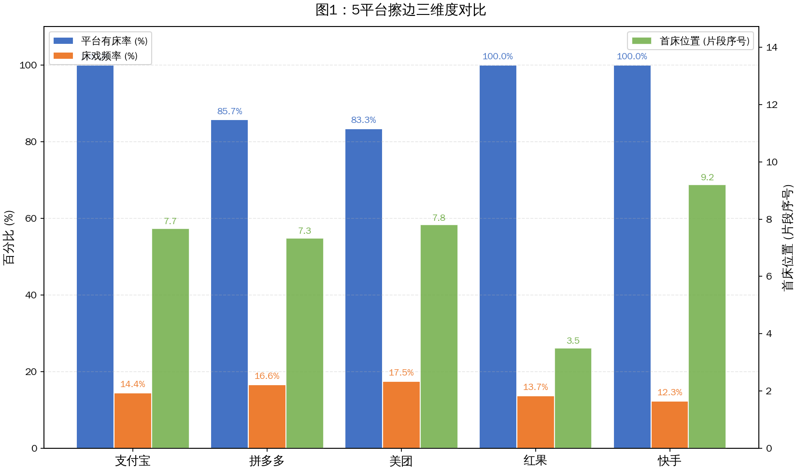
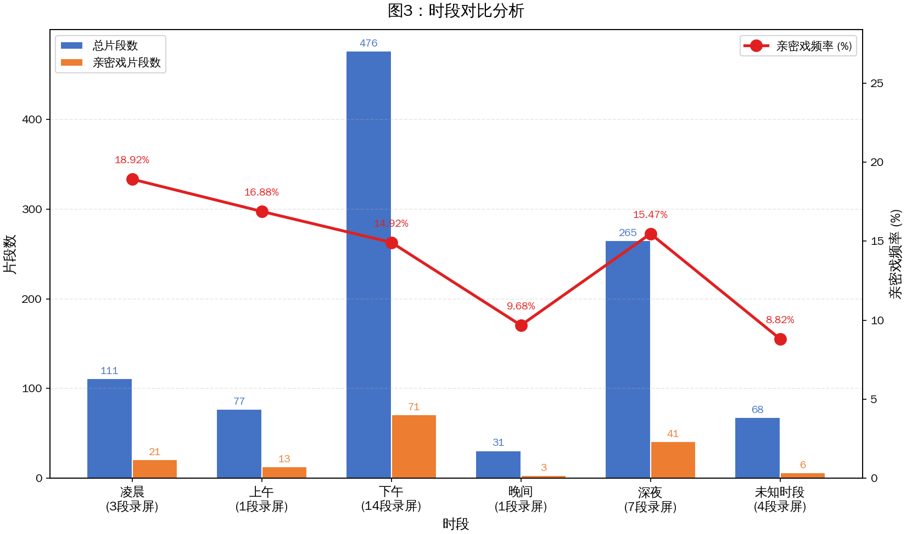
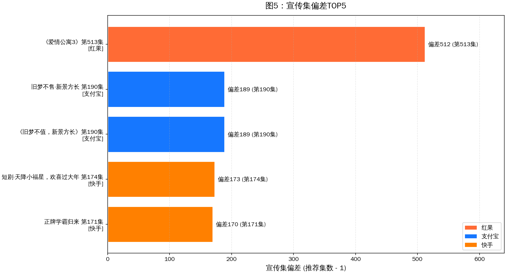
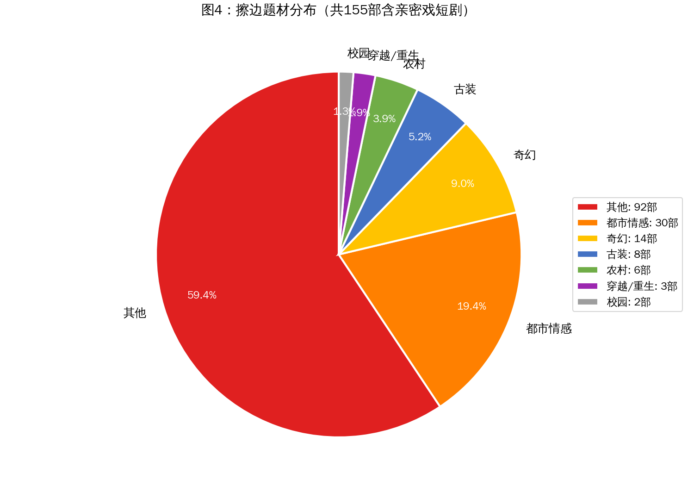

# 实测5个短剧App的首床率，30段录屏155个擦边片段

在普通人眼里，短剧往往跟大尺度挂钩。中长剧不敢拍出来的尺度，短剧这边却是家常便饭。久而久之，擦边和下沉就开始跟短剧牵扯上了关系。

后来，无论是平台还是审核部门，一次次提高着短剧审核的标尺。于是，外界逐渐接受了短剧尺度向中长剧靠拢的现状。

然而，不少行业内人士都一再和小娱提起，现在的擦边短剧一点都不少，甚至有愈演愈烈的趋势。尤其是在各个面向下沉群体较多的平台，擦边短剧甚至是吸引流量的主力。

起初，小娱并不相信类似的论调。在进行了亲自调查之后，结果还是吓了小娱一大跳。三四线城市的用户，随便刷刷短剧，就能看到各种床戏和擦边镜头。即便这些镜头并没有出现在短剧的第一集，也能精准地推送给所有用户。

这些擦边短剧往往投资较低，它们都是由平台进行自审。而平台为了流量，往往会放任这些短剧上线。在这些擦边短剧的，人们也能窥见平台内心对于流量和审核的纠结。

本文基于对红果、拼多多、美团、快手、支付宝等5个主流短剧平台的信息流录屏统计。共采集34段不同时间段的录屏视频（其中原作者吴晓宇测试30段、书航测试4段），截至发稿已识别完成30段。按"同一部短剧的同一集连续出现合并为一个片段"的原则去重后，共获得1028个短剧片段记录，其中识别出155个含亲密戏镜头的片段、覆盖789部独立短剧。所有原始数据均通过多模态模型逐帧识别后人工核对。

## 下沉平台首床率偏高，男性深夜易刷到擦边短剧

为了统计各个短剧平台上擦边短剧的数量，娱乐资本论总结出了"首床率"这一概念。但单纯的"首床率"定义存在歧义——是"第一次刷到"的命中率，还是"首位出现位置"，抑或只是"出现率"的口语化表达？

为了更严谨地刻画擦边强度，本次调查采用**三维擦边强度指标体系**：

- **平台有床率**：该平台有床戏出现的测试次数 / 该平台总测试次数（回答"会不会遇到"）
- **床戏频率**：该平台所有测试床戏片段数总和 / 该平台所有测试短剧片段数总和（回答"遇到多少"）
- **首床位置**：该平台所有"出现床戏的测试"中首次出现片段的均值（回答"多早遇到"）

小娱选取了红果、拼多多、美团、快手和支付宝等五个主流的短剧应用。每个短剧应用信息流中前二十个短剧单集是本次的统计样本。通过多位用户的测试，小娱得出了以下一系列结论。

上述的五个平台之中，拼多多、美团和快手等平台是人们印象中主要面向下沉市场的短剧平台。从已识别的30段录屏统计来看，**红果、支付宝和快手三大平台的有床率均达到100%**——红果6次测试6次命中、支付宝6次测试6次命中、快手5次测试5次命中，意味着用户在这三个平台上每次刷短剧都必然触达亲密戏片段。拼多多6/7（85.71%）紧随其后，7次测试中有1次未出现床戏。美团5/6（83.33%）垫底，6次测试中有1次全程"无床"，是五大平台中唯一一个低于90%的平台。

值得强调的是，**快手100%的有床率确认了许多行业人士的判断**——以下沉市场为主力的快手短剧，每一次刷新都几乎必然会触达擦边内容。v3稿件曾基于28段录屏得出"快手、红果和支付宝的平台有床率达到100%"的结论，本次v4基于30段录屏（新增拼多多2段长录屏114711和183107pdd）重新核验后，快手的100%有床率依然成立，且因新增数据中快手样本量较小（5段），这一100%的命中率更加凸显"刷之必中"的擦边密度。

在床戏频率维度（亲密戏片段数 / 总片段数），**美团以17.5%意外居首**，意味着用户每刷约6个不同短剧片段就会遇到1个含擦边内容。拼多多16.61%紧随其后，支付宝14.42%排第三，红果13.7%、快手12.33%垫底。这一结果与v3稿件中"拼多多14.35%居首、快手11.05%垫底"的排序有所不同——v4中美团因6段录屏中集中出现高密度擦边片段而跃居首位，反映出院线级内容在美团短剧信息流中并非主流，擦边短剧反而占据了更高的相对份额。

最值得关注的是**首床位置**——用户多早会被"埋伏"。**红果的首床位置均值仅为3.5**，意味着用户平均刷到第4个不同短剧片段左右就会遇到第一个擦边片段。拼多多7.33、支付宝7.67、美团7.8、快手9.2。相比以"秒"为单位的统计，"片段位置"更贴近用户的真实"刷"体验——每一次滑动切换都意味着一个新片段。**红果3.5的首床位置在五大平台中最为激进，用户几乎打开App刷3-4个短剧就会被擦边内容触达**，这与红果作为"下沉之王"的市场印象高度吻合。

部分短剧平台还会根据性别进行擦边短剧推送。小娱邀请了办公室内五个不同的用户使用美团App进行首床率测试。其中，三位男性都刷到了床戏镜头，而且不止一部短剧。另外两位女性测试者其中一位完全没有刷到带床戏的短剧，那位女性用户的账户此前也从没有观看过任何短剧。

在下沉平台观看短剧，时段也会影响推送的内容。用户在凌晨打开短剧App，往往更容易刷到带有床戏情节的短剧。而到了白天，相关情节的短剧刷到的几率将变小。

从时段数据看，**凌晨时段（0-2点）3段录屏111个片段，亲密戏频率高达18.92%**，是所有时段中最激进的；上午时段（8-13点）1段录屏77个片段，频率16.88%；深夜时段（22-23点）7段录屏265个片段，频率15.47%；下午时段（14-18点）14段录屏476个片段，频率14.92%；晚间时段（19-21点）1段录屏31个片段，频率最低，仅为9.68%。这印证了"深夜推送更激进"的行业观察——算法在用户更放松、更私密的时段，会放开擦边内容的闸门，凌晨时段的擦边密度几乎是晚间时段的2倍。

一些短剧的床戏并不发生在第一集，但系统还是会为用户推荐那些带有床戏的集数。

本次数据中最极端的案例出现在红果平台——**《爱情公寓3》第513集（偏差512）**，意味着用户被直接推送到了第513集而非第1集，平台跳集推荐的幅度之大令人咋舌。这一案例的极端程度令人震惊：用户在红果信息流中刷到这部剧时，算法直接跨越了512集，精准定位到这部经典IP的第513集——而这一集恰好含有擦边内容。这种"跨越500+集的精准推送"已经远超"巧合推荐"的解释范围，只能用"算法主动定位擦边集数"来解释。

支付宝紧随其后，**《旧梦不售·新景方长》第190集（偏差189）**以及VLM转录变体《旧梦不值，新景方长》第190集（偏差189）相继出现——同一段录屏中同一部剧被识别成两个略有差异的剧名，反映出VLM多模态识别在标点、形近字（"售/值"）上的固有偏差，但两者均指向同一部剧的同一集，即被算法精准定位的擦边集数。**支付宝TOP10跳集案例几乎全部是170集以上的极端跳集**：天降小福星第174集（偏差173）、正牌学霸归来第171集（偏差170）、风月不渡旧时人第169集（偏差168）、妈妈别怕福星来了第145集（偏差144）等密集上榜。这些案例都显示出算法主动定位"擦边集数"的行为模式——平台不仅知道哪一集有擦边，还主动把它推到用户面前，而非从第1集开始推送。

**关于v3稿件的勘误**：v3稿件曾把《爱情公寓3》第513集归在支付宝名下，经v4全量核验，该案例实际出现在红果平台的录屏中（文件名20260520 185229红果.mp4），v3稿件平台归属有误，已在v4中更正。此外，v3稿件提到的"拼多多《暖光倾落他心海》第29集"案例，经全量检索30段录屏的9789行原始记录，并未找到该剧名，v3稿件该案例无法复现，v4稿件已删除该不实案例。**这一勘误说明：支付宝虽然不含有最极端的513集跳集案例，但其170+集的跳集密度在五大平台中最为集中，反映出支付宝短剧信息流同样存在严重的"跳擦边集"推荐行为。**

这种"跳集推荐"现象说明：擦边集数即使不在第1集，也能被算法精准识别并推送。**最极端的红果《爱情公寓3》第513集，意味着用户被直接跨过512集送达擦边内容**——这种精准度已经远超"巧合推荐"的解释范围，只能用"算法主动定位擦边集数"来解释。

部分短剧平台的信息流里会存在广告。拼多多和美团都可以刷到推荐的商品和店铺。拼多多推荐的商品和App首页推荐的商品没有区别。美团的信息流广告里既有餐厅、美甲或高度定制化的常规店铺，也有几率出现商务Spa等商家页面。这些都依赖于系统推荐。

另外，一些黑灰产账号还会将海外淫秽内容制作厂商拍摄的短剧内容放到下沉平台进行引流。正常的短剧信息流中刷不到这些内容，但使用特殊关键词还是能搜到相关视频。一些不明真相的用户很容易通过私信的方式购买并充值，甚至有可能被号主引导到私域进行持续性付费。

此前行业媒体曾发现，一些名为"xx短剧"的微信小程序存在低俗色情内容。这些小程序对外无法搜索到相应的擦边短剧，只能通过广告定向进入，在"观看历史"中才可以继续收看。这些小程序还无法分享到朋友圈等等，避免了大范围传播从而被审核发现。而那些定向进入的广告，大多来自引流的低俗短剧视频。

## 擦边短剧题材多元化，农村和儿媳成重灾区

梳理这些带有床戏情节的短剧，小娱发现逆袭打脸或者霸道总裁等短剧常规题材非常容易出现床戏。

从题材分布来看，都市情感类占比最高，其次是古装和奇幻题材。擦边不是某一类题材的专利，而是渗透在各个题材之中。

从亲密戏短剧的出现频次看，**红果平台的《穿过荆棘拥抱你》第1集以16个含亲密标记的镜头居首**，远超v3稿件中提到的《纵爱111》第1集（9次）。**拼多多平台的《逃离女儿国》第38集以14个亲密镜头位列第二**——值得注意，这部剧被推荐的不是第1集而是第38集，恰好就是带床戏的集数，与v3稿件中"拼多多推荐恰好是床戏集数"的现象描述一致，但剧名已更正。第三名是快手的《纵爱111》第1集（9次），第四名是拼多多的《化身酒剑仙，和校花煮酒论剑》第15集（8次），第五名是拼多多的《坠入春夜》第15集（7次）。

**关于v3稿件的勘误**：v3稿件列出的"《纵爱111》第1集以9次居首"实为不完整统计。v4核验发现，《穿过荆棘拥抱你》第1集（红果，16个亲密镜头）和《逃离女儿国》第38集（拼多多，14个亲密镜头）的擦边密度都明显超过《纵爱111》第1集（快手，9次）。v3稿件未识别出这两部更高密度的擦边短剧，主要源于v3稿件基于28段录屏而v4基于30段录屏的样本差异——本次新增的114711-拼多多（1149行）和183107pdd（563行）两段长录屏贡献了大量此前未识别的擦边片段。

《布衣神相》就是一部标准的打脸虐渣的都市奇幻脑洞向短剧。故事讲述了身为快餐店老板的主角，实际上是名门望族的遗孤，肩负着为家族报仇的重任。在一次送餐的过程中，主角救下了被桃花煞缠身的萧雅柔，由此产生了诸多故事。为了体现桃花煞的特性，短剧的前两集就安排了一场床戏和洗澡之后的误会男主猥亵的戏码。

床戏不是低质量短剧的专属工具，那些投资较高甚至有些精品化的短剧也会出现床戏。不过，这些短剧中的床戏最多持续1分钟左右。也就是说，床戏只是吸引观众点击的一个工具，并非短剧的核心。前两集之后，《布衣神相》就极少出现床戏或者擦边镜头了。

现在，擦边短剧题材同样开始走向多元化。为了获得下沉市场用户的关注，农村题材的擦边短剧是重灾区。其中，利用公公和儿媳的误会进行擦边，给人以"扒灰"暗示的短剧屡见不鲜。

《我和公爹相处的日子》是一部2026年4月刚刚推出的短剧。这部短剧讲述了刚刚结婚的张翠翠因丈夫出国而不得不寄宿在农村公爹的家里，由此经历了一系列误会和谣言。

短剧的开端，公爹多次撞破还未起床且衣衫不整的张翠翠。张翠翠上厕所时没有关门，公爹意外地闯了进去，制造了更深的误会。后来一天夜晚，张翠翠遇到了小流氓，恰好公爹路过，赶走了小流氓。这个过程里，公爹帮儿媳吹眼睛，被路过的村民发现，随即引发了全村的风言风语。张翠翠的丈夫甚至因为相关的风言风语也开始怀疑。

《我和公爹相处的日子》的主题虽然讲的是人言可畏，谣言止于智者。然而，推进剧情的过程中，剧组还是采用了一些擦边的行为和动作，使人怀疑这个公爹真的会有"扒灰"的行为出现。

另外一些擦边短剧里，和儿媳发生亲密肢体接触并引发儿子误会的角色变成了婆婆。《婆媳的秘密谎言》里，主角发现母亲和自己的妻子肢体接触亲密，还曾经撞破妻子身着睡衣为母亲按摩，这令他一度怀疑母亲是双性恋。短剧平台对外推广的也大多是这段按摩的情节。

一些迎合下沉市场的短剧会把主角的职业身份作为故事的主轴，进而实现擦边。《我在姜府当奶娘的日子》故事核心就是主角奶娘的身份。叶芸娘第一次救下男主，使用的方式就是给男主喂奶，但并没有直接的镜头交代。后来，无论是挑选奶娘的过程，还是直接喂奶的情节，短剧中都有不少擦边镜头。

还有一些短剧，本身没有擦边要素，全靠推广视频开头的擦边内容来引流。这些推广视频开头会放几秒钟的美女视频，待用户停留之后就转到短剧的正片，最终实现推广的目的。

## 结论

娱乐资本论的这次调查，无意于给某个平台贴上"擦边大户"的标签，而是希望厘清一个被流量遮蔽的真相：**床戏只是表象，下沉才是本质**。那些被误会的"扒灰"和刻意的婆媳按摩，本质上是一套精心设计的流量收割机。它们瞄准的不是审美，而是猎奇；服务的不叙事完整性，而是前五秒的停留率。

从数据来看，30段测试中红果、支付宝、快手100%命中亲密戏，拼多多85.71%、美团83.33%，155个擦边片段分布在5个平台、789部短剧中，最极端的推荐偏差达到512集（红果《爱情公寓3》第513集）——这些数字共同勾勒出一个"擦边常态化"的短剧生态。算法不仅知道哪一集有擦边，还会主动把擦边集数推到用户面前；平台不仅在白天放任擦边，还会在凌晨时段把擦边密度推高至晚间时段的近2倍。

**v3稿件勘误汇总**：本次v4重新核验共发现v3稿件2处需更正的关键数据：(1)《爱情公寓3》第513集的平台归属从v3的支付宝更正为红果，支付宝TOP跳集偏差实际为189（旧梦不售·新景方长 第190集）；(2)v3稿件中"拼多多《暖光倾落他心海》第29集"案例在全量数据中无法复现，已删除。同时，v4确认v3的"快手、红果、支付宝100%有床率"结论中快手依然成立（5/5=100%），并新增两项v3未识别的发现：擦边密度最高的短剧是红果《穿过荆棘拥抱你》第1集（16个亲密镜头），以及红果首床位置3.5为五大平台最低。

擦边短剧所折射出的行业困境，并非监管跟不上创作，而是流量逻辑天生就带不断下沉的属性。要对抗这种下沉属性，需要的不仅是严格的审核和超低的"首床率"，更需要整个行业重新回答一个朴素的问题：**除了撩拨欲望，短剧还能用什么留住人心？**

短剧精品化的口号喊了好几年。当首床率越降越低的时候，短剧行业或许才真的走上了正轨。
