<!--
来源: https://resonate.feishu.cn/wiki/Loxfw6XHziYRk0kKzdjcFfp9nhb
平台: 飞书文档 (resonate.feishu.cn)
抓取时间: 2026-09-23 04:42 UTC
离线归档: 图片等资源已本地化至 _files_ 文件夹
-->

**LibTV使用指南**

<table>
<colgroup>
<col style="width: 100%" />
</colgroup>
<tbody>
<tr class="odd">
<td>
<strong>LibTV 官网直达：https://www.liblib.tv/（推荐使用Chrome/Edge浏览器，更稳定）</strong>

<strong>LibTV Plugin / CLI： <a href="https://www.liblib.tv/plugin">https://www.liblib.tv/plugin</a></strong>

<strong>最新CLI指南：<a href="https://resonate.feishu.cn/wiki/RjelwT2UoidnTMka2nCc2chGnud">LibTV CLI 使用指南</a></strong>
</td>
</tr>
</tbody>
</table>

<table>
<colgroup>
<col style="width: 36%" />
<col style="width: 63%" />
</colgroup>
<tbody>
<tr class="odd">
<td><table>
<colgroup>
<col style="width: 100%" />
</colgroup>
<tbody>
<tr class="odd">
<td>
<strong>🌈 【最新功能直达】：</strong>

<a href="https://resonate.feishu.cn/wiki/Loxfw6XHziYRk0kKzdjcFfp9nhb?contentTheme=DARK&amp;last_doc_message_id=7673418612472548340&amp;preview_comment_id=7673418969558125747&amp;sourceType=feed&amp;theme=light#share-JzEld3iBPo8GAFxpuYnc9uMDn4c"><strong>片段重拍</strong></a>

<a href="https://resonate.feishu.cn/wiki/Loxfw6XHziYRk0kKzdjcFfp9nhb?contentTheme=DARK&amp;last_doc_message_id=7673418612472548340&amp;preview_comment_id=7673418969558125747&amp;sourceType=feed&amp;theme=light#share-DxgqdVsrYoOVqyxRtdqcfWbdntb"><strong>智能引用 AutoLink</strong></a>

<a href="https://resonate.feishu.cn/wiki/Loxfw6XHziYRk0kKzdjcFfp9nhb?contentTheme=DARK&amp;last_doc_message_id=7673418612472548340&amp;preview_comment_id=7673418969558125747&amp;sourceType=feed&amp;theme=light#share-KJwEdzHMuo47muxgI1BcBE8xncd"><strong>逐帧拉片</strong></a>

<a href="https://resonate.feishu.cn/wiki/Loxfw6XHziYRk0kKzdjcFfp9nhb?contentTheme=DARK&amp;last_doc_message_id=7673418612472548340&amp;preview_comment_id=7673418969558125747&amp;sourceType=feed&amp;theme=light#share-UQvMdznu9ozMlBxijjscLUUlntg"><strong>智能剪辑</strong></a>

<a href="https://resonate.feishu.cn/wiki/Loxfw6XHziYRk0kKzdjcFfp9nhb?contentTheme=DARK&amp;last_doc_message_id=7673418612472548340&amp;preview_comment_id=7673418969558125747&amp;sourceType=feed&amp;theme=light#share-GvDWdNpdZopT6yxe753cnbJPnFr"><strong>超长 5min 视频直出</strong></a>
</td>
</tr>
</tbody>
</table></td>
<td>
<strong>👩🏻‍💼 【在线客服】</strong>问题反馈 / 功能建议 / 产品咨询

<table>
<colgroup>
<col style="width: 100%" />
</colgroup>
<tbody>
<tr class="odd">
<td>LibTV 首页 → 左下角「帮助」→ 联系客服</td>
</tr>
</tbody>
</table>

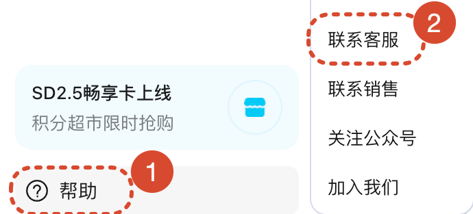
</td>
</tr>
</tbody>
</table>

**📅 更新公告：**

||
||
||
||
||
||
||
||
||
||
||
||
||
||
||
||
||
||
||
||
||
||
||
||
||
||
||
||
||
||
||
||
||
||
||
||
||
||
||
||
||
||
||
||
||
||
||
||
||

欢迎使用 **LibTV**！

LibTV 是 LiblibAI 推出的**首款专业 AI 视频创作产品**，也是目前**唯一一个同时为人类创作者和 Agent 设计的视频创作系统**。

作为一款诞生在 2026 年的产品，LibTV 理所当然地拥有两个同样重要的入口：

**对创作者来说**，它是一套专业的视频创作工具，足以容纳整个 AI 视频创作流程，你可以在无限画布上搭建剧本、分镜、镜头和剪辑流程，像排练电影一样组织整个创作项目。

**对于 Agent 来说**，它是很多打包好的、可以直接调用的专业创作能力，通过 Skill 接口理解任务、调用模型、编排工作流并自动完成创作。

是的，**你和你的 Agent 现在都可以 solo filming 了！**

**\[该类型的内容暂不支持下载\]**

**📖 指南目录（点击标题可直接跳转到对应内容）**

||
||
||

1\. **无限画布**

1.1 **新建画布**

进入LibTV首页，在【最新项目】中点击「开始创作」，进入无限画布操作界面

【全部项目】入口

官方首页-最近项目-右侧「全部项目」图标

项目画布-左上角项目菜单栏-「全部项目」

1.2 **五大基础节点 🔥**

无限画布是我们创作的主战场，我们可以进行：

**新建节点：**支持**文本、图片、视频、音频、脚本** 5 种基本节点

**节点编辑：**对节点进行修改、删除、复用，以及不同节点的联系

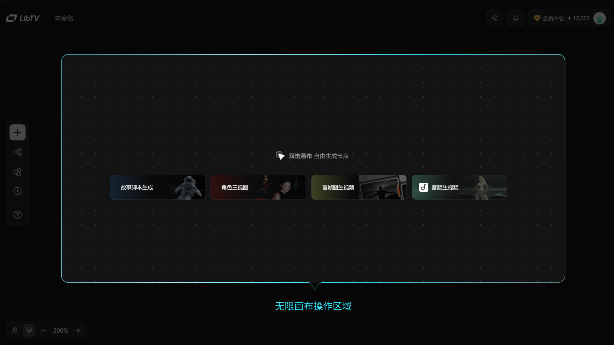

1.2.1 **新建节点**

**在画布空白处双击**，即可快速新建节点。

目前 LibTV 支持 **文本、图片、视频、音频、脚本** 5 种基本节点

我们可以直接将图片、视频、音频文件拖入画布

> 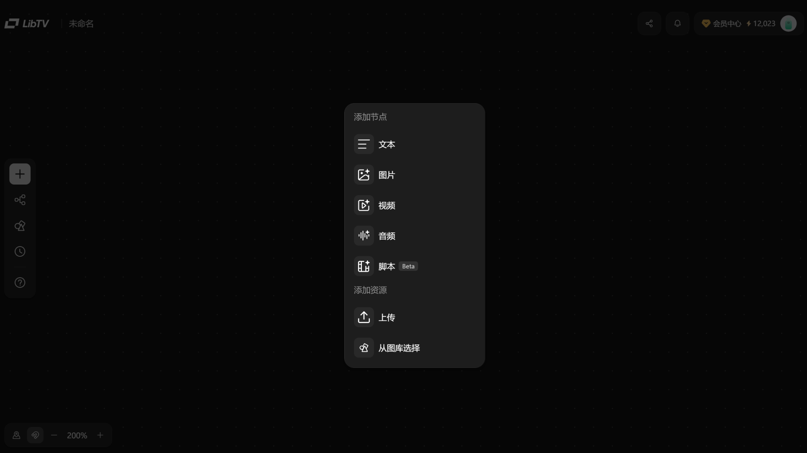

1.2.2 **文本节点 📝**

> **功能：用于承载、展示文本信息，来源可以是用户手动输入、模型生成**
>
> 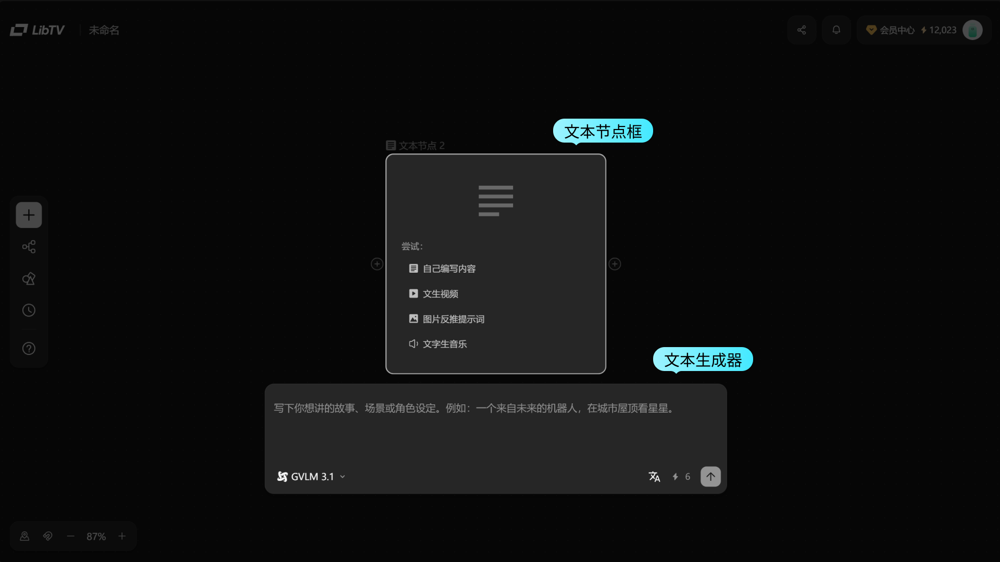
>
> **两种不同的文本输入方式**
>
> **1️⃣ 手动输入**：选择「自己编写内容」，然后在节点框内手动输入或粘贴文本内容
>
> 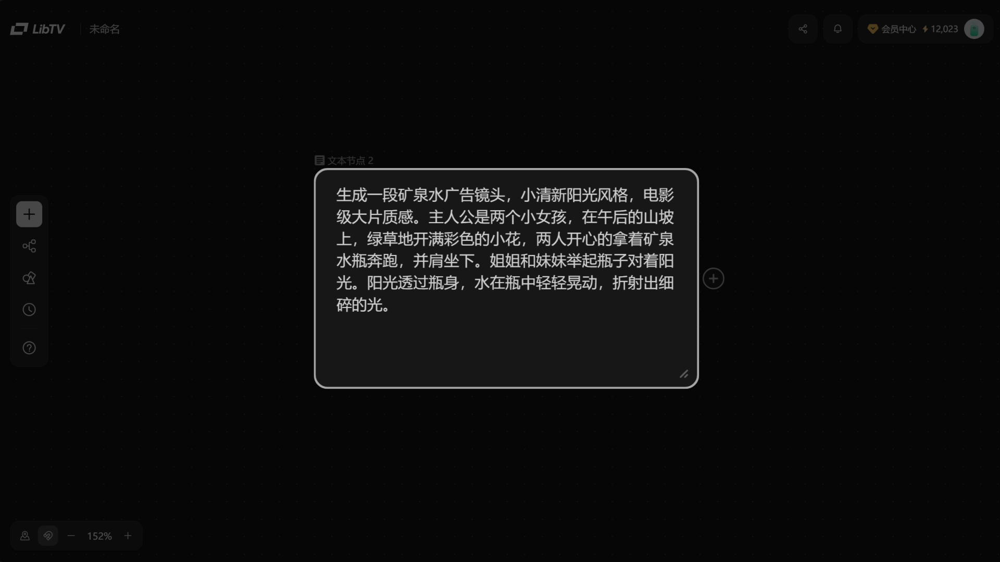
>
> 2️⃣ **语言大模型生成**：

文本生成器接入了三大顶尖**大语言模型**，我们可以**输入自然语言需求或结构化提示词**，让语言模型完成对应的文本生成任务，

生成结果会展示在「**文本节点框**」中

**\[文本模型3.mp4.MP4\]**

1.2.3 **图片节点 🖼️**

**功能**：用于承载、展示单张图片，来源可以是用户上传、图像模型生成。

> 
>
> **两种不同的图片输入方式：**
>
> 1️⃣ **用户直接上传：**可以直接从画布外拖入图像，或者在画布空白处点击鼠标右键，选择「上传」
>
> 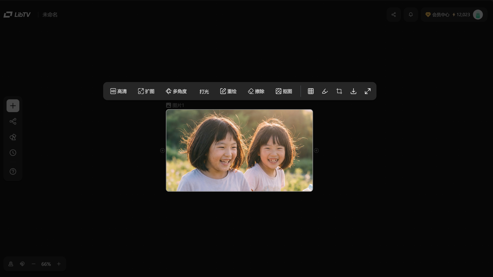
>
> **2️⃣ 图像模型生成**：

图片生成器中接入了**全能图片模型V2、Seedream5.0/4.5、Qwen image、Z image** 等大模型

支持各种文生、图生、多图参考融合、图像编辑任务

生成结果会展示在**「图片节点框」**中

**\[文生图 .mp4.MP4\]**

1.2.4 **视频节点 🎥**

> **功能**：用于承载、展示单个视频，来源可以是用户上传、视频模型生成。
>
> 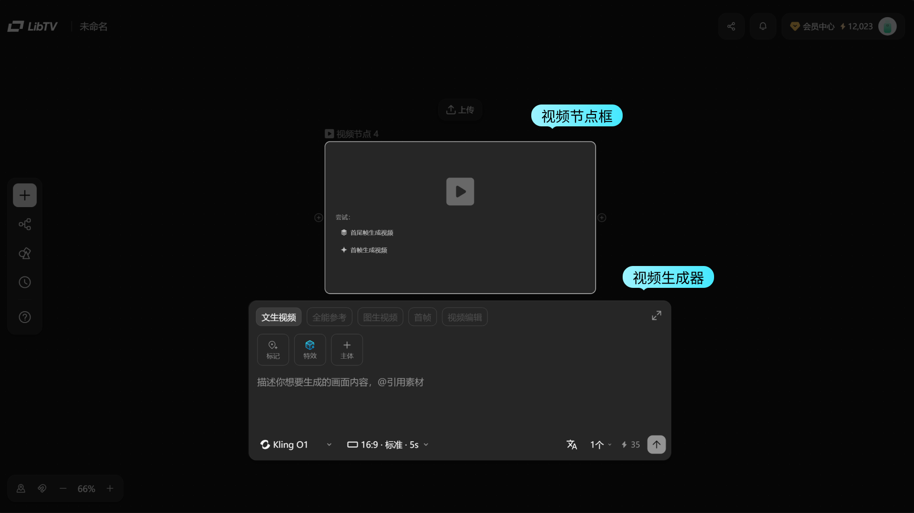
>
> **两种不同的视频输入方式：**
>
> 1️⃣ **用户直接上传**：可以直接从画布外拖入视频，或者在画布空白处点击鼠标右键选择「上传」。
>
> 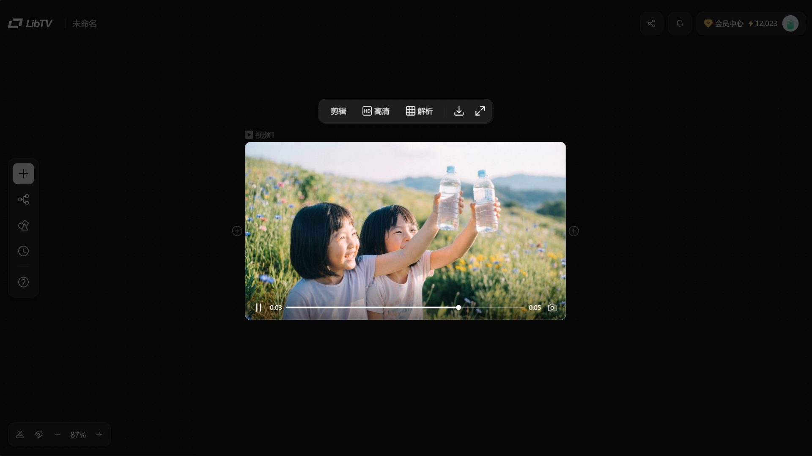
>
> 2️⃣ **视频模型生成：**

视频生成器中接入了 **可灵 3.0 & O3、Wan 2.6、Shot V2 ☁️、Video 3.1🍌** 等顶级视频模型

支持各种文生、图生、首尾帧、**多模态参考生成视频**，以及视频编辑、视频延展等操作

生成结果会展示在**「视频节点框」**中

**\[一图生视频.mp4.MP4\]**

**\[两图生视频.mp4\]**

1.2.5 **音频节点 🎵**

**功能**：用于承载、展示单个音频，来源可以是用户上传、音频模型生成。

> 
>
> **两种不同的音频输入方式：**
>
> 1️⃣ **用户直接上传**：可以直接从画布外拖入音频，或者在画布空白处点击鼠标右键，选择「上传」
>
> 

**2️⃣ 音频模型生成：**

支持文本生成生成音乐、音效，以及文字转语音

**\[音频模型.MP4\]**

1.2.6 **脚本节点 🎬**

**脚本功能（新版）**

**功能概述：从“基础脚本工具”升级到“分镜故事板脚本工具”。**

新版脚本不只是把剧本拆成表格，而是把剧本拆解、剧本资产管理、分镜头调整、提示词合成、批量生图、批量生视频串成一条完整流程。

适合流水漫、AI 短剧、动画短片、故事分镜等内容创作场景，可以更快完成：剧本拆解 → 角色/场景/道具资产提取 → 分镜脚本调整 → 批量生成分镜图 → 批量生成视频片段。

对比脚本旧版 解决的问题

针对收集的用户问题，新版脚本方案围绕四个关键词展开：**<u>资产化、可编辑、可批量、灵活修改</u>**

**资产化**：将脚本从“纯文本表格”升级为“内容 + 资产”结构，风格、角色、场景、道具等资产与脚本绑定并可被提示词引用；

**可编辑**：脚本的每一行、每一个字段、每一个资产都可以被用户修改，修改后能同步更新对应的提示词；脚本中的分镜支持新增、删除、调整顺序。

**可批量**：用户可批量执行分镜图和分镜视频的生成。可自由选择生成范围（单个/部分/全部）、生成类型（批量生图、批量生视频）、以及批量执行的模型类型。

**灵活修改：**新版脚本可以在批量生成前直接补充和调整，用户可在真正批量生图、生视频前，把角色、场景、提示词、参考图都修改补充到比较稳的状态，再进入生产。

三、使用方式功能介绍

**第 1 步：添加脚本节点**

**可通过两种方式**添加脚本节点：

第一种，<u>双击画布，或者打开底部的 “+”，选择「脚本 new」</u>。

第二种，先把剧本文本输入到一个文本节点里，再从文本节点<u>拉出一条线，选择「脚本 new」</u>。

脚本节点的**前置输入**可以是一段**剧本文本**，也可以同时接入一些**参考图**，比如角色图、场景图、风格图等。

如果只是想快速拆分镜，输入剧本文本就可以开始。

如果希望后续生成的角色、画风、场景更稳定，建议在一开始就把关键参考图接进去，这样脚本节点在拆解时也可以更好地理解整体风格和角色设定。

|                                                                                                                                                                       |                                                                                                                                                                       |
|-----------------------------------------------------------------------------------------------------------------------------------------------------------------------|-----------------------------------------------------------------------------------------------------------------------------------------------------------------------|
| 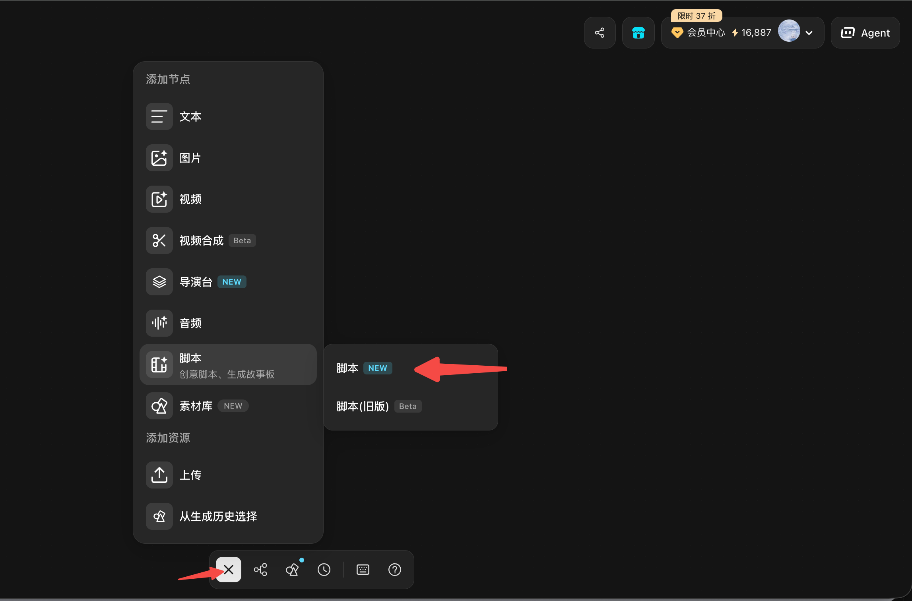 | 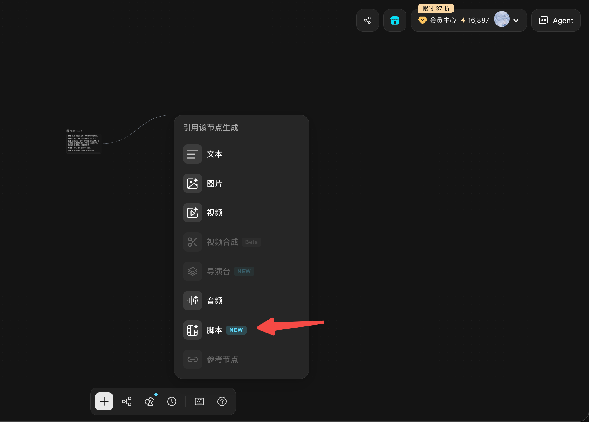 |

**第 2 步：开始生成**

将文本、图片节点<u>与脚本节点连接后</u>**，**或者直接在脚本节点的<u>生成器输入框内输入剧本内容</u>，选择合适的脚本拆解模型，**<u>点击生成。</u>**

**模型的选择**：推荐优先选择<u>CVLM5.5 或 GVLM 3.1</u>

生成后，脚本节点会自动完成几件事：

把剧本文本拆成结构化 shot；

提取关键角色、场景、道具；

整理每个 shot 对应的画面信息；

为后续生图、生视频准备基础提示词。

这一步相当于先把一段完整剧本拆成一份可编辑的分镜故事板。

**第 3 步：编辑脚本节点**

**这一步是后续生成是否准确的关键。**

脚本节点生成出来后，**不建议直接批量生图/视频**。更好的方式是先检查 shot 信息，管理好角色、场景、道具等资产，再进入后面的批量生成。

因为后续所有分镜图和视频片段，都会基于这里的信息继续生成。如果这里的角色描述不准、场景不清楚、镜头动作太弱，后面批量生成就会把这些问题放大。

<table>
<colgroup>
<col style="width: 9%" />
<col style="width: 90%" />
</colgroup>
<tbody>
<tr class="odd">
<td>生成脚本</td>
<td>
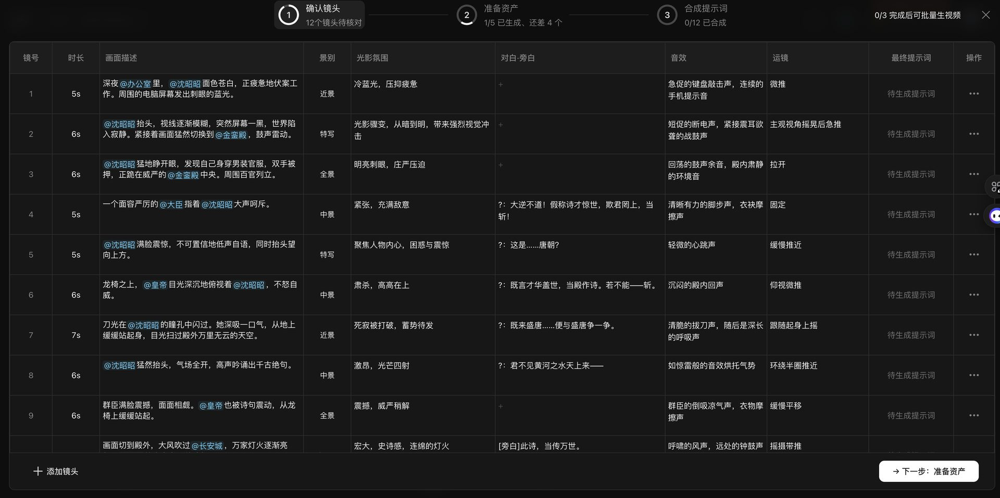

在脚本中需要先后完成三件事情，顶部工具栏也有提示：确认镜头信息，整理资产，合成最终提示词。

只有把这三件事情都完成以后，才能进行下一步。
</td>
</tr>
<tr class="even">
<td>编辑shot信息</td>
<td><table>
<colgroup>
<col style="width: 50%" />
<col style="width: 49%" />
</colgroup>
<tbody>
<tr class="odd">
<td>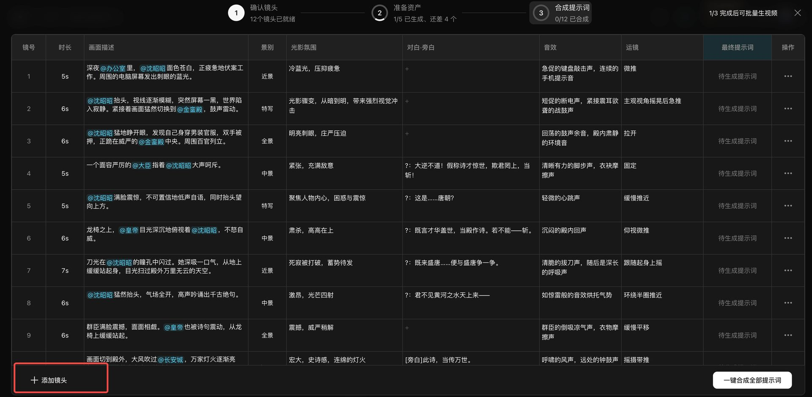</td>
<td>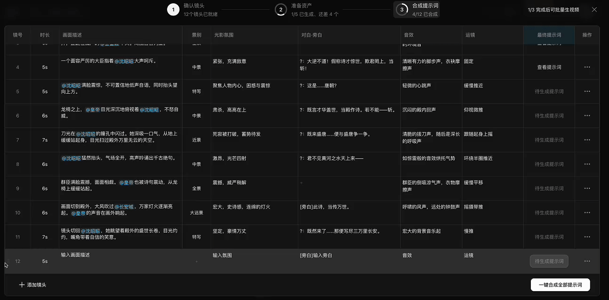</td>
</tr>
</tbody>
</table>

每个单元格都可以直接编辑。

可以修改角色动作、镜头景别、人物状态、画面氛围、对白/旁白、提示词等内容。

如果要使用资产卡片中的角色、场景、道具，可以直接@进行唤起，这样在后续的生成中，会自动识别资产卡片，并自动连线。

支持的整行操作包括：

调整顺序：可以根据故事节奏重新排列 shot，不需要重新生成整份脚本。

新增 shot： 如果发现某段剧情转场太快，可以手动补一个过渡镜头。

删除 shot： 如果某些镜头重复、无效，或者不打算生成，可以直接删除。

标记颜色

<blockquote>

可以把同一个场景、同一组剧情、同一类镜头标成同一种颜色，方便管理。 
比如把“客厅场景”的 shot 标成一种颜色，把“街道追逐”的 shot 标成另一种颜色，后续检查时会更直观。

</blockquote></td>
</tr>
<tr class="odd">
<td>编辑角色/场景图</td>
<td><table>
<colgroup>
<col style="width: 52%" />
<col style="width: 47%" />
</colgroup>
<tbody>
<tr class="odd">
<td>
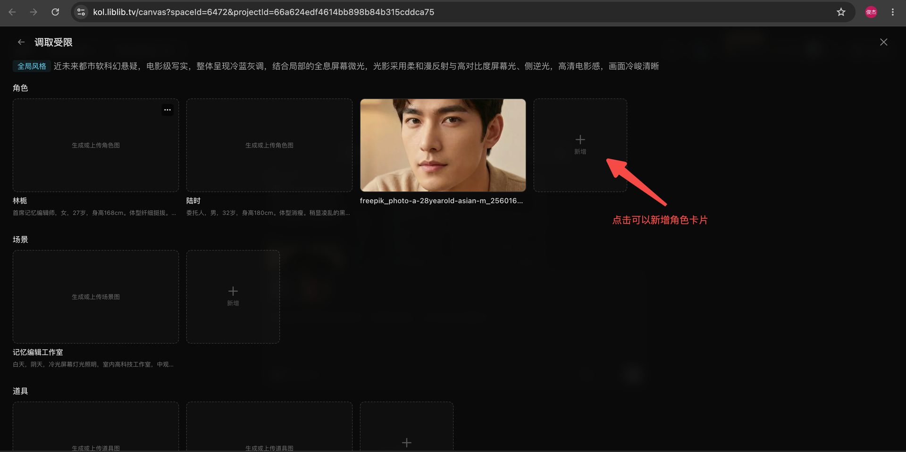

增加角色/场景/道具卡入口
</td>
<td>
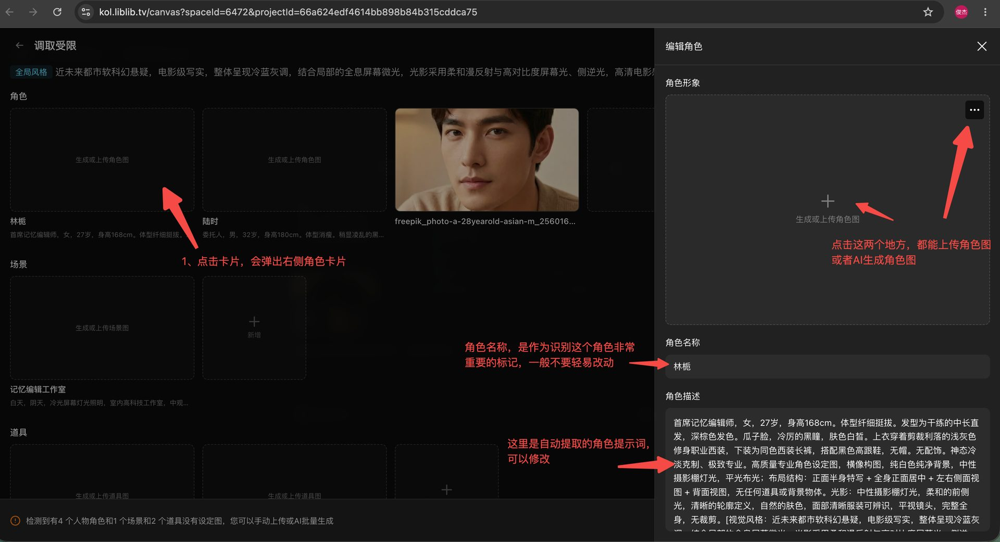

操作按钮介绍
</td>
</tr>
</tbody>
</table>
<table>
<colgroup>
<col style="width: 48%" />
<col style="width: 51%" />
</colgroup>
<tbody>
<tr class="odd">
<td>
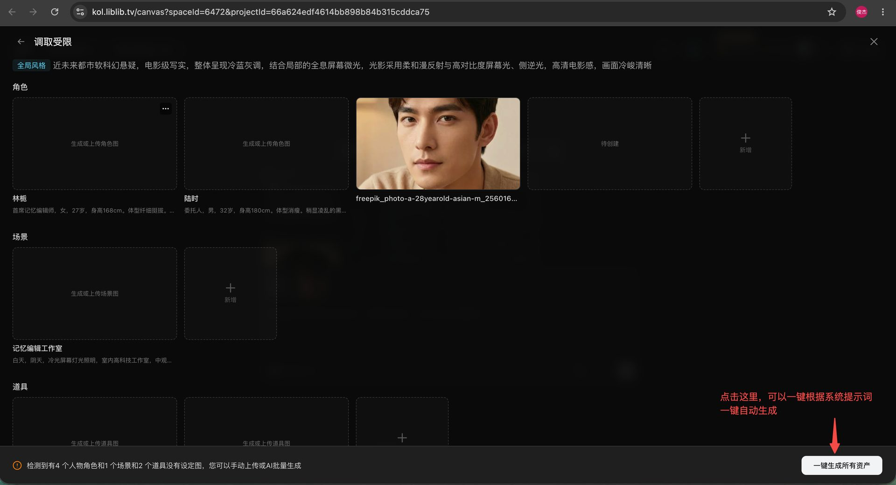

一键生成资产
</td>
<td>
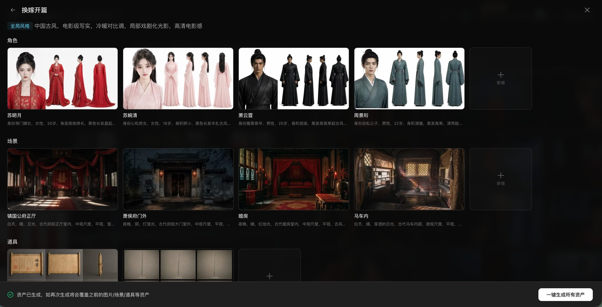

资产生成完毕后
</td>
</tr>
</tbody>
</table>

点击对应的资产卡片，在右侧会弹出一个卡片抽屉。可以在卡片抽屉中进行资产的管理。

角色、场景、道具生成：

若未上传任何参考图，脚本会自动根据剧本抽取出主要角色，并将生成角色的提示词准备好。可直接使用准备好的提示词进行生成。

若已经上传了参考图，会默认填入对应的资产卡片中。

同时也支持用户自主上传已有角色，或者直接从画布选择。

提示词：

卡片抽屉里会默认展示脚本抽取角色带的默认提示词，用户也可自主修改。

此处的提示词，在点击下载脚本的时候会保存到表格中。
</td>
</tr>
<tr class="even">
<td>合成最终提示词</td>
<td><table>
<colgroup>
<col style="width: 48%" />
<col style="width: 51%" />
</colgroup>
<tbody>
<tr class="odd">
<td>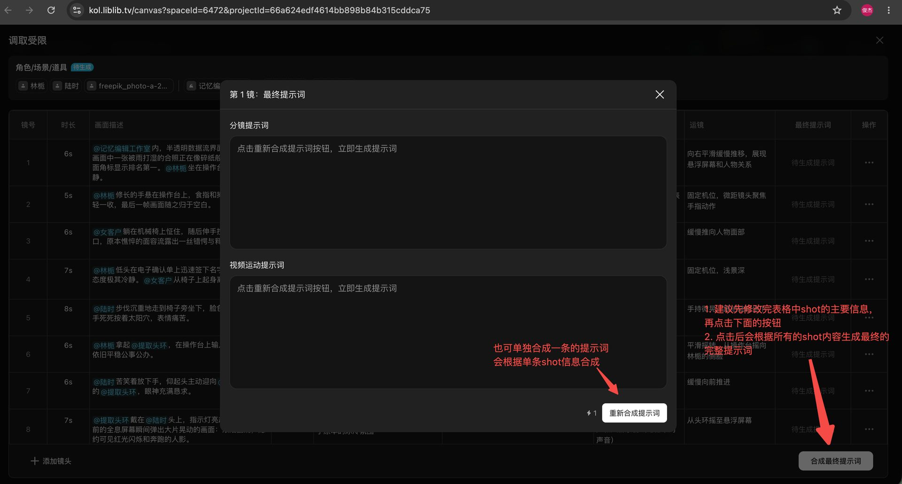</td>
<td>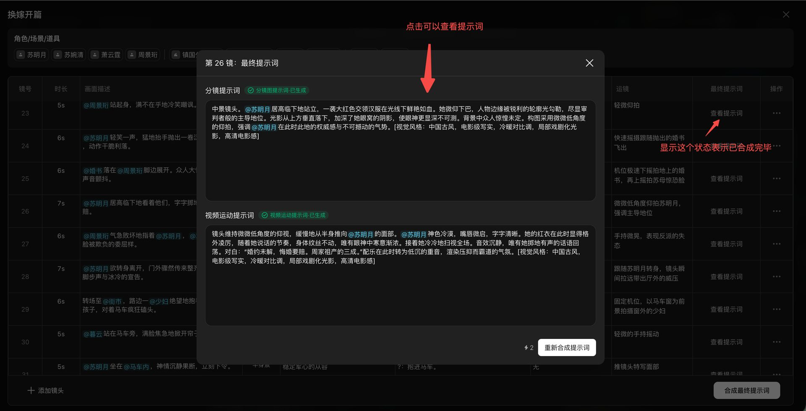</td>
</tr>
</tbody>
</table>

当 shot 信息和资产信息都调整好之后，可以合成最终提示词。

最终提示词不是简单复制某一行脚本，而是会综合以下信息综合生成：

当前 shot 的画面内容；

当前 shot 关联的角色、场景、道具；

整体风格设定。

在这里合成的是一份更完整的画面和视频的提示词。

如果发现某个镜头画面不够明确，可以在下一步点击批量生成的时候，这部分的词会贯入到生成器中，可以在生成器信息确认环节进行手动修改。<strong>本期暂不支持在这里修改。</strong>
</td>
</tr>
</tbody>
</table>

第 5 步：批量生分镜图

等上一步镜头资产和最终提示词信息确认完毕之后，就可以选择批量生成分镜或者是批量生成视频了。

选择对应的镜头和对应的模型后，点击【确认并创建生成器组】，会在画布上创建一组生成器组。

注意：这里面不是空的生成器，这是一个将资产连线、脚本中的提示词、对应选择的生成器参数（模型、尺寸、分辨率等）都带过来的生成器。**<u>点击选中对应的生成器即可查看。</u>**

在这一步，用户可以自主补充更多的参考图信息，调整单独分镜的生成器参数，微调提示词信息等。

若**解组不会让生成器中的信息消失，**这是一个普通的组。

信息的流动是从脚本到分镜组的，如果在生成器内修改了信息，是**不会向上传递**给上游的脚本传递的。

对于短剧、漫剧、动画短片来说，这条链路可以减少很多重复操作：不用每个镜头都手动复制提示词，也不用在多个节点之间来回找角色和场景信息。

|                                                                                                                                                                       |                                                                                                                                                                       |
|-----------------------------------------------------------------------------------------------------------------------------------------------------------------------|-----------------------------------------------------------------------------------------------------------------------------------------------------------------------|
| 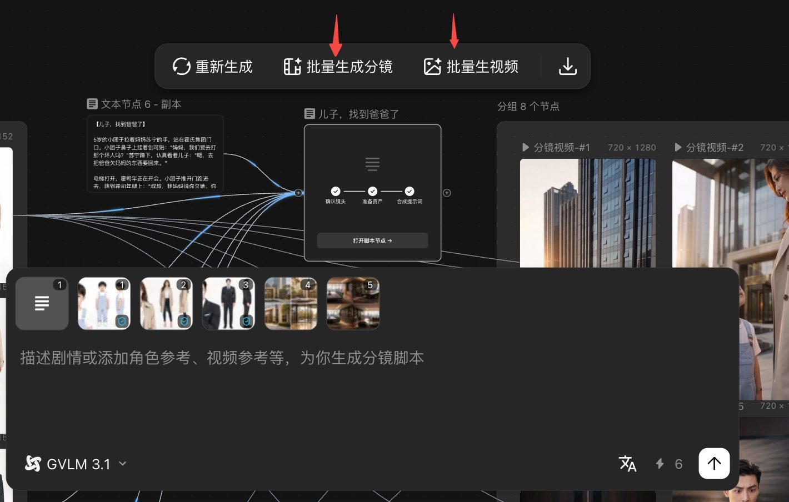 | 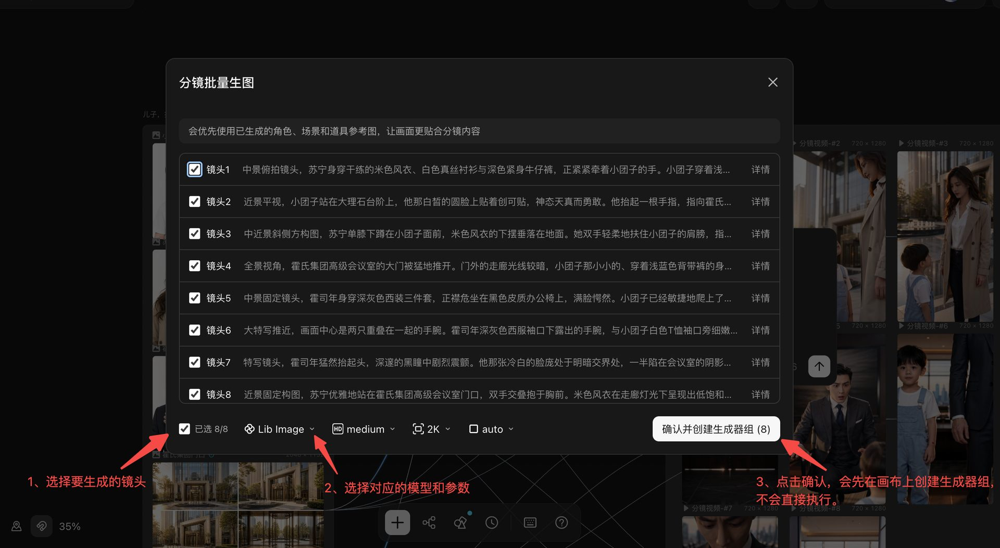 |

|                                                                                                                                                                     |                                                                                                                                                                     |
|---------------------------------------------------------------------------------------------------------------------------------------------------------------------|---------------------------------------------------------------------------------------------------------------------------------------------------------------------|
| 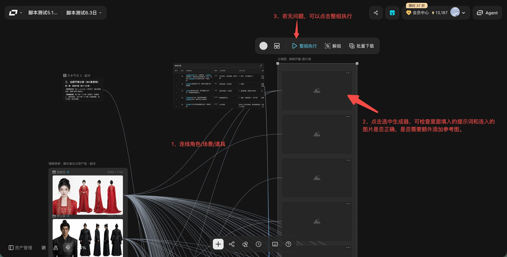 | 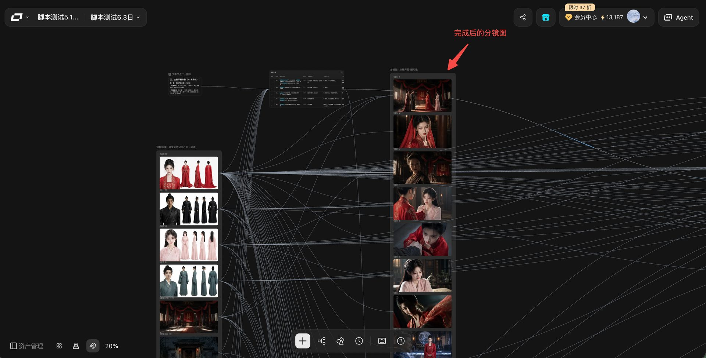 |

第 6 步：批量生视频

批量生成视频与批量生分镜图的步骤一样。

本期没有直接从分镜图生成视频的链路。但可以将生成好的分镜图对应连接到分镜视频中，作为参考图传递给分镜视频，这样效果的准确度会更好。

视频生成完成后，可以继续把片段合成为完整视频。

|                                                                                                                                                                     |                                                                                                                                                                  |                                                                                                                                                                  |
|---------------------------------------------------------------------------------------------------------------------------------------------------------------------|------------------------------------------------------------------------------------------------------------------------------------------------------------------|------------------------------------------------------------------------------------------------------------------------------------------------------------------|
| 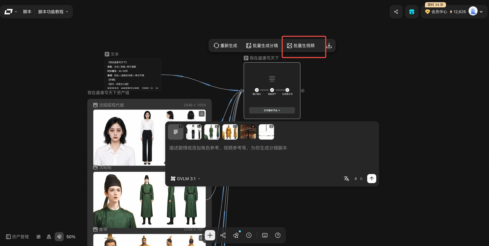 | 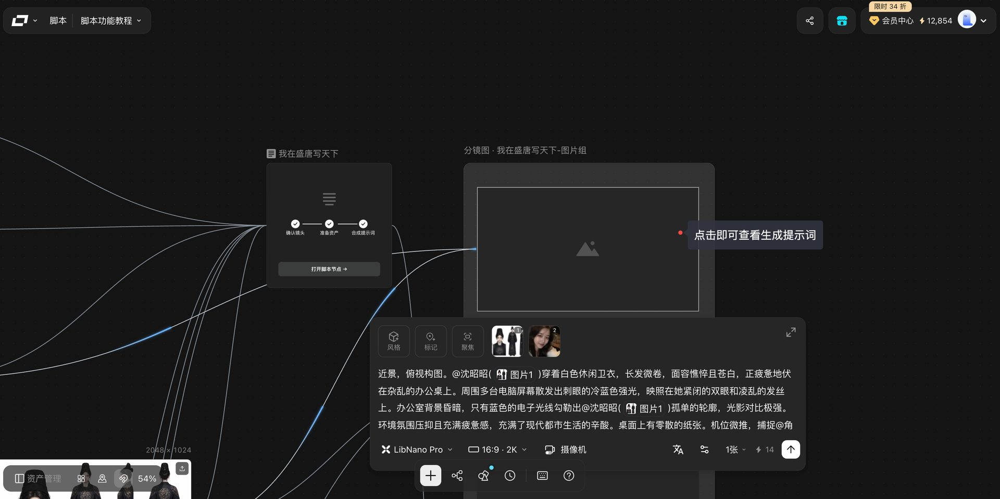 | 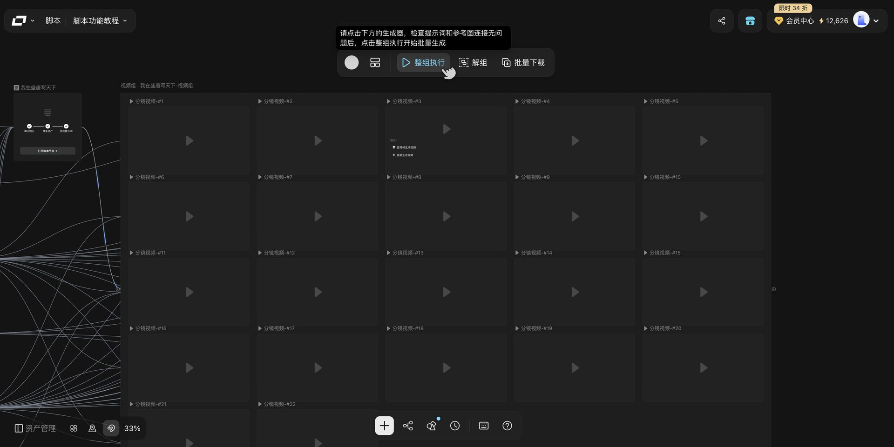 |

四、核心亮点

亮点 1：自动生成 角色、场景、道具，一致性调用

过去 AI 生成的脚本是"一锤子买卖"——不满意只能重新生成。现在不一样：

脚本里的**角色、场景、道具**都被拆成独立“资产”，可以单独修改、替换、复用

改一处，自动同步到所有相关画面

**角色、风格、场景、道具**等在每个分镜里**保持一致，**不会“换个镜头换张脸”

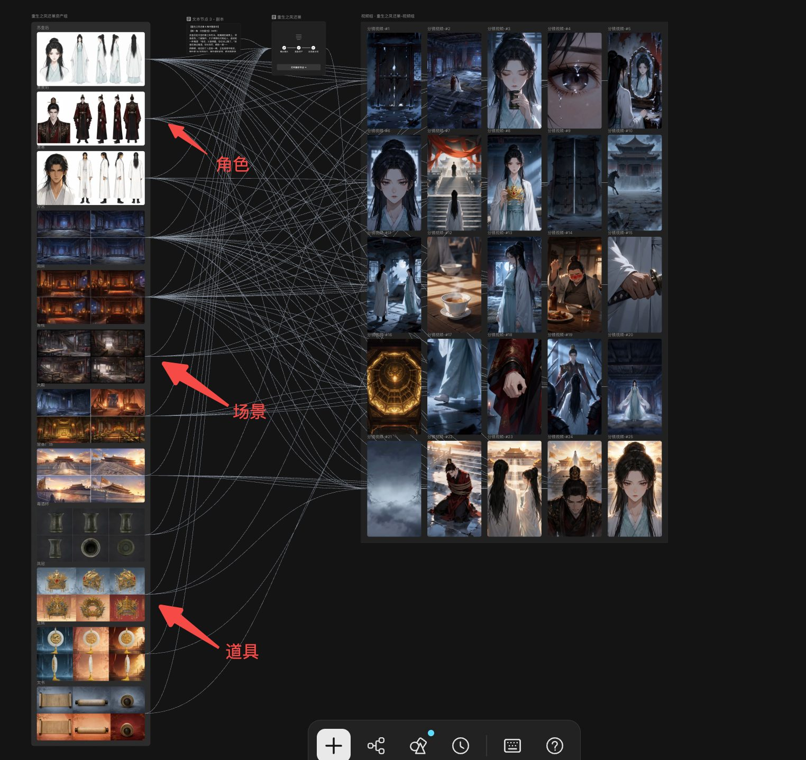

亮点 2：风格参考全局统一

整部片子锁定**统一视觉风格**(真人 / 二次元 / 3D / 水彩等)

角色、场景、道具全部继承同一套风格基调

画面之间衔接自然，不会一个镜头一个画风

|                                                                                                                                                                       |                                                                                                                                                                       |                                                                                                                                                                       |
|-----------------------------------------------------------------------------------------------------------------------------------------------------------------------|-----------------------------------------------------------------------------------------------------------------------------------------------------------------------|-----------------------------------------------------------------------------------------------------------------------------------------------------------------------|
| 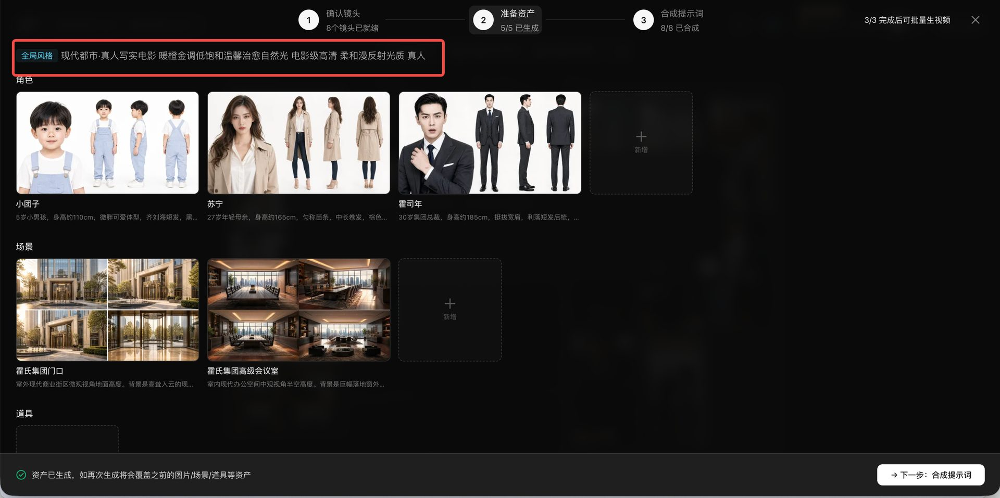 | 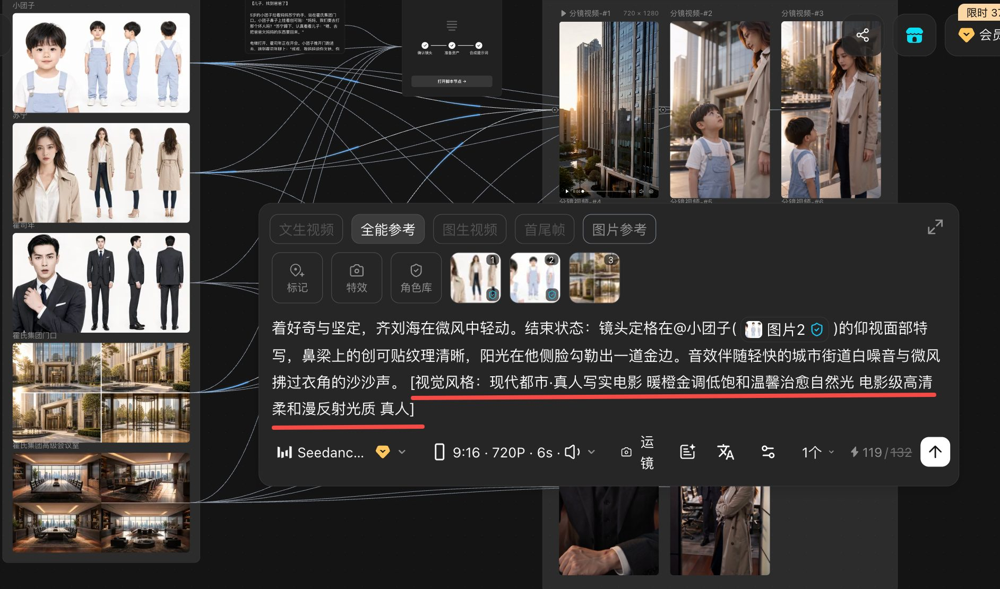 | 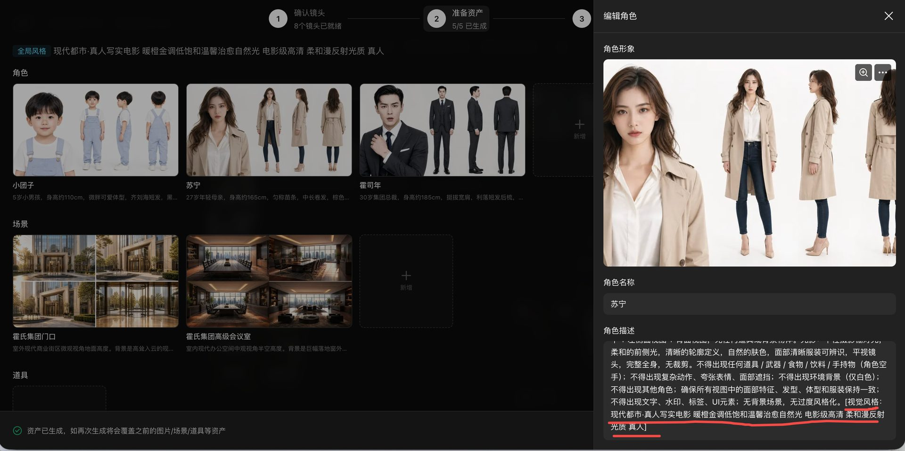 |

亮点 3：先精细调整再批量，结果更可控

新版脚本不是直接让用户“一键到底”，而是在批量生成前留了一个检查和修正环节。

用户可以先看脚本拆得是否正确，角色提取得是否准确，场景有没有漏，提示词是否完整。

发现问题可以直接在脚本节点里修：

缺角色/场景/道具图，可随时补充和添加；

镜头不顺，直接调整顺序；

分镜少了，新增 shot；

分镜多了，删除 shot；

风格不对，可在生成时加风格图或风格词进行修改。

修完之后再批量生成，会比直接一键生成更可控。

整体逻辑更符合创作者实际工作方式：先出草稿，再人工调整，最后批量生产。

亮点 4：一个故事，从文字到成片，全程不用跳出平台

输入剧本 / 想法 / 参考图 → 自动生成结构化分镜脚本

一键**批量生成**所有分镜图、所有视频片段

将生成的视频片段合成为完整视频

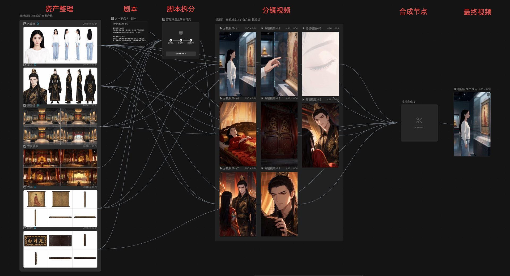

亮点 5：更适合短剧、漫剧、AI 影视的批量生产

新版脚本不是只服务单张图或视频片段，而是更适合一整段故事的生产。

尤其是短剧和漫剧，经常会有这些需求：

一集里有大量重复角色；

同一个场景会反复出现；

需要快速拆分镜；

需要批量生成素材；

需要先测试几条，再批量跑全量；

需要在成本和质量之间做控制。

新版脚本可以把这些重复性的内容资产化，把每个镜头的生产变成可管理、可批量的流程。

它不是完全替代创作者判断，而是把创作者从大量重复整理提示词、复制角色信息、逐条生成的工作里解放出来。

五、创作者测评

<table>
<colgroup>
<col style="width: 100%" />
</colgroup>
<tbody>
<tr class="odd">
<td>
新版脚本更适合的场景是：

AI影视/动画短片的灵感泛化、资产拆解、分镜生成

短剧漫剧的剧集单集资产拆解、素材生产

<strong>一些局限</strong>：

无法做到精品短片一键直出，导演思维、时长的判断、镜头与镜头的衔接还是会有瑕疵。

针对TVC场景的产品一致性会有不稳定的情况。
</td>
</tr>
</tbody>
</table>

**新版脚本比较适合的场景主要有两类。**

AI 影视 / 动画短片

适合做灵感泛化、剧本拆解、资产整理和分镜生成。

如果只是有一个故事想法，可以先让脚本节点拆成分镜，再看每个 shot 是否合理。

如果已经有比较完整的剧本，也可以直接用它来提取角色、场景、道具，快速生成一版故事板。

对早期创意验证来说，这个流程会比较高效。

短剧 / 漫剧单集素材生产

短剧和漫剧更依赖批量生产，一集里面经常有几十个镜头，而且角色和场景会反复出现。

新版脚本在这种场景下比较有优势：

可以快速拆单集分镜；

可以统一管理角色和场景；

可以批量生成分镜图；

可以继续批量生成视频；

可以先局部测试，再批量跑全量。

对于流水线生产来说，它能减少很多重复操作。

**当前还存在的边界**

新版脚本目前还不是“精品短片一键直出”。

导演思维、镜头节奏、时长判断、镜头与镜头之间的衔接，还是需要人工介入。

尤其是精品 TVC 这类对产品一致性、镜头设计、品牌质感要求特别高的场景，当前生成稳定性还会有一些不确定性。

但整体来看，相比旧版，V2 的生产逻辑更完整，生成链路也更顺。对于需要快速拆剧本、搭故事板、批量出素材的创作者来说，新版脚本会比旧版更实用。

**脚本Beta🚮（旧版）**

**功能简述：**支持用户通过描述剧情、或**上传剧本/角色图像/参考视频**，直接生成脚本。并通过脚本直接批量生成对应的分镜图像以及视频。

**上传剧本：点击后，复制文本信息到文本框，生成脚本**

**角色图像：点击后，上传角色图像+描述故事剧情，生成脚本**

**参考视频：上传参考视频，描述新需求，生成新脚本**

**1️⃣ 脚本生成**

> 在画布上点击右键，选择【添加节点-脚本节点】，选择「通过角色生成分镜脚本」。

|                                                                                                                                                                       |                                                                                                                                                                       |
|-----------------------------------------------------------------------------------------------------------------------------------------------------------------------|-----------------------------------------------------------------------------------------------------------------------------------------------------------------------|
| 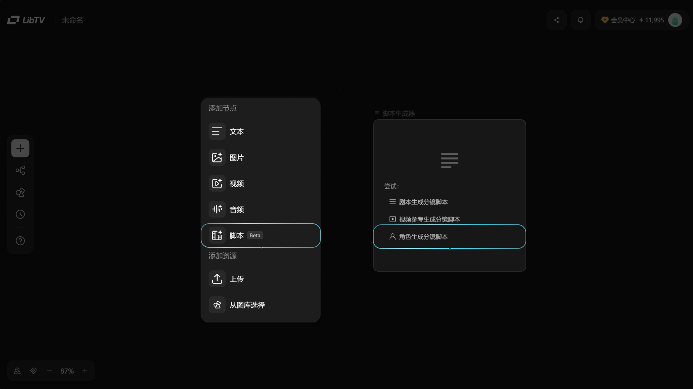 | 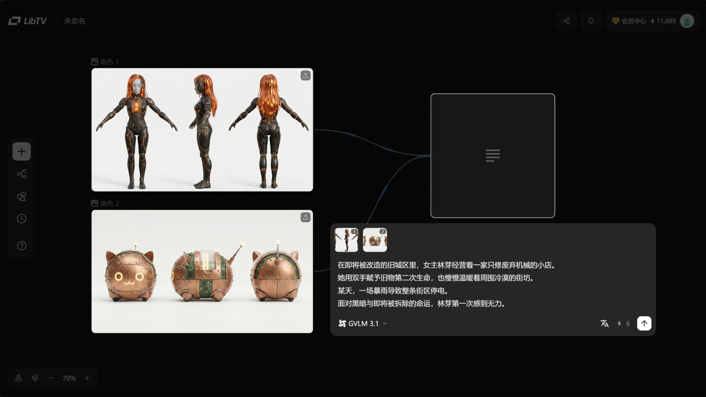 |

> 然后修改角色图、脚本生成提示词，点击生成，就能得到对应剧情的「分镜脚本」。
>
> 点击脚本右上角「全屏」按钮，可以浏览全部详细的脚本信息，支持**修改文本信息、更换参考图像。**
>
> 点击脚本右上角「视图」按钮，可以切换为 **卡片式** 展示方式。

|                                                                                                                                                                       |                                                                                                                                                                       |
|-----------------------------------------------------------------------------------------------------------------------------------------------------------------------|-----------------------------------------------------------------------------------------------------------------------------------------------------------------------|
| 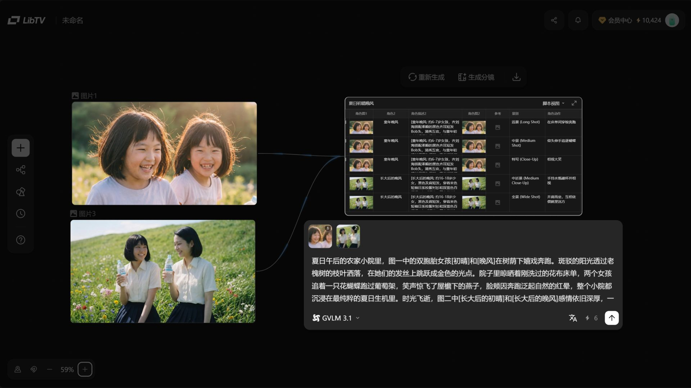 |  |

> **脚本内容修改（全屏视图） ❤️：**
>
> 双击表格可修改内容
>
> 支持上传**角色图、风格参考（右键替换/删除）**
>
> **自定义列表**：可以通过自定义**「调整字段可见性」**以及**「筛选画面」**隐藏不必要的内容，让脚本更加直观简洁。

**\[脚本展开示例.mp4\]**

2️⃣ **分镜图片生成**

> 脚本生成后，点击顶部【生成分镜】选项，系统会会基于脚本信息，直接生成对应的分镜图片
>
> 支持单条或批量脚本转图片：可以在脚本列表第一列进行勾选操作
>
> 支持在底部生成器中，设置分镜图像的风格、生成模型、画幅比和分辨率，最后点击生成

|                                                                                                                                                                       |                                                                                                                                                                       |
|-----------------------------------------------------------------------------------------------------------------------------------------------------------------------|-----------------------------------------------------------------------------------------------------------------------------------------------------------------------|
| 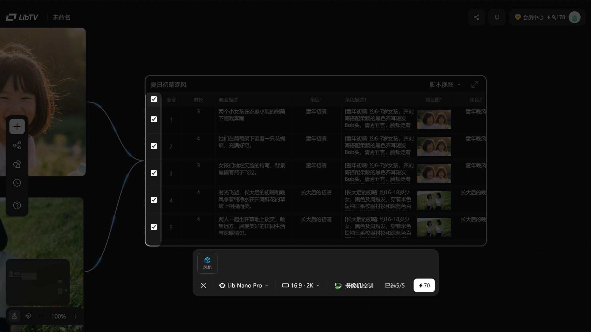 | 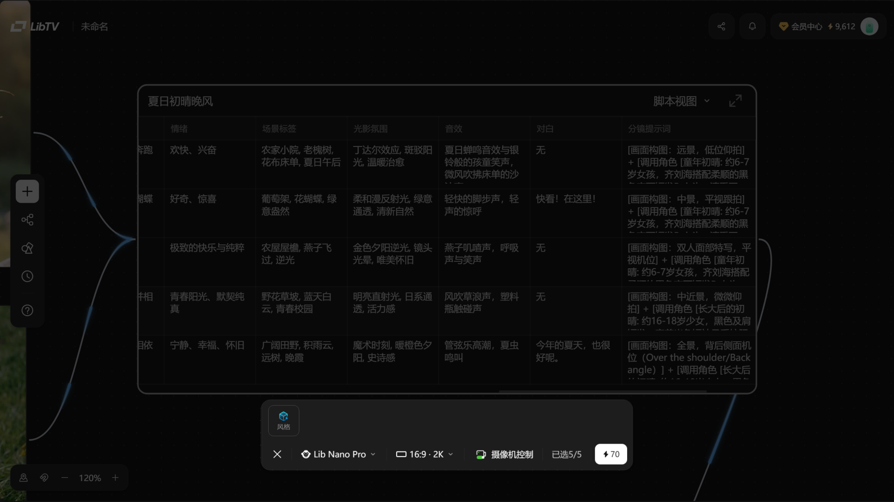 |

> 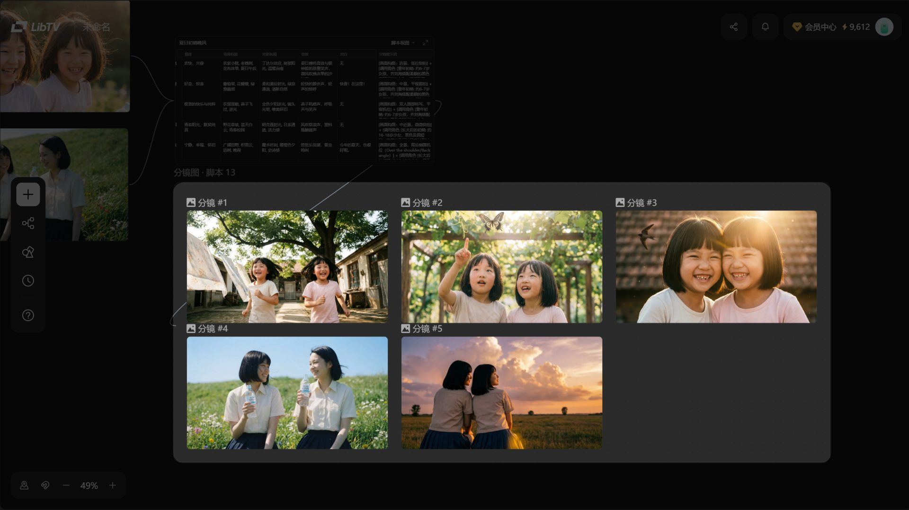

**3️⃣ 分镜图片转视频**

> 分镜图像生成后，可以继续连接视频节点，将图像转为视频
>
> 或者点击顶部【批量生成视频】选项，系统可以基于脚本信息，自动将图像转换合适的视频
>
> 底部生成器支持设置视频生成模型、时长，最后点击生成。

|                                                                                                                                                                       |                                                                                                                                                                       |
|-----------------------------------------------------------------------------------------------------------------------------------------------------------------------|-----------------------------------------------------------------------------------------------------------------------------------------------------------------------|
| 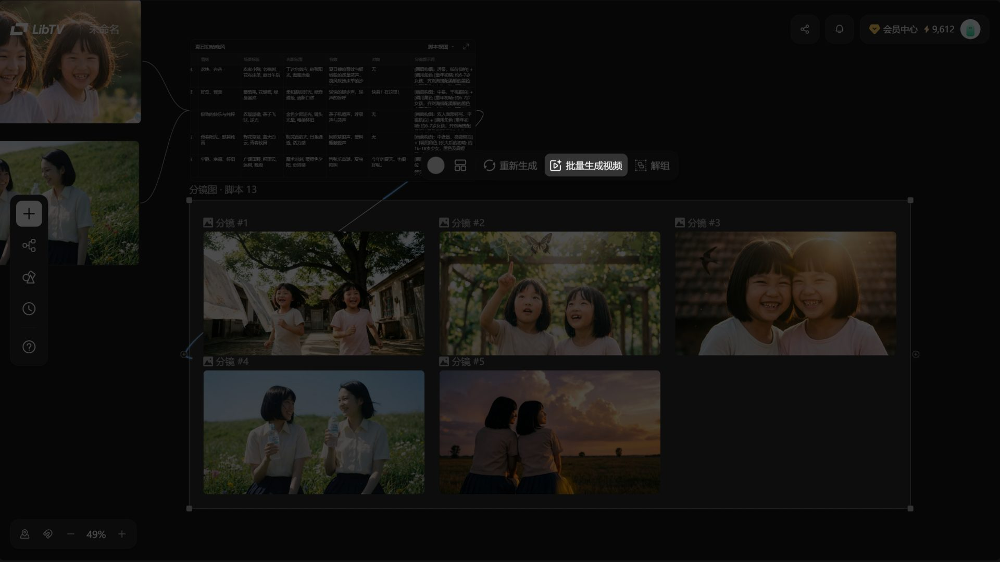 | 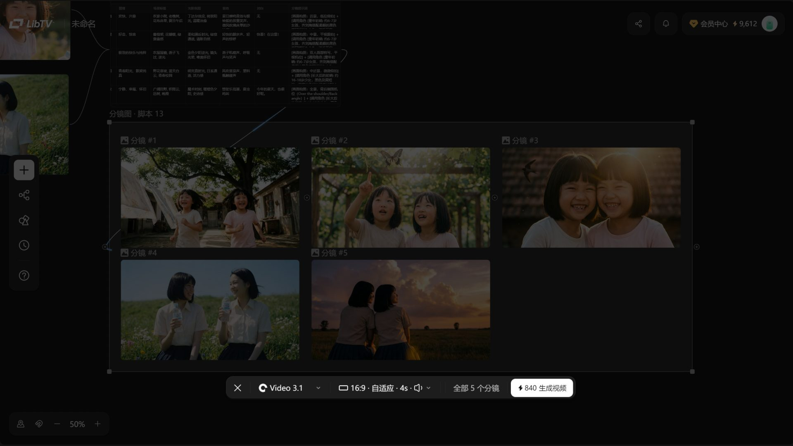 |

> 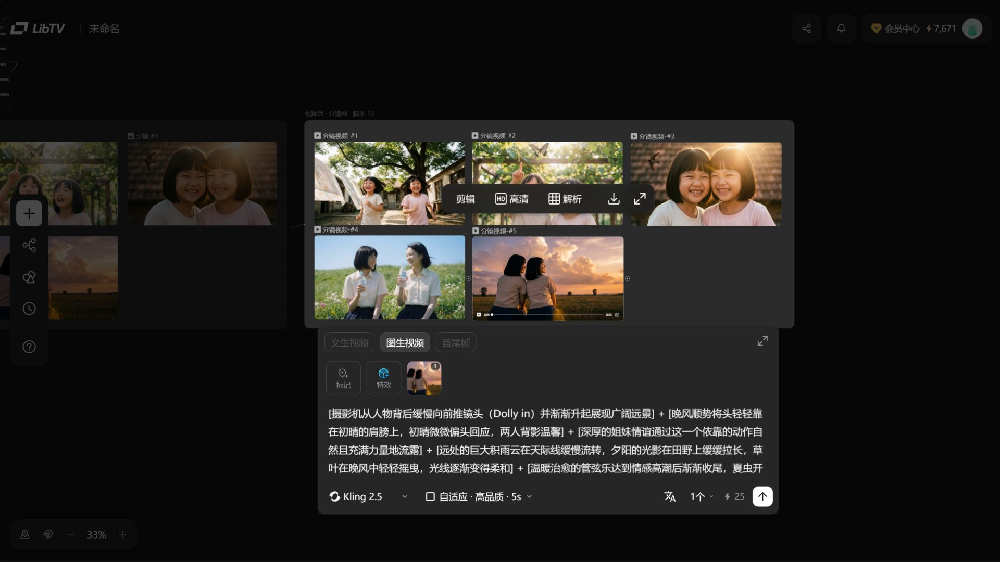

1.2.7 **常用节点操作**

<table>
<colgroup>
<col style="width: 50%" />
<col style="width: 50%" />
</colgroup>
<tbody>
<tr class="odd">
<td>
选中某个节点后，点击右键可以对当前节点进行复制、复用、删除、创建资产等操作

<strong>创建资产</strong>

<blockquote>

点击后对当前节点资源<strong>进行命名、分类并保存为「资产」</strong>；之后可以在画布左侧栏<a href="https://liblibai.feishu.cn/wiki/Loxfw6XHziYRk0kKzdjcFfp9nhb?contentTheme=DARK&amp;last_doc_message_id=7610813486005177522&amp;preview_comment_id=7610814670785481684&amp;sourceType=feed&amp;theme=light#share-UAMgdhEQkoViEXxM6b7cWxjanae">「我的资产」</a>中随时查看、调用

</blockquote>

<strong>复制&amp;粘贴</strong>

<blockquote>

通过 「Ctrl/Cmd+C」 「Ctrl/Cmd+V」 快速复制使用单个节点，<strong>不保留</strong>节点已有的连线信息

</blockquote>

<strong>副本</strong>

<blockquote>

快速复用当前节点，<strong>保留</strong>节点已有的连线信息

当需要基于同一组参考素材生成多个不同结果时，使用副本功能可以一次性产出多个版本，不用手动重复连线配置

</blockquote>

<strong>删除</strong>

<blockquote>

支持通过 Delete 键快速删除当前节点，可通过 Command+Z 撤销删除操作

</blockquote></td>
<td>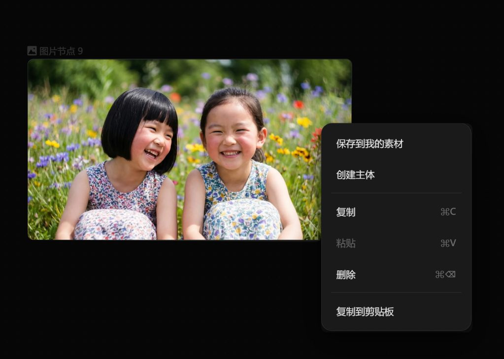</td>
</tr>
</tbody>
</table>

1.3 **工作流搭建 🔥**

基于已有的**文本、图像、视频、音频 4 类节点**，我们可以**通过连线**的方式，自由搭建出所需要的「任务工作流」，方便之后快速进行复杂任务**一键自动执行**或者**分发**。

1.3.1 **基础工作流 Showcase**

以下是一个简单的「参考生图→图转视频」工作流

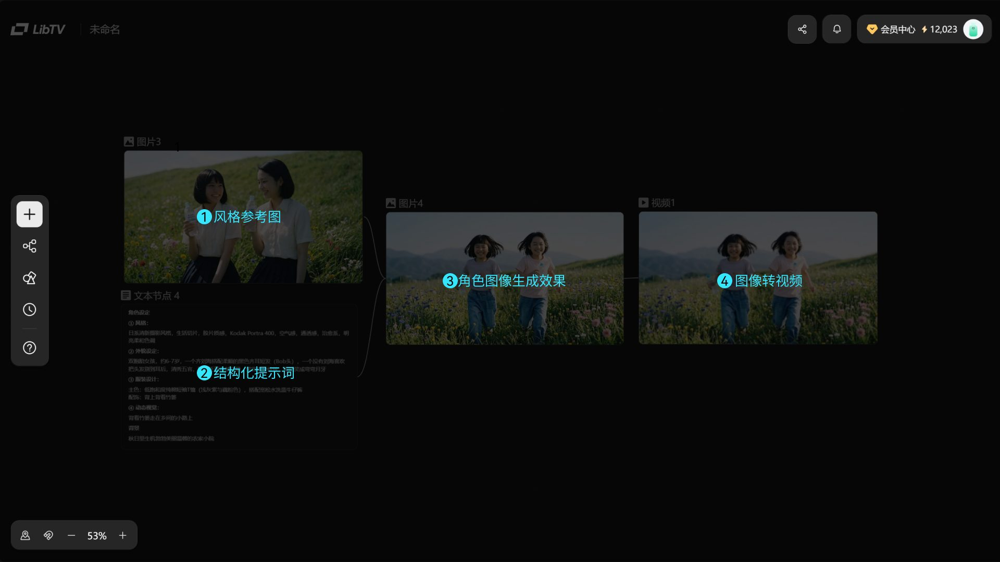

**\[基础工作流.mp4\]**

**搭建步骤**

**风格参考图上传**

|                                                                                          |                                                                                                                                                                       |
|------------------------------------------------------------------------------------------|-----------------------------------------------------------------------------------------------------------------------------------------------------------------------|
| 从「风格参考图」右侧节点拉线，新建一个「图片节点」，参考图会自动上传至新节点的生成器中。 | 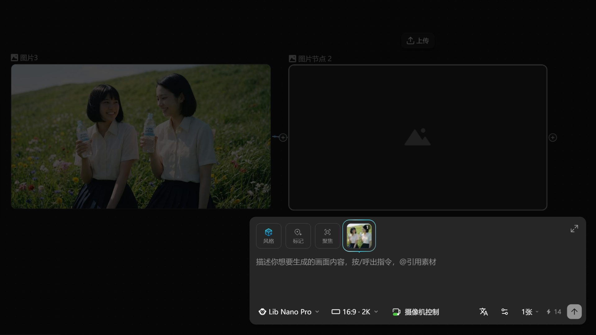 |

**角色设定接入**

|                                                                                                                         |                                                                                                                                                                       |
|-------------------------------------------------------------------------------------------------------------------------|-----------------------------------------------------------------------------------------------------------------------------------------------------------------------|
| 将准备好的<u>角色设定信息</u>填入一个文本节点，然后将其连接至上一步的新节点，表示**该信息会作为生成器提示词的一部分。** | 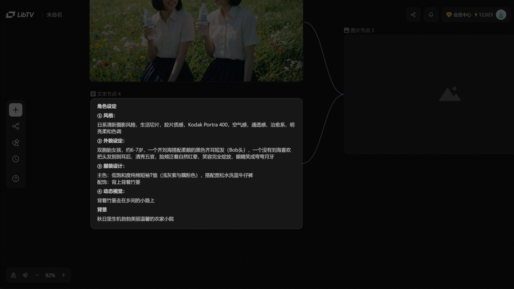 |

**图像生成**

|                                                                                                                   |                                                                                                                                                                       |
|-------------------------------------------------------------------------------------------------------------------|-----------------------------------------------------------------------------------------------------------------------------------------------------------------------|
| 在图像生成器中，输入生成需求「参考图1的画面风格，生成一张图片」，选择生图模型、设置图像比例、张数，最后点击生成。 |  |

|                                |                                                                                                                                                                       |
|--------------------------------|-----------------------------------------------------------------------------------------------------------------------------------------------------------------------|
| 生成的图像会展示在当前图片节点 | 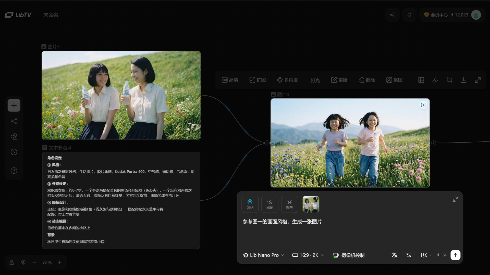 |

**视频生成**

|                                                                                                                      |                                                                                                                                                                       |
|----------------------------------------------------------------------------------------------------------------------|-----------------------------------------------------------------------------------------------------------------------------------------------------------------------|
| 从生成好的图片右侧拉线，新建一个「视频节点」，输入画面动态提示词。选择视频生成模型、设置视频比例、个数，最后点击生成 | 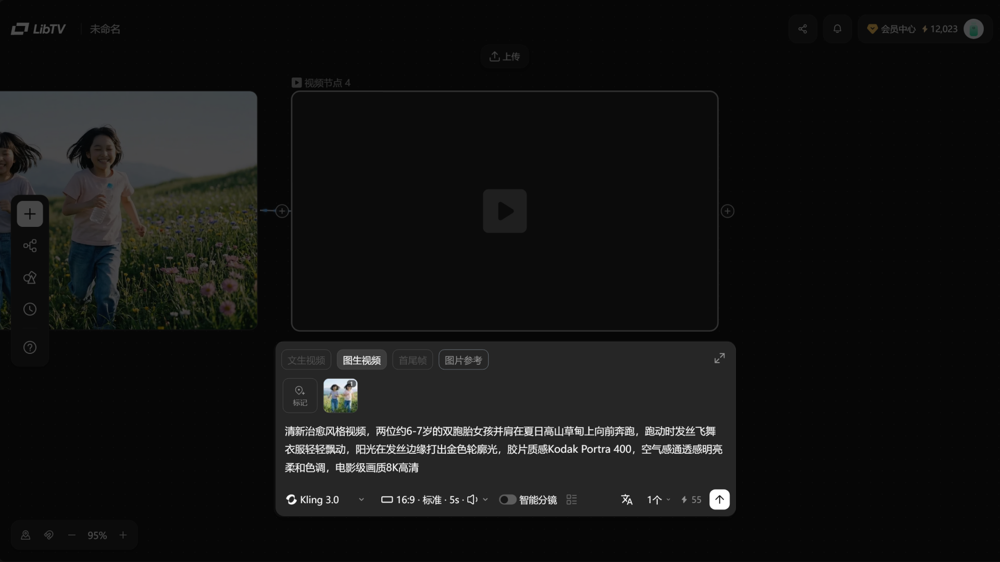 |

|                                  |                                                                                                                                                                       |
|----------------------------------|-----------------------------------------------------------------------------------------------------------------------------------------------------------------------|
| 生成的视频会展示在当前视频节点中 | 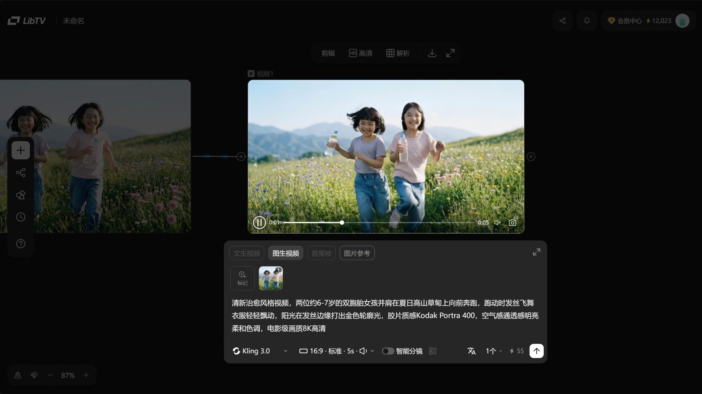 |

1.3.2 **工作流操作**

<table>
<colgroup>
<col style="width: 9%" />
<col style="width: 39%" />
<col style="width: 50%" />
</colgroup>
<tbody>
<tr class="odd">
<td>功能</td>
<td>简述</td>
<td>截图</td>
</tr>
<tr class="even">
<td><strong>打组</strong></td>
<td>
对于搭建好的工作流，可全选后点击右键进行打组。打组后可进行整体拖动

打组快捷键 Ctrl/Cmd+G

若框选过程中<strong>选到了分镜表，无法触发</strong>打组功能按钮。
</td>
<td>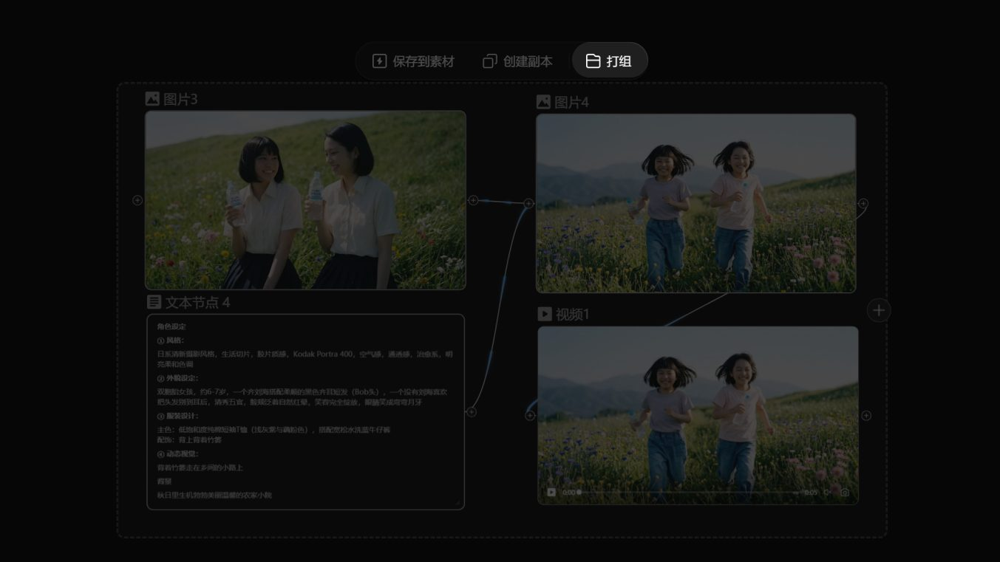</td>
</tr>
<tr class="odd">
<td>
<strong>创建</strong>

<strong>工作流</strong>
</td>
<td>
对于<strong>已打组的工作流，</strong>可以点击<strong>「创建工作流」将其保存起来</strong>

保存好的工作流，可在画布左侧栏的<a href="https://liblibai.feishu.cn/wiki/Loxfw6XHziYRk0kKzdjcFfp9nhb?contentTheme=DARK&amp;last_doc_message_id=7610813486005177522&amp;preview_comment_id=7610814670785481684&amp;sourceType=feed&amp;theme=light#share-YrxzdelmjoIVL2xqwdiciCg2njg">「打开工作流」</a>中查看、调用（点击发送到画布）

不支持对<strong>分镜表节点</strong>进行该操作
</td>
<td>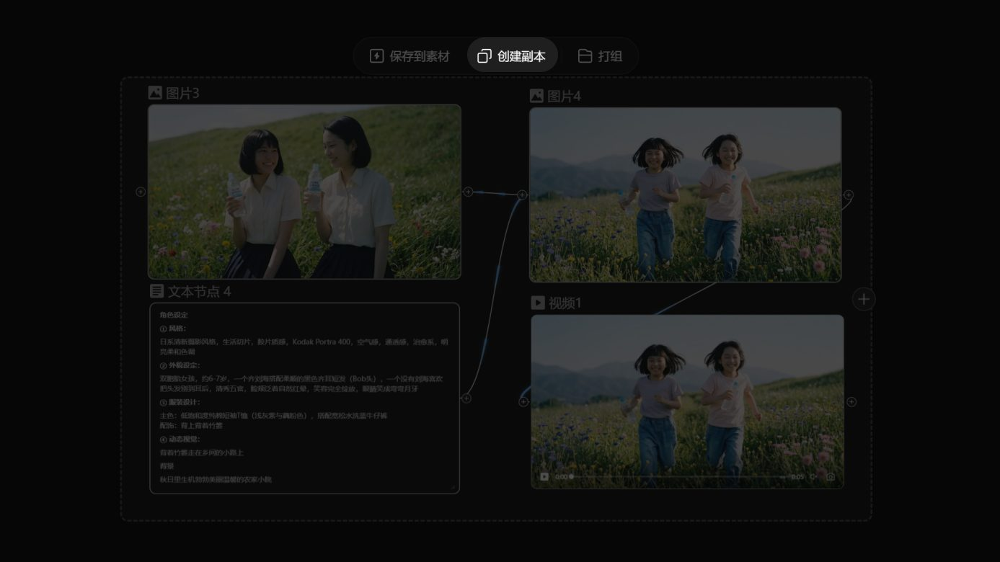</td>
</tr>
<tr class="even">
<td><strong>整组执行</strong></td>
<td>对已打组的、且具备前后逻辑关系的工作流，点击后可以进行全部的重新执行。</td>
<td>
修改角色设定与视频动态提示词后，整组自动执行效果

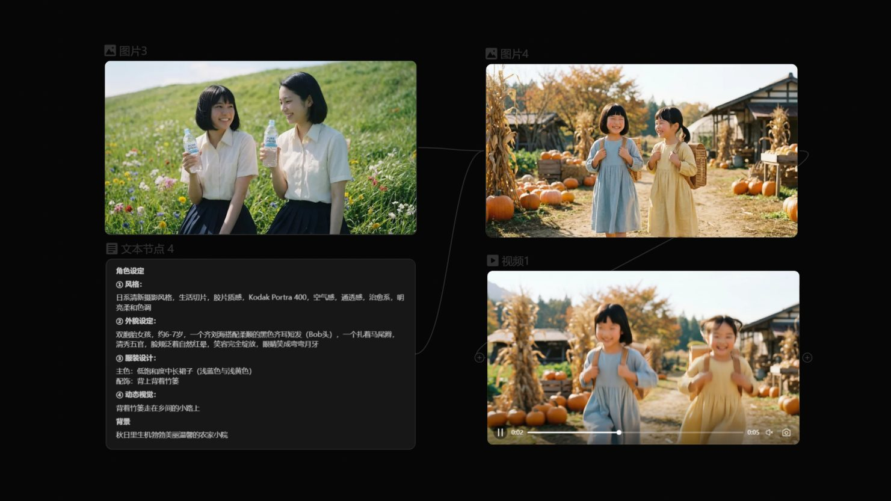
</td>
</tr>
</tbody>
</table>

1.4 **四大画布功能**

> 无限画布上有4大功能模块：**「项目菜单栏」「画布左侧栏」「个人中心」和「小地图导航」**
>
> 

1.4.1 **项目菜单栏**

**一个无限画布就是一个项目**，点击画布左上角的 Logo 会弹出**「项目菜单栏」**可以对项目进行管理。

<table>
<colgroup>
<col style="width: 45%" />
<col style="width: 54%" />
</colgroup>
<tbody>
<tr class="odd">
<td><strong>功能简介</strong></td>
<td><strong>功能截图</strong></td>
</tr>
<tr class="even">
<td>
<strong>回到主页</strong> 点击后返回LibTV首页

<strong>全部项目</strong>

<blockquote>

进入进入项目库，浏览、管理自己的所有项目

</blockquote>

<strong>创建新项目</strong>

<blockquote>

在当前标签页新建一个空白画布

之前的项目可以在「项目库」中查看

</blockquote>

<strong>删除项目</strong>

<blockquote>

弹出删除确认弹窗，确认后当前项目被永久删除

当前页面会返回LibTV首页

</blockquote>

双击画布名称，可以进行画布重命名
</td>
<td>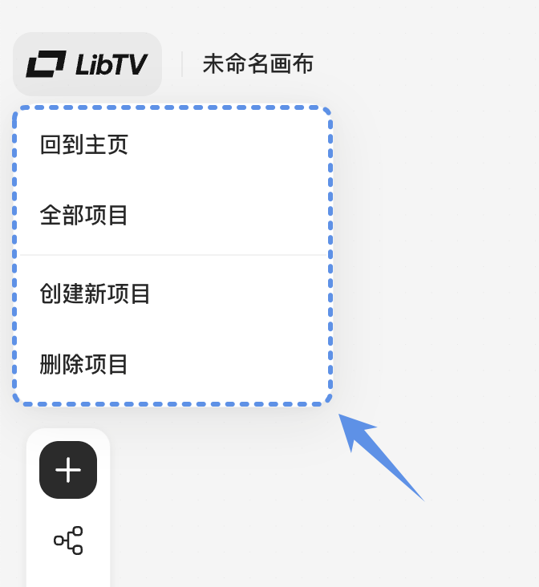</td>
</tr>
</tbody>
</table>

1.4.2 **画布左侧栏**

画布左侧栏设有**「添加」「工作流」「资产」「历史记录」「教程」**5大功能

<table>
<colgroup>
<col style="width: 68%" />
<col style="width: 31%" />
</colgroup>
<tbody>
<tr class="odd">
<td>功能简介</td>
<td>功能截图</td>
</tr>
<tr class="even">
<td>
<strong>添加</strong>

<strong>添加节点</strong>：支持直接新建 <strong>文本/图片/视频/音频/脚本</strong> 节点

<strong>添加资源</strong>：将本地的图片/视频/音频资源上传到画布中，支持多选上传
</td>
<td>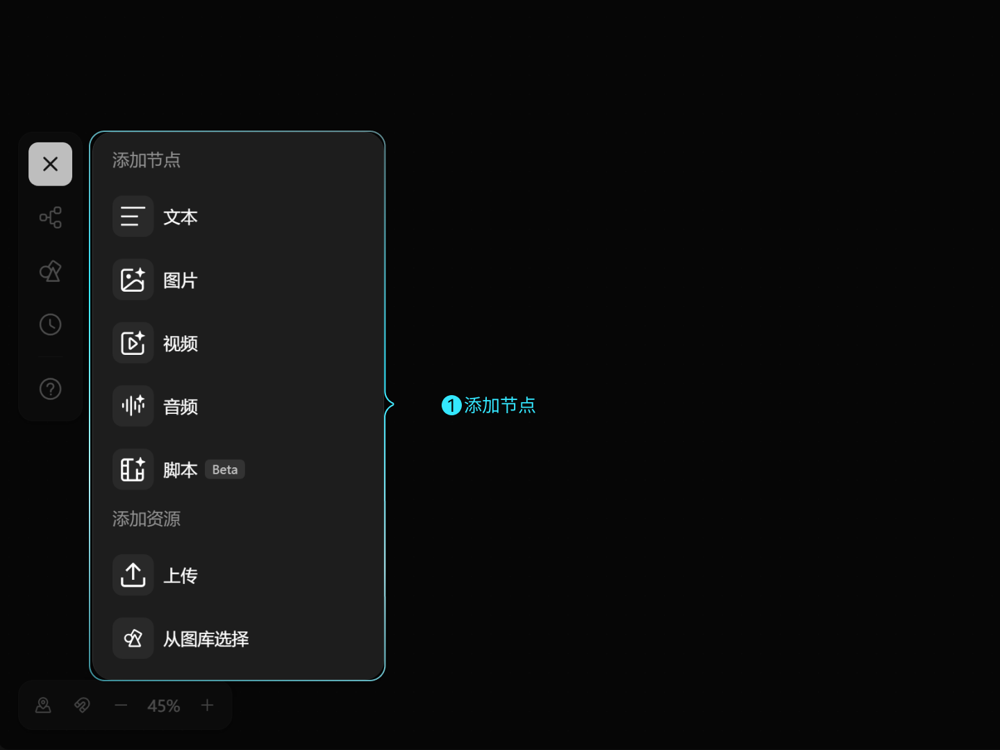</td>
</tr>
<tr class="odd">
<td>
<strong>我的工具箱</strong>

<strong><a href="https://liblibai.feishu.cn/wiki/Loxfw6XHziYRk0kKzdjcFfp9nhb#share-WKFXdzfg6oS1WixUFDscjk43n1c">已创建为资产的工作流</a></strong> 可以在这里查看

点击卡片可以将对应的整套工作流发送到当前画布
</td>
<td>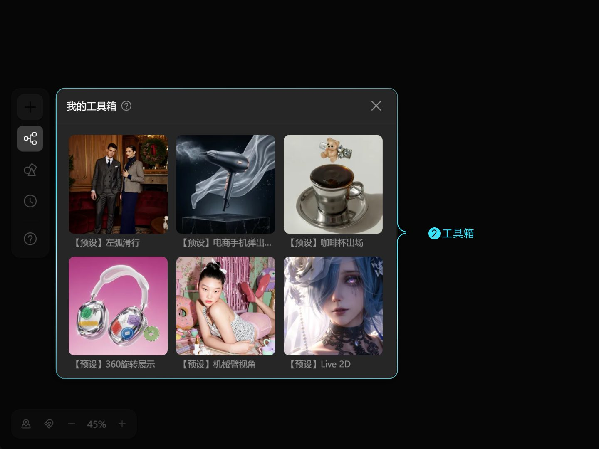</td>
</tr>
<tr class="even">
<td>
<strong>我的资产</strong>

<strong>我的资产</strong>

<a href="https://liblibai.feishu.cn/wiki/Loxfw6XHziYRk0kKzdjcFfp9nhb#share-SCr3dlCknoXlqLxFZTRcLRs5nmb"><strong>已创建为资产的资源</strong></a>可以在这里查看

鼠标悬浮在卡片上，可以对资产进行查看、删除、使用（发布送到当前画布）

<strong>我的主体库（待完善）</strong>

针对<strong>可灵、vidu 等模型开放的主体库</strong>，系统会对主体进行特殊处理，在生成视频的。 后调用主体库的内容，保证生视频的时候有较好的一致性。

可以将已经生成好的人物、物体等图片/视频资源放到一个文件夹组中进行管理，在需要使用的时候，整体进行调用。

点击某个资产文件夹，可以将文件夹中的所有内容都加载到画布上。例如，创建一个香水文件夹，可以将这个香水不同视图的图，全部加载到画布上，这样就方便参考不同视角的图，生成一致性比较好的视频了。
</td>
<td>

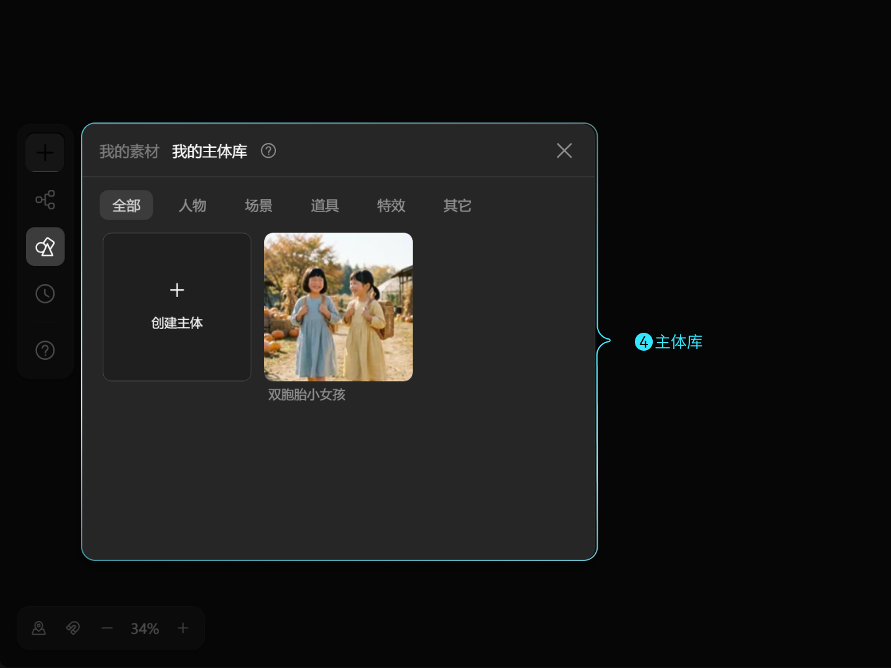
</td>
</tr>
<tr class="odd">
<td>
<strong>历史记录</strong>

在 LibTV 内生成的所有的图片、视频、音频均会展示在历史记录

历史记录里的资源可以进行<strong>查看和使用（发布送到当前画布）</strong>

画布的历史记录支持批量下载、批量删除、批量使用（最多使用10个）

<blockquote>

2. 支持记录历史记录浏览位置

</blockquote></td>
<td>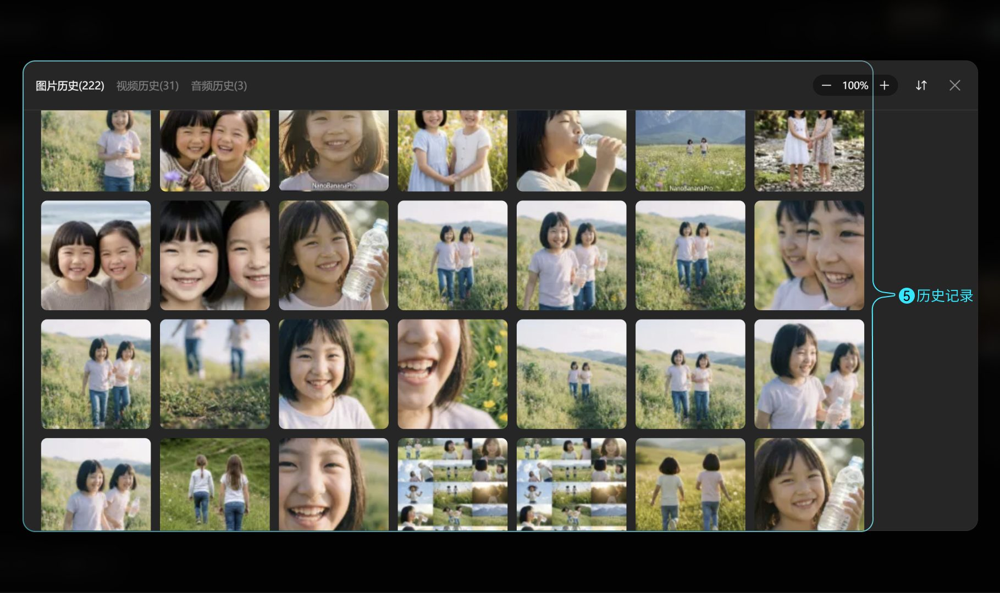</td>
</tr>
<tr class="even">
<td>
<strong>使用教程</strong>

<blockquote>

没错就是你现在现在在看的这个文档！

有任何疑问欢迎评论or留言 😘

</blockquote></td>
<td></td>
</tr>
</tbody>
</table>

1.4.3 **个人中心**

画布右上角是用户相关功能，包括**「发布&分享」「通知」「会员中心」「积分消耗」「个人中心」**

<table>
<colgroup>
<col style="width: 56%" />
<col style="width: 43%" />
</colgroup>
<tbody>
<tr class="odd">
<td>功能简介</td>
<td>功能截图</td>
</tr>
<tr class="even">
<td>
<strong>分享/发布</strong>

<strong>分享</strong>：可以将当前的画布分享给其他人，对方可以看见当前画布以及后续在画布上操作的所有内容

<strong>发布</strong>：可以将当前画布以及对应的视频作品发布到LibTV社区首页，发布且通过审核后，会在首页曝光展示。
</td>
<td></td>
</tr>
<tr class="odd">
<td>
<strong>消息中心</strong>

<blockquote>

查看系统通知，以及作品的点赞、评论等互动信息

</blockquote></td>
<td>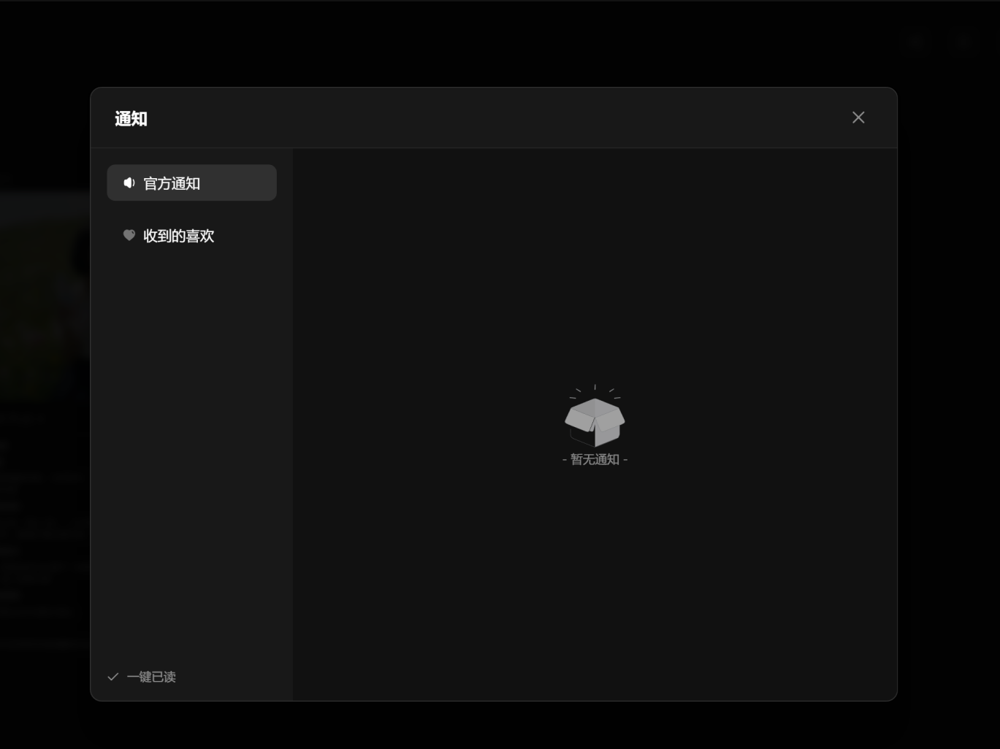</td>
</tr>
<tr class="even">
<td>
<strong>会员中心</strong>

查看会员购买信息

了解促销优惠
</td>
<td>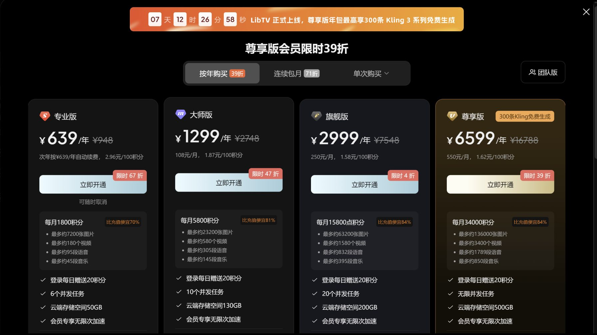</td>
</tr>
<tr class="odd">
<td>
<strong>积分消耗</strong>

查看积分余额、会员有效期

单独购买算力
</td>
<td></td>
</tr>
<tr class="even">
<td>
<strong>个人中心</strong>

展示账号信息、会员等级、积分余额等

可一键复制用户uuid

查看购买记录、会员订阅计划、开票

进行生成水印设置
</td>
<td>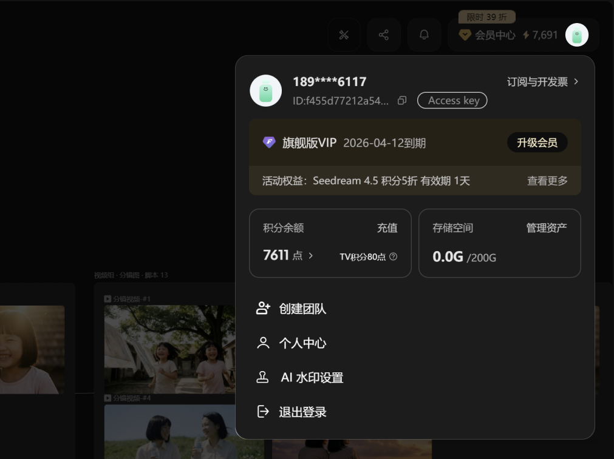</td>
</tr>
</tbody>
</table>

1.4.4 **小地图导航**

<table>
<colgroup>
<col style="width: 59%" />
<col style="width: 40%" />
</colgroup>
<tbody>
<tr class="odd">
<td>功能简介</td>
<td>功能截图</td>
</tr>
<tr class="even">
<td>
<strong>小地图</strong>

当画布内容较多时，点击画布左下角的地图图标，在弹出的「小地图」中查看当前画布节点的全局分布情况

鼠标拖动「小地图」中的高亮框，可快速让画布视图聚焦在对应位置

<strong>画布缩放数字</strong>

通过百分比数值了解当前画布缩放比例

滚动鼠标滑轮可调整画布放大/缩小，最低10%
</td>
<td>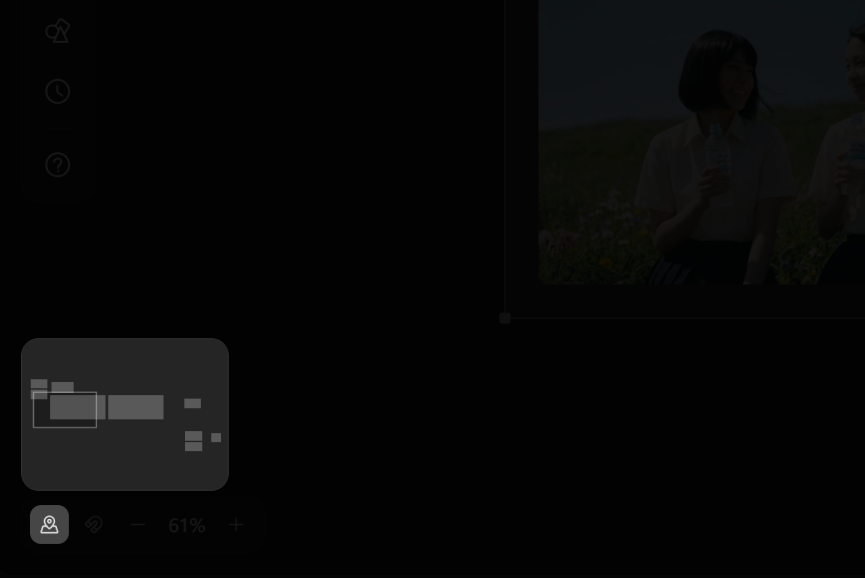</td>
</tr>
</tbody>
</table>

1.4.5 **智能引用 AutoLink 🔥**

**功能简介**

输入提示词后，实时将相关参考素材进行智能@引用到对应的提示词后面，让你更便捷高效利用Seedance 2.5 的多参功能。

**\[file_v3_00149_0faf3be5-583f-492e-a451-daf16205c23g.mp4\]**

<table>
<colgroup>
<col style="width: 43%" />
<col style="width: 56%" />
</colgroup>
<tbody>
<tr class="odd">
<td><strong>使用方式</strong></td>
<td>Showcase</td>
</tr>
<tr class="even">
<td>
在新建图像/视频节点，传入全部参考素材

<strong>手动输入提示词，或粘贴完整提示词到对话框</strong>

如果提示词中有与参考图相关的关键词，系统会自动在对应位置预置一个引用标签

点击 或按Tab键 确认单次引用，Shift Tab 全部引用；继续打字或者点击其他文字忽略引用

确认后，标签引用对象支持切换。
</td>
<td>
提示词与图片、视频、音频名称一致或识别到相似时自动匹配，确定使用按下tab，不想要继续打字输入即可

<strong>[file_v3_00149_582b5049-803f-4084-a0cc-92a4f89cc83g.mp4]</strong>

按照图片1、2、3 顺序描述时 自动匹配

<strong>[PixPin_2026-08-05_00-42-55.mp4]</strong>
</td>
</tr>
</tbody>
</table>

2\. **画布实用工具**

LibTV 提供了一系列实用&功能，方便大家快速进行图像、视频的编辑处理。

2.1 **Slash 快捷功能 全面升级🚩**

**能力升级**：

**升级1：入口升级**

**图片节点**，支持「输入框输入 "/" 」+「点击生成器下方预设」快速调起

**升级2：能力升级**

多数能力支持输入「文本」/「文本+图片」/「图片」，让生成更可控

2.1.1 **多机位九宫格 💖**

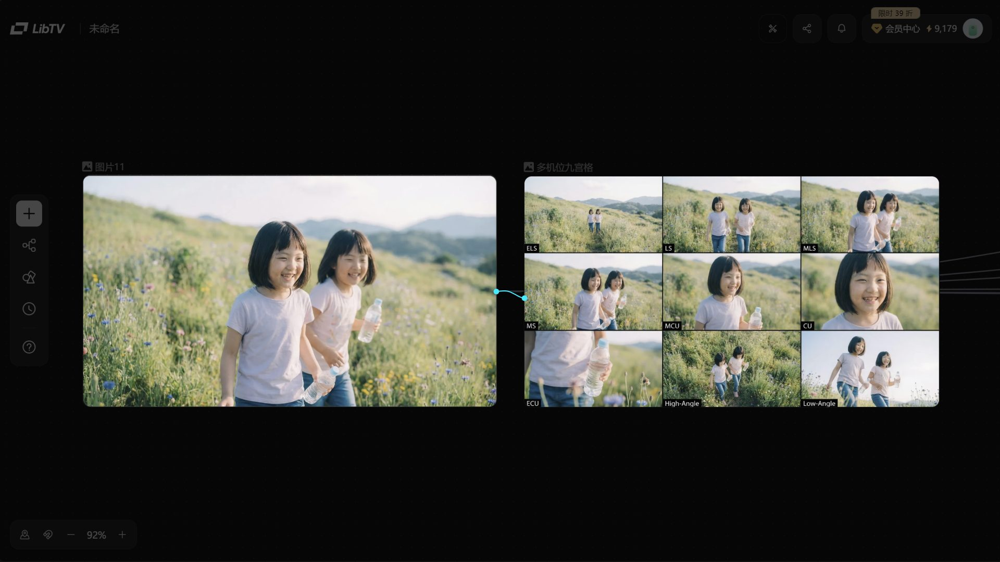

2.1.2 **剧情推演四宫格 💖**

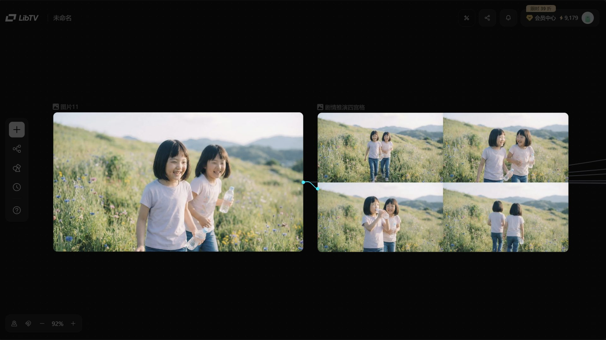

2.1.3 **25宫格连贯分镜 💖**

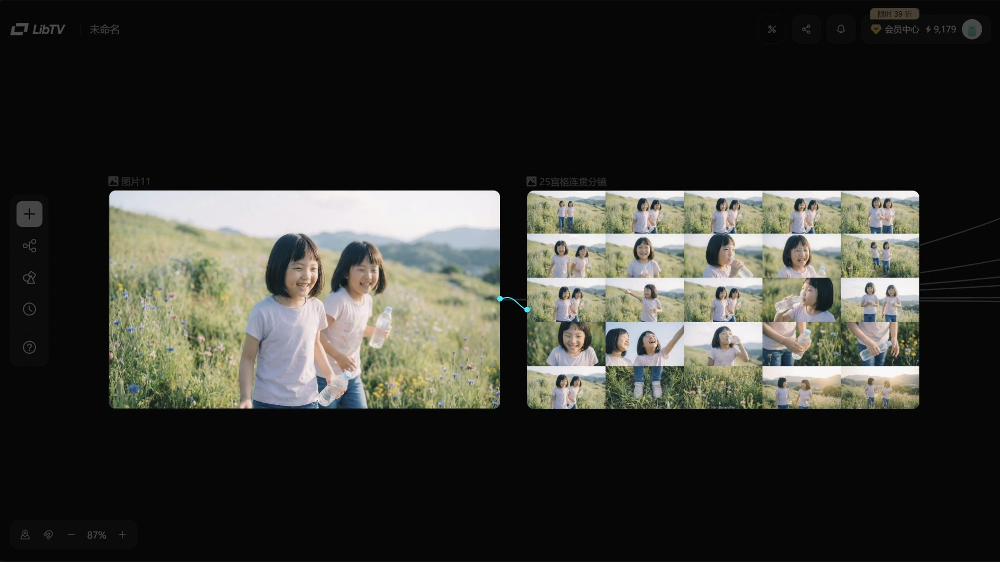

2.1.4 **电影级光影矫正**

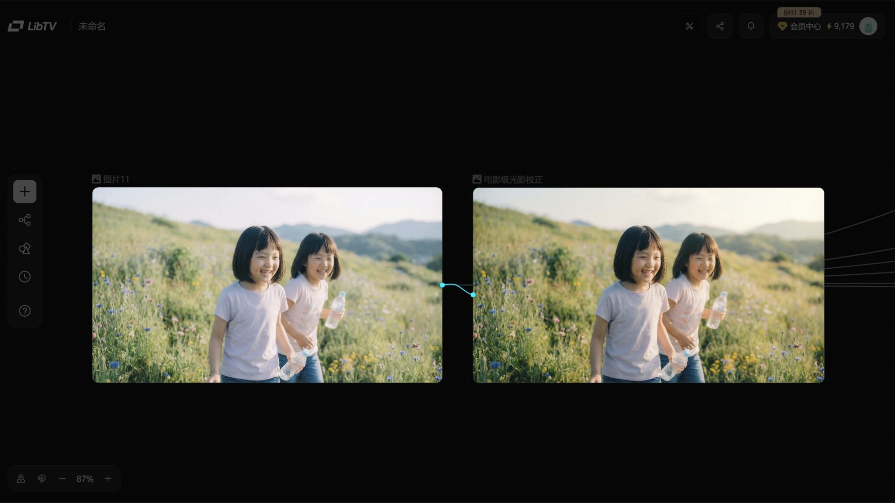

2.1.5 **角色三视图生成 💖**

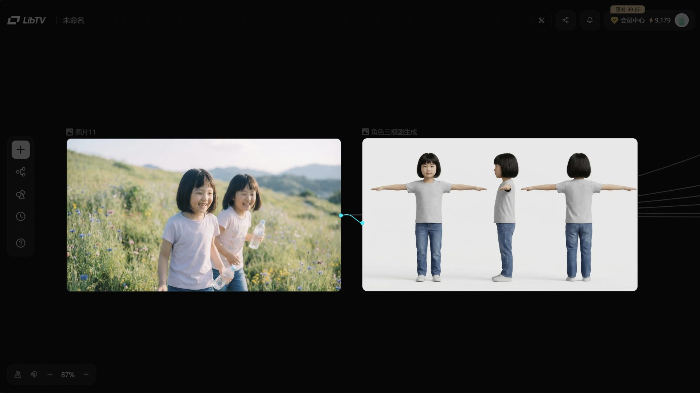

2.1.6 **画面推演-3秒后**

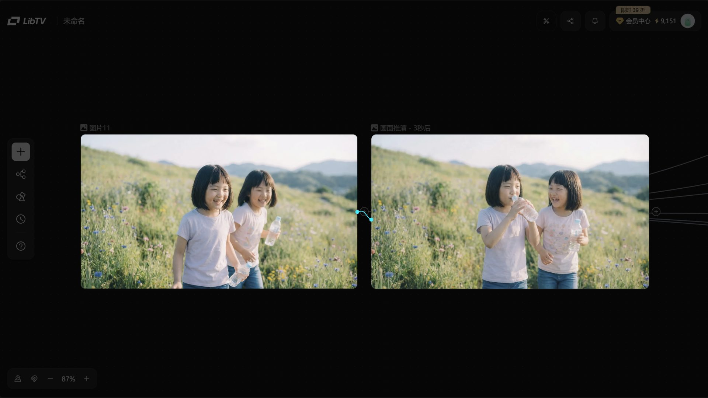

2.1.7 **画面推演-5秒前**

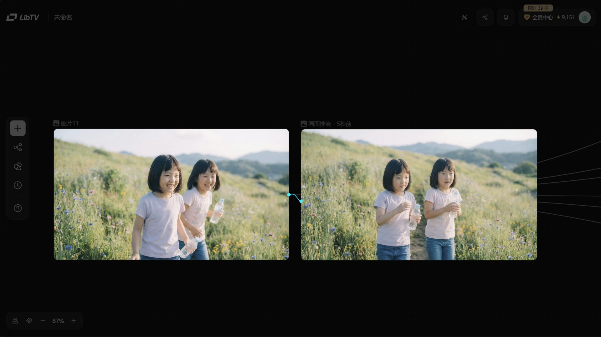

2.1.8 **角色设定图🆕🌟**

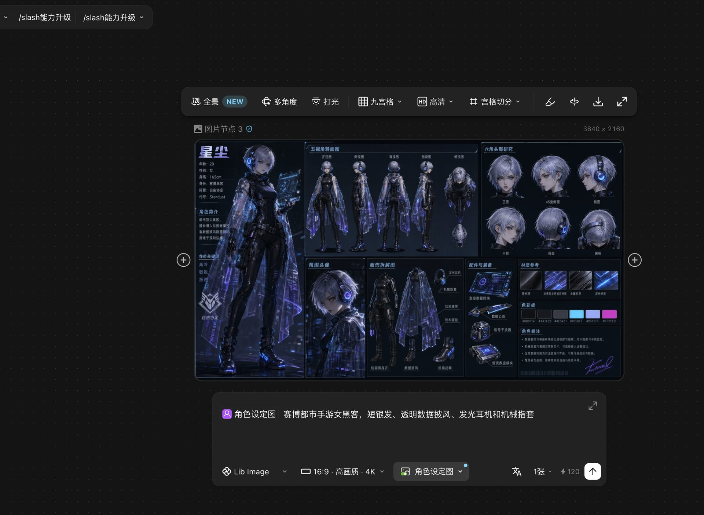

2.1.9 **🔥故事板**

**能力介绍：**

把一段 10-15 秒的剧情，整理成适合视频生成的连续分镜

它会重点拆解人物怎么演、动作怎么发生、镜头怎么拍、前后画面怎么衔接，适合用来做短剧、漫剧、广告片、产品剧情片、角色动作片段等视频前期规划

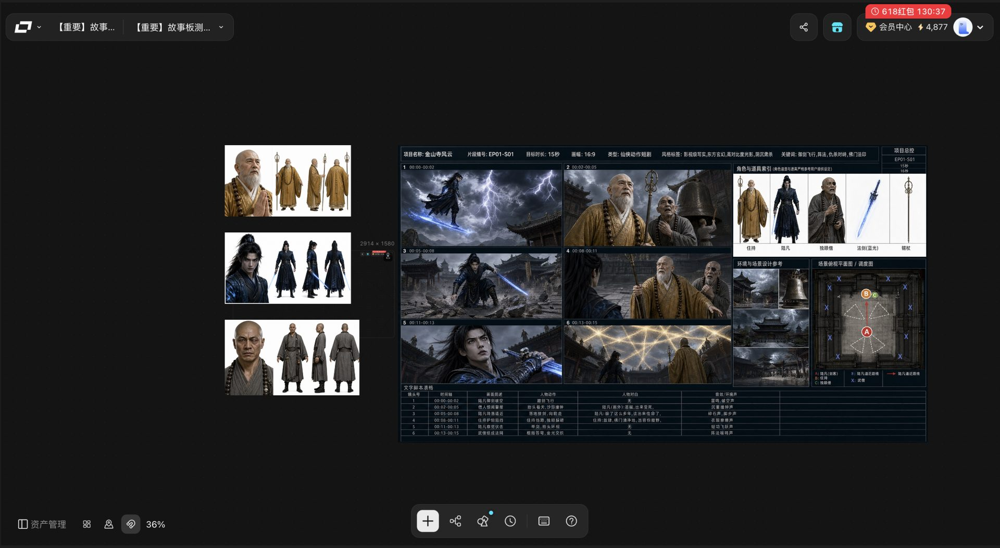

2.1.10 **🔥调度故事板**

**能力介绍**

把一段 10-15 秒的剧情，整理成带动作线、视线、运镜和衔接提示的中文手绘分镜


“视频生成前的导演分镜蓝图”，在连续分镜基础上，补充动作拆解、人物走位、镜头机位、调度线和镜头衔接，让视频模型更清楚理解“怎么演、怎么动、怎么拍”

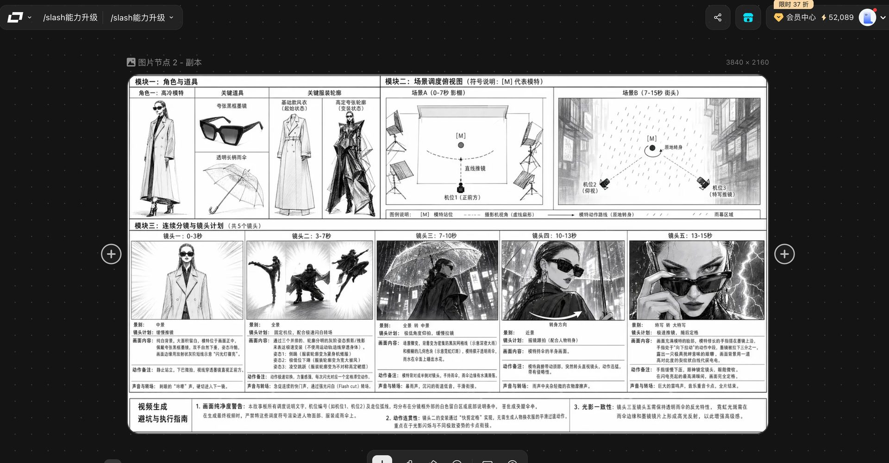

2.1.11 **人像调节🤩**

**核心能力：**

**降低 AI 感**  
优化过度磨皮、塑料感皮肤、五官边缘过硬、纹理过假等问题，让人物看起来更像真实照片

**优化人像质感**  
支持对皮肤质感、画面纹理、清晰度进行调节，保留自然肤质、毛发细节和真实的面部层次

**提升人景融合**  
让人物与背景在色温、噪声、清晰度、边缘过渡上更统一，减少“人物像贴上去”的感觉

**优化光影融合**  
根据场景光源调整脸部和身体光影，让人物受光、阴影、氛围与背景更一致

|                                                                                  |
|----------------------------------------------------------------------------------|
| 让面部反光更适配环境特征，优化面部细节，保留真实肌肤纹理与微小瑕疵，告别‘塑料感’ |

<table>
<colgroup>
<col style="width: 100%" />
</colgroup>
<tbody>
<tr class="odd">
<td>
<strong>「文生图」--效果对比</strong>

<blockquote>

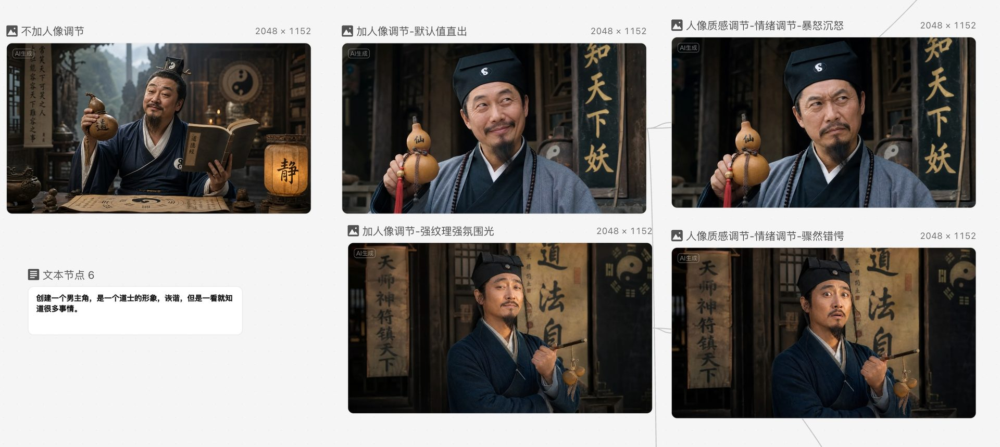

<strong>「图片编辑」---效果展现</strong>

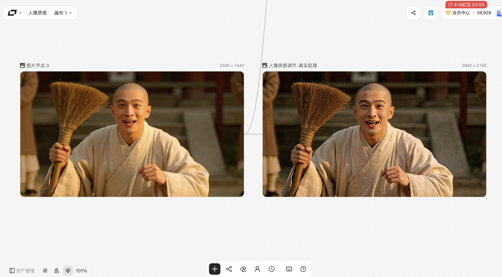

</blockquote></td>
</tr>
</tbody>
</table>

2.1.12 **「情绪调节」**

> 在多人图中支持选择指定人物进行表情调节，单次仅支持单人
>
> 最终输出仍保留完整原图，只改变目标人物表情，其他人物和画面内容不变
>
> 当前支持25 个表情

<table>
<colgroup>
<col style="width: 100%" />
</colgroup>
<tbody>
<tr class="odd">
<td>
情绪调节核心优势：在保留人物身份、五官特征和原图构图的基础上，精准控制眼神、眉眼、嘴角、脸颊等关键面部细节，让情绪变化符合真实面部肌肉运动，呈现自然、不突兀的表情效果

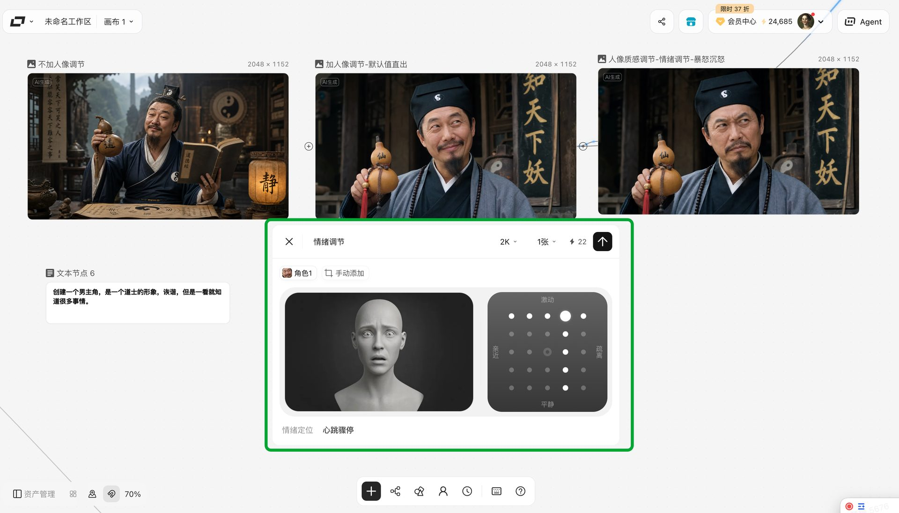

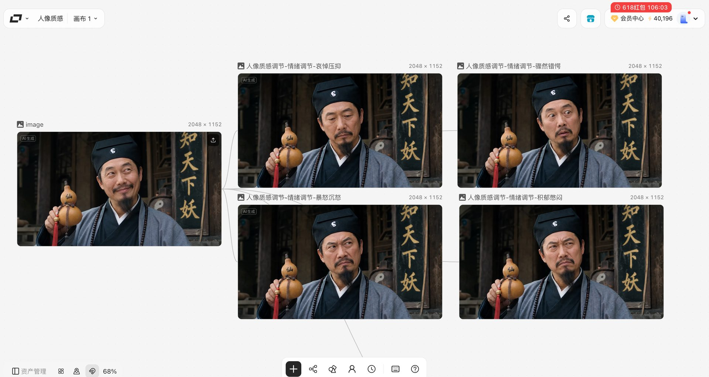
</td>
</tr>
</tbody>
</table>

2.2 **图像工具**

> 位于图像节点顶部菜单栏，选中图像会自动弹出。新版菜单栏对功能进行了重新分组和排序，新增了部分功能。以下按最新布局依次介绍。
>
> 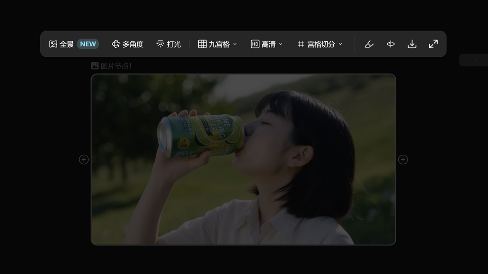
>
> **2.2.1 全景720°🔥**

<table>
<colgroup>
<col style="width: 100%" />
</colgroup>
<tbody>
<tr class="odd">
<td>
<strong>使用须知：</strong>

<strong>1️⃣</strong> AI 在生成<strong>空旷的、无明确建筑、物体、空间做为参考的户外场景</strong>（如草原、沙漠、大海）时，会存在全景特征不明显的问题。

<strong>2️⃣ AI 生成存在随机性</strong>

① 偶然会出现全景图特征不明显的情况，一般再生成1-2次就能解决；

② 接缝无法无痕闭合、空间轻微扭曲等问题无法完全避免，但对图像/视频参考生成来说影响不大；

③ 可在截图后，考虑用 LibNavo 模型进行二次修复处理。

3️⃣ 对于Midjourney<strong>高度个性化的风格特征</strong>，风格一致性无法100%保持一致
</td>
</tr>
</tbody>
</table>

**功能简述：**支持通过文本/参考图生成可实时预览的720°全景图，支持快速场景截图，让场景一致性控制更准确、简单。

**\[教程全景展示.mp4\]**

**三大使用入口：**

> **点击图像节点顶部菜单栏【全景】：**

直接基于基于当前场景创建720°全景图，**不支持提示词微调。**

生成的全景图与原图空间特征、细节基本一致

> 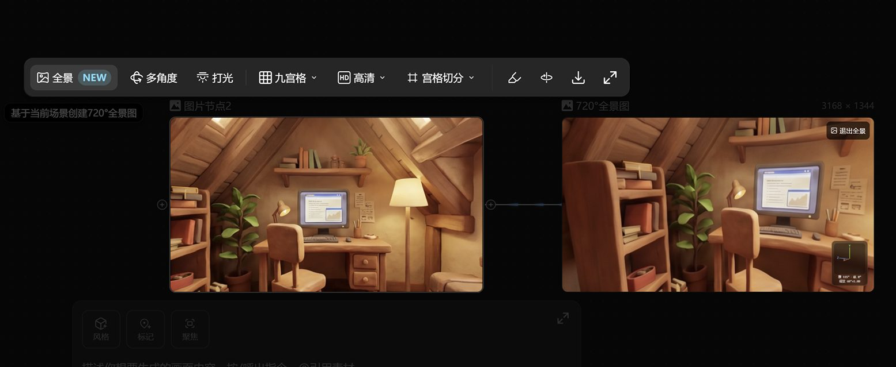

**图像节点生成器【全景模式】：**通过文本生成720°全景图，支持上传场景参考图

|                                                                             |                                                                                                                                                                       |
|-----------------------------------------------------------------------------|-----------------------------------------------------------------------------------------------------------------------------------------------------------------------|
| **1️⃣ 纯文本提示词**：比如「一间温馨的儿童房，蓝色和白色的主题色，海洋主题」 | 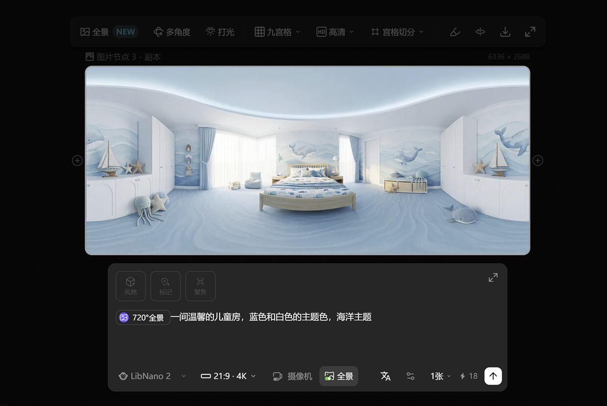 |

<table>
<colgroup>
<col style="width: 36%" />
<col style="width: 63%" />
</colgroup>
<tbody>
<tr class="odd">
<td>
<strong>2️⃣ 参考图+文字描述：</strong>

比如「基于参考图生成720°全景图，场景是XXXX」

此方式生成的全景图在风格、空间主题上与参考图高度相似，但是细节并不一致。
</td>
<td>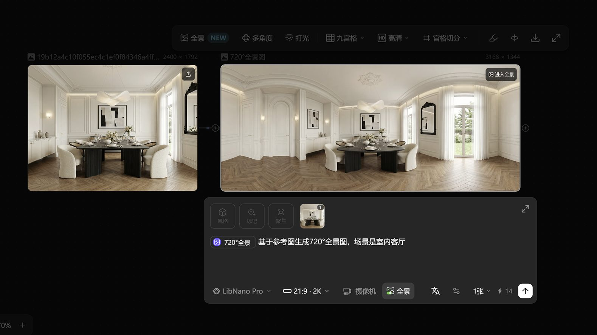</td>
</tr>
</tbody>
</table>

<table>
<colgroup>
<col style="width: 40%" />
<col style="width: 60%" />
</colgroup>
<tbody>
<tr class="odd">
<td>
<strong>3️⃣ 图像节点-右键【进入全景预览】</strong>

适用于 标准720°全景图，可直接进入实时预览模式
</td>
<td>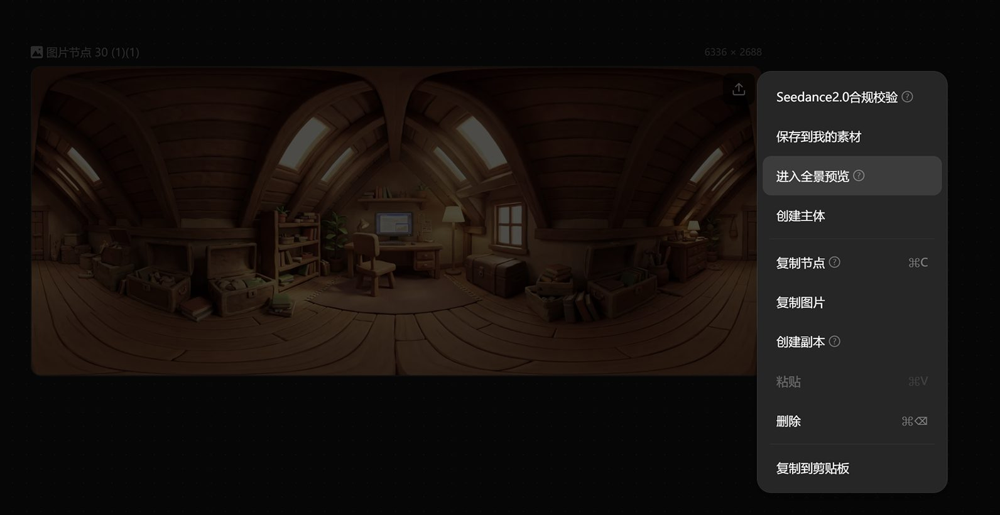</td>
</tr>
</tbody>
</table>

**全景功能：**

|                                                            |                                                                                                                                                                       |
|------------------------------------------------------------|-----------------------------------------------------------------------------------------------------------------------------------------------------------------------|
| 点击**\[进入全景\]**后，支持自由旋转并**基于当前视角截图** | 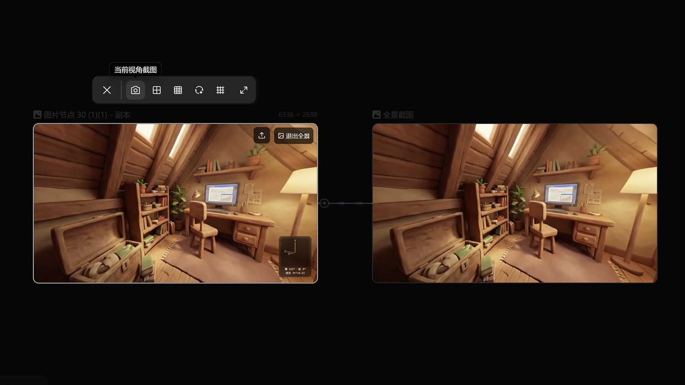 |

|                                                                                            |                                                                                                                                                                |
|--------------------------------------------------------------------------------------------|----------------------------------------------------------------------------------------------------------------------------------------------------------------|
| **4大视角截图**：基于上传的全景图每90°截图一次，自动生成环境前方、后方、左侧、右侧的截图。 | 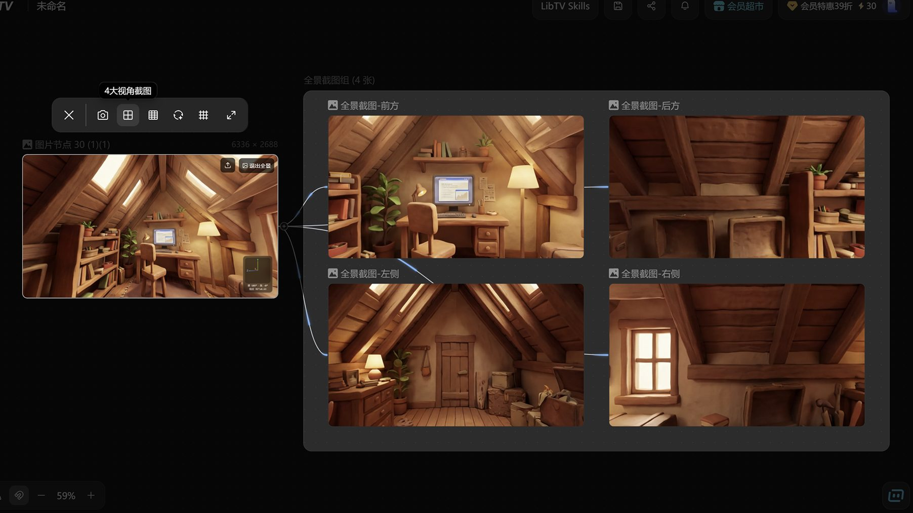 |

|                                                                             |                                                                                                                                                                       |
|-----------------------------------------------------------------------------|-----------------------------------------------------------------------------------------------------------------------------------------------------------------------|
| **12大视角截图**：基于上传的全景图每30°截图一次，自动截取当前环境的12个角度 | 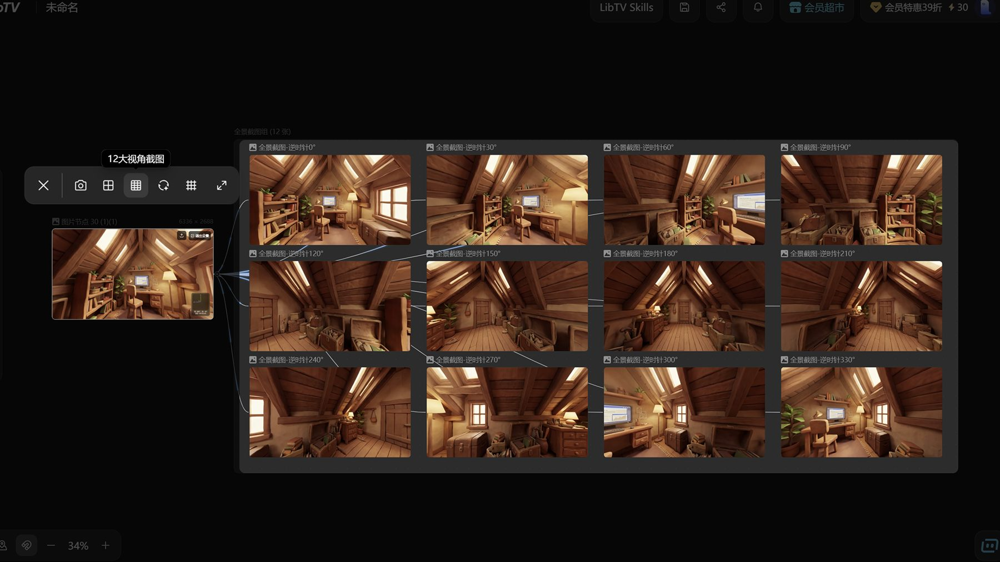 |

|                                  |                                                                                                                                                                   |
|----------------------------------|-------------------------------------------------------------------------------------------------------------------------------------------------------------------|
| **重置视角**：回到全景图初始角度 | 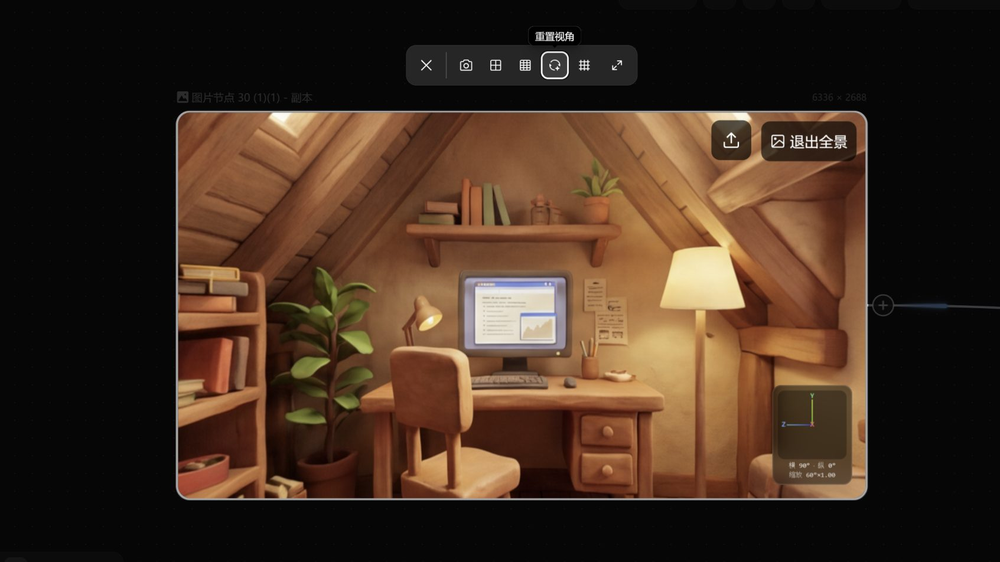 |

|                              |                                                                                                                                                                       |
|------------------------------|-----------------------------------------------------------------------------------------------------------------------------------------------------------------------|
| **构图参考线**：用于辅助构图 | 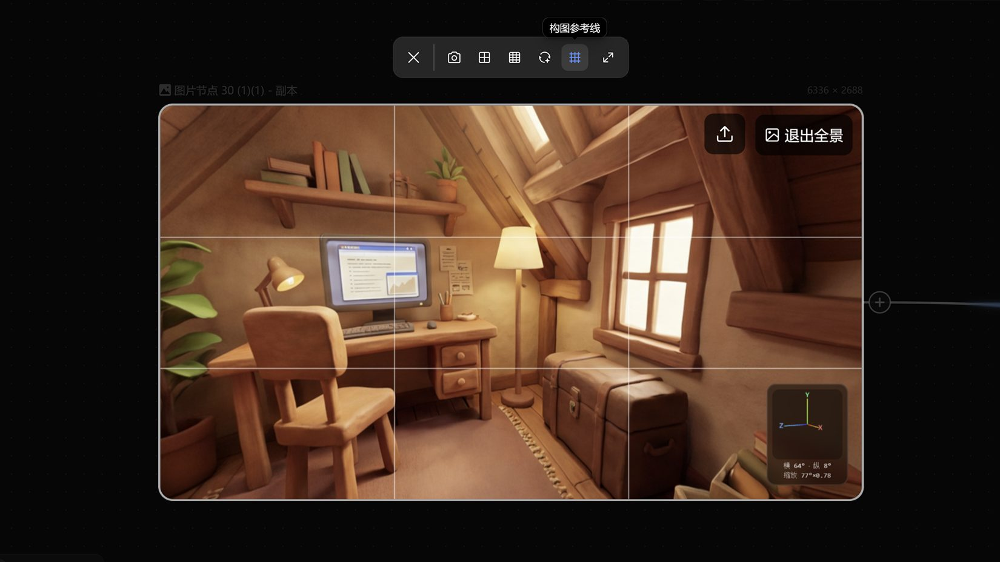 |

> **2.2.2 多角度**

**功能简述：**可基于当前图像生成多个不同的拍摄视角的图像，支持8个水平环绕点位、4个垂直俯仰点位和3个景别缩放点位

> 

**相机视角设置：**支持左侧**「三维网格坐标球」**或右侧**「数值滑块」2** 种调节方式

<table>
<colgroup>
<col style="width: 48%" />
<col style="width: 51%" />
</colgroup>
<tbody>
<tr class="odd">
<td>
<strong>三维网格坐标球：</strong> 支持鼠标按住相机图标拖动调节，或者通过坐标球周围的4个箭头图标进行调节

<strong>数值滑块：</strong>用鼠标拖动滑块调节
</td>
<td>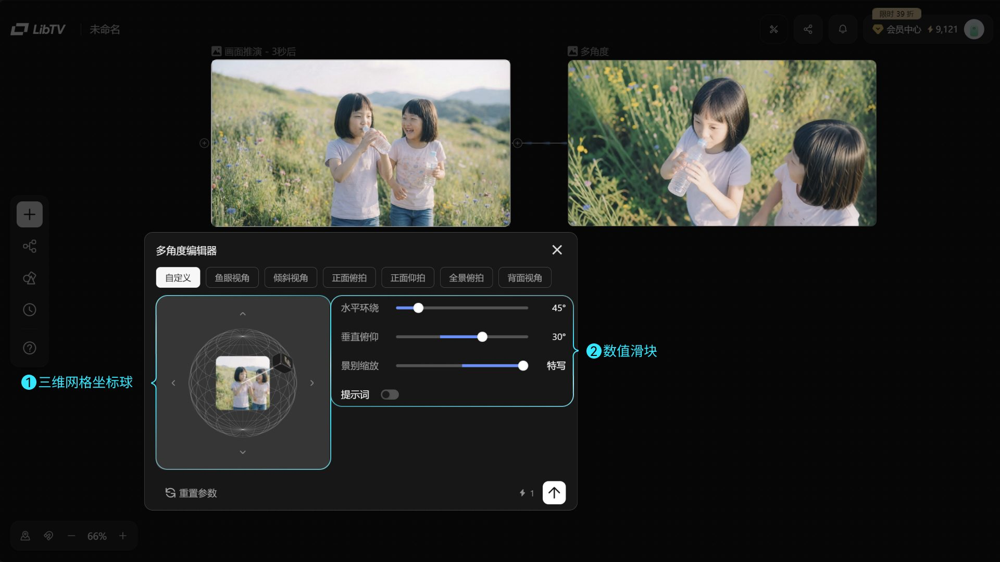</td>
</tr>
</tbody>
</table>

<table>
<colgroup>
<col style="width: 50%" />
<col style="width: 50%" />
</colgroup>
<tbody>
<tr class="odd">
<td>
<strong>额外提示词：</strong>高级功能，<strong>开启后支持额外输入「中文/英文提示词」</strong>，强化或优化视角生成效果

开启「提示词」按钮：输入“极度特写镜头，广角镜头，边缘带有鱼眼畸变效果”，可以在指定拍摄视角之外添加“鱼眼镜头”效果
</td>
<td>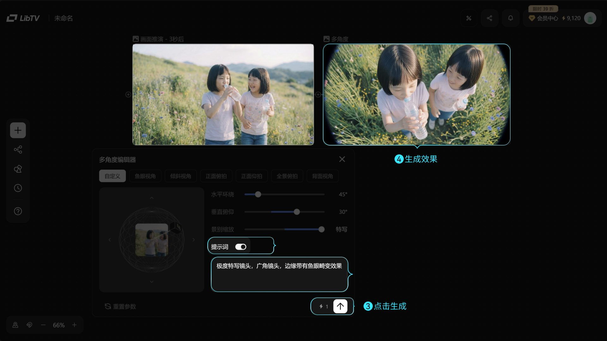</td>
</tr>
</tbody>
</table>

**预设视角：一键直出同款视角**

|                                                                           |                                                                                                                                                                       |
|---------------------------------------------------------------------------|-----------------------------------------------------------------------------------------------------------------------------------------------------------------------|
| 编辑器顶部有6项视角预设选项，点击后可一键加载对应的相机参数，点击生成即可 | 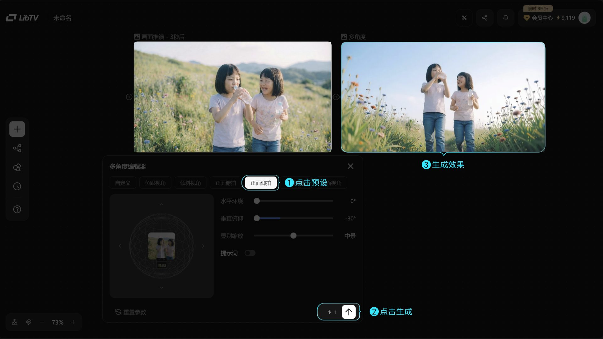 |

> **2.2.3 打光**

**功能简述：**支持**调节一张图像的打光角度、光源颜色、画面亮度和增加轮廓光，**此外还有「智能模式」，我们可以通过**简单描述**想要的打光效果、情绪氛围、色调或**提供打光参考图**，直接得到想要的打光氛围。

> 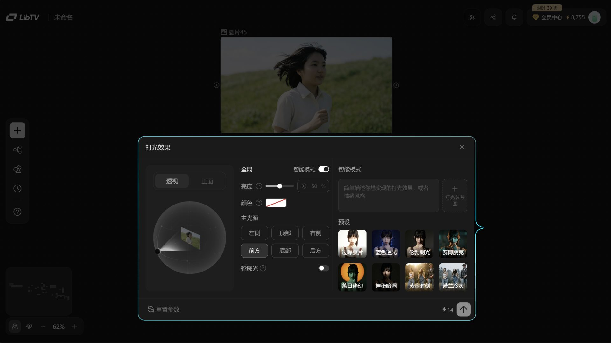

**左侧「三维坐标球」：**可设置26个主光点位和9个轮廓光点位

<table>
<colgroup>
<col style="width: 50%" />
<col style="width: 50%" />
</colgroup>
<tbody>
<tr class="odd">
<td>
支持通过<strong>鼠标拖动</strong>设置打光角度，支持26个主光点位和9个轮廓光点位（轮廓光需要手动开启）

面板开启后，默认主光角度（前方）不生效。鼠标点击或拖动光源后<strong>灯光亮起，才表示打光角度生效</strong>

轮廓光开启后，主光不支持设置在轮廓光支持的9个背光点范围内，否则轮廓光会自动关闭或无法开启

右侧有6种<strong>主光角度预设</strong>，可点击直接使用
</td>
<td>
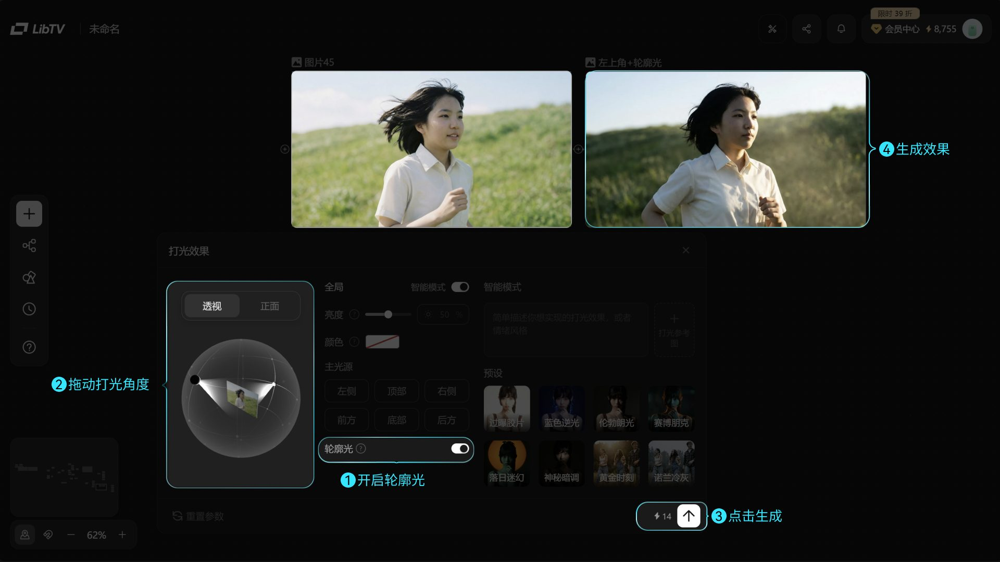

<strong>打光示例：主光源：左上角；轮廓光：正后方</strong>
</td>
</tr>
</tbody>
</table>

**亮度：**调节画面整体亮度，有5档可以调节

<table>
<colgroup>
<col style="width: 50%" />
<col style="width: 50%" />
</colgroup>
<tbody>
<tr class="odd">
<td>
默认亮度为50%，未设置时进度条为灰色。<strong>鼠标点击或拖动滑块后变成蓝色，才表示生效</strong>

最低档10%可营造暗调氛围，最高档100%将形成过曝效果
</td>
<td>
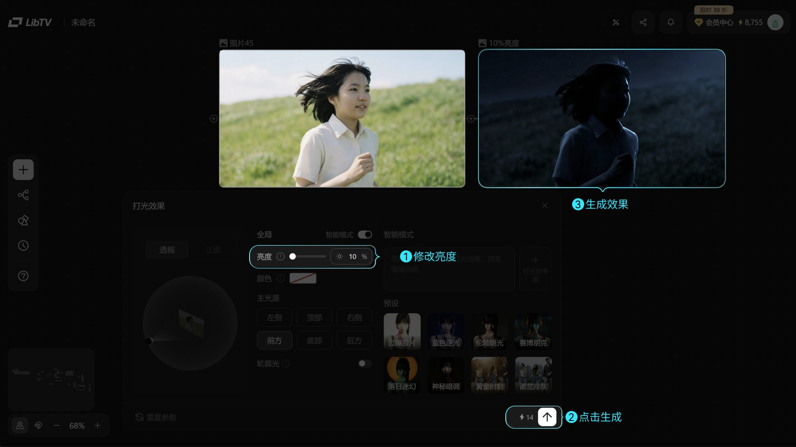

<strong>打光示例：亮度设置为10%</strong>
</td>
</tr>
</tbody>
</table>

**颜色：**通过调色板选色，用于控制**主光源颜色**

|                                            |                                                                                                                                                                        |
|--------------------------------------------|------------------------------------------------------------------------------------------------------------------------------------------------------------------------|
| 默认无色值，可点击调出调色板，进行颜色设置 | 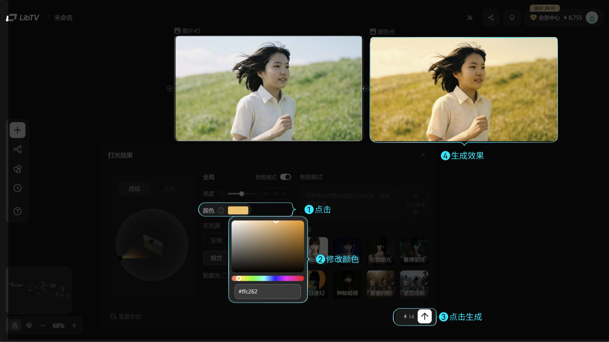 |

**智能模式：需要手动开启**，支持**通过提示词或参考图**快速实现想要的打光效果

<table>
<colgroup>
<col style="width: 50%" />
<col style="width: 50%" />
</colgroup>
<tbody>
<tr class="odd">
<td>
<strong>提示词：</strong>我们可简述想要的打光效果、情绪氛围或者画面色调，即可得到对应的打光效果

<table>
<colgroup>
<col style="width: 100%" />
</colgroup>
<tbody>
<tr class="odd">
<td>
“让画面的光影氛围变成黄金时刻（Golden Hour）”

输入“让画面拥有《赛博朋克2077》同款<strong>打光方式</strong>和<strong>画面质感</strong>”

输入“让画面氛围变得更加绝望、压抑”
</td>
</tr>
</tbody>
</table>

<strong>参考图</strong>：支持上传一张打光参考图，无需提示词，可以直接得到想要的打光氛围。

<strong>打光预设</strong>：官方提供6种打光预设，点击后会加载对应的参数，直接点击生成即可
</td>
<td>
纯提示词生成效果

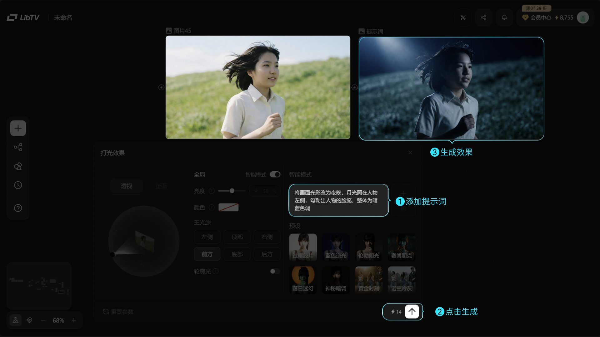

打光预设【蓝色逆光】

<blockquote>

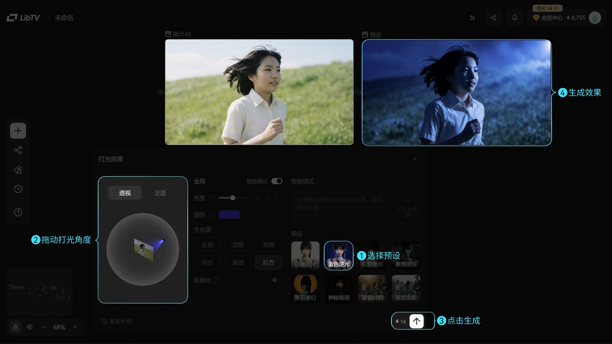

</blockquote></td>
</tr>
</tbody>
</table>

> **2.2.4 九宫格**
>
> 功能简述：提供多种智能分镜生成模式，包括：剧情推演四宫格、25宫格连贯分镜、电影级光影校正、角色三视图生成、画面推演-3秒后、画面推演-5秒前, 使用详情直达：[LibTV使用指南](https://resonate.feishu.cn/wiki/Loxfw6XHziYRk0kKzdjcFfp9nhb#share-NaJAdUnSdoCbSFxQaqycL8Ccn1V)
>
> **2.2.5 图像基础编辑**
>
> 功能简述：点击**\[高清\]**，下拉菜单中包括高清、扩图、重绘、擦除、抠图、剪裁六项图像基础编辑功能

|              |                                                                                        |
|--------------|----------------------------------------------------------------------------------------|
| **功能名称** | **功能简述**                                                                           |
| 高清放大     | 对图像进行2/4/6倍高清放大处理，支持通用、低分辨率、3D动画、高保真、文本优化5种模式。   |
| 扩图         | 基于当前图像向外扩展，支持6种画幅比；可自定图像分辨率（1K/2K/6K）和生成张数（1-4张）。 |
| 重绘         | 通过画笔涂抹或选取图像中需要修改的部分，使用提示词进行修改。                           |
| 擦除         | 用户可通过画笔框选，选取图片特定部位加以擦除。                                         |
| 抠图         | 自动去除图片背景，保留主体。                                                           |
| 裁剪         | 可以自由或选取特定比例对图像进行裁切。                                                 |

> **2.2.6 宫格切分**

**功能简述**

> **专门针对「9宫格」「25宫格」等多宫格图像**推出的拆分功能，拆分后用户可以指定提取对应的分镜切片，然后进行重新渲染或高清放大操作

<table>
<colgroup>
<col style="width: 33%" />
<col style="width: 33%" />
<col style="width: 33%" />
</colgroup>
<tbody>
<tr class="odd">
<td>
1️⃣ 上传宫格图像后，点击顶部菜单栏的「宫格拆分」按钮，并按需要选择对应的宫格数量

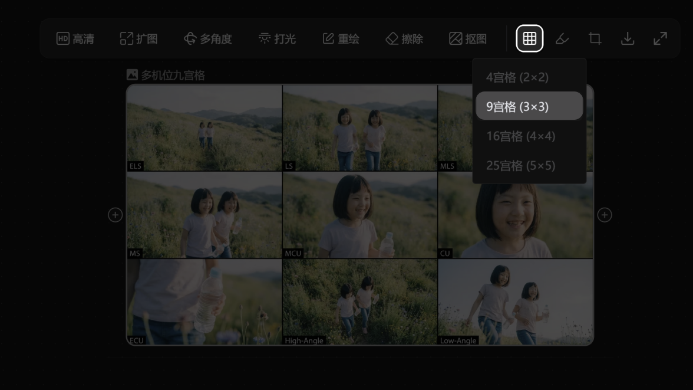
</td>
<td>
2️⃣ 画布进入沉浸模式，按指引点击选择需要提取的分镜切片，然后点击「发送到生成器」

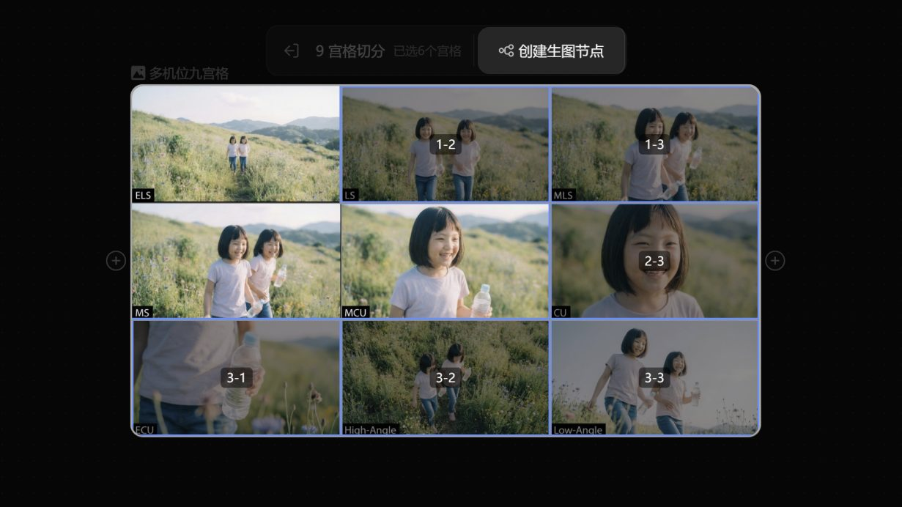
</td>
<td>
3️⃣ 系统会自动将对应的切片发送到新的图片节点并进行打组，我们可进行重新渲染或高清放大操作

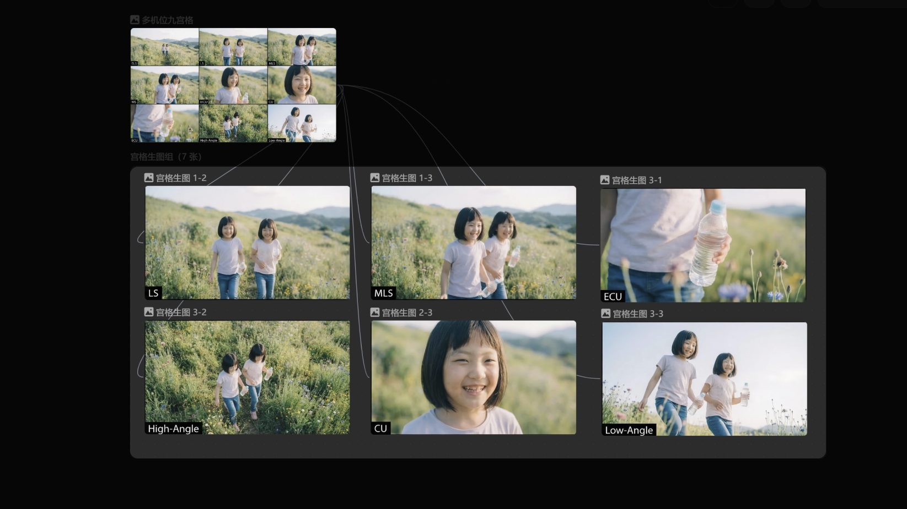
</td>
</tr>
</tbody>
</table>

**自定义分割线位置**

> 进入宫格切分功能界面后，将鼠标hover在分割线上，鼠标箭头转换为左右箭头图标时，即可拖动修改分割线的位置。调整完成后，直接点击「创建分镜组」或「高清放大」。支持一键复位至分割线位置。

**\[宫格切分-自定义分割线位置.mp4\]**

> **2.2.7 标注**

功能描述：支持**涂鸦笔**或**框选工具**在图像上圈定具体区域，可直接在该区域内**添加文字**。

保存标注信息，生成时无需添加复杂的描述即可按照圈定的位置和文字内容重新生成。

**注意⚠️：如果是通过标记功能，删除/修改画面中的某些内容，则**

优先使用最新图像模型：比如 LibNavo 或者 Lib Image

推荐在提示词中添加**“修后不可以留下任何标注痕迹”**

> 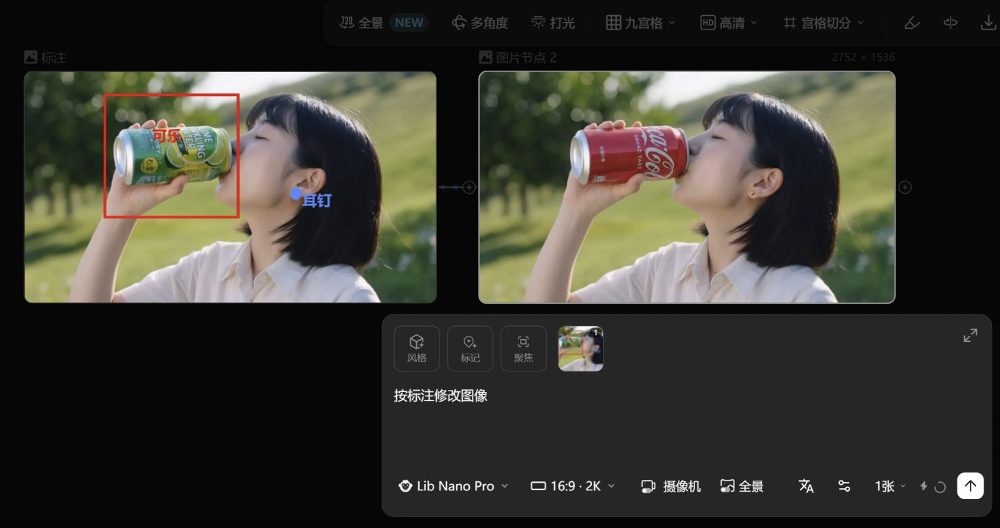
>
> **2.2.8 旋转与镜像**

功能说明：支持在画布内对图片进行镜像翻转、旋转（含90°/180°/270°、任意角度可选）

<table>
<colgroup>
<col style="width: 50%" />
<col style="width: 50%" />
</colgroup>
<tbody>
<tr class="odd">
<td>
<strong>旋转</strong>

支持三种旋转方式：固定角度（每次顺时针旋转90°）、自定义角度、手动拖拽。

①固定角度旋转：点击以下按钮，图片会每次顺时针旋转90°

②自定义角度：点击角度输入框,直接输入 0～360 之间的整数（顺时针角度），图片会实时旋转到该角度。

③手动旋转：直接拖动，即可任意旋转图片。
</td>
<td>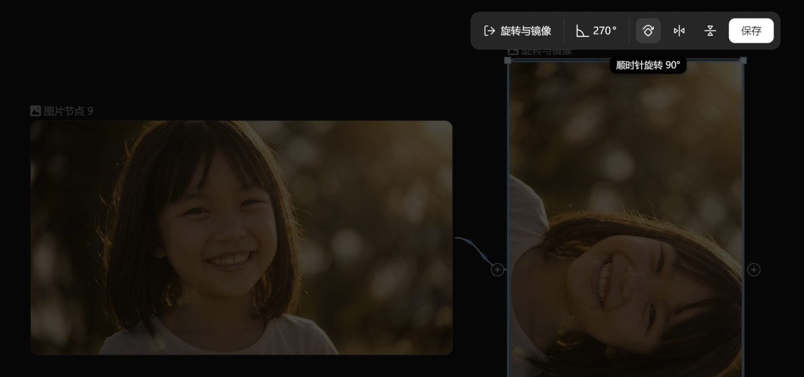</td>
</tr>
</tbody>
</table>

<table>
<colgroup>
<col style="width: 50%" />
<col style="width: 50%" />
</colgroup>
<tbody>
<tr class="odd">
<td>
<strong>2、镜像（左右/上下）</strong>

水平镜像：点击“左右镜像”按钮，图片左右翻转。

垂直镜像：点击“垂直镜像”按钮，图片上下翻转。
</td>
<td>
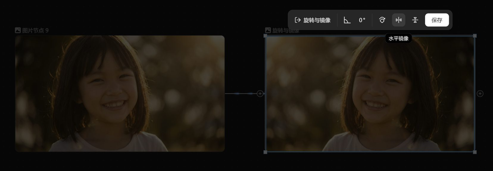

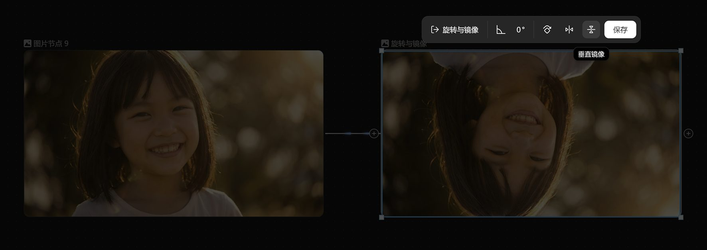
</td>
</tr>
</tbody>
</table>

**2.2.9 分镜组 🔥**

**功能简述**：

> 分镜组指出将多张图片节点整合到一个规整的**宫格布局**中，进行统一查看、排序和管理。每个宫格的位置支持智能排序，且数量和画幅比都是支持自定义，形成整齐划一的视觉效果。
>
> **适用场景：**电影分镜组、故事板/情绪板

**\[PixPin_2026-05-08_15-13-49.mp4\]**

**使用入口：**

<table>
<colgroup>
<col style="width: 35%" />
<col style="width: 64%" />
</colgroup>
<tbody>
<tr class="odd">
<td>
<strong>1️⃣ 多选图像节点创建</strong>

在画布上<strong>框选</strong>多张图片节点

点击顶部工具栏「打组」<strong>，选择</strong>「合并分镜组」

系统会根据你选择的图片数量，自动生成合适的宫格布局
</td>
<td>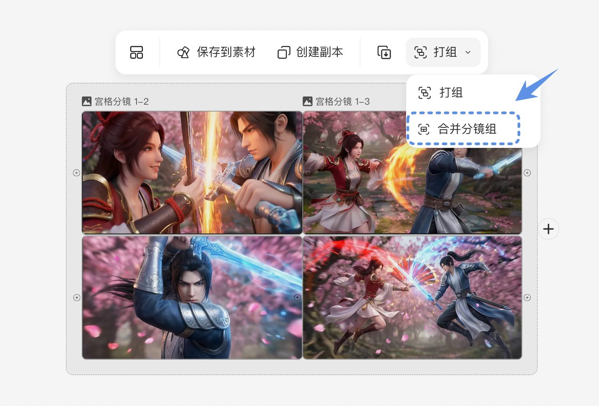</td>
</tr>
</tbody>
</table>

<table>
<colgroup>
<col style="width: 36%" />
<col style="width: 63%" />
</colgroup>
<tbody>
<tr class="odd">
<td>
2️⃣ 将已有普通组转换为分镜组

选中画布上一个<strong>只包含图像节点</strong>的普通组。

在顶部工具栏会出现「转分镜组」的选项，点击即可。

分镜组快捷键:

<strong>Command + Option + G</strong> (Mac)

<strong>Ctrl + Alt + G</strong> (Windows)
</td>
<td>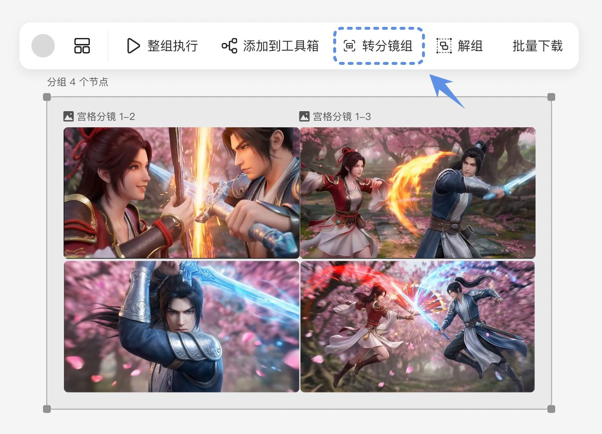</td>
</tr>
</tbody>
</table>

<table>
<colgroup>
<col style="width: 37%" />
<col style="width: 62%" />
</colgroup>
<tbody>
<tr class="odd">
<td>
<strong>3️⃣ 从「宫格切分」工具创建</strong>

使用「宫格切分」功能切分完成后，点击「创建分镜组」
</td>
<td>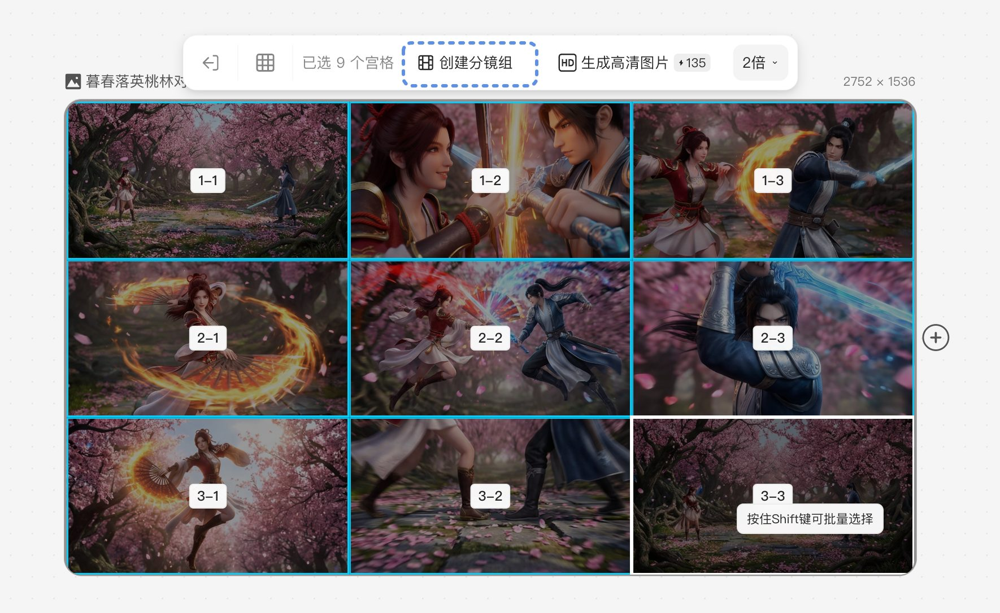</td>
</tr>
</tbody>
</table>

**「分镜组」工具栏顶bar&右键功能**

<table>
<colgroup>
<col style="width: 66%" />
<col style="width: 33%" />
</colgroup>
<tbody>
<tr class="odd">
<td>
工具栏顶bar

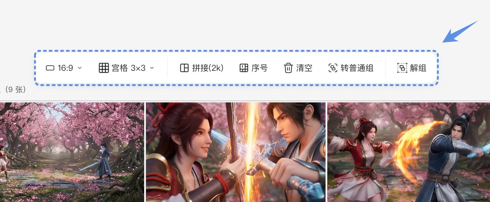
</td>
<td>
右键

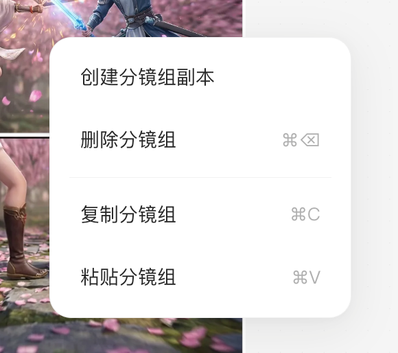
</td>
</tr>
</tbody>
</table>

<table>
<colgroup>
<col style="width: 11%" />
<col style="width: 88%" />
</colgroup>
<tbody>
<tr class="odd">
<td><strong>功能</strong></td>
<td><strong>作用</strong></td>
</tr>
<tr class="even">
<td><strong>比例切换</strong></td>
<td>
修改每个宫格的画幅比

支持<strong>21:9、16:9、9:16、3:4、4:3、1:1</strong>
</td>
</tr>
<tr class="odd">
<td><strong>宫格数量</strong></td>
<td>
修改组内宫格的行列布局

支持 <strong>2x2, 3x3, 4x4, 5x5</strong> 预设及自定义

<strong>减少宫格时</strong>，超出的图像会自动解组并排列在分镜组右侧
</td>
</tr>
<tr class="even">
<td><strong>拼接</strong></td>
<td>
将分镜组内所有图像<strong>合并为一张新的2K或4K大图</strong>

注意⚠️：如果分镜组内图像宽度不足<strong>2K或4K，则导出时会被强制放大，而非自动高清</strong>
</td>
</tr>
<tr class="odd">
<td><strong>序号</strong></td>
<td>
为每个宫格添加数字序号

启用后，拼接图像序号会显示在分镜右下角
</td>
</tr>
<tr class="even">
<td><strong>清空</strong></td>
<td>
一键移除分镜组内的<strong>所有图像</strong>

会删除节点及其连线。此操作有二次确认提示，请谨慎使用
</td>
</tr>
<tr class="odd">
<td><strong>转普通组</strong></td>
<td>
将分镜组转换回一个普通组

组内图片会按宫格顺序自动排列并打组
</td>
</tr>
<tr class="even">
<td><strong>解组</strong></td>
<td>彻底解散分镜组，所有图像恢复为完全独立的节点</td>
</tr>
<tr class="odd">
<td><strong>右键功能</strong></td>
<td>
支持<strong>创建副本</strong>（保留所有内部连线）

支持复制、粘贴、删除等常规操作
</td>
</tr>
</tbody>
</table>

2.3 **视频工具**

视频节点目前支持「高清」和「解析」两项功能

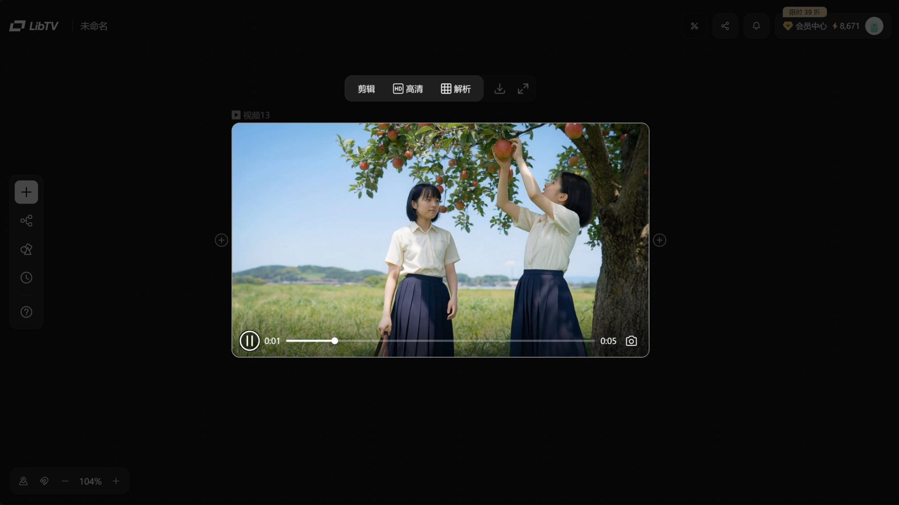

2.3.1 **视频高清**

**功能简述：**对当前画布的单个视频进行高清放大（2/4/6倍）及帧率提升（30/60/90fps）。减速强度可用于控制慢动作（Slow Motion）效果的参数。数值越高，动作越慢。

> 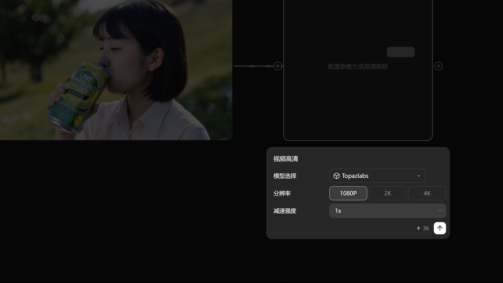

2.3.2 **视频解析**

**功能简述：**对当前画布的单个视频进行**分镜拆解分析**，分析结果**以表格的形式**呈现

> 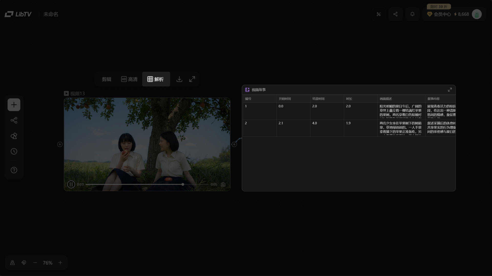

点击解析表右上角的全屏按钮，可以查看完整的解析结果，包括画面内容、景别、图像提示词、运镜提示词、起始节点、时长、音乐节奏、人声等。

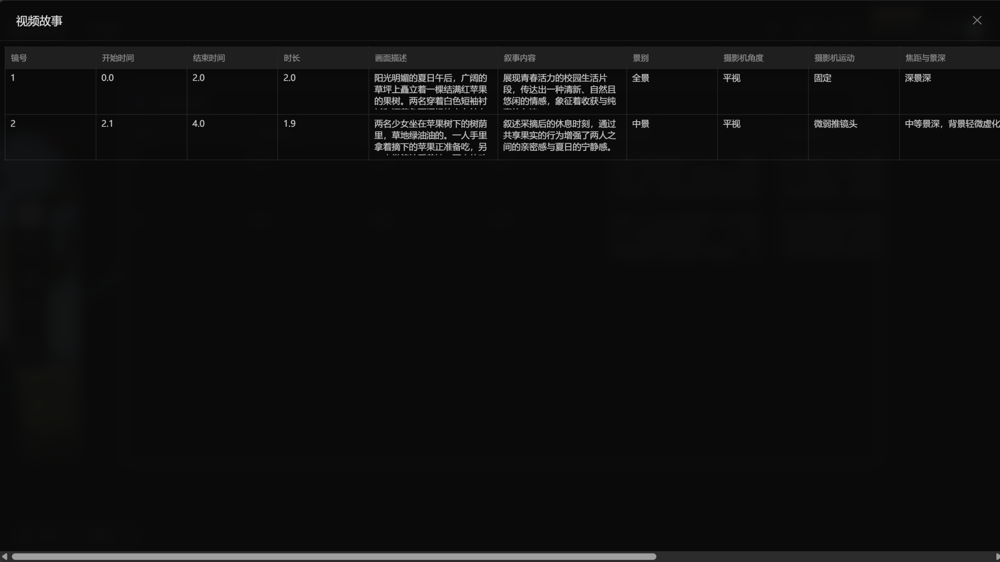

2.3.3 **视频剪辑**

**功能简介：**支持对画布上的**单个视频进行基础剪辑操作，**目前支持**视频片段裁取**

**支持对象**：视频时长≤10min， 分辨率≤ 1080P，格式 Mp4

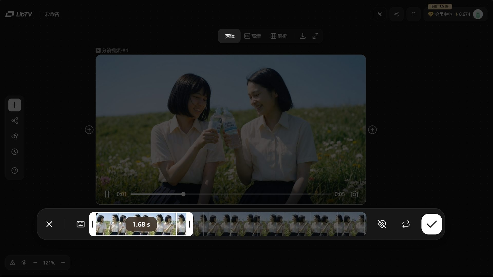

支持键盘快捷键操作

移动选区**键盘 ←/→**：裁取片段的长度不变，在时间轴上的位置左右移动

扩展/搜索选区**键盘↑/↓**：以 0.1s 为单位，调整片段长度

精确模式**键盘Shift键**：以 0.01s 为单位，调整片段长度

设置出点入点 **字母 I/O** ：设置截取的起点和终点

> 
>
> 2.3.4 **视频合成**

**功能介绍：**能够把多个视频片段拼接成一个完整视频，在**一个画布内完成完整视频创作闭环**。

**支持多片段顺序拼接**：自动统一素材差异，无缝拼接多段视频；支持视频原声 + 独立音频轨（BGM/配音）混合，一键静音/开音。

**时间轴编辑（拖动、裁剪、删除）**：拖拽调整片段顺序，裁剪起止点，选中按 Delete 删除；编辑过程中随时播放当前时间轴，空格键控制播放/暂停。

**实时播放预览**：预览画面与时间轴双向联动，点击时间轴跳转对应画面，支持暂停、快进、逐帧查看及全屏模式，实时模拟最终效果。

**20min长视频合成**：完整支持音视频组合创作，长视频无压力导出。

**\[7553750366022355112.mp4\]**

**使用方法：**

Step 1：在画布中连接 ≥2 个视频节点（或视频+音频），一起向右侧拖动连线，选择「视频合成」

> 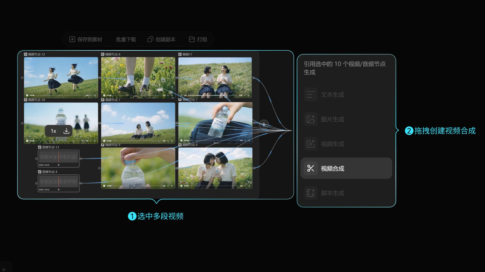

Step 2：点击节点中的「打开视频合成」按钮，调出底部「时间轴编辑面板」

> 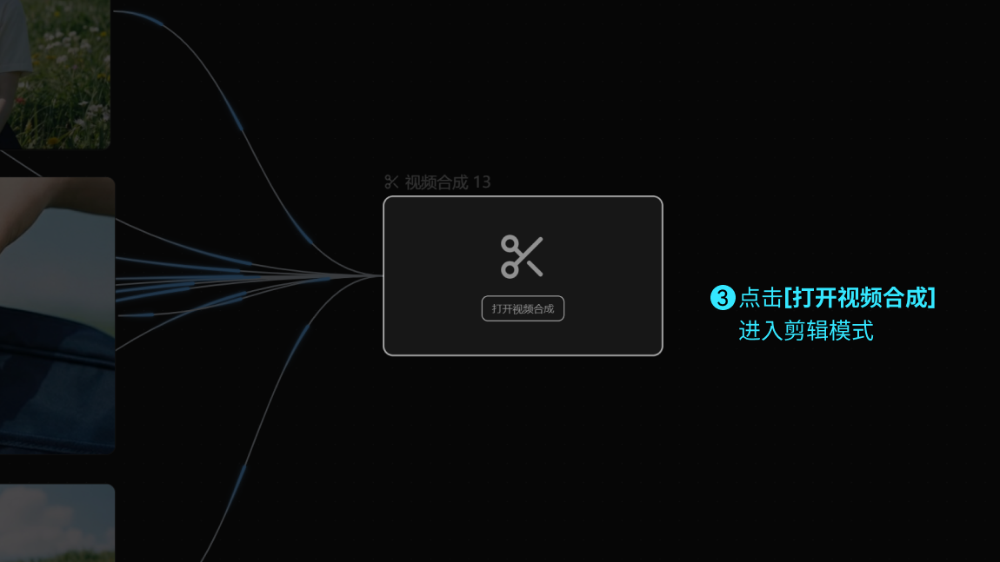
>
> 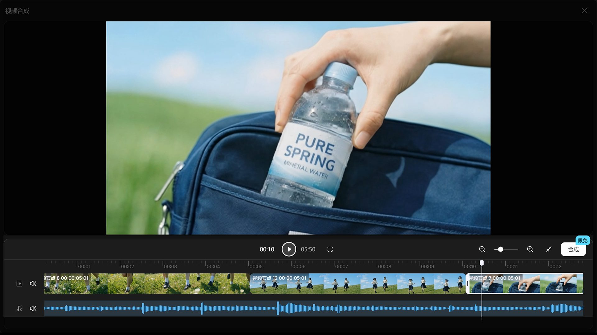

**Step 3：随时添加、删减视频**

点击右下角**收起按钮**，可进入**半屏剪辑模式**，在画布上实时进行视频的添加和删除。

**半屏剪辑模式下**，可直接一键拖动本地视频到视频轨道，不用重复上传

> 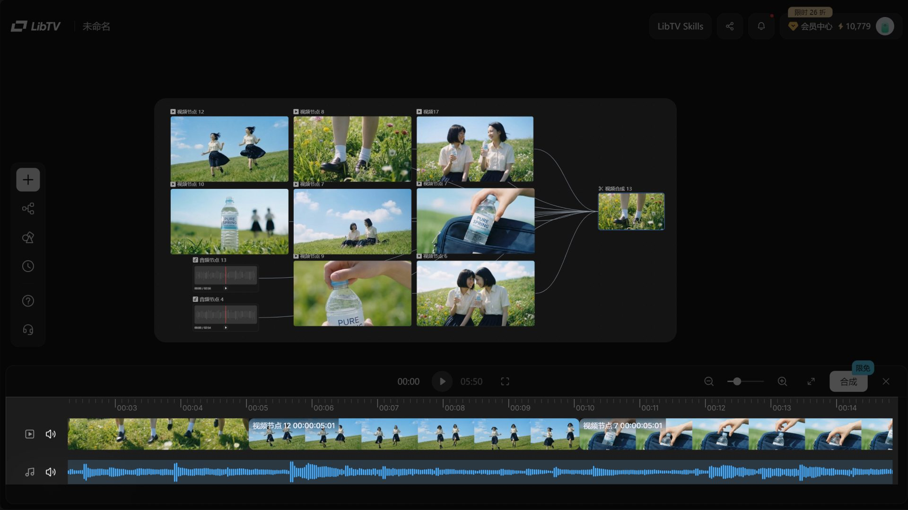

**Step 4：预览并生成成片**

<table>
<colgroup>
<col style="width: 50%" />
<col style="width: 50%" />
</colgroup>
<tbody>
<tr class="odd">
<td>
点击播放 → 查看完整视频效果

<blockquote>

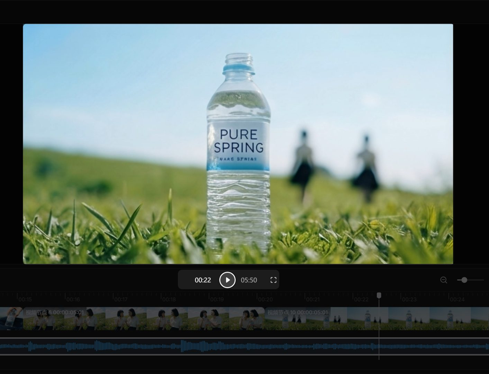

</blockquote></td>
<td>
点击合成 → 生成合成结果，点击下载 → 导出最终视频

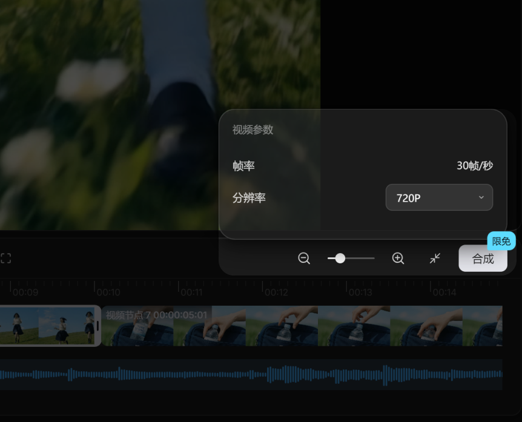
</td>
</tr>
</tbody>
</table>

> 2.3.5 **人声/背景音分离**

**功能简述**：支持从视频中分离出干净的人声或者背景声。

**入口：**在画布上选中一个视频片段，选择顶部工具栏中的「人声分离」，选择**分离人声**或者**分离背景声**。

> 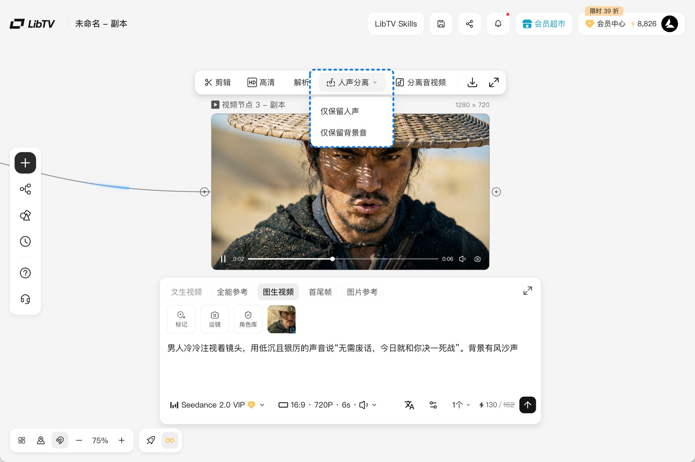
>
> 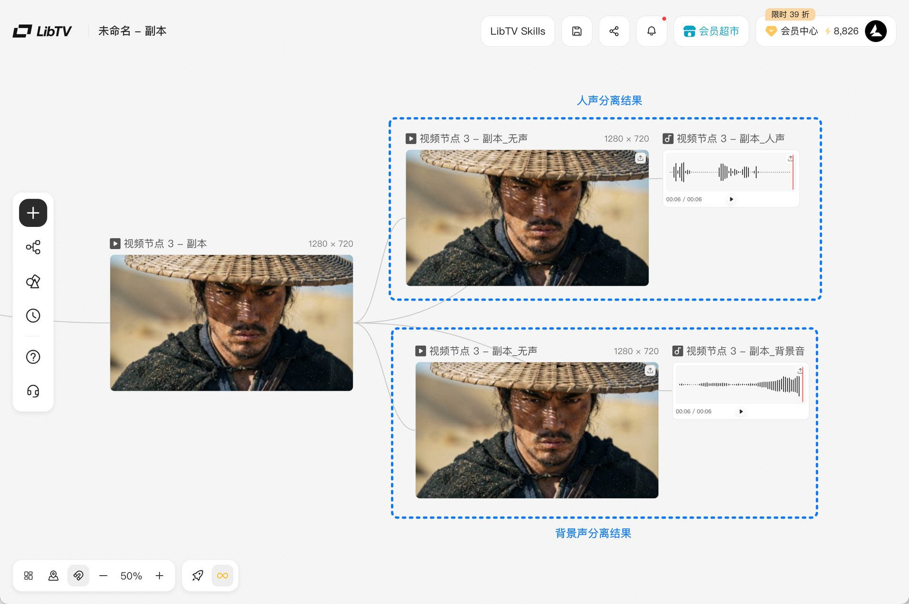
>
> 2.3.6 **分离音视频**

**功能简述：**将<u>视频画面</u>与<u>音频分离</u>

**入口：**在画布上选中一个视频片段，选择顶部工具栏中的「分离音视频」

> 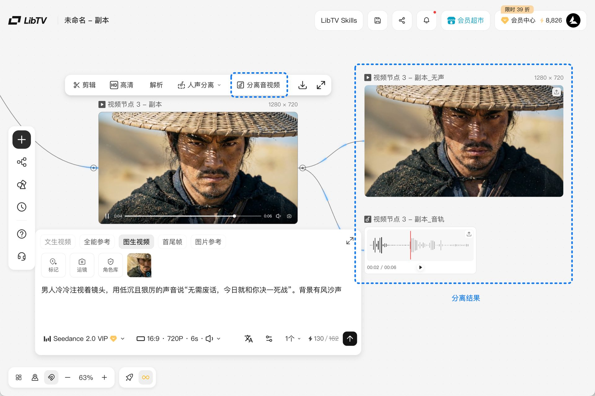
>
> 2.3.7 **智能剪辑🔥**

**功能亮点**

<table>
<colgroup>
<col style="width: 21%" />
<col style="width: 78%" />
</colgroup>
<tbody>
<tr class="odd">
<td>亮点</td>
<td>详情</td>
</tr>
<tr class="even">
<td>
<strong>支持不同剪辑场景</strong>

<table>
<colgroup>
<col style="width: 100%" />
</colgroup>
<tbody>
<tr class="odd">
<td>用智能剪辑代替繁琐重复的人工剪辑。</td>
</tr>
</tbody>
</table></td>
<td>
<strong>口播视频：</strong>自动去口水词、停顿，添加人物画中画、高亮文字动效上屏、转场、字幕等

<strong>批量广告：</strong>输入产品信息与目标场景，一次直出多条带货视频

<strong>智能混剪：</strong>多个原始素材自动卡点、视觉聚焦剪辑，快速产出广告大片

<strong>无人出镜解说视频：</strong>输入参考音色、文稿 或 一句话描述主题，无需出镜即可生成社媒爆款讲解视频
</td>
</tr>
<tr class="odd">
<td><strong>智能编排</strong></td>
<td>智能分析、编排多轨素材，自动匹配画面元素动效、卡点、布局等，一键剪辑成可发布成片。</td>
</tr>
</tbody>
</table>

**使用入口**

> 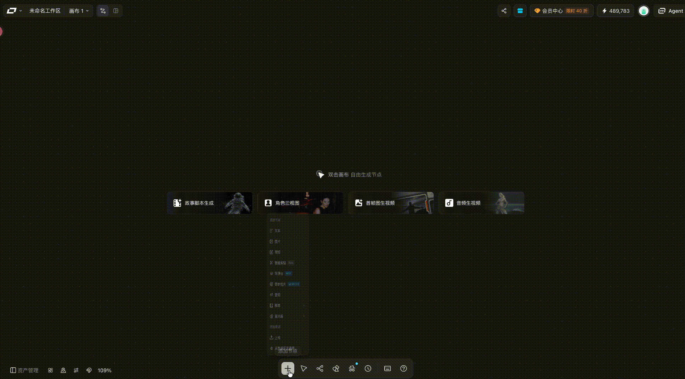

**Showcase**

<table>
<colgroup>
<col style="width: 29%" />
<col style="width: 39%" />
<col style="width: 31%" />
</colgroup>
<tbody>
<tr class="odd">
<td><strong>场景</strong></td>
<td><strong>输入提示词/参考</strong></td>
<td><strong>showcase 结果</strong></td>
</tr>
<tr class="even">
<td>
<strong>智能剪辑 — 口播</strong>

<table>
<colgroup>
<col style="width: 100%" />
</colgroup>
<tbody>
<tr class="odd">
<td>逐字稿+声音+图片 to <strong><u>faceless 成片</u></strong></td>
</tr>
</tbody>
</table></td>
<td>帮我做一条 唐制汉服的科普解说</td>
<td><strong>[唐制汉服科普解说-成片.mp4]</strong></td>
</tr>
<tr class="odd">
<td>
<strong>智能剪辑 — 口播</strong>

<table>
<colgroup>
<col style="width: 100%" />
</colgroup>
<tbody>
<tr class="odd">
<td>
拍摄的草稿视频 to 成片

自动去口水词、停顿，添加人物画中画、高亮文字动效上屏、转场、字幕等
</td>
</tr>
</tbody>
</table></td>
<td>待补充，预计周五晚</td>
<td>待补充，预计周五晚</td>
</tr>
<tr class="even">
<td>
<strong>智能剪辑 — 批量广告</strong>

<table>
<colgroup>
<col style="width: 100%" />
</colgroup>
<tbody>
<tr class="odd">
<td>输入产品、目标场景，直出多个带货视频</td>
</tr>
</tbody>
</table></td>
<td>
参考这个视频的节奏和运镜，用我的产品图批量制作广告

<table>
<colgroup>
<col style="width: 50%" />
<col style="width: 50%" />
</colgroup>
<tbody>
<tr class="odd">
<td></td>
<td><strong>[视频节点 1.mp4]</strong></td>
</tr>
</tbody>
</table></td>
<td><table>
<colgroup>
<col style="width: 50%" />
<col style="width: 50%" />
</colgroup>
<tbody>
<tr class="odd">
<td>
<strong>[202608051730.mp4]</strong>

<strong>[广告视频 #05 日韩女·棚拍·韩文.mp4]</strong>

<strong>[广告视频 #04 非裔女·纽约街头·英文.mp4]</strong>
</td>
<td>
<strong>[广告视频 #02 欧裔女·海边·英文.mp4]</strong>

<strong>[广告视频 #03 东南亚女·霓虹夜街·中文.mp4]</strong>
</td>
</tr>
</tbody>
</table>
<table>
<colgroup>
<col style="width: 50%" />
<col style="width: 50%" />
</colgroup>
<tbody>
<tr class="odd">
<td><strong>[4e417b7271a3dd1a73d501fc9b0634b9_raw.mp4]</strong></td>
<td><strong>[7a9146ad5151b06c63e809655f58b684_raw.mp4]</strong></td>
</tr>
</tbody>
</table></td>
</tr>
<tr class="odd">
<td>
<strong>智能剪辑 — 混剪</strong>

<table>
<colgroup>
<col style="width: 100%" />
</colgroup>
<tbody>
<tr class="odd">
<td>电商场景产品锁定广告片</td>
</tr>
</tbody>
</table></td>
<td>
根据我上传的素材，进行卡点和产品视觉追踪剪辑

<table style="width:100%;">
<colgroup>
<col style="width: 14%" />
<col style="width: 14%" />
<col style="width: 14%" />
<col style="width: 14%" />
<col style="width: 14%" />
<col style="width: 14%" />
<col style="width: 14%" />
</colgroup>
<tbody>
<tr class="odd">
<td><strong>[6_00000051 - 副本.mp4]</strong></td>
<td><strong>[6_00000194 - 副本.mp4]</strong></td>
<td><strong>[6_00000488 - 副本.mp4]</strong></td>
<td><strong>[6_00000578 - 副本.mp4]</strong></td>
<td><strong>[6_00000626 - 副本.mp4]</strong></td>
<td><strong>[视频节点 9_00000481 - 副本.mp4]</strong></td>
<td><strong>[6_00000000 - 副本.mp4]</strong></td>
</tr>
</tbody>
</table>
<table style="width:100%;">
<colgroup>
<col style="width: 14%" />
<col style="width: 14%" />
<col style="width: 14%" />
<col style="width: 14%" />
<col style="width: 14%" />
<col style="width: 14%" />
<col style="width: 14%" />
</colgroup>
<tbody>
<tr class="odd">
<td><strong>[视频节点 2 (1)00000048 - 副本.mp4]</strong></td>
<td><strong>[视频节点 9_00000000 - 副本.mp4]</strong></td>
<td><strong>[视频节点 9_00000049 - 副本.mp4]</strong></td>
<td><strong>[视频节点 9_00000241 - 副本.mp4]</strong></td>
<td><strong>[视频节点 9_00000291 - 副本.mp4]</strong></td>
<td><strong>[视频节点 9_00000337 - 副本.mp4]</strong></td>
<td><strong>[视频节点 10 - 副本 (1)00000446 - 副本.mp4]</strong></td>
</tr>
</tbody>
</table></td>
<td><table>
<colgroup>
<col style="width: 50%" />
<col style="width: 50%" />
</colgroup>
<tbody>
<tr class="odd">
<td><strong>[智能剪辑 成片.mp4]</strong></td>
<td><strong>[Feishu20260805-145810.mp4]</strong></td>
</tr>
</tbody>
</table></td>
</tr>
</tbody>
</table>

> 2.3.8 **逐帧拉片 💖**

**功能简述**

> 支持从多个维度（叙事分镜、精彩运镜、动作片段、音频参考）分析视频，输出准确、多样的素材供 Seedane 2.5 使用。

**使用方式**

<table>
<colgroup>
<col style="width: 46%" />
<col style="width: 53%" />
</colgroup>
<tbody>
<tr class="odd">
<td>使用方式</td>
<td>Showcase</td>
</tr>
<tr class="even">
<td>
上传视频到画布，点击视频 顶Bar「逐帧拉片」功能。

<table>
<colgroup>
<col style="width: 100%" />
</colgroup>
<tbody>
<tr class="odd">
<td>支持 50MB / 15min 以内的视频</td>
</tr>
</tbody>
</table>

视频会自动发送至「逐帧拉片」节点，默认支持全选 风景、动作运镜、音频三个维度，<strong>支持单选</strong>。

点击「开始拉片」开始处理，完成后，所有结果会展示在画布上，供后续参考使用。
</td>
<td>
<strong>入口</strong>

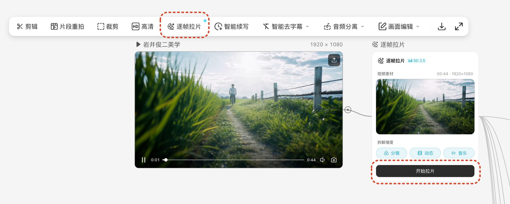
</td>
</tr>
<tr class="odd">
<td>
<strong>Showcase 1 ：https://kol.liblib.tv/canvas/share?spaceId=4718001&amp;projectId=a8104699d3a245d58fba655b74a7f526</strong>

<table>
<colgroup>
<col style="width: 50%" />
<col style="width: 50%" />
</colgroup>
<tbody>
<tr class="odd">
<td><strong>[岩井俊二美学.mp4]</strong></td>
<td>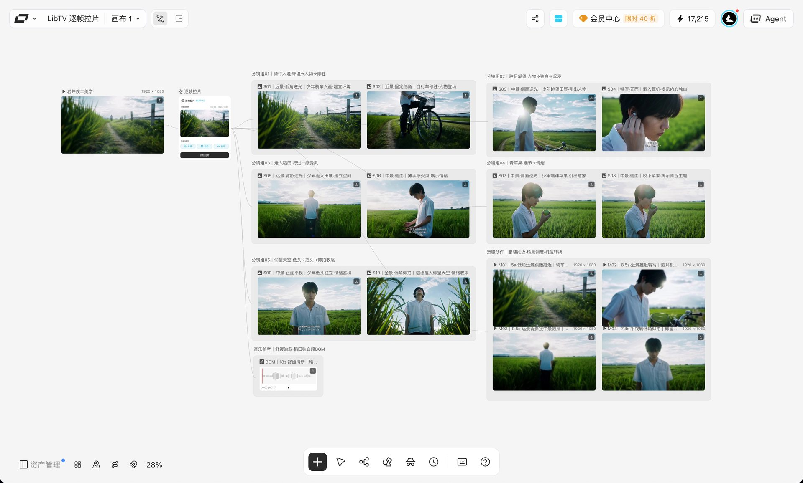</td>
</tr>
</tbody>
</table>

<strong>Showcase 2: https://kol.liblib.tv/canvas/share?spaceId=4716062&amp;projectId=0aa954e734fc41fa842ab5e816455f1c</strong>

<table>
<colgroup>
<col style="width: 50%" />
<col style="width: 50%" />
</colgroup>
<tbody>
<tr class="odd">
<td><strong>[《傲慢与偏见》影片开头绝妙长镜头.mp4]</strong></td>
<td>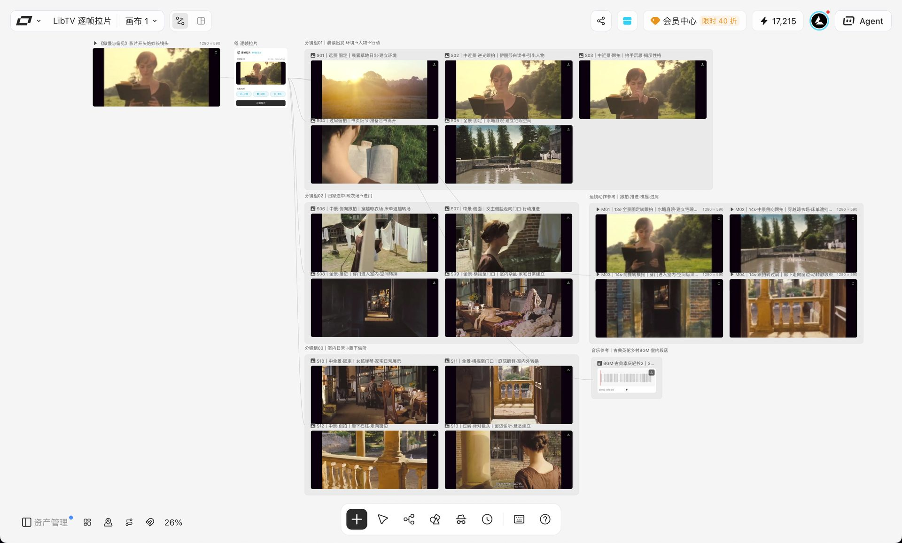</td>
</tr>
</tbody>
</table>

<strong>Showcase 3: https://kol.liblib.tv/canvas/share?spaceId=4718077&amp;projectId=fb7ab7f7f73e4d63b2373cf5ecec823a</strong>

<table>
<colgroup>
<col style="width: 50%" />
<col style="width: 50%" />
</colgroup>
<tbody>
<tr class="odd">
<td><strong>[【星际穿越】巨浪下死里逃生—电影中惊险刺激的片段节选 (1).mp4]</strong></td>
<td>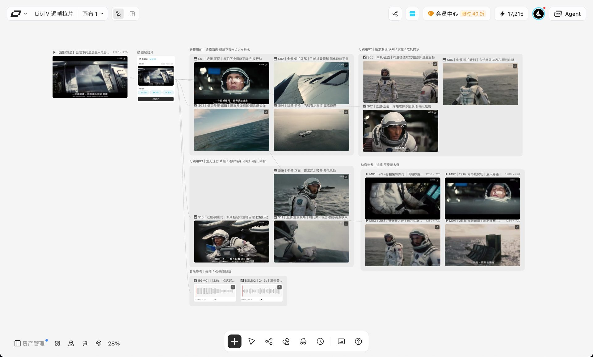</td>
</tr>
</tbody>
</table></td>
<td></td>
</tr>
<tr class="even">
<td>
<strong>Showcase 4：https://kol.liblib.tv/canvas/share?spaceId=4718127&amp;projectId=bd91c5e6c6034986942b26bfd7594cae</strong>

<table>
<colgroup>
<col style="width: 50%" />
<col style="width: 50%" />
</colgroup>
<tbody>
<tr class="odd">
<td><strong>[F1混剪.mp4]</strong></td>
<td>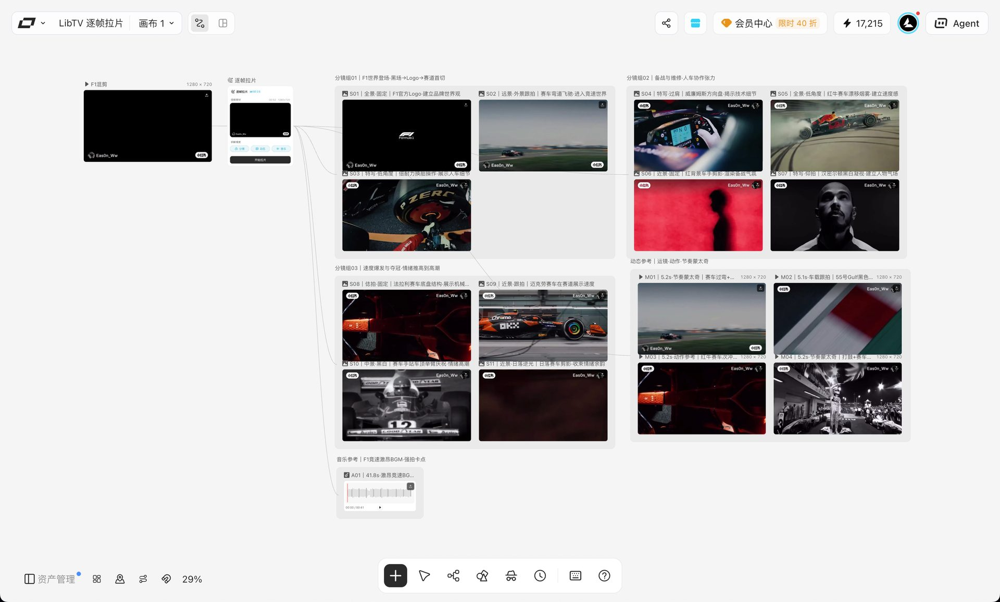</td>
</tr>
</tbody>
</table></td>
<td></td>
</tr>
</tbody>
</table>

> 2.3.9 **智能续写**

**功能亮点**

> 支持从视频任意时间点开始续写。选择续写起点，输入后续内容描述，还可添加新的参考图片或视频，即可在延续原视频人物、场景与画面风格的基础上生成后续内容。

**使用方式**

**\[录屏2026-08-05 01.27.11.mov\]**

> 2.3.10 **片段重拍 🌸**

**功能简述**

> 支持毫秒级时间戳精准定位，通过时间轴预览自由选择一个或多个片段进行重拍，并可用文字描述每段需要修改的具体内容

<table>
<colgroup>
<col style="width: 41%" />
<col style="width: 58%" />
</colgroup>
<tbody>
<tr class="odd">
<td>能力说明</td>
<td>图示</td>
</tr>
<tr class="even">
<td>
点击想要重拍的视频，选择上方「片段重拍」功能

自动创建重拍节点并弹出时间轨，选择一个或者多个想要重拍的片段并描述自己的重拍需求

支持时间段的修改和删除（键盘删除按键直接删除哦）
</td>
<td>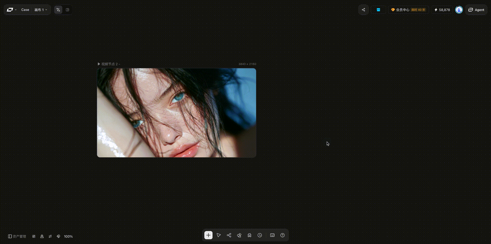</td>
</tr>
</tbody>
</table>

> 2.3.11 **深度动作捕捉**

**功能简介**

> 一键提取视频深度信息，动作/运镜参考不再受原始风格、元素等特征干扰，参考效果更稳定。

**使用步骤&showcase**

<table>
<colgroup>
<col style="width: 42%" />
<col style="width: 57%" />
</colgroup>
<tbody>
<tr class="odd">
<td>步骤</td>
<td>截图</td>
</tr>
<tr class="even">
<td>
在LibTV画布上选中一个视频，点击顶部工具栏中「逐帧拉片」的下拉选项「深度动作捕捉」。

<table>
<colgroup>
<col style="width: 100%" />
</colgroup>
<tbody>
<tr class="odd">
<td>处理时长 ≤ 3分钟</td>
</tr>
</tbody>
</table></td>
<td>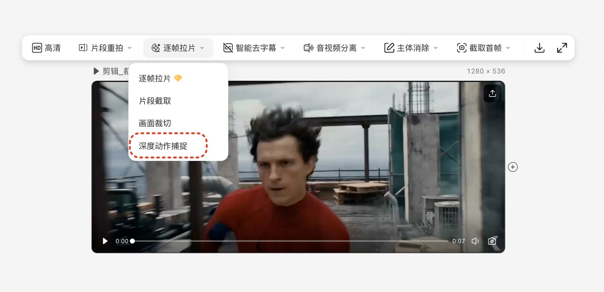</td>
</tr>
<tr class="odd">
<td>
在弹出的生成节点中，选择对应的处理分辨率，点击生成

<table>
<colgroup>
<col style="width: 100%" />
</colgroup>
<tbody>
<tr class="odd">
<td>
默认是480P，处理速度快

可选720P，支持 30s 以内的视频，处理时间稍长
</td>
</tr>
</tbody>
</table></td>
<td>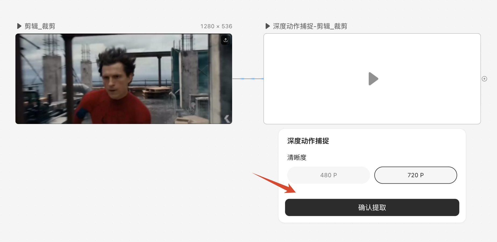</td>
</tr>
<tr class="even">
<td>提取完成后，深度信息视频会以节点的形式呈现在画布上，可作为下游视频节点使用。</td>
<td>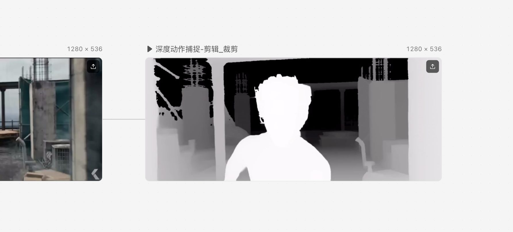</td>
</tr>
<tr class="odd">
<td><strong>[剪辑_裁剪 (1).mp4]</strong></td>
<td><strong>[深度动作捕捉-剪辑_裁剪 (1).mp4]</strong></td>
</tr>
<tr class="even">
<td>
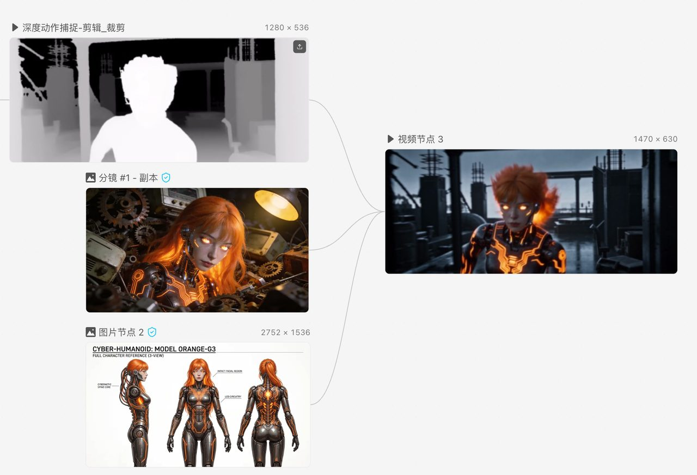

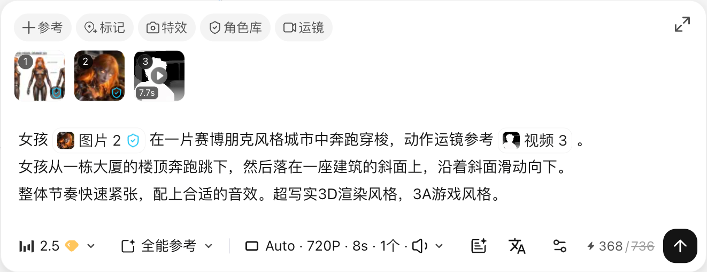
</td>
<td><strong>[视频节点 3.mp4]</strong></td>
</tr>
</tbody>
</table>

2.4 **LibTV 导演台 💥**

|                                                                               |
|-------------------------------------------------------------------------------|
| 如遇无法打开导演台节点的情况，请进入浏览器-系统，打开「使用图形加速功能」设置 |

2.4.1 **功能简述**

LibTV 导演台是一个的轻量级 3D 构图节点，帮助用户用摆积木的方式搭建故事空间，通过多视角截图，快速得到可被 AI 图像/视频模型准确理解的构图参考。

👉 立即体验：https://www.liblib.tv/canvas/share?shareId=n69CS8i3W

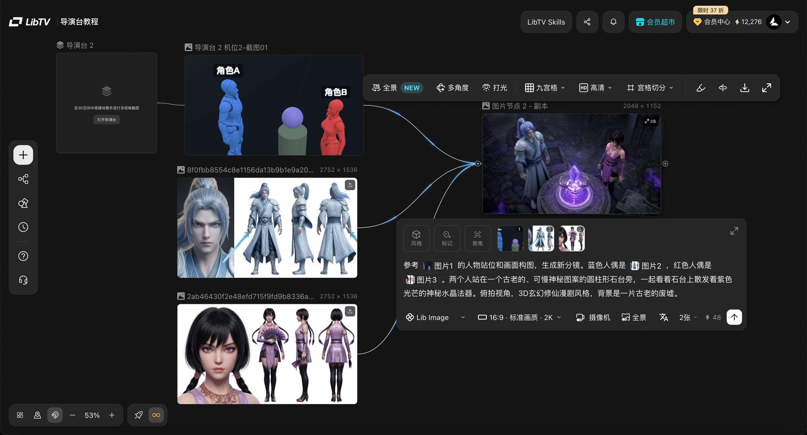

2.4.2 **基础使用路径**

<table>
<colgroup>
<col style="width: 28%" />
<col style="width: 47%" />
<col style="width: 23%" />
</colgroup>
<tbody>
<tr class="odd">
<td>步骤</td>
<td>操作</td>
<td>Tips</td>
</tr>
<tr class="even">
<td>
<strong>Step 1：</strong>

双击画布空白处，新建「导演台」节点

<strong>Step 2：</strong>

点击「打开导演台」进入3D空间
</td>
<td><table>
<colgroup>
<col style="width: 54%" />
<col style="width: 45%" />
</colgroup>
<tbody>
<tr class="odd">
<td></td>
<td>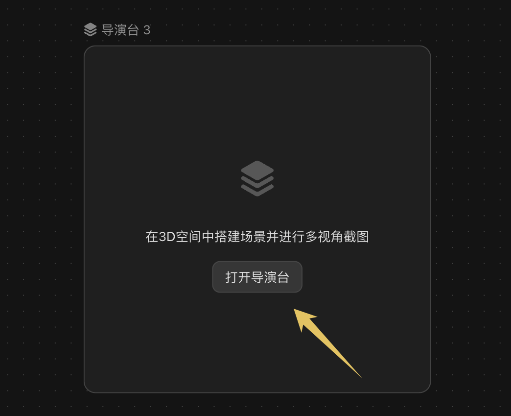</td>
</tr>
</tbody>
</table></td>
<td></td>
</tr>
<tr class="odd">
<td>
<strong>Step 3：</strong>

添加模型，支持4种类型

人体素模

基础几何模型

群众阵列

从本地上传
</td>
<td><strong>[PixPin_2026-05-22_23-07-51.mp4]</strong></td>
<td>
左侧栏：

3D空间内所有元素的清单

可以进行删除、重命名、打组/解组、隐藏/显示等操作

右侧栏

查看&amp;管理所选对象的属性，共4种

3D场景（整体空间）

角色（人体素模）

元素（基础形状）

摄像机（机位）
</td>
</tr>
<tr class="even">
<td>
<strong>Step 3：调整画布元素站位</strong>

有三种画布元素操作模式：

移动元素位置（快捷键：V）

旋转元素（快捷键：R）

缩放元素体积(快捷键：S)

按住shift键，可以等比缩放
</td>
<td><strong>[PixPin_2026-05-22_23-17-43.mp4]</strong></td>
<td>
选中3D模型，可以在「右侧栏-属性」中，调整模型的颜色

</td>
</tr>
<tr class="odd">
<td>
<strong>Step 4：调整相机机位&amp;截图</strong>

相机位置可以调整

调整完成后，在顶部切换至「机位视角」，可以实时查看机位内容预览

「导演视角」下，可以自由调整视角，点击「截图」，可一键基于当前视角新增拍摄机位&amp;自动截图

支持不同比例截图

所有截图，可在「摄像机」右侧栏中查看所有截图

支持发送到画布、删除等操作
</td>
<td>
<strong>「机位视角」</strong>

<strong>[PixPin_2026-05-22_23-58-13.mp4]</strong>

截图

<strong>[PixPin_2026-05-23_00-03-00.mp4]</strong>

<strong>「导演视角」，一键创建当前视角机位+截图</strong>

<strong>[PixPin_2026-05-23_00-08-26.mp4]</strong>
</td>
<td>
机位预览图

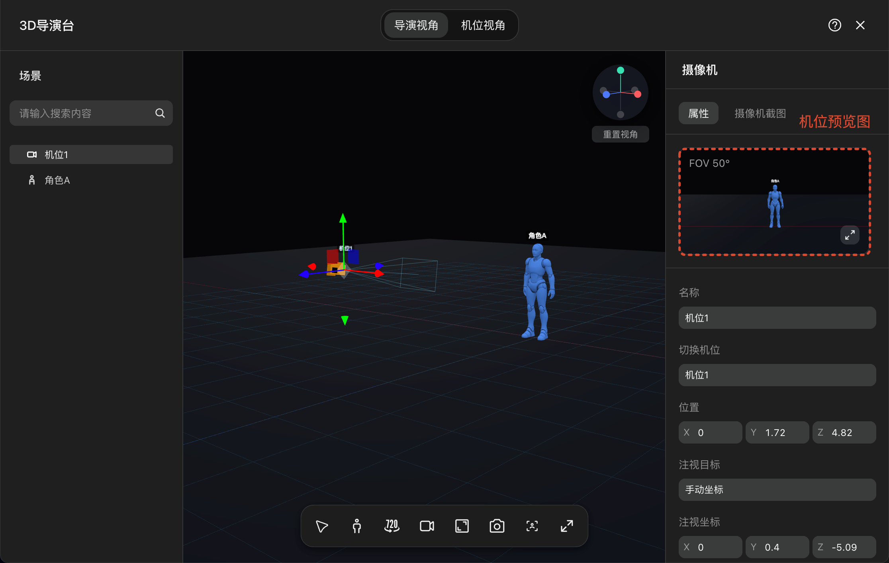

「机位视角」下，可以在右侧栏「摄像机属性-FOV」中，调整摄像机焦距

在「摄像机属性-注视目标」中，将焦点绑定在某个角色身上，可以让镜头实现自动跟随
</td>
</tr>
<tr class="even">
<td><strong>Step 5：</strong>发送到画布，作为参考图生成</td>
<td><strong>[PixPin_2026-05-23_00-15-05.mp4]</strong></td>
<td></td>
</tr>
</tbody>
</table>

2.4.3 **进阶用法**

<table>
<colgroup>
<col style="width: 27%" />
<col style="width: 61%" />
<col style="width: 11%" />
</colgroup>
<tbody>
<tr class="odd">
<td>
<strong>进阶功能① 角色模型姿势控制</strong>

选中一个角色模型后，可以在右侧栏「姿势」中，调整人物姿势
</td>
<td><strong>[PixPin_2026-05-23_00-41-17.mp4]</strong></td>
<td></td>
</tr>
<tr class="even">
<td>
<strong>进阶功能② 全景图设置</strong>

上传方式：

本地上传

生成历史选择

普通场景图一键转全景图
</td>
<td><strong>[PixPin_2026-05-23_00-49-11.mp4]</strong></td>
<td></td>
</tr>
</tbody>
</table>

2.4.4 **使用示例**

<table>
<colgroup>
<col style="width: 17%" />
<col style="width: 45%" />
<col style="width: 37%" />
</colgroup>
<tbody>
<tr class="odd">
<td>
<strong>使用演示①：</strong>

复杂站位、视角控制
</td>
<td>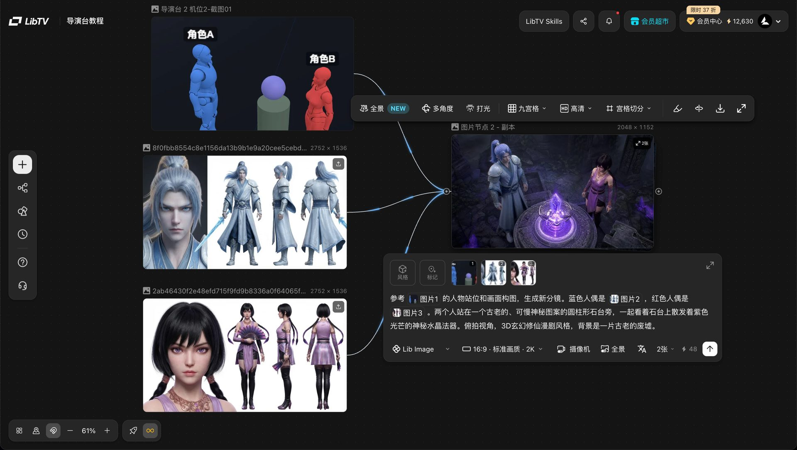</td>
<td>
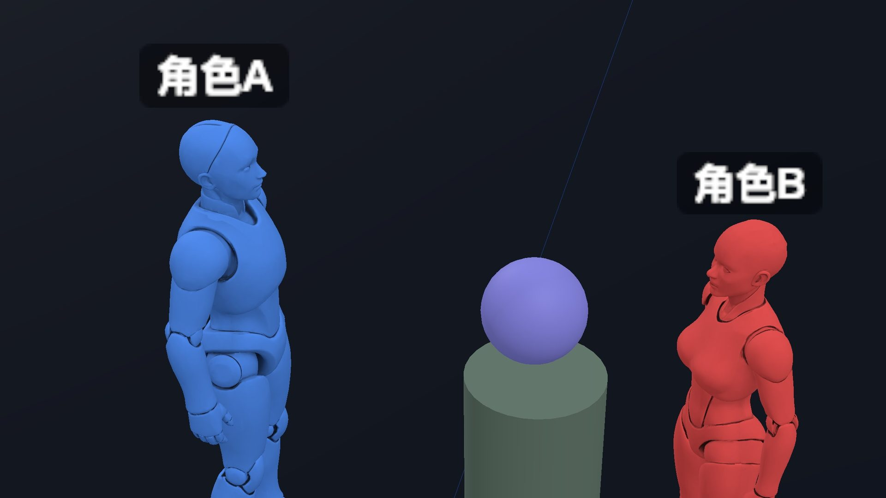

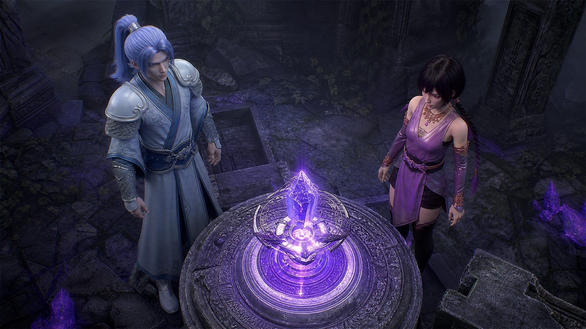
</td>
</tr>
<tr class="even">
<td>
<strong>使用演示②：</strong>

准确场景&amp;角色站位控制
</td>
<td>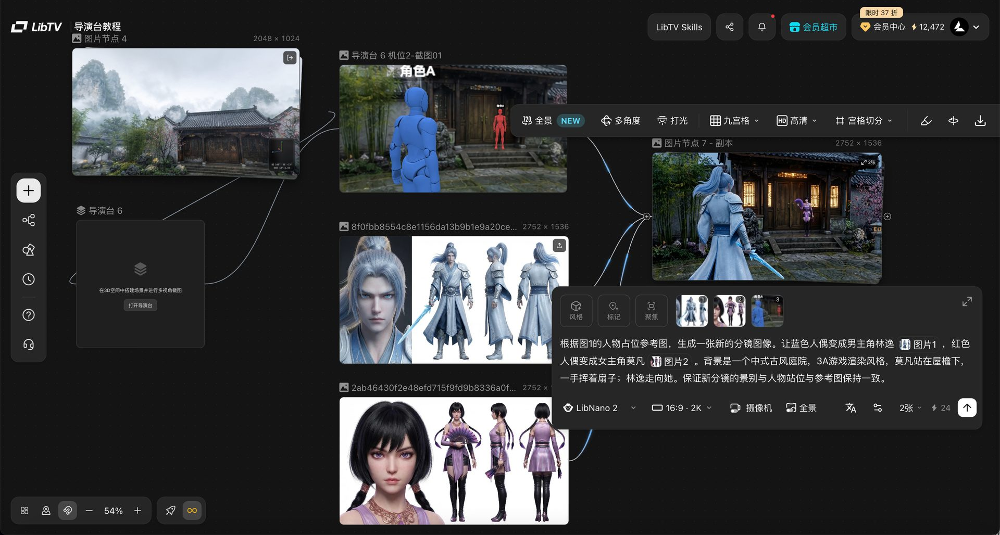</td>
<td>
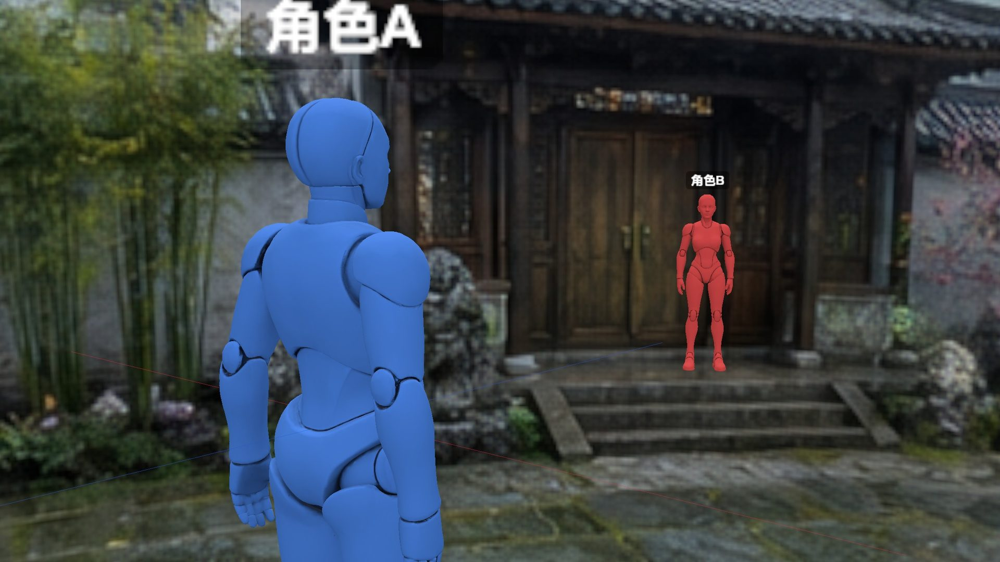

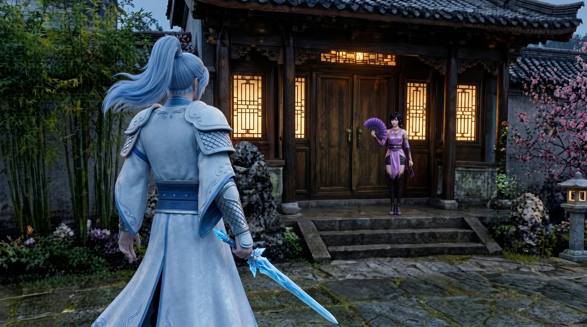
</td>
</tr>
<tr class="odd">
<td>
<strong>使用演示③：</strong>

复杂站位、视角控制
</td>
<td>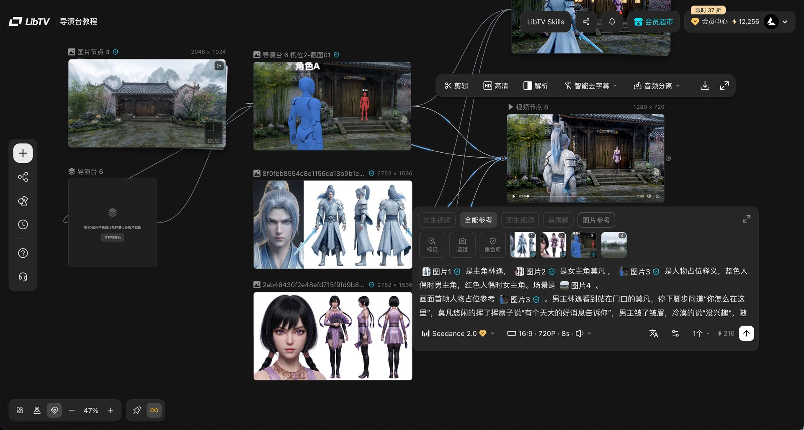</td>
<td><strong>[视频节点 8.mp4]</strong></td>
</tr>
</tbody>
</table>

2.4.5 **运动运镜轨迹**

2.4.5.1 **「角色运动轨迹」**

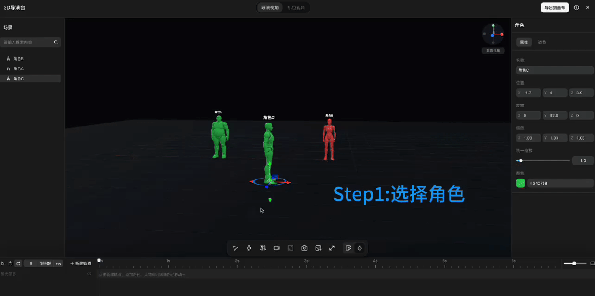

**「创建运动」---操作演示（适合想让角色在 3D 场景中按指定路线移动）**

操作路径：

用户在左侧对象树选中角色

右侧出现「创建运动」入口

点击后，系统自动生成一条默认运动路径

用户可以选择直线、圆形、矩形等路径模板

用户点击路径上的某一点，可以调整左右位置 X、前后位置 Y、高度 Z

调整后，时间轴自动记录对应关键帧。

点击播放后，角色沿路径运动

**适合场景**：

角色从门口走到房间中间。

角色绕商品或道具走一圈。

角色走上台阶、走下坡、穿过场景。

短剧人物走位、漫剧角色调度、电商广告人物展示

2.4.5.2 **「摄像机运镜轨迹」**

是否有快捷键（Keyboard Shortcut）：暂无

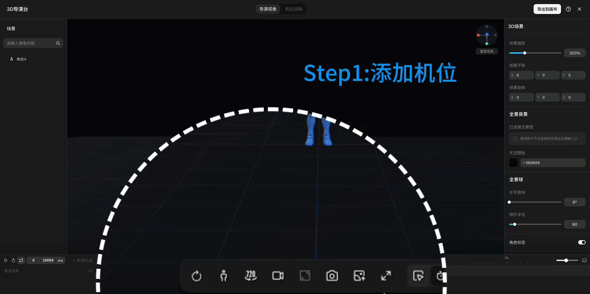

「创建运镜」---操作演示（适合想让摄像机做推、拉、摇、移、环绕、升降等镜头运动）

操作路径：

用户在左侧对象树选中摄像机。

右侧出现「创建运镜」入口。

点击后，系统展示运镜模板。

用户选择推近、拉远、横移、环绕、升镜、俯冲等模板。

系统自动生成摄像机运镜路径、摄像机高度、注视目标和关键帧。

用户可以选择注视角色、注视物体，或手动指定目标点。

点击播放后，可以在导演视角看完整路径，也可以切到机位视角看实际拍摄画面。

适合场景：

镜头慢慢推近角色，突出人物登场

镜头拉远展示完整场景

镜头横移展示空间层次

镜头环绕商品或角色，做广告展示

镜头从低机位升到高机位，做空间展示

2.4.5.3 **「镜头+路径」组合**

**一键跟随拍摄**

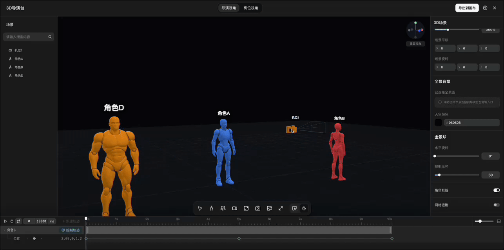

|                                                                                         |
|-----------------------------------------------------------------------------------------|
| 「一键跟随拍摄」---操作演示（适合想让镜头自动跟随角色移动，但不想手动设置复杂绑定关系） |

操作路径：

用户选中角色。

右侧点击「跟随对象和跟随视角」

用户只需要调整跟随距离、摄像机高度、拍摄角度、镜头范围。

点击播放后，角色沿自己的路径运动，摄像机会保持距离和高度跟随拍摄。

这里需要特别注意：

角色运动轨迹和摄像机运镜轨迹不是同一条线。

角色路径可以贴地，摄像机不能直接吃角色的贴地路径。

一键跟随的本质是“打成镜头组”，由系统自动维护摄像机和角色之间的距离、高度和注视关系。

适合场景：

第三人称跟拍角色走路。

短剧角色在房间里移动，镜头跟随拍摄。

虚拟人介绍商品，镜头始终跟住人物。

角色边走边讲解场景或道具。

2.4.6 **导演台快捷键**

<table style="width:100%;">
<colgroup>
<col style="width: 15%" />
<col style="width: 26%" />
<col style="width: 23%" />
<col style="width: 34%" />
</colgroup>
<tbody>
<tr class="odd">
<td><strong>操作快捷键</strong></td>
<td>
<strong>模式切换</strong>

移动 V

旋转 R

缩放 S

网格吸附 X
</td>
<td>
<strong>视角切换</strong>

俯视视角T

正面视角Y

重置视角 Q
</td>
<td>
<strong>基础操作</strong>

打组 ctrl+g

解组 ctrl+shfit+g

撤销 ctrl+z

删除 delete
</td>
</tr>
</tbody>
</table>

2.4.7 **Blender 插件**

🔥 功能介绍：LibTV 上线 Blender 插件，可以直接录制界面上的3D白模视频或截取画面，一键发送到 LibTV。无需反复下载上传，帮助大家更高效地利用白模实现视频精准渲染。

👉 插件下载：https://kol.liblib.tv/blender

👉 安装教程：[LibTV Blender 插件安装教程](https://resonate.feishu.cn/wiki/GwRpwYzGSiESYtkLPBEcvQ4knHd)

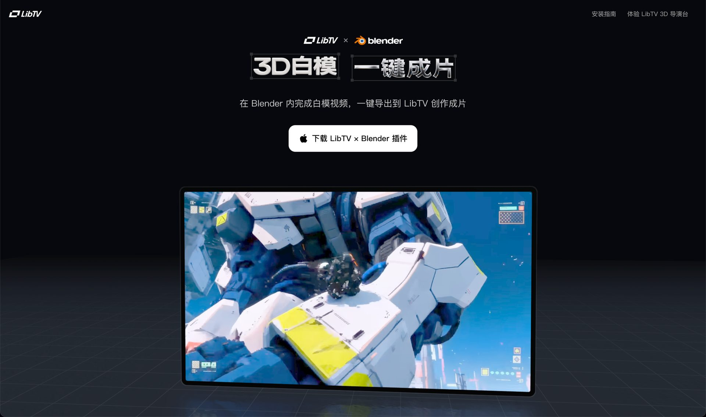

2.5 **音频工具**

2.5.1 **音频截取**

**功能简述**：支持音频片段精准裁剪，保留最精彩的声音

**入口：**在画布上选中一个音频片段，选择顶部工具栏中的「截取」

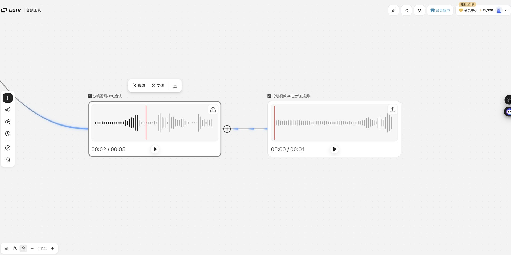

2.5.2 **音频变速**

**功能简述**：支持声音快慢调节，完美匹配视频节奏

**入口：**在画布上选中一个音频片段，选择顶部工具栏中的「变速」

2.5.3 **自定义切分**

试听音频后，输入需要删除的片段或切分时间点，即可一键生成多个音频片段

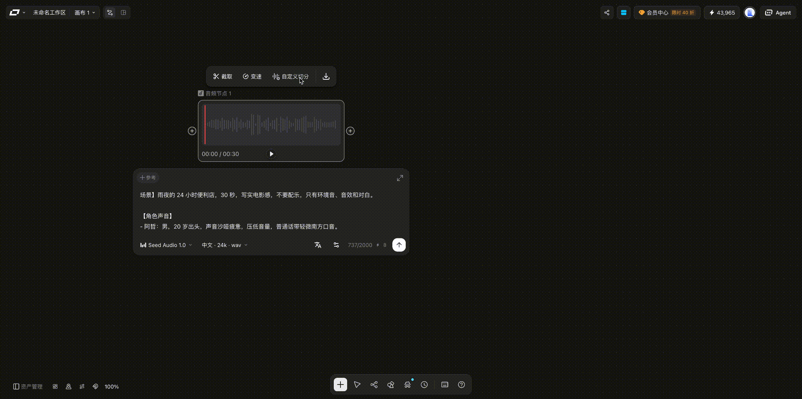

3\. **图像生成器**

3.1 **风格**

**功能简述：**风格功能提供了丰富的风格模板库，涵盖多种视觉表现类型，选择任意风格后，生成的作品将自动应用该风格模板。

**适用模型：Lib Navo pro、Lib Navo2、Seeddream5.0 lite、Seeddream4.5、Z-image Turbo 、Seeddream4.0**

**使用方法：**

新建图片节点，在<u>底部生成器</u>中点击**「风格」图标，**进入风格库

风格库支持分类浏览与关键词搜索,包括**摄影写真**、**电商营销**、**动漫游戏**、**风格插画**等分类

> 
>
> 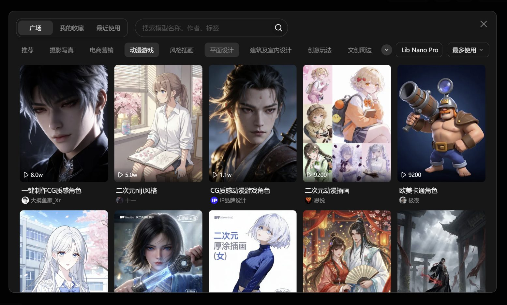

点击选择想要的风格，同时风格标签会被加载到生成器中，按需要完善画面提示词，最后点击生成图像即可。

> 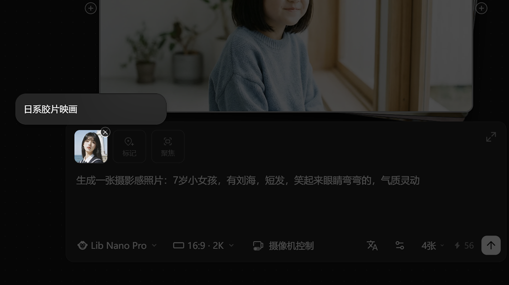

**2.自定义风格模板**

功能简述：支持通过添加5-20张同风格的图片，快速学会风格特征，发布为模板后可以快捷调用

适用模型**：Lib Navo pro（全能模型pro）、Lib Navo2（全能模型2）、Seeddream5.0 lite、Seeddream4.5**

定制方式：

前往 LiblibAI 自定义风格模板： https://www.liblib.art/ai-tool/upload-template

> 

发布通过审核后即可在风格库用搜索调用，使用时按需要完善画面提示词，最后点击生成图像即可。

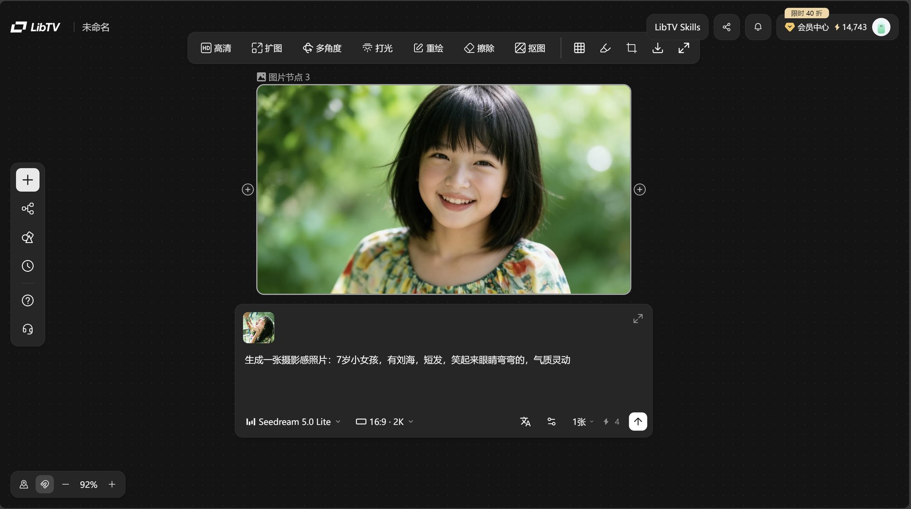

3.2 **焦点编辑**

**功能简述：**「焦点编辑」支持从当前画布中的**任意一张或多张图像**中，提取元素进行组合使用

**使用方法：**

新建图片节点，在<u>底部生成器</u>中点击**「焦点编辑」图标，**画布进入沉浸模式（按esc可退出）

此时在画布的其他图片上点击需要提取的元素，系统自动进行识别。识别完成后元素会被白框框定，同时元素名称标签会被加载到生成器中

元素选择完毕后，按需要完善画面提示词，最后点击生成图像即可。

> 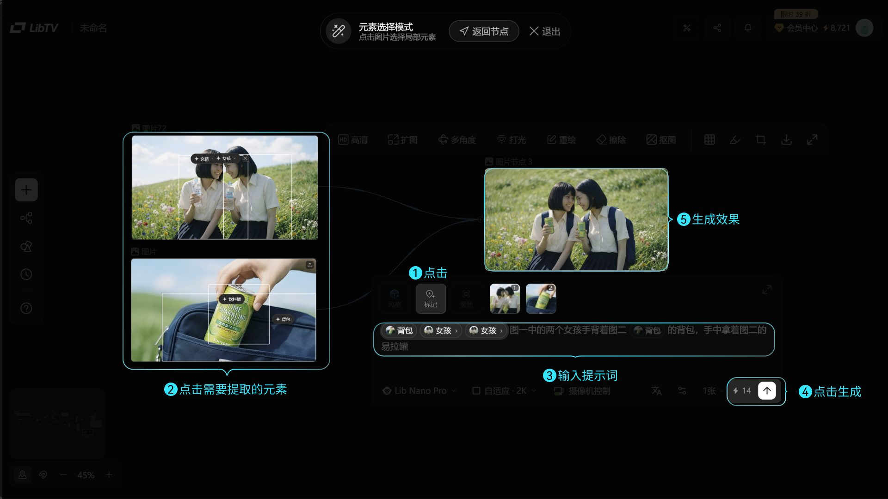

3.3 **镜头聚焦**

**功能简述：**支持通过在单张图像上进行框选，快速生成该画面的细节特写分镜。自带**特写意图推理功能**，框选确认后可直接生成，同时支持提示词优化。

**使用方法：**

新建图片节点，在<u>底部生成器</u>中点击**「镜头聚焦」图标，**画布进入沉浸模式（按esc可退出）

在画布上选择一张图片，框选需要聚焦的画面细节，点击确认

确认后，可直接点击生成细节特写，或者输入简单提示词优化特写效果，比如人物的表情、动作、元素细节或者拍摄角度

|                                                                                                                                                                        |                                                                                                                                                                        |
|------------------------------------------------------------------------------------------------------------------------------------------------------------------------|------------------------------------------------------------------------------------------------------------------------------------------------------------------------|
| 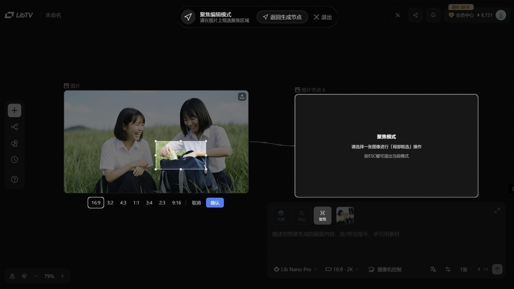 | 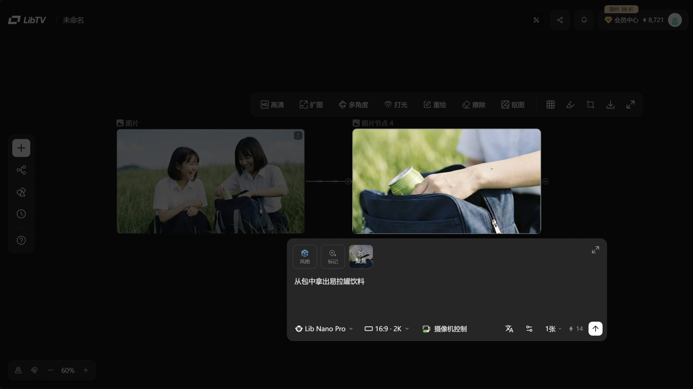 |

3.4 **摄像机控制**

**功能简述：**生成写实风格图像时，启用此功能，可以支持设置相机型号、镜头、焦距和光圈，让“摄影效果”更符合自己的需要

**\[摄像机功能.mp4\]**

**使用方法：**

进入图片节点生成器，输入生图提示词，然后开启底部的「摄像机控制」按钮（开启后会变成绿色）

点击按钮，调出控制面板，在其中设置自己需要的相机、镜头、焦距和光圈，最后点击「使用」

最后点击「生成」按钮生成图像

**参数效果showcase**

**生图模型：**全能图片模型V2 Flash

**生图提示词：**专业人像摄影，一个美丽的中国女孩，她穿着黑色无袖上衣，长发披肩，头顶戴黑色墨镜，面带微笑。背景是沿海大道，天气晴朗。

<table>
<colgroup>
<col style="width: 12%" />
<col style="width: 28%" />
<col style="width: 29%" />
<col style="width: 29%" />
</colgroup>
<tbody>
<tr class="odd">
<td>摄像机参数</td>
<td>焦距 125mm 光圈 f/11</td>
<td>焦距 125mm 光圈 f/4</td>
<td>焦距 35mm 光圈 f/4</td>
</tr>
<tr class="even">
<td>
相机：

Sony Venic

镜头：

Helios
</td>
<td>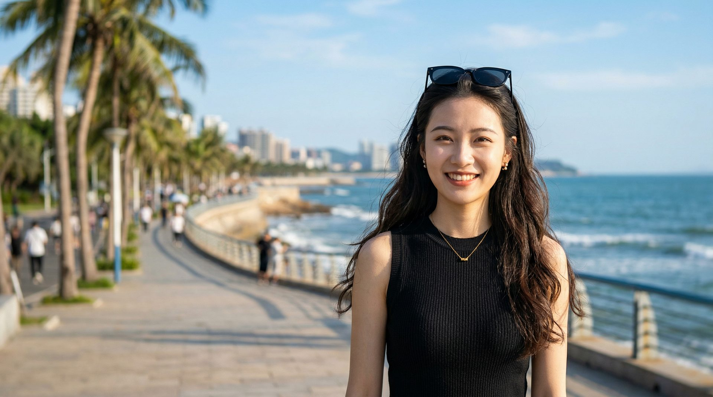</td>
<td>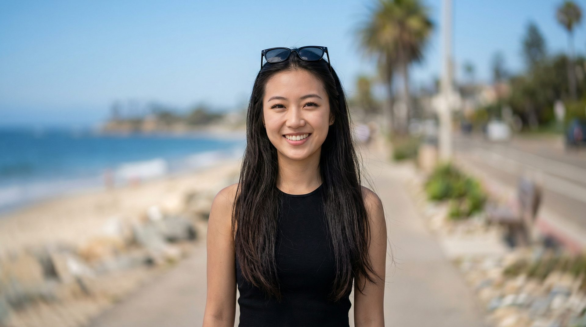</td>
<td>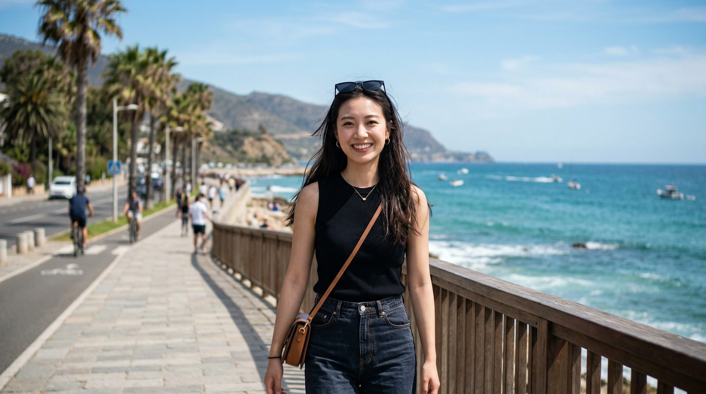</td>
</tr>
</tbody>
</table>

4\. **视频生成器**

4.1 **视频主体库**

适用模型：**KlingO1和KlingO3模型**

**功能简述：**允许用户通过「多张图片」或「单段视频」创建一个可复用的主体身份，用于后续在支持的生成模型中调用，实现角色/商品/宠物/人物的跨次生成一致性。

**1.图片创建模式**

图片创建模式**支持角色/商品/宠物/人物的主体**创建

<table>
<colgroup>
<col style="width: 42%" />
<col style="width: 57%" />
</colgroup>
<tbody>
<tr class="odd">
<td>
右键图片/视频节点选择<strong>「创建主体」</strong>

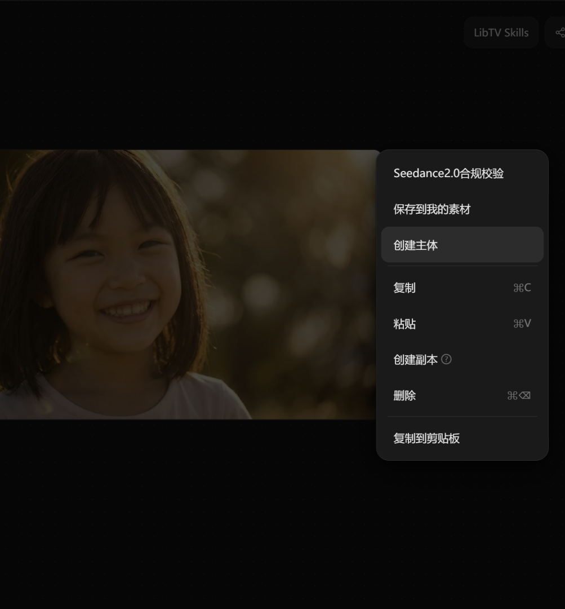
</td>
<td>
支持<strong>[智能补全]</strong>添加2-3张主体的其他视角图

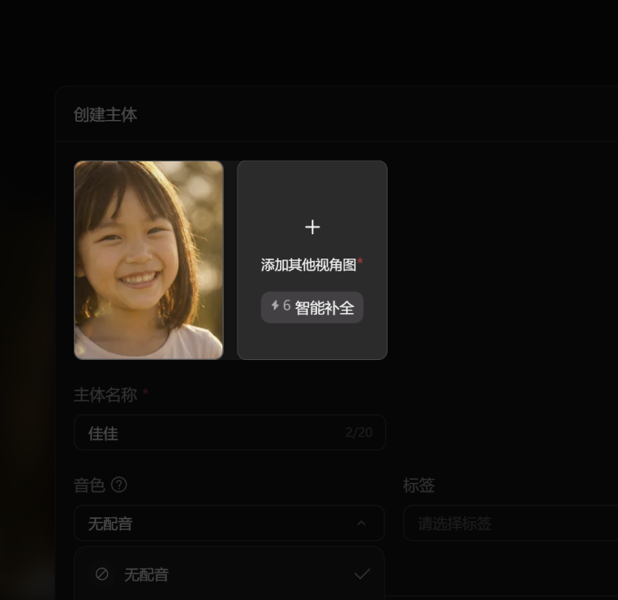
</td>
</tr>
</tbody>
</table>

填写**主体名称，**为主体**添加音色**，支持本地上传/历史生成5-30s的音频及视频并自动生成音色，**点击创建**

支持**一键智能生成**主体描述，字段不会只作为备注，而是参与生成，系统会把描述转为模型提示词增强，自动拼接到模型 prompt 中

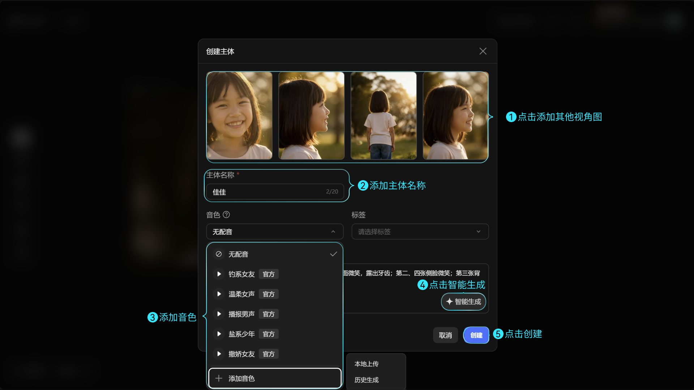

**2.视频创建模式**

视频创建模式**仅支持角色/人物**的主体创建

<table>
<colgroup>
<col style="width: 42%" />
<col style="width: 57%" />
</colgroup>
<tbody>
<tr class="odd">
<td>
右键图片节点，选择<strong>「创建主体」</strong>

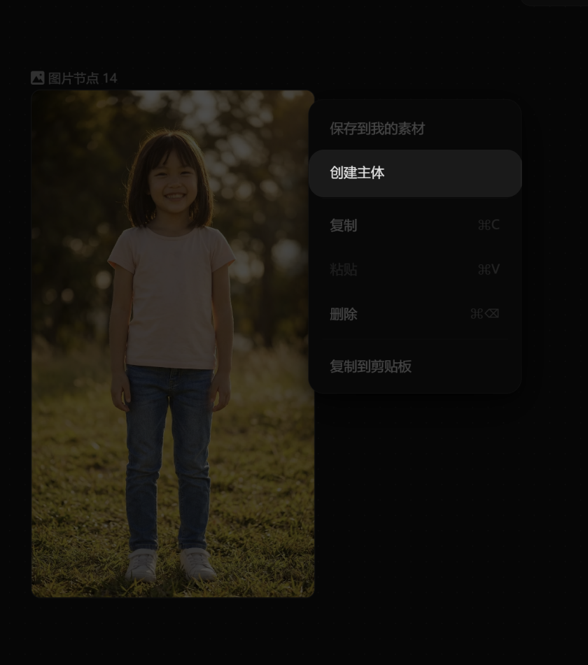
</td>
<td>
添加2-3张主体的<strong>其他视角图</strong>或添加3-60s<strong>单一连续镜头的视频</strong>

<blockquote>

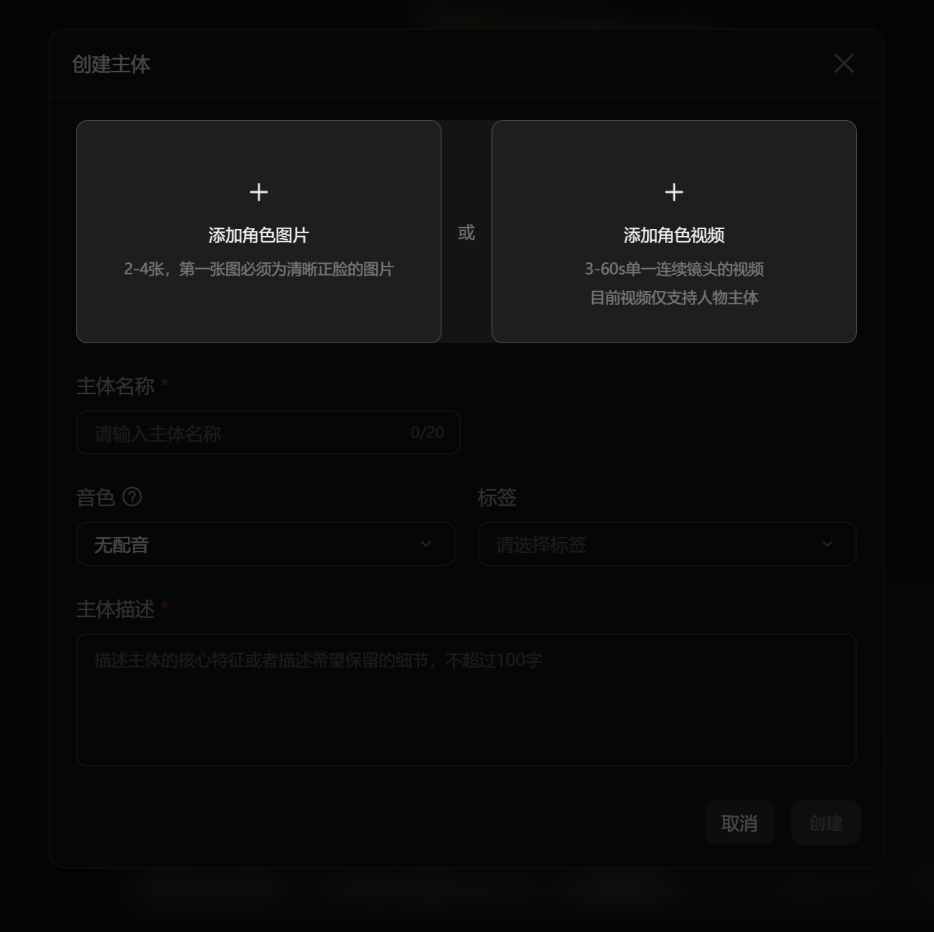

</blockquote></td>
</tr>
</tbody>
</table>

填写**主体名称**，为主体**添加音色**，支持本地上传/历史生成5-30s的音频及视频并自动生成音色，**点击创建**

支持**一键智能生成**主体描述，字段不会只作为备注，**而是参与生成**，系统会把描述转为模型提示词增强，自动拼接到模型 prompt 中

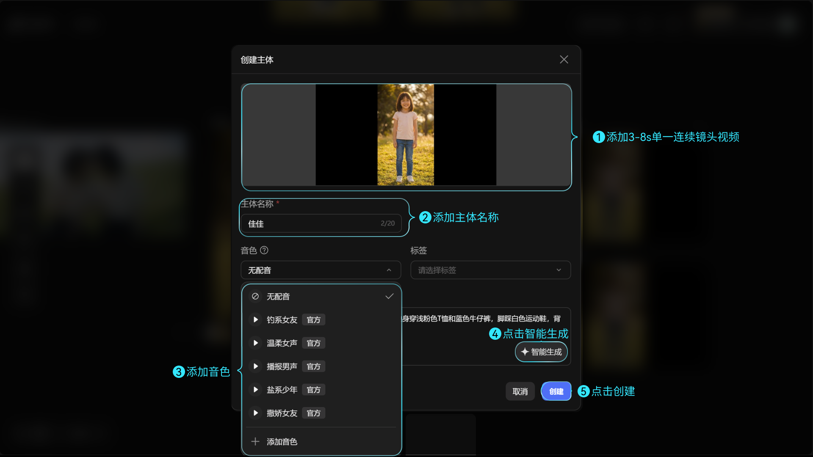

创建好的主体可以在**视频节点**中的**「主体」**中调用，输入提示词点击生成即可

**\[主体应用例子.mp4\]**

**功能：**提供 **20+** 运镜方式预设，高效、便捷、专业的运镜控制方式。

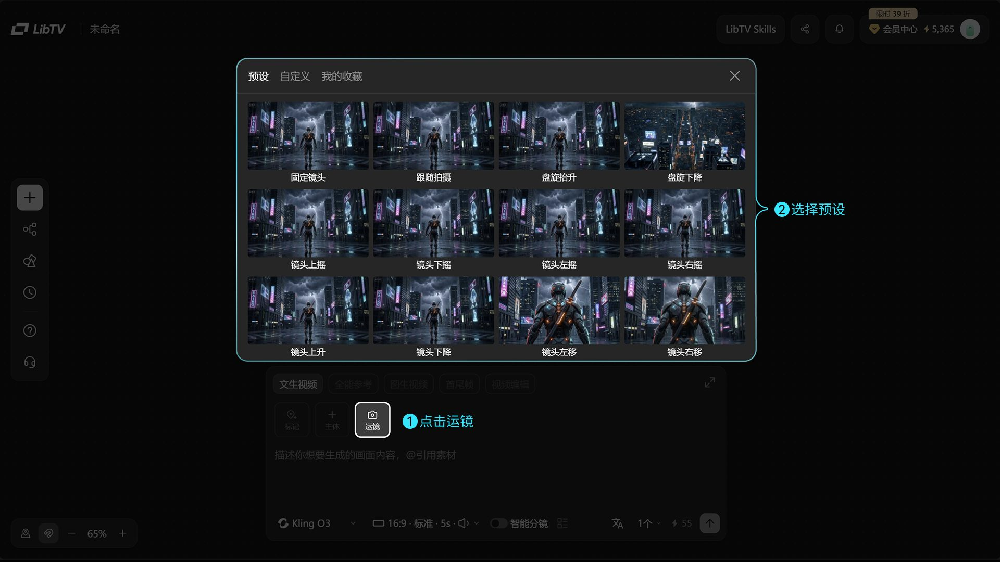

**1.预设收藏**

对于官方预设和用户自定义预设，支持收藏，方便用户快捷选用

鼠标悬停在预设上，点击「★」即可收藏当前预设，再次点击可取消，收藏的预设会保存在【我的收藏】

**2.自定义运镜**

可以输入运镜提示词自定义运镜

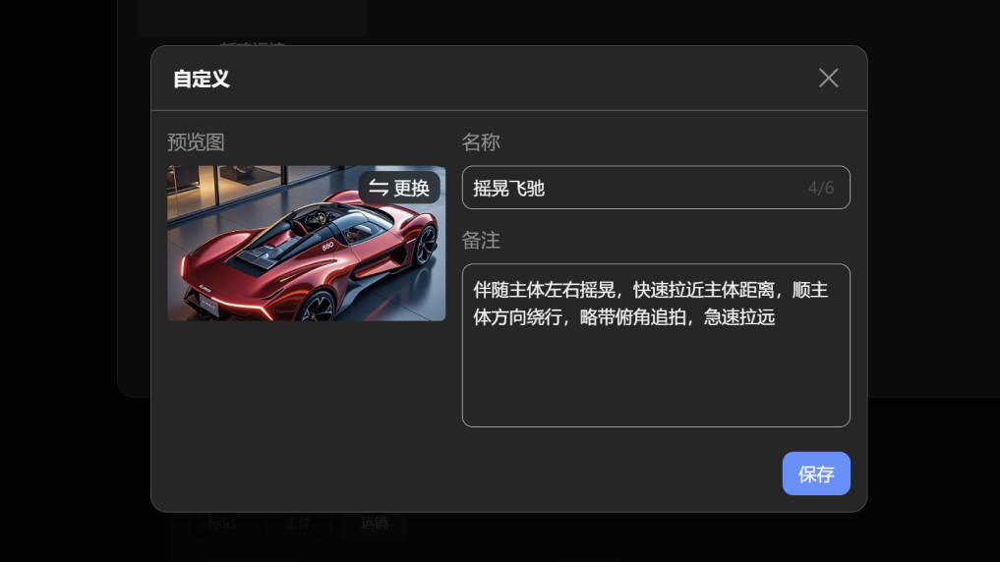

**运镜控制使用小技巧：**

**Kling 3.0** 对「镜头左右移」提示的相应响应不准，对左右上下摇动偶尔不准确（已反馈给可灵官方，等待反馈）。**这种情况可以通过切换其他模型或者方式处理**

不同的视角有不同的应用场景**，如果分镜应用不当，会导致失效的情况。**

|                                                                |
|----------------------------------------------------------------|
| 比如「高空航拍」运镜会和画面中的「近距离、特写」等描述发生冲突 |

另外为了适应不同的模型和场景**，预设提示词会显得比较简单和宽泛**，因此：

不同模型对相同预设的响应情况不同，属于正常现象

当画面主体较多、画面内容复杂、或者**主体本身有大幅度动作时，运镜效果很容易受到干扰**（可灵3.0的表现尤为明显）

**解决方案：**

在运镜预设之外，额外添加镜头与主体、环境的关系描述

若提示中涉及多种物体动作或运镜，**建议用「首先、然后、最后」等词语**来有秩序地描述物体动作和运镜的关系，模型处理效果会更好

5\. **LibTV模型清单**

5.1 **图像模型**

<table>
<colgroup>
<col style="width: 18%" />
<col style="width: 81%" />
</colgroup>
<tbody>
<tr class="odd">
<td>模型名称</td>
<td>功能简述</td>
</tr>
<tr class="even">
<td>Style Image 
V8.1 / 8.2</td>
<td>
<strong>全球顶尖美学风格模型最新版本</strong>

✅ 光影层次富有张力，画面氛围与质感全面升级

✅ 风格参考匹配度更准，同一指令稳定产出系列化内容

✅ 创作稳定性大幅增强，无效低质出片概率大幅降低
</td>
</tr>
<tr class="odd">
<td>Seedream 5 Pro</td>
<td>
<strong>交互式精准编辑​：</strong>支持通过框选、点选、画线、箭头标注等方式精准定位修改。

<strong>真实影像与人像质感</strong>​：在雨夜人像、逆光场景等复杂光影下，Pro 版本的皮肤纹理、湿发、眼神和霓虹反光更加自然，电影感极强，大幅减少了“AI 塑料感”和假面感。

<strong>信息可视化与排版​：</strong>能更好地处理商业海报、知识卡片和简单图表。对提示词的理解更精准，文字渲染和布局清晰度有显著提升，多语种输入与生成的能力也很强。

<strong>多图融合与图层编辑​：</strong>支持上传多张参考图（如人物照+产品图+场景图），AI 能自动重新设计光影和构图，实现自然融合。同时支持分图层编辑，方便后续反复调整。
</td>
</tr>
<tr class="even">
<td>Lib Image 🔥</td>
<td>
<strong>最新最强的图像生成/编辑模型，整体能力远超 LibNavo Pro</strong>

✅ 跨时代的图像模型能力，真实感、物理逻辑、提示词理解、一致性保持能力全面跃升

✅ 顶级中文字符渲染能力，超长文本、超小字体稳定渲染

✅ 版式设计 TOP 1，专业级海报、表格、PPT、 详情页轻松出

✅ 支持4张参考图，超强一致性
</td>
</tr>
<tr class="odd">
<td>LibNavo 2🍌</td>
<td>
全球顶尖的图像生成、编辑模型

与 LibNavo Pro 相比

生成速度更快

支持 1:4 / 4:1 / 1:8 / 8:1 等极端画幅比

文本（中文）渲染更准确稳定

对物理空间信息理解更准确
</td>
</tr>
<tr class="even">
<td>LibNavo Pro 🍌</td>
<td>
全球顶尖的图像生成、编辑模型

支持自然语言指令，可精准完成图像增/改/删、主体/风格/场景/多角度一致性保持、细节修复、多图融合等复杂编辑任务

支持 2K/4K 高清图像直出，支持单个指令生成多张组图；支持复杂逻辑理解

画面质感自然逼真，极少出现人体细节扭曲崩坏
</td>
</tr>
<tr class="odd">
<td>Seedream 5.0 Lite</td>
<td>
与 Seedream 4.5 相比

角色一致性更稳定

在电商、设计领域生成效果有显著优化

在空间布局推理、物理规律模拟、逻辑推演、领域知识上表现更优秀

信息可视化增强：PPT风格幻灯片、图表、菜单、数据可视化表现更好
</td>
</tr>
<tr class="even">
<td>Seedream 4.5</td>
<td rowspan="2">
国产模型，对<strong>中国本土</strong>文化、审美、人文内容相应准确

支持自然语言指令，可精准完成图像增/改/删、<strong>中文文字编辑</strong>、主体/风格一致性保持、细节修复、多图融合等复杂编辑任务

支持<strong>中/英文文本渲染&amp;编辑</strong>，可直出海报/封面等带文字版式的图像，可响应多种艺术风格

支持 2K/4K 高清图像直出，支持单个指令生成多张组图；支持复杂逻辑理解

<strong>注意</strong>：Seedream 4.0 有单图/组图2种模式，在出系列套图（多个表情包/Logo延展/多尺寸套图）时推荐使用组图模型，<strong>其他时候推荐使用单图模式</strong>。
</td>
</tr>
<tr class="odd">
<td>Seedream 4.0</td>
</tr>
<tr class="even">
<td>Style Image V7</td>
<td>
全球顶尖综合美学风格模型，海量优质艺术风格随意探索

支持 --serf 风格代码
</td>
</tr>
<tr class="odd">
<td>Style Image V7</td>
<td>动漫/日系/东亚插画美学模型</td>
</tr>
<tr class="even">
<td>Z Image Turbo</td>
<td>
摄影级真实感： 擅长处理逼真的光影纹理细节，人像皮肤、光影、材质细节非常优秀，亚洲人审美特别友好

对复杂中文、文化元素、成语、诗意描述理解极强；中英文混排、复杂排版、海报文字准确率极高

智能图像编辑：能理解并精确执行复杂的语言指令，能在指定位置修改文本，并在图像大范围变换时保持字符一致性
</td>
</tr>
<tr class="odd">
<td>LibNavo</td>
<td>
支持自然语言指令，可精准完成图像增/改/删、中文文字编辑、主体/风格一致性保持、细节修复、多图融合等复杂编辑任务

支持英文文本渲染&amp;编辑，可直出海报/封面等带文字版式的图像，可响应多种艺术风格
</td>
</tr>
<tr class="even">
<td>Qwen lmage</td>
<td>
能精准渲染<strong>超长中/英文文本</strong>，支持文本版式设计，可直出海报/封面等

<strong>Lib 独家风格库</strong>，优质<u>文本渲染效果</u>稳定复现（适用范围运营海报/字体/Logo设计等）
</td>
</tr>
<tr class="odd">
<td>Qwen lmage Edit</td>
<td>
支持自然语言指令，可精准完成图像增/改/删、主体一致性保持、细节修复等任务

<strong>Lib 独家风格库</strong>
</td>
</tr>
<tr class="even">
<td>更多模型即将上线……</td>
<td></td>
</tr>
</tbody>
</table>

5.2 **视频模型**

**Seedance 2.5 超长5min视频直出**

**功能亮点**

一键直出 **<u>5 分钟</u>** 成片，成片完成度极高，并支持 **<u>查看过程片段</u>** ，画布剪辑等精细化调优

**使用入口**

新建节点生成器，选择「5分钟超长视频」

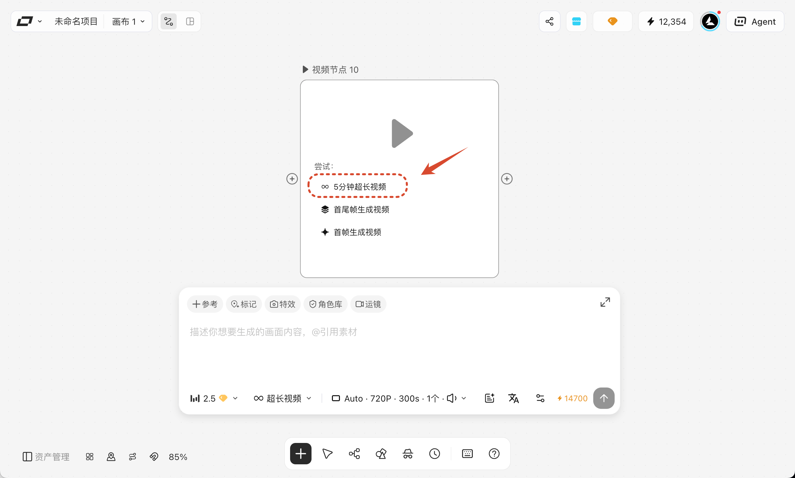

**3. Showcase**

<table>
<colgroup>
<col style="width: 44%" />
<col style="width: 55%" />
</colgroup>
<tbody>
<tr class="odd">
<td><strong>输入提示词/参考</strong></td>
<td><strong>输出结果</strong></td>
</tr>
<tr class="even">
<td>
<strong>《真假美猴王》</strong>

生成一个五分钟的真假美猴王的动画，风格要1960s的上美影，二维动画的风格
</td>
<td>
<em><strong>一键直出生成，模型自动推理最佳时长，会略有时间误差，计费以结果时长为准</strong></em>

<strong>[真假美猴王 加logo.mp4]</strong>
</td>
</tr>
<tr class="odd">
<td>
<strong>《无限梦境 MV》</strong>

<table>
<colgroup>
<col style="width: 100%" />
</colgroup>
<tbody>
<tr class="odd">
<td>Plain Text 
<strong>视觉风格</strong>：高饱和度电影感画面，粉色主色调，光线戏剧性强烈，70-200mm长焦压缩景深；以女主头部/上半身/全身为中心轴进行等速或变频旋转（Pivot Point），女主头部始终锁定画面黄金中心（Visual Anchor），前后镜头旋转速度与方向完全延续（Momentum Continuity）；Michael Bay英雄镜头低角度仰拍，一镜到底轨道跟拍，运动感强烈。 
<strong>声音</strong>：全程 No BGM，无背景音乐，无台词，仅环境音效与拟音（各场景专属音效见段落内标注）。 
<strong>一致性</strong>：全程保持人物身份、数量、服装、道具归属与空间方向稳定；黑白/像素/2D扁平等特殊画风仅限对应场景。 
素材锚点总览 
{{MV片场走廊}}：走廊布局、黑白格地板、粉色储物柜、摄影灯、群演密度。 
{{粉色少女 原形态}}：五官发型；场1造型=粉帽夹克粉裤毛绒星靴；场8起复用为校服少女=白衬衫深色西装校服素颜，末段换居家睡衣。 
{{黑白会议室}}：长桌、礼帽男士群像、百叶窗斜光、黑白氛围。 
{{粉色少女 黑白电影版}}：黑白西装少女五官发型、黑西装领带。 
{{地下城}}：石砖墙、烛台吊灯、昏黄暖光、走廊纵深。 
{{粉色少女·地下城版版}}：像素盔甲造型、粉色方块盔甲、钻石剑。 
{{大西部小镇}}：尘土街道、木质建筑、仙人掌、沙尘暴、烈阳。 
{{粉色少女 牛仔版}}：粉色流苏夹克、牛仔帽、太刀、手枪、牛仔靴。 
{{二次元怪物}}：像素蜘蛛怪（圆身大眼蜘蛛腿）+地铁荧光灯瓷砖站台；片场场景中改为完全扁平2D卡通线稿风格。 
{{粉色少女 像素游戏版}}：像素造型、粉色帽子、印花裤、星星靴。 
{{粉色少女·终极融合版}}：粉牛仔帽+玫瑰、印花上衣、货裤、像素靴、钻石剑。 
{{护人男生锚点图}}：校服男生五官发型、深色校服西装；后段异变为马里奥风格巨型Boss。 
完整故事线 
MV片场走廊 {{MV片场走廊}} 内，剧组紧张备拍：全景俯拍黑白格地板上群演列队，摄影师调机位，灯光师举反光板，场记板举起；切中景，灯光师梯上调灯，粉色储物柜反光；三组快切特写——摄影机镜面倒影、群演热身脚步、导演翻分镜本；跟拍助理奔跑送道具穿越走廊；全员就位灯光全亮，导演举手，全场屏息，灯具在顶端连成光晕，定格在开拍前的紧张静默。<strong>声音</strong>：走廊嘈杂声、对讲机滋滋声、灯架滚轮声、灯光电流嗡鸣、脚步声、场记板啪嗒声、静默后灯具低频嗡鸣。 
强光渐退，粉色帽子少女 {{粉色少女 原形态}} 立于黑白格地板中央，群演两侧欢呼。导演示意开拍，她眼神一亮，边走边跳与群演互动，镜头以她头部为轴向右连续旋转（第1圈→第2圈加速至第3圈，低角度英雄镜头），群演掠过形成虚化遮挡直至完全遮蔽画面。穿越遮挡瞬间画面去饱和转黑白，旋转动量延续，黑白会议室 {{黑白会议室}} 轮廓从背后浮现。<strong>声音</strong>：片场欢呼声、灯具嗡鸣爆闪声、群演奔跑声、走廊回响、遮挡转场的一瞬沉寂。 
黑白西装少女 {{粉色少女 黑白电影版}} 立于黑白1950年代会议室 {{黑白会议室}} 桌头，指着文件与在座男士激烈争吵——默剧无声，嘴唇开合，动作夸张有力。对面男士起身拍桌，众人纷纷站立、椅子刮地（镜头绕头部第1圈）。她整理领带，眼神轻蔑，全场哗然拍桌，文件纸张飞散（第2圈，低角度英雄镜头）。她猛转身，男士后退，她扬起文件，白纸如雨填满画面（第3圈）。纸张像素化，方块转为暖黄橙色，地下城 {{地下城}} 场景显现。<strong>声音</strong>：黑白年代感环境音、拍桌声、椅子刮地声、纸张飞散声、文件砸地声、无声争论的紧张气氛。 
粉色像素少女 {{粉色少女·地下城版}} 在地下城 {{地下城}} 打怪：连击僵尸骷髅，反手击碎（镜头绕头部第1圈，贴地低角度，烛台光晕爆闪）。走廊尽头震动，巨型BOSS现身，体型三倍、红眼发光（第2圈仰拍，少女握剑从惊讶转兴奋）。她纵身跃起，钻石剑插入BOSS背部，BOSS像素化崩解（第3圈环绕爆炸）。绿色碎块四散转黄褐色，溶解为沙粒，沙尘暴席卷，大西部小镇 {{大西部小镇}} 轮廓隐现。<strong>声音</strong>：像素怪物嘶吼、钻石剑击音效、方块碎裂声、烛火噼啪声、经验球音效、BOSS踏地低频声、像素爆炸音效。 
粉色女牛仔 {{粉色少女 牛仔版}} 在沙尘暴中，于西部小镇 {{大西部小镇}} 主街与黑披风反派决斗：太刀匕首碰撞火花四溅（无人机低角度环绕第1圈，阳光在头顶成光晕，帽子被吹飞）。她被逼至木墙前（第2圈环绕），探手掏枪开火，粉色烟雾吞没反派，反派倒下（第3圈仰拍胜利姿态，沙尘暴达顶峰）。沙尘吞没画面并像素化，地铁荧光光渗出，二次元怪物 {{二次元怪物}} 的地铁站逐渐显现。<strong>声音</strong>：呼啸风沙声、马蹄声、清脆枪响、太刀碰撞声、火花声、卡通烟花爆裂声、反派倒地声、像素过场呼啸声。 
像素游戏版少女 {{粉色少女 像素游戏版}} 在像素地铁站与蜘蛛怪物 {{二次元怪物}} 缠斗：粉色火花四溅，怪物吐毒液，少女闪避（镜头绕头部第1圈，贴地低角度，荧光灯爆闪）。怪物发光进化——体型翻倍、双眼变红、蜘蛛腿增至八条（第2圈仰拍进化，少女从惊讶转兴奋，拔剑发出粉色光）。她纵跳一剑劈开怪物，大规模像素崩解（第3圈环绕爆炸）。碎片重新拼合，MV片场走廊黑白格地板与储物柜 {{MV片场走廊}} 从颗粒中显形。<strong>声音</strong>：地铁环境音、怪物嘶吼、像素剑击音效、粉色火花爆炸声、进化充能音效、终极一击爆炸音效、大规模崩解声。 
终极融合版少女 {{粉色少女·终极融合版}} 登场于MV片场走廊 {{MV片场走廊}}，粉牛仔帽配玫瑰、印花上衣、握钻石剑，群演欢呼，导演比出OK手势（镜头绕头部第1圈，贴地低角度英雄镜头，灯具爆闪）。走廊尽头黑幕被撕裂，完全扁平2D卡通线稿风格的蜘蛛怪物 {{二次元怪物}} 破幕闯入，与真实片场形成强烈违和感（第2圈快速推进）。群演四散奔逃，灯架倒塌器材飞散，扁平怪物挥舞蜘蛛腿横扫（第3圈跟拍混乱全景）。少女抬剑指向怪物，眼神转为专注冷静，镜头绕到她身后，从怪物视角看她背影挺立，剑锋发亮（旋转动量延续）。<strong>声音</strong>：片场欢呼声、灯具嗡鸣声、幕布撕裂声、怪物嘶吼声（卡通变调）、群演尖叫奔跑声、灯架倒塌声、器材碎裂声。 
画面骤然一暗——同一场梦境滑入下一层。摄影机从教室后方向前推进：黑板在纵深远端，老师站黑板前授课，整排学生背对镜头端坐，长焦压缩纵深，一处课桌边缘闪过像素纹理。后排靠窗，黑色长直发校服少女 {{粉色少女 原形态}}（白衬衫深色西装校服，素颜）趴桌睡着。老师皱眉，捏粉笔向后抛出，飞越全班头顶，第三根正中她头顶，她猛然惊醒，慌乱起身、椅子后滑。镜头绕到她面前（英雄镜头，低角度仰拍，头部锁定黄金中心），老师手指她示意作答。她环顾四周，异常接连浮现——同学课桌角像素化为绿色方块，窗外阳光转为黄褐沙尘色并有细沙飘入，黑板文字短暂变黑白老式字体；神情从茫然转为困惑警觉。镜头切回教室全景俯拍，荧光灯闪烁，课桌边缘断续像素化又恢复，她是唯一站立的人，眼神警觉。<strong>声音</strong>：荧光灯嗡嗡声、老师讲课低沉声（不可辨）、粉笔破空声、粉笔砸课桌声、砸头顶闷响、椅子刮地声、同学窃语、荧光灯滋滋声、细沙沙沙声。 
教室骤然暴乱：荧光灯闪烁，课桌椅翻倒，学生惊叫四散——老师身体膨胀，皮肤变绿色橡胶质感，化作顶到天花板的巨型橡皮哥斯拉玩具，锯齿背脊、圆头小眼。他踩倒课桌，发出空洞碰撞声；少女被推搡后退，眼神转为难以置信（低角度仰拍巨物，英雄镜头，灯光在轮廓后成光晕），被推向后门。教室里每张课桌同时响起闹钟，铃声愈发密集，她捂耳闭眼。画面开始溶解——教室、哥斯拉、同学轮廓逐渐模糊像素化，如梦境崩塌，消融为白光，只剩她的面部轮廓（镜头绕头部缓慢旋转，头部锁定黄金中心）。<strong>声音</strong>：混乱惊叫声、课桌翻倒碰撞声、橡皮踩踏声、闹钟越发密集响铃、梦境溶解空灵音效渐弱。 
同一场混乱中，校服男生 {{护人男生锚点图}} 冲入教室，眼神坚定，穿越翻倒课桌冲向被逼角落的黑色长直发校服少女 {{粉色少女 原形态}}，抓住她手腕；她眼神转为惊讶（跟拍男生背影，英雄镜头，灯光成光晕）。两人冲出教室，走廊里学生奔跑中像素化变形——四肢化方块，双眼变红色像素点，成小怪物乱窜，墙壁浮现像素裂缝，地板短暂化为我的世界方块纹理；男生拉紧少女绕怪奔跑（轨道跟拍，长焦压缩纵深）。两人冲下楼梯，扶手短暂像素化，一名同学在眼前变成小怪物，撞墙消散成碎片，少女惊缩，男生拉她继续冲刺（手持跟拍晃动）。两人冲上操场，天空在蓝色与像素马赛克间闪烁，地面浮现草地方块纹理又消失，怪物化同学追来（广角低角度，逆光剪影，英雄镜头）。两人冲入楼道攀爬，墙壁像素裂缝渐密，灯光闪烁，男生推开天台门，强光涌入，门在身后关闭，追逐声被隔绝。<strong>声音</strong>：混乱声渐远、奔跑脚步声、走廊回响、变异像素化音效、楼梯脚步声、灯光闪烁电流声、天台门撞击声、阳光风声。 
天台上，两人靠围栏喘息，天际线在背后展开，天空仍有零星像素闪烁，少女喘气后露出劫后余生的微笑，转身背对男生眺望城市（轨道缓慢环绕）。她背对时，男生体型骤然异变——化作马赛克风格巨型8-bit像素Boss，圆滚身体、锯齿大嘴、双眼发红光。少女转身，眼神瞬间从放松转僵住，步步后退（英雄镜头，天光在Boss轮廓后成光晕）。Boss步步逼近，每步震动天台并蔓延像素裂缝，少女被逼至边缘、脚跟悬空（镜头绕头部缓慢旋转，头部锁定黄金中心）。天空降下大量马赛克质感的闹钟，密集砸落，她护头闭眼，神情转为绝望。画面开始溶解——天台、Boss、闹钟轮廓模糊像素化，消融为白光。白光退去，切至温馨卧室：晨光透入窗帘，床头闹钟响铃，穿睡衣的少女猛然睁眼坐起，头发凌乱、脸带汗珠，眼神转清醒，深叹一口气，浮现苦笑（镜头从床侧推进至面部特写）。<strong>声音</strong>：天台风声、城市环境音、变身像素化音效、Boss踩踏震动声、像素裂缝声、闹钟密集砸落声、像素碰撞声、梦境溶解音效渐弱、卧室晨光环境音、闹钟渐响、坐起喘息声、深叹一口气。 
黑色长直发少女 {{粉色少女 原形态}}（家居睡衣，素颜）起身，头发凌乱，快步走向卫生间（跟拍侧面中景，晨光温馨）。她镜前快速洗脸刷牙、扎起头发，嘴角带若有所思的微笑（镜中倒影拍摄）。她坐到书桌前打开电脑，屏幕亮起，进入创作网站，界面顶部清晰可见「LibTV」Logo；她眼神明亮，双手快速打字，全神贯注（侧后方拍摄，同见侧脸与屏幕）。镜头缓缓zoom out——从室内穿越窗外、云层，城市化为一点，最终蓝色地球悬浮太空中旋转（连续拉远，地球居中）。地球与宇宙出现像素级异变：地表区域短暂变为我的世界方块纹理又恢复，几颗星辰短暂化为像素点阵，一道像素裂缝从地球边缘蔓延入宇宙又消失，整个宇宙轻微颤抖，仿佛更大的梦境也开始出现裂缝。镜头缓慢旋转捕捉异变细节，最终定格于地球正面，深空传来隐约像素化嗡鸣，画面定格。<strong>声音</strong>：卧室晨光环境音、脚步声、水声/刷牙声、扎头发橡皮筋声、椅子拉开声、键盘打字声、屏幕轻微嗡鸣、zoom out风声渐弱、深空静默、像素化电子嗡鸣。</td>
</tr>
</tbody>
</table></td>
<td><strong>[无限梦境 LibTV logo.mp4]</strong></td>
</tr>
<tr class="even">
<td>
<strong>《静水之夏》</strong>

<table>
<colgroup>
<col style="width: 100%" />
</colgroup>
<tbody>
<tr class="odd">
<td>JSON 
一部约 5 分钟的叙事短片，片名《Still Water Summer》，16:9 画幅，720p。整体风格参照《Aftersun》与《伯德小姐》：35mm 柯达胶片质感，低对比柔和色调，暖黄奶白主色调，真实胶片颗粒，halation 柔光晕，浅景深亲密感；记忆段落穿插 DV 家用录像的粗颗粒质感。全片光源全部动机化——窗光、台灯、泳池灯、车窗阳光，无影棚灯具，无数码高清硬锐感，无 CGI。对白为英文生活化口语，简短克制，潜台词重于字面。旁白为 MAYA 的英文女声，克制私密，像写给自己，不做全知解说。无背景音乐。 
人物设定全片严格保持一致。MAYA：欧美女性，现在 29 岁，记忆段落中 16 岁少女；深棕色中长发微卷；29 岁时穿宽松浅灰棉质 T 恤、做旧牛仔裤、白色帆布鞋；少女时期气质相同但更年轻。她的标志性小动作：说话时目光略低再抬起，无意识地用拇指摩挲手腕内侧。DAD：欧美男性，约 55 岁，灰白混杂短发，浅蓝色格纹短袖衬衫，卡其布长裤，棕色皮质便鞋。他的标志性小动作：单手撑下巴听人说话，笑时先闭眼再睁开。 
【0:00–0:30｜现代公寓室内，清晨】现代公寓室内，硬木地板上散落纸箱和打包胶带，一只未开封的旧纸箱放在地板中央。清晨柔和侧光透过半透明薄窗帘，光斑落在地板上，光尘在光束中缓慢漂浮。MAYA（29 岁）坐在地板上，双膝抱起，面对纸箱，身体完全静止：肩膀内收，背部微弓，眼神落在纸箱上，呼吸缓慢可见，嘴唇轻抿。镜头固定低机位，纸箱居中，她侧面入画。旁白（克制私密的女声）："He kept things in boxes. I never asked what was in them. I think I was afraid of what that said about me." 旁白结束后，她的手缓慢从膝盖上抬起，向纸箱方向伸出，停在半空，手指微微颤动，停顿两秒，缓慢缩回。切手部特写：浅景深，手背上有清晨光斑，纸箱虚焦在背景。她抬头望向窗外，窗帘在微风中轻动，光尘漂浮；镜头缓慢推近她的侧脸，窗帘虚焦前景，逆光勾勒轮廓。最后镜头缓慢拉远，她低头，目光落回纸箱，不动，负空间扩大，她显得更小，静默收束。 
【0:30–1:00｜公路旅行车内，夏日，DV 记忆质感】硬切进入记忆，DV 家用录像粗颗粒。老款家用轿车内饰，米色布质座椅，副驾驶上放着折叠地图和一个塑料袋。窗外夏日公路，绿树飞逝，阳光从侧窗斜射进来。DAD 双手握方向盘开车，身体放松，收音机放歌，他单手偶尔轻拍方向盘打节拍，嘴角轻微上扬。副驾驶视角，手持轻微晃动，阳光打在他脸上。旁白："That summer I was sixteen. He took two weeks off work — the only time I can remember him doing that. We didn't have a plan. Just a car and a direction." 切后座：MAYA（16 岁少女）靠在车窗上，脸贴玻璃看窗外，手指在玻璃上无意识画圈，眼神放空，嘴唇微张，脸上有窗外光影流动的反射。旁白："He let me pick every radio station. He never complained, not once." DAD 转向 MAYA 说话，笑时先闭眼再睁开。MAYA："Dad, this one." DAD："Again?" 两人沉默，MAYA 把脚搭上仪表台，DAD 没说话继续开车，收音机歌声充满车内，公路无尽延伸。最后从后视镜角度拍两人同框，公路消失在远处。 
【1:00–1:30｜廉价汽车旅馆室内，傍晚】廉价汽车旅馆房间，两张单人床，橙色格纹床单，床头柜上一盏橙色台灯亮着，旧式电视机，窗帘半闭透进一线傍晚橙光。台灯暖光主导，与电视蓝光形成冷暖对比。DAD 坐在床边，地图摊开在膝盖上，用手指比划路线，单手撑下巴，眉头轻皱，嘴唇微动像在默读。旁白："Every night he'd spread the map on the bed and trace the next day's route with his finger. Like he needed to know exactly where we were going." MAYA 趴在另一张床上看电视，脚在空中懒洋洋晃动，下巴撑在枕头上，电视蓝光打在她脸上，完全沉浸。镜头固定，双色光，她侧面。DAD 抬头看向 MAYA，过肩镜头，他的视角看她，浅景深："We can go to the lake tomorrow." MAYA 没有转头，眼睛继续盯着电视，脚的晃动停了一下又继续："Okay." 沉默，DAD 重新低头看地图，MAYA 翻身背对镜头，电视声音继续。镜头缓慢拉远，两张床同框，负空间，各自孤立。 
【1:30–2:00｜旅馆室外泳池，傍晚黄金时刻】蓝绿色池水，白色塑料椅，远处低矮旅馆建筑和公路，天空橙粉渐变，水面碎金反光。DAD 穿着衣服坐在泳池边椅子上，没有下水，双手放在膝盖上望着水面：单手撑下巴，肩膀略微下沉，眼神凝视水面，表情平静但有隐藏的疲惫。旁白："He never went in the water. The whole trip. I didn't ask why." 固定中景侧面，金色夕光落在他脸上，水面反光在他脸上跳动。MAYA 在泳池里游泳，从镜头前划过溅起水花，远处 DAD 静静坐着看。广角泳池全景，MAYA 在水中前景，DAD 在远处池边背景，景深拉开。MAYA 游到池边，双手撑住池沿，仰头看 DAD——仰角特写，从水中看他，逆光轮廓："You're not coming in?" DAD 摇头，低头看水面，回避目光，嘴角微微绷紧："Not today." 最后镜头缓慢推近 DAD 侧脸，MAYA 重新沉入水中游走，他的目光随她移动但没有跟上，停在水面某处，手指无意识摩挲膝盖，呼吸可见但克制，水面波光持续在他脸上跳动。 
【2:00–2:30｜同一泳池，夜晚】泳池灯亮起，蓝绿色水光打在周围，夜晚虫鸣。DAD 一个人坐在池边白色塑料椅上，手持一根烟，烟雾在夜风中缓慢散开。四分之三背面机位：肩膀下沉，手肘撑膝，姿态疲惫孤独。固定中景，夜晚蓝绿光主导，他的背影，水面反光跳动。旁白："I saw him sitting out there alone." MAYA 站在旅馆走廊入口处远远看着，没有走过去：一只手扶门框，身体半隐在走廊暖光阴影里，眼神直视远处的 DAD，嘴唇轻抿，手指轻扣门框，双脚不动，内疚与犹豫并存。固定中景，她在前景（走廊暖光），DAD 在远景（蓝绿泳池光），景深拉开，冷暖对比强烈。旁白："I stood at the door for a long time." DAD 弹了弹烟灰，缓慢抬头仰望天空，烟雾上升，侧脸在蓝绿光中若隐若现：仰头时喉结可见，眼神空洞凝视天空，嘴角微微下垂，表情平静而空。镜头缓慢推近他侧脸，烟雾虚焦前景。旁白："I don't know why I didn't walk over." 最后 MAYA 悄悄后退进走廊，身影消失在门框阴影中，只剩 DAD 一人在蓝绿光里，他没有察觉，继续独坐仰望，夜晚虫鸣，静默收束。 
【2:30–3:00｜旅馆室内，夜晚，灯已关】同一间旅馆房间，灯关了，只有窗帘透进的路灯橙光，天花板上有光影缓慢漂移。DAD 和 MAYA 各躺在自己的单人床上，面朝天花板，身体静止，呼吸可见，没有说话。宽景别，两床同框，昏暗，路灯橙光勾勒轮廓。旁白："In the dark it was easier." MAYA 头转向 DAD 方向，路灯橙光勾出她的侧脸轮廓，嘴唇微张，声音轻而试探，手指无意识摩挲床单："Do you think we'll come back here?" 停顿，沉默。DAD 躺着，头没有转，望着天花板，回答前喉结滚动，声音平静但有隐藏的重量："Maybe." 长时间沉默。旁白："We talked about nothing. It felt like everything." 两人不再说话。仰角机位，天花板光影为主，两张床的轮廓在画面下方，呼吸声可闻，静默收束。 
【3:00–3:30｜路边早餐摊，清晨】简陋路边小餐馆，户外塑料桌椅，桌上两个咖啡杯、糖罐、纸巾盒。清晨光线柔和，轻微薄雾，阳光刚升起斜射在桌面。DAD 和 MAYA 坐在塑料椅上：DAD 望向公路，MAYA 低头吃东西，偶尔抬眼看他。宽景别两人同框，清晨柔光，日常感。MAYA 抬头看 DAD，他还在看窗外，她用叉子无意识戳了戳盘子，没有说话：眼神直视他，嘴唇微张又闭上，手指收紧叉子。DAD 转回来，看到她在看自己，笑了一下——先闭眼再睁开——温和但心不在焉。过肩镜头，他的视角看她，清晨侧光打在她脸上。MAYA："What?" DAD 轻声："Nothing." 旁白："The bus back to Mom's left at nine. He knew. I think that's why he kept looking at the road — so he wouldn't have to look at the clock." 两人继续吃，沉默，光线渐亮。DAD 重新看向公路，MAYA 低头，拇指无意识摩挲手腕内侧。固定宽景，两人同框，负空间，这一刻日常而完整，但有什么已经在结束。 
【3:30–4:00｜公路边送别，清晨】乡村公路边简陋大巴候车亭，旁边停着 DAD 的老款轿车。清晨薄雾弥漫，阳光逆光，路边野草，远处低矮树林和开阔天空。DAD 和 MAYA 并排站在车边，都没说话，都望向公路，没有对视，肩膀都略微下沉。固定宽景两人同框，清晨逆光轮廓，薄雾中公路延伸至远处。DAD 伸手帮 MAYA 整理背包肩带，动作轻，手在她肩上停了一下再缓慢放下：放下时有轻微迟疑，手指收拢；MAYA 的肩膀在触碰时轻微收紧又放松。中近景侧面，手部动作清晰可见。旁白："He fixed my bag strap before I got on. His hands were very still." MAYA 转身走向大巴，DAD 站在原地不动，目光跟随她，身体完全静止，手垂在身侧，嘴唇轻微动了一下。固定镜头，他的视角，她的背影走向大巴越来越远。他极轻地说："Take care." 大巴门缓慢关闭，MAYA 没有回头，关门声。旁白："I wanted to ask him when I'd see him again. I didn't, because I already knew the answer would be careful." 大巴缓慢开动，DAD 站在薄雾中不动，目送大巴消失在公路尽头。镜头缓慢拉远，他越来越小，公路延伸，静默收束。 
【4:00–4:30｜现代公寓室内，清晨，打开纸箱】硬切回现在，同一间公寓同一个清晨。MAYA（29 岁）跪在地板上，双手终于放在纸箱上，手指缓慢撕开封箱胶带，动作轻而慢：肩膀微微前倾，呼吸变浅，手指在胶带上停顿一下才继续。固定中近景，手部与纸箱为主体，清晨光斑落在箱子上。旁白："There was only one photo." 纸箱打开，里面是旧衣物和纸张。她的手缓慢翻动，在某处停下，手指停在一个信封上：呼吸停顿，肩膀轻微收紧。俯角特写，箱内物品与她的手，清晨光落入箱内。她缓慢取出一张旧照片：照片里是 DAD 一个人坐在泳池边，侧脸望向远处，不知道有人在拍，35mm 柯达胶片褪色质感，冲印白边。她把照片拿在手中翻过来看正面，表情没有变：眼神聚焦在照片上，嘴唇轻抿，拇指无意识摩挲手腕内侧，手微微颤动。手持照片特写，照片正面清晰可见。旁白："I don't know who took it." 她把照片握在手里，低下头，身体静止，照片没有翻回背面：双手握住照片，手指收拢，肩膀微微下沉，表情平静。固定中近景，她侧脸与手中照片同框，清晨光落在脸上，静默收束。 
【4:30–5:00｜现代公寓，窗边】MAYA 从地板上缓慢站起，手里握着旧照片走向窗边，动作缓慢。手持跟随，轻微呼吸感晃动，清晨光尘漂浮，窗帘轻微摆动。她站在窗边，清晨逆光落在脸上，照片背面朝向镜头，她望向窗外没有说话：眼神落在窗外某处，嘴唇轻抿，手指轻轻收拢照片，拇指摩挲手腕内侧。固定中近景，逆光侧脸，清晨光晕。旁白："I keep thinking — if I had walked over that night, would anything have been different." 她的目光从窗外缓慢收回，低头看向手中照片，照片翻转正面朝上，内容清晰可见——DAD 泳池边独坐的侧脸，柯达胶片褪色质感，清晨光落在照片上。眼神收回时有轻微迟疑，看见照片正面时嘴角微微动了一下，没有哭，没有笑。镜头缓慢推近，她低头看照片，照片与她的脸同框。旁白："I don't think so. But I keep thinking it." 她的手握着照片，静止，停在这个画面里不动：表情平静，眼神里有某种悬而未决的重量。固定镜头，她侧脸与手中照片同框，清晨光落在脸上，骤停凝视，收束。</td>
</tr>
</tbody>
</table></td>
<td><strong>[静水之夏 中国字幕+角标.mp4]</strong></td>
</tr>
<tr class="odd">
<td><strong>《One Click》2分24秒</strong></td>
<td><strong>[SD2.5 SHOWCASE_LibTV.mov]</strong></td>
</tr>
<tr class="even">
<td>
<strong>《好莱坞一镜到底》2分30秒</strong>

<table>
<colgroup>
<col style="width: 100%" />
</colgroup>
<tbody>
<tr class="odd">
<td>JSON 
全局规则 
视觉风格：画面比例16:9；写实电影质感与数字故障美学交替——冷调蓝灰片场纪实风格，转电影级复古暗调（冷月光、深蓝银灰、强运动模糊、胶片颗粒、高对比戏剧光影），转UFO舱内金属科幻冷绿光调（金属舱壁、未来感走廊舱门、轻微运动模糊），转戏剧舞台光影氛围（深邃暗场、冷白月光、聚光灯），终转彩色电影级剧组收工纪实氛围；物体/服装/场景在剧烈data mosh aesthetic glitch（像素撕裂、帧错位、数字噪点爆发、色块飞溅）中原地瞬间替换，非glitch灯光切换为直接渐变色切、无噪点；强曝光、纯白/纯黑闪切用于大场景转场；FPV/低角度贴身跟随/轨道环绕/子弹时间/无人机环绕交替，运镜不中断，段间以glitch、环绕或闪切衔接，实现跨场景一镜到底错觉，全片不出现叠画。 
声音：全员外国人，全程英文对白与画外音；除收尾段外无背景音乐，配合环境音效、拟音与电子音效，音效丰富细腻：外星人电子变声、小灰人说话声、脚步声、舱门开合声、电流爆裂声、震动轰鸣声等；奔跑段音效需与hard techno节奏精确对拍；歌剧与收工段无BGM，以人声、环境声与拟音为主；各场景专属音效见段落标注。 
一致性：全程保持制片人、导演、女演员身份、五官发型稳定；女演员服装仅在标注glitch瞬间于原形态/海盗版/机甲版/歌剧版间切换，余时不变；场景归属与空间方向过场前后保持动量延续（转身、环绕、奔跑方向完全延续）；水状/火焰等临时形态不改变角色识别特征（发型、五官）；跨场景衔接处首帧承接上段末帧构图与状态，不做硬切。 
 
素材锚点总览 
{{制片人}}：中年男性五官发型；深棕短发，戴专业无线录音棚耳机与挂式对讲机麦克风，深灰色工装夹克、黑色工装裤、黑色战术靴，神情专注沉稳，手持剧本。 
{{女演员·原形态}}：金发碧眼五官发型；白色圆领T恤、蓝色牛仔裤，站在绿幕前，妆感清淡。 
{{女演员·海盗版}}：同一女演员五官发型，造型=棕色绒面头巾、深棕做旧皮质短外套（前襟排扣、露白色蕾丝花边衬衫）、腰间系深棕条纹流苏绑带、深蓝牛仔裤、及膝棕色做旧骑士靴。 
{{女演员·机甲版}}：同一女演员五官发型，造型=银色猫眼墨镜、黑色高领拉链紧身衣、双肩双臂双腿包覆银色机械外骨骼装甲、厚重机械战靴，长发披肩不带任何饰品。 
{{女演员·歌剧版}}：同一女演员五官发型，造型=黑色羽毛三角帽、粉色马甲束腰、黑白蛾子翅膀披肩、透明蕾丝长裙，妆感戏剧化。 
{{导演}}：中年男性，情感充沛、戏剧感强，坐于导演椅、面前是监视器屏幕，最终段落中在人群中静止不动，直至镜头推近才回神开口。 
{{片场后台}}：巨大室内影棚，器材灯架密布两侧，含摄像机机位、白色沙发区、暖黄灯架区、绿幕区，冷色调蓝灰环境光。 
{{复古帆船夜航}}：巨大木质复古帆船，帆布高耸，船头船舵、木质甲板、多名海盗装束船员，冷月光下深蓝银灰色调，巨浪拍打船身剧烈摇晃，夜空可见异常双月。 
{{UFO飞船内部}}：圆弧形金属舱壁，冷绿色调舱内灯光，椭圆舷窗透出深邃太空星海与陨石坑星球，未来感金属走廊与自动舱门，走廊尽头一扇发光纯白大门。 
{{歌剧舞台}}：圆形古典歌剧舞台，钟面地板，巨大绿幕背景，弯月装置、水晶吊灯、白色廊柱，深邃暗场配冷白聚光灯与月光，黑白蛾子群为舞台特效元素。 
 
完整故事线 
一条连续的FPV跟随长镜头在{{片场后台}}内展开，镜头从{{制片人}}身后低角度贴身跟随，他手持剧本快步穿行于片场后台，器材、灯架在两侧掠过，画面全程不切断、冷色调蓝灰光笼罩。声音：脚步声、器材滚轮声、片场环境嗡鸣、对讲机滋滋声。 
 
{{制片人}}走向摄影师，摄影师站在一台普通摄像机旁，{{制片人}}说："Switch to a better camera." 话音刚落，摄像机原地发生剧烈data mosh glitch——像素撕裂、帧错位、噪点爆发、色块飞溅，随即变成一台高级专业电影机（ARRI级别），摄影师满意点头说："So cool." 镜头不停顿，继续跟随{{制片人}}向前走。声音：glitch爆裂声、摄像机机械咔哒声、摄影师赞叹声。 
 
{{制片人}}走进另一房间，走向两位美术老师，美术老师站在一张白色沙发旁，{{制片人}}说："Change this to a big sailing ship." 白色沙发原地发生剧烈glitch，像素撕裂噪点爆发，随即变成{{复古帆船夜航}}中那艘巨大木质复古帆船，帆布高耸。美术老师满意说："Well done." 镜头继续跟随{{制片人}}不停顿。声音：glitch爆裂声、木质结构嘎吱声、帆布展开声、赞叹声。 
 
{{制片人}}走向灯光师，灯光师站在灯架旁，旁边是暖黄色灯光，{{制片人}}抬手指着灯说："We need to change the color temperature." 旁边灯光快速依次直接渐变切换：暖黄色→鲜红色→翠绿色→浅紫色→最终定格冷蓝色，无glitch效果，色光在{{制片人}}与灯光师脸上清晰映射。镜头继续跟随{{制片人}}。声音：灯具电流嗡鸣声、色片切换轻响、脚步声。 
 
{{制片人}}走向绿幕前的{{女演员·原形态}}，{{制片人}}说："Change your outfit." 她的服装发生剧烈glitch，像素撕裂帧错位噪点爆发，原地变为{{女演员·海盗版}}。{{制片人}}接着说："And I need more emotion from you." 镜头缓缓移至她面部特写，冷蓝光映照，画外音依次："Keep rolling." "Ready." "Action." 她眼神逐渐充满情绪，进入表演状态，镜头慢慢推进，定格在她双眼极致特写，眼神深邃充满情感。声音：glitch爆裂声、服装摩擦声、画外音指令声、呼吸声渐重。 
 
画面从上一场景{{女演员·海盗版}}眼部特写承接，她具有情感的表情表演延续，FPV镜头极缓慢地向后拉远，逐渐展现她已置身于{{复古帆船夜航}}的船头，双手紧握船舵，月光清冷照在她身体边缘，巨浪在船身四周翻滚咆哮，整条船随浪剧烈摇晃，FPV镜头随船体起伏颠簸，全画面转为电影级复古暗调质感。声音：海浪咆哮声、船体吱嘎摇晃声、海风呼啸声、船帆拍打声。 
 
男性导演画外音响起："Please turn the helm to the left." 她将船舵用力向左转动，FPV镜头微微左偏；随即导演画外音说："Great, now leave the bow, run quickly to the stern." 她松开船舵转身飞奔，FPV镜头紧贴她身后高速追拍，掠过甲板上众多海盗装束船员，木质甲板急速后退，浪花飞溅。声音：船舵转动摩擦声、导演画外音、奔跑脚步声、船员环境杂声、浪花飞溅声。 
 
她跑到船尾停下，FPV镜头仰起望向夜空，天空出现两个月亮，导演画外音说："Sorry, there's a bug here, please delete one moon." 左边月亮像素撕裂后消失，只剩右边月亮。导演画外音说："Ok, let's change the scene, are you ready?" FPV镜头以中景开始360度环绕，环绕中画面爆发像素撕裂、帧错位、数字噪点，整个场景在glitch中瓦解。声音：夜风声、像素撕裂声、导演画外音、环绕气流声、glitch爆裂声。 
 
周围环境在glitch中切换为{{UFO飞船内部}}——圆弧形金属舱壁，舷窗透出深邃太空星海；她的服装原地变为{{女演员·机甲版}}造型，长发蓬松披肩不带饰品，镜头环绕至她正面，定格中景。声音：glitch数字噪点爆裂声、金属舱体轻响、像素化电子嗡鸣。 
 
一条连续30秒的FPV长镜头在{{UFO飞船内部}}接续展开，一镜到底、全程不停、一次生成——镜头变为手持感固定镜头、轻微晃动，灯光时不时闪烁伴随电流声，画面延续冷绿色调金属舱壁与舷窗星海质感。男性电子变声画外音："Welcome to the LibTV spaceship. Your mission is to find the next window." 紧接着外星人男性电子变声（小灰人说话声）："Wait, let me show you what you can become." 话音刚落，她身体连面部依次变化——先变全透明水状（无墨镜与机械部件），全身如流动液体，轮廓隐约可见，她低头看手脚都是水状，镜头跟随往下；随即变全身燃烧火焰形态，轮廓在火光中跳动，镜头摇至上半身；外星人画外音："Functions are all good. Let's go." 她恢复{{女演员·机甲版}}原形态，飞船开始震动，窗外星球炸裂浮现白色发光裂缝，舱内灯光一闪一闪，背景响起hard techno快速音乐。她在走廊奔跑，脚步与音乐精确对拍，镜头环绕至背后，切换FPV无人机飞跃环绕跟随；画面进入子弹时间，靠近展示机甲金属特写细节（伴随电流火花），推进展示侧脸与墨镜金属反光；她在金属走廊快速穿行，依次冲过舱门，走廊尽头出现发光纯白大门，她加速冲向白门纵身跳入，跃入瞬间画面剧烈震动，电影大片质感，镜头环绕斜侧面展现慢动作，随即爆闪变纯白。声音：外星人电子音效、脚步声（与hard techno对拍）、舱门开合声、小灰人说话声、液体流动声、火焰噼啪声、飞船震动轰鸣、星球炸裂声、子弹时间电流爆裂声、跃入震动轰鸣声、爆闪白噪声。 
 
画面从上段纯白爆闪承接。纯白画面开场，画外男性导演旁白："Alright, we are about to arrive at the next scene, 3, 2, 1." 镜头从纯白高速冲入场景并环绕舞台一圈，{{女演员·歌剧版}}立于钟面地板中央。一束冷白聚光灯垂直打下照在她身上，她仰头张口演唱欧美歌剧，巨大弯月缓缓升起，水晶吊灯与白色廊柱轮廓在暗场中显现。导演旁白："Please sing freely, hold it, hold it — camera, move in." 镜头以她为轴心低速环绕推进至面部，她睁眼持续演唱，双手随乐做优雅手势，不闭眼；随后镜头拉远，她持续演唱。导演旁白："Now let's bring in the moths." 黑白蛾子从廊柱后方涌出漫天飞舞，在光束中翻腾闪烁，她持续演唱，蛾子盘旋周身。导演旁白："Now take a deep breath, ready to fly — beautiful!" 镜头转仰角缓缓上升跟随，她双脚离地悬浮升空，蛾翅披肩扇动，大量蛾子簇拥身边，她优雅落坐弯月弧钩上，双手搭于月牙边缘，仰头唱毕最后一句，镜头推近脸部，画面骤然强曝光变亮，廊柱后方背景切为明亮绿幕，与此前暗场形成强烈反差，她看向镜头，随后伴随掌声。声音：歌剧演唱声、蛾群振翅声、聚光灯电流声、导演旁白、观众掌声。 
 
画面从上段绿幕强曝光帧承接。一名场记员从侧面走入，手持写有"travel to LibTV"字样的场记板举到{{女演员·歌剧版}}面前，啪地按下发出清脆声响，随即拿走。她仍坐在弯月上、身处绿幕前，一手轻搭月牙，听到收工信号后表情松弛、肩膀放松、轻轻吐气。镜头匀速向后拉远，圆形古典歌剧舞台全景显现：绿幕背景、弯月装置、水晶吊灯、钟面地板、白色廊柱。剧组人员来来往往，有人收灯架，有人盘线缆，有人推器材车穿场，忙碌收工的真实氛围。镜头持续向后穿过人群，边缘出现更多设备与人员。镜头继续拉远，出现{{导演}}坐导演椅上，面前是监视器，前景是舞台，周围人员穿行而他一动不动；镜头环绕至他正面，推近面部特写，他回神深吸一口气，带戏剧感缓缓开口："Need to create... more ideas from the mind." 话音落下，场景轻微震动，镜头抖动加剧，切入纯黑屏，配合低沉震动音效。声音：场记板按下声、脚步声、器材收纳声、震动轰鸣声。</td>
</tr>
</tbody>
</table></td>
<td><strong>[一镜到底好莱坞 LibTV.mp4]</strong></td>
</tr>
<tr class="odd">
<td>做一个《三国演义第四十六回》历史片视频。时长要求5 分钟</td>
<td>
<em><strong>一键直出生成，模型自动推理最佳时长，会略有时间误差，计费以结果时长为准</strong></em>

<strong>[file_v3_00149_426500c6-25b6-4575-8ff9-d92daef6632g.mp4]</strong>
</td>
</tr>
<tr class="even">
<td>生成一个五分钟的视频，关于中国古代一个王爷府的女仆用手机拍摄记录自己日常vlog的趣味视频，全程都是自己拍摄自己。</td>
<td>
<em><strong>一键直出生成，模型自动推理最佳时长，会略有时间误差，计费以结果时长为准</strong></em>

<strong>[file_v3_00149_13936235-e6a4-43bf-ac5f-935343dc925g.mov]</strong>
</td>
</tr>
</tbody>
</table>

**Seedance 2.0/2.5 真人素材使用须知：**

**1️⃣ 审核标准**

正常的个人、原创的影视角色素材（图片/音频/视频）都可以，在通过**合规校验后即可正常使用**

**版权内容、明星、公众人物之类的素材**有严格的限制，一般在审核阶段就会被拦截

**新增「人像授权」能力**，通过检测后可加入角色库，随时复用。

**2️⃣ 场景示意**

<table>
<colgroup>
<col style="width: 15%" />
<col style="width: 84%" />
</colgroup>
<tbody>
<tr class="odd">
<td><strong>场景</strong></td>
<td><strong>示意</strong></td>
</tr>
<tr class="even">
<td>AI演员出境</td>
<td><table>
<colgroup>
<col style="width: 50%" />
<col style="width: 50%" />
</colgroup>
<tbody>
<tr class="odd">
<td>AI角色</td>
<td>出镜AI视频</td>
</tr>
</tbody>
</table>
<table>
<colgroup>
<col style="width: 50%" />
<col style="width: 50%" />
</colgroup>
<tbody>
<tr class="odd">
<td>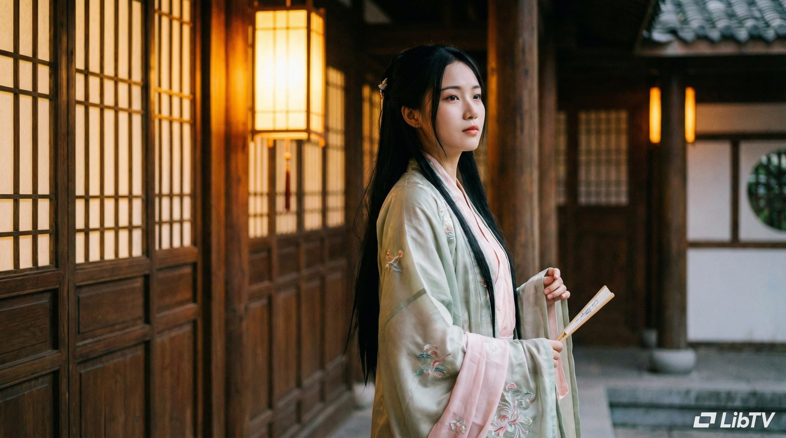</td>
<td><strong>[视频节点 6.mp4]</strong></td>
</tr>
</tbody>
</table>
<table>
<colgroup>
<col style="width: 50%" />
<col style="width: 50%" />
</colgroup>
<tbody>
<tr class="odd">
<td>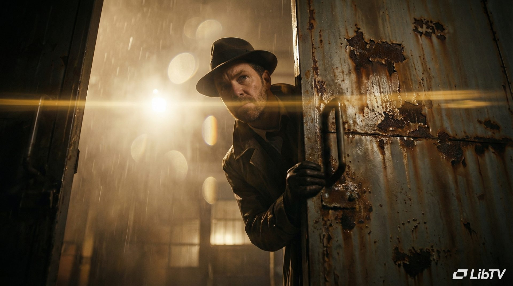</td>
<td><strong>[视频.mp4]</strong></td>
</tr>
</tbody>
</table></td>
</tr>
<tr class="odd">
<td>虚拟主播讲解</td>
<td>
输入：把 @视频1 中 播报的男生换成 @图片1 中的女生

<table>
<colgroup>
<col style="width: 50%" />
<col style="width: 50%" />
</colgroup>
<tbody>
<tr class="odd">
<td>
图片1

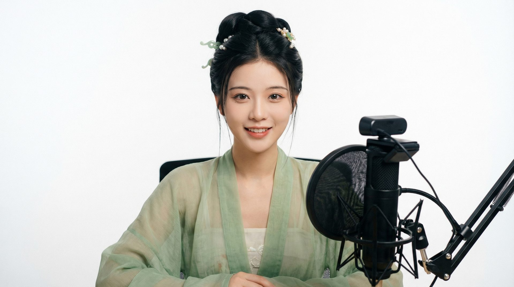
</td>
<td>
视频1

<strong>[视频节点 4.mp4]</strong>
</td>
</tr>
</tbody>
</table>

结果：

<strong>[视频节点 6 (1).mp4]</strong>
</td>
</tr>
<tr class="even">
<td>数字分身创作</td>
<td>
需对角色 完成 <strong>角色人脸授权</strong>，创建为<strong>数字分身后，可作为角色创建视频</strong>

<table>
<colgroup>
<col style="width: 50%" />
<col style="width: 50%" />
</colgroup>
<tbody>
<tr class="odd">
<td>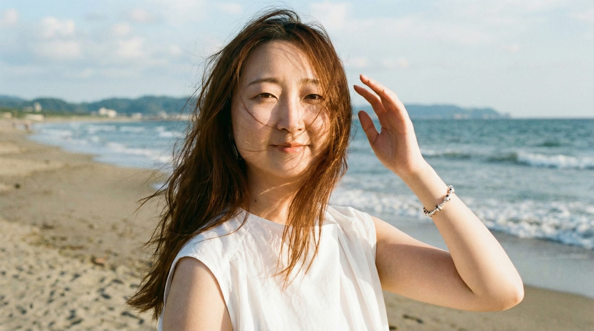</td>
<td><strong>[视频节点 4 (1).mp4]</strong></td>
</tr>
</tbody>
</table>

<strong>[视频节点 2 (4).mp4]</strong>
</td>
</tr>
</tbody>
</table>

**2️⃣ 2种合规校验方式**

**「单素材」校验**

**上传或生成**文字/图片/视频/音频素材后，点击**「Seedance 2.0合规校验」**等待审核完成，即可使用Seedance 2.0生成写实真人视频内容

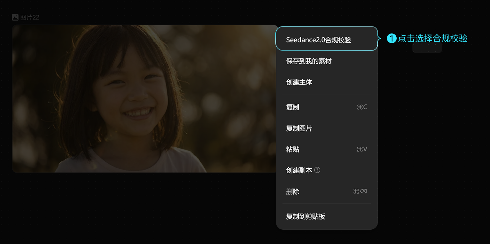

校验通过后，会有专属标识

**「角色库」批量添加**

> ① 视频生成器中选择 Seedance 2.0模型，**点击顶部「角色库」功能，进入素材库**
>
> 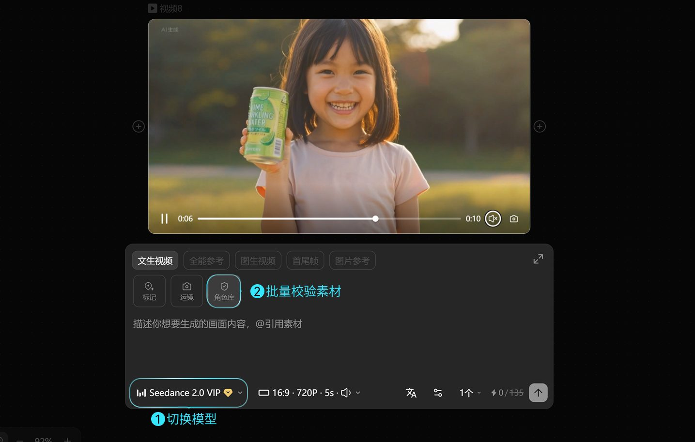

②可批量上传素材进行核验，支持**本地上传/历史图库**上传，支持音频、视频和图像。

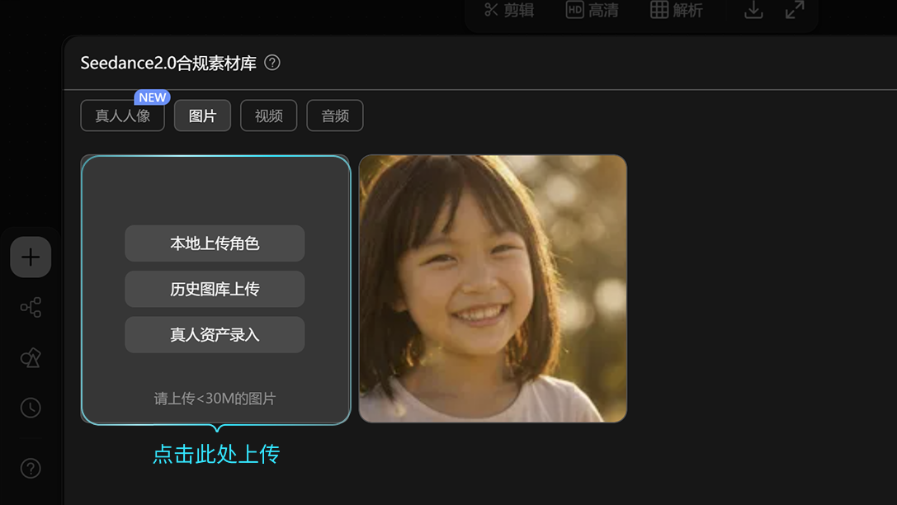

**💡真人人像授权**

**①** 在视频生成中，点击角色库，选择真人资产录入，或者点击真人人像，在真人人像中添加

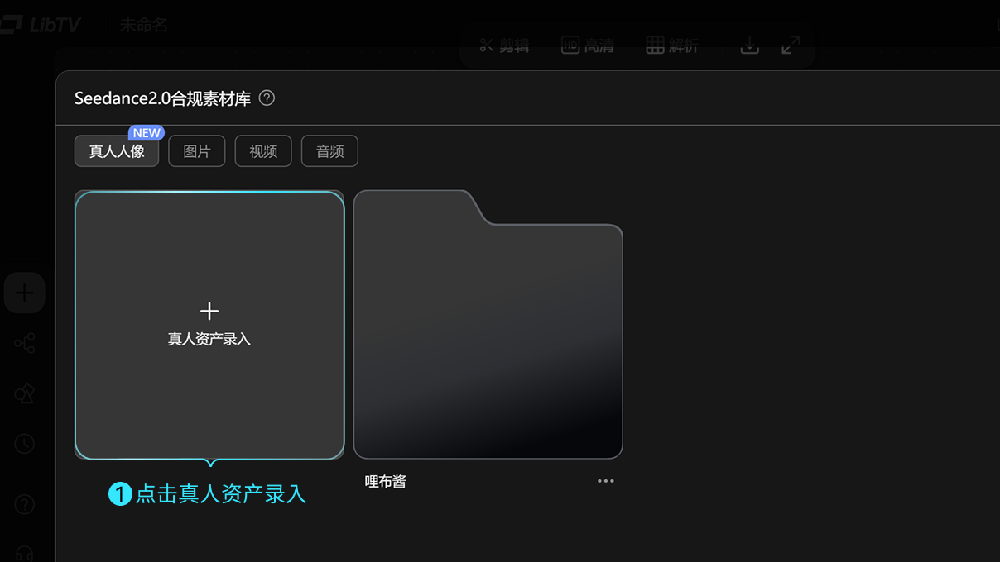

**②**手机扫码，需要真人完成识别检测进行授权，授权完成后角色创建。创建时注意要填写文件名称

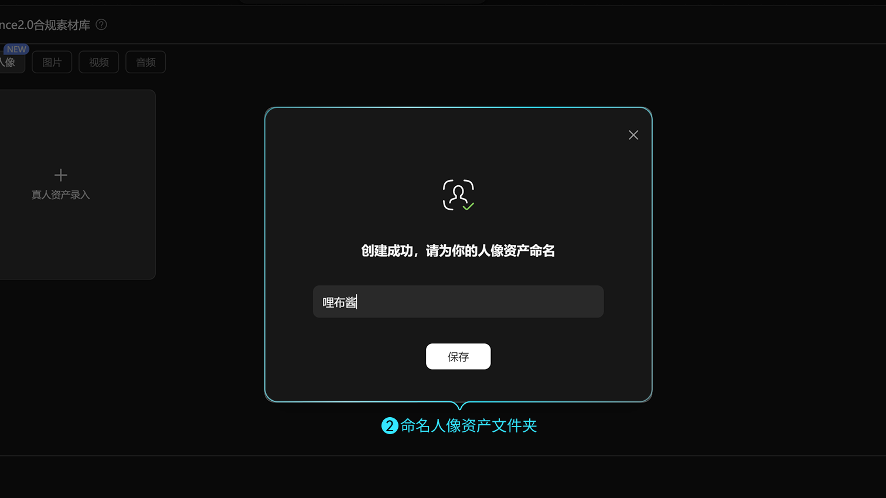

**③在创建好的真人文件夹中**，去上传对应真人的不同妆造图或者三视图。

**注意💡：**上传完毕后，后台会进行图片和真人活体检测的比对，若比对结果是同一个人，则审核成功；通过后图片上方有合规的标记

若不是同一个人，或者图片中出现了两个人，则审核不通过，仍然无法使用此张图片生视频。

按照同样的方式，可以创建多个真人资产文件夹，邀请多个真人朋友出境做视频。注意一定要写清楚文件夹的名称，不然容易找不到！

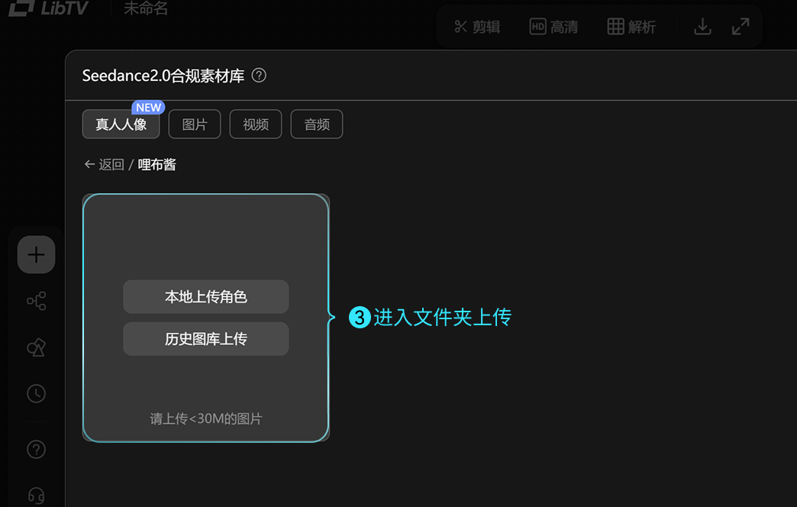

**3️⃣ Seedance2.0模型提示词优化功能**

**功能详情**：把用户的提示词按官优化改写为 Seedance 2.0 更容易执行的结构化 提示词，从而降低“模型不听指令”的概率

<table>
<colgroup>
<col style="width: 100%" />
</colgroup>
<tbody>
<tr class="odd">
<td>
此功能仅在seedance2.0系列模型生效

对于角色<strong>指代较为复杂的提示词场景，效果较好，建议使用</strong>

对于视频时长较短的场景，由于提示词会扩充很多，可能出现时长过短，无法完全执行完提示词指令的情况可适度选择
</td>
</tr>
</tbody>
</table>

**入口：**视频节点下方，提示词输入框 **（本功能仅支持seedance2.0）**

**使用教程**

输入提示词

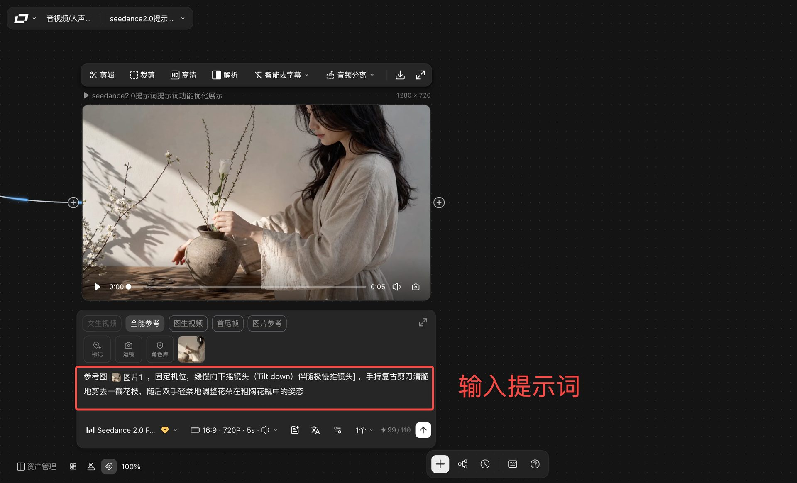

点击提示词优化按钮

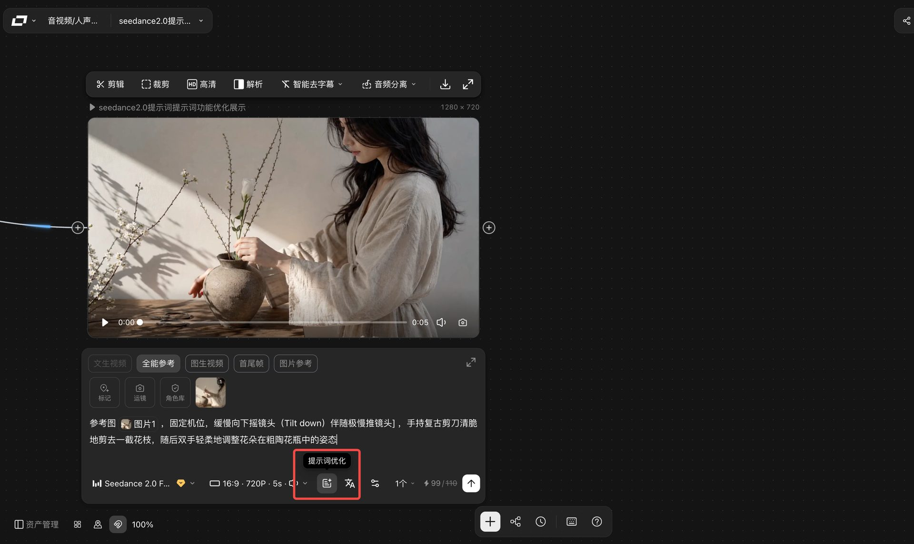

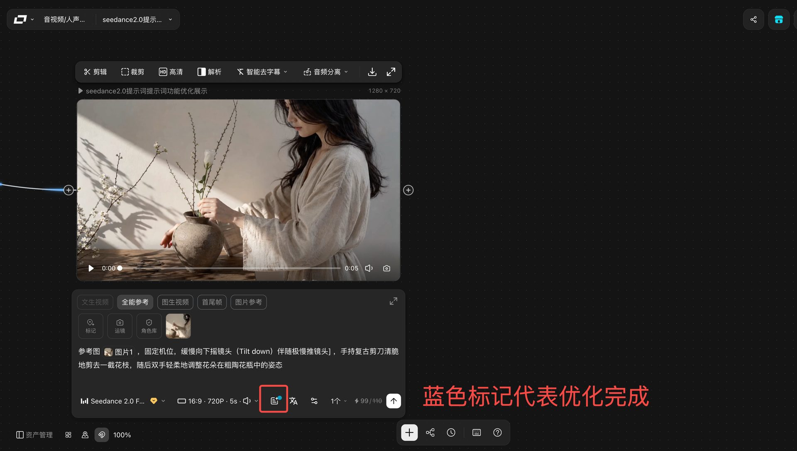

再次点击提示词优化按钮，出现优化后提示词，点击「填充到输入框」

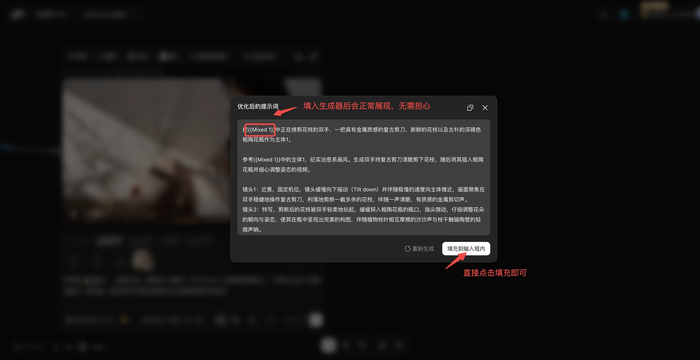

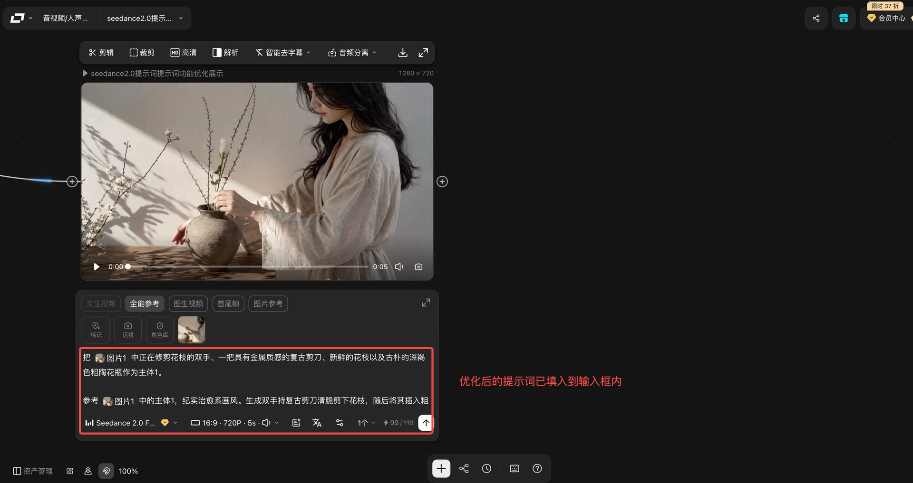

**🧭 视频模型能力清单**

<table>
<colgroup>
<col style="width: 24%" />
<col style="width: 75%" />
</colgroup>
<tbody>
<tr class="odd">
<td>模型名称</td>
<td>能力简介</td>
</tr>
<tr class="even">
<td><strong>Wan 3.0</strong></td>
<td>
<strong>模型能力</strong>

Wan 3.0支持<strong>原生30秒视频生成</strong>，并可根据内容自动匹配合适时长。

单次最多可输入 <strong>10张图片、5段视频与5段音频</strong>，并进一步支持PPT、PDF、Word、Excel、Markdown等<strong>文档和网页链接作为创作参考</strong>，并能像素级还原参考细节；

提示词最高支持20,000字符，覆盖480P、720P与1080P多档分辨率。

<strong>模型亮点</strong>

能真实呈现不同年龄、肤色、职业与气质；摆脱千篇一律的“AI网红脸”。

能够理解眼神、呼吸、停顿、语气与肢体动作之间的关系，让担忧、犹豫、失落、惊恐、愤怒与狂喜等情绪实现更自然、连续的转换。配合对白、环境音、音效与音乐，角色不只是“会动”，而是真的“演技在线”。
</td>
</tr>
<tr class="odd">
<td><strong>MiniMax H3</strong></td>
<td>
<strong>模型能力</strong>

全能多模态参考：可以组合人物图、动作视频、运镜视频、场景图和参考音频，分别控制最终视频的不同部分

原生声音能力更完整<strong>（音频拆分更便捷、修改更可控）：</strong>支持原生双声道、对白、环境音、音效、音色迁移、台词替换和多语言表达

精准编辑维度更丰富：不只是生成，还能换人物、换商品、换背景、<strong>改光影、增加特效、修改台词与表演</strong>

复杂需求控制能力更强：更适合“保留原视频大部分内容，只修改其中几个指定细节”的任务

商业覆盖面更广：除广告和短片外，还覆盖AR、MG动画、UI演示、游戏内容、电商及工业硬件演示

<strong>模型使用</strong>

时长：4-15s

分辨率：768P/1440P

参考生成：

图片： ≤ 9 张；宽高范围：[256, 5760]；单个图像不大于30MB

视频 ：≤ 3 段；单段时长[2, 15]秒；总时长≤ 15秒；宽高范围：[256, 5760]；宽高比： 5:2~2:5范围内；单个视频不大于50MB

音频 ：≤ 3段，且必须配图片或视频输入，不能单独输入；单段时长：[2, 15]秒；总时长≤ 15秒；单个音频不大于15MB

混合输入的总上限是 12 个文件

无图片、视频、音频输入时为文生视频模式

<strong>优势能力</strong>

<strong>对口型演唱</strong>：角色精准对口型唱歌

<strong>音色克隆迁移</strong>：高保真复刻与迁移声音

<strong>UI与文字动态</strong>：完美呈现字幕、品牌Logo及动态界面

<strong>创意特效生成</strong>：轻松打造涂鸦、手绘动画特效

<strong>全能精准编辑</strong>：高精准指令，音视频全要素指哪改哪

<strong>绿幕换背景</strong>：一键精准抠像，无缝融入新场景

<strong>视频延长</strong>：流畅顺滑续写，前后画面自然衔接

<strong>语言支持与本地化表达：</strong>

支持多语言提示词输入与输出

TTS （文本转语音）精准覆盖 <strong>11 种语言</strong>，包括中文、英语、日语、韩语、法语、德语、西班牙语等

更多语言可衍生探索，如阿拉伯语、泰语、印尼语、印地语等<strong>40多种语言</strong>

适合海外品牌传播、多语种广告、跨语言短片和本地化产品介绍等场景
</td>
</tr>
<tr class="even">
<td>
<strong>Seedance 2.5🔥</strong>

最强视频生成模型
</td>
<td>
<strong>全能视频生成/编辑/参考</strong>

<blockquote>

文生视频、<strong>全能参考</strong>、首尾帧生成、<strong>视频编辑</strong>、<strong>超长视频（300 秒/5 分钟）</strong>

</blockquote>

<strong>生成时长：</strong>4-30秒

<strong>分辨率</strong>：480P / 720P

<strong>50 个参考素材</strong>

最多 30 图 + 10 视频 + 10 音频联合输入，方便控制多角色、音色、场景、道具、音乐等。

参考视频时长加总需小于 30s

也支持单音频模态输入

图片格式：jpeg、png、webp、bmp、tiff、gif、 heic 和 heif

视频格式：mp4、mov

<strong>使用直达👉</strong>

<blockquote>

https://kol.liblib.tv/canvas?newProject=true&amp;createWorkspace=true&amp;guideSource=tv-home-models&amp;presetModelModality=video&amp;presetModelKey=star-video2.5

</blockquote></td>
</tr>
<tr class="odd">
<td>Seedance 2.0</td>
<td>
<strong>1.模型优势</strong>

<strong>多模态全能参考</strong>：文本、图像、视频、音频<strong>混合输入</strong>单次最多 12 个参考文件（图像≤9 张、视频≤3 段、音频≤3 段）

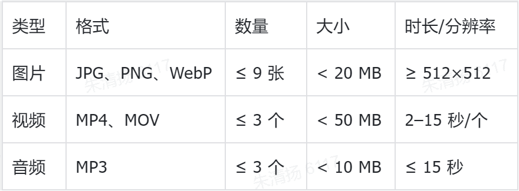

<strong>智能分镜与影视级运镜</strong>：可像专业导演一样自动调度画面,完成景别规划、视角切换与镜头运动设计，同步匹配音效与音乐，直出专业级视听效果

<strong>视频智能复刻:</strong>还原参考视频或音频中的 人物动作、角色走位、分镜运镜、视觉特效与音乐风格，无论是大片级镜头语言，还是爆款运镜节奏，都能高效复现。

<strong>视频编辑：</strong>支持元素增删改换、背景替换，以及风格、天气、颜色、材质、景别视角调整，

<strong>视频延展：</strong>无限延展续拍与多段智能衔接

角色、场景、产品画面稳定统一，细小文字清晰呈现

物理更合理、动作更自然、理解更精准，复杂场景稳定输出

<strong>2.使用方法</strong>

Lib视频生成器：

使用方法：进入后，再做左下角切换模型能力

Seedance 2.0 支持<u>「首尾帧」</u>和<u>「全能参考」</u>入口，智能多帧和主体参考无法选中。若你只上传首帧图 + prompt，可走首尾帧入口；<strong>如需多模态（图、视频、音频、文本）组合输入，则需进入全能参考入口</strong>

当前支持的交互方式是通过“<strong>@素材名</strong>”来指定每个图片、视频、音频的用途，例如：<strong>@图片1 作为首帧，@视频1 参考镜头语言，@音频1 用于配乐</strong>

<strong>合规须知</strong>

目前Seedance 2.0的人像素材需要进行合规校验，审核方式见<strong><a href="https://liblibai.feishu.cn/wiki/Loxfw6XHziYRk0kKzdjcFfp9nhb?contentTheme=DARK&amp;last_doc_message_id=7623398663818333145&amp;preview_comment_id=7623399264634276804&amp;sourceType=feed&amp;theme=light#share-FUd8dk3dFoMNIoxG2TicinKgn6b">这里</a>。</strong>

<strong>上传参考须知</strong>

图生视频-首帧、图生视频-首尾帧、多模态参考生视频(包括参考图、视频、音频)为3种互斥场景,不可混用。

<strong>多模态参考生视频，</strong>可通过提示词指定参考图片作为首帧/尾帧,间接实现"首尾帧+多模态参考"效果。若需严格保障首尾帧和指定图片一致,优先使用图生视频-首尾帧功能
</td>
</tr>
<tr class="even">
<td>HappyHorse 1.0</td>
<td>
<strong>模型能力：</strong>

<strong>4大模式</strong>：文生、图生、参考图生成视频；视频编辑

参考图生成视频：支持最多9张图像参考

视频编辑：包括局部编辑、风格转换等。除了文本指令，另外支持上传 1-5 张图像作为参考

<strong>时长：</strong>3-15s；<strong>分辨率：</strong>720｜1080P

<strong>电影级画面质感</strong>：接近实拍电影级效果，尤其擅长大光圈、浅景深、强氛围感的中近景镜头，适配广告、短视频、社媒营销等专业场景。

<strong>智能叙事与分镜</strong>：具备出色的语义理解和指令遵循能力，自动完成多镜头调度与分镜编排，切镜时机与运镜方式符合叙事逻辑。

<strong>强人物表现力</strong>：在动作自然度、微表情刻画、对白真实感三方面显著提升。情绪递进细腻，多角色对话衔接流畅。

<strong>音画同步生成</strong>：支持台词交锋、环境音效等音频环节前置到生成阶段，实现音画同步。

<strong>多风格轻松还原</strong>：覆盖港风电影、复古胶片、水墨工笔、折纸、粘土定格动画等多种风格
</td>
</tr>
<tr class="odd">
<td>Kling O3 🔥</td>
<td>
支持<strong>全能参考生成</strong>、视频编辑任务

视频编辑：元素或背景的增加、删除和修改，以及修改视频的风格、天气、颜色、材质、景别视角等

支持视频、音频、图像混合参考生成
</td>
</tr>
<tr class="even">
<td>Kling 3.0 🔥</td>
<td>
适用于文生、图生和首尾帧生视频任务

原生音画同步、自定义多分镜叙

提示词控制<strong>说话、音效、BGM</strong>等不同类型的音频效果
</td>
</tr>
<tr class="odd">
<td>Kling 3.0 动作迁移 🔥</td>
<td>一键复刻参考图像/视频中的人物表情、口型、动作、姿势</td>
</tr>
<tr class="even">
<td>Kling O1</td>
<td>
多图参考生成，最多7张

视频编辑：元素或背景的增加、删除和修改，以及修改视频的风格、天气、颜色、材质、景别视角等
</td>
</tr>
<tr class="odd">
<td>Kling 2.6</td>
<td>支持文生、图生视频、音画同步</td>
</tr>
<tr class="even">
<td>Kling 2.5</td>
<td>支持文生、图生、首尾帧生视频</td>
</tr>
<tr class="odd">
<td>Kling 2.1</td>
<td>支持文生、图生、首尾帧生视频</td>
</tr>
<tr class="even">
<td>Shot V2 ☁️</td>
<td>
支持文生、图生、参考生视频；

支持上传参考图、可音画同步、智能多分镜

分辨率 720p，最长 12s
</td>
</tr>
<tr class="odd">
<td>Shot V2 Pro ☁️</td>
<td>分辨率 1080p，更逼真的物理运动效果</td>
</tr>
<tr class="even">
<td>Video 3.1 🍌</td>
<td>
支持文生、图生、首尾帧生视频；

音画同步，原生音效

智能多镜头叙事
</td>
</tr>
<tr class="odd">
<td>Video 3.1 Fast 🍌</td>
<td>生成速度更快，成本更低</td>
</tr>
<tr class="even">
<td>Video 3 🍌</td>
<td>支持文生、图生视频；基础原生音频同步</td>
</tr>
<tr class="odd">
<td>Video 3 Fast 🍌</td>
<td>生成速度更快，成本更低</td>
</tr>
<tr class="even">
<td>Wan 2.6</td>
<td>
支持文生、图生视频

支持智能多镜头、支持上传视频参考（角色&amp;语音）、音画同步、多角色对话
</td>
</tr>
<tr class="odd">
<td>Wan 2.5</td>
<td>
支持文生、图生视频

引入原生音频生成能力，支持自动配音
</td>
</tr>
<tr class="even">
<td>Wan 2.2</td>
<td>支持文生、图生视频</td>
</tr>
<tr class="odd">
<td>Seedance1.5 Pro</td>
<td>
支持文生、图生、首尾帧生视频

支持音画高精同步、多人多语言对白、影视级叙事节奏
</td>
</tr>
<tr class="even">
<td>Seedance 1.0 Pro</td>
<td>支持文生、图生、首尾帧生视频</td>
</tr>
<tr class="odd">
<td>Seedance 1.0 Lite</td>
<td>生成速度快</td>
</tr>
<tr class="even">
<td>Hailuo 2.3</td>
<td>
支持文生、图生视频

支持动漫、插画、水墨等风格化效果
</td>
</tr>
<tr class="odd">
<td>Hailuo 2.3 Fast</td>
<td>生成速度更快，成本更低</td>
</tr>
<tr class="even">
<td>Hailuo 02</td>
<td>支持文生、图生、尾帧生视频</td>
</tr>
<tr class="odd">
<td>Vidu Q3 Pro</td>
<td>
支持文生、图生视频，时长1-16s

支持多图参考生视频
</td>
</tr>
<tr class="even">
<td>Vidu Q2 Pro</td>
<td>支持文生、图生、首尾帧生视频，时长2-8s</td>
</tr>
<tr class="odd">
<td>Vidu Q2 Turbo</td>
<td>速度快，成本低，适合迭代测试</td>
</tr>
<tr class="even">
<td>Vidu Q2</td>
<td>极速生成，最低成本</td>
</tr>
<tr class="odd">
<td>Pixverse V5.5</td>
<td>
支持文生、图生、首尾帧生视频

支持音画同出、智能多镜头
</td>
</tr>
<tr class="even">
<td>Pixverse V5</td>
<td>支持文生、图生、首尾帧生视频</td>
</tr>
<tr class="odd">
<td>OmniHuman 1.5</td>
<td>数字人视频模型。支持根据音频，将静态人物图像变为动态数字人说话视频，可生成自然全身动作</td>
</tr>
<tr class="even">
<td>MJ Video ⛵️</td>
<td>
仅支持图生视频，支持生成循环动图

动态表现连贯
</td>
</tr>
</tbody>
</table>

5.3 **语言大模型**

<table>
<colgroup>
<col style="width: 18%" />
<col style="width: 81%" />
</colgroup>
<tbody>
<tr class="odd">
<td>模型名称</td>
<td>功能简介</td>
</tr>
<tr class="even">
<td>CVLM5.5</td>
<td>
最新最强的大语言模型

支持文本、图像的解析处理

可用于生成提示词、反推提示词、生成/完善/完善故事剧情、脚本或角色设定
</td>
</tr>
<tr class="odd">
<td>GVLM 3.1</td>
<td>
多模态语言模型，支持根据文本、图像、视频、音频指令生成文本内容，适合深度推理、复杂生成人物

可用于生成提示词、反推提示词、生成/完善/完善故事剧情、脚本或角色设定
</td>
</tr>
<tr class="even">
<td>GVLM 3.1 Flash</td>
<td>生成速度比 Pro 更快，成本更低，适合处理简单、轻量级任务</td>
</tr>
<tr class="odd">
<td>Qwen3 VL Flash</td>
<td>
视觉理解模型

图像理解：物体识别、场景描述、图表解析、OCR 文字识别

视频理解：支持长达 20 分钟的视频内容理解，可精确定位到秒级时刻

2D/3D 定位：具备视觉空间感知能力，可判断物体方位、视角变化、遮挡关系
</td>
</tr>
</tbody>
</table>

5.4 **音频模型**

5.4.1 **音色克隆**

**功能简述**

> 录制对应的声音样本，就能创建专属音色。后续输入文本，即可用这个音色持续生成新的配音内容。

**使用方法**

> 1️⃣ 新建「音频」节点，模型选择 Minimax Speech。进入高级设置，选择切换音色。
>
> 2️⃣ 进入音色库，选择「我的音色」，然后点击顶部「克隆新音色」

|                                                                                                                                                                        |                                                                                                                                                                      |
|------------------------------------------------------------------------------------------------------------------------------------------------------------------------|----------------------------------------------------------------------------------------------------------------------------------------------------------------------|
|  | 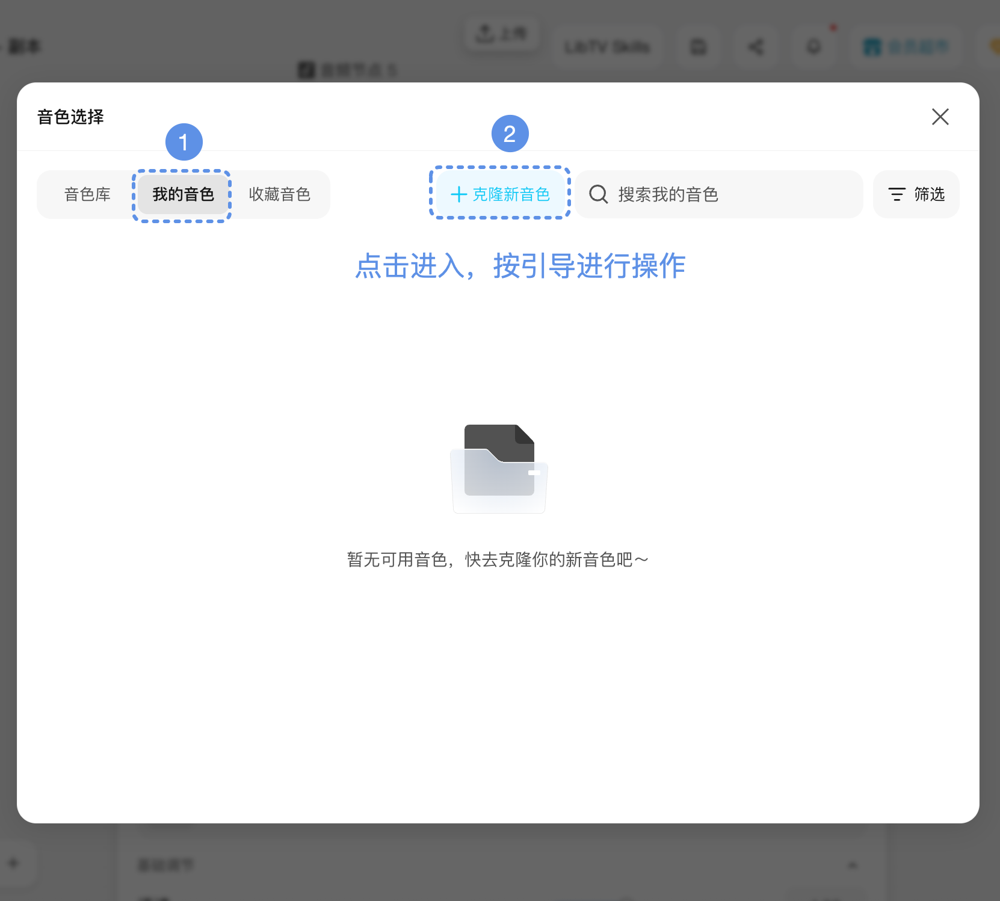 |

**克隆流程**

> **1️⃣ 朗读音频**
>
> 建议在相对安静的环境下,进行清晰、语速适中的朗读,尽量读115s以上,这样克隆出的音色结果才更准确。如果希
>
> 望有某些对应的情绪,可以在朗读的时候加上,这样使用该音色的的时候,也会带上对应的情绪。
>
> **2️⃣ 生成并试听音色**
>
> 音色生成成功后,先用一段短文本试听。试听时重点检查:

相似度：是否接近原声音色

清晰度：是否有杂音、糊音、爆音

稳定性：是否忽高忽低、忽快忽慢

自然度：是否像真人说话

情绪表达：是否符合文本内容

> 3️⃣ **填写音色相关的信息,进行音色信息登录**
>
> 登录相关音色信息,完成后即可完成克隆音色的创建。
>
> 4️⃣ 使用克隆音色生成语音
>
> 音色克隆成功后,**在语音生成页面选择该音色,再输入文本生成语音。**
>
> 注意:如果创建音色后,7天内未使用,会被minimax官方api清除(受内存限制,有实效性),所以建议创建完立刻
>
> 使用一次,这样就会一直保存在自己的音色库中。

5.4.2 **声音模型能力清单**

<table>
<colgroup>
<col style="width: 18%" />
<col style="width: 81%" />
</colgroup>
<tbody>
<tr class="odd">
<td>模型名称</td>
<td>功能简介</td>
</tr>
<tr class="even">
<td>Eleven V3</td>
<td>文本转语音</td>
</tr>
<tr class="odd">
<td>Mureka V8</td>
<td>通过文本生成歌曲或纯音乐</td>
</tr>
<tr class="even">
<td>Minimax 2.8</td>
<td>
<a href="https://resonate.feishu.cn/docx/DyQFddWftoEoOIxNcGrcTx7HnXe?from=from_copylink">LibTV中MiniMax-Speech 2.8使用说明</a>

Minimax Speech 2.8 hd和2.8turbo是 MiniMax 推出的新一代高表现力语音合成模型，核心优势集中在<strong>极致情感表达、海量精品音色、高保真音质、强可控</strong>性四大维度，全面贴近真人语音质感 。

<strong>海量精品音色</strong>：内置300+专业音色，覆盖多语种、男女老少及各类风格，还支持声音克隆，满足多元配音需求。

<strong>丰富情绪表达：</strong>可精准还原开心、温柔、严肃等多种情绪，自带呼吸、停顿、语气起伏等人声细节，真实自然。

<strong>高保真与强可控：</strong>音质清晰细腻，支持语速、音高等细粒度调节，适配虚拟人、智能交互、内容创作等场景。

<strong>支持音色克隆：</strong>录制对应的声音样本，就能创建专属音色。后续输入文本，即可用这个音色持续生成新的配音内容。

</td>
</tr>
</tbody>
</table>

6\. **快捷键操作**

快捷键入口：项目菜单栏处可打开快捷键面板

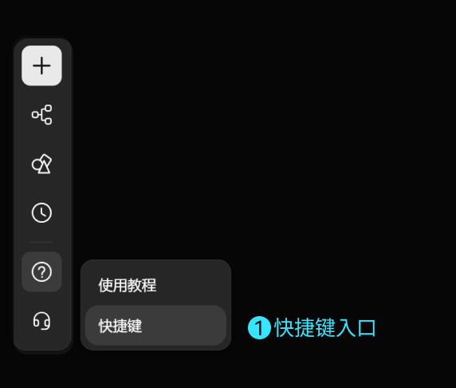

<table>
<colgroup>
<col style="width: 50%" />
<col style="width: 50%" />
</colgroup>
<tbody>
<tr class="odd">
<td>
以下快捷键为 Windows 版本，Mac 用户可将 Ctrl 替换为 Cmd。

快捷键可以组合使用，比如快速复制后立即拖动，效率更高。

💡LibTV支持跨画布复制功能，能够将不同画布的内容相互复制粘贴，并且复制粘贴时会带上连线
</td>
<td></td>
</tr>
<tr class="even">
<td><strong>创作</strong></td>
<td><strong>缩放</strong></td>
</tr>
<tr class="odd">
<td></td>
<td>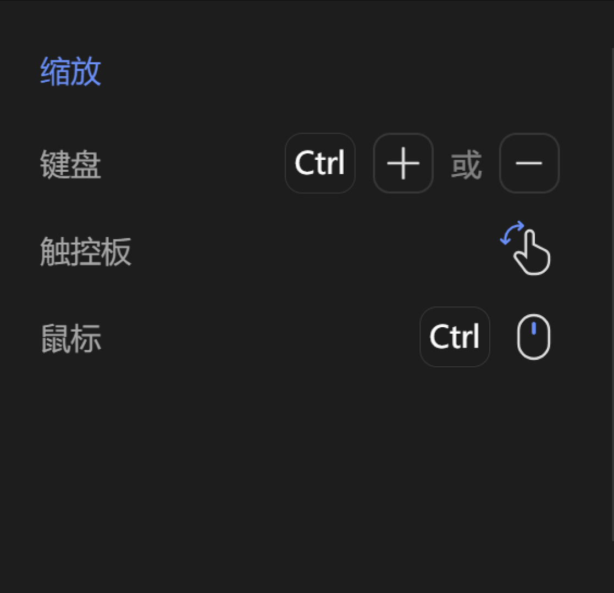</td>
</tr>
<tr class="even">
<td><strong>移动画布</strong></td>
<td><strong>其他</strong></td>
</tr>
<tr class="odd">
<td>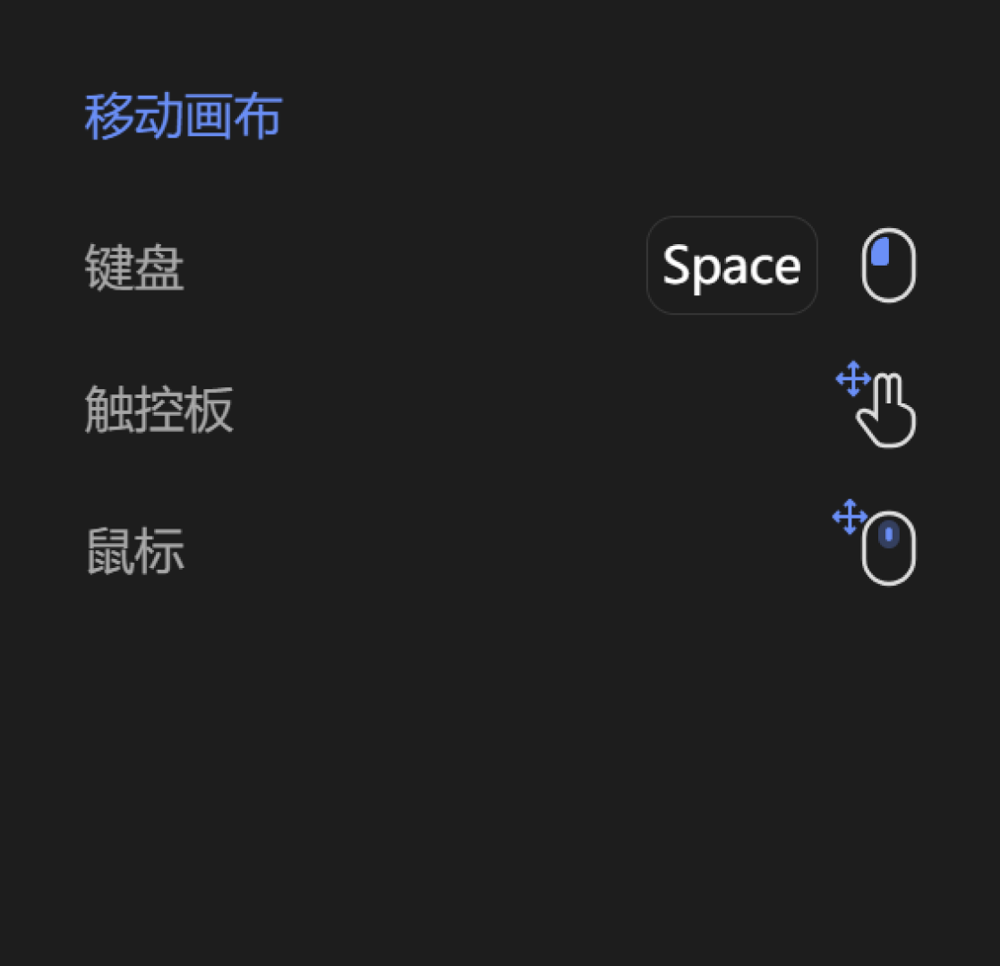</td>
<td></td>
</tr>
</tbody>
</table>
