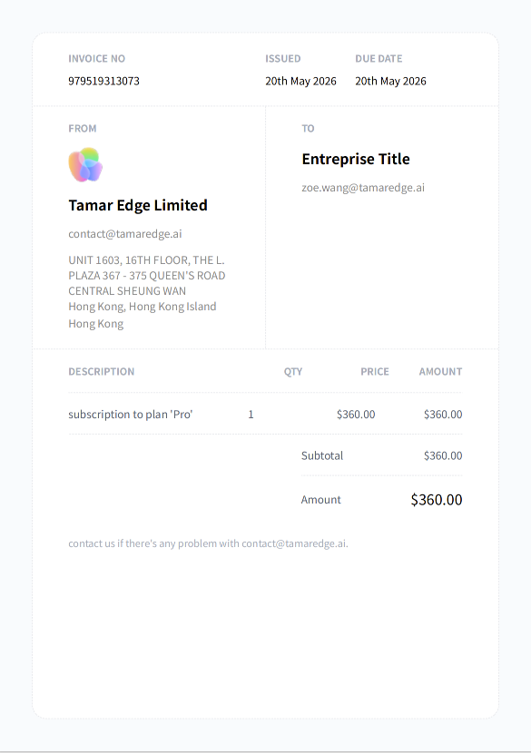
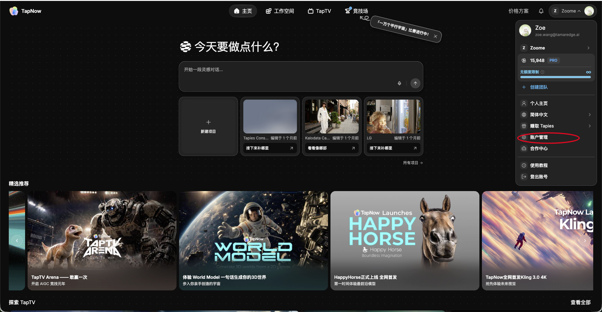
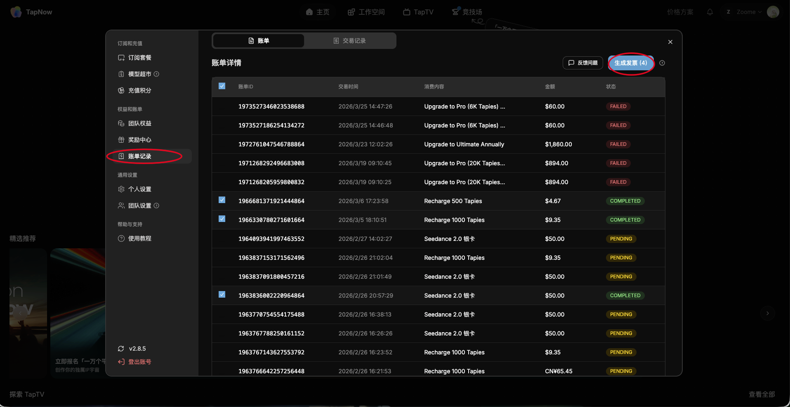

# TapNow 商业发票

> 来源：https://docs.tapnow.ai/zh/docs/help-center/commercial-invoices
> 抓取时间：2026-09-23 11:44（离线快照，原文见链接）

# TapNow 商业发票

了解 TapNow 商业发票的用途和适用场景，以及如何在账单记录中自助生成并下载发票。

### 什么是商业发票

商业发票，也称 ****Commercial Invoice****，是企业在提供商品或服务后，向付款方出具的正式交易凭证。对于跨境交易，商业发票可用于说明交易事实、费用用途和付款金额。**[图片缺失：源站资源已失效或需登录]**

TapNow 商业发票通常包含：发票编号、开具日期、付款方信息、收款方信息、服务内容、数量、单价、金额和支付币种等信息。

---

### 商业发票有什么作用

商业发票可以帮助企业记录真实发生的商业支出。它通常可用于：确认服务采购支持内部报销作为成本费用入账凭证与银行支付回单一起留存，形成完整付款证明。

对于中国大陆企业用户。TapNow 的服务主体为香港公司，因此无法开具中国大陆增值税发票，包括增值税普通发票和增值税专用发票。

TapNow 可提供正式商业发票。发票根据真实订单和支付记录生成，包含完整交易信息，可用于企业财务留档、入账和报销参考。参考法规： 根据国家税务总局的相关规定（公告 2018 年第 28 号）[《企业所得税税前扣除凭证管理办法》](https://www.gov.cn/gongbao/content/2018/content_5326376.htm) ，企业从境外购进劳务发生的支出，以对方开具的发票或具有发票性质的收款凭证、相关税费缴纳凭证作为税前扣除凭证。

在实际财务操作中，您只需使用 TapNow 提供的“商业发票 + 银行支付回单”，即可作为合法有效入账凭证。

---

### 如何自助开具商业发票

官网订单支持自助开具商业发票。

操作路径：进入 TapNow 官网-点击右上角【个人头像】-进入【账号管理】，打开【账单记录】，选择同一币种下的一条或多条账单记录，点击【生成发票】系统生成后，即可下载并保存商业发票。

---

### 常见问题

#### TapNow 可以开具中国大陆增值税发票吗？

暂不支持。TapNow 的服务主体为香港公司，无法开具中国大陆增值税发票。

#### 商业发票可以用于报销或入账吗？

通常可以作为企业财务入账和报销的凭证材料之一。建议同时提供商业发票和银行支付回单，并由企业财务确认。

#### 已支付订单可以补开发票吗？

可以。进入【账号管理】—【账单记录】，选择对应记录后生成发票即可。

#### 多笔订单可以合并开具吗？

可以。同一币种下的一条或多条账单记录，可以合并生成商业发票。

---

### 需要帮助？

如在开具过程中遇到问题，可联系 TapNow 支持团队：[contact@tamaredge.ai](mailto:contact@tamaredge.ai)

[上一页本地货币预估价格](https://docs.tapnow.ai/zh/docs/local-currency-price-estimates)

[下一页增值税发票](https://docs.tapnow.ai/zh/docs/help-center/mainland-china-vat-invoices)
