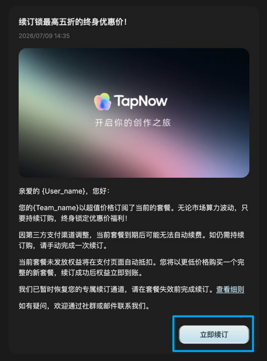
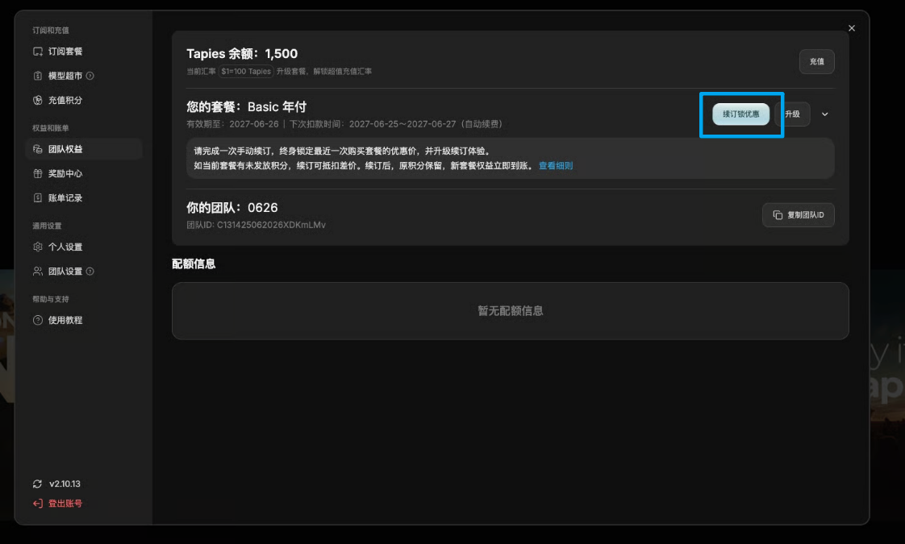
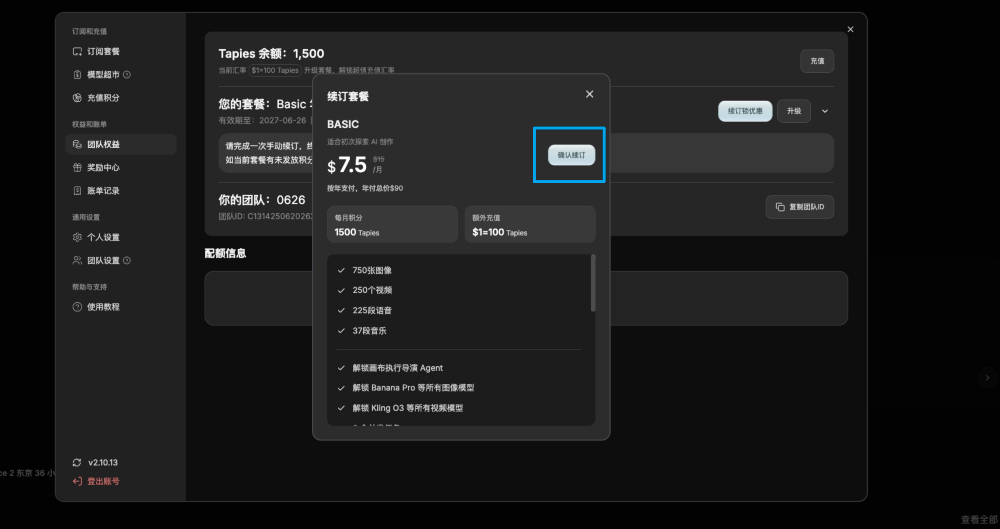
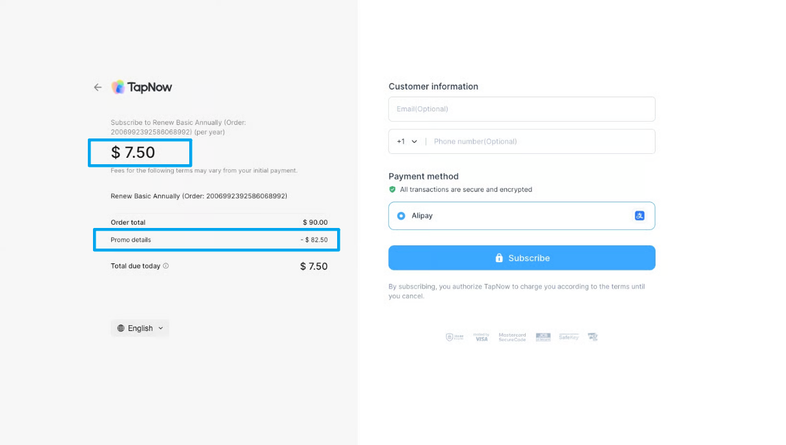
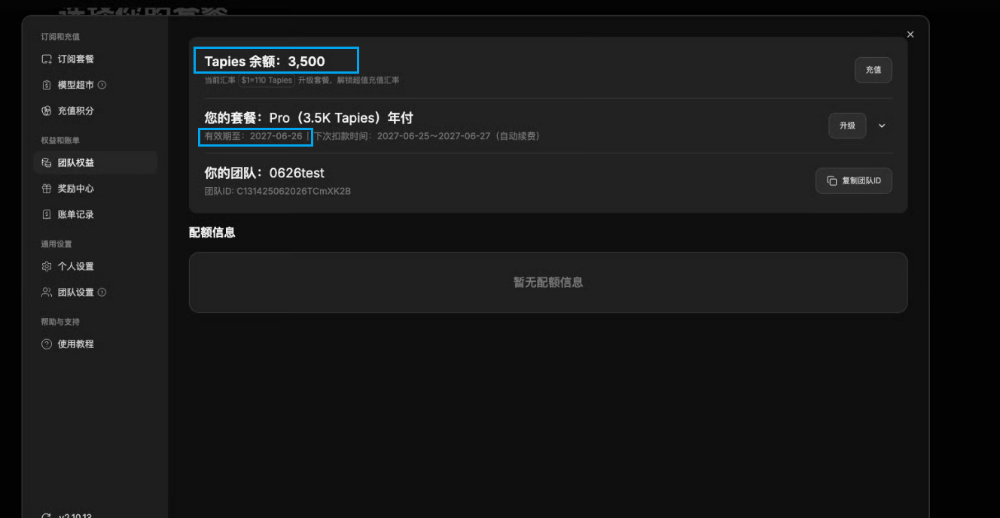

# TapNow 手动续订与优惠锁定说明

> 来源：https://docs.tapnow.ai/zh/docs/help-center/renewal-and-discounts
> 抓取时间：2026-09-23 11:44（离线快照，原文见链接）

# TapNow 手动续订与优惠锁定说明

了解为什么需要完成一次手动续订、未发放权益如何折算，以及如何继续锁定当前优惠价格。

完成一次续订，即可继续保留当前优惠价。

### 一、为什么需要手动续订一次？

因支付渠道变动，我们为部分团队升级了支付渠道。请在套餐失效前完成一次续订。

如未及时续订，可能出现以下影响：

1. ****套餐到期后无法继续自动续费；****
2. ****终身优惠价失效，无法以超值价格续订；****
3. ****再次购买需按官网实时价格，价格随市场算力成本变化。****

### 二、续订成功后

完成本次续订后，您的团队将：

1. ****锁定终身优惠价格****
2. ****当前套餐积分永久有效****
3. ****新套餐权益立即到账****
4. ****支付方式升级，套餐续费稳定****

### 三、续订费用和权益如何处理？

系统会记录您最近一次购买的套餐，您将按照最近一次套餐的价格、权益、激活时长进行续订。当前套餐未发放的权益会转为本次续订优惠。您将以更低成本，购买一份完整的新套餐。

1. ****当前套餐已发放积分永久有效****\
   当前套餐中已到账的积分不会清空，可继续使用，不受本次续订影响。
2. ****未发放积分自动折算为续订优惠****\
   当前套餐中尚未发放的积分不会浪费，系统会****在支付页面自动折算为本次续订优惠****，直接抵扣新套餐价格。抵扣后，您只需支付剩余差额。
3. ****新套餐权益立即到账****\
   续订成功后，新套餐积分将立即发放到账，团队可直接使用。
4. ****新套餐享有完整权益周期****\
   本次续订购买的是一份完整的新套餐。月付套餐自续订成功日起享有完整 1 个月权益周期，年付套餐自续订成功日起享有完整 12 个月权益周期，不会因抵扣而缩短。

### 四、如何完成续订？

您可以从站内信、或团队权益页点击「立即续订」，进入续订页面。

操作步骤如下：

1. 打开站内信，在右下方****点击「立即续订」按钮****；

2. 进入团队权益页面查看当前套餐。如当前无套餐，则按最近一次购买的套餐进行续订。****点击「续订锁优惠」按钮****继续操作。

3. 查看本次续订的套餐原价格和权益，点击确认续订按钮

4. 在支付页面查看本次续订套餐的实付价，Promo Details将抵扣优惠金额；

5. 支付成功后，团队权益页将显示新套餐的名称和新的有效期，新权益立即到账。您也可以前往账单记录，查看已到账的新套餐本月发放积分。

### 五、常见问题

****1.我已经有套餐了，为什么还要续订一次？****\
因为本次续订不是重复购买同一份旧权益，而是为了更新后续续订方式，并继续保留当前优惠价。

****2.当前积分会被清空吗？****\
不会。已发放积分会被保留且永久有效。

****3.什么是未发放权益？****

未发放权益指当前套餐中尚未到账的后续权益。

例如，您购买的是 ****Pro 6K Tapies 年付套餐****，套餐按月发放积分。如果当前仍有 5 个月积分尚未发放，那么这 5 个月对应的积分就是未发放权益。

****4.支付页面中的续订优惠金额是什么？****

系统会将当前套餐未发放权益自动折算为续订优惠，并直接抵扣新套餐价格。

例如，您购买的 Pro 6K 年付套餐原价为 ****$540****，折算后每月为 ****$45****，每月发放 ****6000 Tapies****。如果当前仍有 5 个月权益未发放，则系统会将这 5 个月权益折算为 ****$225**** 续订优惠，未发放积分不再发放。续订时，这 ****$225**** 会自动抵扣新套餐价格。若新套餐价格为 ****$540****，则您本次仅需支付 ****$315****。

****5.可以等套餐到期后再续订吗？****\
不建议。套餐到期后，原自动续订方式可能失效，当前优惠价也可能无法继续保留。建议在套餐失效前完成续订。

****6.套餐已经失效了，还能续订吗？****\
如果页面仍显示续订入口，说明我们暂时为您保留了专属续订资格。您将可以续订最近一次拥有的套餐权益。建议尽快完成续订，以免错过优惠福利。

****7.支付失败怎么办？****\
请重新点击「立即续订」再次尝试。如多次失败，请通过社群或邮件联系支持团队。

邮箱地址：[contact@tamaredge.ai](mailto:contact@tamaredge.ai)\
社群二维码：

[上一页管理 Tapies 与套餐](https://docs.tapnow.ai/zh/docs/account/manage-tapies-and-plans)

[下一页本地货币预估价格](https://docs.tapnow.ai/zh/docs/local-currency-price-estimates)
