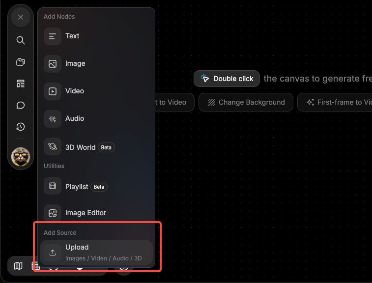

# 上传文件并放入画布

> 来源：https://docs.tapnow.ai/zh/docs/canvas/upload-files-to-the-canvas
> 抓取时间：2026-09-23 11:41（离线快照，原文见链接）

# 上传文件并放入画布

把电脑里的图片、视频和音频上传到画布，并在 Agent 对话或后续节点中引用。

你可以把电脑里的图片、视频和音频直接放到画布上。上传完成后，每个文件都会变成一个独立节点，可以预览、移动、连接，也可以交给 Agent 继续处理。

上传文件不会自动开始生成。需要使用某个文件时，可以在 Agent 输入框中通过 `@` 引用它，或者把它连接到下一步的图片、视频或音频节点。

## 1. 选择上传方式

| 你想怎么上传 | 怎么操作 |
| --- | --- |
| 从电脑选择一个或多个文件 | 点击画布左侧工具栏的 `+`，选择上传 |
| 把文件放到画布上的指定位置 | 从 Finder 或文件资源管理器中拖动文件，放到画布空白处 |
| 粘贴截图或复制的媒体文件 | 回到画布，按 `⌘ V`；Windows 使用 `Ctrl V` |

通过 `+` 上传时，新节点会出现在当前画面中间。拖拽上传时，新节点会出现在松开文件的位置。

## 2. 从添加菜单上传

1. 点击画布左侧工具栏的 `+`；
2. 在添加菜单中选择上传；
3. 从电脑中选择图片、视频或音频；
4. 等待上传完成；
5. 画布中出现文件预览后，单击节点检查内容。

一次选择多个文件时，Creative OS 会为每个成功上传的文件创建一个节点。某个文件上传失败，不会删除已经成功上传的其他文件。

## 3. 把文件拖到画布上

拖拽适合你已经知道文件应该放在哪里的情况。

1. 在 Finder 或文件资源管理器中找到文件；
2. 按住文件并拖进画布；
3. 画布出现上传提示后，把文件移动到目标位置；
4. 松开鼠标或触控板；
5. 上传完成后，节点会出现在放置位置附近。

可以一次拖入多个支持的媒体文件。上传完成后，分别打开图片、视频或音频节点，确认预览和播放正常。

## 4. 粘贴截图或媒体文件

如果图片已经在剪贴板中，不需要先保存到本地再上传。

1. 截图，或在其他应用中复制一张图片；
2. 回到 Creative OS 画布；
3. 按 `⌘ V`；Windows 使用 `Ctrl V`；
4. 等待图片节点出现在当前画面中间。

如果剪贴板中复制的是画布节点，粘贴操作会复制节点；如果剪贴板中包含媒体文件，则会上传该文件。

## 5. 把上传的文件交给 Agent

上传完成只表示文件已经进入画布。要让 Agent 在当前任务中使用它，还需要明确引用。

1. 打开 Agent；
2. 在输入框中输入 `@`；
3. 选择刚刚上传的节点；
4. 写清楚这份内容要怎样使用；
5. 发送指令。

例如：

@产品正面图 保持瓶身、标签和颜色不变，先给我 3 个适合夏季户外广告的画面方向。先不要生成图片。

复制

也可以把上传节点连接到下游节点，再在下游节点的 Prompt 输入框中通过 `@` 引用这份上游内容。

## 6. 支持哪些文件

画布常用上传格式和大小限制如下：

| 文件类型 | 常用格式 | 单个文件大小 |
| --- | --- | --- |
| 图片 | JPG、PNG | 不超过 30MB |
| 视频 | MP4、MOV | 不超过 500MB |
| 音频 | MP3、WAV、FLAC、AAC、OGG、M4A、WMA | 不超过 50MB |

不同入口可使用的文件类型可能不同。文件选择器中无法选择某个文件，或上传后出现格式提示时，以当前页面显示的要求为准。

文档、表格等工作资料可以作为 Agent 对话附件上传。具体操作请查看[和 Agent 对话](https://docs.tapnow.ai/zh/docs/agent/chat-with-agent)。

## 7. 上传失败怎么办

先根据页面提示检查下面几项：

1. 文件格式是否受支持；
2. 文件是否超过当前类型的大小限制；
3. 文件能否在电脑上正常打开或播放；
4. 网络连接是否稳定；
5. 当前账户是否可以使用对应节点类型。

一次上传很多文件时，可以分批重试。这样更容易找到失败的文件，也不会重复上传已经成功的内容。

## 上传后检查

上传完成后，确认：

- 图片能够正常显示；
- 视频和音频能够正常播放；
- 每个文件都生成了对应节点；
- Agent 输入框中的 `@` 引用指向正确文件；
- 连接到下游节点时，没有带入不需要的参考内容。

实际调用模型生成图片、视频或音频时，会根据所选模型和参数正常消耗 Tapies。

下一步：[生成和编辑图片](https://docs.tapnow.ai/zh/docs/canvas/generate-and-edit-images)

[上一页认识节点与连接](https://docs.tapnow.ai/zh/docs/canvas/understand-nodes-and-connections)

[下一页生成和编辑图片](https://docs.tapnow.ai/zh/docs/canvas/generate-and-edit-images)
