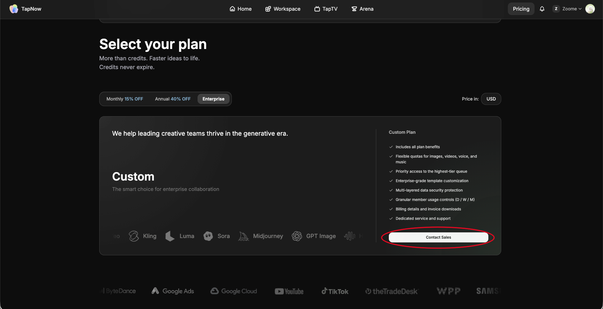

# 企业开具增值税发票

> 来源：https://docs.tapnow.ai/zh/docs/help-center/mainland-china-vat-invoices
> 抓取时间：2026-09-23 11:44（离线快照，原文见链接）

# 企业开具增值税发票

了解中国大陆企业如何通过 TapNow 国内代理商完成下单、付款和增值税发票开具，以及官网订单的开票限制。

适用于需要中国大陆地区增值税发票的企业用户。

如您需要中国大陆地区的增值税发票，可通过 TapNow 合作的国内代理商下单并支付，由代理商根据订单信息开具增值税发票。

---

### 如何开具增值税发票

如需开具中国大陆地区增值税发票，请登录****官网-价格页面-企业版-联系销售****。

填写表单后我们会安排中国大陆代理商与您对接。您可通过代理商完成下单、付款和开票流程。

请注意，代理商可能会有最低支付金额要求，例如 1000 美元起。同时，增值税金额需根据代理商要求另行加收，具体金额以代理商确认为准。

---

### 官网订单不支持开具增值税发票

通过 TapNow 官网直接支付的订单，暂不支持开具中国大陆增值税发票。

官网订单仅支持自助开具商业发票。商业发票可与银行支付回单一起作为企业财务入账、报销和留档的凭证材料。

已在官网支付完成的历史订单，也不支持补开增值税发票。

如您确定需要增值税发票，请务必在付款前联系 TapNow，并通过国内代理商完成下单和支付。

---

### 常见问题

#### TapNow 官网订单可以开具增值税发票吗？

暂不支持。TapNow 官网订单支持开具商业发票，但不支持开具中国大陆增值税发票。

#### 已经在官网支付的订单，可以补开增值税发票吗？

不支持。官网支付的历史订单无法补开中国大陆增值税发票。

#### 通过代理商下单会有额外费用吗？

可能会。

代理商可能有最低支付金额限制，1000 美元起。同时，开具增值税发票通常需要加收相应增值税，具体以代理商实际确认为准。

---

### 需要帮助？

如您需要中国大陆地区增值税发票，请发送邮件[enterprise@tapnow.ai](mailto:enterprise@tapnow.ai)联系我们。\
感谢您的支持与理解。

[上一页商业发票](/zh/docs/help-center/commercial-invoices)

[下一页查看站内信](/zh/docs/account/view-notifications)
