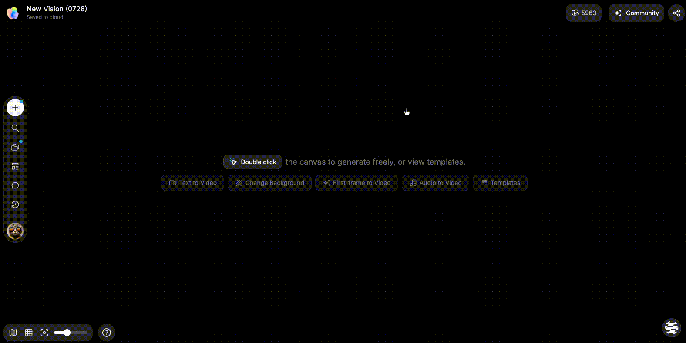

# 使用快捷键

> 来源：https://docs.tapnow.ai/zh/docs/account/use-shortcuts
> 抓取时间：2026-09-23 11:25（离线快照，原文见链接）

# 使用快捷键

使用画布、Agent 和播放列表的常用快捷键加快操作。

快捷键适合处理那些一天会重复几十次的动作：撤销、复制节点、移动画布、打开 Agent 和裁切片段。先记住与你当前工作最相关的几组，不需要一次背完。

Mac 使用 `⌘`，Windows 使用 `Ctrl`。同一个按键在文字输入、画布、播放列表和编辑器中可能有不同作用，使用前先看当前焦点在哪里。

## 先记住这组基础操作

| 操作 | Mac | Windows |
| --- | --- | --- |
| 撤销 | `⌘ Z` | `Ctrl Z` |
| 重做 | `⇧ ⌘ Z` | `Shift Ctrl Z` |
| 复制 | `⌘ C` | `Ctrl C` |
| 粘贴 | `⌘ V` | `Ctrl V` |
| 搜索节点 | `⌘ F` | `Ctrl F` |
| 删除 | `⌫` | `Del` |
| 多选 | `Shift` + 单击 | `Shift` + 单击 |

如果快捷键没有反应，先单击画布空白处再试一次。光标停在输入框里时，复制、粘贴和删除通常会作用于文字，而不是节点。

## 在画布和 Agent 之间移动

| 操作 | Mac | Windows |
| --- | --- | --- |
| 放大 | `⌘ +` | `Ctrl +` |
| 缩小 | `⌘ -` | `Ctrl -` |
| 拖动画布 | 按住 `⌘ Space` 并拖动 | 按住 `Ctrl Space` 并拖动 |
| 打开或关闭 Agent | `⌘ J` | `Ctrl J` |
| 指向编辑 | `⌘ I` | `Ctrl I` |
| 语音输入 | 长按 `V` | 长按 `V` |
| 完成语音输入 | `V` | `V` |

一套常用节奏是：用 `⌘ J` 或 `Ctrl J` 打开 Agent，提交任务后关闭面板，再用缩放和拖动画布检查结果。需要让 Agent 修改某个对象时，先选中对象，再使用指向编辑。

## 剪辑播放列表

| 操作 | 快捷键 |
| --- | --- |
| 在播放头处切割 | `C` |
| 向左裁切到播放头 | `Q` |
| 向右裁切到播放头 | `E` |

先把播放头放到准确位置，再使用 `C`、`Q` 或 `E`。操作后立即播放切点附近，确认画面和声音没有被多裁或少裁。

## 快捷键没有生效时

按下面顺序检查：

1. 单击要操作的画布、节点或时间线；
2. 确认没有正在输入文字或录制语音；
3. 切换到英文输入法后重试；
4. 检查浏览器或系统是否占用了相同组合键；
5. 刷新前先确认当前项目已经同步。

3D 世界和图片编辑器有各自的操作面板，请以对应界面中的快捷键帮助为准。

下一步：[故障排查](/zh/docs/account/troubleshoot-issues)

[上一页Creative OS 创作狂欢节](/zh/docs/account/creative-os-creation-festival)

[下一页排查故障](/zh/docs/account/troubleshoot-issues)
