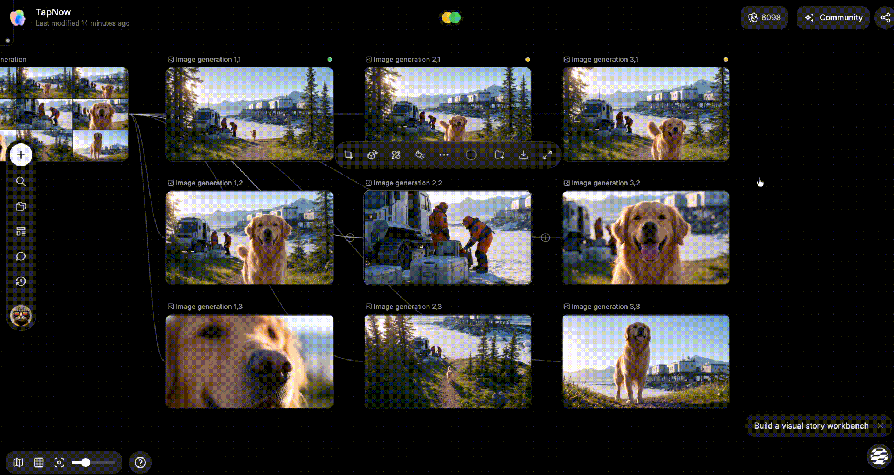
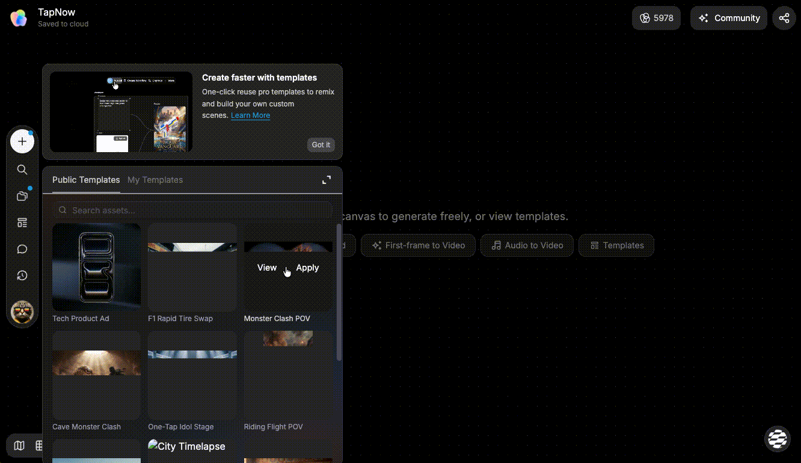
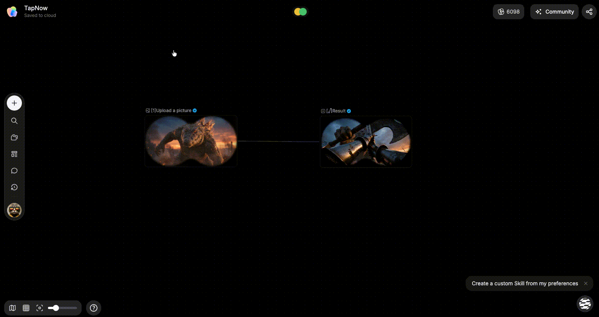

# 使用素材库与模板

> 来源：https://docs.tapnow.ai/zh/docs/canvas/use-library-and-templates
> 抓取时间：2026-09-23 11:41（离线快照，原文见链接）

# 使用素材库与模板

把常用素材保存到素材库，或把一组节点和连线保存成可以再次使用的模板。

有些内容会在不同画布中重复使用。例如产品图、角色设定、场景参考，或者一套固定的图片和视频制作步骤。

- ****素材库****保存以后还会使用的图片、视频、音频或节点；
- ****模板****保存一组节点、连线和画布结构。

两者都可以从画布左侧工具栏打开。

## 1. 把画布内容保存到素材库

1. 在画布上选中要保存的节点；
2. 在节点工具栏或右键菜单中选择 ****保存到素材库****；
3. 选择 ****个人**** 或 ****团队****；
4. 选择要保存到的文件夹；
5. 点击 ****保存****。

保存完成后，原节点仍然留在当前画布中，素材库里会多出一份可以再次使用的内容。

只有当前节点支持保存时，菜单中才会显示 ****保存到素材库****。正在生成或还没有可用文件的节点，需要等内容完成后再保存。

## 2. 从素材库放回画布

1. 点击画布左侧工具栏中的 ****素材库****；
2. 选择 ****个人**** 或 ****团队****；
3. 打开对应文件夹，或使用搜索找到素材；
4. 点击图片、视频或音频素材的内容区域，把它直接加入画布。

Creative OS 会把素材作为节点添加到当前画布，并保留素材本身的尺寸。点击文件夹会展开或收起内容；点击主体会打开编辑页。需要先检查素材时，打开预览，再选择 ****应用到画布****。加入画布后，可以连接到其他节点，也可以在 Agent 输入框中通过 `@` 引用。

## 3. 整理素材

素材库支持以下操作：

- 新建文件夹；
- 搜索素材；
- 上传本地文件；
- 重命名、移动或创建副本；
- 下载素材；
- 删除不再需要的内容。

个人素材只出现在自己的素材库中。需要让团队成员使用时，可以保存或发布到团队素材库。团队素材对当前团队成员可见，放入前请确认内容和使用权限。

## 4. 使用模板

模板适合重复使用一组节点和连线。例如一套分镜结构、一组广告图片尺寸，或固定的视频制作步骤。

1. 点击画布左侧工具栏中的 ****模板****；
2. 在 ****公共模板**** 或 ****我的模板**** 中查找需要的内容；
3. 可以先打开预览查看其中的节点；
4. 点击 ****应用****；
5. 模板中的节点和连线会作为一个节点组加入当前画布。

应用模板不会替换当前画布里的内容。它会在画布上新增一组节点，你可以移动、拆组或修改其中的 Prompt 和参数。

模板中的生成节点可能仍需要调用模型。执行这些节点时，会按照实际使用的模型和参数正常消耗 Tapies。

## 5. 执行一个节点组

1. 选中要一起运行的节点，并把它们打组；
2. 选中节点组，在工具栏中点击 ****整组执行****；
3. 在 ****运行整组？**** 窗口中查看预计 Tapies；
4. 点击确认开始执行，或取消后调整节点。

Creative OS 会尽量在确认窗口中给出预计 Tapies。估算暂时不可用时，仍可以自行决定是否继续。最终消耗以任务完成后的实际结算为准。

## 6. 创建自己的模板

当一组节点已经可以重复使用时：

1. 选中相关节点；
2. 把它们打组；
3. 选中这个节点组；
4. 在节点组工具栏中点击 ****创建模板****；
5. 填写名称和说明后保存。

保存后可以在 ****模板 > 我的模板**** 中找到它。以后应用这个模板时，Creative OS 会把其中的节点和连线复制到当前画布，不会修改原来的画布。

## 素材库和模板怎么选

| 你想再次使用什么 | 使用 |
| --- | --- |
| 一张产品图、一段视频或一份音频 | 素材库 |
| 同一个人物、产品或角色的一组参考资料 | 主体 |
| 一组节点、连线和制作步骤 | 模板 |
| 整张画布及其中的全部内容 | 分享并克隆画布 |

下一步：[创建和使用主体](https://docs.tapnow.ai/zh/docs/canvas/create-and-use-elements)

[上一页管理画布](https://docs.tapnow.ai/zh/docs/projects/manage-canvases)

[下一页创建和使用主体](https://docs.tapnow.ai/zh/docs/canvas/create-and-use-elements)
