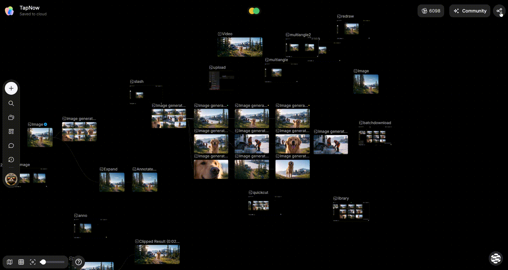
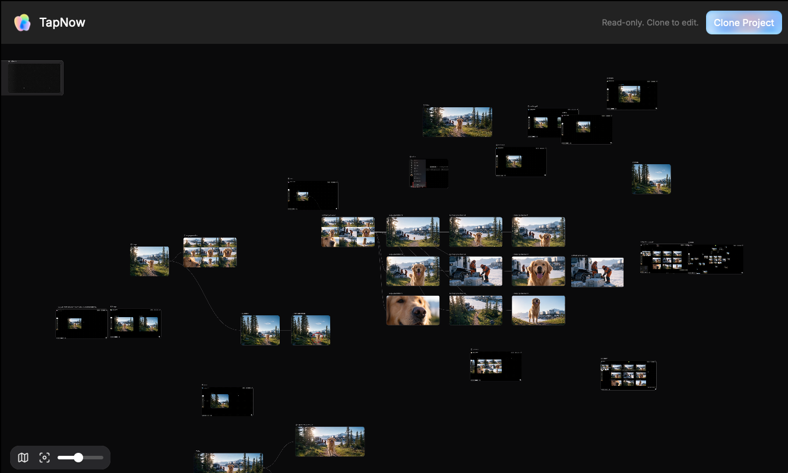

# 分享、查看与克隆

> 来源：https://docs.tapnow.ai/zh/docs/projects/share-view-and-clone
> 抓取时间：2026-09-23 11:41（离线快照，原文见链接）

# 分享、查看与克隆

复制画布分享链接，让其他人查看内容，或克隆一份到自己的空间继续编辑。

需要把画布发给客户、同事或其他创作者时，可以直接创建分享链接。收到链接的人可以查看画布，也可以把它克隆到自己的空间继续编辑。

## 1. 创建分享链接

1. 打开要分享的画布；
2. 点击右上角的 ****分享****；
3. 找到 ****通过链接分享****；
4. 点击 ****分享****；
5. 链接复制完成后，把它发送给对方。

也可以在画布首页打开画布卡片的 `···` 菜单，选择 ****分享链接****。

任何拿到链接的人都可以打开这张画布。发送前请检查画布中是否包含客户资料、个人信息或不应公开的内容。

## 2. 对方会看到什么

分享链接打开的是只读画布。对方可以：

- 查看画布上的节点和连线；
- 移动画布并缩放；
- 打开图片、视频、音频和其他可预览内容；
- 在电脑上点击 ****解读创作思路****，让 Agent 讲解节点和连线；
- 点击 ****克隆画布****，复制一份到自己的空间。

只读页面不能直接修改你的原画布。需要让团队成员一起编辑同一张画布时，请把画布移动到团队空间，而不是只发送分享链接。

## 3. 分享前整理一下画布

对方打开链接时，会看到你分享时画布上的全部可见内容。发送前可以做三件事：

1. 把希望对方先看的结果放在容易找到的位置；
2. 给关键节点起一个能看懂的名称；
3. 删除或移走不适合分享的资料。

如果只需要对方看一组视频，可以先把视频放入播放列表；如果只需要交付最终文件，也可以直接下载或导出，不必分享整张画布。

## 4. 克隆画布

收到分享链接的人点击 ****克隆画布**** 后，Creative OS 会在对方的个人空间创建一张新画布。

克隆后的画布：

- 可以正常编辑和继续生成；
- 不会修改你的原画布；
- 不会自动跟随原画布之后的更新；
- 运行新的图片、视频或音频生成时，会使用克隆者所在空间的 Tapies。

如果对方没有登录，页面会先提示登录，登录完成后继续克隆。

## 让 Agent 解读共享画布

在电脑上打开只读分享页，点击 ****解读创作思路****。登录后，TapNow 会先把画布克隆到你的个人空间，再打开可编辑副本。Agent 会根据画布上的节点和连线开始说明这份内容是怎样做出来的，你也可以继续追问或修改副本。

这项操作不会修改原画布，预计消耗 40–150 Tapies。手机端暂不显示该入口；如果只想查看内容，不需要使用解读功能。

## 分享链接和团队画布怎么选

| 你的目的 | 使用 |
| --- | --- |
| 让对方查看画布 | 分享链接 |
| 让对方复制一份自行修改 | 分享链接并克隆 |
| 和团队成员编辑同一张画布 | 移动到团队空间 |
| 只发送最终图片、视频或音频 | 下载或导出文件 |

下一步：[和团队一起创作](/zh/docs/projects/create-with-your-team)

[上一页创建和使用主体](/zh/docs/canvas/create-and-use-elements)

[下一页和团队一起创作](/zh/docs/projects/create-with-your-team)
