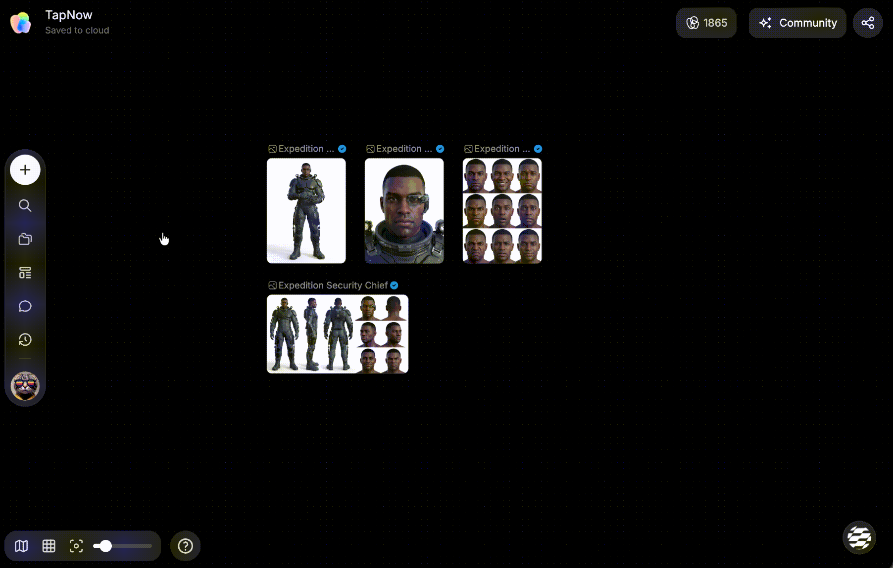
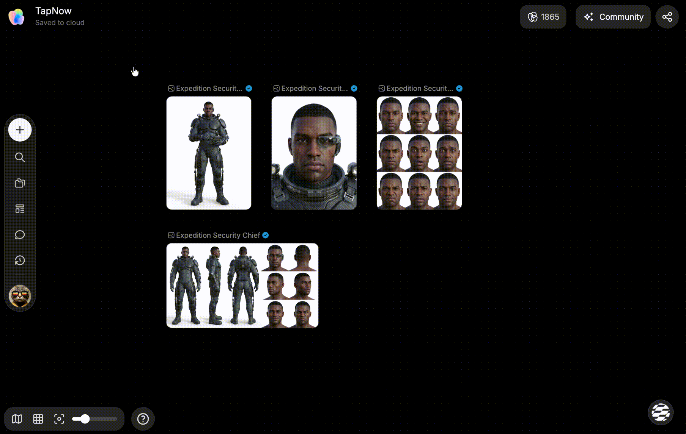
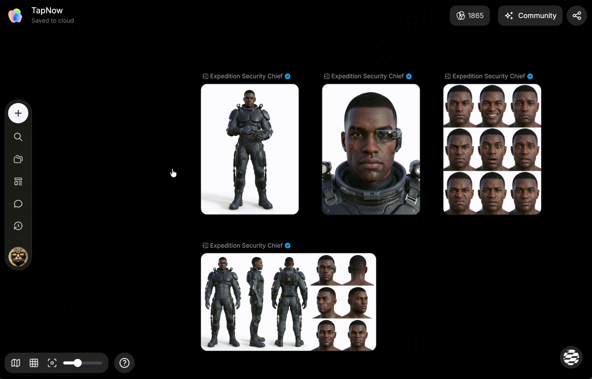
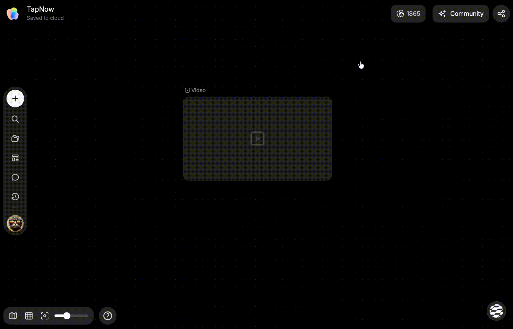

# 创建和使用主体

> 来源：https://docs.tapnow.ai/zh/docs/canvas/create-and-use-elements
> 抓取时间：2026-09-23 11:41（离线快照，原文见链接）

# 创建和使用主体

把同一个人物、产品或角色的图片、视频、音频和文字参考整理成主体，并在视频节点中直接引用。

如果同一个人物、产品或角色会反复出现在不同镜头里，可以先把相关参考资料整理成一个****主体****。以后生成视频时，选择这个主体即可，不需要每次重新添加多份素材。

主体可以包含名称、描述以及图片、视频、音频或文本参考。它保存的是这些资料的组合和使用方式，不会替代或删除素材库中的原始文件。

## 主体、素材和模板有什么不同

| 你想重复使用什么 | 使用 |
| --- | --- |
| 一张图片、一段视频或一份音频 | 素材库 |
| 同一个人物、产品或角色的一组参考资料 | 主体 |
| 一组节点、连线和制作步骤 | 模板 |

例如，可以为“男主角”“香水瓶”或“品牌吉祥物”分别创建主体，并补充模型需要保持一致的外观、服装、材质或包装信息。

## 1. 打开主体库

1. 在画布左侧工具栏打开 ****素材库****；
2. 切换到 ****主体库****；
3. 选择 ****个人**** 或 ****团队**** 空间；
4. 在列表中选择已有主体，或点击 ****新建主体****。

个人主体只有自己可以管理。需要和团队一起使用时，可以把主体复制或移动到团队空间。

## 2. 新建主体

1. 点击 ****新建主体****；
2. 输入容易识别的名称，例如“男主角”或“香水产品”；
3. 在主体描述中写清模型需要理解和保持的特征；
4. 使用 ****从画布选择**** 或 ****本地上传**** 添加参考资料；
5. 检查素材顺序，然后点击 ****完成****。

从画布添加时，可以先选中支持的图片、视频、音频或文本节点，也可以进入 ****从画布选择**** 后单选或框选节点。完成选择后返回编辑器。点击 ****完成**** 后，主体会出现在当前 ****个人**** 或 ****团队**** 空间的列表中。

你也可以先只填写名称和描述，保存一个空主体，之后再补充素材。实际可以添加的类型和数量以编辑器中的提示为准。

## 3. 管理已有主体

在主体列表中可以：

- 改名或编辑主体描述；
- 添加、移除或调整参考资料顺序；
- 预览单个或多个素材；
- 复制到团队或移动到团队；
- 删除不再使用的主体。

删除主体不会删除素材库中的原始文件。移动到团队前，请确认团队成员可以查看和使用其中的资料。

## 4. 在视频节点中使用主体

1. 新建或选中一个视频生成节点；
2. 选择 Seedance 2 系列、Seedance 2.5 或 MiniMax H3，并切换到 ****参考**** 模式；
3. 点击提示词或参考素材区域旁的 ****添加主体**** 按钮；也可以在提示词中输入 `@`；
4. 在 ****个人**** 或 ****团队**** 中选择需要的主体；
5. 点击 ****完成****，确认主体引用已经出现在提示词中；
6. 在提示词中写清主体要做什么、出现在哪里，以及镜头如何运动；
7. 检查模型和生成参数后开始生成。

使用 @香水产品 生成一段 5 秒横版视频。保持瓶身形状、标签和颜色不变。把产品放在夜晚的露营桌上，背景灯光轻微闪烁，镜头缓慢推进。

复制

选择主体后，Creative OS 会把主体中的可用参考资料一并交给模型。提示词仍然需要说明动作、环境和镜头要求。

## 5. 使用前检查

- 当前主体引用支持 ****Seedance 2 系列、Seedance 2.5 和 MiniMax H3****；
- 需要使用 ****参考**** 模式，多镜头模式暂不支持主体引用；
- MiniMax H3 一次最多支持 9 张图片、3 段视频和 3 段音频；其他模型以选择器中的上限提示为准；
- MiniMax H3 的每段参考视频需为 2–15 秒，全部参考视频合计不能超过 15 秒；
- 只有音频的主体不能单独用于生成，至少需要一张图片或一段视频；
- 如果提示主体引用失效，请移除后重新选择；
- 如果主体素材仍在加载，请等待加载完成后再次生成。

某个模型或模式中没有显示 ****添加主体**** 时，表示当前配置暂不支持主体引用。

下一步：[生成和编辑视频](/zh/docs/canvas/generate-and-edit-video)

[上一页使用素材库与模板](/zh/docs/canvas/use-library-and-templates)

[下一页分享、查看与克隆](/zh/docs/projects/share-view-and-clone)
