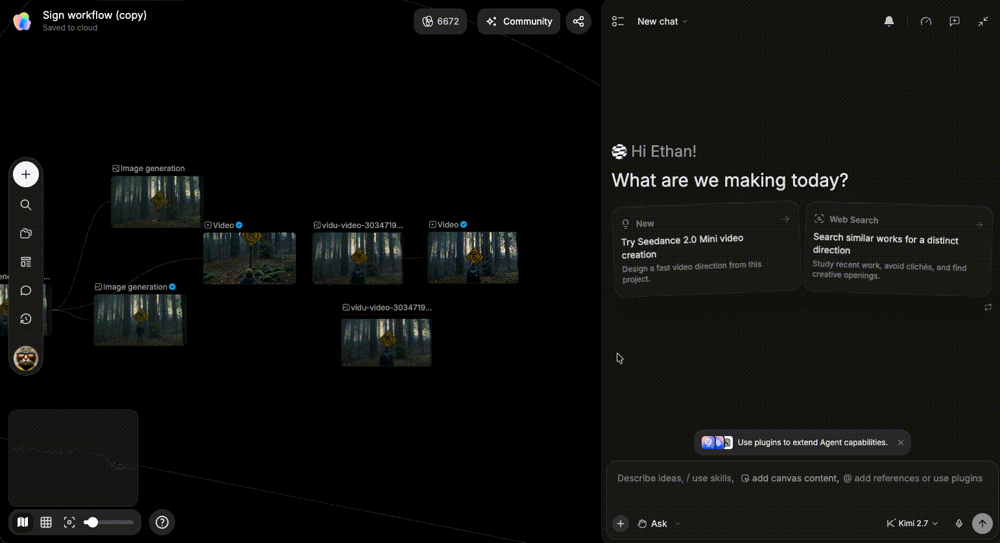
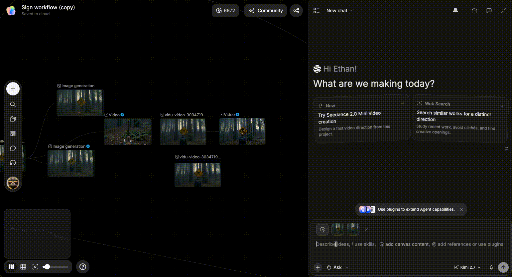
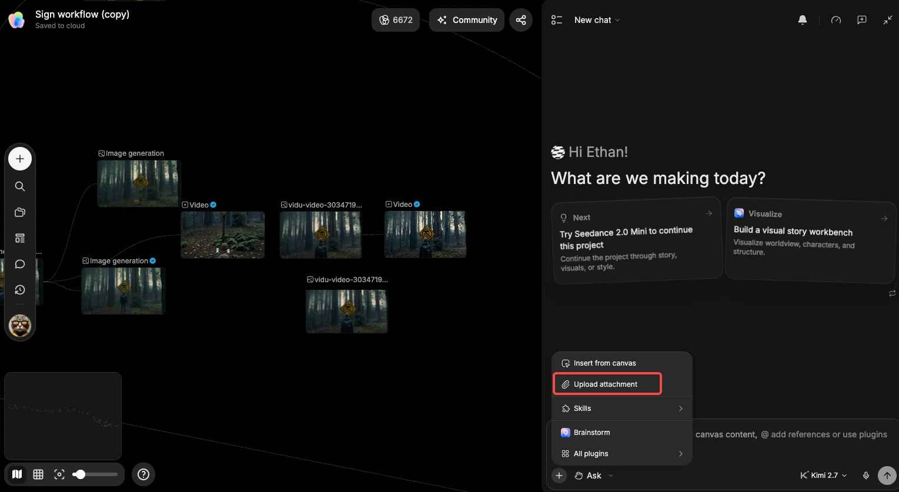

# 和 Agent 对话

> 来源：https://docs.tapnow.ai/zh/docs/agent/chat-with-agent
> 抓取时间：2026-09-23 11:41（离线快照，原文见链接）

# 和 Agent 对话

打开 Agent，输入并发送任务，引用画布内容、上传附件，并保存常用生成偏好。

在画布上打开 Agent，写下要做的事，再把需要的图片或文件交给它。指令不需要套固定模板。先说清动作，再补充参考、输出规格和确认节点即可。

## 1. 打开 Agent

你可以用两种方式打开或收起 Agent：

- 在 Mac 上按 `⌘ J`，在 Windows 上按 `Ctrl J`；
- 点击画布右下角的 Agent 图标。

打开后，点击底部输入框即可开始。

## 选择模型和思考等级

发送第一条消息前，打开输入区旁的模型菜单。菜单会显示模型说明；支持思考等级的模型还可以选择 ****Off****、****Light****、****Standard**** 或 ****Heavy****。等级越高，Agent 通常会花更多时间处理复杂任务；简单整理或改写不需要一直使用最高等级。

第一条消息发出后，这段对话使用的模型会锁定。思考等级仍可从旁边的控件调整；需要换模型时，请新建一段对话。

## 2. 输入并发送

直接用自然语言描述任务。输入完成后：

- 按 `Enter` 发送；
- 按 `Shift + Enter` 换行；
- 也可以点击输入框右侧的发送按钮。

一条容易执行的指令通常包含四项：

1. ****动作****：希望 Agent 做什么；
2. ****参考****：需要使用哪张图或哪个文件；
3. ****输出****：数量、比例、时长或格式；
4. ****边界****：哪些内容要保留，是否需要先等你确认。

复制这个指令给 TapNow Agent 试试

复制

为一款户外音箱制作两张 16:9 露营广告图。画面是夜间营地，只有两个人，音箱自然放在桌面上。保留产品外观和 Logo，先直接生成 2 张。

不用在第一条消息里写完所有细节。Agent 返回结果后，可以继续补充：“保留构图，只把人物减少到两人”或“第二张方向更好，再做两个变体”。

如果只需要分析，可以直接写“先分析，不要生成”。如果已经准备制作，就写清要生成什么，以及是否需要先确认。

## 一次回答多个确认问题

当 Agent 还缺少多项关键信息时，问题会集中显示在输入框上方。你可以逐题回答，最多一次处理 4 个问题：

1. 先回答当前显示的问题；
2. 点击 ****下一题****，继续补充其余信息；
3. 检查全部回答后点击 ****提交****；
4. 提交后，在对话中查看这组回答的摘要。

这样可以一次补齐画面方向、输出规格和其他边界，不需要在多轮消息中来回确认。如果某项回答需要修改，直接在下一条消息中说明新的要求即可。

## 3. 引用画布中的图片

输入框中的 `@` 不只可以引用图片，还可以选择画布节点、素材库资产、主体和文件夹。下面以图片为例介绍两种常用方式。

### 轻量引用：加入本轮上下文

点击输入框旁的 `+`，选择“从画布中选择”。当前已经选中的图片会先加入输入区，你也可以继续在画布上点击其他图片。加入后的内容会显示在输入框上方。

这种方式适合快速告诉 Agent：“这轮任务会用到这些内容。”图片已经在上下文里时，不需要逐张写进指令。

### 精确引用：在指令中使用 `@`

当几张图片有不同作用时，先把它们加入上下文，再在输入框中输入 `@`，选择具体图片。这样可以直接说明哪张图负责产品外观，哪张图只提供风格。

复制这个指令给 TapNow Agent 试试

复制

使用 @产品正面图 保持包装结构、Logo 和文字；@露营参考 只参考夜间光线和色调。制作两张 16:9 广告图，不要复制参考图里的人物。

发送前看一眼输入框上方的引用内容。缺少的图片先补进来，不需要的旧参考可以移除。

## 4. 上传文件

资料不在画布上时，点击输入框旁的 `+`，选择“上传附件”，再从电脑中选择文件。上传完成后，附件会显示在输入区上方。

在指令里顺手说明文件的用途，比只上传文件更准确。

复制这个指令给 TapNow Agent 试试

复制

读取刚上传的客户 Brief 和产品图。先列出必须保留的卖点、交付规格和仍需确认的问题，再写一版 4 镜头脚本。先不要生成图片或视频。

长文档可以先让 Agent 做一次简短整理。确认它读到的是正确版本后，再继续生成。

## 让 Agent 整理本地文件夹

这项能力仅在 TapNow Desktop 中提供。告诉 Agent 要怎样整理本地文件夹，再按提示选择并授权目标文件夹。Agent 可以在授权范围内创建子文件夹、移动文件或重命名文件。

执行前，确认卡片会列出整批操作。检查路径和名称后一次确认，Agent 才会开始处理。它不会操作授权文件夹以外的内容，也不会覆盖已有文件；任一步失败时，会撤回这批操作中已经完成的更改。

## 5. 让 Agent 记住常用偏好

对于长期都会使用的生成习惯，可以直接告诉 Agent“请记住”。Agent 会在后续对话中继续参考这些偏好，例如常用模型、画面比例、每次数量和确认方式。

某次任务有特殊要求时，直接在当次指令里覆盖默认偏好即可。

复制这个指令给 TapNow Agent 试试

复制

请记住我的默认生图设置：使用 Seedream 5.0，画面比例 16:9，每次生成 2 张。如果我在某次任务中指定了其他模型、比例或数量，以当次指令为准。

复制这个指令给 TapNow Agent 试试

复制

请记住我的视频制作偏好：默认使用 9:16。先给我镜头方案和模型选择，等我确认后再生成。

复制这个指令给 TapNow Agent 试试

复制

请记住：只要任务中有产品参考图，包装结构、Logo 和文字都要以参考图为准。不确定时先问我。

偏好发生变化时，可以直接说：“把我的默认比例改为 1:1”或“以后不需要先确认镜头，直接生成。”

## 发送前快速检查

- Agent 已经知道这次要完成什么；
- 需要使用的图片和附件都显示在输入区；
- 数量、比例、时长等输出要求已经写清；
- 必须保留的内容和确认节点没有歧义。

下一步：[选择生成模式](/zh/docs/agent/choose-a-generation-mode)

[上一页认识 TapNow Agent](/zh/docs/agent/tapnow-agent)

[下一页选择生成模式](/zh/docs/agent/choose-a-generation-mode)
