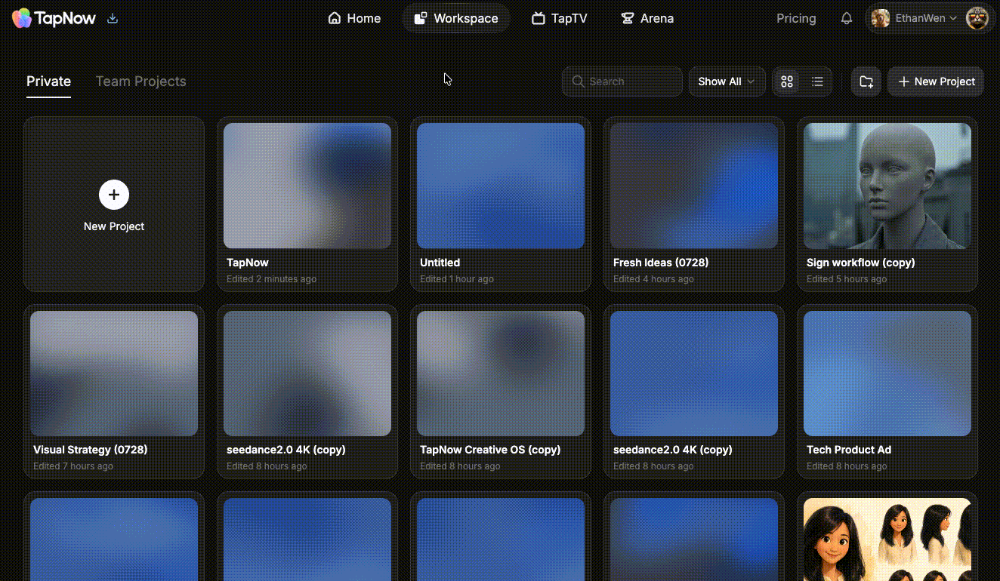
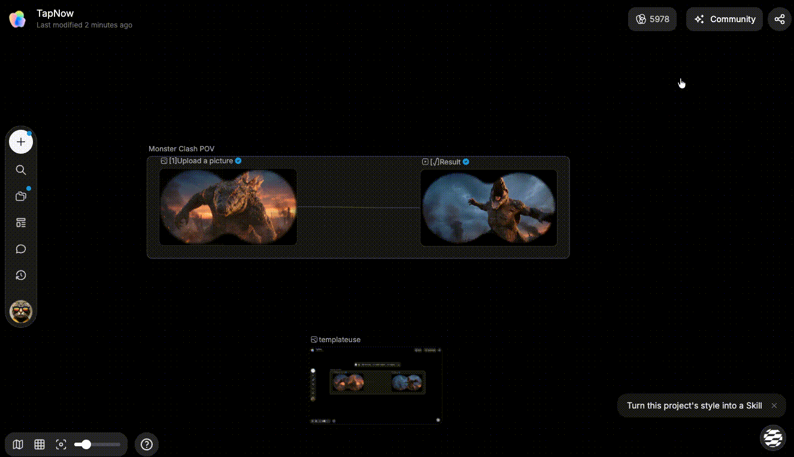

# 和团队一起创作

> 来源：https://docs.tapnow.ai/zh/docs/projects/create-with-your-team
> 抓取时间：2026-09-23 11:41（离线快照，原文见链接）

# 和团队一起创作

把个人画布移到团队空间，和其他成员同时查看、编辑并跟随彼此的位置。

把个人画布移到团队空间后，团队成员可以打开同一张画布。大家看到的是同一批节点、连线和 Agent 产物，修改也会同步到这张画布中。

## 1. 把画布移到团队

1. 在画布首页打开 ****个人画布****；
2. 找到要协作的画布；
3. 点击画布卡片上的 `···`，选择 ****移动至团队****；
4. 确认目标团队并点击 ****移动到团队****；
5. 切换到 ****团队画布****，打开刚刚移动的画布。

也可以在画布右上角打开 ****分享****，选择 ****移动到团队****。

移动完成后，当前团队的成员都可以编辑这张画布。如果画布包含不应让整个团队查看的资料，请先移除这些内容。

## 2. 查看谁正在画布中

多人打开同一张团队画布时，页面会显示当前在线成员。

点击成员头像可以打开协作人员列表。列表中会显示：

- 当前正在查看画布的人；
- 你自己；
- 可以跟随的其他成员。

成员进入或离开画布时，列表会自动更新。

## 3. 跟随团队成员

画布较大时，可以跟随正在讲解或操作的成员：

1. 打开协作人员列表；
2. 找到要查看的成员；
3. 点击 ****跟随****；
4. 你的画布视角会移动到对方正在查看的位置；
5. 点击 ****停止****，返回自由浏览。

需要带大家一起看某个区域时，可以使用 ****聚焦我****。其他成员接受邀请后，会跟随你的画布视角。

跟随只会同步画布视角，不会替你选中、移动或修改节点。

## 4. 同时编辑时会发生什么

成员移动节点、修改文字或添加内容后，其他在线成员会看到更新。页面顶部的保存状态会显示 ****保存中…**** 或 ****已保存到云端****。

连接中断时，Creative OS 会尝试重新加入协作。页面显示 ****正在重新连接…**** 时，先暂停编辑；恢复并显示已保存后再继续操作。

## 5. 把画布移回个人

只有画布创建者可以更改团队共享状态。

在画布右上角打开 ****分享****，选择 ****移回个人****。确认后，画布会回到个人画布列表，原团队成员将无法继续访问。

下一步：[评论并反馈问题](/zh/docs/projects/comment-and-send-feedback)

[上一页分享、查看与克隆](/zh/docs/projects/share-view-and-clone)

[下一页评论并反馈问题](/zh/docs/projects/comment-and-send-feedback)
