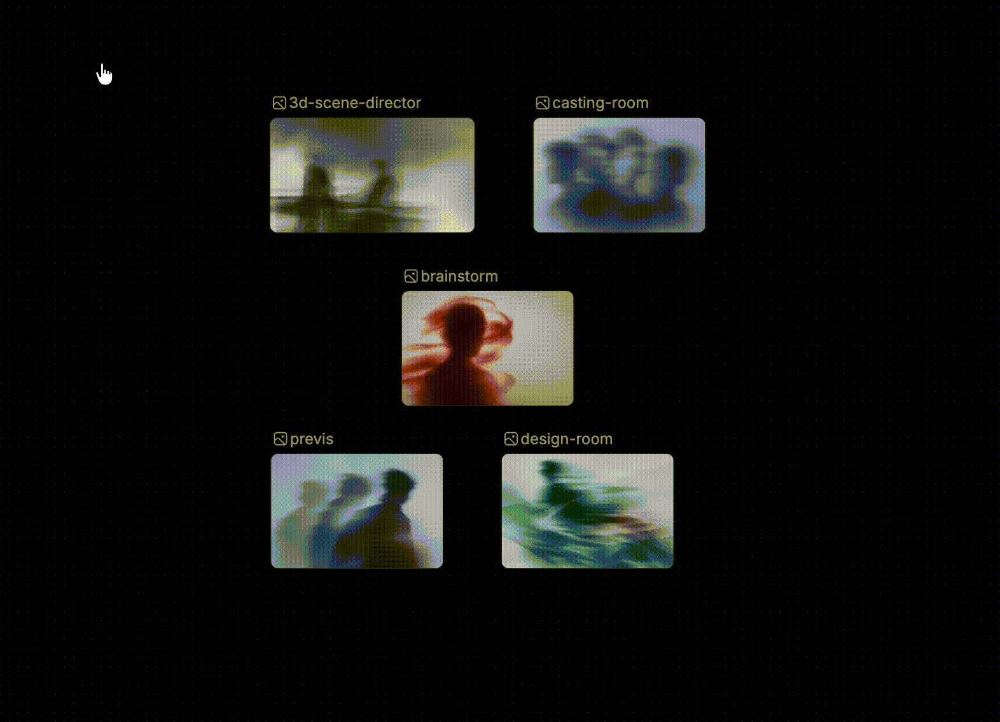

# 堆叠节点

> 来源：https://docs.tapnow.ai/zh/docs/canvas/stack-nodes
> 抓取时间：2026-09-23 11:41（离线快照，原文见链接）

# 堆叠节点

把画布上的多个图片、视频、音频和文字节点收进一叠，展开查看、取回单个节点，或对整叠内容一次性操作。

一次生成十几张图片后，画布很快会被同类内容占满。堆叠可以把这些节点收进一叠，只占一个节点的位置；需要看的时候展开，需要用的时候再取回画布。

堆叠只改变节点的摆放方式，不会改变节点内容，也不会重新生成。

## 1. 把多个节点堆成一叠

1. 按住 `Shift` 依次单击要收起的节点，或从画布空白处拖出选框；
2. 至少选中两个图片、视频、音频或文字节点；
3. 在选区上方的工具栏中点击****堆叠****；
4. 选中的节点会收拢到同一个位置，显示为一叠，并标出里面的节点数量。

一叠最多放 50 个节点。选区里已经有一叠时，它会和其余节点合并成同一叠。分组只作为容器，不会被收进去；选区里出现图片、视频、音频、文字以外的节点时，****堆叠****不会出现。

## 2. 打开一叠查看里面的内容

单击这一叠，画布上会展开一个画廊，按顺序显示里面的全部节点。

按 `Esc` 或点击画廊以外的区域，可以收回原来的一叠。

## 3. 往一叠里继续添加内容

把画布上的一个节点拖到这一叠上方再松开，它就会加入这一叠。把另一叠拖到这一叠上，两叠会合并成一叠。

## 4. 把节点取回画布

需要单独使用其中一个节点时：

1. 单击这一叠，展开画廊；
2. 把要用的节点从画廊拖到画布上；
3. 松开鼠标，该节点回到画布，其余节点仍留在这一叠里。

如果取出后只剩一个节点，这一叠会自动解散，最后一个节点直接留在画布上。

需要一次全部取回时，把鼠标移到这一叠上，在出现的工具栏中点击****取消堆叠****。里面的节点会重新排列到画布上，这一叠随之消失。

## 5. 对整叠内容一次性操作

把鼠标移到一叠上，工具栏会显示可用的操作：

- ****加入对话****：把里面的图片、视频和音频送进 Agent 对话作为引用，文字节点不会进入对话；
- ****保存到素材库****：选择目录后，把里面的内容存进素材库；
- ****下载全部****：把里面可下载的源文件一次保存到电脑。

这些操作不会改变这一叠的成员。

## 6. 再次生成时结果放在哪里

在已经有结果的图片、视频或文字节点上再次点击生成，原来的结果会保留，新结果放进新建的节点，不会覆盖原节点。新节点沿用原节点的输入连线，生成次数默认为一次。音频节点仍然直接在原节点上更新。

一次产生多个结果时，这些新节点可以堆成一叠，也可以在画布上铺开：

1. 打开****画布设置****；
2. 找到****批量生成结果****；
3. 选择****堆叠****或****铺开****，默认是****铺开****。

这项设置只影响之后的生成结果，已经在画布上的节点不会被重新排列。

## 7. 删除一叠之前先确认

删除一叠时，里面的全部节点和它们的连线会一起删除，不只是删掉外层这一叠。只想把内容收起来时使用****堆叠****，只想重新摊开时使用****取消堆叠****；确认不再需要这些内容，再删除。

[上一页整理画布内容](https://docs.tapnow.ai/zh/docs/canvas/organize-your-canvas)

[下一页管理画布](https://docs.tapnow.ai/zh/docs/projects/manage-canvases)
