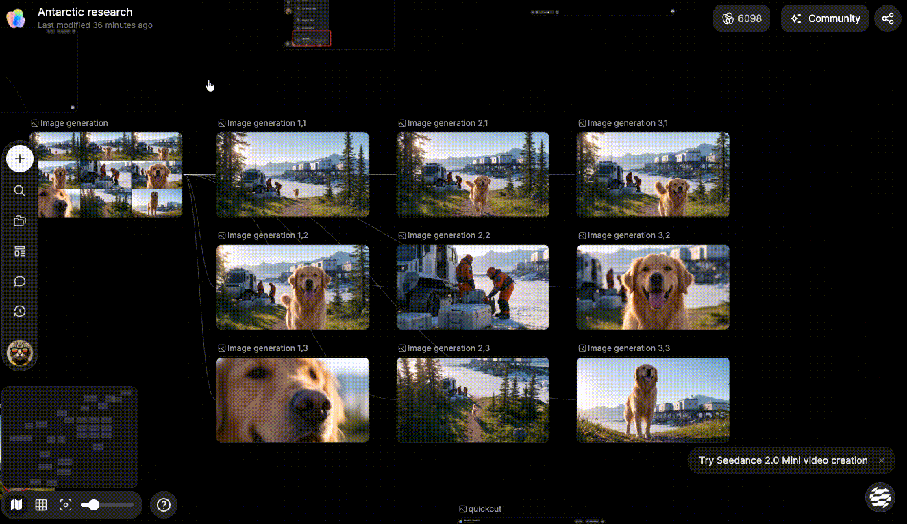

# 批量下载

> 来源：https://docs.tapnow.ai/zh/docs/canvas/download-in-batches
> 抓取时间：2026-09-23 11:41（离线快照，原文见链接）

# 批量下载

一次选择多张图片、多个视频或音频节点，并把源文件批量下载到电脑。

画布上有多张图片、多个视频或音频需要保存时，可以一次选中并批量下载，不需要逐个打开节点。

批量下载会读取节点当前显示的源文件。选择多个不同文件时，Creative OS 会把它们打包后下载；如果最终只有一个可下载文件，则会直接下载该文件。

## 1. 选择要下载的节点

可以使用下面两种方式：

- 按住 `Shift`，依次单击要下载的节点；
- 从画布空白处拖出选框，把需要的节点框在一起。

至少选择两个节点后，选区上方会出现批量操作工具栏。当前选择中存在可下载的图片、视频或音频时，工具栏会显示批量下载按钮。

## 2. 开始批量下载

1. 同时选中需要保存的图片、视频或音频节点；
2. 在选区上方的工具栏中找到下载图标；
3. 点击批量下载；
4. 在传输面板中查看打包和下载进度；
5. 下载完成后，在电脑的下载目录中打开文件。

下载按钮进入加载状态后，等待当前任务完成。重复点击不会创建第二个相同的下载任务。

## 3. 哪些内容会被下载

批量下载支持已经有源文件的：

- 图片节点；
- 视频节点；
- 音频节点。

文字节点、空节点和仍在生成中的节点没有可下载文件，会被自动跳过。一次选择中既有媒体节点又有文字节点时，只会下载可用的媒体文件。

如果多个节点使用的是同一个源文件，Creative OS 只会下载一次，避免压缩包里出现重复文件。

## 4. 下载一组内容

已经把一批内容放进同一个分组时，可以直接从分组下载：

1. 单击分组；
2. 在分组工具栏中找到下载图标；
3. 点击后等待传输完成。

分组下载会读取当前分组第一层中的图片、视频和音频。嵌套在其他分组里的内容不会一起下载；需要这些文件时，请进入对应分组单独下载，或先把节点移到当前分组。

## 5. 没有看到下载按钮

依次检查：

1. 是否至少选中了两个节点；
2. 选中的节点中是否包含图片、视频或音频；
3. 媒体节点是否已经生成或上传完成；
4. 节点当前是否能正常预览或播放；
5. 当前页面是否仍有正在进行的下载任务。

只需要下载一个文件时，可以打开对应节点，使用节点自身的下载入口。

下一步：[整理画布内容](/zh/docs/canvas/organize-your-canvas)

[上一页使用播放列表](/zh/docs/canvas/use-playlists)

[下一页整理画布内容](/zh/docs/canvas/organize-your-canvas)
