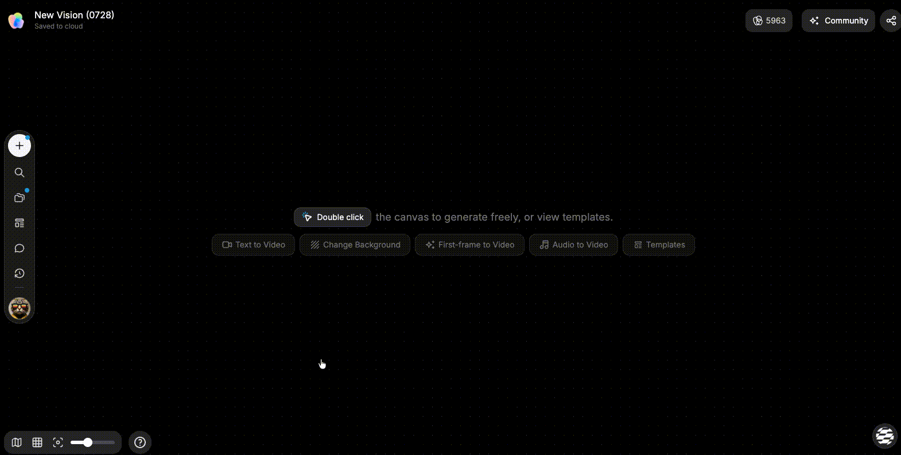

# 排查故障

> 来源：https://docs.tapnow.ai/zh/docs/account/troubleshoot-issues
> 抓取时间：2026-09-23 11:25（离线快照，原文见链接）

# 排查故障

按生成、保存、分享和支付场景排查问题，并提交可复现的反馈。

生成失败、文件传不上去或画布没有同步时，最重要的是先保留现场。错误提示、发生时间、项目链接和失败节点能帮助我们判断问题发生在哪一步；连续刷新和重复提交反而可能把线索覆盖掉。

## 前两分钟先做这些

1. 截图或复制完整错误提示；
2. 记下发生时间和你刚执行的操作；
3. 保存项目链接、相关节点或任务名称；
4. 查看网络是否稳定、Tapies 是否充足；
5. 只重试一次，并观察错误是否相同。

如果项目仍能打开，先不要删除失败节点。它包含输入、参数和任务状态，通常比一句“生成失败了”更容易定位问题。

## 确认浏览器和设备

请使用桌面端最新版浏览器。当前产品提示的最低版本为：

- Chrome 111 或更高；
- Edge 111 或更高；
- Firefox 115 或更高；
- Safari 16.4 或更高。

完整创作暂不支持移动设备。浏览器插件、严格隐私设置或公司网络策略也可能影响上传、支付和实时连接。

如果页面行为异常，可以在无痕窗口打开同一项目。无痕窗口正常时，问题通常与浏览器插件、缓存或隐私设置有关。

## 下载或更新 TapNow Desktop

TapNow 全球站下载页提供 Apple 芯片版 macOS 安装包和 Windows 64 位安装包。Windows 用户选择 ****下载 Windows 版****；中国区暂不提供 TapNow Desktop。

已经安装 Desktop 后，可以在应用设置中点击 ****点击检查更新****。发现新版本时，应用会先下载更新，再显示 ****立即更新**** 或 ****重启并更新****。更新前先保存当前画布；如果下载中断，保持应用打开并重新检查一次，不要连续重复启动安装。

## 生成任务失败

1. 查看具体错误和任务状态；
2. 检查 Tapies 与网络；
3. 确认输入文件仍可访问；
4. 缩短时长、减少数量或移除无关参考；
5. 换用当前可用模型；
6. 稍后重试一次，不要连续重复提交。

如果只在某个模型或某类输入上失败，保留可复现的最小任务：一个输入、一个模型和一组参数。这样更容易区分素材、模型和网络问题。

## 画布没有保存或同步

- 保持页面打开并等待重新连接；
- 不要同时在多个标签页编辑同一项目；
- 恢复后检查最新节点、连接和播放列表；
- 查看历史记录是否有可恢复版本。

重新连接后不要只看页面是否恢复，还要检查最近创建的节点、连接、播放列表顺序和文字修改是否都在。

## 上传失败

- 检查格式和大小是否符合当前入口提示；
- 使用简单的英文或数字文件名重试；
- 确认文件没有损坏；
- 切换稳定网络后重新上传。

同一个文件持续失败时，可以先用本地应用打开并重新导出，再上传一个体积更小的测试文件。测试文件成功，通常说明需要继续检查原文件的编码、格式或大小。

## App 无法读取或同步资料

1. 确认当前项目使用的是正确团队和账户；
2. 检查 App 是否仍处于已授权状态；
3. 确认授权范围包含目标文档、频道或文件；
4. 明确告诉 Agent 要读取的来源和时间范围；
5. 如果资料刚更新，重新读取后再继续任务。

授权成功不代表 Agent 能访问整个工作空间。公司管理员、文档权限和频道设置仍会限制可见范围。

## 分享或发布失败

- 先在无痕窗口测试分享链接；
- 确认原项目仍存在；
- 发布时检查视频、封面、名称和必要字幕；
- 等待审核或字幕处理完成；
- Arena 投稿另需满足活动状态、时长、赛道和次数要求。

无痕窗口能打开，说明外部访问通常正常；只有项目成员能打开，说明还需要检查分享范围或发布状态。

## 支付状态异常

不要连续重复支付。等待几分钟后查看权益和账单，保留订单、交易时间、金额和支付状态。

## 把问题写成可复现步骤

在画布的反馈入口中写清：

- 当时正在做什么；
- 期望发生什么；
- 实际发生什么；
- 是否可以稳定复现；
- 可选截图和当前画布链接。

提交前先查看界面已经自动附带哪些信息；项目链接、失败节点、错误提示和发生时间如果未显示，请手动补充。

一份有效反馈可以这样写：

> 7 月 27 日 15:20，在项目「香水广告」中选中产品图，使用图片生成时失败。重试一次仍显示同一错误。项目链接、失败节点和完整截图见附件；更换网络后问题仍可复现。

## 联系支持

仍需帮助时，发送邮件至 [contact@tamaredge.ai](mailto:contact@tamaredge.ai)。请附上：

- 账户标识；
- 项目链接和相关节点；
- 发生时间；
- 完整错误截图；
- 已经尝试的步骤。

不要发送密码、密钥或完整支付卡信息。涉及支付时，只提供订单号、金额、时间和界面显示的状态。

[上一页使用快捷键](https://docs.tapnow.ai/zh/docs/account/use-shortcuts)
