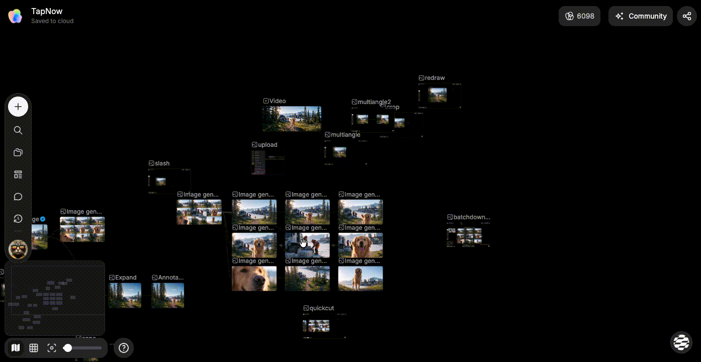

# 整理画布内容

> 来源：https://docs.tapnow.ai/zh/docs/canvas/organize-your-canvas
> 抓取时间：2026-09-23 11:41（离线快照，原文见链接）

# 整理画布内容

使用历史记录、Pin 颜色标记和节点搜索，找回生成内容并快速定位画布节点。

画布上的内容越来越多时，可以使用三个工具进行整理：

- 从历史记录中搜索并找回生成过的图片、视频、音频和 3D 内容；
- 用 Pin 给重要节点标记颜色；
- 通过节点搜索直接跳到目标节点。

这三个工具不会改变节点之间的连线，也不会自动删除画布内容。

## 1. 从历史记录找回生成内容

Creative OS 会在历史记录中保留你生成过的图片、视频、音频和 3D 内容。即使某个生成节点已经从画布上删除，也可以从这里重新放回画布。

1. 点击画布左侧工具栏中的 ****历史****；
2. 在顶部选择 ****图片****、****视频****、****音频**** 或 ****3D****，也可以在搜索框中输入关键词；
3. 需要按项目缩小范围时，先点击右上角的 ****展开****，再选择 ****所有项目**** 或 ****当前项目****；
4. 点击一项内容，Creative OS 会在当前画面中间创建并选中一个新节点。3D 记录缺少可恢复的模型文件时不会创建节点，页面会显示提示。

重新放回画布的节点会保留当时的生成内容和可用参数，可以继续移动、连接或作为下一次生成的参考。

### 一次放回或下载多项内容

1. 在历史记录顶部点击 ****选择****；
2. 依次选择需要的内容；
3. 点击 ****应用到画布****，把可恢复的选中项放回当前画面；或点击 ****下载****，保存其中可下载的源文件；
4. 完成后逐项检查结果，再继续连接或整理节点。

批量应用时，可恢复的结果会排列在当前视野附近，原来的生成记录仍然保留。****当前项目**** 只显示当前画布产生的结果；缺少可恢复模型文件的 3D 记录会被跳过，没有可识别源文件的内容不会下载。

历史记录保存的是****生成内容****，不会把整张画布恢复到过去的状态。移动错节点时可以使用撤销；需要找回已经删除的生成结果时，再打开历史记录。

## 2. 用 Pin 给节点标记颜色

Pin 适合标记需要继续处理、等待确认或准备交付的节点。你可以给节点选择一个或多个颜色，再从画布顶部按颜色查看这些节点。

1. 单击要标记的节点；
2. 在节点工具栏中点击圆点形状的 Pin 按钮；
3. 选择一种颜色；
4. 节点上会显示对应的颜色标记，画布顶部也会出现同色的 Pin 分组。

需要给同一个节点增加另一种标记时，再打开 Pin 菜单选择其他颜色。需要取消全部标记时，选择 ****无****。

### 从颜色分组定位节点

画布顶部会把相同颜色的 Pin 汇总在一起。将鼠标移到 Pin 栏上可以看到每组标记的节点数量。

1. 点击一个颜色分组；
2. 列表中会显示该颜色下的节点；
3. 点击节点名称或缩略图；
4. 画布会自动移动到该节点并将它选中。

Pin 只负责标记和定位，不会更改节点内容。多人共同使用画布时，可以提前约定颜色含义，例如黄色表示待确认，绿色表示已确认。

## 3. 查找节点

节点搜索会读取节点的标题、Prompt 和文本内容。画布很大，或者只记得 Prompt 中的一句话时，可以直接搜索，不需要在画布上反复缩放和拖动。

打开搜索有两种方式：

- 点击画布左侧工具栏中的搜索图标；
- Mac 按 `⌘ F`，Windows 按 `Ctrl F`。

在搜索框中输入关键词后，可以继续选择图片、视频、文本、音频、世界或分组，只查看对应类型的节点。

找到目标后：

- 用鼠标点击搜索结果；或
- 使用 `↑`、`↓` 选择结果，再按 `Enter`。

搜索窗口会关闭，画布会自动移动到目标节点，并短暂高亮该节点。按 `Esc` 可以清空当前关键词；再次按 `Esc` 关闭搜索。

## 跟着做一次

下面把一张待确认的广告图标记出来，再通过搜索找回它：

1. 选中广告图节点，打开 Pin 菜单并选择黄色；
2. 把画布移动到其他区域；
3. 按 `⌘ F`；Windows 使用 `Ctrl F`；
4. 输入该节点标题或 Prompt 中的关键词；
5. 选择搜索结果，确认画布已经定位到广告图；
6. 点击画布顶部的黄色 Pin 分组，确认列表中也能找到这个节点。

以后需要回到待确认内容时，可以直接使用黄色 Pin 分组；只记得标题或 Prompt 时，可以使用节点搜索。

[上一页批量下载](https://docs.tapnow.ai/zh/docs/canvas/download-in-batches)

[下一页堆叠节点](https://docs.tapnow.ai/zh/docs/canvas/stack-nodes)
