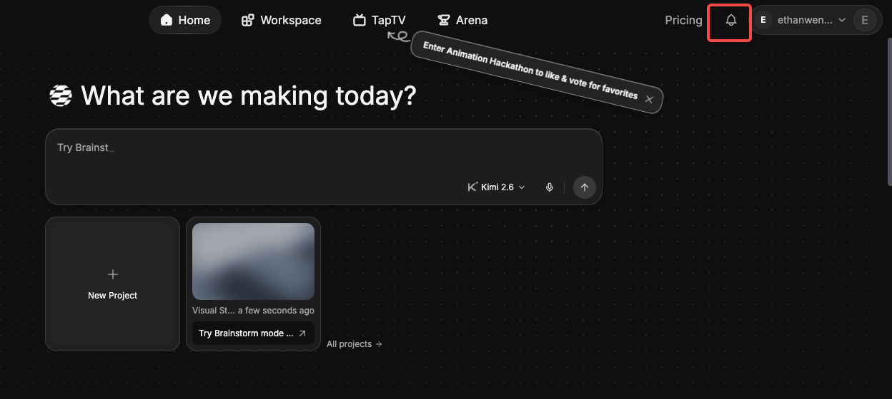

# 查看站内信

> 来源：https://docs.tapnow.ai/zh/docs/account/view-notifications
> 抓取时间：2026-09-23 11:25（离线快照，原文见链接）

# 查看站内信

从个人菜单查看 TapNow 账户通知，并领取活动奖励。

TapNow 会通过站内信向你发送账户相关通知。目前可以在 ****我的通知**** 中查看和领取活动奖励。

## 查看和领取奖励通知

1. 点击页面右上角的头像；
2. 点击 ****我的通知****；
3. 在 ****奖励**** 页面查看奖励原因、奖励数量、创建时间和领取状态。

有待领取奖励时，头像和 ****我的通知**** 旁会出现提示点。点击单条奖励旁的 ****领取**** 可以领取这一项；需要一次处理多条时，可以点击 ****一键领取****。

如果账号属于多个组织，领取前先在 ****选择组织**** 中确认奖励要发放到哪个组织。提交领取后，状态会显示为 ****处理中****；发放完成后会显示 ****已领取****。

[上一页增值税发票](/zh/docs/help-center/mainland-china-vat-invoices)

[下一页设置语言](/zh/docs/account/set-your-language)
