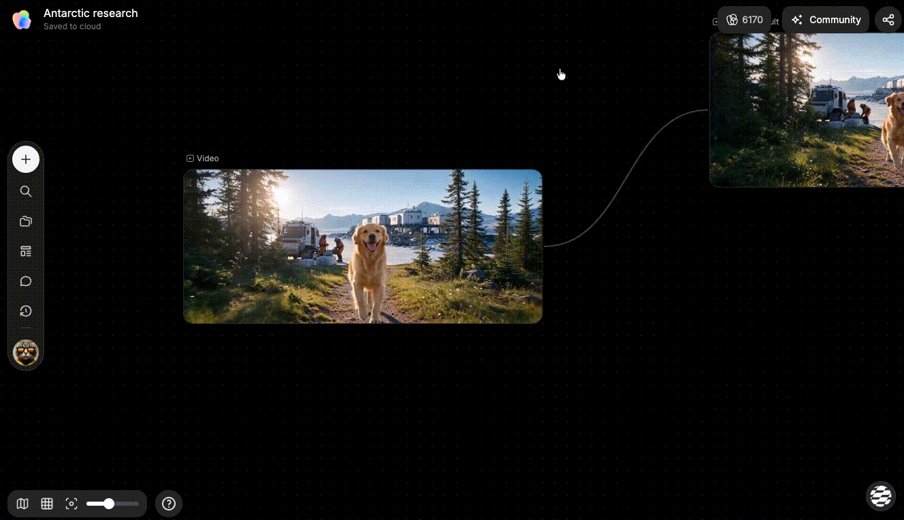
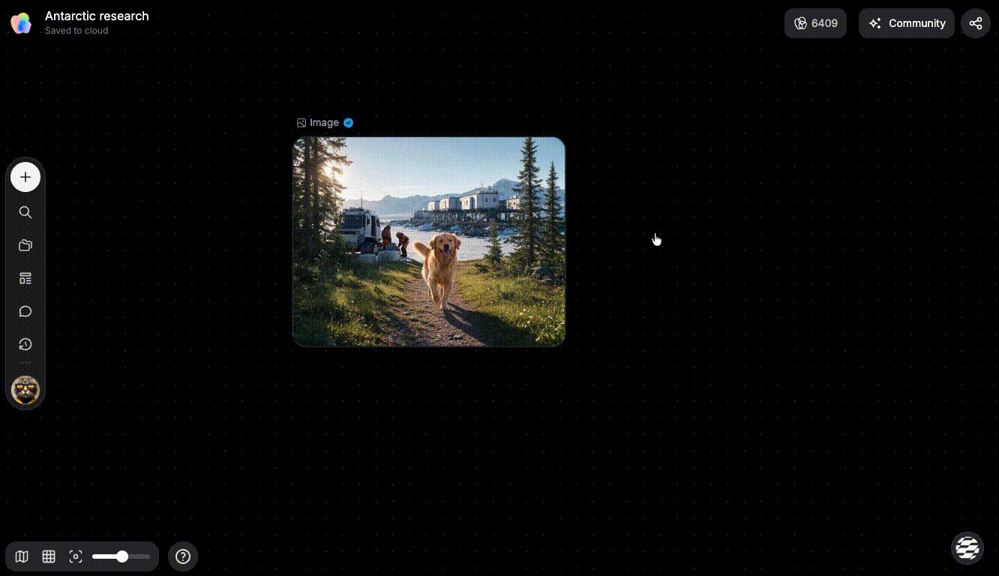
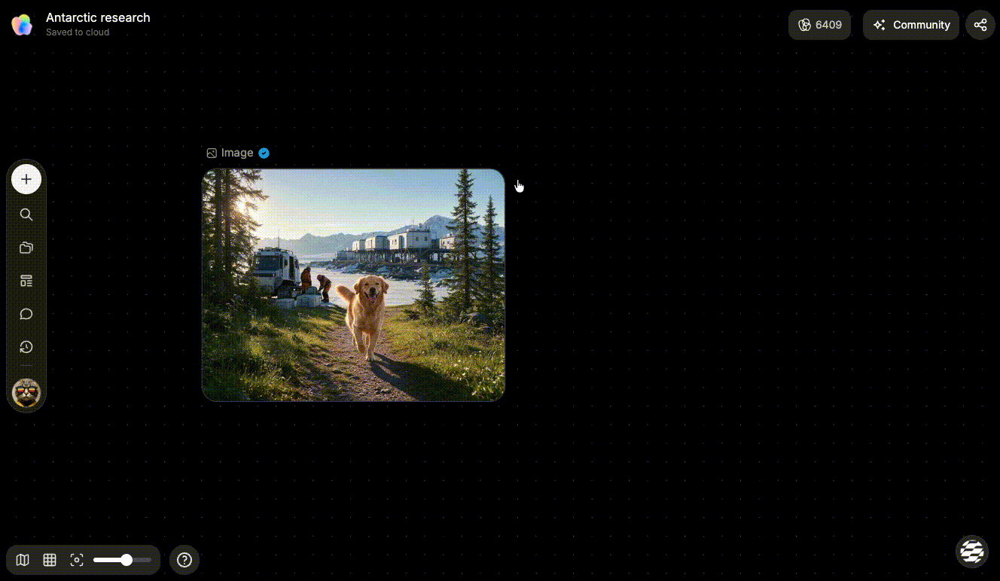
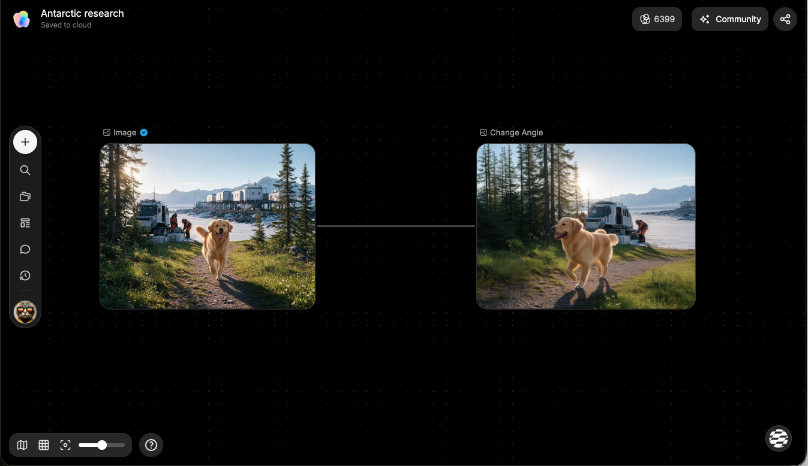
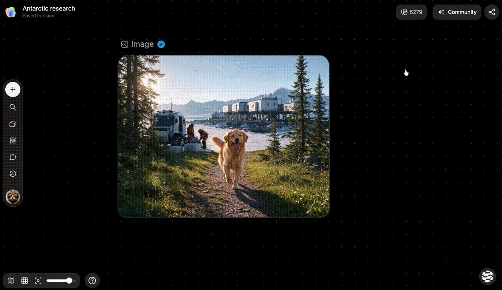
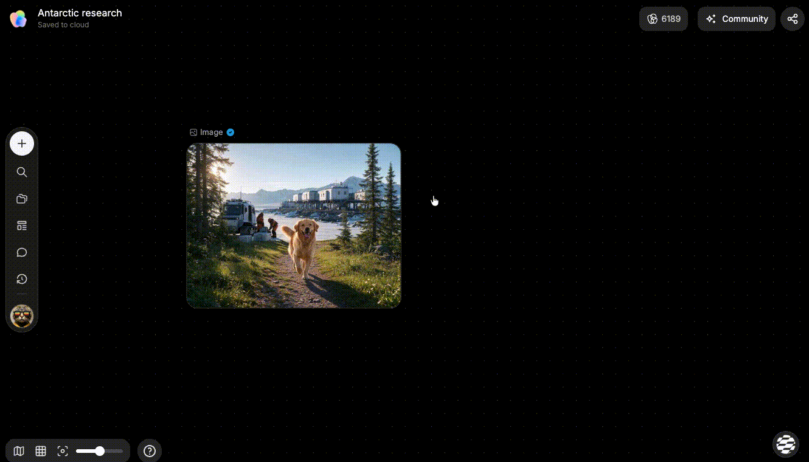
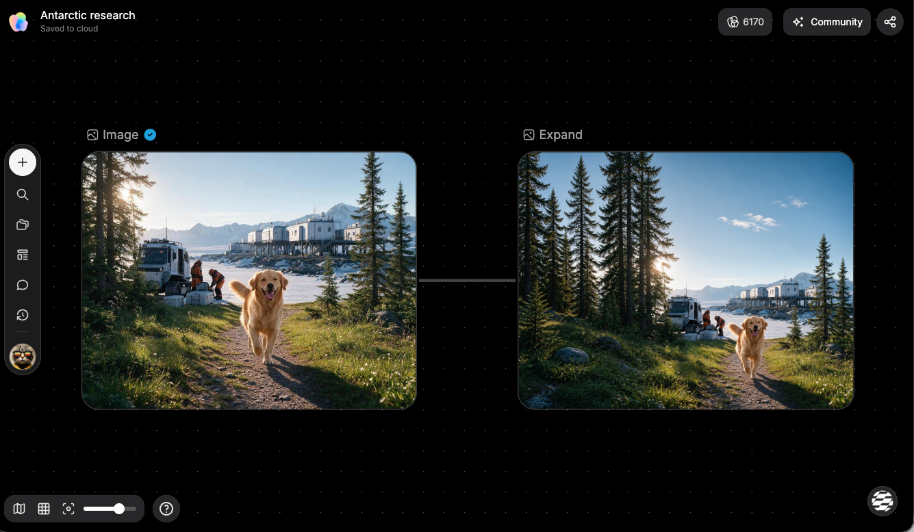
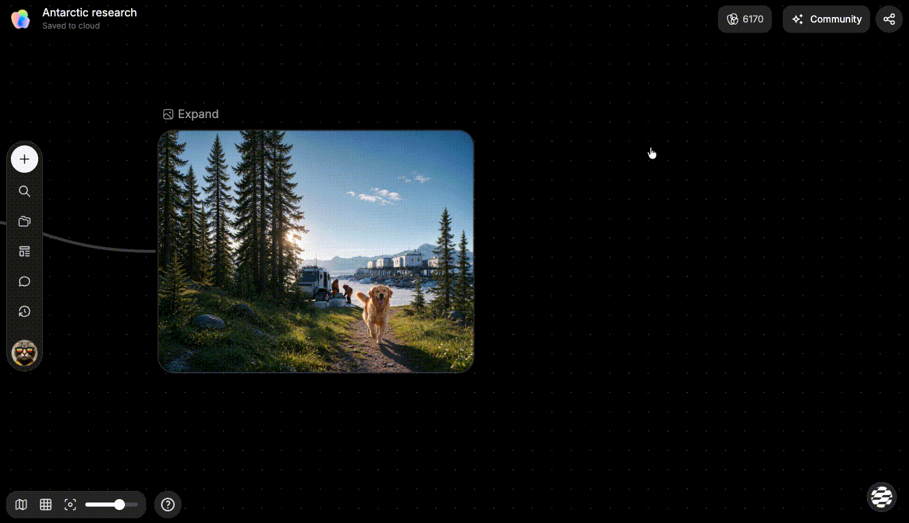
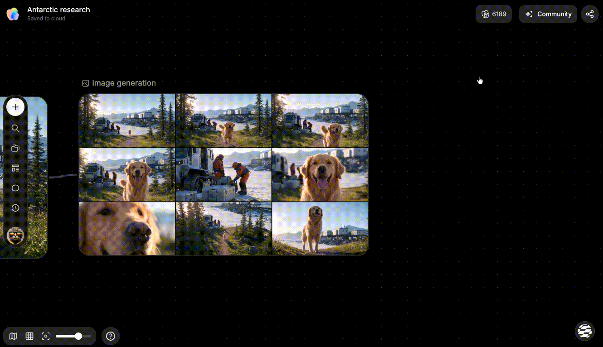

# 生成和编辑图片

> 来源：https://docs.tapnow.ai/zh/docs/canvas/generate-and-edit-images
> 抓取时间：2026-09-23 11:41（离线快照，原文见链接）

# 生成和编辑图片

创建图片节点，并使用图片 Toolbar 完成裁剪、重绘、打光、扩图、抠图和增强等操作。

在 Creative OS 中，图片生成和后续修改都可以在画布上完成。生成或上传一张图片后，单击图片节点，节点上方就会出现 Toolbar。

Toolbar 会根据当前图片和账户可用能力显示对应按钮。把鼠标停在图标上，可以查看按钮名称。

## 开始生成一张图片

1. 从添加菜单创建图片节点，或让 Agent 创建图片任务；
2. 写清主体、环境、构图、光线和风格；
3. 按需要加入产品图、角色图、构图图或风格图；
4. 为每张参考图说明用途；
5. 选择模型、比例、尺寸和生成数量；
6. 在手动确认模式下检查输入、参数和预计消耗；
7. 生成后打开大图逐项检查，不要只看缩略图。

一个可执行的提示可以这样写：

为护肤精华制作一张竖版产品主视觉。瓶身居中偏下，深蓝背景，顶部有柔和冷光，周围保留少量水雾。使用 @产品正面图 保持瓶身结构、瓶盖和标签位置；@灯光参考 只参考光线。9:16，画面上方留出标题空间。

复制

先把必须正确的内容写清，再补充风格。主体、机位和空间关系越明确，生成结果越容易接近你的要求。

## 使用 Prompt 输入框的快捷指令

图片节点的 Prompt 输入框支持 `/` 快捷指令。输入 `/` 后，Creative OS 会打开指令菜单，把常用的复杂图片任务直接列出来。

- 按 `↑` 或 `↓` 切换指令；
- 按 `Enter` 或 `Tab` 选择当前指令；
- 按 `Esc` 关闭菜单；
- 也可以直接用鼠标点击指令。

### 多机位九宫格

多机位九宫格会根据一张参考图，生成同一画面的 3×3 九宫格。九个画面使用不同的机位和景别，同时尽量保持原图中的人物、动作、环境、道具、光线和时间一致。

使用方法：

1. 把一张参考图连接到图片节点；
2. 单击图片节点的 Prompt 输入框；
3. 输入 `/`；
4. 选择****多机位九宫格****；
5. Creative OS 会使用当前选择的图片模型和参数开始生成。

没有连接参考图时，这条指令会显示为不可用。生成完成后，可以使用 Toolbar 中的****快速切分****，把九宫格拆成九个独立图片节点。

多机位九宫格会正常调用图片模型，并根据当前模型和参数消耗 Tapies。

## 打开图片 Toolbar

1. 单击一张已经生成或上传的图片；
2. 图片节点进入选中状态；
3. Toolbar 出现在节点上方；
4. 把鼠标停在按钮上查看名称；
5. 点击按钮进入对应工具。

大多数生成和编辑操作会在原图旁边创建一个新的结果节点，并保留原图。这样可以继续比较，也可以随时回到修改前的版本。

## 为图片编辑选择模型

1. 选中一张已经生成或上传的图片；
2. 打开 ****重绘****，或从 `···` 菜单选择 ****扩图****、****擦除****；
3. 在工具底部选择 GPT Image 2、Banana Pro 或 Seedream 5.0 Pro；
4. 选择分辨率，检查预计消耗，再开始生成。

GPT Image 2 和 Banana Pro 支持 1K、2K、4K，Seedream 5.0 Pro 支持 1K、2K。生成完成后，新结果会作为连接节点出现在源图右侧，源图保持不变，方便并排比较或继续尝试其他模型。

当前页面显示 ****GPT Image 2.5 Flare**** 或 ****GPT Image 2.5 Sunburst**** 时，可以用它们进行文生图或图生图。一次最多生成 16 张，支持 1K、2K 和 4K。选择自动比例时，尺寸选项不会显示。

这两个模型提供****低、中、高、超高、极致****五档质量。超高和极致会使用更多资源，开始前请查看工具面板中的预计消耗。模型和质量档位是否开放取决于你的账户与当前版本，以图片节点显示的选项为准。

## Toolbar 上的主要能力

| 能力 | 适合解决什么问题 | 怎么使用 |
| --- | --- | --- |
| 裁剪 | 去掉多余边缘，重新确定画面范围 | 点击裁剪，拖动裁剪框或选择比例，再确认 |
| 多角度 | 从现有图片生成新的观察角度 | 点击多角度，调整旋转、倾斜、缩放或广角，再生成 |
| 重绘 | 修改图片中的局部内容 | 点击重绘，涂出需要修改的区域，写清要改成什么，再生成 |
| 打光 | 调整图片的光源方向和氛围 | 点击打光，选择主光方向，再调整亮度、色温和轮廓光 |

### 裁剪

裁剪不会要求你重新描述整张图片。进入裁剪后，拖动边框保留需要的区域，也可以直接选择常用比例。确认后，画布会生成裁剪结果。

### 多角度

多角度适合产品、角色或物体的视角探索。打开工具后，可以拖动方块调整水平旋转和垂直角度，也可以调整远近与广角效果。确认参数后点击生成。

模型会根据原图推测没有展示出来的部分。生成新角度后，需要检查产品结构、人物身份和细节是否仍然准确。

### 重绘

重绘只处理你标出的区域。

1. 点击重绘；
2. 在图片上涂出需要修改的位置；
3. 在输入框中写清要替换或补充的内容；
4. 需要时加入另一张参考图；
5. 选择分辨率和生成数量；
6. 点击生成。

例如，想把桌面上的白色花瓶改成银色音箱，只需要涂出花瓶区域，并写：`替换为银色便携音箱，保持原来的光线方向和桌面阴影。`

### 打光

打光可以调整主光源的方向、亮度和色温，也可以加入轮廓光。适合主体和构图已经正确，只需要改善明暗关系或氛围的图片。

选择光源方向并完成设置后，点击生成。结果会作为新图片节点出现在画布上。

## “更多”菜单里的能力

点击 Toolbar 上的 `···` 可以打开更多图片工具。

| 能力 | 作用 |
| --- | --- |
| 扩图 | 扩大图片边界，并让模型补全新增区域 |
| 擦除 | 涂出不需要的内容，让模型根据周围画面自然补全 |
| 标注 | 在图片上画出重点区域，方便说明修改位置或交给 Agent 参考 |
| 增强 | 创建增强节点，选择清晰度增强或高清放大设置 |
| 调整像素 | 输入目标宽度和高度，调整图片的像素尺寸 |
| 抠图 | 识别主体并移除背景 |
| 快速切分 | 把宫格图切成多个独立图片节点，可选择 `2×2`、`3×3` 或 `4×4` |

### 扩图

点击扩图后，向外拖动画布边缘，或选择目标比例。确认扩展范围后开始生成，模型会保留原图并补全新增区域。

扩图适合把横图改成竖图、给标题增加留白，或补足人物和产品周围的环境。

### 为 GPT Image 2 选择扩图精细度

在扩图面板中选择 GPT Image 2 后，精细度按钮默认显示 ****低****。点击当前数值，可以在 ****低****、****中****和****高****之间依次切换。低精细度适合快速尝试构图；需要更多细节时切换到中或高，并在生成前确认按钮显示的是目标精细度，同时查看更新后的预计消耗。

### 擦除

点击擦除后，在图片上涂出需要移除的内容，再开始生成。Creative OS 会根据周围环境填补被擦除的位置。

一次只处理一个清楚的区域。需要删除多个相距较远的对象时，可以分几次完成，结果更容易检查。

### 标注

标注适合指出“这里要改”“这个区域需要保留”或“从这里继续扩展”。完成标注后，可以把标注图交给 Agent，并在指令中说明标记的含义。

### 增强和调整像素

- ****增强：**** 适合低清图片、需要补充细节或准备更大尺寸输出的场景；
- ****调整像素：**** 适合已经知道目标宽度和高度，只需要改变图片尺寸的场景。

增强可能会重新生成细节。处理产品包装、人物面部或文字区域后，需要放大检查是否发生变化。

### 抠图

点击抠图后，Creative OS 会识别主体并生成透明背景结果。适合产品合成、人物换背景和素材排版。

头发、透明材质和复杂边缘容易出现缺口。生成后打开大图检查边缘；结果不理想时，可以回到原图重新抠图。

### 快速切分

快速切分适合处理已经排成宫格的分镜、角色设定或候选图。选择对应宫格数量后，每个格子会成为一个独立图片节点。

切分前先确认原图确实是规则宫格，避免主体被切到边缘。

## 保存、查看和下载

Toolbar 右侧还会提供这些常用操作：

| 操作 | 结果 |
| --- | --- |
| 保存到素材库 | 把当前图片保存到素材库，之后可以再次使用 |
| 全屏查看 | 打开大图，检查产品结构、人物细节、文字和边缘 |
| 下载 | 把当前图片保存到电脑 |

部分画布还会显示颜色标记入口，可以用不同颜色标记需要继续处理或重点关注的图片。

使用多角度、重绘、打光、扩图、擦除或增强等生成能力时，会调用对应模型，并根据页面显示的模型、分辨率和生成数量正常消耗 Tapies。开始前可以在工具面板中查看预计消耗。

下一步：[生成和编辑视频](/zh/docs/canvas/generate-and-edit-video)

[上一页上传文件并放入画布](/zh/docs/canvas/upload-files-to-the-canvas)

[下一页生成和编辑视频](/zh/docs/canvas/generate-and-edit-video)
