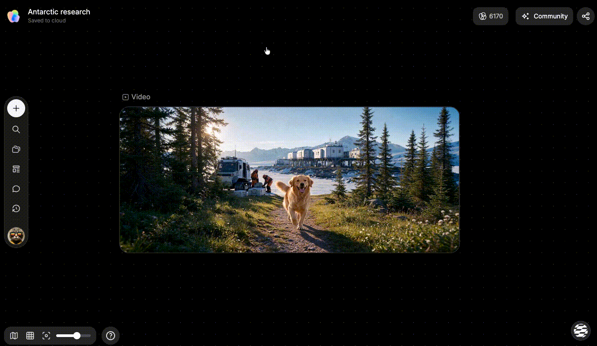
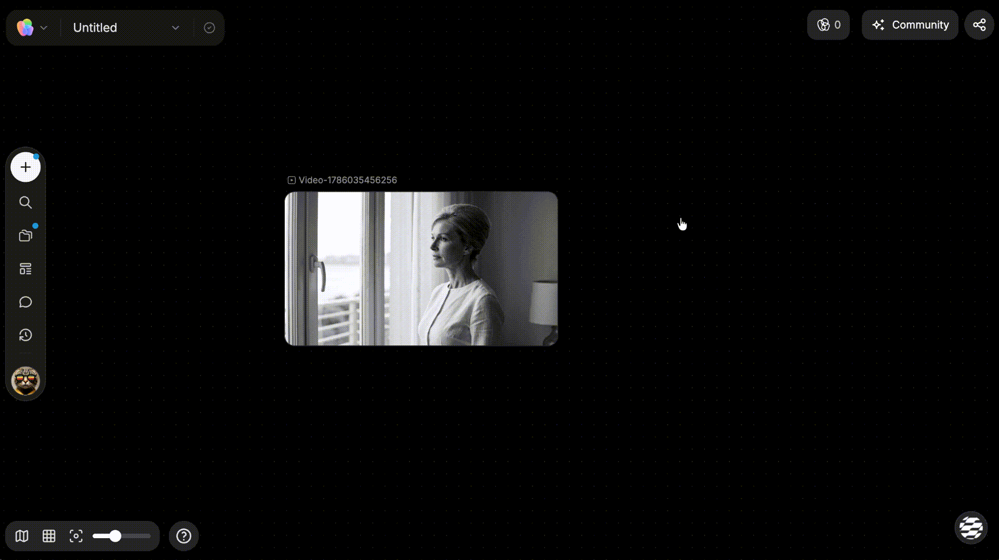
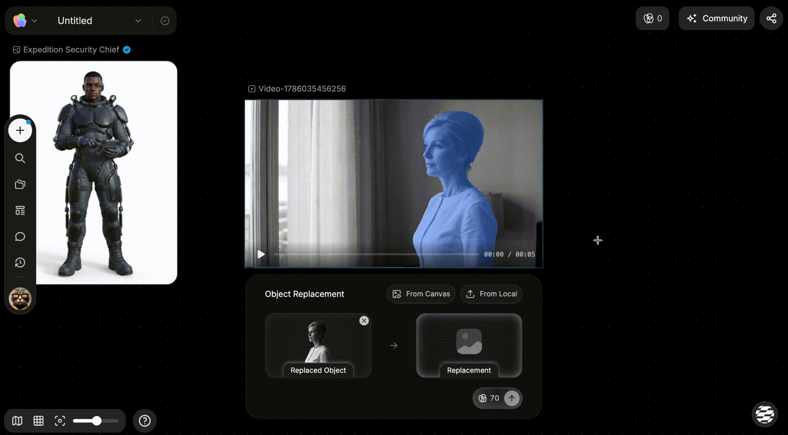
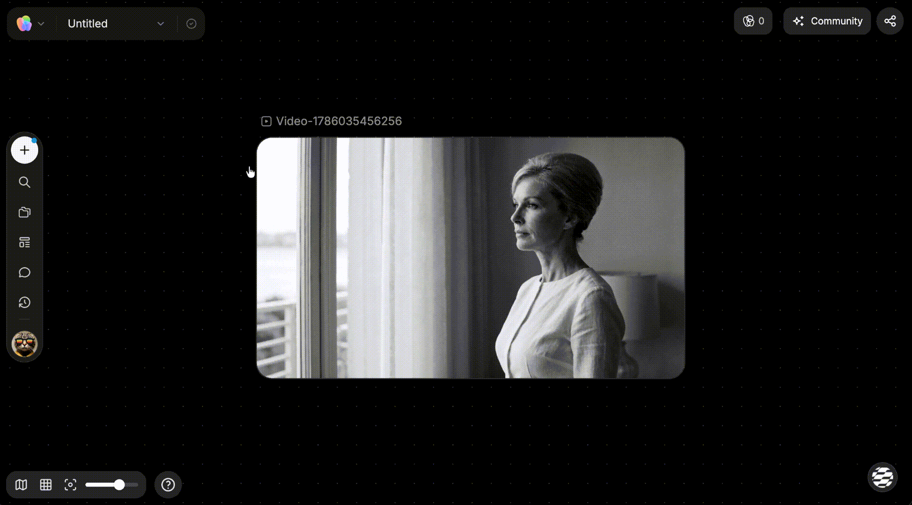
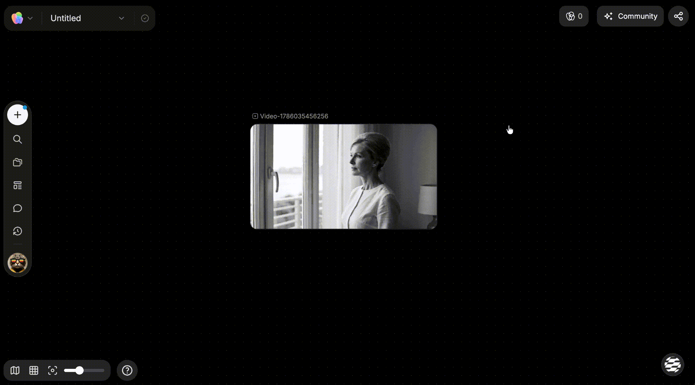
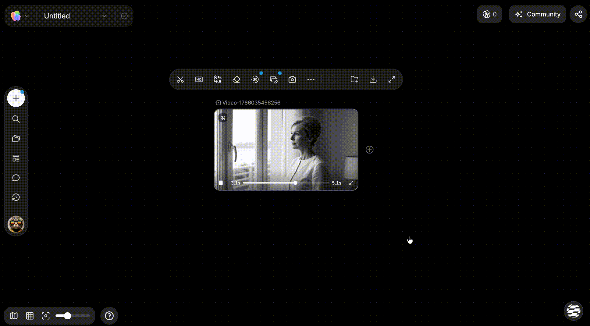
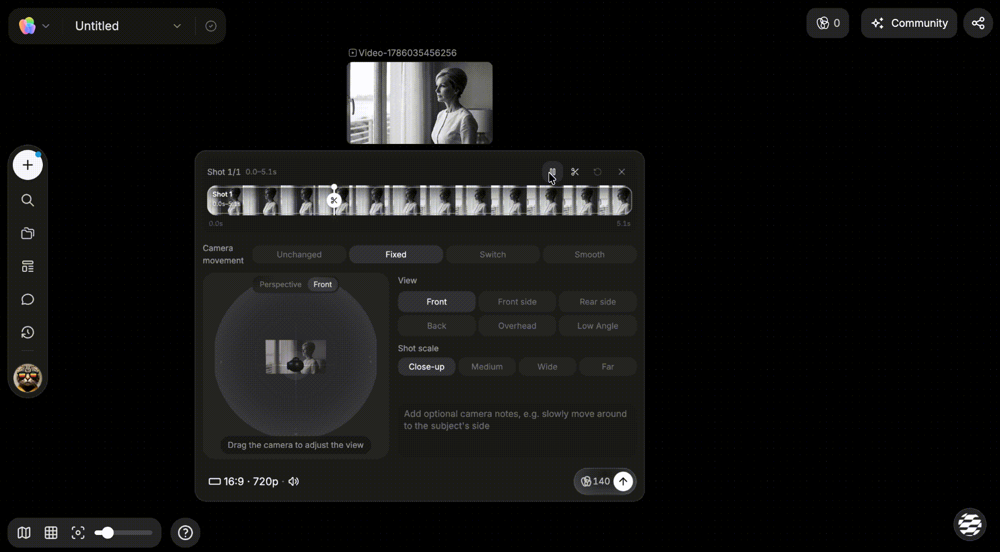
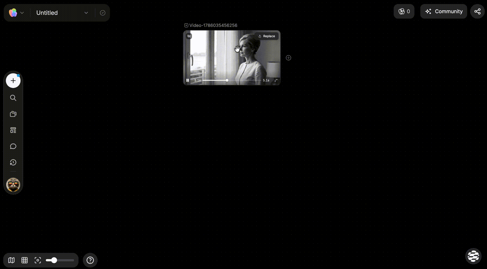

# 生成和编辑视频

> 来源：https://docs.tapnow.ai/zh/docs/canvas/generate-and-edit-video
> 抓取时间：2026-09-23 11:41（离线快照，原文见链接）

# 生成和编辑视频

在画布上生成视频，并使用节点 Toolbar 完成剪辑、替换、移除、延长镜头、视频重拍、截帧、预览和下载。

你可以从一段文字开始生成视频，也可以使用画布上的图片、视频或音频作为参考。视频生成完成后，单击视频节点即可打开 Toolbar，继续剪辑、替换或移除画面中的对象、延长镜头、视频重拍、截帧、预览或下载。

## 开始生成一个视频

1. 从添加菜单创建视频节点，或让 Agent 创建视频；
2. 写清主体、主要动作、环境和相机运动；
3. 需要使用参考图片、视频或音频时，通过连线或 `@` 把对应节点加入输入；
4. 选择模型、画面比例、时长、清晰度和当前模型提供的其他参数；
5. 使用手动确认模式时，在确认卡片中检查输入和参数；
6. 点击生成；
7. 生成完成后，从头到尾播放一次视频。

一个可以直接使用的指令：

使用 @产品主视觉 生成一段 5 秒横版视频。保持产品外观、标签和颜色不变。产品放在夜间露营桌面上，背景灯光轻微闪动，镜头缓慢向前推进，不要转场。

复制

提示中先写清谁在动、怎样动，再说明相机怎样移动。一个片段只安排一个主要动作，生成结果通常会更容易控制。

不同模型支持的参考内容、时长、声音和画面规格可能不同，以当前视频节点中显示的选项为准。页面显示的 Tapies 为预计值，最终消耗以实际结算为准。

## 使用 Seedance 2.5 生成 1080p 视频

1. 创建或选中一个视频节点，选择 Seedance 2.5；也可以让 Agent 创建视频，并在生成确认卡中选择该模型；
2. 打开 ****生成方式****，根据任务选择 ****首尾帧****、****全能参考**** 或 ****视频编辑****；
3. 打开 ****清晰度****，选择 ****1080p****；
4. 检查输入内容、其他参数和更新后的预计 Tapies，再开始生成。

这些生成方式都支持 1080p。新任务仍默认使用 720p，因此每次需要更高分辨率时，都要在生成前主动选择 1080p。全能参考最多可以加入 30 张图片、10 段视频和 10 段音频；实际可用方式和上限以当前节点显示为准。生成完成后，1080p 结果会显示在当前视频节点中。

Seedance 2.5 需要付费账户及当前模型访问权限。尚未开放时，模型会显示为锁定。

## 使用 MiniMax H3 生成视频

1. 创建或选中一个视频节点，选择 MiniMax H3；
2. 打开 ****生成方式****，选择 ****首尾帧**** 或 ****参考****，再填写提示词并加入需要的参考素材；
3. 选择 768P 或 2K，并把时长设为 4–15 秒。新任务默认使用 2K、5 秒；
4. 检查页面显示的预计 Tapies，再点击生成。

MiniMax H3 会生成带原生音频的视频。参考模式一次最多支持 9 张图片、3 段视频和 3 段音频；每段参考视频需要为 2–15 秒，所有参考视频合计不超过 15 秒。音频不能单独作为参考，至少同时加入一张图片或一段视频。MiniMax H3 需要付费账户及当前模型访问权限；尚未开放时会显示为锁定。生成完成后，从头到尾播放结果，检查画面、声音和主体一致性。

## 使用 MiniMax H3 Max 快速试片

MiniMax H3 Max 是 H3 系列的高速版本。需要快速比较动作、构图或提示词方向时，可以先用它制作短片，再决定是否继续精修。

1. 创建或选中一个视频节点，选择 MiniMax H3 Max；也可以在 Agent 的生成确认卡片中切换到该模型；
2. 选择文生视频，或加入一张图片作为首帧；
3. 选择 480P 或 768P，并把时长设为 5–15 秒；
4. 写清主体动作、相机运动和需要出现的声音，检查预计 Tapies 后开始生成。

MiniMax H3 Max 会生成带原生音频的视频。当前仅支持文生视频和单张首帧图生视频，不支持首尾帧或多模态参考。生成速度还会受到任务队列和输入内容影响；实际可用范围以当前节点显示为准。

## 使用 Wan 3.0 生成视频

1. 创建或选中一个视频节点，选择 Wan 3.0；
2. 根据任务选择文字生成、首帧生成或参考图生成。参考图生成可以加入 1–10 张图片；
3. 选择 480P、720P 或 1080P，再把时长设为 2–30 秒，或选择 ****自动****；
4. 根据需要保留或关闭声音，检查预计 Tapies 后开始生成。

文字和参考图生成可以选择自适应、16:9、9:16、1:1、4:3 或 3:4；首帧生成的画幅由输入图片决定。Wan 3.0 默认生成声音。模型和可用规格会根据当前账户显示。

## 使用 FLUX 3 生成视频

1. 创建或选中一个视频节点，选择 FLUX 3；
2. 输入文字提示，或加入一张图片作为首帧；
3. 选择 720p 或 1080p，并把时长设为 5–20 秒；
4. 根据需要保留或关闭声音，检查预计 Tapies 后开始生成。

文字生成可以选择 21:9、2:1、16:9、4:3、1:1、3:4 或 9:16；首帧生成的画幅由输入图片决定。FLUX 3 默认生成声音。模型和可用规格会根据当前账户显示。

## 选中视频，打开 Toolbar

视频生成或上传完成后：

1. 单击视频节点；
2. 节点 Toolbar 会显示可用操作；
3. 将鼠标移到按钮上，可以查看按钮名称；
4. 点击需要的工具，再按照面板提示选择范围、参考内容或处理参数。

视频仍在生成、当前画布为只读状态，或账户暂不支持某项能力时，对应按钮可能不会显示。

## Toolbar 核心能力

| Toolbar 能力 | 适合什么时候使用 | 操作后会发生什么 |
| --- | --- | --- |
| ****剪辑**** | 去掉片头、片尾或只保留需要的时间段 | 打开剪辑面板。设置入点和出点并确认后，画布会创建剪辑结果节点，原视频仍然保留 |
| ****替换**** | 保留镜头，只把画面中的一个对象换成另一个对象 | 框选被替换物并提供参考图后，画布会创建替换结果节点，原视频仍然保留 |
| ****移除**** | 去掉画面中不需要的对象 | 框选目标后，画布会创建移除结果节点，原视频仍然保留 |
| ****延长镜头****（Beta） | 补充原视频之前或之后发生的内容 | 选择延长方向、时长和延长方式后，画布会在原视频前方或后方创建相连的新视频节点 |
| ****视频重拍****（Beta） | 重新设计一段视频的机位、景别或运镜 | 按时间段设置镜头变化后，画布会创建相连的重拍结果节点，原视频仍然保留 |
| ****截帧**** | 想把视频中的某一帧继续用于图片或下一个镜头 | 可截取当前帧、首帧或尾帧，并在画布上创建图片节点 |
| ****保存到素材库**** | 这段视频之后还会重复使用 | 打开保存面板，把视频保存到个人或团队素材库 |
| ****下载**** | 需要把当前视频保存到电脑 | 下载当前视频文件 |
| ****全屏预览**** | 需要检查动作、画面细节或声音 | 打开视频大图预览，不修改原节点 |

这里介绍的是视频 Toolbar 中最常用的几项能力。实际可用按钮会根据当前视频状态、账户权限和产品版本变化，以页面中显示的内容为准。

### 剪辑

需要去掉片头、片尾，或只保留视频中的一段内容时：

1. 选中视频节点，点击 Toolbar 中的剪辑；
2. 在时间轴上拖动入点和出点，确定需要保留的范围；
3. 播放预览，检查开始和结束位置；
4. 点击确认裁剪。

画布会在原视频旁边创建一个新的剪辑结果节点，原视频仍然保留。

一段视频包含多个分镜时，可以在剪辑面板中使用 ****智能剪辑****。它会分析视频中的画面变化，自动识别明显的镜头切换，并把识别出的分镜裁成多个独立视频节点。

智能剪辑适合拆分已经剪在一起的广告、短片或分镜样片，可以省去逐个寻找切点的时间。分析完成后，播放每个结果节点，检查切点是否准确；如果视频中的镜头变化不明显，可能不会检测到可用的切点。

### 视频替换

需要保留镜头，只把画面中的一个对象换成另一个对象时：

1. 选中视频节点，点击 Toolbar 中的 ****替换****；
2. 拖动进度条，让被替换物清楚地出现在画面中；
3. 点击 ****添加蒙层****，在画面中框选被替换物并确认。识别完成后，面板会显示选区缩略图；
4. 点击 ****从画布中选择****，选择一个图片节点作为替换物；也可以点击 ****从本地上传**** 添加参考图；
5. 确认“被替换物”和“替换物”，查看预估 Tapies，然后点击 ****生成****。

生成完成后，替换结果会作为相连的新视频节点出现在原视频右侧，原视频仍然保留。

### 视频移除

需要去掉画面中的人物、物体或其他内容时：

1. 选中视频节点，点击 Toolbar 中的 ****移除****；
2. 拖动进度条，让目标清楚地出现在画面中；
3. 点击 ****添加蒙层****，框选需要移除的目标并确认；
4. 检查面板中的目标缩略图和预估 Tapies，然后点击 ****生成****。

生成完成后，移除结果会作为相连的新视频节点出现在原视频右侧，原视频仍然保留。

### 延长镜头（Beta）

需要补充镜头之前或之后发生的内容时：

1. 选中视频节点，点击 Toolbar 中的 ****延长镜头****；
2. 在设置中选择 ****片头延长**** 或 ****片尾延长****，再选择画面比例、4–30 秒新增时长和延长方式；
3. 输入此前或接下来发生的内容。需要参考其他画布或主体素材时，可以使用 `@` 引用；
4. 查看预估 Tapies，然后点击 ****确认并生成****。

选择片头延长时，新节点会出现在原视频前方；选择片尾延长时，新节点会出现在原视频后方。两个节点会自动连接，原视频仍然保留。

### 视频重拍（Beta）

需要使用原视频作为参考，重新安排某个时间段的机位、景别或运镜时：

1. 选中视频节点，点击 Toolbar 中的 ****视频重拍****，打开重拍面板；

   
2. 在 ****分镜时间轴**** 中选择要调整的片段。不同时间段需要使用不同镜头时，把播放头移到切点并点击 ****剪切分镜****。每个片段都可以单独设置；

   
3. 选中一个片段，再选择镜头变化方式：

   - ****保持不变：**** 这段不需要调整时使用。生成时会要求保留原视频画面，不改变视角和景别；
   - ****固定机位：**** 使用一个固定视角重拍整段。可以拖动左侧球体决定机位方向，也可以选择右侧的正面、侧前方、侧后方、背面、俯视或仰视预设；再调整景别，决定从特写到远景的取景范围；
   - ****切换视角：**** 分别设置 ****开始视角**** 和 ****结束视角****，让画面在片段中从一个视角直接切到另一个视角，中间没有连续移动。适合对话正反打、反应镜头或强调某个瞬间；
   - ****平滑移动：**** 同样设置 ****开始视角**** 和 ****结束视角****，让视角在两个位置之间连续过渡。可以表达环绕、推进、拉远，或从侧面移动到正面等连贯运镜。

   使用固定机位时，通过球体或视角选项调整单一机位；使用切换视角或平滑移动时，先选择 ****开始视角**** 或 ****结束视角****，再分别用球体、视角预设和景别设置两个端点。还可以添加画面与运镜说明，告诉 AI 这一段要突出什么。短于 0.5 秒的片段只能使用保持不变或固定机位；如果开始和结束视角相同或非常接近，系统会按固定机位处理。

   
4. 检查清晰度和声音设置，查看预估 Tapies，然后点击 ****生成视频****。

Creative OS 会使用每个片段的镜头方案引导 AI 生成，并在原视频右侧创建相连的重拍结果节点，原视频仍然保留。球体、预设和分镜说明用于表达镜头意图，并不等同于逐帧精确的 3D 相机轨迹；生成后请播放结果，检查机位和运镜变化。

### 截帧

截帧可以把视频中的一帧变成新的图片节点。选中视频后，点击 Toolbar 中的截帧，然后选择：

- ****截取当前帧：**** 先把视频播放到需要的位置，再截取当前画面；
- ****截取首帧：**** 直接提取视频的第一帧；
- ****截取尾帧：**** 直接提取视频的最后一帧。

截取完成后，图片会作为新节点出现在画布上。可以继续用它生成下一个镜头、制作分镜，或作为其他图片和视频的参考。

下一步：[生成和编辑音频](/zh/docs/canvas/generate-and-edit-audio)

[上一页生成和编辑图片](/zh/docs/canvas/generate-and-edit-images)

[下一页生成和编辑音频](/zh/docs/canvas/generate-and-edit-audio)
