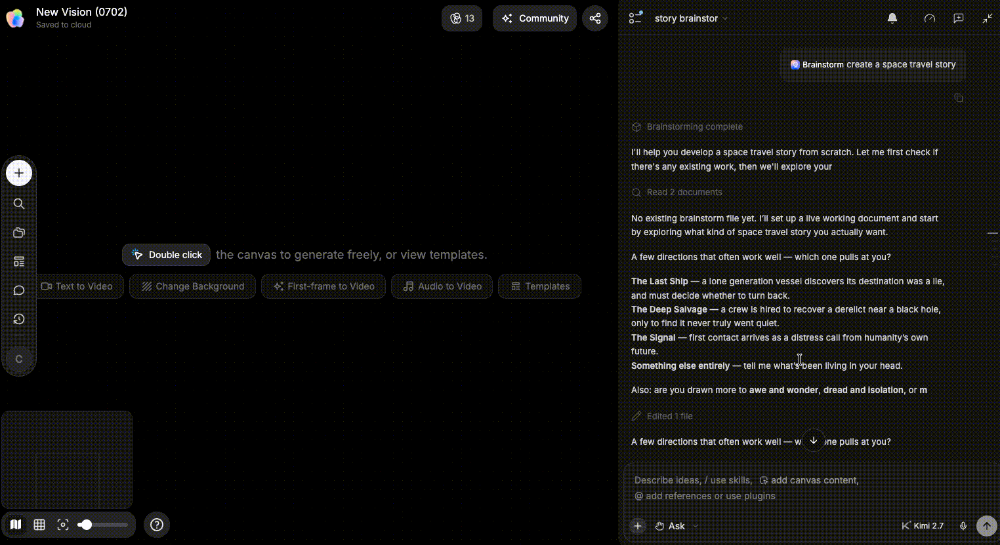
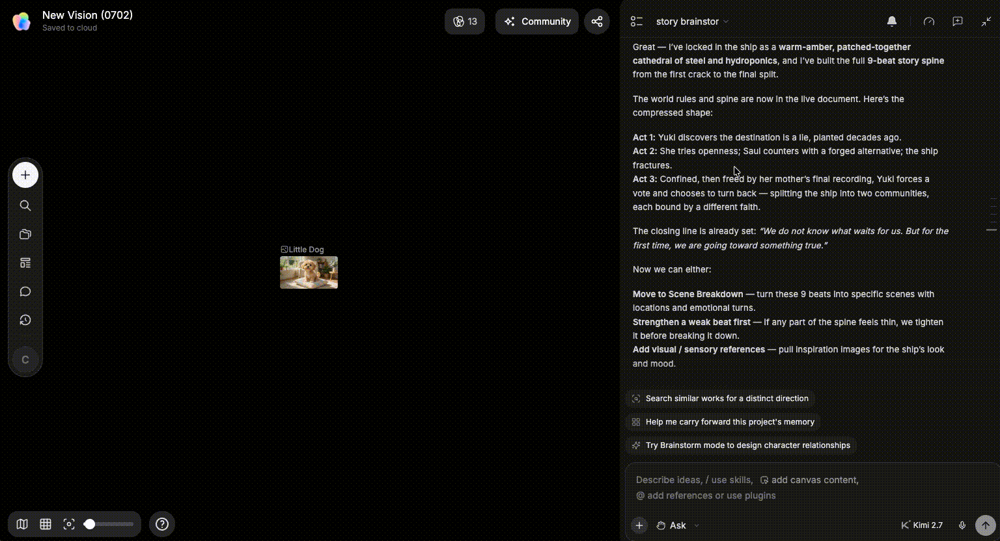

# 管理 Agent 产物

> 来源：https://docs.tapnow.ai/zh/docs/agent/manage-agent-outputs
> 抓取时间：2026-09-23 11:41（离线快照，原文见链接）

# 管理 Agent 产物

在侧边栏面板中查看 Agent 保存的简报、脚本和互动作品，并继续使用、修改或分享。

当你让 Agent 把一轮讨论整理成创意简报、脚本、表格或互动页面时，完成的内容会保存为 Agent 产物，并出现在当前画布的****侧边栏面板****中。

打开侧边栏面板，点击一项产物即可查看内容。根据产物类型，你还可以把内容加入画布、发回对话继续修改，或打开互动作品进行预览和分享。

## 什么是 Agent 产物？

Agent 产物是 Agent 为当前画布保存、之后可以再次打开的结果，例如：

- 创意简报、故事大纲和脚本；
- 头脑风暴中整理的人物、世界观和视觉方向；
- Markdown、文本、表格或 CSV 内容；
- Pitch Deck、HTML 页面和互动作品。

每张画布都有自己的产物。切换画布后，侧边栏面板会显示当前画布保存的内容。

Agent 生成的图片、视频和音频通常直接出现在画布上，继续以节点使用。简报、脚本、表格和互动页面会更常作为产物保存在侧边栏面板中。

## 1. 在侧边栏面板中找到产物

1. 打开 Agent 执行任务时使用的画布；
2. 打开侧边栏面板；
3. 根据标题找到需要的产物；
4. 点击标题查看完整内容。

如果没有看到结果，可以让 Agent 明确保存一份产物：

请把刚才确认的产品广告方向整理成一份创意简报，并保存为当前画布的产物。

复制

Agent 提示保存完成后，回到侧边栏面板查看。如果一次生成了多个产物，可以通过标题和更新时间判断版本，例如“户外音箱广告｜已确认创意简报｜v2”。

## 2. 打开产物后可以做什么？

根据当前产物显示的按钮，你可以：

- 直接阅读简报、脚本或表格；
- 将内容****添加到画布****，继续作为节点使用；
- 将产物加入对话，让 Agent 修改文字、结构或细节；
- 打开互动作品，检查页面内容和交互；
- 在确认内容后复制分享链接。

准备在后续任务中继续引用的内容，可以添加到画布。仍需要修改的内容，可以先发回对话，写清这次要改的部分。

把产物加入画布后，可以给节点标明状态，例如“当前脚本”或“待确认版本”。后续让 Agent 工作时，直接引用当前使用的节点。

## 3. 怎样使用头脑风暴结果？

头脑风暴完成后，整理好的章节和候选会作为产物出现在侧边栏面板中。打开产物后，你可以：

- 查看剧本、人物、世界观和候选方向；
- 把已经确认的章节添加到画布；
- 选择仍需修改的内容，继续交给 Agent 讨论。

画布中只需要加入准备继续制作的方向。其他候选可以留在头脑风暴产物中，方便之后查看。

## 4. 怎样生成互动作品？

当头脑风暴已经形成完整概念时，可以选择****生成互动作品****。Agent 开始生成后，你可以继续处理画布。

生成互动作品会正常消耗 Tapies。开始生成前，请查看页面显示的消耗信息；确认后再开始生成。

生成完成后：

1. 在侧边栏面板中找到新生成的互动作品；
2. 选择****打开互动作品****；
3. 检查标题、文字、图片、交互和移动端显示；
4. 需要修改时，回到对应对话写清修改内容；
5. 确认后选择****分享此页面****并复制链接。

分享前请检查

分享前，请检查事实、素材授权、品牌信息和不应公开的内容。

复制链接后，可以使用未登录窗口或目标成员账户打开一次，确认对方看到的是正确版本。

## 找不到产物时怎么办？

1. 确认当前打开的是 Agent 执行任务时使用的画布；
2. 查看 Agent 是否已经提示保存或生成完成；
3. 回到对应对话，询问产物的准确标题；
4. 再次打开侧边栏面板，根据标题和更新时间查找；
5. 如果任务失败，先保存错误信息，再修正任务后重新发送；
6. 仍然找不到时，保留画布链接和任务信息并联系支持。

下一步：[认识画布](/zh/docs/canvas/explore-the-canvas)

[上一页网络搜索](/zh/docs/agent/web-search)

[下一页认识画布](/zh/docs/canvas/explore-the-canvas)
