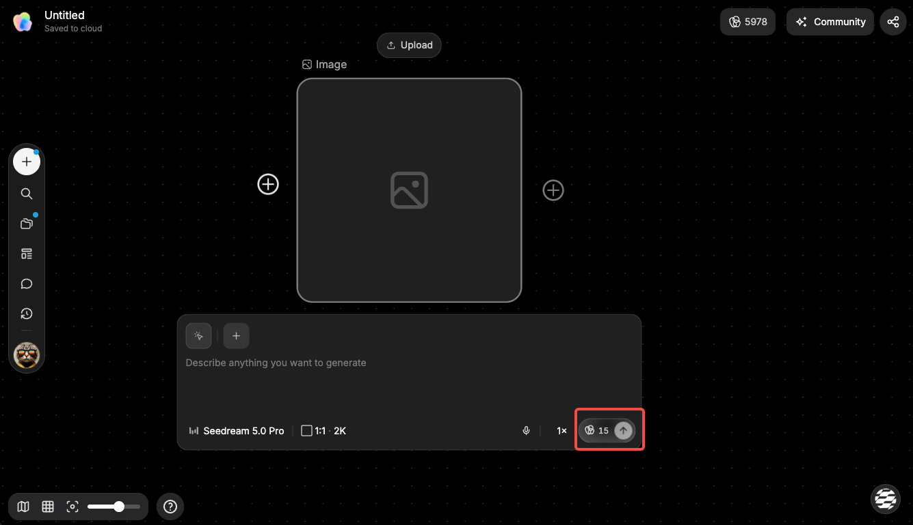
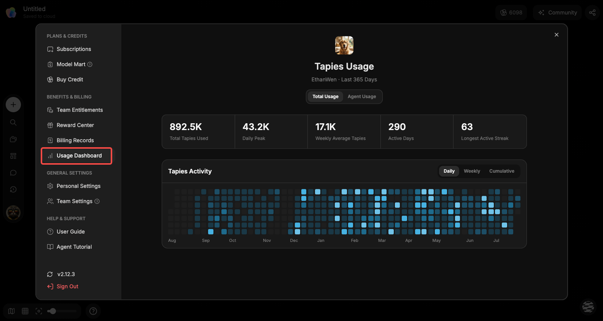

# 管理 Tapies 与套餐

> 来源：https://docs.tapnow.ai/zh/docs/account/manage-tapies-and-plans
> 抓取时间：2026-09-23 11:25（离线快照，原文见链接）

# 管理 Tapies 与套餐

理解 Tapies 为什么会变化，怎样在运行前判断消耗，并根据个人或团队的真实工作选择订阅与充值。

生成图片、视频或让 Agent 连续执行任务，会调用不同模型和计算资源。我们用 Tapies 统一记录这些消耗，让你在开始前判断成本，运行后也能查到用量去了哪里。

Tapies 不是“点击一次扣固定数量”。模型、输出规格、时长、数量和任务复杂度不同，消耗也会变化。

开始生成前，页面会根据当前选择的模型和参数显示****预计 Tapies 消耗****。这个数字用于帮助你在运行前判断本次生成大概需要多少 Tapies。最终扣除数量以实际完成的生成和账单记录为准。

## 哪些操作可能消耗 Tapies

常见消耗来自：

- Agent 执行需要计算或调用 Apps 的任务；
- 生成图片、视频、音频或其他内容；
- 使用更高分辨率、更长时长或更多生成数量；
- 使用价格不同的模型或专属能力；
- 对同一任务继续生成变体或重新运行。

输入文字、移动画布节点或整理项目不等于一定消耗 Tapies。是否收费以及预计数量，以运行前界面显示为准。

## 为什么运行前要确认

同一句任务可能有多种执行方式。例如，先生成 4 张低规格方向图，再选择 1 张精修，通常比直接生成多条高规格视频更容易控制预算。

首次使用新模型或新工作流时，建议使用****手动确认****：

1. 查看 Agent 准备调用的模型或 App；
2. 检查数量、比例、分辨率和时长；
3. 确认预计 Tapies 消耗；
4. 确认输入没有选错版本；
5. 再开始运行。

预计消耗用于帮助决策。最终记录以实际完成的任务和账户账单为准。

## 查看余额与用量

在账户的权益和账单区域，可以查看当前界面提供的：

- Tapies 余额；
- 每日、每周或累计用量；
- 总消耗与 Agent 用量；
- 交易和账单记录；
- 当前订阅和对应权益；
- 可用时的赠送或专属额度。

发现余额变化不符合预期时，先按时间检查最近运行的任务，再对照交易记录。团队空间还要确认任务由哪位成员执行。

## 赠送额度和专属额度

不同额度可能有独立的适用范围、优先级和有效期。例如，某类额度可能只适用于指定模型或活动。

不要只看总余额。准备执行重要任务前，同时查看：

- 这笔额度能否用于当前模型；
- 是否即将到期；
- 使用后是否会转而消耗通用余额；
- 当前任务位于个人空间还是团队空间。

具体规则以额度页面和活动说明为准。

## 订阅还是充值

选择方式时，从实际工作频率出发：

| 使用情况 | 更适合先查看 |
| --- | --- |
| 持续创作并需要稳定权益 | 月付或年付订阅 |
| 临时增加一批制作额度 | 按量充值 |
| 多人共同使用 | 团队套餐、团队余额和成员配额 |
| 使用指定模型或活动能力 | 对应礼包或专属额度 |

价格、模型范围和套餐权益会更新，因此本文不保存固定数字。下单前以产品内价格页面和订单确认页为准。

## 支付、充值或订阅失败

先检查：

- 银行卡或支付账户是否可用；
- 网络和自动扣款授权是否正常；
- 订单是否仍在处理中；
- 权益是否已经到账但页面尚未刷新；
- 当前查看的是个人账户还是团队账户。

不要连续重复支付。等待几分钟后再次查看订单和余额；仍有问题时，保留订单号、交易时间、金额和支付状态，再联系支持。

下一步：[续订与优惠](/zh/docs/help-center/renewal-and-discounts)

[上一页通过官方插件添加](/zh/docs/mcp/add-through-an-official-plugin)

[下一页续订与优惠](/zh/docs/help-center/renewal-and-discounts)
