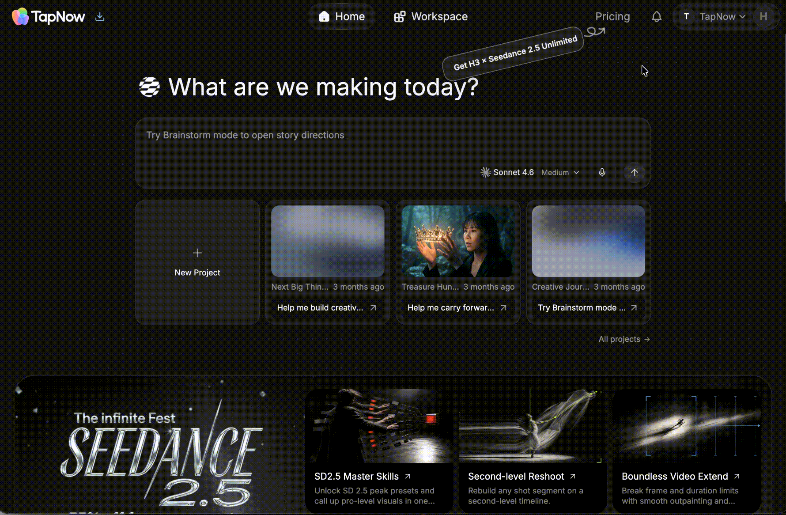
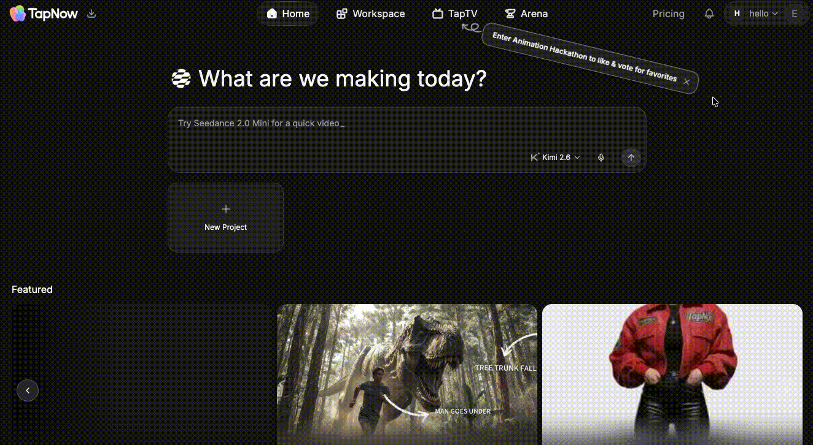
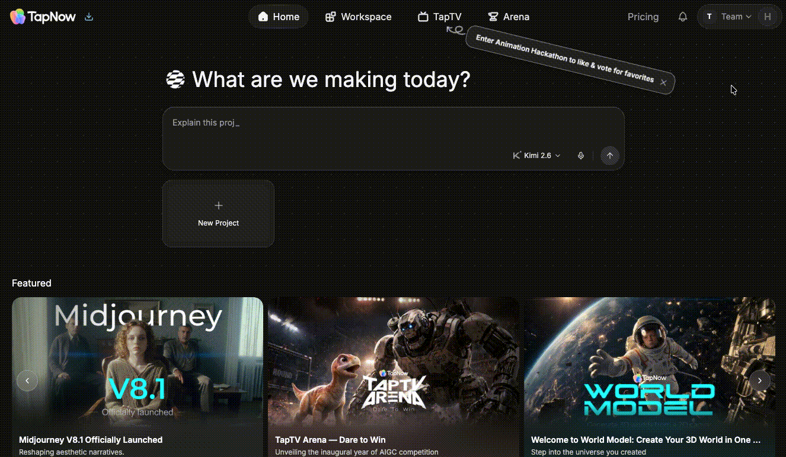
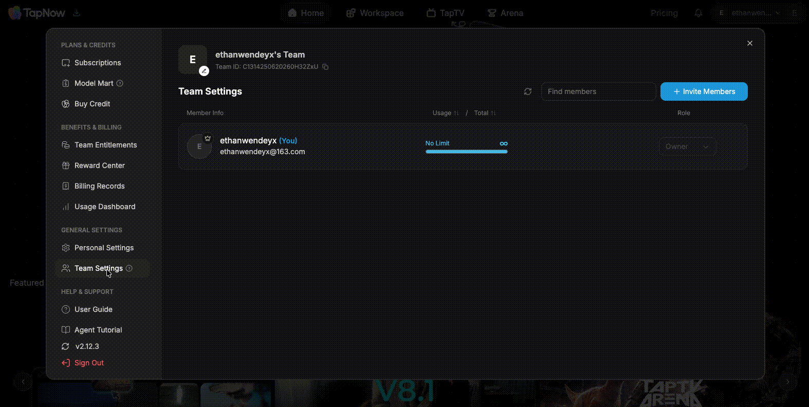

# 管理团队与权限

> 来源：https://docs.tapnow.ai/zh/docs/account/manage-teams-and-permissions
> 抓取时间：2026-09-23 11:25（离线快照，原文见链接）

# 管理团队与权限

创建和切换团队，邀请成员，并设置成员角色与 Tapies 额度。

团队适合多人共同使用同一批画布和 Tapies。切换团队后，页面会显示该团队的画布、成员、订阅和 Tapies 余额。

## 1. 创建团队

1. 点击页面顶部的当前团队名称；
2. 选择 ****创建团队****；
3. 输入团队名称，也可以上传团队头像；
4. 点击 ****创建****。

创建完成后，Creative OS 会自动切换到新团队。

新团队拥有独立的计费账户，初始 Tapies 为 0。个人账户或其他团队中的订阅、权益和 Tapies 不会转入新团队。

## 2. 切换团队

点击页面顶部的当前团队名称，再选择要进入的团队。页面刷新后，顶部会显示新团队的名称、你的角色、成员数量和 Tapies 使用情况。

团队名称右侧的设置按钮会打开 ****团队设置****。你可以在这里：

- 修改团队名称和头像；
- 复制团队 ID；
- 邀请成员；
- 搜索并查看现有成员；
- 调整成员角色和 Tapies 额度。

如果某个按钮没有显示，说明你当前的角色不能执行该操作。

## 3. 邀请成员

1. 打开 ****团队设置****；
2. 点击 ****邀请成员****；
3. 复制邀请链接并发送给对方；
4. 对方打开链接并接受邀请后，就会加入当前团队。

发送前，可以在 ****编辑链接设置**** 中调整：

- ****链接有效期****：链接过期后将无法继续加入；
- ****使用次数****：限制这条链接最多可以邀请多少人；
- ****新成员 Tapies 设置****：决定通过这条链接加入的成员可以使用多少 Tapies。

更新设置后，点击 ****生成新链接****，再复制最新链接。

## 4. 认识三种角色

| 角色 | 可以做什么 |
| --- | --- |
| ****所有者**** | 管理团队资料、成员、角色和 Tapies 额度，并持有团队所有权。 |
| ****管理员**** | 协助邀请和管理成员，并为普通成员设置 Tapies 额度。 |
| ****成员**** | 打开团队画布、参与创作，并在自己的 Tapies 额度内使用生成能力。 |

在 ****团队设置**** 的成员列表中，可以看到每个人当前的角色。拥有权限的所有者或管理员可以直接把成员调整为 ****管理员**** 或 ****成员****。

所有者准备退出团队时，需要先把团队所有权转交给另一名成员。

## 5. 设置成员的 Tapies 额度

在成员列表中找到要调整的人，点击其 Tapies 使用量旁的编辑按钮。可以选择三种方式：

### 无额度限制

成员可以继续使用团队 Tapies，直到团队总余额耗尽。

### 周期额度

设置成员每天、每周或每月可以使用的 Tapies。额度用完后，该成员会暂停使用生成能力；进入下一个周期后，额度会自动恢复。

### 固定额度

给成员一笔固定的 Tapies。用完后不会自动恢复，需要有权限的成员重新设置或恢复额度。

保存后，成员列表会显示已使用数量和总额度。成员也可以在顶部的团队菜单中查看自己的使用进度。

> ****无额度限制仍会消耗团队 Tapies。**** 它表示不单独限制这名成员，不代表生成免费。

## 6. 移除成员或退出团队

拥有权限的成员可以在 ****团队设置**** 中移除其他成员。确认后，对方会立即失去团队资源的访问权限。

普通成员和管理员可以在团队设置底部选择 ****退出团队****。退出会立即生效，之后将无法继续打开该团队的画布和其他资源。

## 7. 使用企业 SSO 登录

已完成 SSO 配置的企业成员可以这样登录：

1. 打开 TapNow 登录页，选择 ****使用 SSO 继续****；
2. 输入企业提供的 ****公司域名****；
3. 点击继续，在企业登录页完成验证；
4. 验证完成后返回 TapNow。

SSO 账户与个人账户相互独立。没有看到入口，或页面提示公司尚未开通 SSO 时，请联系企业 IT 管理员确认配置，也可以返回使用其他登录方式。

如果需要把个人画布交给团队共同编辑，请继续阅读：[和团队一起创作](/zh/docs/projects/create-with-your-team)

[上一页设置语言](/zh/docs/account/set-your-language)

[下一页无限狂欢节](/zh/docs/account/the-infinite-fest)
