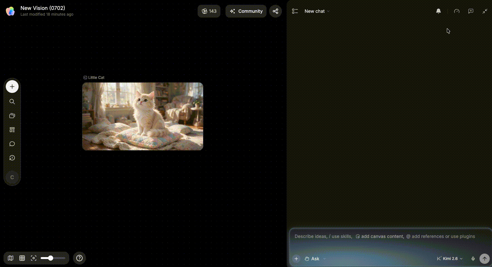
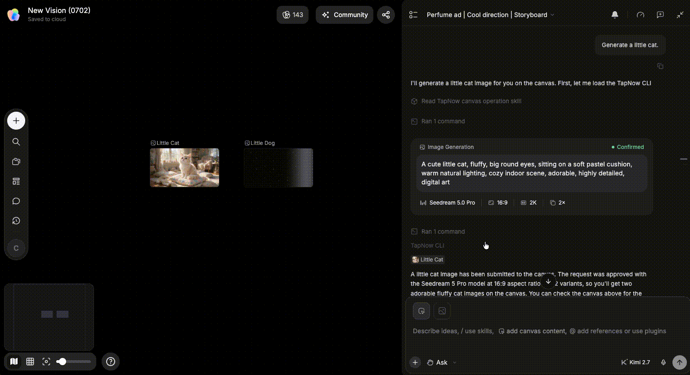
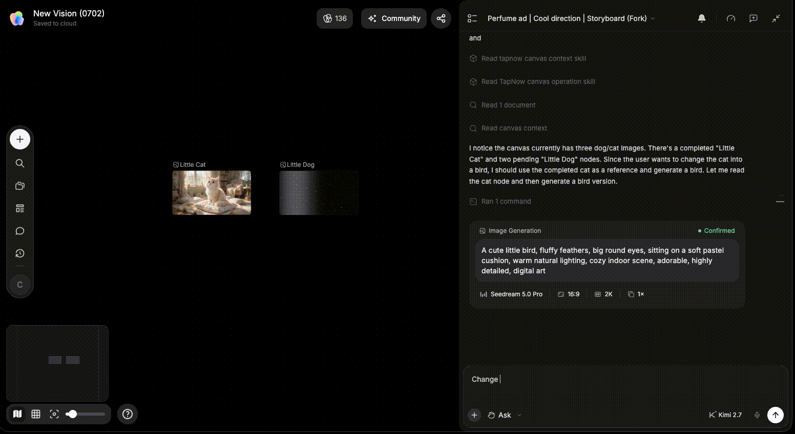

# 管理对话

> 来源：https://docs.tapnow.ai/zh/docs/agent/manage-conversations
> 抓取时间：2026-09-23 11:41（离线快照，原文见链接）

# 管理对话

查看、新建和分叉 Agent 对话，并用 Queue 安排接下来要处理的任务。

假设你先在一张画布里尝试两个广告方向，后来又开始整理交付文件。建议为这三件事分别建立对话：

- `香水广告｜冷调方向｜分镜`
- `香水广告｜暖调方向｜分镜`
- `发布版｜字幕与交付检查`

打开历史记录，可以回到其中任何一段对话，继续查看当时发送的指令、Agent 的处理过程和已经得到的结果。画布上的节点和文件仍然保留在同一张画布中，新对话也可以继续引用。

## 什么时候新建对话？

- 开始一个与当前方向无关的任务；
- 旧对话中积累了互相冲突的要求；
- 想保留现有结论，但不再带入所有历史信息；
- 需要为不同交付物建立独立记录。

新建后，把这次任务需要的节点和附件重新加入对话，例如当前 Brief、已经确认的脚本和产品标准图。

Agent 不会自动判断旧对话中的哪些要求仍然有效。开始时，用一句话说明新对话的目标，并只引用当前版本的资料。

## 什么时候使用分叉？

如果前面的讨论和资料都可以继续使用，只想从某条消息开始尝试另一种方案，可以使用分叉。例如：

- 同一脚本分别尝试写实和动画方向；
- 保留相同角色，测试不同场景；
- 从已确认的分镜开始，制作不同时长版本。

分叉后的对话会保留分叉点之前的消息。原对话可以继续保留，新的方案也有独立的后续记录。

如果目标、资料来源或最终交付内容都变了，直接新建对话会更清楚。

## 哪些内容要保存到画布？

方向、脚本、角色标准、产品规则和最终参数确认后，可以整理成画布节点或文件：

1. 把最终结论与讨论过程分开；
2. 给节点标明“已确认”“待确认”或“旧版本”；
3. 新对话只引用当前有效内容；
4. 放弃的候选留作历史，但不要继续作为生成输入。

以后打开新对话时，直接引用这些节点，Agent 就能读取当前使用的版本，不需要你重新翻找整段聊天记录。

## Agent 运行时还能做什么？

- ****停止****：发现目标或参考错误时立即停止，避免继续消耗。
- ****加入 Queue****：Agent 正在处理任务时，可以继续发送下一条指令。新指令会进入 Queue，等当前任务完成后再执行。
- ****继续整理画布****：Agent 运行期间，你仍然可以移动节点、检查资料或准备下一步需要的内容。

例如，Agent 正在生成四张分镜时，你可以继续发送：

> 四张分镜生成完成后，按镜头 01—04 命名，并在画布上排成一行。

这条指令会显示在 Queue 中，不会打断正在生成的分镜。Queue 中有多条指令时，Agent 会按照发送顺序处理。

如果当前任务使用了错误的目标或参考，先停止任务，再修改资料和指令。不要同时加入互相冲突的要求，例如先要求保留背景，随后又要求删除背景。

## 任务失败后先检查什么？

1. 查看任务状态和页面显示的错误信息；
2. 检查网络连接与账户 Tapies；
3. 确认引用的节点或附件仍可访问；
4. 缩小任务，只执行一个生成步骤；
5. 根据错误信息更换可用模型、修正参数，或稍后重新发送任务；
6. 保留错误信息和画布链接，联系支持。

建议

给对话起能说明目标的名称，例如“香水广告｜冷调方向”，比“新对话 3”更容易在几天后继续。

下一步：[Apps](/zh/docs/agent/apps)

[上一页选择生成模式](/zh/docs/agent/choose-a-generation-mode)

[下一页Apps](/zh/docs/agent/apps)
