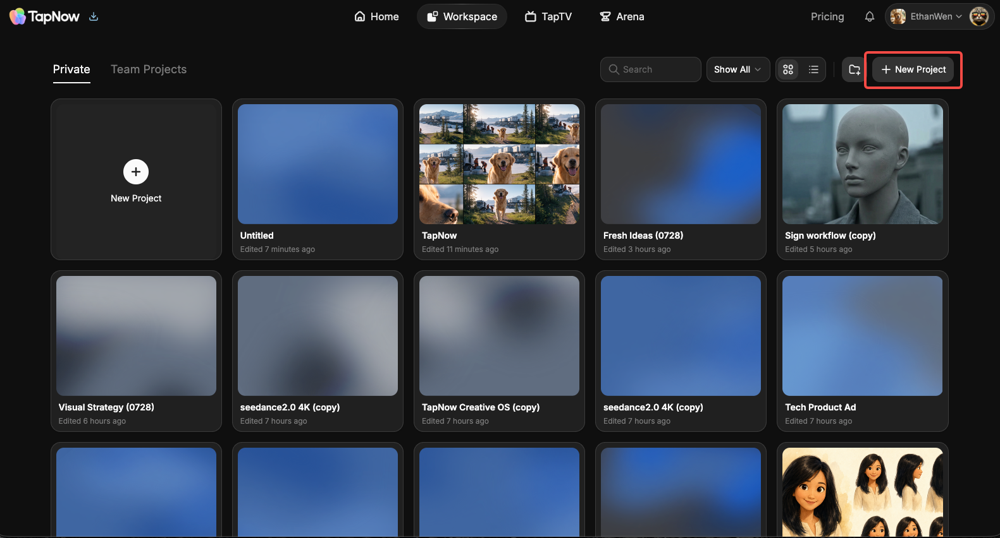
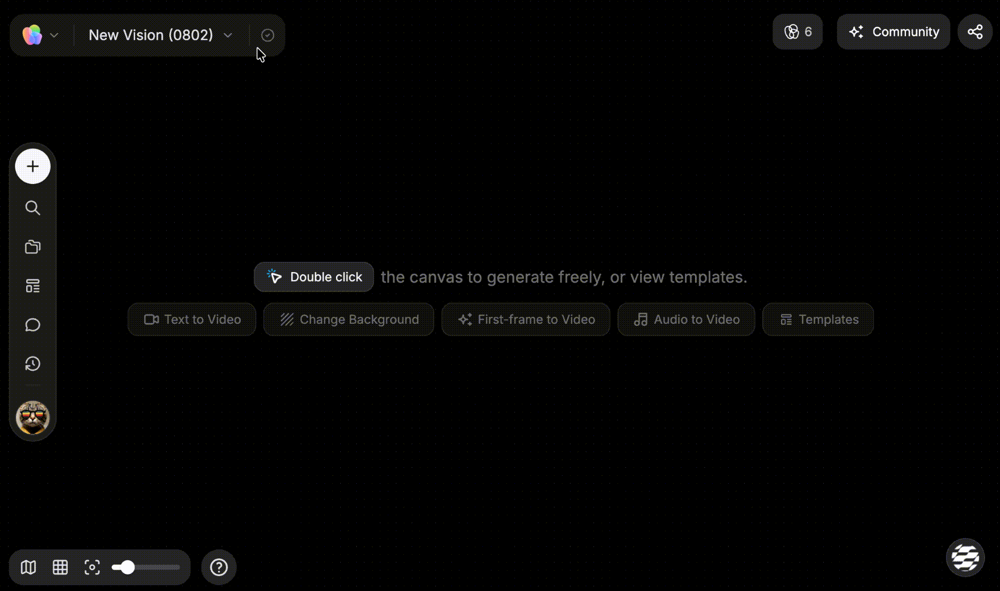

# 管理画布

> 来源：https://docs.tapnow.ai/zh/docs/projects/manage-canvases
> 抓取时间：2026-09-23 11:41（离线快照，原文见链接）

# 管理画布

在画布首页新建、查找和整理画布，进入画布后也可以从左上角直接切换。

每次开始新的创作，都可以新建一张画布。Creative OS 会自动保存画布中的节点、连线、Agent 对话和生成结果。回到画布首页后，可以继续打开之前的内容。

画布会显示在两个位置：

- ****个人画布****：只有你可以直接打开和编辑；
- ****团队画布****：当前团队的成员可以进入并一起编辑。

## 1. 新建画布

1. 打开 Creative OS 首页；
2. 点击右上角的****新建画布****；
3. 一张空白画布会自动打开；
4. 点击左上角的画布名称，输入一个方便之后查找的名字，再按 `Enter` 保存。

也可以在首页直接向 Agent 发送任务。Creative OS 会创建一张画布，并把这次对话和 Agent 生成的内容保存在画布上。

## 2. 找到之前的画布

画布多起来后，可以使用右上角的搜索、筛选和排序：

| 你要找什么 | 怎么操作 |
| --- | --- |
| 已知名称的画布 | 在搜索框中输入画布名称 |
| 只看画布或文件夹 | 打开筛选，选择对应内容类型 |
| 最近修改的画布 | 选择****按最近修改****和****最新优先**** |
| 较早创建的画布 | 选择****按创建日期****和****最早优先**** |
| 切换显示方式 | 使用网格或列表视图 |

查找团队里的画布时，先切换到****团队画布****。个人画布和团队画布会分别显示。

## 3. 切换画布

已经进入一张画布时，不需要先回到首页：

1. 点击左上角当前画布名称旁的箭头；点击 TapNow 标志会直接返回画布首页；
2. 下拉列表打开后，当前画布右侧会显示勾选标记；
3. 点击另一张画布。TapNow 会先保存当前修改，再打开所选画布；
4. 左上角名称和画布内容更新后，表示切换完成。

画布较多时，在顶部的****搜索画布****中输入画布名称。搜索范围与当前画布一致：当前是个人画布时，只搜索个人画布；当前是团队画布时，只搜索当前团队的画布。列表中如果出现收藏夹，点击收藏夹可以展开其中的画布。

需要直接开始新内容时，点击下拉列表底部的****新建画布****。新画布会创建在当前的个人或团队空间中，并直接打开。它不会自动放进当前收藏夹。

画布正常保存时不会持续显示状态。看到红色警告时，点击图标重试保存，再重新切换。如果切换失败，你仍会留在当前画布，稍后可以再次尝试。

## 4. 重命名画布

已经进入画布时，点击左上角的画布名称，直接输入新名称并按 `Enter`。在画布首页，也可以点击画布卡片上的 `···`，或右键点击画布，再选择****重命名****。

名称只需要让你之后认得出来，例如：

- `户外音箱广告`
- `香水短片分镜`
- `角色设定测试`

画布较多时，把产品、内容或客户名称写进去，会更容易通过搜索找到。

## 5. 使用文件夹整理画布

点击画布首页右上角的文件夹按钮，可以新建文件夹。

把画布放入文件夹有三种方式：

1. 在画布菜单中选择****移动至…****；
2. 进入选择模式，选中多张画布后点击****添加到文件夹****；
3. 按住画布卡片，把它拖进已有文件夹。

在画布首页，把一张画布拖到另一张画布上，也可以创建一个新文件夹并放入这两张画布。

文件夹只负责整理，不会改变画布中的节点、连线和内容。

## 6. 把个人画布移到团队

需要和团队成员一起编辑时：

1. 在****个人画布****中找到要协作的画布；
2. 点击画布卡片上的 `···`，选择****移动至团队****；
3. 在确认窗口中检查目标团队；
4. 点击****移动到团队****；
5. 切换到****团队画布****，打开刚刚移动的画布。

移动完成后，当前团队的成员可以进入并编辑。如果之后选择****移回个人****，团队成员将无法继续访问。

## 7. 分享或删除画布

在画布卡片的菜单中：

- 选择****分享链接****，可以复制一个供他人查看和克隆的链接；
- 选择****删除****，可以删除当前画布；
- 进入选择模式后，可以一次移动或删除多张画布。

删除前请阅读确认窗口。需要保留的图片、视频或音频，可以先从画布下载。

下一步：[使用素材库与模板](https://docs.tapnow.ai/zh/docs/canvas/use-library-and-templates)

[上一页堆叠节点](https://docs.tapnow.ai/zh/docs/canvas/stack-nodes)

[下一页使用素材库与模板](https://docs.tapnow.ai/zh/docs/canvas/use-library-and-templates)
