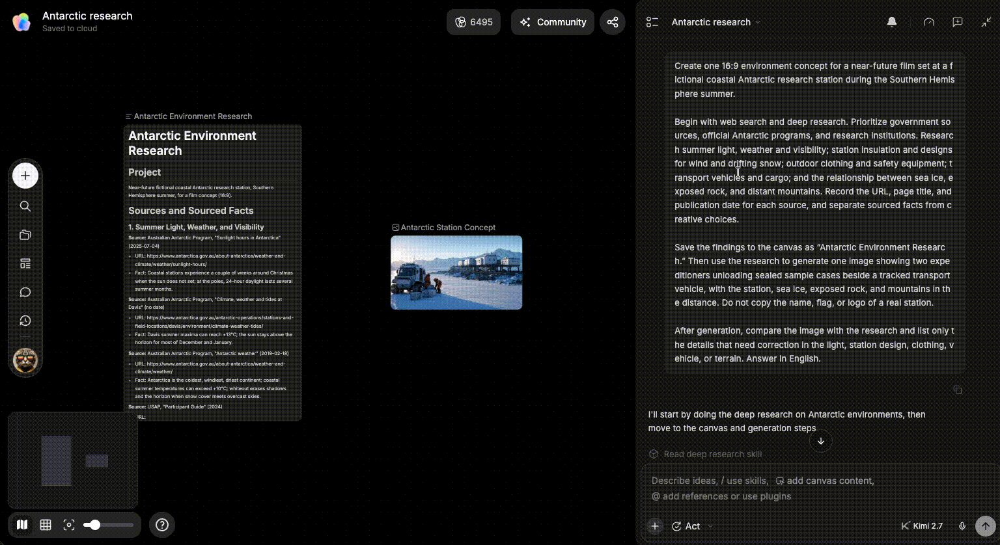

# 网络搜索

> 来源：https://docs.tapnow.ai/zh/docs/agent/web-search
> 抓取时间：2026-09-23 11:41（离线快照，原文见链接）

# 网络搜索

让 Agent 搜索公开网页，查找最新信息、事实和参考资料，并返回来源链接。

TapNow Agent 可以搜索公开网页。当你需要了解最近发生的事情、核对一个事实，或者查找某个产品、地点和作品的资料时，可以直接在对话中让 Agent 搜索。

Agent 会根据你的问题查找相关页面，整理重点，并附上来源链接。你可以打开链接查看原文，再决定哪些信息要继续用于创作。

## 什么时候使用网络搜索？

- 查找最近发布的新闻、产品更新或行业信息；
- 查找品牌官网、机构网站和公开文档；
- 核对人物、地点、时间或事件等具体事实；
- 搜集电影、广告、摄影和美术参考；
- 为脚本、角色、世界观或场景设定补充真实资料。

## 怎样让 Agent 搜索？

在指令中写清下面三件事：

1. ****要找什么****：例如北极新闻、某款产品的官方参数或一个地点的建筑资料；
2. ****时间和范围****：例如最近 7 天、只看官方网站或只查某个国家；
3. ****希望怎样返回****：例如返回 3 条结果，每条附上标题、日期、摘要和链接。

## 复制这个指令试试

复制这个指令试试

复制

搜索今天流行的视觉趋势，找 6 张风格不同的图片作为参考，并把图片放到画布上。每张图片保留来源链接。

Agent 会搜索当天的视觉趋势，将找到的图片放到画布上，并保留对应来源。你可以直接选择其中的图片，继续发展配色、构图或视觉方向。

网络内容可能会更新，也可能包含错误。涉及时间、数字和重要事实时，请打开原文确认来源和发布日期。

下一步：[管理 Agent 产物](https://docs.tapnow.ai/zh/docs/agent/manage-agent-outputs)

[上一页用 Brainstorm 找方向](https://docs.tapnow.ai/zh/docs/agent/find-ideas-with-brainstorm)

[下一页管理 Agent 产物](https://docs.tapnow.ai/zh/docs/agent/manage-agent-outputs)
