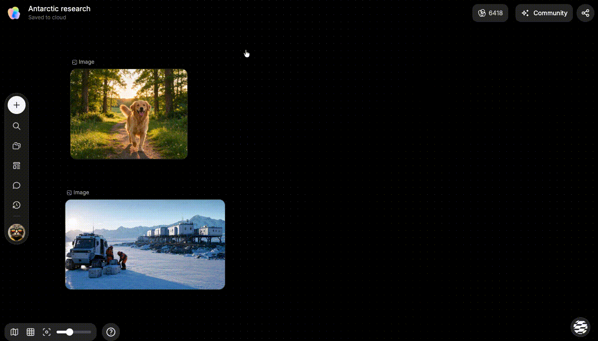

# 认识节点与连接

> 来源：https://docs.tapnow.ai/zh/docs/canvas/understand-nodes-and-connections
> 抓取时间：2026-09-23 11:41（离线快照，原文见链接）

# 认识节点与连接

在画布上创建、选择和移动节点，并用连线把参考内容接到下一步创作中。

画布上的文字、图片、视频和音频都会以节点的形式出现。你可以移动它们、同时选择多个节点，也可以用连线标记后续节点可以参考哪些上游内容。

例如，把一张产品图连接到图片节点后，可以在下游节点的 Prompt 输入框中通过 `@` 引用这张上游图片。

## 1. 创建一个节点

在画布上添加内容有三种常用方式：

| 你想做什么 | 怎么操作 |
| --- | --- |
| 创建文字、图片、视频或音频节点 | 点击画布左侧工具栏的 `+`，再选择节点类型 |
| 在当前鼠标位置创建节点 | 双击画布空白处，再选择节点类型 |
| 添加本地图片、视频、音频或文档 | 点击 `+` 后选择上传，或直接把文件拖到画布上 |

创建完成后，新节点会出现在画布上。图片、视频和音频节点会显示预览；文字节点可以直接输入脚本、画面要求或其他说明。

## 2. 选择和移动节点

- ****选择一个节点：**** 单击节点；
- ****选择多个节点：**** 按住 `Shift`，再依次单击节点；
- ****框选多个节点：**** 从画布空白处拖出选框，把需要的节点框在一起；
- ****移动节点：**** 选中后拖动节点。多选时，拖动其中一个节点会一起移动；
- ****取消选择：**** 单击画布空白处。

整理画布时，可以把参考内容放在左侧，把后续生成结果放在右侧。这样沿着连线查看时，输入和结果会更容易分辨。

## 3. 从一个节点继续创建

这是最简单的连线方法。

1. 单击一个文字、图片、视频或音频节点；
2. 节点两侧会出现 `+`；
3. 点击节点右侧的 `+`；
4. 选择下一步要创建的节点类型；
5. 新节点出现后，原节点与新节点之间会自动建立连线。

例如，选中一张产品图，点击右侧的 `+`，再选择图片节点，就可以从这张产品图继续生成新的图片。

连线的方向表示内容的使用顺序：前面的节点提供输入，后面的节点使用这些输入继续制作。

## 4. 连接两个已有节点

如果两个节点已经在画布上，可以手动把它们连接起来：

1. 先选中提供内容的节点；
2. 从节点右侧的连接点按住并拖动；
3. 把连线拖到要接收内容的节点上；
4. 松开鼠标或触控板，看到连线后即表示连接成功。

连线表示两个节点之间存在参考引用关系。前面的节点是上游内容，后面的节点可以在生成时引用它。

以图片为例，建立连线后：

1. 打开下游节点的 Prompt 输入框；
2. 输入 `@`；
3. 从列表中选择已经连到这个节点的上游图片；
4. 图片出现在输入框中后，再补充你希望怎样使用它。

例如，可以输入：`@产品正面图 保持瓶身、标签和颜色不变，放在夜间露营场景中。`

生成前检查输入框中的 `@` 引用，确认本次要参考的图片已经选中，也没有带入不需要的上游内容。

部分节点类型不能互相连接。松开后没有出现连线时，通常表示这两个节点的类型不适合作为同一条生成链路。

需要删除连线时，单击连线将它选中，再按 `Delete` 或 `Backspace`。删除连线只会取消两个节点之间的关系，不会删除节点里的内容。

## 5. 同时使用多个节点

当下一步需要同时参考多份内容时，可以一次连接多个节点。

1. 按住 `Shift`，选中所有要使用的节点；
2. 从选区右侧的 `+` 拖到画布空白处；
3. 在菜单中选择要创建的节点类型；
4. Creative OS 会创建新节点，并把刚才选中的内容全部连接过去。

例如，可以同时选中产品图和一段文字要求，再创建图片节点。新的图片节点会收到两条连线。开始生成前，可以在 Prompt 输入框中确认本次需要引用的上游内容。

## 6. 复制、删除和撤销

| 操作 | Mac | Windows |
| --- | --- | --- |
| 复制选中的节点 | `⌘ C` | `Ctrl C` |
| 粘贴节点 | `⌘ V` | `Ctrl V` |
| 删除选中的节点或连线 | `Delete` / `Backspace` | `Delete` / `Backspace` |
| 撤销上一步 | `⌘ Z` | `Ctrl Z` |
| 重做 | `Shift ⌘ Z` | `Ctrl Shift Z` |

想尝试新的方向，又需要保留当前结果时，可以先复制节点，再从副本继续修改。

## 跟着做一次

下面用一张产品图生成新的广告画面：

1. 把产品图拖到画布上；
2. 双击空白处，创建一个文字节点；
3. 在文字节点中写下：`保持产品外观不变，放在夜间露营场景中，画面为 16:9`；
4. 按住 `Shift`，同时选中产品图和文字节点；
5. 从选区右侧的 `+` 拖到空白处，选择图片节点；
6. 检查新图片节点是否同时收到两条连线；
7. 选择模型和画面比例后开始生成。

实际生成图片、视频或音频时，会根据所选模型和参数正常消耗 Tapies。

完成后，画布上应该能看到两项输入、一项生成结果，以及从输入指向结果的连线。接下来继续生成视频时，可以从这张结果图右侧的 `+` 创建视频节点。

下一步：[上传文件并放入画布](https://docs.tapnow.ai/zh/docs/canvas/upload-files-to-the-canvas)

[上一页认识画布](https://docs.tapnow.ai/zh/docs/canvas/explore-the-canvas)

[下一页上传文件并放入画布](https://docs.tapnow.ai/zh/docs/canvas/upload-files-to-the-canvas)
