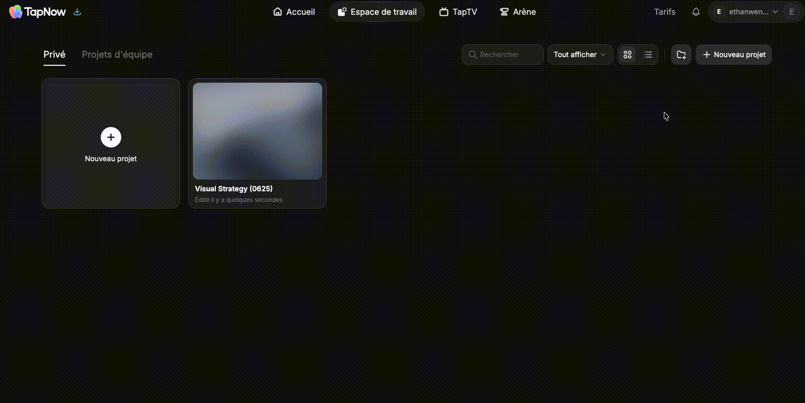

# 设置语言

> 来源：https://docs.tapnow.ai/zh/docs/account/set-your-language
> 抓取时间：2026-09-23 11:25（离线快照，原文见链接）

# 设置语言

在个人设置中更换 Creative OS 的界面语言。

你可以在个人设置中更换 Creative OS 的按钮、菜单和系统提示语言。

## 更换界面语言

1. 点击页面右上角的头像；
2. 点击 ****账户管理****；
3. 在 ****通用设置**** 中打开 ****个人设置****；
4. 找到 ****语言****，选择需要使用的语言。

Creative OS 目前提供 English、简体中文、日本語、한국어 和 Français。选择后页面会自动刷新，并使用新的界面语言。

更换语言不会翻译画布中已经输入的文字、上传的文件或生成的内容。

[上一页查看站内信](/zh/docs/account/view-notifications)

[下一页管理团队与权限](/zh/docs/account/manage-teams-and-permissions)
