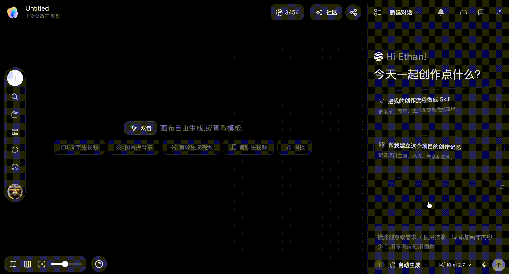
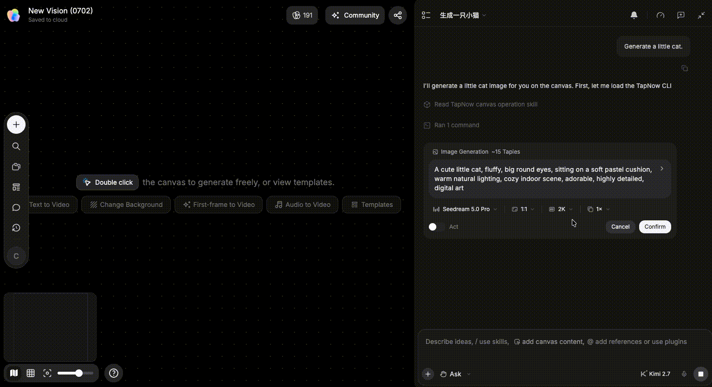

# 选择生成模式

> 来源：https://docs.tapnow.ai/zh/docs/agent/choose-a-generation-mode
> 抓取时间：2026-09-23 11:41（离线快照，原文见链接）

# 选择生成模式

了解 Agent 在画布上生成图片、视频和音频时，什么时候直接执行，什么时候先等你确认。

在 Creative OS 中，你可以直接告诉 Agent：“帮我生成两张 16:9 的产品图”“把这张图片做成 5 秒视频”或“为这段画面生成背景音乐”。Agent 会根据任务选择合适的图片、视频或音频模型，准备画面比例、视频时长、生成数量等参数，再调用模型，把生成结果放到画布上。

开始生成前，你可以选择两种工作方式：

- ****自动生成****：Agent 准备好模型和参数后直接开始生成，不需要你每次点击确认；
- ****手动确认****：Agent 先显示一张确认卡片。你可以检查或修改模型和参数，点击“生成”后，Agent 才会开始生成。

如果你希望 Agent 连续完成一段工作，可以使用自动生成。如果你想在每次生成前看一眼模型、比例、时长和数量，可以使用手动确认。

无论使用哪种模式，每次实际调用模型生成图片、视频或音频，都会根据所选模型与参数正常消耗 Tapies。手动确认只是让消耗发生在你点击“生成”之后，不会免除本次生成的消耗。

## 自动生成：Agent 直接继续

自动生成时，Agent 会根据你的任务、画布参考和当前上下文选择模型与参数，然后直接开始生成。生成的图片、视频或音频会继续出现在画布上，中间不会逐次请求确认。

它适合已经说清目标的长流程任务。例如：先整理一份 Brief，再写脚本、生成分镜，最后继续生成素材。你不需要在每一步都调整参数，Agent 可以连续把任务往下推进。

开始前，先确认三件事：

- 任务范围已经明确；
- 引用的产品图、角色图或文档是正确版本；
- 生成数量和输出规格符合你的预期。

适合已经验证过的流程

自动生成会省去等待确认的步骤，也会更快开始模型生成并消耗 Tapies。第一次尝试一个新方向，或参考资料还在变化时，建议先使用手动确认。

## 手动确认：先看确认卡片，再决定生成

手动确认时，Agent 不会立刻调用模型。它会先生成一张****确认卡片****，把这次准备执行的生成设置放在卡片里。

你可以在确认卡片中查看或调整：

- 使用哪个模型；
- 图片比例、视频时长或其他生成参数；
- 生成数量；
- 本次使用的图片、视频、音频或文件参考。

确认无误后，点击“生成”。这一步之后，Agent 才会调用模型并把结果生成到画布上。需要修改时，先在卡片里改参数，或者回到对话中补充要求，再重新确认。

手动确认适合第一次制作某个内容、需要严格保持产品或角色一致、要生成长视频或批量素材，以及任何你想先检查模型和参数的任务。

生成音频时，确认卡片会根据当前模型显示可用设置。常见选项包括服务商和模型、时长、音色、稳定性、提示词影响程度，以及自动歌词、自定义歌词或纯音乐。使用 Seed Audio 时，还可能看到采样率、速度、音高和音量。只调整当前任务需要的项目；点击“生成”后才会调用模型并消耗 Tapies。

## 该选哪一种？

| 你的情况 | 建议方式 |
| --- | --- |
| 已经验证过流程，想让 Agent 连续完成多步 | 自动生成 |
| 第一次尝试新模型、新参考或新方向 | 手动确认 |
| 需要在生成前调整比例、时长、数量或模型 | 手动确认 |
| 已经明确规格，只想快速制作一组同类素材 | 自动生成 |

两种模式都可以随时切换。先用手动确认跑通一次，再把稳定的流程切到自动生成，通常会更顺手。

下一步：[管理对话](/zh/docs/agent/manage-conversations)

[上一页和 Agent 对话](/zh/docs/agent/chat-with-agent)

[下一页管理对话](/zh/docs/agent/manage-conversations)
