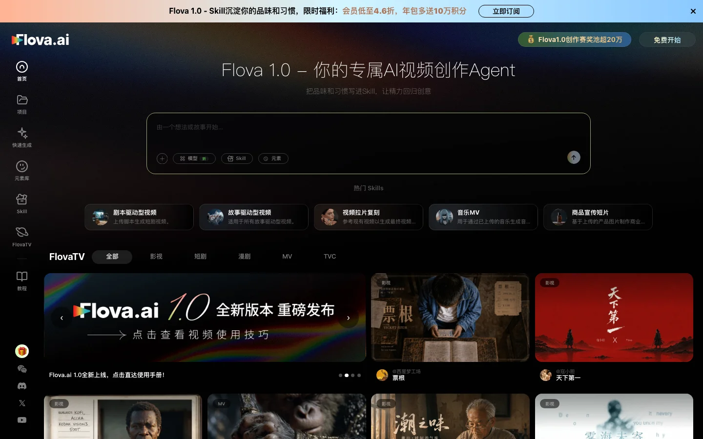

# 什么是 Flova AI？

> 来源：https://www.flova.ai/zh-CN/docs/introduction/understanding-flova/
> 抓取时间：2026-09-23 11:47（离线快照，原文见链接）

# 什么是 Flova AI？

Flova 是一个 AI 原生的视频创作 Agent 平台。你可以用自然语言表达创作诉求，也可以上传文本、图片、视频或音频作为参考；接下来由 Agent 在多步规划与执行中，把项目从构思推进到成片。这个过程覆盖剧本创作、分镜设计、图片 / 视频 / 音频生成，以及剪辑时间线组装；Agent 会持续根据你的反馈调整，直到得到最终视频。

Flova 首页：输入一句话，即可开始创作

Flova 集成了主流的图像、音乐、视频生成模型，以及用于理解与调度的语言模型。项目级记忆会持续记录剧本、分镜、素材与剪辑的当前状态，让你可以反复修改中间环节，而不必担心过程变乱。你也可以把创作习惯、审美和流程写成 Skill，让 Agent 按同一套标准执行。除了在右侧对话里指挥 Agent，你也可以在工作台直接手动操作或局部 AI 生成，实现人机同屏、多线并行协作。

## Flova 适合谁

Flova 面向想用 AI 制作视频的人：从第一次尝试 AI 视频，到已经有剧本、素材和制作流程的专业创作者，都可以在同一个项目里推进创作。

****个人爱好者****

- AI 视频新手尝试不同模型效果，学习从想法到成片的完整流程
- 独立创作者制作 AI 短片、音乐 MV、社媒视频或兴趣向作品

****品牌、营销与商业创作者****

- 小品牌、卖家制作产品展示、广告片或活动预告
- 营销人员制作 campaign 视频、竖屏广告和多版本创意素材
- 内容团队用有限素材快速生成、对比和迭代不同视频方向

****AI 影像创作者与专业制作团队****

- AI 短片、短剧专业团队的创作者，需要持续打磨角色、分镜和镜头表现
- 使用AI制作广告、商用短片从业者，需要在项目周期内稳定产出符合品牌要求的视频内容

## 用 Flova 能做什么

Flova 支持多种 AI 视频与影像内容创作，从早期灵感探索到完整成片都可以在项目里推进。

- ****AI 短片与短剧****：原创短片、连续剧情、微短剧和角色驱动的故事内容
- ****音乐与情绪向视频****：音乐 MV、情绪片、氛围短片和视觉类内容
- ****广告与营销视频****：品牌广告、活动预告、促销 campaign、产品展示和卖点讲解视频
- ****社媒与竖屏内容****：口播讲解、热点短视频、账号内容和适合社交平台发布的视频
- ****素材探索与单点生成****：风格探索图、角色设定、氛围板、单个 AI 镜头和图片素材
- ****半成品补充与组接****：已有实拍、粗剪或外部素材项目中的镜头补充、片段生成和成片组接

## Flova 如何运转

一个目标下的视频创作往往是连续且长时间的，过程中会留下多次取舍的各种资产，中间产物越积越多。Flova 是按「可延续的创作过程」来设计他的记忆系统，他能了解你的这次目标里的创作过程和当前状态，来推进创作持续进行。

****有序规划****

复杂的视频创作任务里很多环节前后衔接，后面的环节会依赖前面已经定下来的结果。Flova 会结合项目结构理解这些依赖，规划先后顺序，让后置生成建立在你已选定的前置成果上，而不是各步孤立进行。每个中间环节都可以生成多个版本，方便你对比和挑选；选定或修改之后，后续规划会在你当前这一版上继续执行。通过多轮迭代、前后依赖和过程里的版本管理，整条链路更可追踪、更可调整，整体结果也更可控。

****你的判断会被记住****

对于过程资产的反复创作，你的意见，你的修改、最终选定等行为会都被写进项目上下文，并有结构的组织。后续生成会记住你的偏好，而不必反复解释「要刚才那种感觉」。执行类工作（素材整理、时间线组装、调用模型等）由 Agent 推进；故事往哪走、关键镜头用哪一版，由你决定。

****创作流程灵活****

不必固定从某一种流程来创作，比如不一定先创建故事板，再根据故事板生成素材。也可以先探索风格与角色的图片，生成完后再并入正式设计故事板；或从外部导入已有资产，只补充后续项目里需要继续生成的资产。

****经验可复用（Skill）****

你可以把习惯、审美和制作流程写成 Skill，跑通测试后，交给 Agent 按此执行。Skill 可查看、可修改，在同项目或下一个项目里反复使用，减少每次从零说明「这次该怎么干」。

****透明与可回退****

操作与生成有记录，工作规则（Skill）对你可见。你知道 Agent 做了什么、能回到更早的状态，才适合长期协作。

[快速入门

Next Page](/zh-CN/docs/introduction/quick-start/)
