<!--
来源: https://reelmate.feishu.cn/wiki/OBQkwpdODilYnpki4fDcwSRtnZe
平台: 飞书文档 (reelmate.feishu.cn)
抓取时间: 2026-09-23 06:04
说明: 该文档禁用了官方导出，内容由浏览器逐块抓取归档；图片已本地化
-->

### 一、链路说明：

TGI 2 分镜单链路，会先生成每段剧情的分镜单，再分镜单入参生成视频。整体能够提升视频的抽卡率，人物站位与构图一致性有提升，降低算力成本，增加可控性。

但是由于模型能力，可能出现分镜单人物漂移问题（换脸/换人/串脸），人物漂移是AI多参融图生成的行业通性问题，无法100%完全规避。

### 二、链路位置：

👉多宫格模式-TGI 2

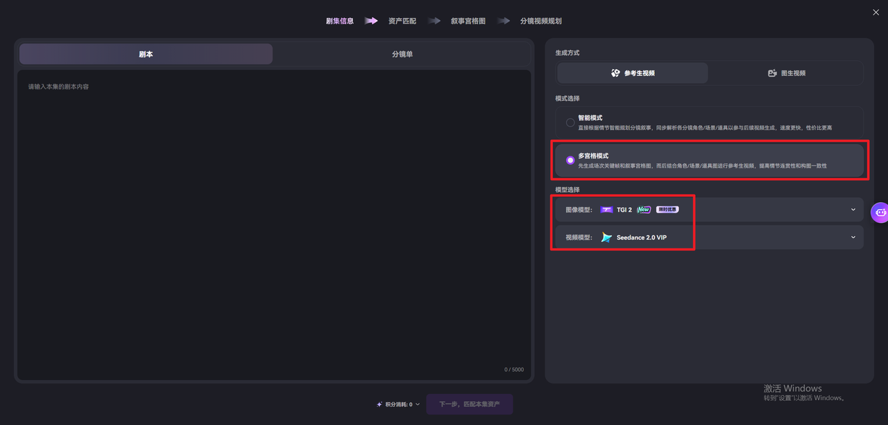

### 三、链路流程：

①分镜单批量生成。

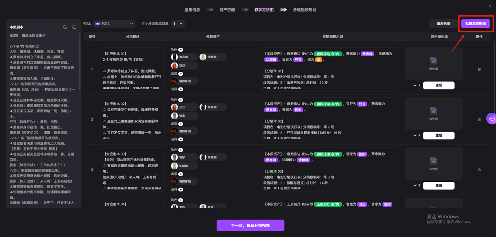

②分镜单中不满意的图，可以选择【AI改图】进行修改，【AI改图】中的可用资产是这个分镜单的资产。

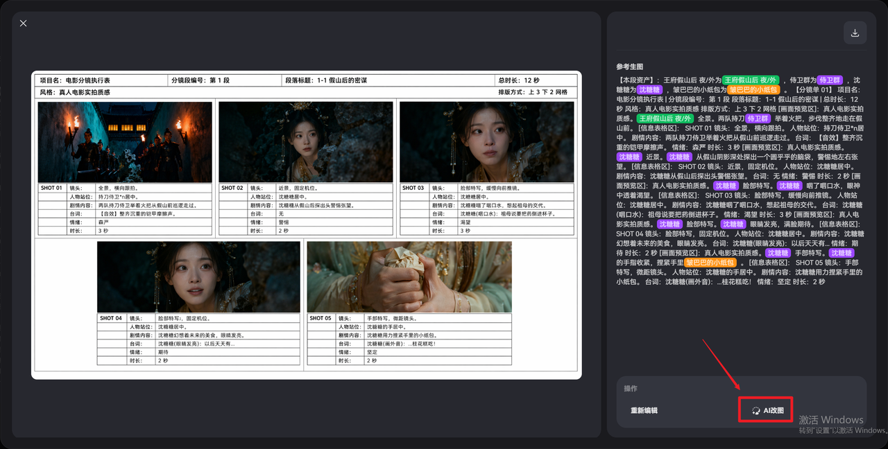

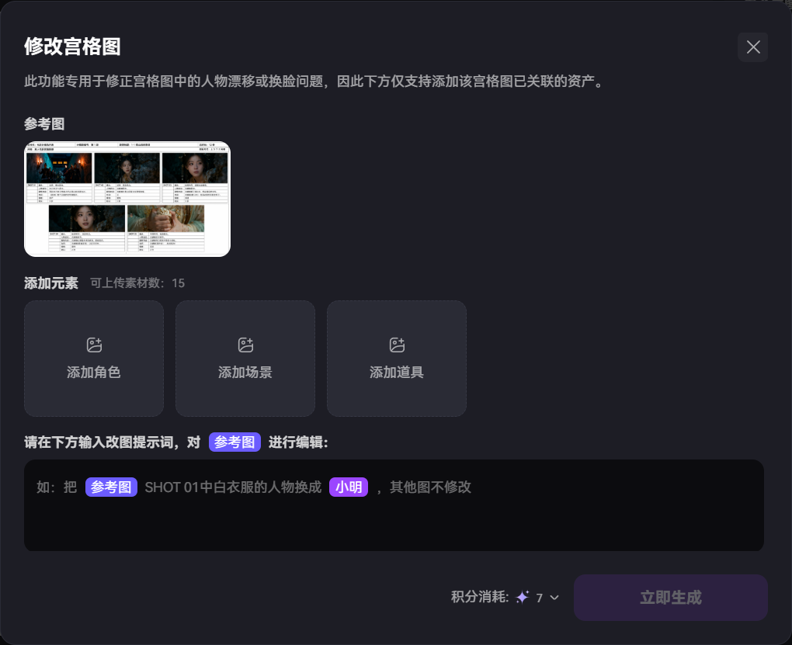

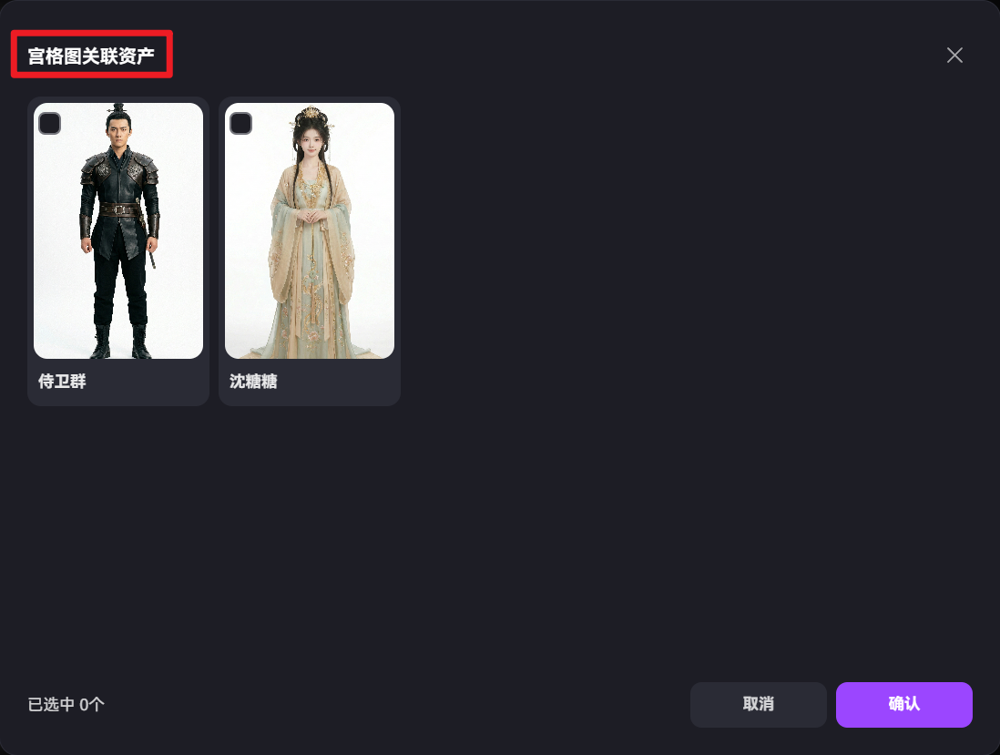

③分镜单生成后，批量保存为主体，等待审核通过，审核通过后分镜单图右上角会出现标签。

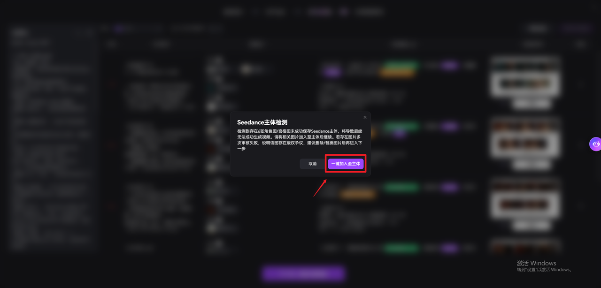

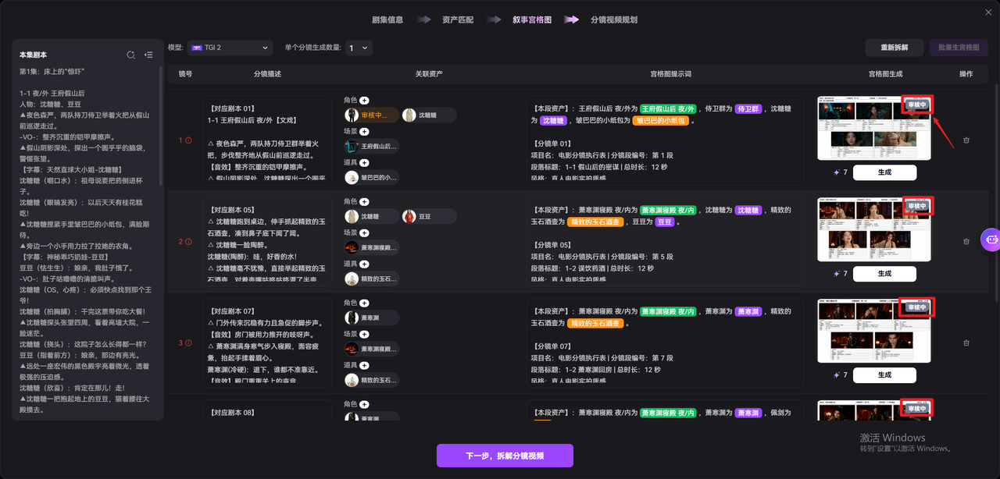

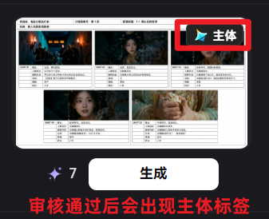

④分镜单审核通过后，可以进入下一步生成视频。

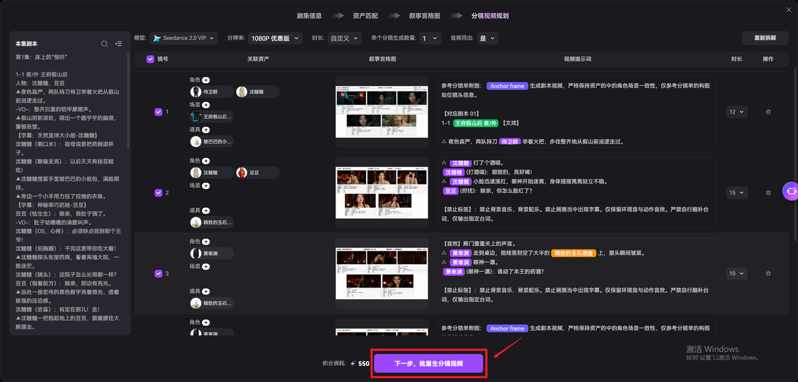

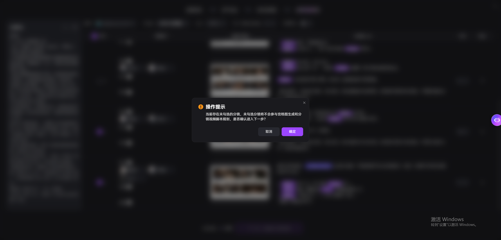

⑤如果还有不想直接生成视频的，可以先不勾选。没有勾选的分镜，会成为草稿。勾选的分镜，会开始生成sd视频。

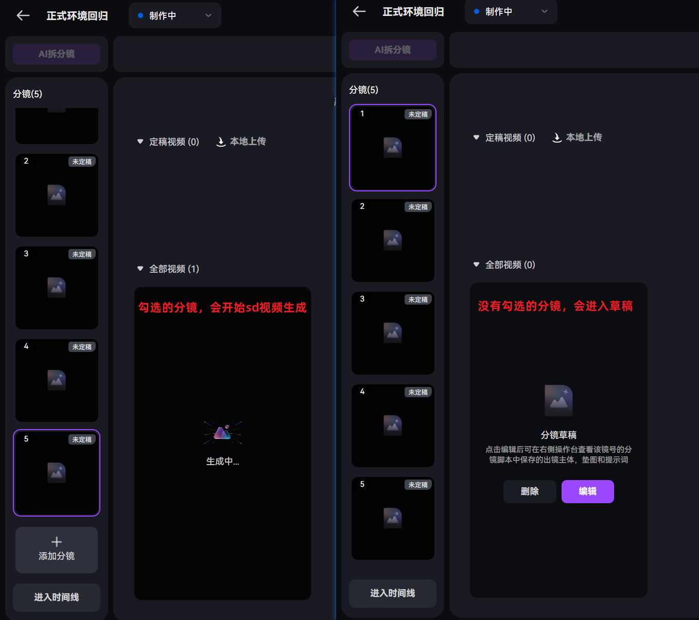

⑥还想修改的分镜单，直接拖拽到参考图位置进行修改（**模型用TGI 2**），修改成功后定稿。

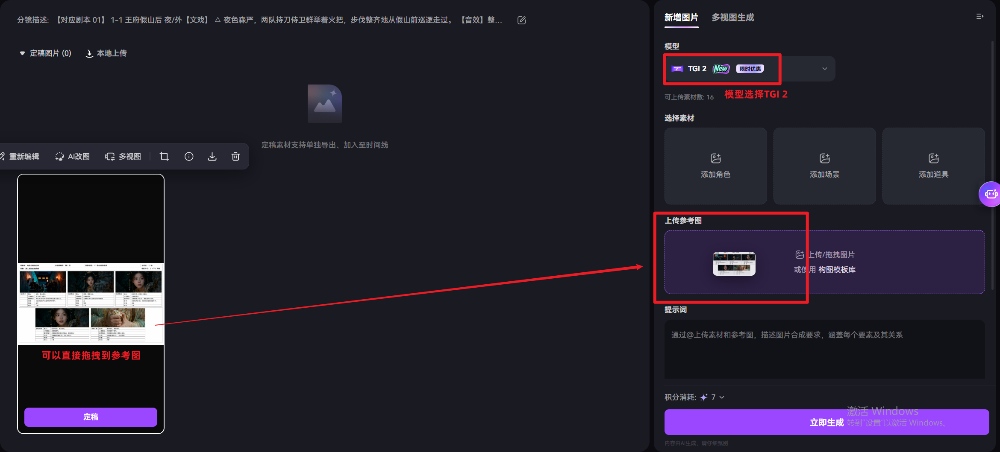

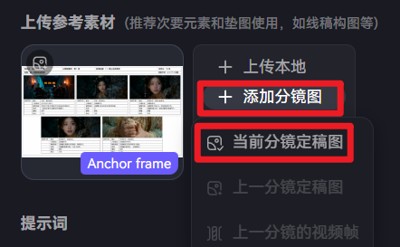

⑦视频草稿，点击添加分镜图，选择当前分镜定稿图。

### 四、分镜单结构：

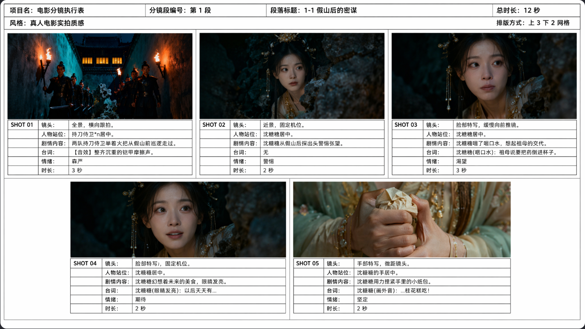

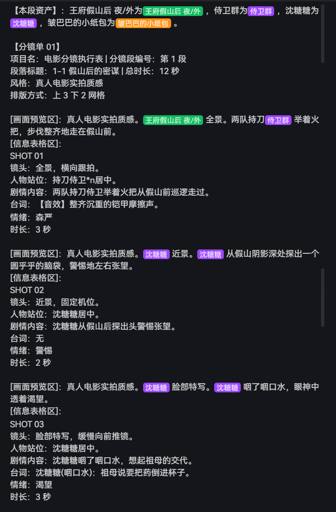

**分镜单提示词结构：**

第一段为这个分镜单生成的所用资产。

后续为每个镜头的提示词，【画面预览区】为该镜头预览图的描述，【信息表格区】为该镜头文字清单。

**分镜单中每个镜头的预览图，不是生视频的首帧图，而是生视频时该段剧情的关键帧**

🔗 嵌入对象

### 五、改分镜单的提示词建议：

🔗 嵌入对象
