# 小云雀创作 Agent 画布使用手册

> 来源：https://xyq.jianying.com/tutorials/creation-agent-canvas
> 抓取时间：2026-09-23 09:21（离线快照，原文见链接）

浏览本页目录

小云雀 · 产品教程

# 小云雀创作 Agent 画布使用手册

## 一、什么是创作Agent画布

[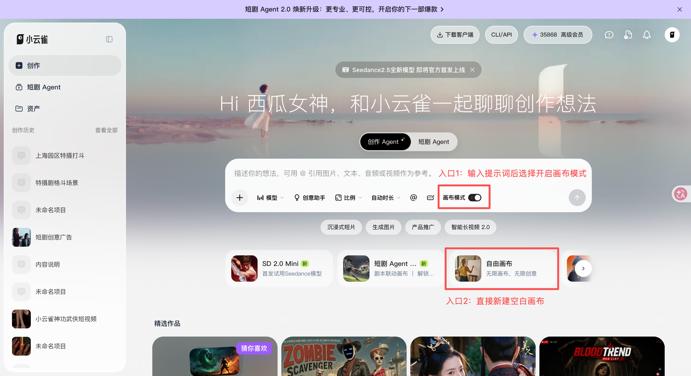](_files_小云雀创作 Agent 画布使用手册/image_1.png)

画布入口

[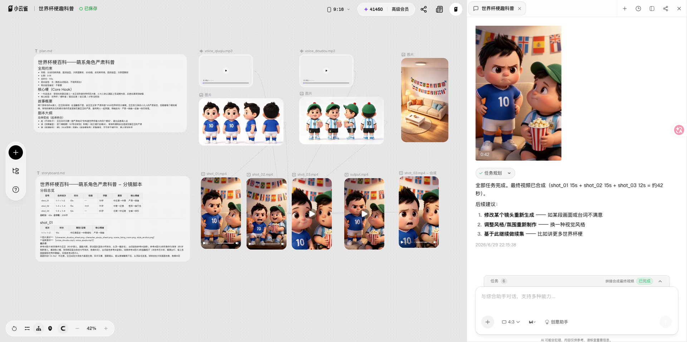](_files_小云雀创作 Agent 画布使用手册/image_2.png)

画布功能

**核心亮点能力：**

- 对话：支持@引用全画布的资产作为参考，可用于检索创意、生成/润色提示词，也可以通过对话直接创作视频图片，并且支持开启多个会话并行完成任务
- 画布：可以自由发挥建立自己的创作工作流，支持精细编辑，帮你完成创作的最后一公里
- 全链路资产同步：资产库 - 画布 - 对话窗口资源同步联动，上下文更丰富，agent对话更聪明

**在创作Agent画布中，你可以完成以下工作：**

1. **添加创作素材：**补充文本、图片、音视频等素材，作为参考输入或灵感来源
2. **编辑核心资产：**可以将已有素材平铺在画布，支持截取/抽帧/抠像/超清等编辑功能
3. **并行推进创作：**多个生成任务可以同时进行，无需切换窗口等待。视频生成中可以新建节点创作下一个视频，或者开启新会话聊聊新想法
4. **沉淀创作过程：**不仅保留最终结果，也保留中间过程和参考依据，便于后续修改、复用和协作

## 二、核心概念说明

1. **对话：**在画布上可通过指令与Agent交流完成创作任务，例如检索创意、生成/润色提示词、生成视频图片。每个画布上都可以开启多个对话

[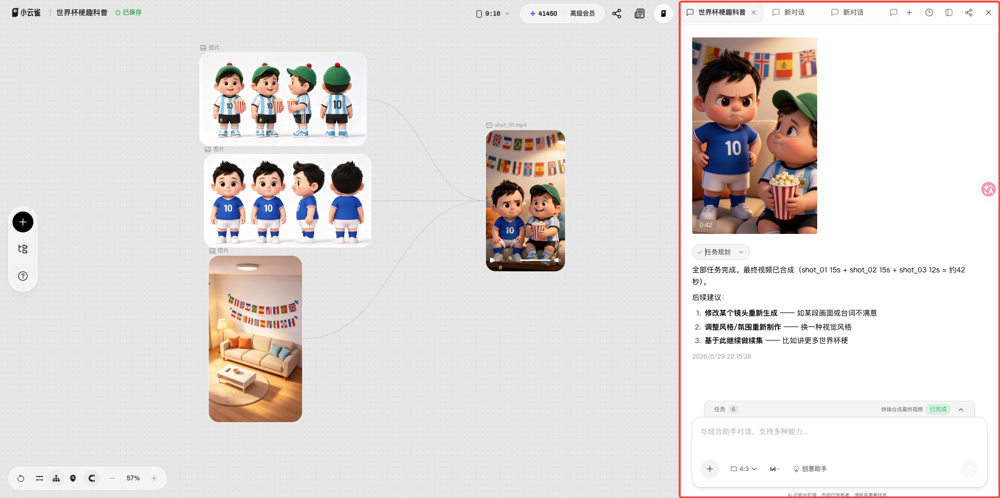](_files_小云雀创作 Agent 画布使用手册/image_3.png)

对话

1. **节点**：画布上的每一个内容单元都为一个节点，不同节点类型承载不同内容

> 例如：文本节点-主要用于暂存提示词、故事线、分镜描述等；图片/视频节点 - 可上传本地文件，或在空节点上使用模型生成

[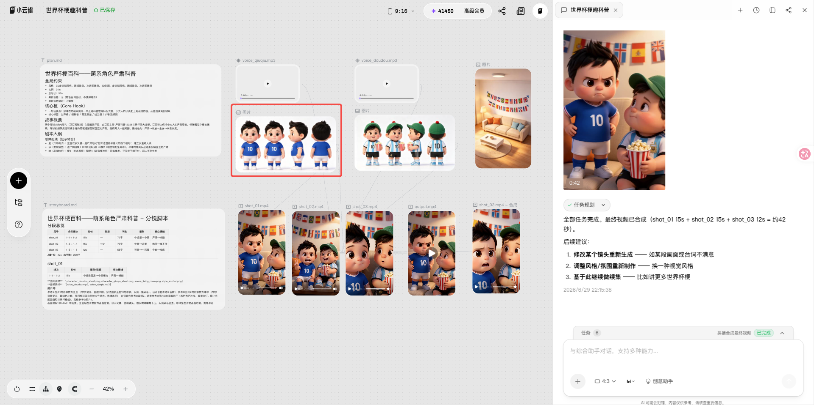](_files_小云雀创作 Agent 画布使用手册/image_4.png)

节点

1. **连线**：节点之间的连线关系，代表引用上下文关系。以一个节点为中心，左侧连接的是当前节点的参考输入，右侧连接的是以当前节点为参考输出

> 例如：文本节点可向右连接至视频图片节点，即：引用当前文本作为提示词进行生成创作；图片可以向右连接至视频节点，即：引用当前图片作为参考生成视频

[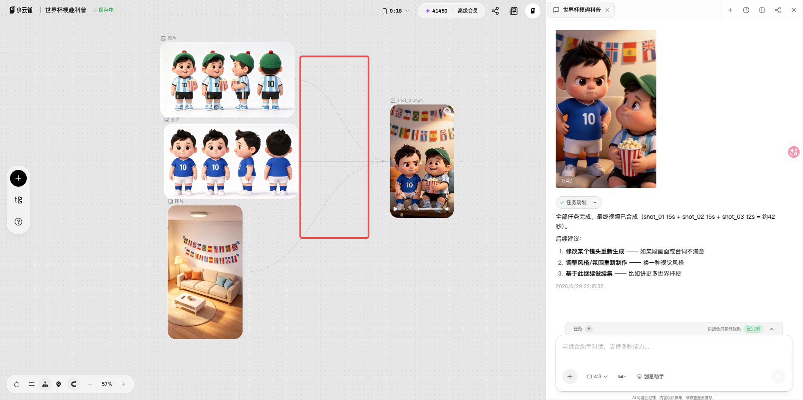](_files_小云雀创作 Agent 画布使用手册/image_5.png)

连线

1. **资产库**：包含最终创作结果、可持续沉淀和复用的内容。其中对话内的「项目资产」入口，为当前对话和画布中所有历史生成、上传过的资产，即使从画布上移除，也可以通过项目资产快速找回

[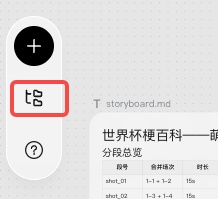](_files_小云雀创作 Agent 画布使用手册/image_6.png)

资产库

## 三、主要功能介绍

### 如何进入创作Agent画布

- 在首页的创作Agent模式下，输入框中可开启画布开关，开启后输入提示词并生成，即可进入画布模式
- 沉浸式短片 模式下也支持开启画布模式
- 输入框下方小工具区域有「自由画布」入口，点击后可进入空白画布

画布入口

### 初次进入画布

在首页输入框输入创作指令后，会进入画布，左侧为空白画布，右侧为Agent对话，对话过程中会根据指令陆续生成创意设计、关键参考图、分镜视频等，生成结果会自动添加到画布上

[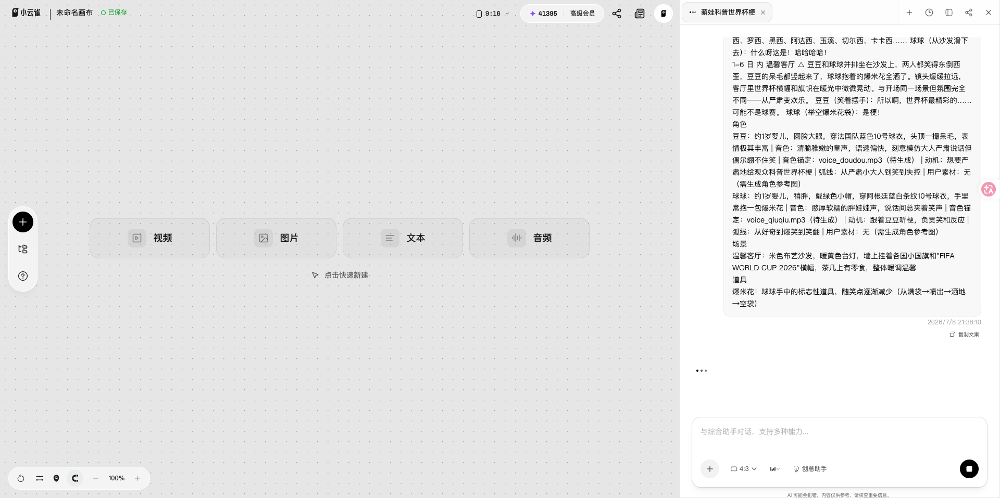](_files_小云雀创作 Agent 画布使用手册/image_7.png)

1.生成中

[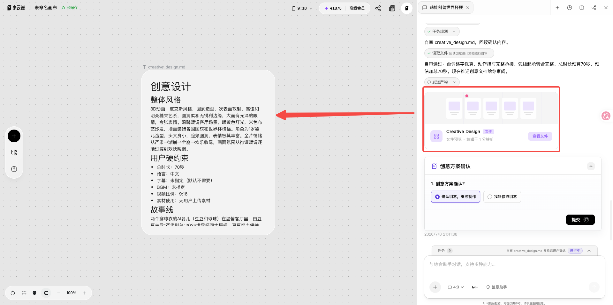](_files_小云雀创作 Agent 画布使用手册/image_8.png)

2.已生成创意设计

[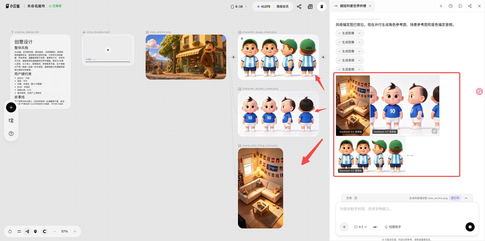](_files_小云雀创作 Agent 画布使用手册/image_9.png)

3.已生成关键参考图

[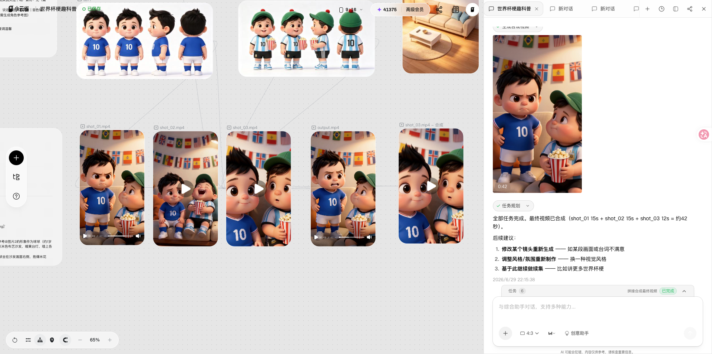](_files_小云雀创作 Agent 画布使用手册/image_10.png)

4.已生成分镜视频并合成成片

如果通过「沉浸式短片」模式开启画布模式，输入提示词并生成后，进入画布会自动带入刚刚提交的生成任务。在等待生成的过程中，可以创建新节点做新视频，或者开启对话讨论后续创意

[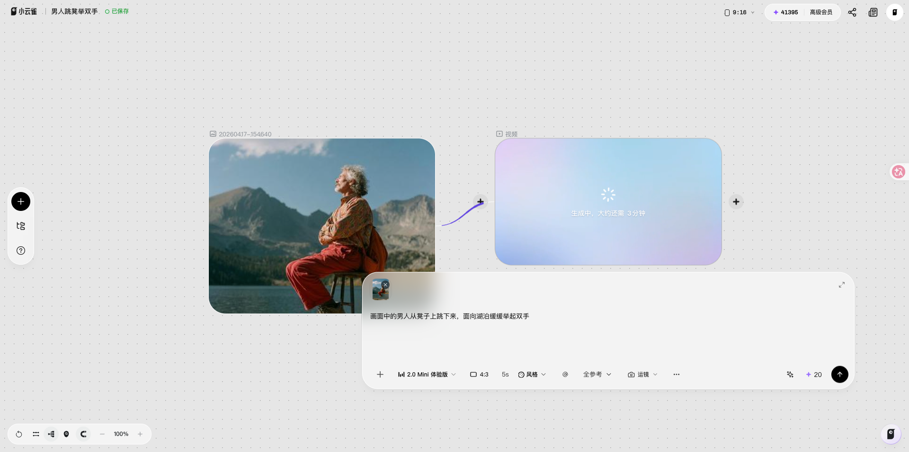](_files_小云雀创作 Agent 画布使用手册/image_11.png)

1.生成中

[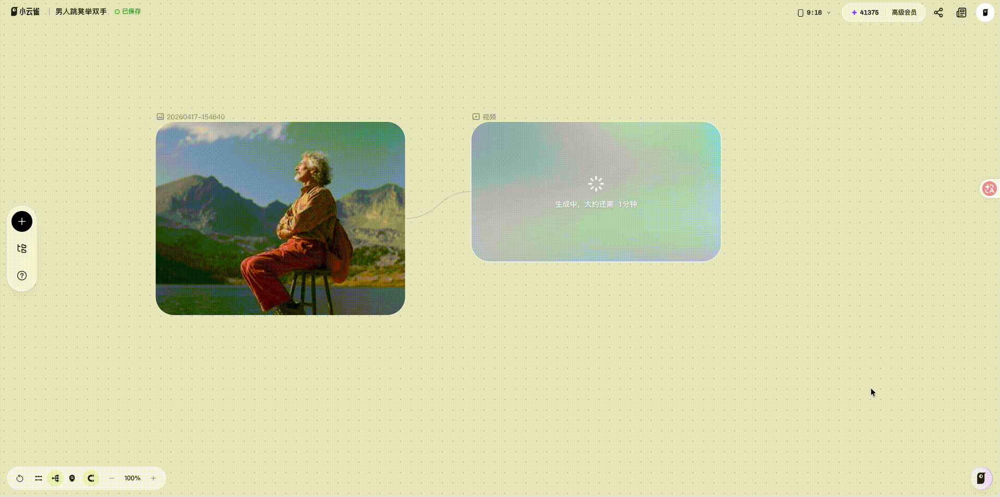](https://p11-seeyou-cn.byteimg.com/tos-cn-i-e844mpvzdi/1c1ffec1e47e4a41aa96f869a60f056a~tplv-e844mpvzdi-compress:q90.image)

2.开启会话

[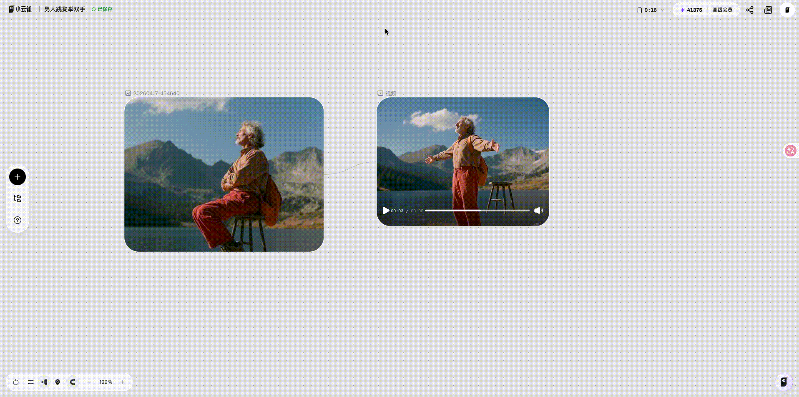](https://p11-seeyou-cn.byteimg.com/tos-cn-i-e844mpvzdi/e91a0c91b12f44ffb1344f201fdb7a94~tplv-e844mpvzdi-compress:q90.image)

3.创建新节点

### Agent对话与创意助手

**💬 基础对话能力：**

- 一个画布上可以发起多个会话窗口并行处理任务，例如萌娃世界杯主题创作，可以分别开启多个会话分别打磨角色形象图、检索最新赛程信息、设计故事分镜等，不需要在一个对话中等待
- 顶部操作栏左侧为多个会话的标签页，右侧为操作功能，从左到右依次是：新建对话、对话历史（标签页关闭后可重新打开历史）、调整会话窗口靠左/右、分享会话、收起

[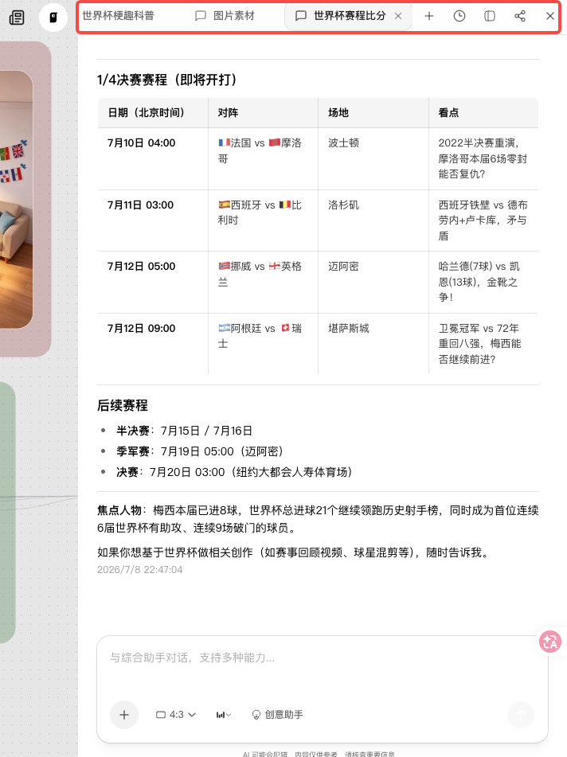](_files_小云雀创作 Agent 画布使用手册/image_14.png)

会话窗口操作栏

[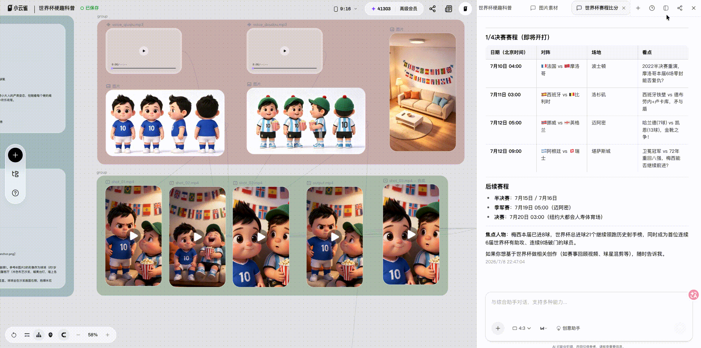](https://p11-seeyou-cn.byteimg.com/tos-cn-i-e844mpvzdi/46be49fda0e4479984d3976f647aafa6~tplv-e844mpvzdi-compress:q90.image)

可根据自己的偏好调节会话窗口位置

💡**创意助手：**

在会话指令输入框中，开启「创意助手」，Agent会为你提供市面上的热点创意，或者继续细化你的想法，成为你的创作好搭子。创意助手模式可以帮你完成：

✔️ 热点检索：聚合dy热点，筛选7天内爆款

✔️ 爆点解析：结构化拆解参考视频的爆款DNA

✔️ 选题方向推荐：结合热点+记忆+参考案例，输出差异化选题

✔️ 创意方案输出：生成完整方案骨架 + 可直接使用的视频Prompt确认方案后，一键进入视频生成流程

[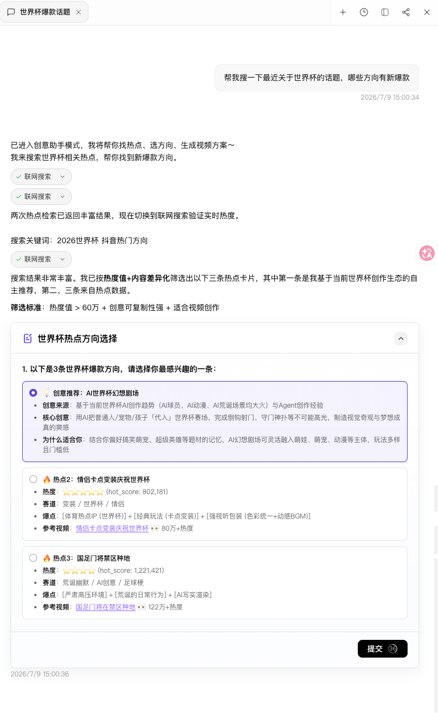](_files_小云雀创作 Agent 画布使用手册/image_16.png)

eg.寻找热门选题

### 使用「@」引用资产作为参考

用好@可以帮助你精准选取素材参考，给模型提供丰富的上下文，提高指令的准确性，实现指哪打哪的效果

@引用素材有以下几种方式：

| **引用到输入框进行对话：** | |
| --- | --- |
| 1. 在会话输入框中先上传素材，再输入@引用已上传素材 | [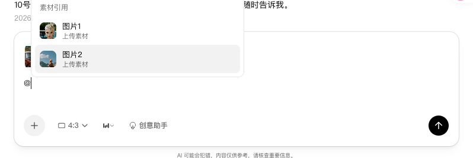](_files_小云雀创作 Agent 画布使用手册/image_17.png)   上传素材后输入@  [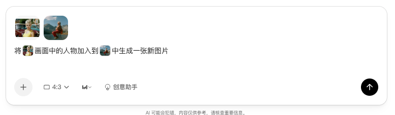](_files_小云雀创作 Agent 画布使用手册/image_18.png)   @素材后补全指令 |
| 1. 直接在输入框中输入@，可以选取历史资产库、角色库、商品库或当前画布中的所有素材 | [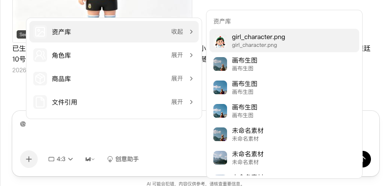](_files_小云雀创作 Agent 画布使用手册/image_19.png)   @-资产库素材  [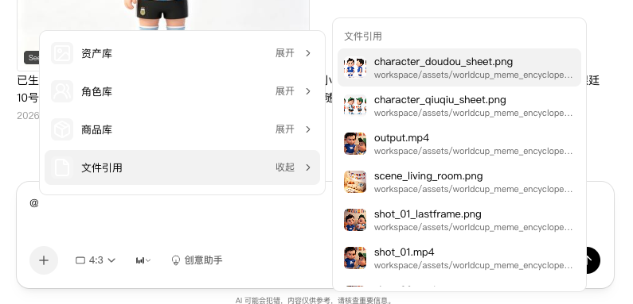](_files_小云雀创作 Agent 画布使用手册/image_20.png)   @-当前画布素材 |
| 1. 将对话前文中已生成的内容，重新引用回输入框，可点击如图所示的「引用到输入框」 | [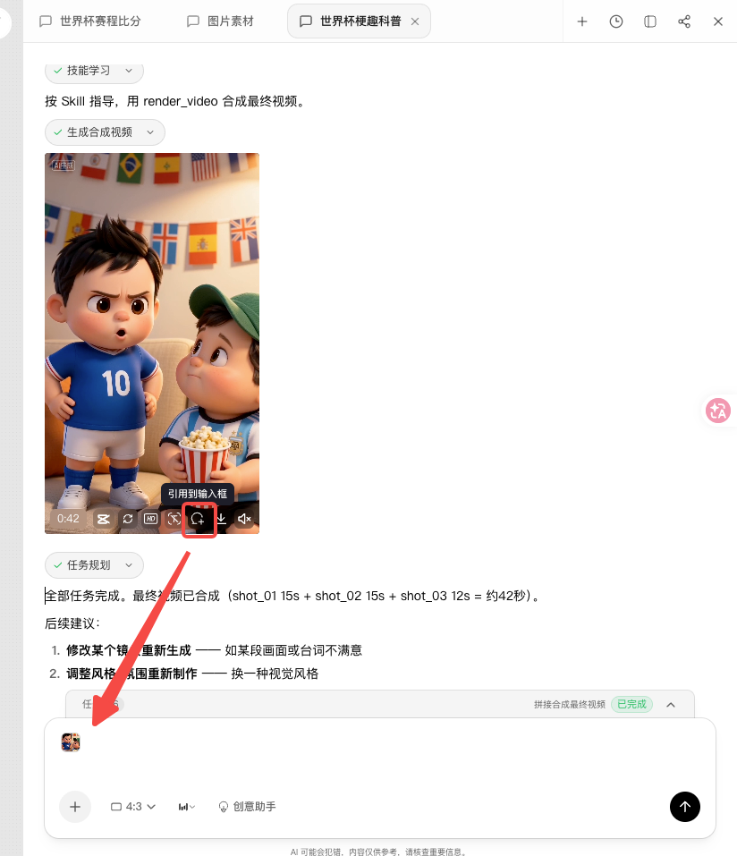](_files_小云雀创作 Agent 画布使用手册/image_21.png)   应用会话前文素材 |
| 1. 将画布中的素材引用到输入框，可以点击节点左上角的「@」符号，也可以多选或打组后批量将一组素材全部@引用 | [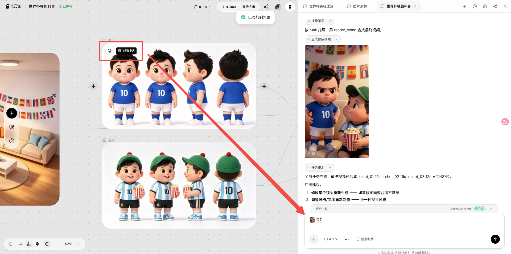](_files_小云雀创作 Agent 画布使用手册/image_22.png)   引用画布上的素材（单个）  [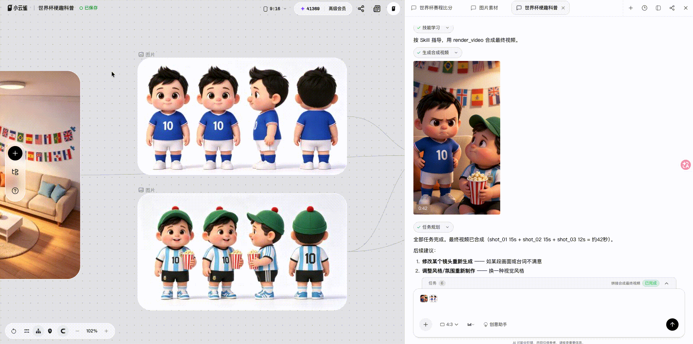](https://p11-seeyou-cn.byteimg.com/tos-cn-i-e844mpvzdi/2106b5f4245b4611a68aa7a90ec86ff4~tplv-e844mpvzdi-compress:q90.image)   引用画布上的素材（多个） |
| **引用到画布节点作为参考生成：** | |
| 1. 将参考素材连接到空白图片/视频节点后，可以使用@进行指定，并完善提示词 | [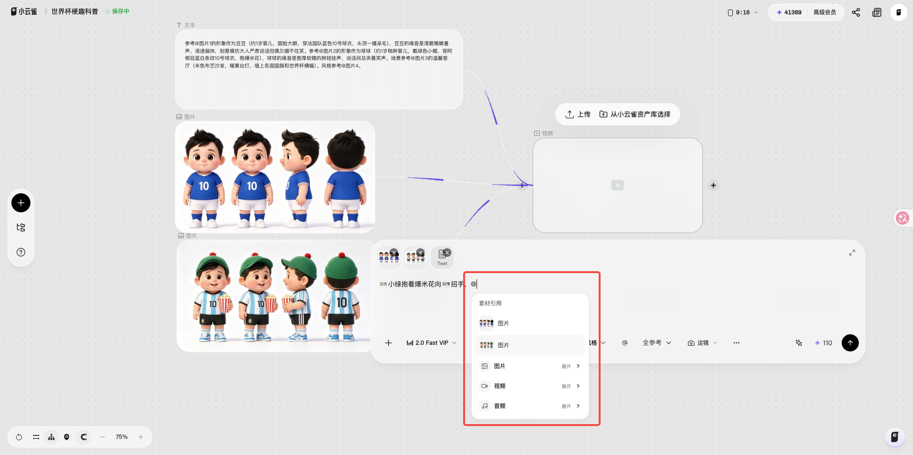](_files_小云雀创作 Agent 画布使用手册/image_24.png)   空白节点中，输入提示词进行@  [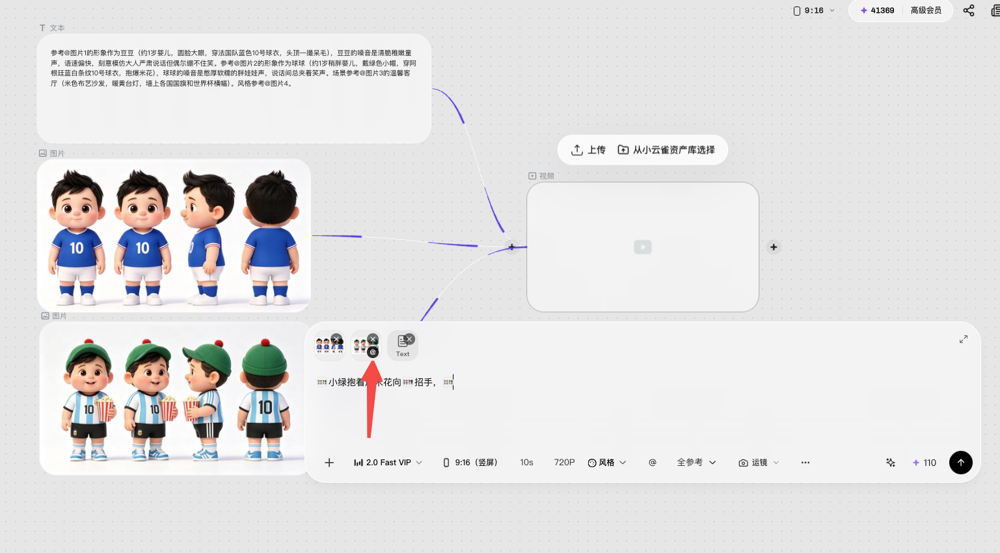](_files_小云雀创作 Agent 画布使用手册/image_25.png)   也可以直接点击缩略图上的@ |

### 创建新节点

共有四种途径：

1. 左侧菜单栏新建
2. 画布空白处右键新建/上传
3. 已有节点左右侧新建节点，不同节点可引用/被引用的节点有区别
4. 在对话中直接输入提示词，agent生成内容后会自动在画布上新增对应节点

[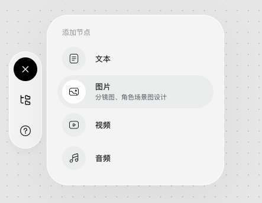](_files_小云雀创作 Agent 画布使用手册/image_26.png)

左侧菜单栏新建

[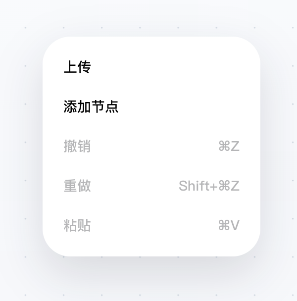](_files_小云雀创作 Agent 画布使用手册/image_27.png)

画布空白处右键新建/上传

[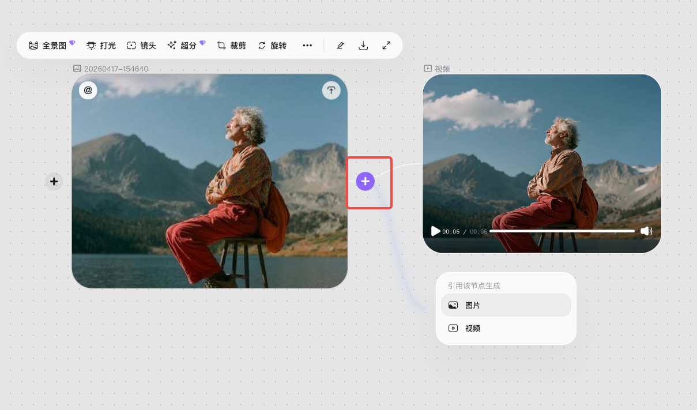](_files_小云雀创作 Agent 画布使用手册/image_28.png)

已有节点右侧+ 点击创建新节点

新建节点默认为空白状态，可以从本地/资产库上传素材，也可以使用模型生成

[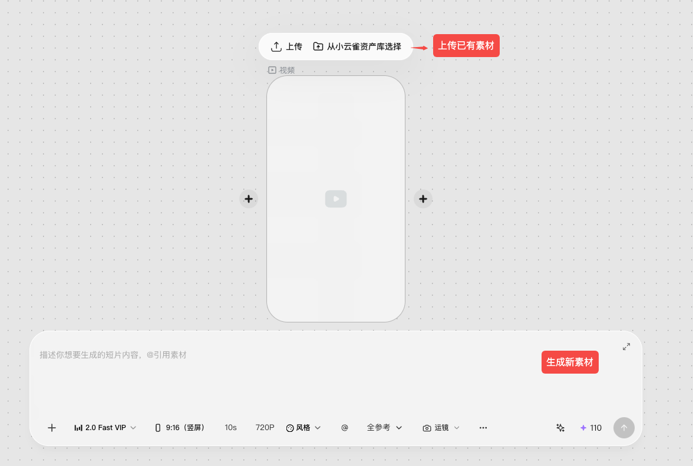](_files_小云雀创作 Agent 画布使用手册/image_29.png)

### 画布节点编辑工具

不同节点支持不同的编辑功能，初级编辑能力包括：旋转/裁剪/抽帧/剪辑，进阶编辑能力包括：全景图生成/镜头打光生成/提示词反解析/涂鸦画笔等等，持续迭代补充中

[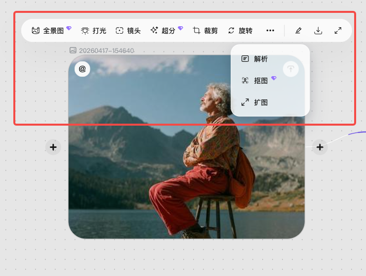](_files_小云雀创作 Agent 画布使用手册/image_30.png)

[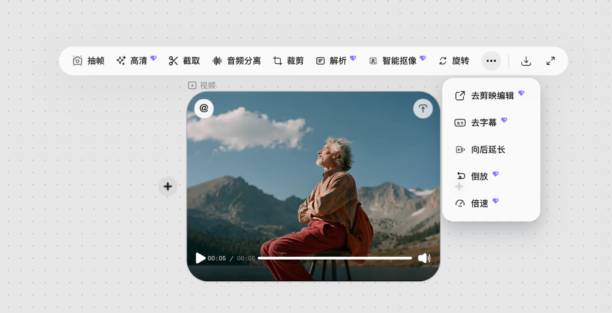](_files_小云雀创作 Agent 画布使用手册/image_31.png)

#### 全景图

选择图片生成全景图后，可生成720°全景预览效果，可在调整至任意角度截图到画布上

[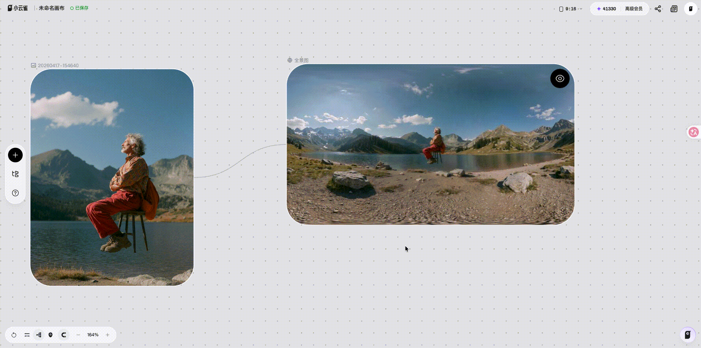](https://p11-seeyou-cn.byteimg.com/tos-cn-i-e844mpvzdi/09c38bc8a4554d68adfd83a158eba6ea~tplv-e844mpvzdi-compress:q90.image)

#### 提示词反解析

视频图片均支持反解析成提示词，用于创意解析、爆款复刻

[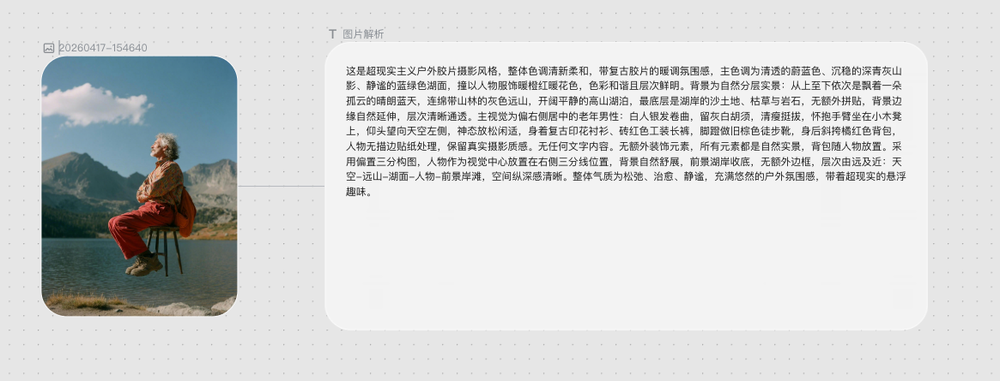](_files_小云雀创作 Agent 画布使用手册/image_33.png)

[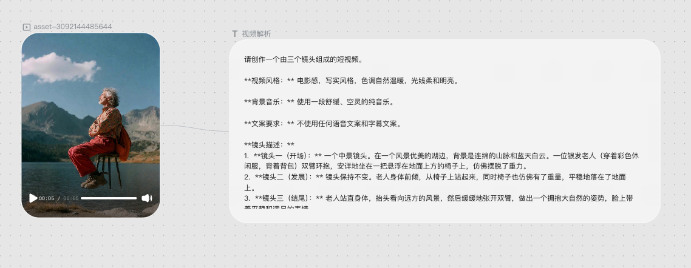](_files_小云雀创作 Agent 画布使用手册/image_34.png)

#### 智能打光

支持设置光源方向、质感、色调，快速生成有质感的画面光影

[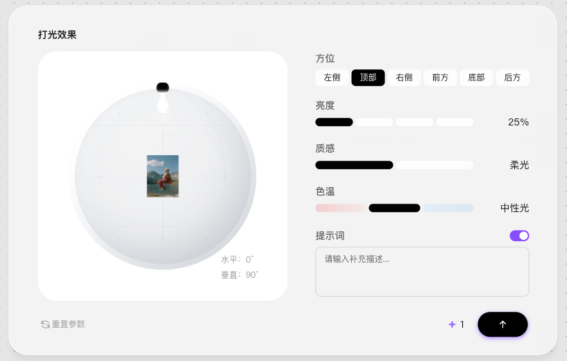](_files_小云雀创作 Agent 画布使用手册/image_35.png)

#### 镜头调节

支持设置取景方向和景别，快速生成新的取景角度

[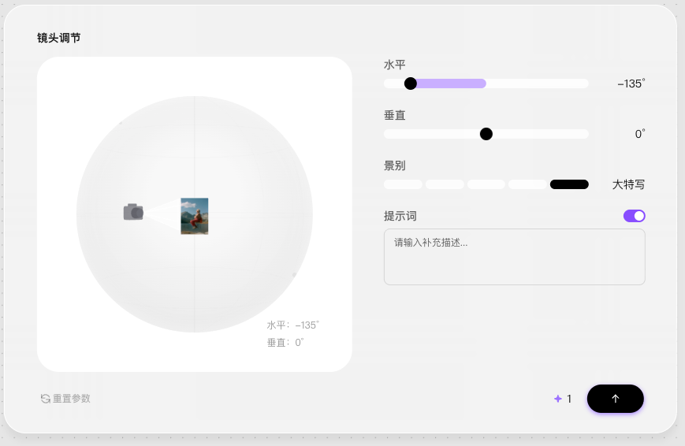](_files_小云雀创作 Agent 画布使用手册/image_37.png)

[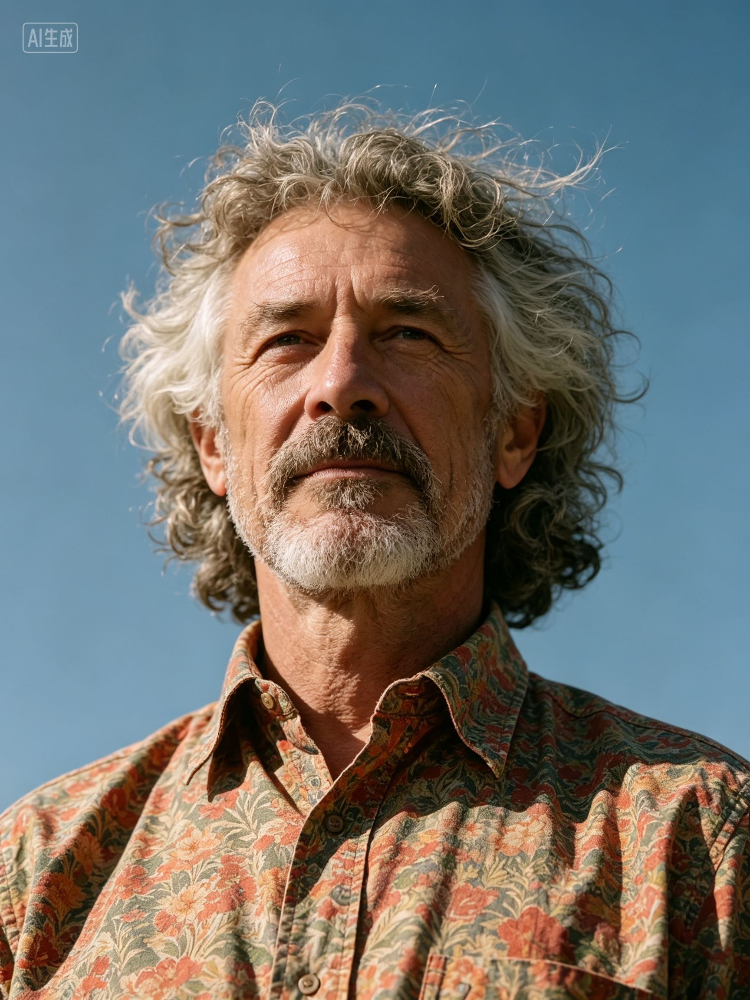](_files_小云雀创作 Agent 画布使用手册/image_38.png)

#### 涂鸦画笔

支持自由绘制图案，可以圈选指定位置、绘制简笔画，生成新图后配合模型提出更具体的指令，生成效果更精准可控

[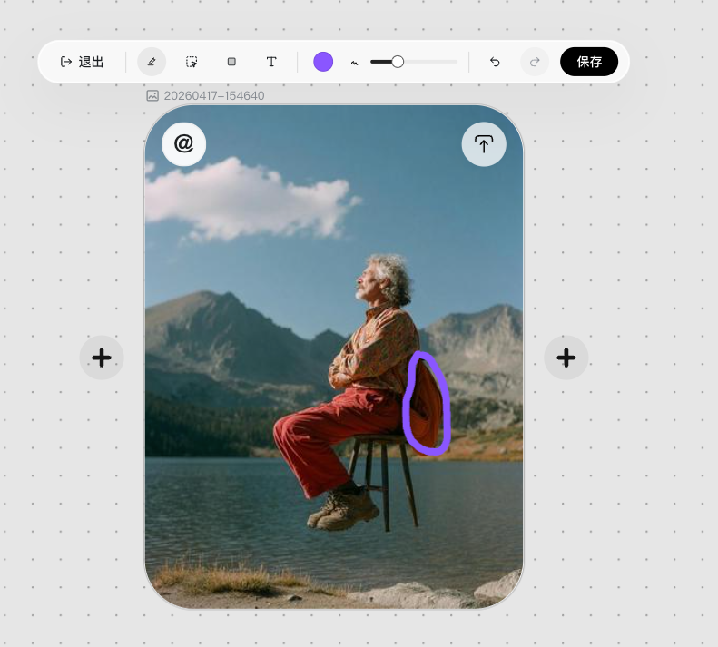](_files_小云雀创作 Agent 画布使用手册/image_39.png)

[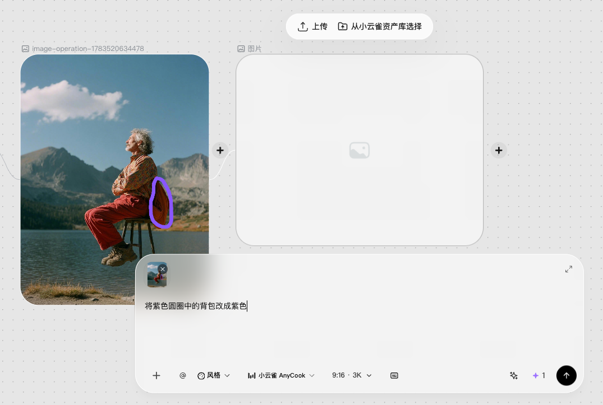](_files_小云雀创作 Agent 画布使用手册/image_40.png)

#### 智能运镜库

> 详见：[小云雀运镜库功能介绍](https://bytedance.larkoffice.com/wiki/FQEkw4JlriVhjRkN3BgcQSrmnYb)

在画布中使用视频模型生成时，可以选择小云雀的运镜库实现更专业丰富的动态镜头效果

[[VIDEO](_files_小云雀创作 Agent 画布使用手册/video_1.mp4)](_files_小云雀创作 Agent 画布使用手册/video_1.mp4)

镜头下摇

[[VIDEO](_files_小云雀创作 Agent 画布使用手册/video_2.mp4)](_files_小云雀创作 Agent 画布使用手册/video_2.mp4)

固定镜头

[[VIDEO](_files_小云雀创作 Agent 画布使用手册/video_3.mp4)](_files_小云雀创作 Agent 画布使用手册/video_3.mp4)

跟随拍摄

[[VIDEO](_files_小云雀创作 Agent 画布使用手册/video_4.mp4)](_files_小云雀创作 Agent 画布使用手册/video_4.mp4)

第一视角

[[VIDEO](_files_小云雀创作 Agent 画布使用手册/video_5.mp4)](_files_小云雀创作 Agent 画布使用手册/video_5.mp4)

柯克变焦

[[VIDEO](_files_小云雀创作 Agent 画布使用手册/video_6.mp4)](_files_小云雀创作 Agent 画布使用手册/video_6.mp4)

穿越

[[VIDEO](_files_小云雀创作 Agent 画布使用手册/video_7.mp4)](_files_小云雀创作 Agent 画布使用手册/video_7.mp4)

横滑揭示

[[VIDEO](_files_小云雀创作 Agent 画布使用手册/video_8.mp4)](_files_小云雀创作 Agent 画布使用手册/video_8.mp4)

甩摇

**使用方法：**在画布中的视频输入框中找到 **「📷 运镜」，**在提示词指令中插入需要的运镜效果即可，已预设33种运镜

[[VIDEO](_files_小云雀创作 Agent 画布使用手册/video_9.mp4)](_files_小云雀创作 Agent 画布使用手册/video_9.mp4)

#### 拼图/拼视频

画布上支持快捷拼接图片/视频，简单拼接处理无需再切换工具，可一站式完成

拼图：选中一组图片后，点击拼图

[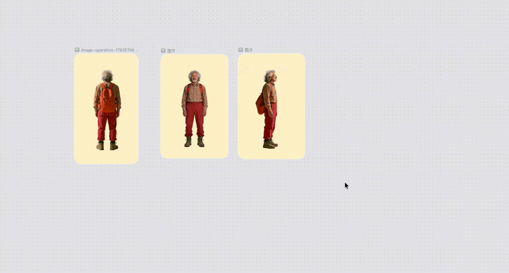](https://p11-seeyou-cn.byteimg.com/tos-cn-i-e844mpvzdi/96e9ec3c6bc54a7baa1bae59ac81f124~tplv-e844mpvzdi-compress:q90.image)

图片拼接

视频合成：选中一组视频后，点击合成

[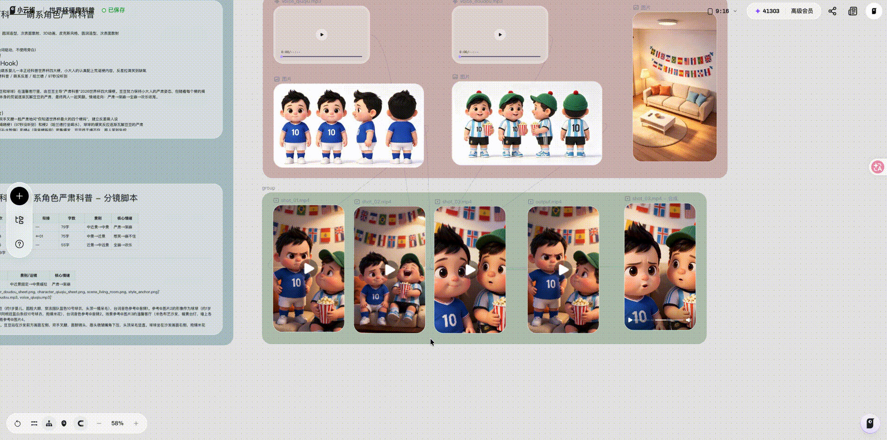](https://p11-seeyou-cn.byteimg.com/tos-cn-i-e844mpvzdi/11993837a5f44f7ca41e9c05060ec740~tplv-e844mpvzdi-compress:q90.image)

视频合成

#### 抽卡记录

如果对已生成的结果不满意，可以在画布上直接点击「生成」重新抽卡，同一提示词多次生成的结果会折叠为一组展示，使画布更加简洁。可以从抽卡记录中选择最满意的一版，后续引用参考都会以指定的版本为准生效

[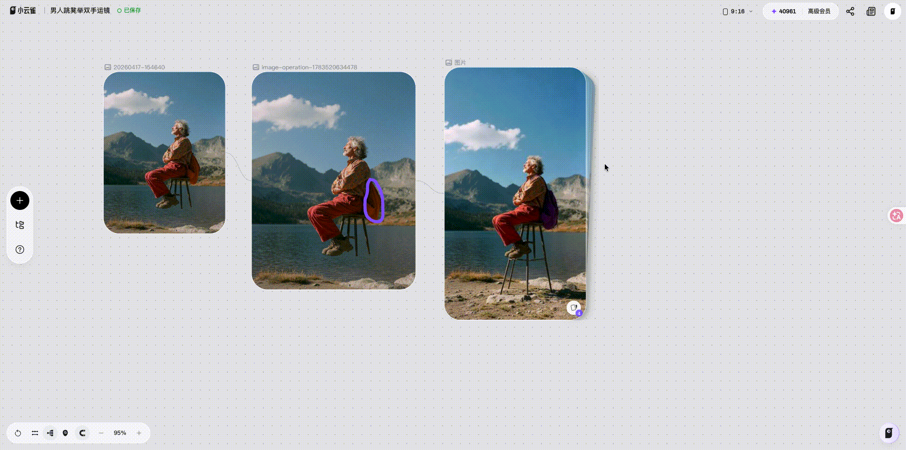](https://p11-seeyou-cn.byteimg.com/tos-cn-i-e844mpvzdi/97f5d33acb124429a7dbf0c0bf6865a0~tplv-e844mpvzdi-compress:q90.image)

### 打组批量管理资产

画布上资产太多、布局混乱时，可以选中多个素材后打组，按需分组管理素材，给不同分组设置不同底色和命名，分区更清晰

[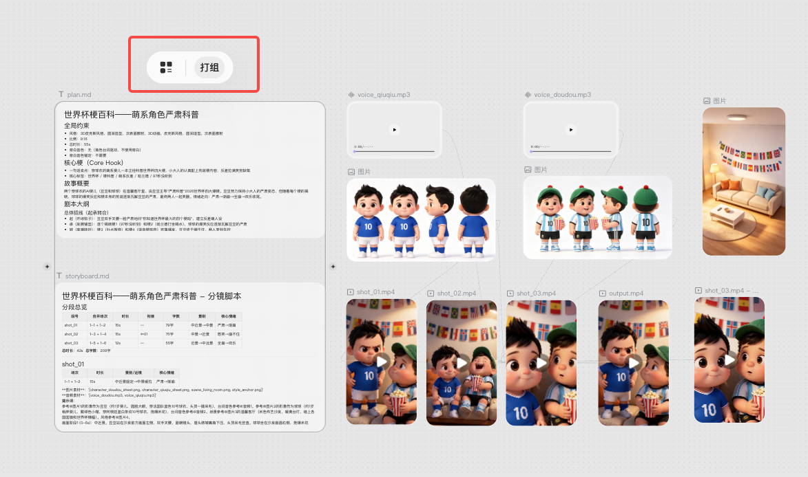](_files_小云雀创作 Agent 画布使用手册/image_44.png)

多选后打组

[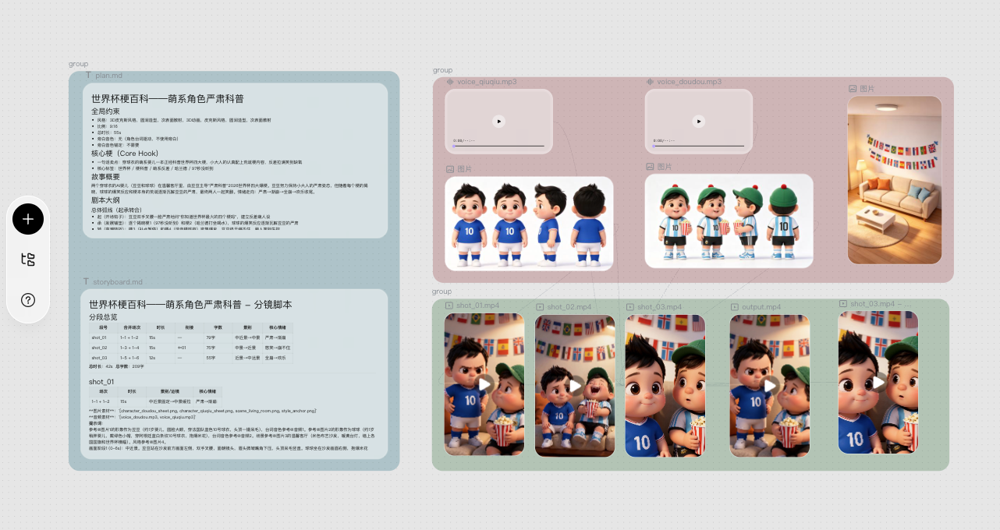](_files_小云雀创作 Agent 画布使用手册/image_45.png)

设置不同底色

打组后还可以对素材进行批量操作，例如批量@引用到对话框中，批量参考生成新内容，或者合成多分镜视频等

打组后拼接成新视频

[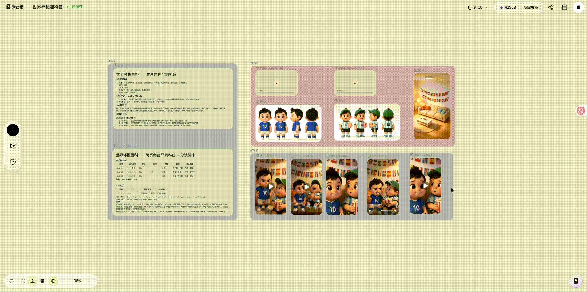](https://p11-seeyou-cn.byteimg.com/tos-cn-i-e844mpvzdi/8c51379ee2e2458fbd0833f12dad1d68~tplv-e844mpvzdi-compress:q90.image)

批量@到对话框

[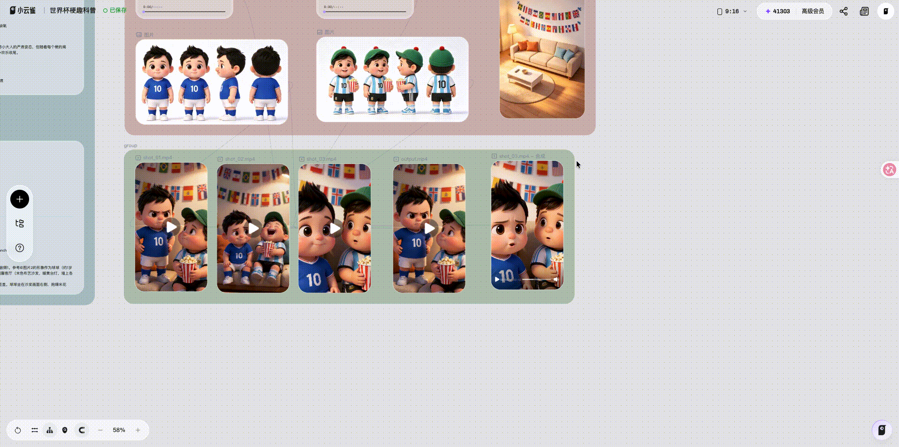](https://p11-seeyou-cn.byteimg.com/tos-cn-i-e844mpvzdi/c944c35b5fee414aaa9ef7c22fdc9d03~tplv-e844mpvzdi-compress:q90.image)

批量引用到新节点

### 左下角菜单栏

[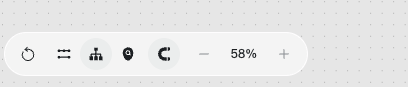](_files_小云雀创作 Agent 画布使用手册/image_48.png)

从左至右依次为：

1. 重置：画布缩放回到全局视角
2. 隐藏边：可以隐藏/恢复节点间的连线
3. 整理画布：支持节点连线的层级关系横向展开 or 纵向展开，整理画布布局
4. 画布小地图：便于宏观把控视角
5. 网格吸附：开启后节点排列将吸附网格
6. 调整画布缩放比例

### 画布快捷键

以下展示为Mac版本快捷键，Windows版本可将`cmd`替换为`ctrl`，整理画布为`shift` + `option` + `F`

[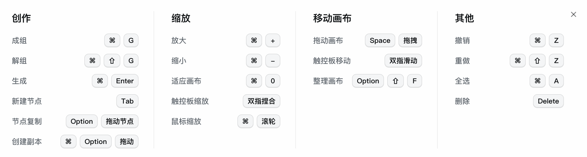](_files_小云雀创作 Agent 画布使用手册/image_49.png)

画布快捷键

### 分享创作记录

如果对自己创作的作品很满意，或者需要团队内审阅，可以分享画布和对话

**\***为保护隐私，画布上的素材和对话过程仅支持分别分享，可以按需复制对应的画布 or 对话历史的分享链接

[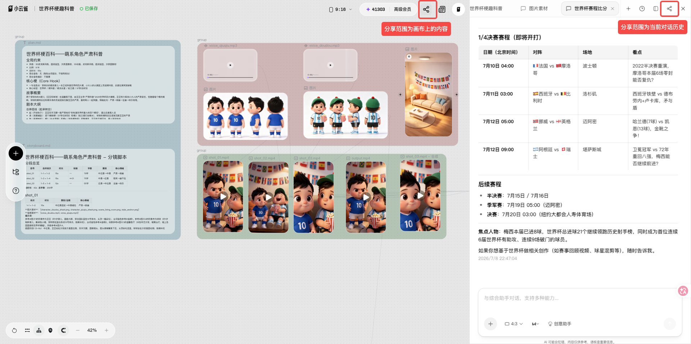](_files_小云雀创作 Agent 画布使用手册/image_50.png)

### 深色模式

如果不喜欢小云雀默认的亮色主题，可以在右上角切换设置为暗色模式。入口：头像-设置-通用-深色模式（开启）

[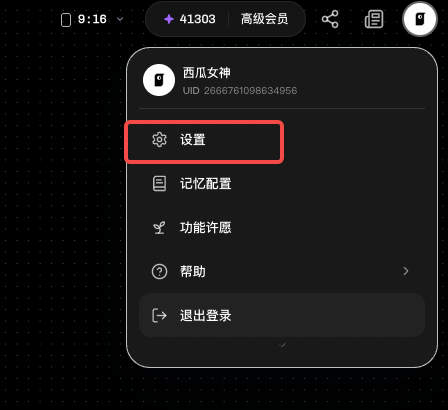](_files_小云雀创作 Agent 画布使用手册/image_51.png)

[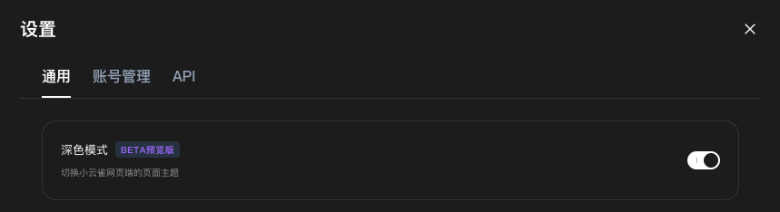](_files_小云雀创作 Agent 画布使用手册/image_52.png)

深色模式画布效果：

[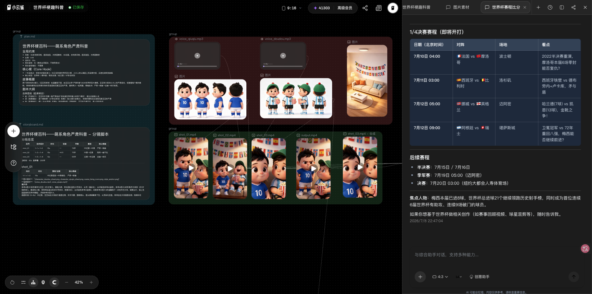](_files_小云雀创作 Agent 画布使用手册/image_53.png)
