# 小云雀短剧 Agent 3D导演台使用手册

> 来源：https://xyq.jianying.com/tutorials/short-drama-agent-3d-director
> 抓取时间：2026-09-23 09:21（离线快照，原文见链接）

浏览本页目录

小云雀 · 短剧 Agent

# 小云雀短剧 Agent 3D 导演台使用手册

## 3D 导演台升级概览

**一图看懂这次升级：**

[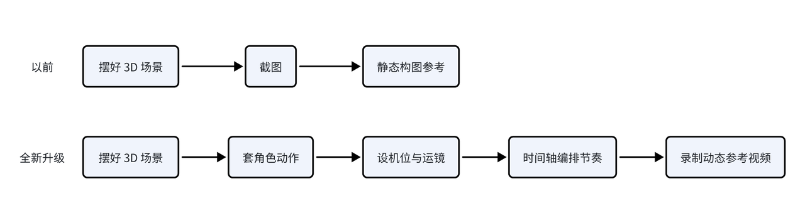](_files_小云雀短剧 Agent 3D导演台使用手册/image_1.png)

上排为过去(静态),下排为升级后(动态预演)

**升级能力速览**：

| 3D导演台新能力 | 用来做什么 | 示意图 |
| --- | --- | --- |
| 时间轴 | 以帧为单位插入/移动关键帧，播放预览动作与运镜，编排节奏 | [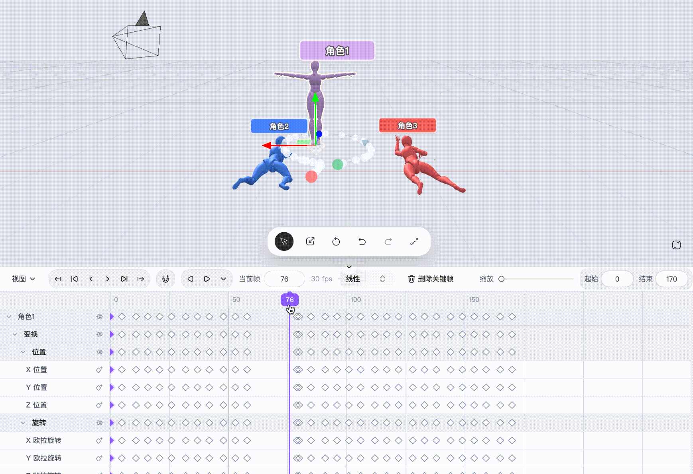](https://p11-seeyou-cn.byteimg.com/tos-cn-i-e844mpvzdi/8c4cb4dff5de4f3d9dc48b5dd380f99e~tplv-e844mpvzdi-compress:q90.image)  [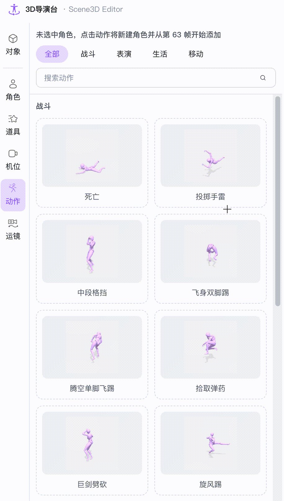](https://p11-seeyou-cn.byteimg.com/tos-cn-i-e844mpvzdi/4800c6b67b4f4c8eb9c6c63fc7f2802b~tplv-e844mpvzdi-compress:q90.image)  [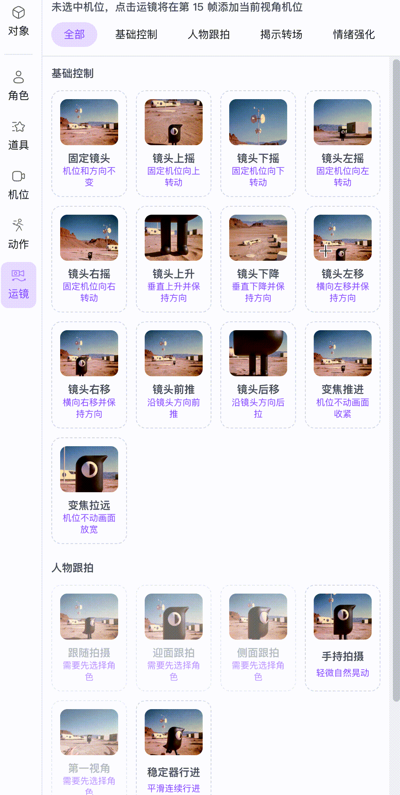](https://p11-seeyou-cn.byteimg.com/tos-cn-i-e844mpvzdi/947b78a03365497996cdab1d25358668~tplv-e844mpvzdi-compress:q90.image) |
| 角色动作库 | 选中角色后点击快速套动作，再在时间轴通过多次添加进行角色动作编排 |
| 机位运镜库 | 用预设机位或当前视角建机位，通过相机位置、FOV、注视点关键帧组织推拉摇移、环绕、跟拍 |
| 绘制轨迹 | 通过绘制轨迹快速的控制角色/道具/机位的位置变换，右侧黄色为绘制的轨迹 | [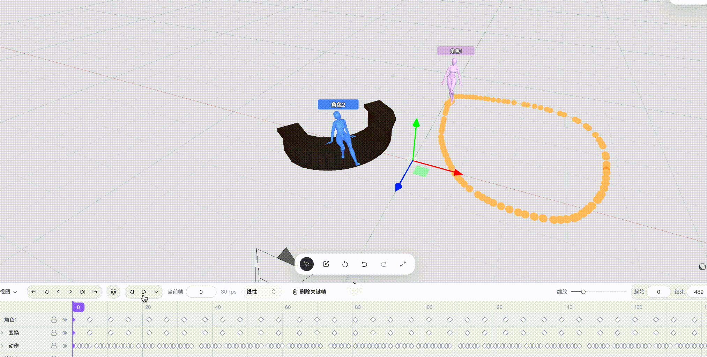](https://p11-seeyou-cn.byteimg.com/tos-cn-i-e844mpvzdi/84fbd2e0282e4d6faba5c4782c283013~tplv-e844mpvzdi-compress:q90.image) |

**使用示例：**

[[VIDEO](_files_小云雀短剧 Agent 3D导演台使用手册/video_1.mp4)](_files_小云雀短剧 Agent 3D导演台使用手册/video_1.mp4)

**使用示例：3D 导演台参考视频**

[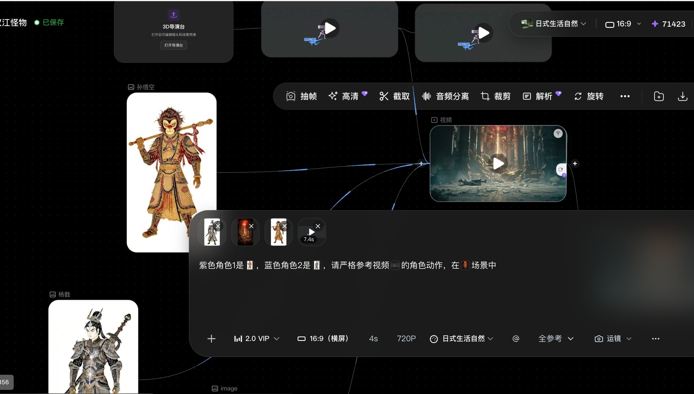](_files_小云雀短剧 Agent 3D导演台使用手册/image_1.jpg)

[[VIDEO](_files_小云雀短剧 Agent 3D导演台使用手册/video_2.mp4)](_files_小云雀短剧 Agent 3D导演台使用手册/video_2.mp4)

**使用示例：生成视频**

---

## 一、交互界面说明

- **左侧**
  - **对象列表：**展示 3D 空间里的所有元素，可进行新增、删除、重命名、打组、锁定、隐藏等操作
  - **资源库**：添加角色、道具、机位、动作、运镜，点击即可添加进3D导演台中
- **右侧**
  - **机位预览**：选中机位切换对应的视角预览，右下角的按钮可在3d视窗里定位切换至该视角
  - **属性：**根据当前选中的对象展示对应属性调整项，如角色的变换、材质、姿势编辑等
- **上侧**
  - **导出工具菜单**：调整取景比例、截图、渲染、录像，摄像机素材（截图/录像历史记录，可以发送到画布）
- **下侧**
  - **操作菜单：**调整模型（移动、旋转、缩放）、撤销重做
  - **时间轴**：管理各对象的关键帧动画，可控制播放、定位当前帧、设置起止帧、调整帧和时间范围，并对变换、动作等轨道进行关键帧编辑
- **中间-3D视窗：**用于摆放元素、调整视角、查看整体空间关系

[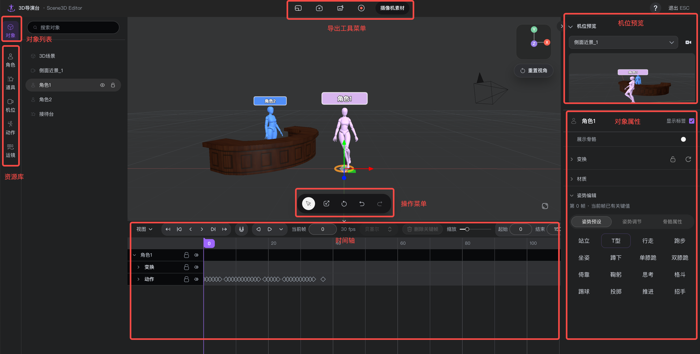](_files_小云雀短剧 Agent 3D导演台使用手册/image_6.png)

## 二、快速上手-先静态后动态

新增动态能力的推荐用法是**先做静态、再做动态**:先把人物站位、道具位置、镜头比例和主构图定下来,再进入时间轴做动作和运镜。

1. **定空间-搭建 3D 场景。**添加人体角色、道具、基础几何体、本地上传模型，先确认空间关系
2. **定动作-给角色加动作。**选中角色后，在底部动作库中选择动作素材；需要表达走位时，结合角色整体位移关键帧
3. **定镜头-设置关键机位。**可以用预设机位，也可以从当前导演视角生成机位；设置取景比例、FOV、注视点和机位实时预览
4. **定节奏-打开时间轴编排动态。**在关键帧记录角色、相机或可动画属性的变化，播放预览并调整节奏
5. **回画布-输出参考。**静态构图用截图；动作和运镜用录制生成动态参考视频。把截图或动态参考视频发送到画布，与角色图、场景图、文本提示词或视频生成节点连接

## 三、使用操作流程

### Step0：准备-画布新建3D 导演台节点

1. 进入小云雀短剧Agent画布
2. 在画布空白区域右键，或从节点菜单中新建「3D 导演台」节点
3. 点击导演台节点中的「打开导演台」，进入 3D 空间

[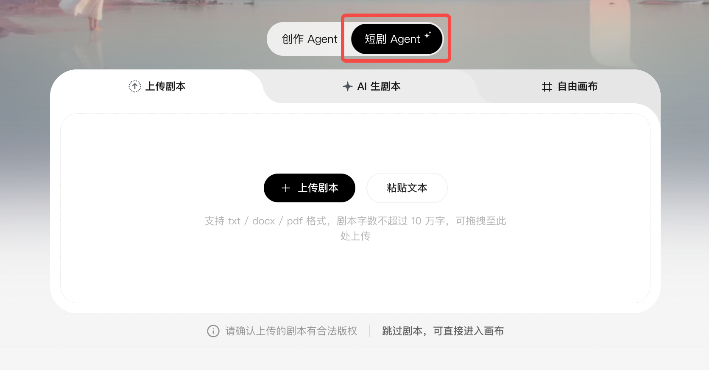](_files_小云雀短剧 Agent 3D导演台使用手册/image_7.png)

[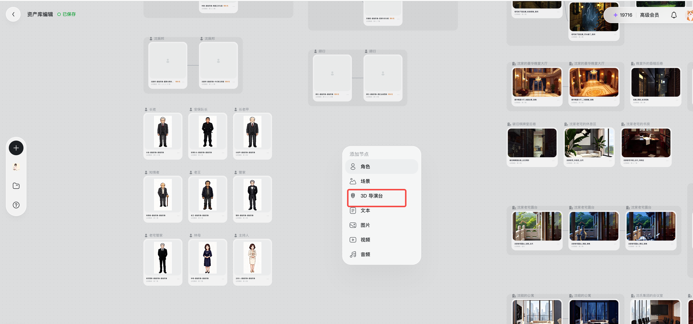](_files_小云雀短剧 Agent 3D导演台使用手册/image_8.png)

[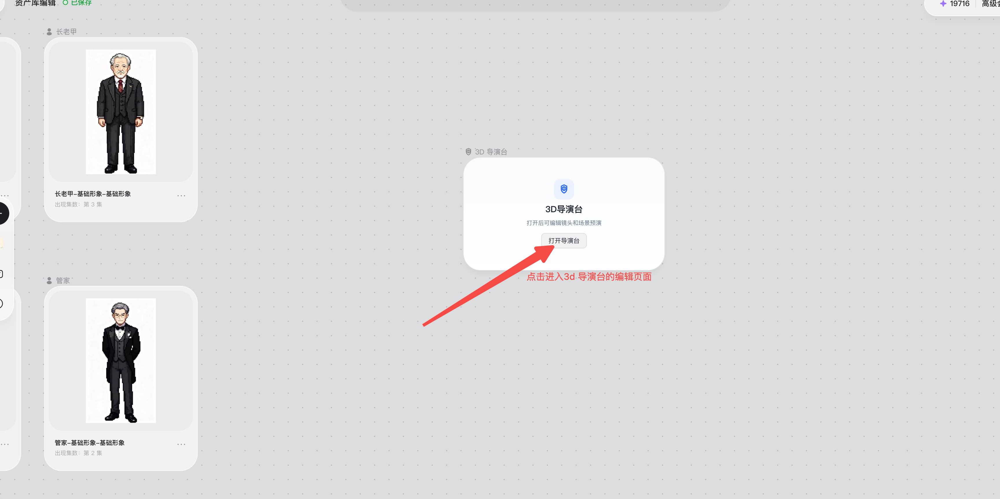](_files_小云雀短剧 Agent 3D导演台使用手册/image_9.png)

### Step1：定空间-搭建 3D 场景

添加角色人偶、道具、基础几何体、本地上传模型，先确认空间关系

**添加模型：**在导演台中添加需要的模型。可重点使用以下类型：

- **人体素模：**用于表达角色站位、动作、朝向和人物比例；**群众**用于快速表人群等多人关系
- **道具/几何模型：**用于快速搭建桌椅、门、障碍物、台阶等空间参照

[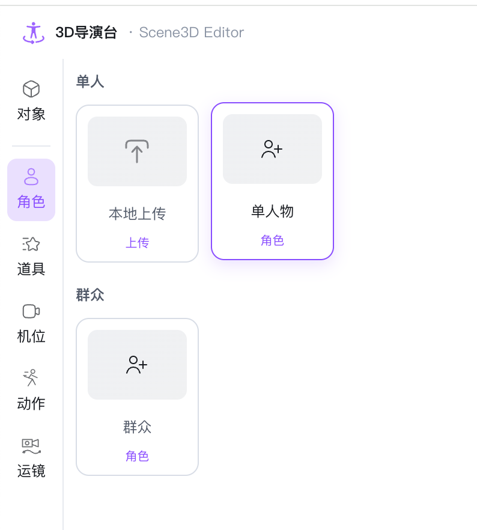](_files_小云雀短剧 Agent 3D导演台使用手册/image_10.png)

[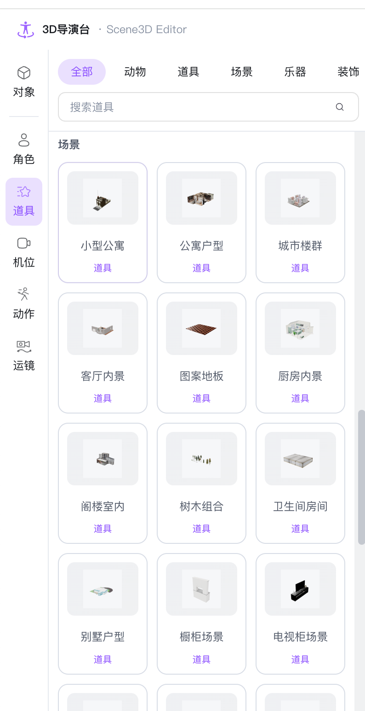](_files_小云雀短剧 Agent 3D导演台使用手册/image_11.png)

[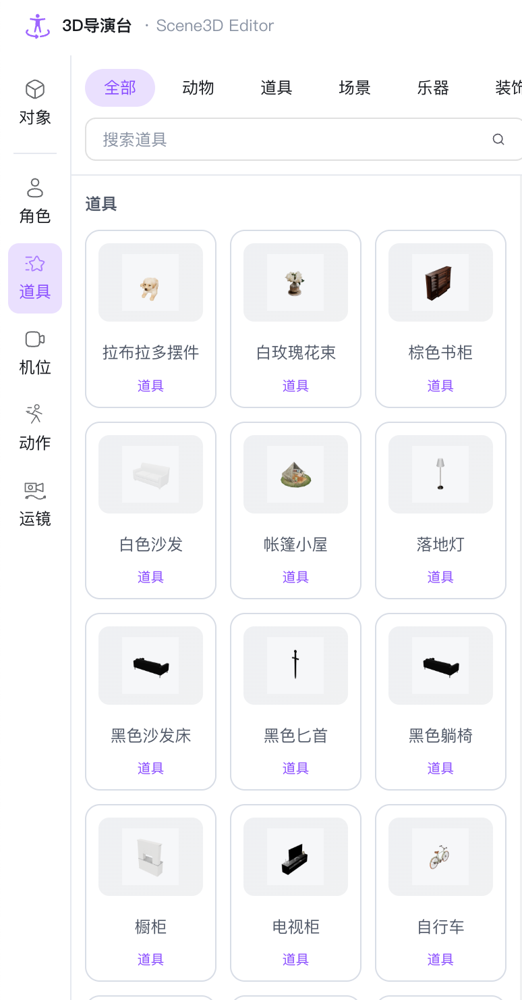](_files_小云雀短剧 Agent 3D导演台使用手册/image_12.png)

**调整角色/道具模型：**

| 操作 | 用途 | 示意图 |
| --- | --- | --- |
| 移动位置 | 调整人物或道具在场景中的站位。 | [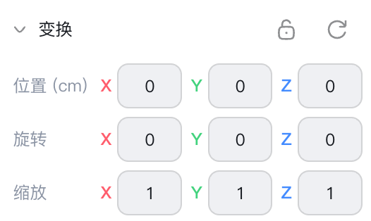](_files_小云雀短剧 Agent 3D导演台使用手册/image_13.png) |
| 旋转方向 | 调整角色面向、物体朝向和镜头关系。 |
| 缩放体积 | 调整模型大小。按住 Shift 可等比缩放。 |
| 姿势调整 | 选中人体素模后，在右侧「姿势」里调整站立、坐下、奔跑等动作。 | [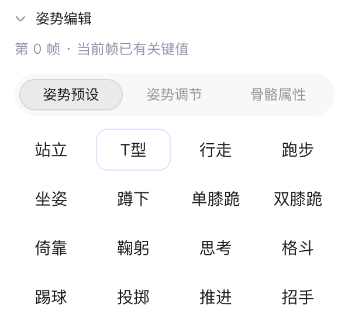](_files_小云雀短剧 Agent 3D导演台使用手册/image_14.png) |
| 颜色调整 | 用颜色区分角色对象 |  |
| 标签、骨骼显示 | 可选择是否显示标签以及调整标签位置 | [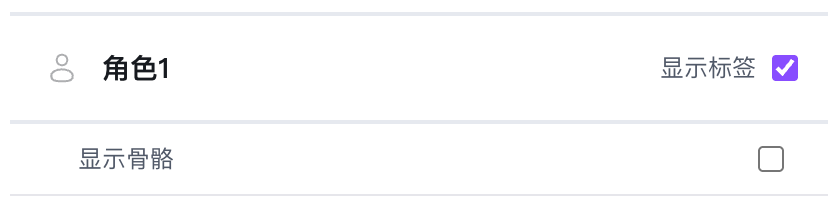](_files_小云雀短剧 Agent 3D导演台使用手册/image_16.png) |

[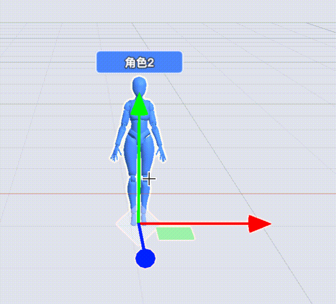](https://p11-seeyou-cn.byteimg.com/tos-cn-i-e844mpvzdi/4047ac94f0dd45b0ac27f429c0cf5f65~tplv-e844mpvzdi-compress:q90.image)

单轴移动

[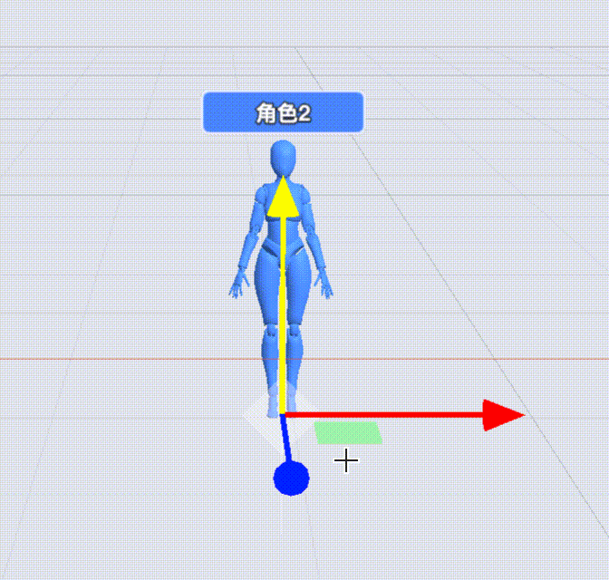](https://p11-seeyou-cn.byteimg.com/tos-cn-i-e844mpvzdi/a58123d52b404e87ae2d33dc9827fde4~tplv-e844mpvzdi-compress:q90.image)

平面移动

[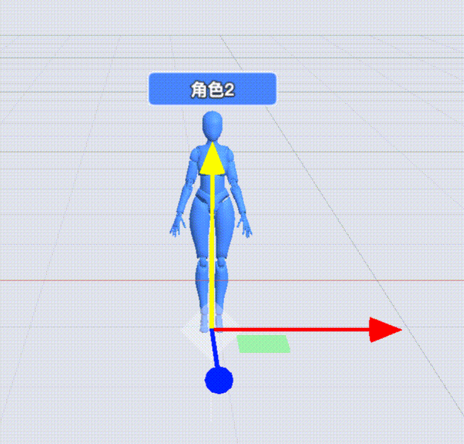](https://p11-seeyou-cn.byteimg.com/tos-cn-i-e844mpvzdi/d9bee1e60eb4401fb40dd7a753f76afd~tplv-e844mpvzdi-compress:q90.image)

自由移动

### Step2：定运动-给角色加动作+位移

选中角色后，在底部动作库中选择动作素材；需要表达走位时，先确定角色最终位置/运动轨迹，再在时间轴上通过快捷键`I`加关键帧

- **加动作**
  - **入口：**左侧资源区切换到「动作库」
  - **选择：**通过分类标签或搜索框查找动作；动作卡片可展示缩略图、描述或视频预览。
  - **应用：**选中人体角色后点击动作卡片，或把动作卡片拖拽到角色上；未选中角色时点击「添加」即默认新增一个角色并套用。
  - **微调：**动作应用后可以调速度、循环、时间位置；角色整体位移和镜头跟随可通过时间轴关键帧继续处理
- **加位移**
  - **绘制轨迹**：先绘制轨迹后应用到角色，让角色跟着轨迹变换位移

[[VIDEO](_files_小云雀短剧 Agent 3D导演台使用手册/video_3.mp4)](_files_小云雀短剧 Agent 3D导演台使用手册/video_3.mp4)

**角色动作与位移操作演示**

### Step3：定镜头-设置关键机位

导演台的核心价值是用 3D 空间稳定表达镜头构图。完成角色和场景摆放后，就可以开始设置机位。可以用预设机位，也可以从当前导演视角生成机位；设置取景比例、FOV、注视点和机位实时预览

1. **新建或选择机位：**通过摄像机/机位能力添加拍摄视角。
2. **预览视角：**3d操作区自由观察场景，右上方「机位预览」实时检查镜头画面。
3. **调整镜头：**移动和旋转相机，或在右侧「摄像机属性」中调整 FOV、注视目标等参数。
4. **选择比例：**按当前分镜需要选择横图、竖图或其他比例。

| 步骤 | 目标 | 做法 | 建议 |
| --- | --- | --- | --- |
| 新建机位 | 从当前视角建机位 | 在导演视角调整到满意角度后生成机位 | 适合先自由找构图，再保存镜头 |
| 添加预置机位 | 或在机位库里添加预置机位，后在属性面板可继续调节 | 适合模版化的关键角度，比如侧面特写等 |
| 添加运镜 | 无注视目标的运镜  （如抖动、右移等） | 直接点击应用到选中相机 |  |
| 有注视目标的运镜  （如环绕、跟拍等） | 先应用到选中相机，再在右侧属性面板更改注视坐标 | [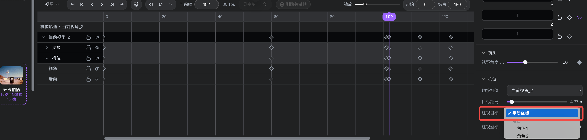](_files_小云雀短剧 Agent 3D导演台使用手册/image_20.png)  添加运镜后在右侧可调整注视目标 |

[[VIDEO](_files_小云雀短剧 Agent 3D导演台使用手册/video_4.mp4)](_files_小云雀短剧 Agent 3D导演台使用手册/video_4.mp4)

**设置关键机位操作演示**

### Step4：定节奏-时间轴编排

在关键帧记录角色、相机或可动画属性的变化，播放预览并调整节奏

- 时间轴默认以帧为单位（点击时间轴左上角「视图」可调整为以秒为单位）
- 默认帧范围是 0 到 150 帧（可在时间轴右上角调整）
- 选中角色或机位后，时间轴会显示该对象可编辑的属性通道（取消「视图」中的「仅显示已选中」可展示所有动态对象的轨道）

[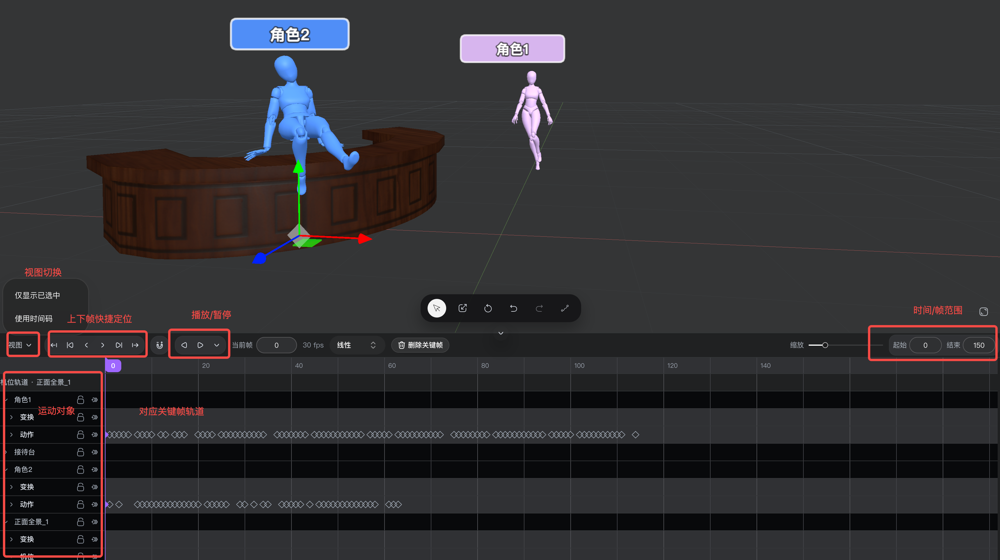](_files_小云雀短剧 Agent 3D导演台使用手册/image_21.png)

### Step5：回画布-导出参考

导出素材方法：

- 截图：静态构图
- 录屏：动作和运镜用录制生成动态参考视频
- 渲染：可以选择机位直接渲染图片/视频

点击「摄像机素材」可以看到历史截图/录屏，可将截图或动态参考视频发送到画布，回到画布后，素材会作为图片节点/视频节点出现，可继续连接到图像生成、视频生成节点。

[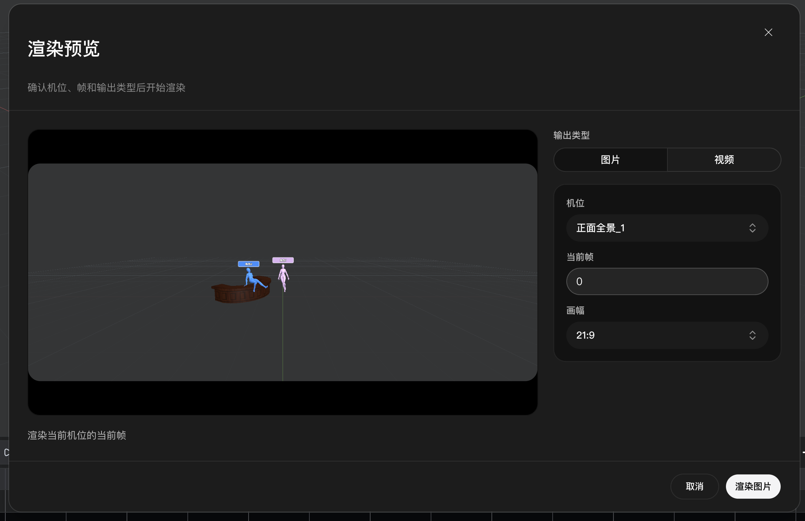](_files_小云雀短剧 Agent 3D导演台使用手册/image_22.png)

渲染

[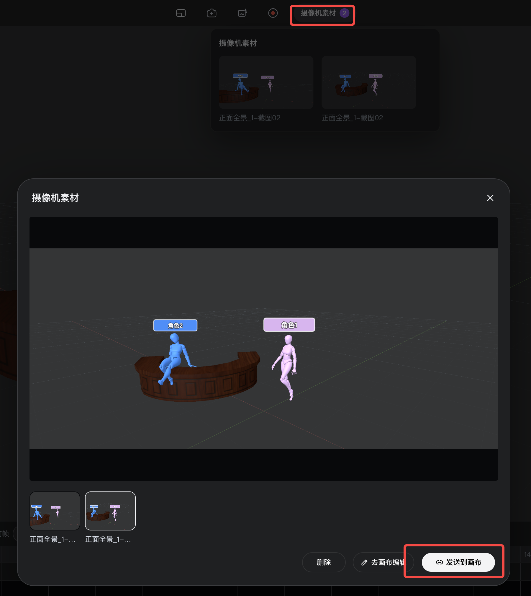](_files_小云雀短剧 Agent 3D导演台使用手册/image_23.png)

摄像机素材

关联角色图，生成视频：导演台截图本身是构图参考。要让生成结果稳定继承角色外观，需要把它和角色图、场景图或文本描述一起接入生成链路。

1. 在画布中选中导演台发送出的图片/视频节点。
2. 将截图与角色图、场景图或视频生成节点建立连接。
3. 在提示词中补充动作、情绪、镜头运动和风格要求。

导演台的产物(截图 / 动态参考视频 / 多机位截图)需要和角色图、场景图、提示词一起接入生成链路,才能既保留 3D 参考的空间与运动,又稳定继承角色外观。

| 生成目标 | 推荐连接方式 | 提示词补充 |
| --- | --- | --- |
| 保持构图 | 连接导演台截图作为构图参考 | 明确「参考图构图、人物站位、前后关系」 |
| 保持角色一致 | 同时连接角色图或角色资产 | 写清角色名称、服装、发型、表情和身份 |
| 表达动作节奏、运镜 | 连接动态参考视频 | 写清「参考视频中的动作节奏和运动方向以及镜头运镜」 |
| 同场景多镜头 | 同一 3D 场景导出多张截图或多段参考视频 | 说明每个镜头的景别、时长和剧情目的 |

## 四、特别功能详解

### 🆕手动调节姿势

预设姿势数量有限、逐条拖动骨骼参数又太慢？新上线的人偶**手动姿势调整**支持直接用鼠标操作：

- 打开右侧「姿势 - 姿势调整 - 手动调整姿势」开关或者选择人偶右键进入姿势调节，人偶各 关节会出现可拖拽的控制点，拖动即可把角色摆成想要的姿态。

[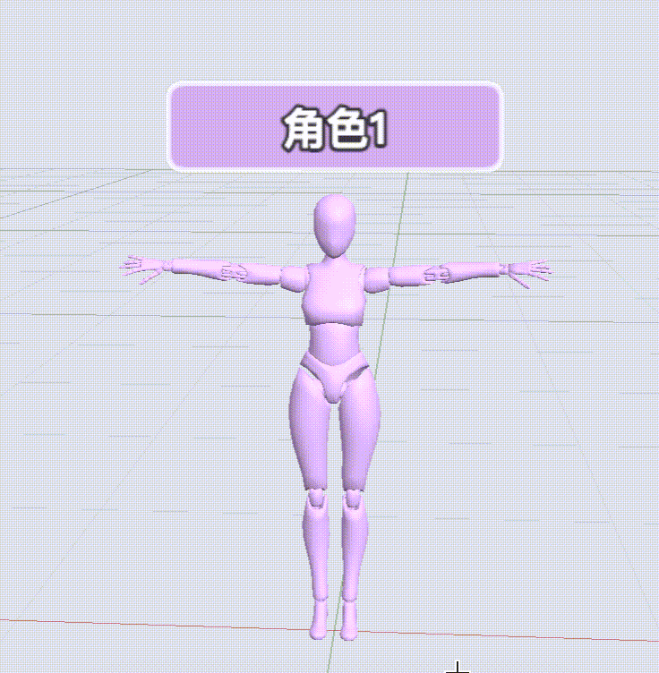](https://p11-seeyou-cn.byteimg.com/tos-cn-i-e844mpvzdi/1ff0e750e3a34e198243b3d84e3b9a8b~tplv-e844mpvzdi-compress:q90.image)

右键打开「手动调整姿势」

[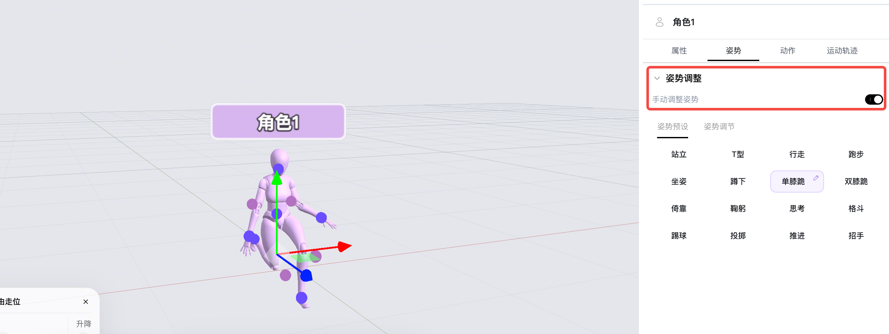](_files_小云雀短剧 Agent 3D导演台使用手册/image_25.png)

姿势面板打开「手动调整姿势」，拖拽人偶身上的关节控制点即可

### 🆕自由走位（WASD 面板）

新增 **WASD 控制面板**，不用逐帧拖坐标，直接用键盘控制角色在场景中走位，并通过鼠标点选切换控制的对象。

[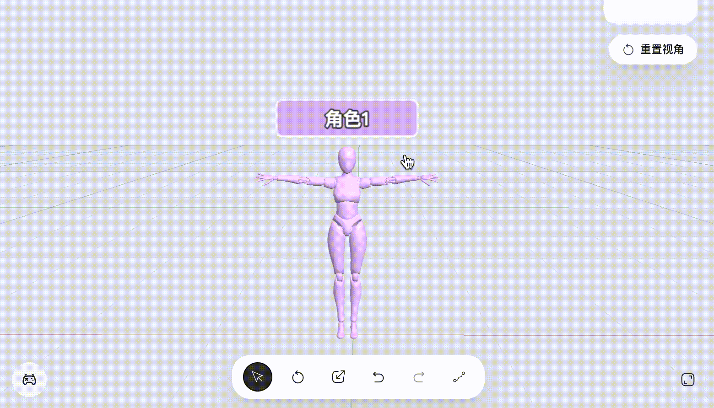](https://p11-seeyou-cn.byteimg.com/tos-cn-i-e844mpvzdi/6dabfbf08b264ce8b5bc1adb9c57c3b3~tplv-e844mpvzdi-compress:q90.image)

WASD

### AI识图：构图复刻，一键转白模

选择AI视图，上传图片即可进行AI识图，识别出可微调的3D模型（角色、道具、机位），接着进行微调后就可以生成不同视角，从而保持人物站位的一致性

[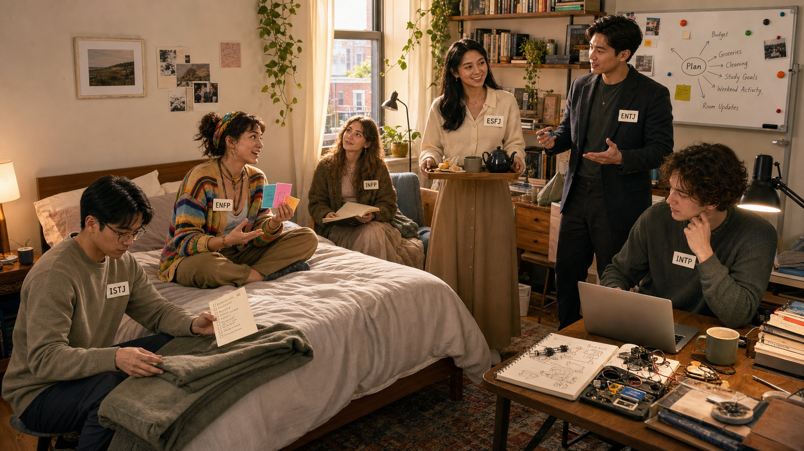](_files_小云雀短剧 Agent 3D导演台使用手册/image_27.png)

[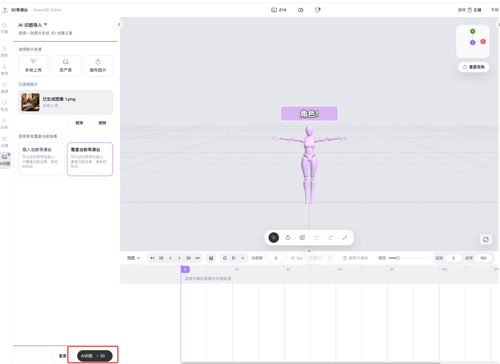](_files_小云雀短剧 Agent 3D导演台使用手册/image_28.png)

上传图片

[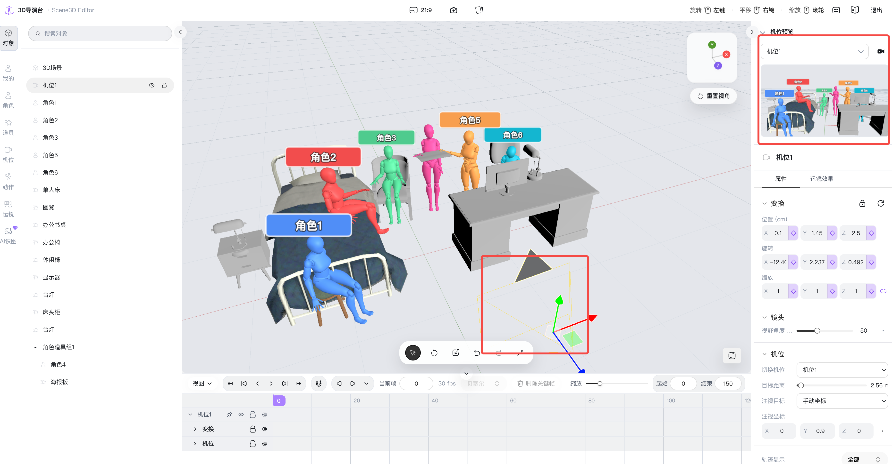](_files_小云雀短剧 Agent 3D导演台使用手册/image_29.png)

### 绘制3D轨迹：让人物按照你的想法移动

1. 下方菜单绘制轨迹，实际落地位置为鼠标点击位置射线与道具/地面相交点，若不符合预期落地，也可选中编辑
2. 绘制完后点击轨迹右键应用到角色/机位（会加到当前紫色时间头的帧位置上，可以再拖拉轨迹片段调整位置）

[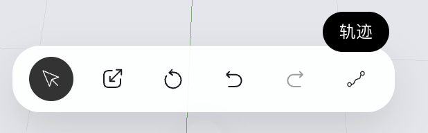](_files_小云雀短剧 Agent 3D导演台使用手册/image_30.png)

[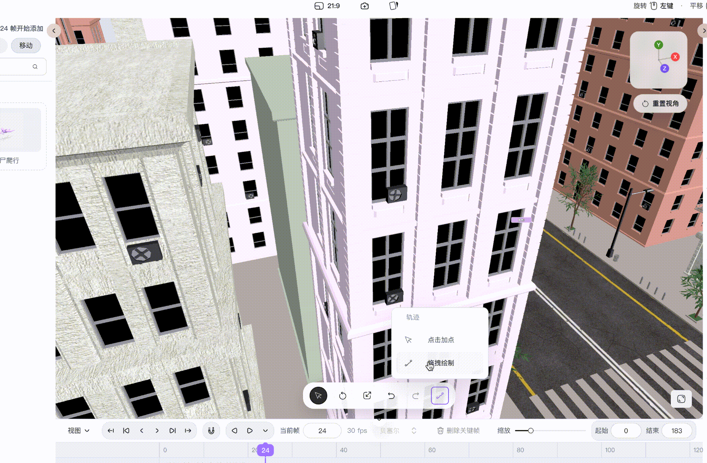](https://p11-seeyou-cn.byteimg.com/tos-cn-i-e844mpvzdi/803e7535b0994180b44a2032b4a2c811~tplv-e844mpvzdi-compress:q90.image)

[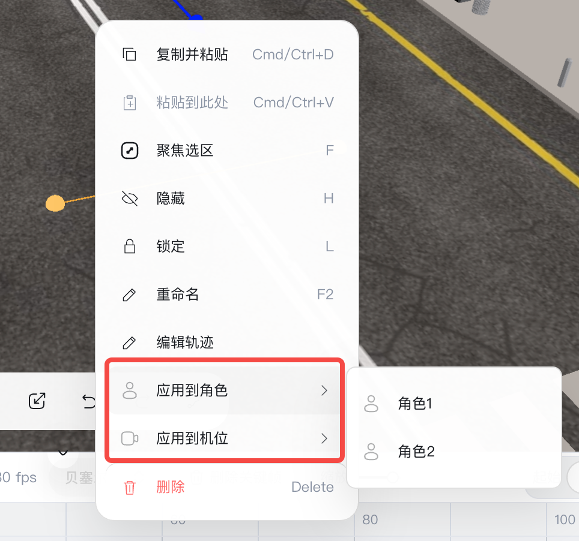](_files_小云雀短剧 Agent 3D导演台使用手册/image_32.png)

### 用全景图快速搭建空间

1. 在画布里准备或生成一张 720° 全景图，将全景图导入导演台或直接在画布中连线引用，用作 3D 空间背景。
2. 在背景中摆放角色和道具，让人物站位与场景透视关系匹配。
3. 设置合适机位后截图导出，用于后续图像或视频生成。

**适用场景：**需要同一地点多镜头、人物在固定场景中移动、或想让前后镜头拥有一致空间关系。

示例：

[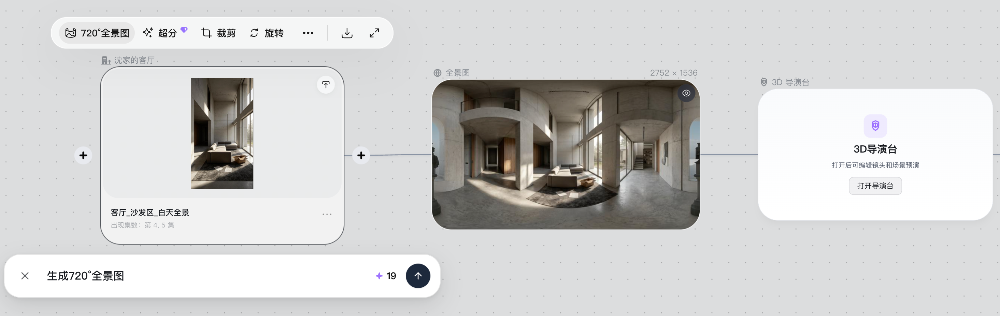](_files_小云雀短剧 Agent 3D导演台使用手册/image_33.png)

生成并引用 720° 全景图作为3d导演台背景

[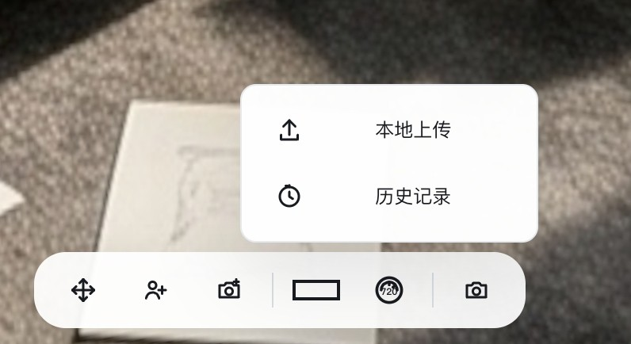](_files_小云雀短剧 Agent 3D导演台使用手册/image_2.jpg)

或在导演台菜单栏里上传背景图

[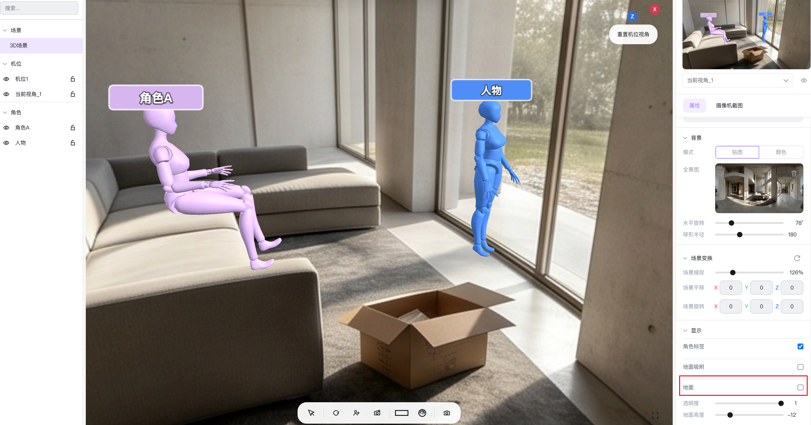](_files_小云雀短剧 Agent 3D导演台使用手册/image_34.png)

调整人物场景透视关系

[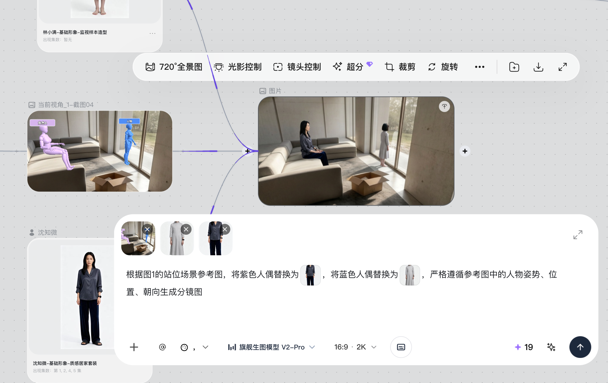](_files_小云雀短剧 Agent 3D导演台使用手册/image_35.png)

截图导出生成分镜图

### 人体姿势精调

选中人体角色模型，在右侧属性面板「姿势」里选择预设姿势，也可以对关键动作精调肢体关节，如身体倾斜、躯干旋转、头部转动、手臂、肘部、腿部、膝部等。

[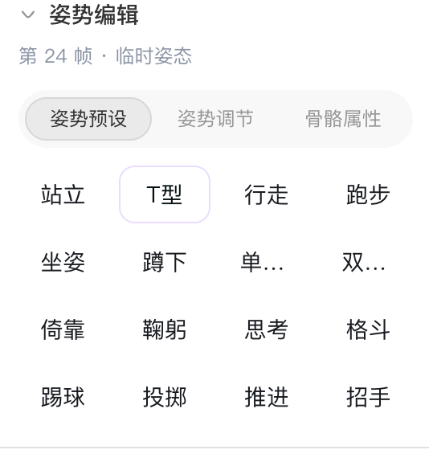](_files_小云雀短剧 Agent 3D导演台使用手册/image_36.png)

[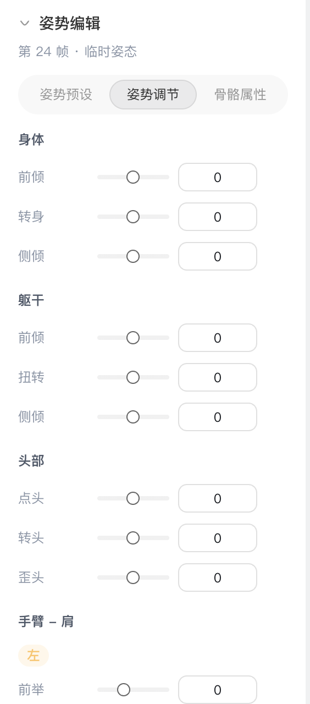](_files_小云雀短剧 Agent 3D导演台使用手册/image_37.png)

[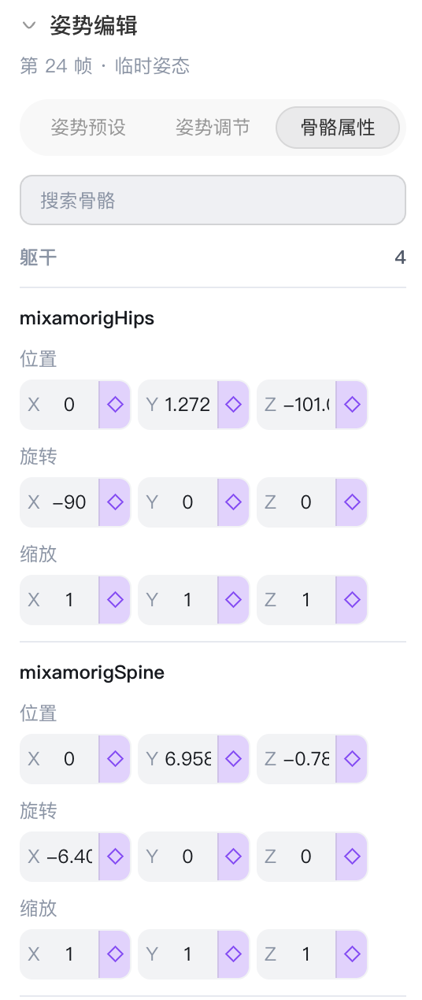](_files_小云雀短剧 Agent 3D导演台使用手册/image_38.png)

## 五、常用快捷键

[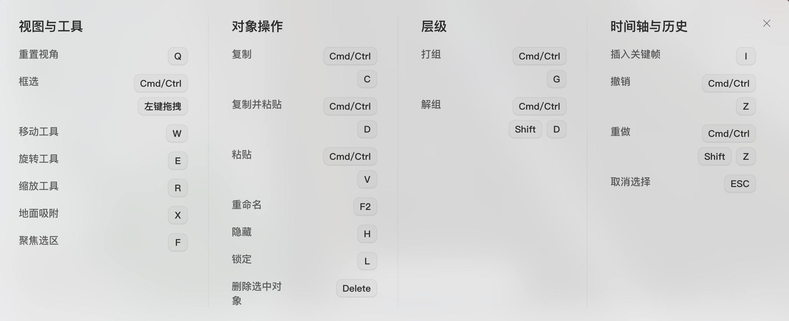](_files_小云雀短剧 Agent 3D导演台使用手册/image_39.png)

右上角可方便查看快捷键

[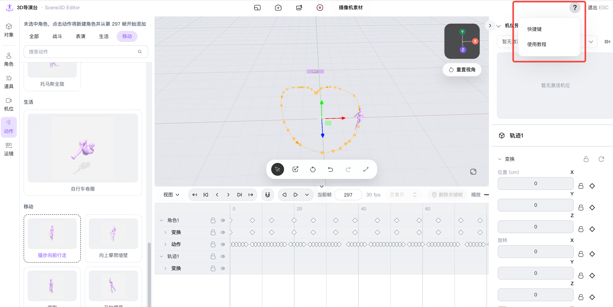](_files_小云雀短剧 Agent 3D导演台使用手册/image_40.png)

## 六、详细按钮功能速查

### 1. 顶部导航栏与输出工具

| 按钮 / 区域 | 示意图 | 功能 | 注意事项 |
| --- | --- | --- | --- |
| **画幅比例** |   [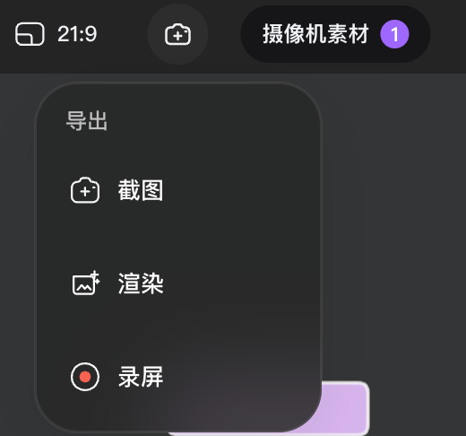](_files_小云雀短剧 Agent 3D导演台使用手册/image_42.png) | 在 Auto、21:9、16:9、4:3、1:1、3:4、9:16 之间切换取景框 | 改变预览和渲染的构图范围；默认Auto 使用完整视窗 |
| **导出素材** | - 渲染：打开渲染预览，可选图片或视频、机位、帧/帧区间、画幅和分辨率 - 截图：对当前视窗进行截图 - 录制：录制当前视窗的实时操作 |  |
| **摄像机素材** | 打开已截图、录制或渲染的历史记录，数字角标表示素材数量。 | 素材卡可预览/全屏、发送到画布、进入画布编辑或删除 |
| **快捷键和使用手册** |  | 打开帮助菜单，可查看**「快捷键」**或**「使用教程」** |  |
| **退出** |  | 返回画布 |  |

### 2. 左侧对象列表与资源库

| 按钮 / 入口 | **示意图** | 功能 | 注意事项 |
| --- | --- | --- | --- |
| **对象**  [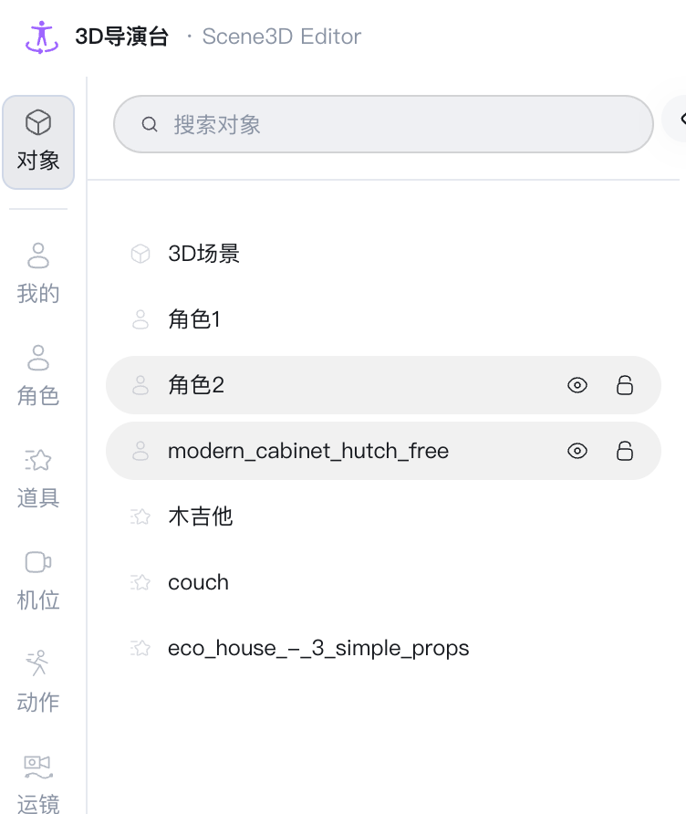](_files_小云雀短剧 Agent 3D导演台使用手册/image_44.png) | **对象列表** | 查看场景、机位、角色、道具、基础形体、轨迹和分组等层级。 | 点击一项选中；Cmd/Ctrl+点击可多选；双击名称或按 F2 重命名；搜索框按名称过滤。 |
| **小眼睛** | 显示/隐藏对象。 | 隐藏后对象不在视窗和输出中显示，再点击恢复；不会删除对象。 |
| **锁定 / 解锁** | 防止对象被误拖动、重命名或删除。 | 锁定后属性面板以只读状态展示，右键重命名和删除会置灰；先解锁才能继续编辑。 |
| **分组** | 1、在导演台区：快捷键cmd+左键进行**框选**多选对象右键建组  2、在左侧对象列表：在快捷键cmd+左键点击**多选右键建组**  [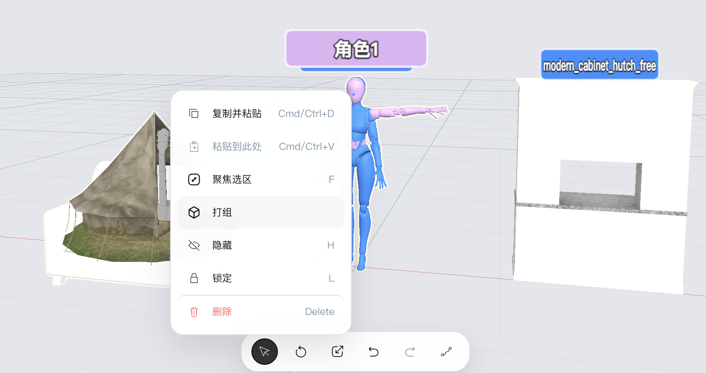](_files_小云雀短剧 Agent 3D导演台使用手册/image_45.png)   方式1  [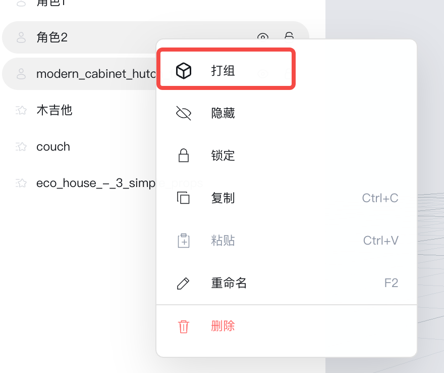](_files_小云雀短剧 Agent 3D导演台使用手册/image_46.png)   方式2 | 当前项是分组  只改变对象树展示，不影响视窗中的显隐。 |
| **右键菜单** | 提供打组/解组、显隐、锁定、复制、粘贴、重命名和删除 | 复制/粘贴在导演台内生成副本；删除、重命名与编组均可通过撤销恢复。 |
| **我的** | [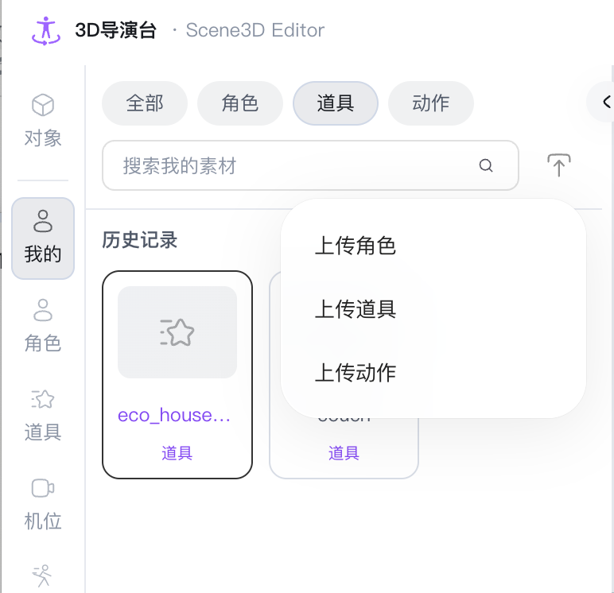](_files_小云雀短剧 Agent 3D导演台使用手册/image_47.png) | 查看自己上传的角色、道具和动作素材；右侧上传按钮可选上传类型。 | 上传中卡片显示进度；失败卡片可点击重试；就绪后点击可添加/应用。 |
| **角色** | [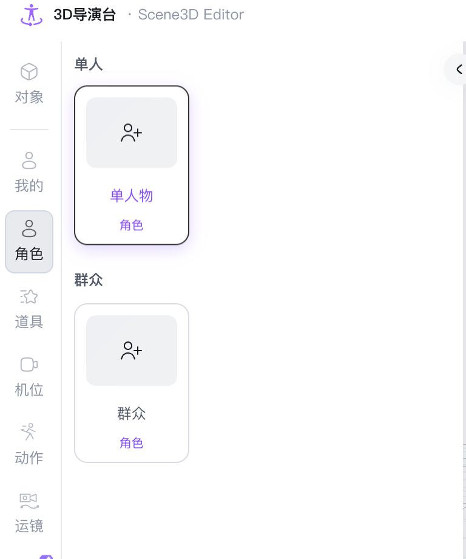](_files_小云雀短剧 Agent 3D导演台使用手册/image_48.png) | 添加单人素模或群众阵列。 | 点击或拖入视窗创建角色；群众资源选中后可在右侧设置行数、列数和间距再添加。 |
| **道具** | [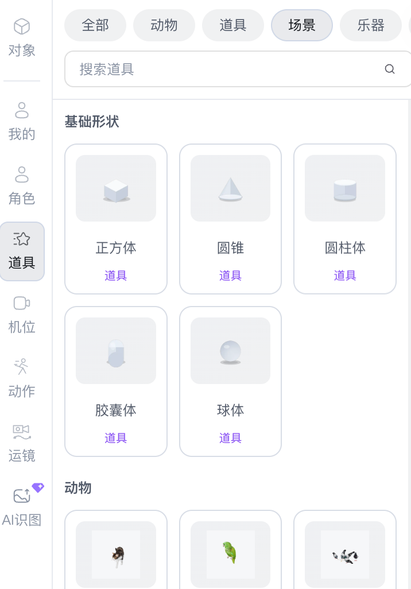](_files_小云雀短剧 Agent 3D导演台使用手册/image_49.png) | 按分类或搜索添加家具、载具、日用品等道具。 | 点击卡片直接添加，也可拖到视窗指定位置；选中角色时，道具会优先放在角色附近便于调整。 |
| **机位** | [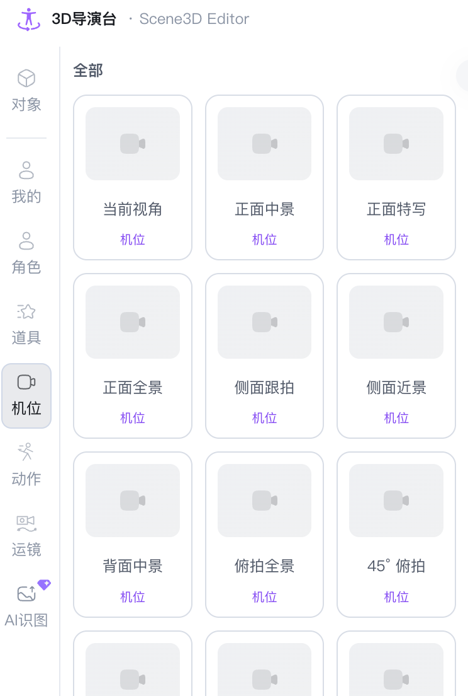](_files_小云雀短剧 Agent 3D导演台使用手册/image_50.png) | 用「当前视角」或正面、侧面、俯拍、仰拍、过肩等预设创建机位。 | 点击卡片新增机位；「当前视角」会把导演视角保存成机位，其他卡片使用固定预设参数。 |
| **动作** | [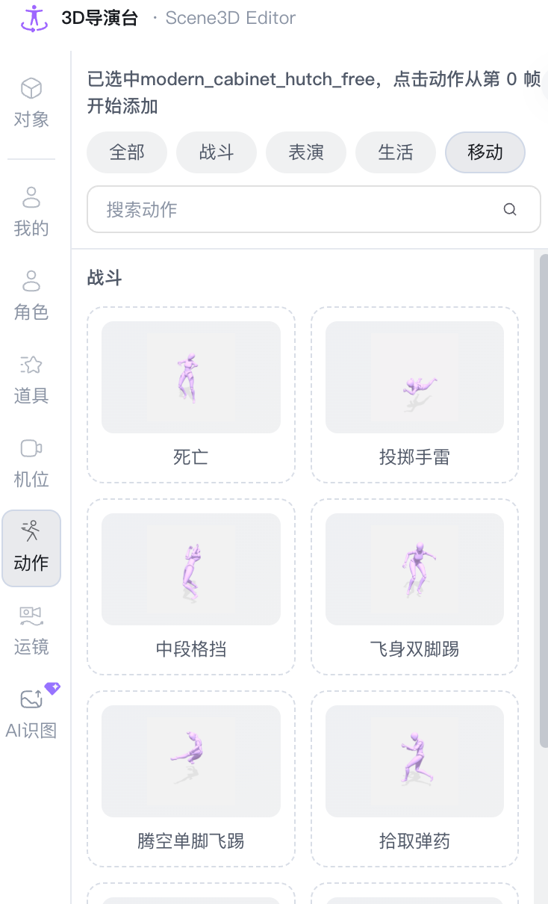](_files_小云雀短剧 Agent 3D导演台使用手册/image_51.png) | 按分类/搜索查找动作，点击或拖拽应用到角色。 | 生成时间轴动作片段；可再调整起止帧、原动作裁剪、速度、循环和原地播放。 |
| **运镜** | [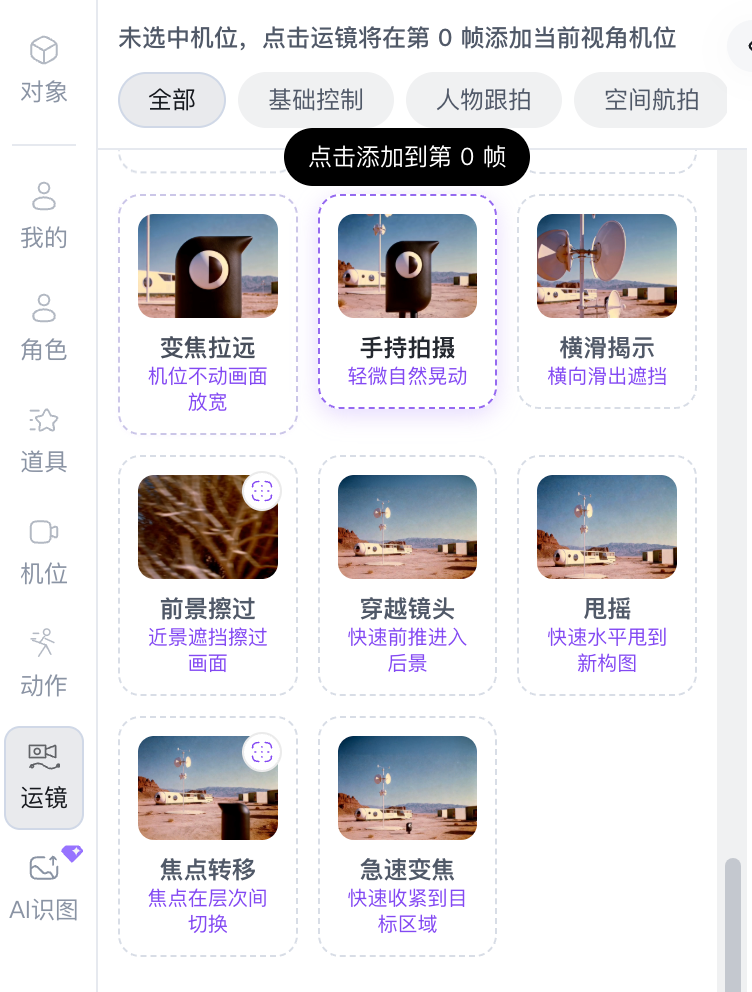](_files_小云雀短剧 Agent 3D导演台使用手册/image_52.png) | 将推拉摇移、跟拍、环绕、航拍等预设应用到机位 | 生成机位运动片段和相应关键数据；不兼容时卡片置灰并显示原因。  部分跟拍预设需要选择主体 |
| **AI 识图** | [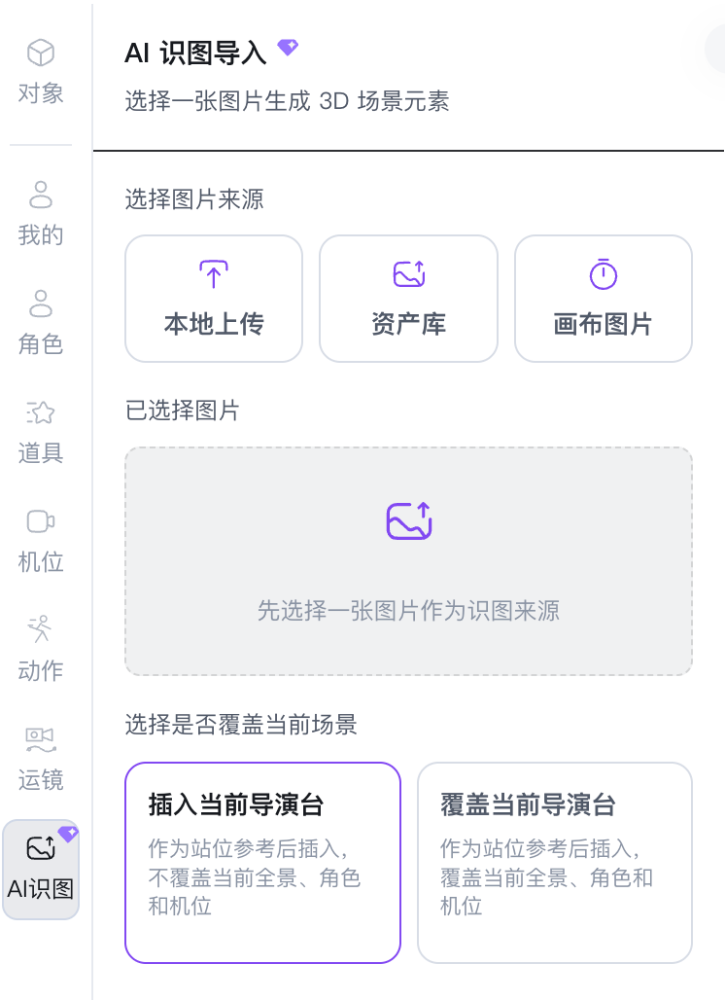](_files_小云雀短剧 Agent 3D导演台使用手册/image_53.png) | 根据参考图生成/复刻 3D 站位和场景 |  |

### 3. 右侧机位预览与属性面板

| 控件 / 区域 | 示意图 | 功能 | 操作结果与注意事项 |
| --- | --- | --- | --- |
| **机位预览** | [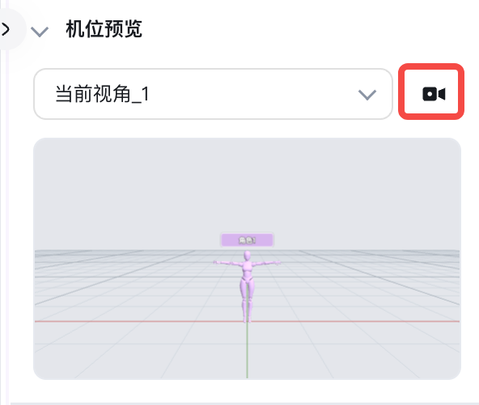](_files_小云雀短剧 Agent 3D导演台使用手册/image_54.png) | 展开/收起实时机位预览。 | 收起可把更多空间留给属性面板；不会删除机位。 |
| **定位视角** | 把右侧当前预览机位激活到中间 3D 视窗。 | 进入机位视图，可直接检查最终构图；再通过机位视图顶部操作返回导演视角或更新机位。 |
| **3D场景属性** |  | 在颜色与全景贴图之间切换，可上传、选历史/资源图、移除贴图或调整全景。 | 「调整全景场景」开启后，在视窗拖动改旋转、滚轮改半径，可点「重置全景场景」；完成后退出调整模式。 |
| **场景·变换/显示** |  | 调整整个场景缩放、平移、旋转，以及角色标签、吸附、地面和透明度。 | 修改场景级全局配置；不等于修改某一个角色或道具。 |
| **角色属性** |  | 编辑位置、旋转、缩放、颜色、骨架显示与姿势。 | 「姿势预设」会一次替换全身姿势；「姿势调节」可对身体、头、手臂和腿部继续微调。模型没有兼容骨骼时姿势功能不可用。 |
| **道具/基础形体属性** |  | 编辑名称、位置、旋转、缩放、材质颜色等。 | 联动缩放打开时，改一个轴会保持比例；关闭后可分轴调整。 |
| **机位属性** |  | 编辑机位位置、旋转/注视目标、FOV、投影方式和裁剪面。 | 已建立对应时间轴通道后，在当前帧修改数值会更新该帧关键值。 |
| **属性分组标题 / 重置** |  | 展开/收起一组属性，重置按钮恢复该组默认值。 | 重置是实际修改数据，可撤销；收起标题只改界面展示。 |

### 4. 底部工具栏与3D 视窗

| 按钮 / 操作 | 功能 | 操作结果与注意事项 |
| --- | --- | --- |
| **移动 W** | 显示位移操作柄，沿 X/Y/Z 轴或平面移动对象。 | 正常状态修改对象位置；对该属性已建时间轴轨道时，在当前帧编辑关键值。 |
| **旋转 E** | 显示旋转环，调整对象或机位方向。 |  |
| **缩放 R** | 显示缩放操作柄，调整整体或单轴比例。 |  |
| **撤销 / 重做** | 回退或重新执行导演台内的可记录操作。 | 覆盖添加/删除对象、变换、属性、分组和时间轴编辑等。 |
| **鼠标视角** | 左键点击选择，左键拖动环绕视角，中键拖动平移，滚轮缩放；Shift/Cmd/Ctrl+左键拖动框选。 | 点击与拖动通过移动阈值区分；触控板双指可平移，捏合用于缩放。 |
| **重置视角** | 恢复默认初始导演视角 | 只重置编辑视角，不会把模型或机位参数重置为默认值。 |
| **绘制轨迹** | 选择「点击绘制」或「自由绘制」，在场景中创建运动路径。 | 进入绘制模式后按页面提示完成或取消；完成后可右键轨迹，应用到角色、角色当前动作或机位。 |
| **全屏** | 将 3D 视窗扩展为全屏编辑。 | 全屏后可用「模型」打开资源对话框；再点全屏按钮退出。 |

### 5. 时间轴控制和轨道操作

| 按钮 / 控件 | 示意图 | 功能 | 操作结果与注意事项 |
| --- | --- | --- | --- |
| **视图** | [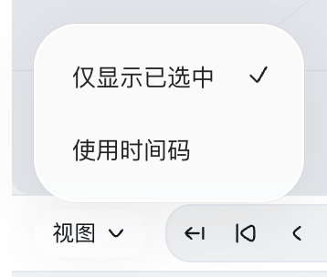](_files_小云雀短剧 Agent 3D导演台使用手册/image_55.png) | 打开时间轴显示选项：「仅显示已选中」和「使用时码」。 | 仅显示已选中时，未选任何对象会看到空轨道；时码只改变时间显示方式。 |
| **跳到起点 / 终点** | [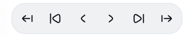](_files_小云雀短剧 Agent 3D导演台使用手册/image_56.png) | 将播放头移到当前帧范围的开始帧或结束帧。 | 不修改内容，只改变当前帧。 |
| **上/下一关键帧** | 在相邻关键帧之间快速跳转。 | 不新增关键帧，只用于定位。 |
| **上/下一帧** | 每次向前或向后移动 1 帧。 | 适合逐帧检查姿势、运动或构图。 |
| **磁铁 / 吸附** |  | 开启或关闭关键帧吸附。 | 开启后会对齐相邻关键帧和重要帧，显示吸附辅助线；需精细自由移动时可关闭。 |
| **播放 / 倒放** |  | 按选定方向播放时间轴；播放中同一按钮变为暂停。 | 用来预览动作、位移、姿势和运镜的组合效果。 |
| **播放选项** | 打开「循环播放」开关。 | 开启后播到区间边界会从另一端继续，便于反复检查衔接。 |
| **当前帧** |  | 输入帧号直接跳转，也可在时间头点击/拖动播放头。 | 切换当前编辑和预览时刻；旁边 fps 是时间轴帧率提示。 |
| **插值下拉** | 把选中关键帧设为 Bezier、Linear 或 Hold。 | Bezier 自然加减速，Linear 匀速过渡，Hold 保持上一值直到下一关键帧。 |
| **删除关键帧/动作/过渡** |  | 删除当前选中的时间轴元素，按钮文案会随选中类型变化。 | 删除可撤销；也可按 Delete/Backspace。当时间轴获得焦点时，Delete 优先删除时间轴选中项。 |
| **缩放滑杆** |  | 放大或缩小时间尺的每帧宽度。 | 只改显示密度，不改变动作时长；触控板捏合也可缩放。 |
| **开始帧 / 结束帧** | 修改播放、录制和渲染使用的时间区间。 | 开始帧不能大于结束帧；修改区间不会自动删除区间外的编辑内容。 |
| **轨道展开/收起** |  | 展开对象的位置、旋转、缩放、注视点、动作等子轨道。 | 只改显示层级；不删除关键帧。被钉住的对象即使未选中也可保留在时间轴中。 |
| **关键帧 / 片段** | [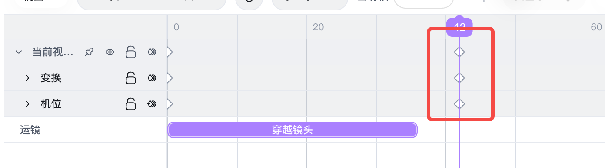](_files_小云雀短剧 Agent 3D导演台使用手册/image_61.png)  [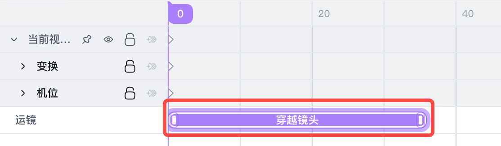](_files_小云雀短剧 Agent 3D导演台使用手册/image_62.png) | 点击选中，Shift/Cmd/Ctrl 追加选中，空白区拖框多选，拖动改发生时间。 | 关键帧可复制/粘贴、删除、改插值；动作片段可移动、分割、复制、删除，并在右侧精调裁剪、速度、循环和原地播放。 |

---
