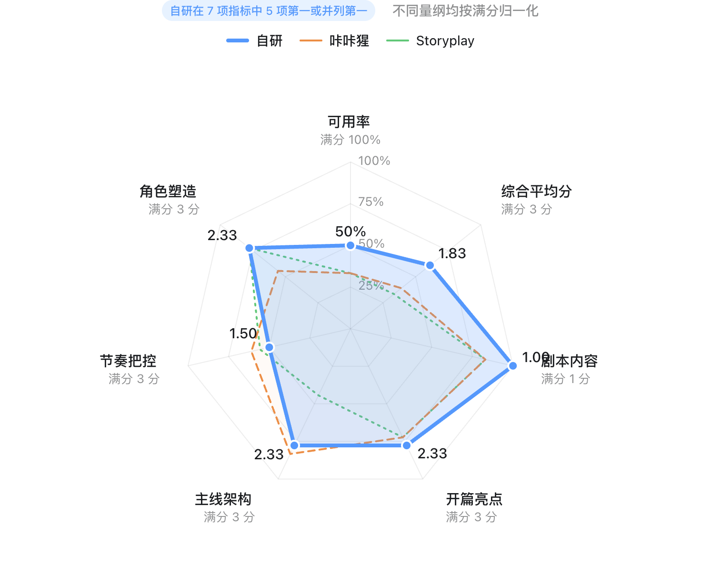
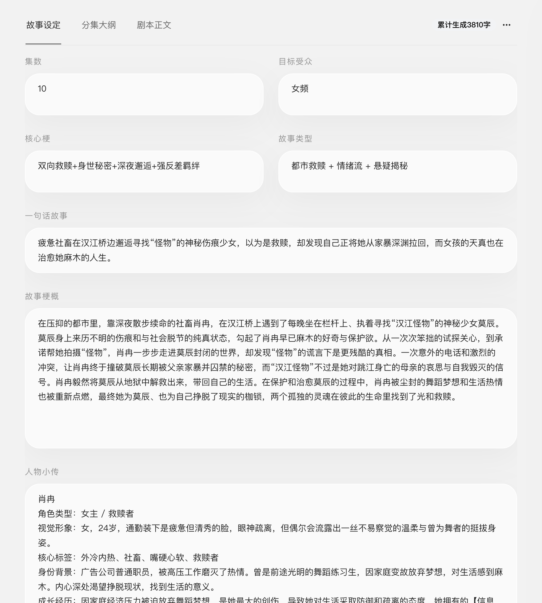
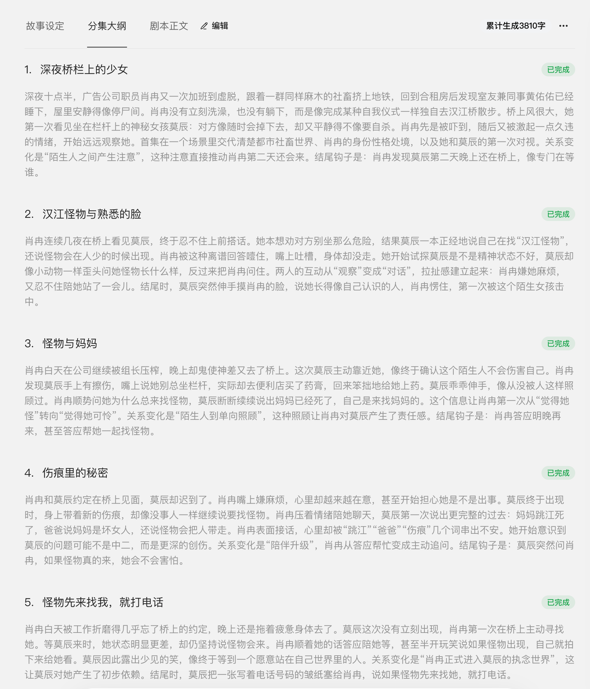
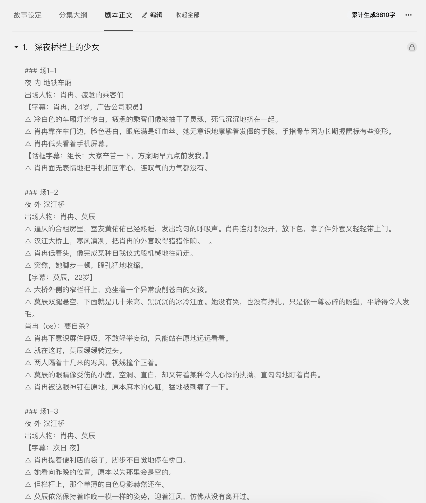
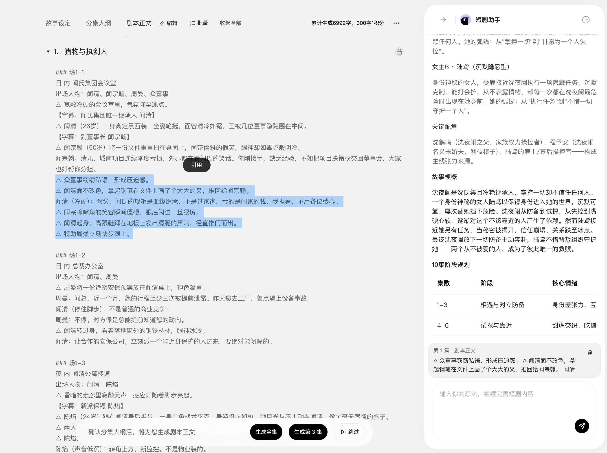
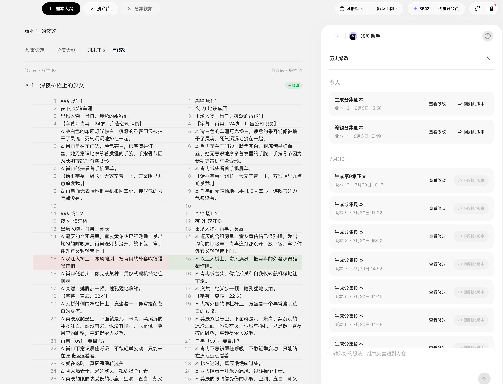
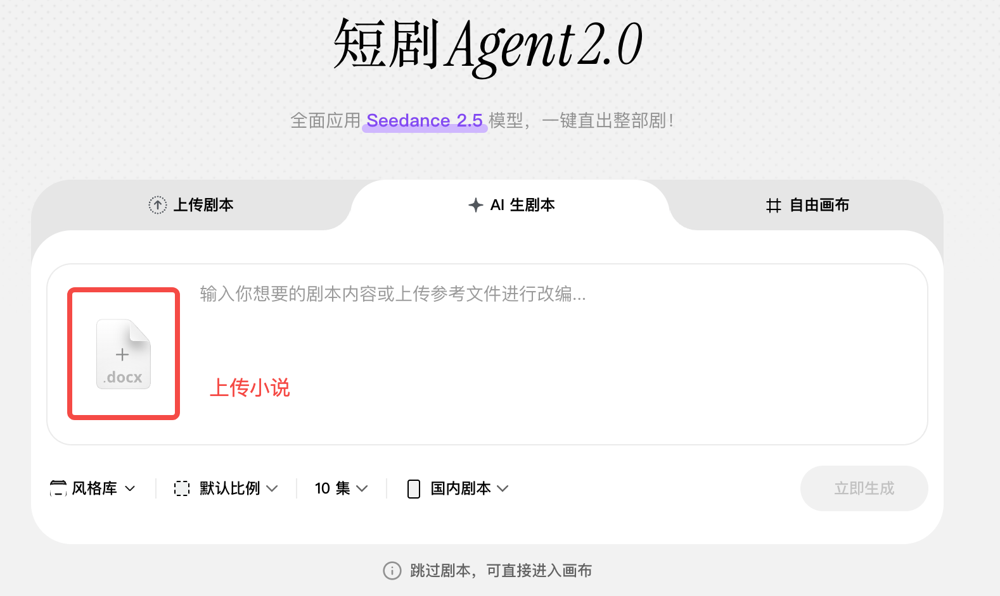
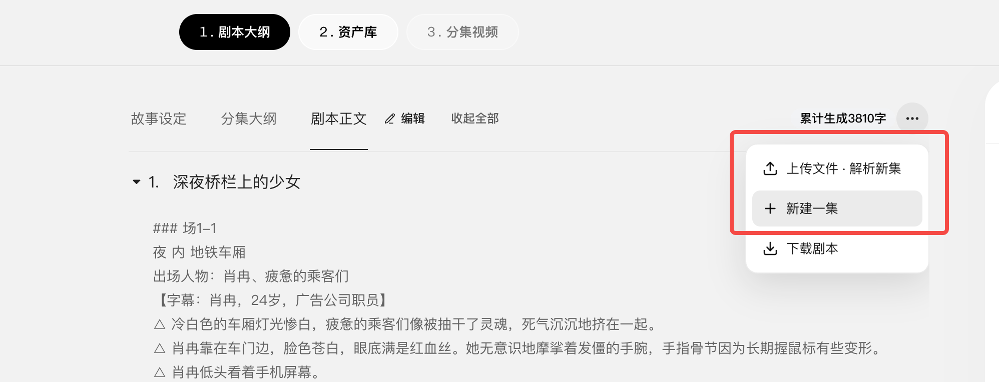
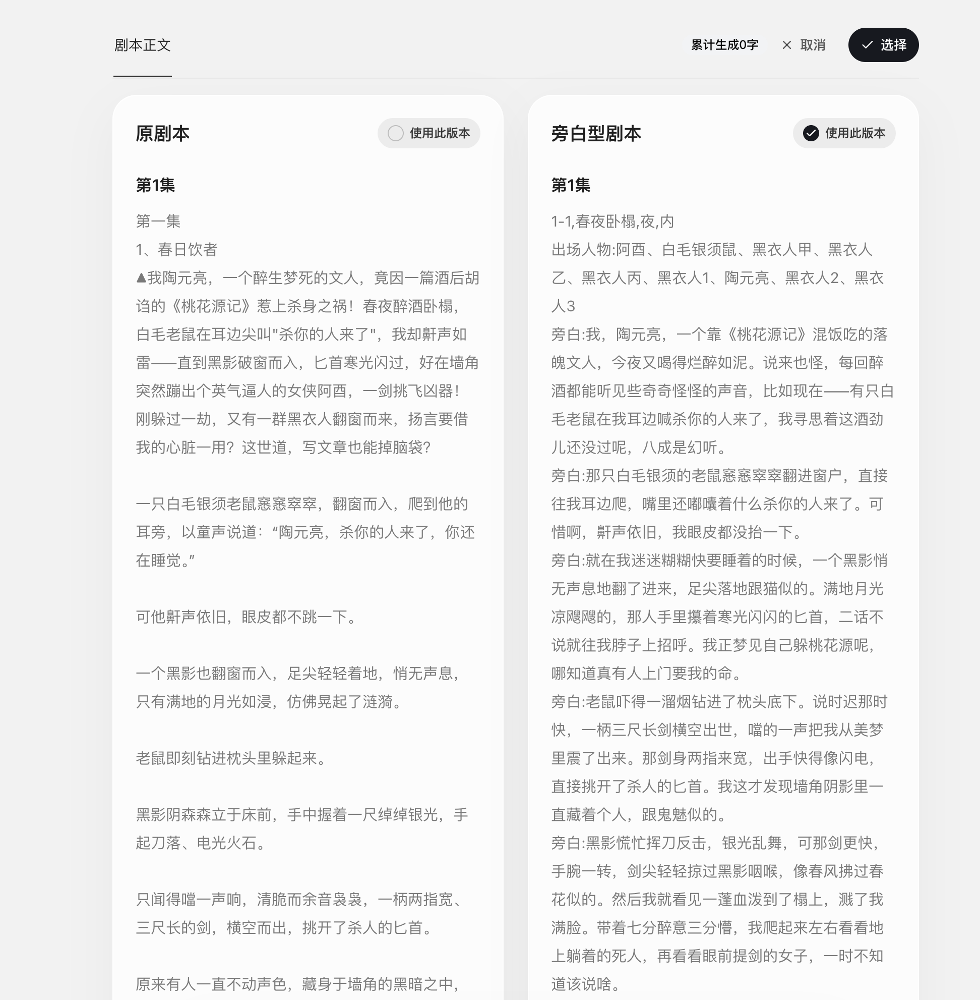
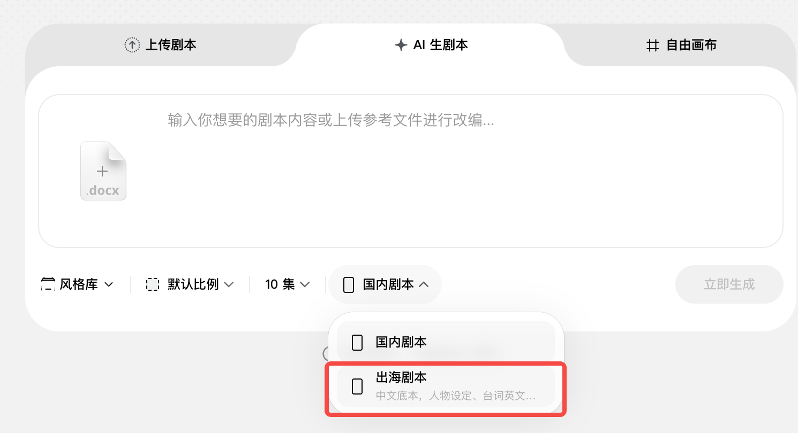

# 小云雀短剧 Agent 剧本助手

> 来源：https://xyq.jianying.com/tutorials/short-drama-agent-script-assistant
> 抓取时间：2026-09-23 09:22（离线快照，原文见链接）

浏览本页目录

小云雀 · 短剧 Agent

# 短剧 Agent 剧本助手

一句话，把创意变成好剧本。用专业热点库找到方向，用剧本模型生成故事，再通过对话共创、定位微调与版本管理持续打磨。

- **更专业**

  热点、结构、人物与节奏都有专业能力支撑。
- **更简单**

  像聊天一样描述想法，无需掌握复杂提示词。
- **更可控**

  支持定向微调和历史版本回退。

## 一、核心能力：专业灵感、专业模型、专业流程

### 1. 专业热点库：让灵感跟上趋势

面对“写什么”这个难点，短剧 Agent 提供经过整理和验证的热点参考，帮助你发现值得讲、适合讲、容易被看见的故事方向。

| 辅助知识库 | 提供什么 | 解决什么问题 |
| --- | --- | --- |
| 短剧知识 | 题材趋势、情绪母题、关系设定与故事钩子，以及适合短剧表达的冲突、人物关系和叙事方向 | 不知道写什么，或已有灵感但不知道怎样转化成短剧 |
| 生态验证热点 | 来自字节生态、已经获得用户反馈的内容信号 | 让创作方向更贴近真实内容消费偏好 |

**热点不是照搬爆款。**它帮助创作者结合自己的题材与表达，形成新的故事。

### 2. 专业剧本模型：行业最强剧本模型

**好结构 + 好角色 + 好节奏 = 好剧本**

- **好结构**

  开篇快速建立核心矛盾；主线清晰、冲突持续升级；阶段目标明确、前后因果成立。
- **好角色**

  人物目标、动机和阻力明确；关系具有张力；行为符合人设并推动剧情。
- **好节奏**

  信息释放紧凑；每集都有推进、反转或情绪回报；集尾形成悬念。

小云雀剧本模型与行业产品对比

### 3. 专业创作流程：从 0 到 1 三阶段定稿

创作过程拆成故事设定、分集大纲和剧本正文三个阶段。每阶段都可编辑调整，逐步确认形成完整剧本。

从找准方向、生成剧本到微调定稿的创作流程

| 阶段 | 核心目标 | 阶段产出 |
| --- | --- | --- |
| 故事设定 | 找灵感、定方向 | 清晰的创作定位与故事方向 |
| 分集大纲 | 定钩子、定节奏 | 可继续编辑的分集大纲 |
| 剧本正文 | 专业生成、定点微调 | 更成熟、可控的定稿版本 |

故事设定

分集大纲

剧本正文

## 二、创作体验：简单，可控

### 1. 对话生成：降低创作门槛

在剧本阶段，通过对话把一次性生成升级为对话共创。你可以围绕人物、情节、节奏和台词持续澄清、追问和微调。

**你可以这样开始**

- “我想写一个都市女性复仇故事，节奏要快。”
- “给我几个适合东南亚市场的家庭冲突方向。”
- “最近某类片子很火，我也想做类似题材。”

**也可以这样继续**

- “第一集进入冲突太慢，提前暴露秘密。”
- “女主现在太被动，让她主动设局反击。”
- “这段台词太书面，改得更口语、更有火药味。”

**没有完整想法也能开始。**一张图、一句话、一种情绪，都可以成为创作起点。

### 2. 灵活修改：随时随地任意微调

可以针对创作定位做定向调整，剧本助手会围绕新要求继续创作。

| 可调维度 | 典型需求 | 表达示例 |
| --- | --- | --- |
| 题材受众 | 更换市场、受众或内容类型 | 保留核心设定，改成更适合年轻女性的都市甜虐。 |
| 人物关系 | 强化人设、动机或人物张力 | 让反派更聪明，不要只靠误会推动剧情。 |
| 情节节奏 | 加快推进，增强爽感、悬念或情感浓度 | 把身份揭晓提前到第 3 集，并增加一次反转。 |
| 语言风格 | 调整台词口吻、地域感或表达强度 | 台词更生活化，减少解释，多用人物之间的对抗呈现信息。 |

围绕创作定位继续对话和微调

### 3. 历史记录：安全试错，大胆探索

历史记录保留不同阶段的创作结果，便于查看、比较和回退。你可以大胆探索新方向，同时保留满意版本。

- **查看**

  回顾每轮修改前后的内容。
- **比较**

  对照人物、结构、节奏与台词变化。
- **回退**

  恢复更满意的版本并继续调整。

历史版本记录与修改查看

## 三、全面覆盖：小说改编、系列剧、解说剧、出海剧

除了从 0 到 1 生成剧本，还能围绕已有内容继续创作：小说改编、系列剧连载、解说剧改写和出海本土化。

- **小说改编**

  提炼长文本主线、人物和高价值情节。
- **连载能力**

  承接角色、世界观和剧情资产。
- **解说剧与出海**

  改为旁白驱动表达，或适配目标市场。

### 1. 小说改编：把长文本重构为短剧

提炼长文本主线与高价值情节，在保留核心设定和情感主线的基础上，完成内容取舍、人物重构和节奏短剧化。

**小说改编不是简单摘要或逐段搬运。**核心是围绕短剧时长、节奏和视听表达进行结构化再创作，同时通过对话明确必须保留和可以调整的范围。

上传小说并设置改编参数

### 2. 连载能力：让系列剧持续生产

承接已有故事、角色和世界观，既适合系列 IP，也支持先试水再根据数据反馈续写。

| 连载类型 | 场景价值 |
| --- | --- |
| 系列剧 / IP | 承接前作积累的用户认知和相对明确的消费人群 |
| 试水剧 | 先完成少量剧集，边写边拍，再根据反馈决定继续、调整或收束 |
| 日更剧情 / 泡面番 | 轻量、短篇、高频，适合稳定更新和快速消费 |
| 番外 / 彩蛋 / 多分支 | 复用已有角色、场景和世界观，探索独立内容或不同方向 |

上传文件解析新集或新建一集

### 3. 改旁白型剧本：把故事重构为解说剧

提炼核心事件和关键情绪，用旁白串联信息、画面呈现动作，并保留必要对白承接人物关系与戏剧爆点。

| 改写维度 | 具体能力 |
| --- | --- |
| 剧情提炼 | 识别关键冲突、人物关系与情绪转折，压缩不适合旁白讲述的次要内容 |
| 叙事视角 | 根据内容选择第一或第三人称，适配悬疑、情感、爽感、轻喜等语气 |
| 旁白画面 | 重组旁白、必要对白、人物动作与画面提示，减少旁白对画面信息的重复 |

原剧本与旁白型剧本对比

### 4. 出海本土化：让出海故事更贴近目标市场

剧本本土化不是逐字翻译。它保留核心冲突、人物动机和情绪价值，同时适配目标市场的语言、人物、文化和叙事习惯。

| 本土化维度 | 适配内容 | 目标 |
| --- | --- | --- |
| 语言表达 | 台词、旁白、称谓与口语习惯 | 减少直译感，让表达符合目标语言习惯 |
| 人物关系 | 人名、家庭结构、职业背景、身份关系和互动方式 | 降低理解门槛，让人物设定贴近当地受众 |
| 文化语境 | 地名、节日、饮食、生活习惯和社会情境 | 替换强地域限定元素，减少文化隔阂 |
| 叙事节奏 | 信息释放、冲突表达、情感推进与集尾钩子 | 适配目标市场的内容消费习惯 |

国内剧本与出海剧本设置

## 四、典型使用场景

| 场景 | 常见难题 | 剧本助手如何帮助 |
| --- | --- | --- |
| 从 0 到 1 找选题 | 没有明确方向，不知道当下观众爱看什么 | 从专业热点库获得灵感，完成题材与受众定位 |
| 把灵感变成剧本 | 只有一句话设定，缺少人物、结构与情节 | 基于专业剧本模型补全故事骨架并生成剧本 |
| 将小说改编为短剧 | 原作篇幅长、人物多、支线复杂 | 提炼主线、重构人物关系，完成短剧化节奏、分集钩子与视听表达 |
| 优化已有剧本 | 故事能看，但冲突弱、节奏慢或人物不鲜明 | 针对指定问题局部微调，保留已有优势 |
| 探索多个创作方向 | 想比较不同市场、风格或人物设定 | 通过对话生成多个版本，并借助历史记录切换与回退 |
| 持续开发系列内容 | 需要承接前作设定，或根据试水数据续写 | 复用角色、世界观和剧情资产，支持系列剧、日更、番外与多分支 |
| 改写旁白型解说剧 | 原剧本信息分散，不适合用旁白快速讲述 | 提炼主线、统一叙事视角，重组旁白、画面和必要对白 |
| 制作出海本土化版本 | 直译生硬，人物与文化语境离目标市场较远 | 保留故事内核，适配语言、人物关系、文化元素和叙事节奏 |
