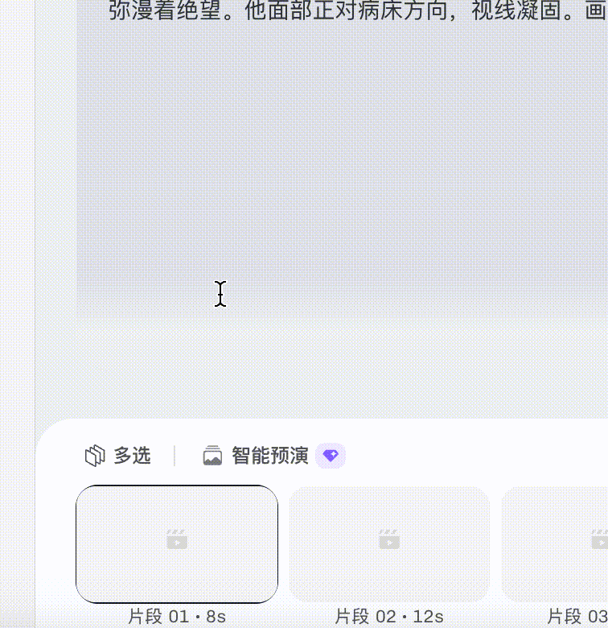
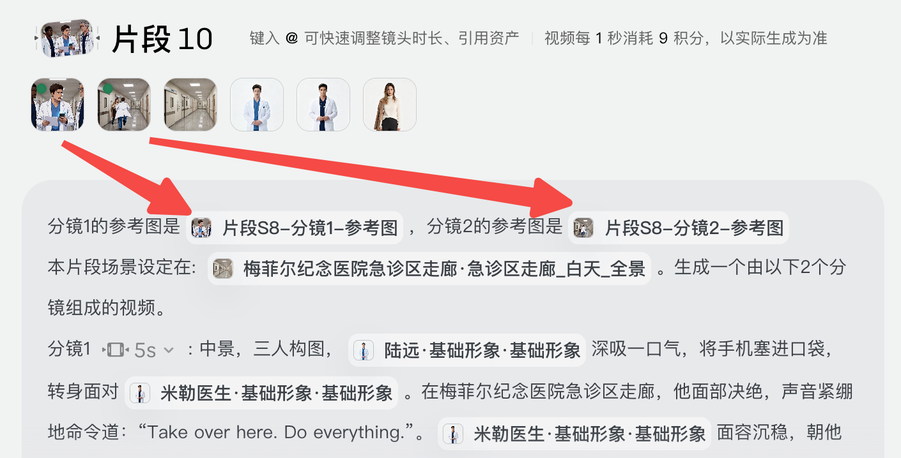
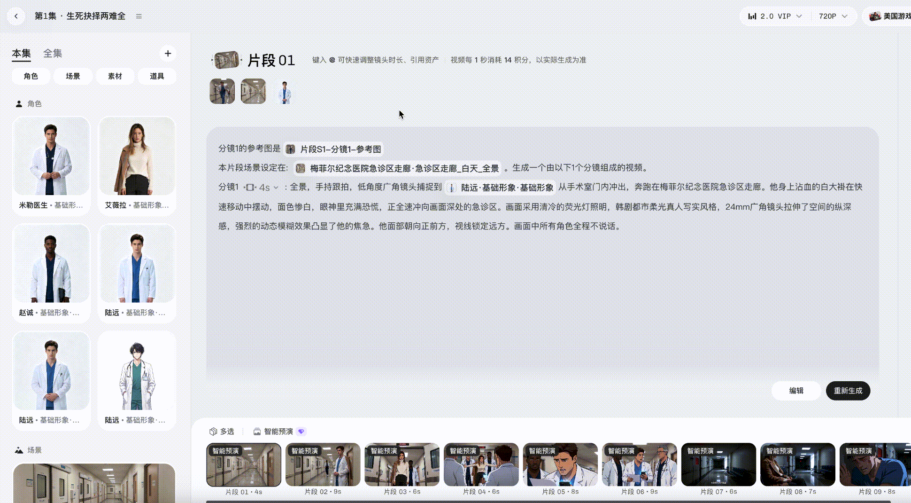

# 小云雀短剧 Agent 智能预演体验指南

> 来源：https://xyq.jianying.com/tutorials/short-drama-agent-smart-preview
> 抓取时间：2026-09-23 11:20（离线快照，原文见链接）

[小云雀](https://xyq.jianying.com/)/[教程中心](https://xyq.jianying.com/tutorials)/智能预演浏览本页目录

1. [为什么要用智能预演](#JvzydkpVuokPmQxu8PKc3VD0nFb)
2. [功能简介](#MfMOdf7lFoUV6IxA16KcywsSnWe)
3. [功能详述](#JTGCdcGkooE3BOxZ45jcjc6wnUd)
   1. [如何使用？](#SiLRdJtnioMLyXxuu5lcLyIBnUd)
   2. [怎么修改？](#W3D0d0LkgoVLoNxWKqCcDd3dnYd)

小云雀 · 短剧 Agent

# 智能预演体验指南

预演整组镜头、统一规划分镜，并自动把关键帧插入对应片段，帮助多镜头剧情保持人物动作、运镜关系和空间逻辑一致。

## 为什么要用智能预演

****常见痛点****

1. 首尾帧只能解决两个镜头的一致性，多镜头仍需反复抽卡。
2. 运镜和空间逻辑容易跳变，正反打镜头难以保持一致。
3. 手动补救成本高，链路长且繁琐。

****推荐用法：****先把剧本和每幕分镜调整到位，一键生成智能预演；确认分镜图无误后，再生成视频。

## 功能简介

在片段轴中打开智能预演

****智能预演****基于镜头提示词，预演并统一规划关键分镜图，自动插入片段作为视频参考。

它相当于导演助理，先为整组镜头做好规划，从而降低抽卡率。

## 功能详述

### 如何使用？

选择一组需要预演的片段

查看自动插入的分镜参考图

1. 在分集编辑器底部点击「智能预演」，选择一组已经确认提示词的片段，再点击「生成智能预演」。
2. 生成后，分镜图会自动插入对应片段，并用绿点提示查看。
3. 确认分镜图无误后，直接生成视频。

****温馨提示****

1. 预演片段需要多于 2 个。
2. 所选片段引用的素材不能超过 9 个。

### 怎么修改？

查看智能预演分镜结果

重新抽卡规划片段分镜

****整体不满意：****选中片段再次抽卡，重新规划分镜内容。

****单个分镜图不满意：****

1. 打开分镜图右上角的编辑入口，进入画布。
2. 从分镜图拉出节点，输入修改想法并生成图片。
3. 把新图片添加到素材。
4. 在资产库中将新分镜图拖入编辑器。

****期待大家给我们多多反馈～****

继续阅读

- [****小云雀 Web 产品手册 →****从产品入门到完整创作流程，了解短剧与漫剧、视频与图片、营销内容、一镜到底和爆款复刻。](https://xyq.jianying.com/tutorials/web-manual)
- [****小云雀 Seedance 2.5 使用手册 →****了解 Seedance 2.5 的模型能力、创作步骤、专属玩法与提示词，通过真实案例掌握视频创作。](https://xyq.jianying.com/tutorials/seedance-2-5)
- [****小云雀 Seedance 2.0 使用手册 →****学习 Seedance 2.0 的沉浸式短片创作、素材引用、爆款复刻与模型切换，查看电影运镜、剧情、广告和知识科普案例及完整提示词。](https://xyq.jianying.com/tutorials/seedance-2-0)
- [****小云雀 Seedream 5.0 Pro 用户手册 →****了解 Seedream 5.0 Pro 的精准编辑、多图融合、商业设计与艺术创作能力，查看参考图、提示词、使用技巧和能力边界。](https://xyq.jianying.com/tutorials/seedream-5-0-pro)
- [****小云雀短剧 Agent 画布使用手册 →****学习短剧 Agent 资产创作画布的角色与场景节点、素材引用、资产库同步、节点编辑和快捷键，完成短剧资产整理与生成。](https://xyq.jianying.com/tutorials/short-drama-agent-canvas)
- [****小云雀短剧 Agent 3D 导演台使用手册 →****从静态构图到动态预演，学习角色站位、动作与运镜、时间轴编排、导出参考，以及快捷键和按钮功能。](https://xyq.jianying.com/tutorials/short-drama-agent-3d-director)
- [****小云雀创作 Agent 画布使用手册 →****学习创作 Agent 的对话与画布协作、资产引用、图片视频节点编辑、智能运镜、批量管理与创作记录分享。](https://xyq.jianying.com/tutorials/creation-agent-canvas)
- [****小云雀营销 Agent 产品使用手册 →****从商品与卖点出发，学习营销 Agent 的 Showcase、创意库、Hook 库、风格库、画布和一键出海，查看营销视频案例。](https://xyq.jianying.com/tutorials/marketing-agent)
- [****小云雀短剧 Agent 剧本助手 →****了解短剧 Agent 的热点库、专业剧本模型、对话共创、版本管理、小说改编、系列剧、解说剧和出海本土化能力。](https://xyq.jianying.com/tutorials/short-drama-agent-script-assistant)
- [****短剧「重制转绘」使用手册 →****学习上传原片、设置画风和目标地区、解析与本土化资产、生成分集脚本、白模复刻、分镜精修和合成导出。](https://xyq.jianying.com/tutorials/short-drama-remake)

内容来源：[小云雀短剧 Agent 智能预演体验指南](https://bytedance.larkoffice.com/wiki/C27ewQCAjiRm1wkiNt6cF3wXnhe)

[返回顶部 ↑](#content)
