# 短剧重制转绘使用手册

> 来源：https://xyq.jianying.com/tutorials/short-drama-remake
> 抓取时间：2026-09-23 11:20（离线快照，原文见链接）

[小云雀](/)/[教程中心](/tutorials)/重制转绘浏览本页目录

1. [什么是「重制转绘」？](#H0bldvOckoMk5Xx3HY2cXbLpnqf)
   1. [它能帮你做什么](#S9q7d9eRjoeHKkxuJGicnn50n5e)
2. [分环节使用指南](#E1usd9JpWodeKBxq8aOcH6pgnad)
   1. [环节一 · 进入功能入口](#NlxDdRXLCoptbfxW7EXcQ7Irn5e)
   2. [环节二 · 上传原片并设置参数](#Xm3OdVDuRo5hVbxc0wscfLI9nJc)
   3. [环节三 · 确认解析](#CDwgdld1sodwBjxgzu4cttwjnHd)
   4. [环节四 · 等待解析完成](#GJo7dsh4aouLNZxBM4PcliROnug)
   5. [环节五 · 资产本土化](#Ml53dDc7IoKwvnxKFc6czBFDn6g)
   6. [环节六 · 资产库](#DsncdgWpdouquxxFZGTcmyOlntb)
   7. [环节七 · 生成分集脚本](#Owt5dcR5RoWavoxiskUcQ308nXe)
   8. [环节八 · 分镜工作台](#I9ppdCAFpoHcl7xCkq3cZEEGnae)
   9. [环节十 · 合成导出成片](#Izg0dUE5yoxbUuxC6Fzc5bVGnQc)

小云雀 · 短剧 Agent

# 短剧「重制转绘」使用手册

上传原始短剧，系统自动识别角色与场景，再按新画风和目标地区重新生成成片。无需剪辑或 AI 经验，按流程操作即可。

## 什么是「重制转绘」？

重制转绘是一条“原片复刻”流水线：理解原片中的角色、场景和道具，尽量保留剧情节奏与镜头结构，再按指定风格和地区重新生成。

****适合谁用：****想把已有短剧换画风、换地区版本重新发行的创作者、运营和出海团队。

[VIDEO](_files_短剧重制转绘使用手册/video_1.mp4)

****重制转绘效果展示****

### 它能帮你做什么

| 能力 | 说明 |
| --- | --- |
| ****镜头语言 1:1 复刻**** | 用原视频白模作为运动参考，继承机位、运镜与切镜 |
| ****Seedance 2.5 加持**** | 提升复刻画质与还原度 |
| ****更长单集时长**** | 单集最长 5 分钟，总时长可达 100 分钟 |
| ****17 种目标地区**** | 自适应当地人种、语言与环境特征 |
| ****一次解析多种风格**** | 切换画面风格与画幅比例 |
| ****两类复刻模式**** | 白模复刻强调精准，普通复刻兼顾性价比 |

## 分环节使用指南

****整体流程：****上传原片 → 设置风格、比例和地区 → 解析 → 资产本土化 → 生成资产 → 生成分集脚本 → 分镜精修 → 合成导出。

### 环节一 · 进入功能入口

进入短剧 Agent 顶部的「重制转绘」，点击或拖拽上传视频。支持 mp4、mov，单个视频 5–300 秒且不超过 500MB；最多 20 个视频，单项目总时长 100 分钟。

> ****请确认对上传视频拥有合法版权或已经获得授权。****

[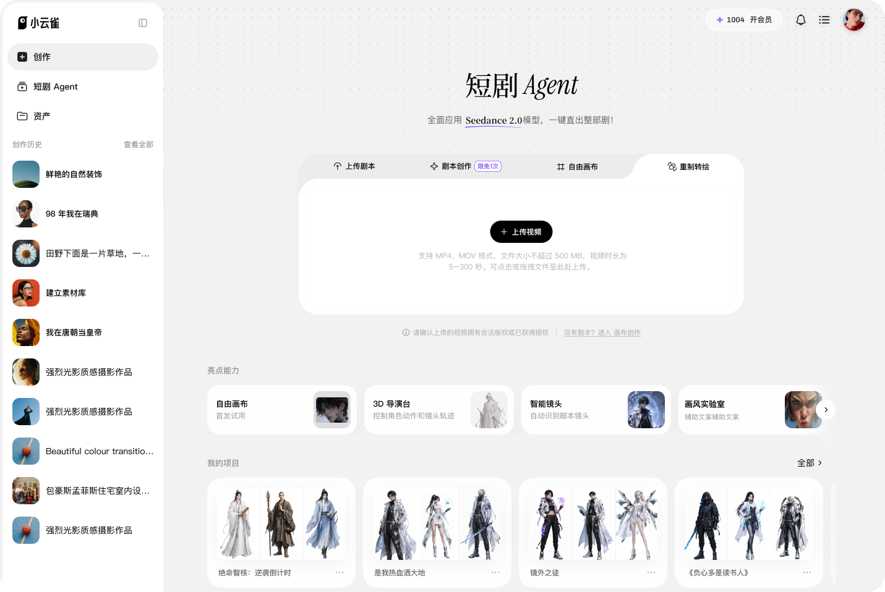](_files_短剧重制转绘使用手册/image_1.png)

进入重制转绘并上传剧集

### 环节二 · 上传原片并设置参数

上传中或完成后，可以添加原片、调整集数顺序、重新上传或删除某一集。随后设置风格、画幅比例和目标地区。

1. ****风格：****选择成片画风。
2. ****比例：****按投放平台选择横屏或竖屏。
3. ****目标地区：****选择中国、日本、韩国、美国、印尼、巴西、南非、墨西哥等地区。

视频必须全部上传完成，并选好风格与目标地区，才能点击「确认顺序并解析」。

[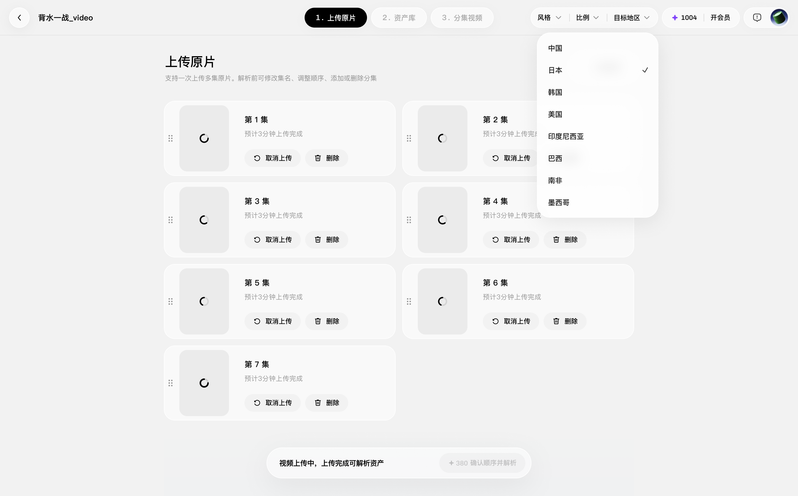](_files_短剧重制转绘使用手册/image_2.png)

批量上传并设置目标地区

### 环节三 · 确认解析

点击「确认顺序并解析」后会显示预计积分消耗。确认后不能再调整集数顺序、增删原片或切换目标地区，请提交前再次核对。

[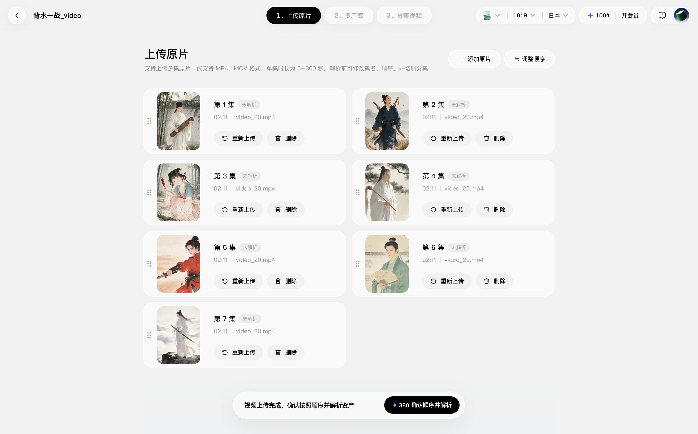](_files_短剧重制转绘使用手册/image_3.png)

确认视频顺序并解析资产

### 环节四 · 等待解析完成

每集会依次显示未解析、解析中和解析完成。单集解析失败不影响其他集，点击「重新解析」即可一次重试全部失败剧集。

[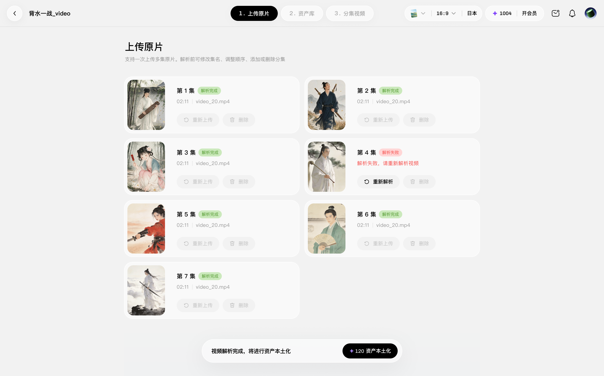](_files_短剧重制转绘使用手册/image_4.png)

查看解析状态并重试失败剧集

### 环节五 · 资产本土化

解析完成后执行资产本土化。系统会依据目标地区和语言调整角色、场景等资产；该步骤按视频总时长预估积分。

[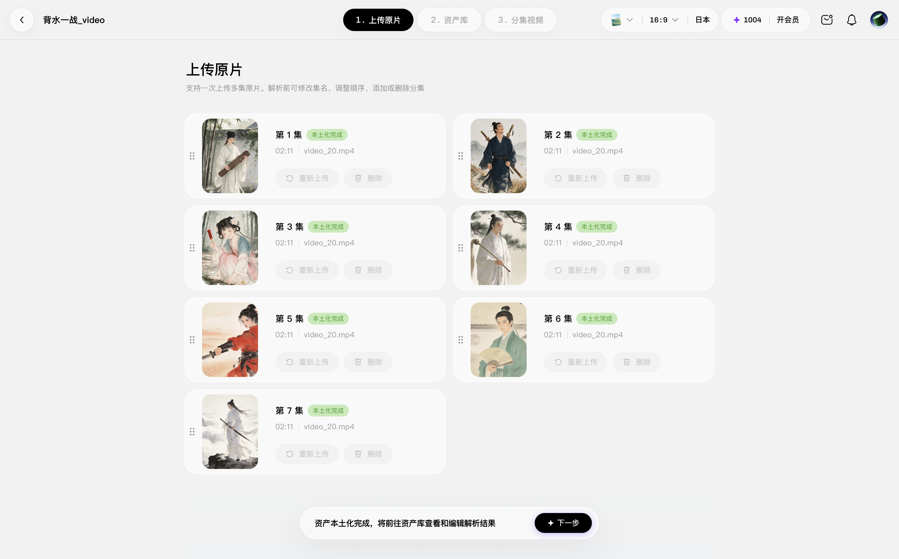](_files_短剧重制转绘使用手册/image_5.png)

完成资产本土化后进入下一步

### 环节六 · 资产库

在资产库检查角色、场景、道具和素材。逐项核对描述和原片参考图，不满意的内容可重新生成或微调，也可用「批量」生成全部资产图片。

[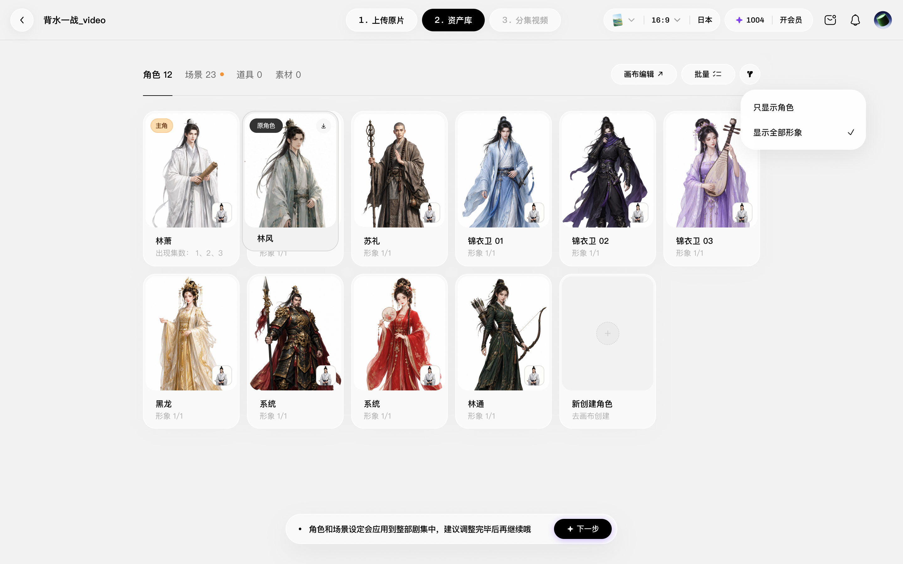](_files_短剧重制转绘使用手册/image_6.png)

在资产库核对本土化角色与场景

### 环节七 · 生成分集脚本

切到分集视频，为每一集生成分镜脚本；右上角「批量」可处理多集。积分按原视频时长和实际生成结果计算。

[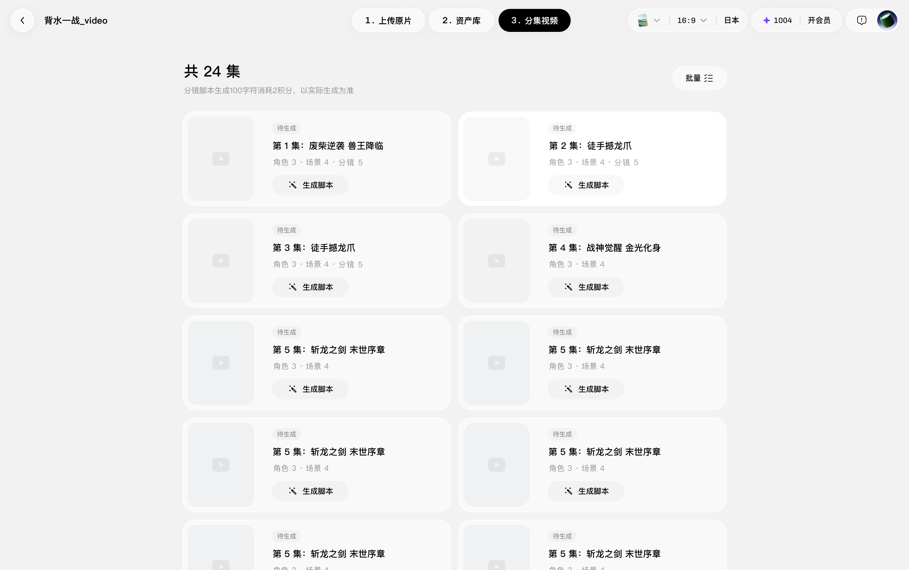](_files_短剧重制转绘使用手册/image_7.png)

批量生成分集脚本

### 环节八 · 分镜工作台

分镜工作台左侧是角色与场景资产，中间是片段脚本分镜，右侧可在转绘、原片、白模和对比视图间切换。确认满意后点击「合成全集」。

[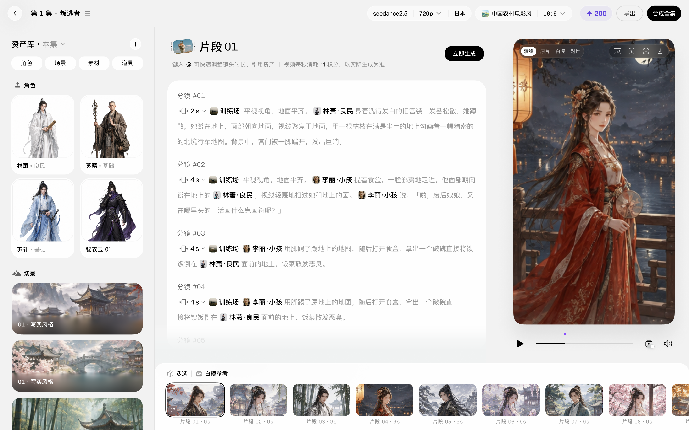](_files_短剧重制转绘使用手册/image_8.png)

逐片段检查分镜脚本和预览

[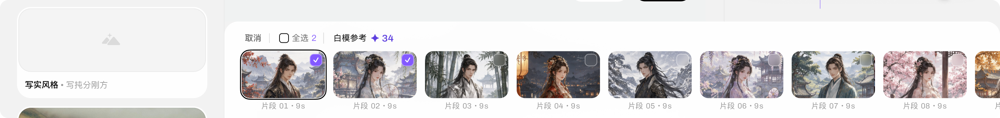](_files_短剧重制转绘使用手册/image_9.png)

选择需要生成白模参考的片段

[VIDEO](_files_短剧重制转绘使用手册/video_2.mp4)

****白模参考效果示例****

白模生成后会自动作为复刻素材引用。复刻中可打开「对比」，同步查看原片和复刻版。

[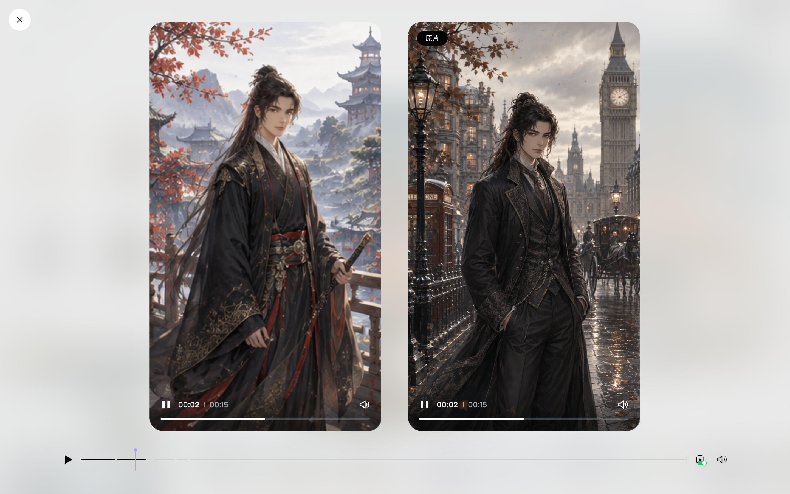](_files_短剧重制转绘使用手册/image_10.png)

原片与复刻版同步对比

### 环节十 · 合成导出成片

回到分集列表查看状态。已经完成的分集可以播放、继续编辑或下载。

[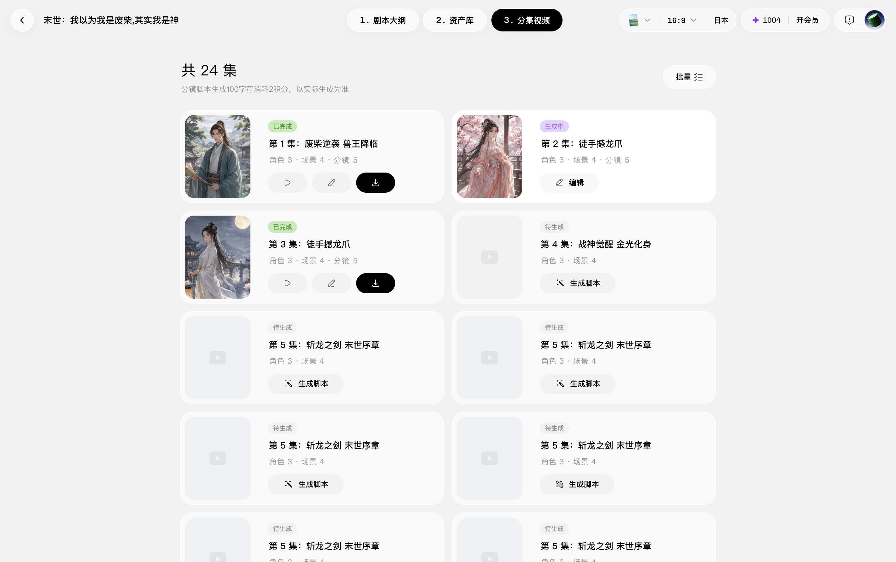](_files_短剧重制转绘使用手册/image_11.png)

播放、编辑或下载已完成分集

继续阅读

- [****小云雀 Web 产品手册 →****从产品入门到完整创作流程，了解短剧与漫剧、视频与图片、营销内容、一镜到底和爆款复刻。](/tutorials/web-manual)
- [****小云雀 Seedance 2.5 使用手册 →****了解 Seedance 2.5 的模型能力、创作步骤、专属玩法与提示词，通过真实案例掌握视频创作。](/tutorials/seedance-2-5)
- [****小云雀 Seedance 2.0 使用手册 →****学习 Seedance 2.0 的沉浸式短片创作、素材引用、爆款复刻与模型切换，查看电影运镜、剧情、广告和知识科普案例及完整提示词。](/tutorials/seedance-2-0)
- [****小云雀 Seedream 5.0 Pro 用户手册 →****了解 Seedream 5.0 Pro 的精准编辑、多图融合、商业设计与艺术创作能力，查看参考图、提示词、使用技巧和能力边界。](/tutorials/seedream-5-0-pro)
- [****小云雀短剧 Agent 画布使用手册 →****学习短剧 Agent 资产创作画布的角色与场景节点、素材引用、资产库同步、节点编辑和快捷键，完成短剧资产整理与生成。](/tutorials/short-drama-agent-canvas)
- [****小云雀短剧 Agent 3D 导演台使用手册 →****从静态构图到动态预演，学习角色站位、动作与运镜、时间轴编排、导出参考，以及快捷键和按钮功能。](/tutorials/short-drama-agent-3d-director)
- [****小云雀创作 Agent 画布使用手册 →****学习创作 Agent 的对话与画布协作、资产引用、图片视频节点编辑、智能运镜、批量管理与创作记录分享。](/tutorials/creation-agent-canvas)
- [****小云雀营销 Agent 产品使用手册 →****从商品与卖点出发，学习营销 Agent 的 Showcase、创意库、Hook 库、风格库、画布和一键出海，查看营销视频案例。](/tutorials/marketing-agent)
- [****小云雀短剧 Agent 剧本助手 →****了解短剧 Agent 的热点库、专业剧本模型、对话共创、版本管理、小说改编、系列剧、解说剧和出海本土化能力。](/tutorials/short-drama-agent-script-assistant)
- [****小云雀短剧 Agent 智能预演体验指南 →****学习用智能预演统一规划多镜头分镜、自动插入关键帧、减少抽卡，并通过再次抽卡或画布编辑调整结果。](/tutorials/short-drama-agent-smart-preview)

内容来源：[短剧「重制转绘」使用手册](https://bytedance.larkoffice.com/docx/MnpVdCS6uosSv4x0lBZcys81nKK)

[返回顶部 ↑](#content)
