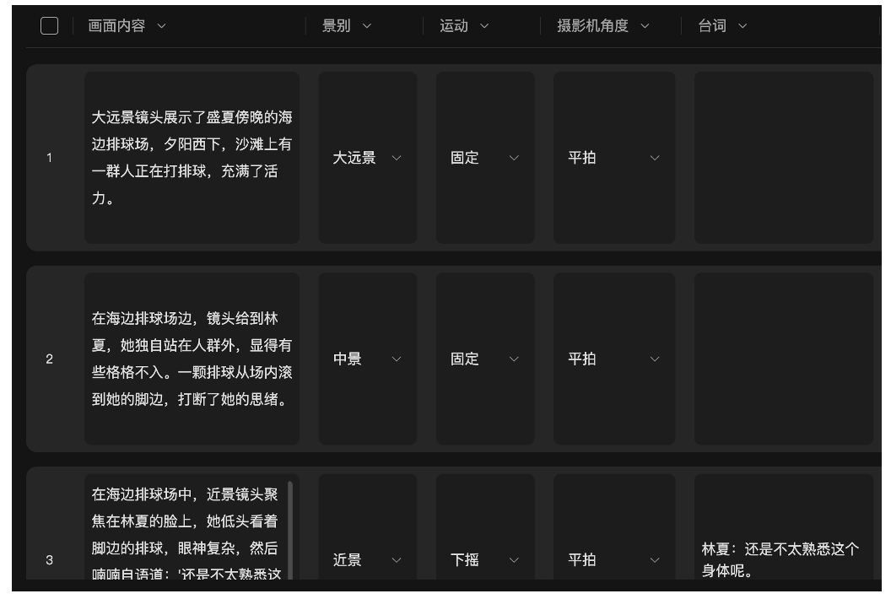
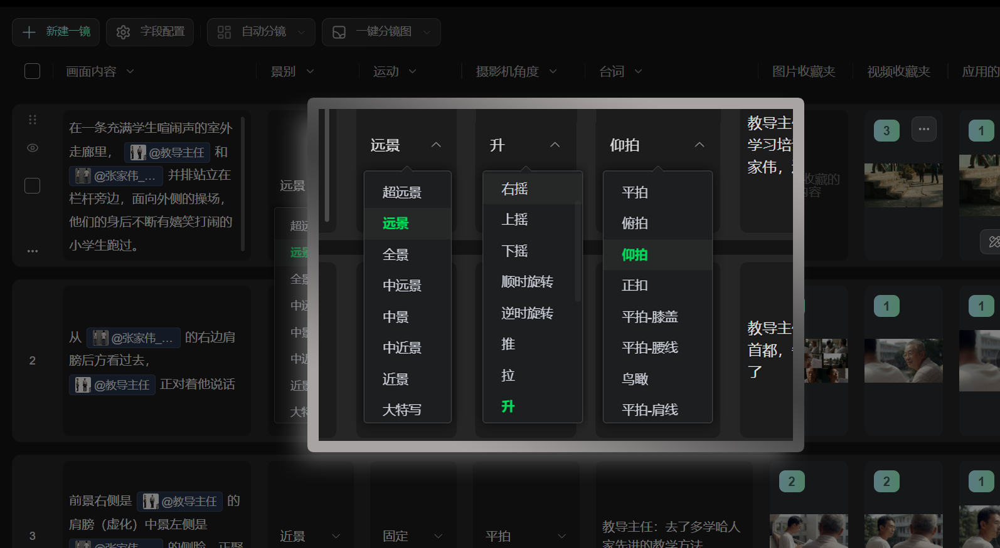
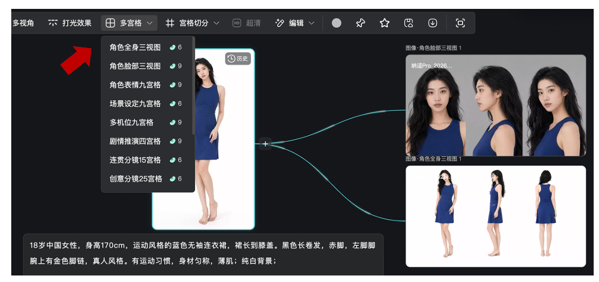
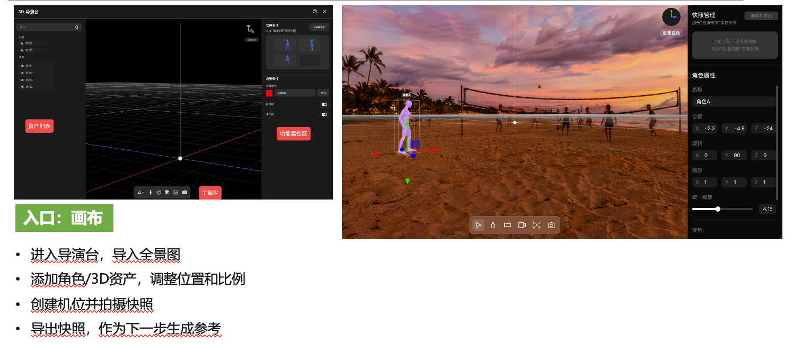
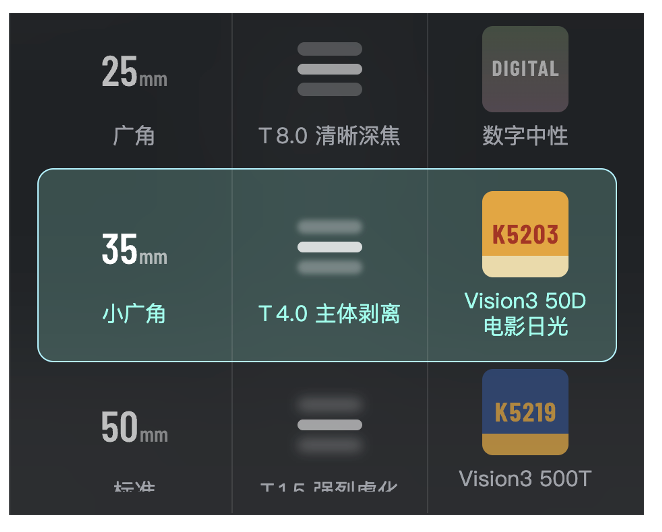
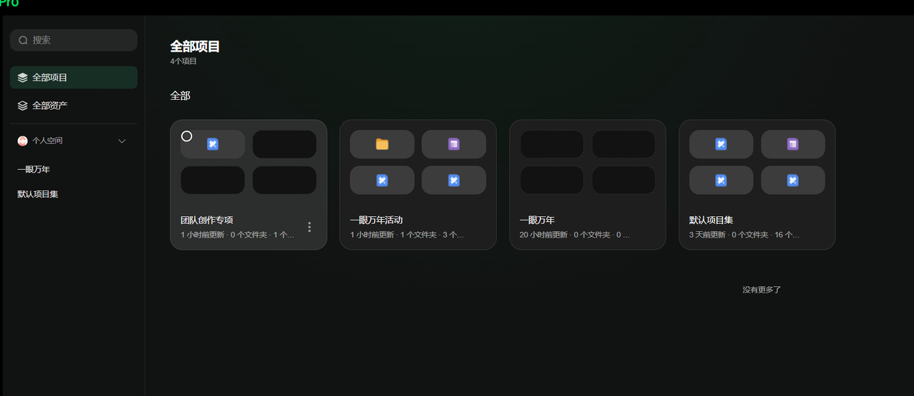
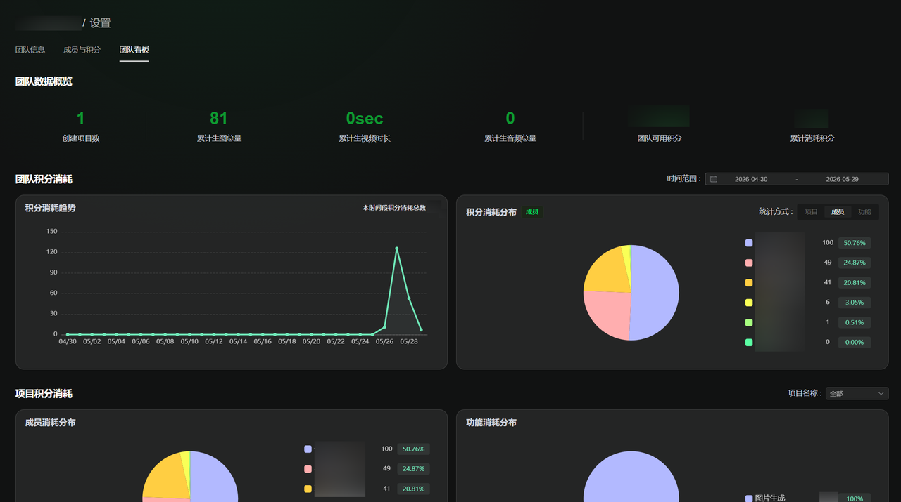

# AI导演创作方法论

> 来源：https://nadoupro.iqiyi.com/docs/ai-director-guide
> 抓取时间：2026-09-23 08:41（离线快照，原文见链接）

# 纳逗Pro创作者手册：如何成为一个AI导演？ [​](#纳逗pro创作者手册-如何成为一个ai导演)

**纳逗Pro 官网**：https://nadoupro.iqiyi.com/ ，**海外用户访问**：https://www.nadou.ai/

**纳逗功能库+版本更新记录+常见问题Q&A**：[第一次用纳逗 Pro？从这里开始吧↓](https://nadoupro.iqiyi.com/docs/getting-started)

## 一、AI视频怎么出好片 [​](#一、ai视频怎么出好片)

### 1.1 从提示词思维到导演思维 [​](#_1-1-从提示词思维到导演思维)

- **不推荐提示词思维：怎么“驯服”AI？**---单镜头视角

  - 把模糊想法或精确想法变成详尽的提示词，希望准确还原脑海里的每个镜头。
  - 举例：“镜头剪辑到一起连不上，多抽几次卡”
- **推荐导演思维：怎么保证AI作品有力量，尊重观众时间，有商业价值**？---全片视角

  - 设计AI创作的合适流程，打磨叙事、节奏、运镜、光影、配音配乐和音效，关注创作进度和成本。
  - 举例：“抽卡前，先给角色场景道具生成精细资产，作为全片参考。东方奇幻，色彩明亮，减少铜色黑色。情感冲突要合理。强CP之外的冗余支线要减少比例。有21个镜头生成难度大，单独做预算”

### 1.2 AI理解世界的方式 [​](#_1-2-ai理解世界的方式)

“一个女孩在海边奔跑，很感人。”

这是人类理解世界的方式：我们读到这句话时，脑海里的画面是“蓝天白云大海沙滩、女孩大步奔跑、中景+慢镜头拉远”。**想象力**帮我们“自动补全提示词”。但是如果创作者把这句话直接发给AI，很可能年龄、服装、海边环境、情绪、镜头语言全都不对；因为AI理解世界的方式其实是另外一种：**样本**。

对于AI，角色是特征组合（亚洲女性+18岁+穿裙子+光脚），场景是视觉特征组合（晴朗的夏季漫画云+清澈海面+没有游客的沙滩），风格是大量样本的统计结果（类似的提示词，如果给创作者提供几种不同风格，大部人会选宫崎骏风格，而不是丧尸片、古装甜宠），镜头是训练数据中的概率分布（类似镜头，大部分中景，少量是特写）。**AI更擅长理解参考图、角色设定、风格样例、镜头案例，而不是依赖创作者脑海里的想法。**

### 1.3 为什么观众会相信这是同一个故事 [​](#_1-3-为什么观众会相信这是同一个故事)

“一个女孩在海边奔跑，很感人。”

创作者可能这样拆分镜：“镜头1女孩奔跑，镜头2女孩停下来看远方，镜头3女孩流泪，镜头4女孩回头微笑”。四个镜头逐一生成，每个镜头单独看都挺好，放在一起全是NG条。

因为观众看到的视频是连续的：四个镜头 **应该是同一个人、同一片海，天气不能时晴时雨，光线要属于同一时间段，镜头语言要服务于同一种情绪表达，** 否则观众的大脑会被一次次打断。

优秀影视作品的单个镜头拆出来不一定惊艳，但镜头与镜头之间的关系非常清楚，导演关心的不仅是“这一镜好不好”，而是“这个镜头为什么在这里出现”。一致性包括角色一致、视觉信息连续、情绪连贯；单镜头影响作品质感下限，一致性才能决定上限。

### 1.4 AI视频工业化流程 [​](#_1-4-ai视频工业化流程)

很多人以为AI创作最大的成本是算力，其实最大的成本是**返工。**

实拍项目如果直接开机，成本容易失控。所以才有剧本-美术设定-分镜-拍摄-后期，AI项目也一样。**AI导演需要先设定世界观、角色/场景/风格设计，产出少量关键镜头，最后开始大规模AI生产**。想清楚“女孩是谁，为什么奔跑，海边在哪里，什么时间什么情绪，太阳角度高度和光线强度，想让观众感受到什么”，再动笔写提示词，就能减少无效抽卡次数。

商业化的影视项目通常需要多位甚至几十位AI创作者协同，当项目规模扩大后，统一的角色设定、场景资产和镜头规范，往往比单个创作者的提示词能力更重要。**AI导演需要关注每位成员产出物的一致性，根据团队成员能力合理分配创作任务，关注整体进度、算力和人力成本**。

## 二、纳逗Pro创作框架 [​](#二、纳逗pro创作框架)

### 2.1 把想法拆成镜头 [​](#_2-1-把想法拆成镜头)

如果只有一句灵感，可以先在**工作台**创建项目，进入剧本，把想法写成一小段故事。

剧本不需要一开始就很完整，但需要包含三类信息：角色、场景、互动。例如：

> 林夏在盛夏傍晚的海边排球场边独自走过。她听见远处笑声，没有靠近。一颗排球滚到她脚边，她停住，犹豫了一下，把球轻轻踢回去。队友向她招手，她回头笑。

进入分镜环节后，可以用**自动分镜功能**拆成镜头。自动分镜结果只是起点，**不建议直接复制用于生成最终视频**。更好的用法是把它当成提示词的材料库（画面内容、景别、运镜、台词或动作都能修改）。

**文戏重情绪**，用特写配合微弱的慢推，榨干角色眼神里的戏；**武戏重节奏**，用大幅度的镜头运动和手持呼吸感拉满现场张力。可以通过**分镜功能**提供的选项列表，快速实现镜头语言与运镜设计。

### 2.2 画布和工作台怎么选 [​](#_2-2-画布和工作台怎么选)

纳逗Pro设计了两个正式创作入口：画布和工作台。

画布更像一张**AI导演桌**。文本、图片、视频、上传素材、历史结果都在导演桌摊开。一个节点生成好图，可以连到下一步视频，也可以连到多角度、重打光、色彩参考。它适合探索、试错、比较方案，尤其适合说清楚“这个图片/视频结果从哪里来，又要作为谁的参考”。

工作台更像**项目推进表**。剧本放在哪里，主体放在哪里，分镜顺序是什么，每个镜头做到哪一步，生成结果能不能回看，这些都在工作台里被清晰组织，它适合已经进入稳定生产的团队。

| 入口 | 更适合什么 | 林夏项目里的用法 |
| --- | --- | --- |
| 画布 | 发散、连素材、比较方案、把上下文传下去 | 先放角色描述和海边场景参考，再生成傍晚排球场图，把它连到视频节点 |
| 工作台 | 剧本、主体、分镜、制作页集中管理 | 按镜头推进，记录每一镜的提示词、生成结果和状态 |

如果团队还在找方向，建议用画布；如果已经有剧本、分镜和交付节奏，工作台更稳；很多项目会两边都用。

### 2.3 角色资产：先让AI“认识”林夏 [​](#_2-3-角色资产-先让ai-认识-林夏)

林夏不能只是一句提示词，AI默认每次生成都会创造一个“像林夏的人”，但未必是同一个人，因此“角色资产”需要解决三件事：脸、身、用。

- 脸：人脸特写，用来锁定身份。
- 身：全身图或三视图，用来锁定比例、服装、身高和整体造型。
- 用：每个镜头都引用同一个主体，不要每次重新描述。

林夏主体的提示词：18岁中国女性，真人风格，黑色长发，蓝色连衣裙，赤脚，身材匀称，有运动习惯。

**大头照和全身照需要分开使用**，提示词需要写清楚“参考@图1（此处选择大头照）的面部，参考@图2（此处选择全身照）的造型”，能显著提升人物一致性。

### 2.4 场景资产：把海边固定下来 [​](#_2-4-场景资产-把海边固定下来)

“海边”这个词太宽，林夏项目的海边至少包含：Magic hour低角度金色光、彩云、沙滩纹理、排球网、远处人群、海风方向、浪线位置。只要其中几项每个镜头都变，观众就会感觉接不上。场景资产可以把世界固定下来---好用的场景图、视频参考、色彩参考和道具素材，都应该放到可复用位置。下一次生成不需要从零描述。

如果项目里有复杂空间，比如海、排球网、队友、观众、人群剪影、林夏行走路线，建议使用**720全景图功能**，普通图片只有一个视角，全景图能确认方位关系：海岸线和排球网在哪，观众在远处还是侧后方，太阳从哪里照进来。

### 2.5 3D导演台：摆清位置，之后追求美 [​](#_2-5-3d导演台-摆清位置-之后追求美)

有了场景，还要处理人和场景的关系。

复杂互动里，AI不一定知道谁站在哪里。林夏在排球场边走，球从哪里滚来，队友在哪个方向招手，镜头从侧后方跟拍还是从正面环绕，这些如果全靠文字很容易乱。

3D导演台适合**解决位置关系和机位关系**：导入全景图，添加角色或3D资产，调整位置、比例和朝向，再创建机位，拍摄快照，把快照作为下一步生成的参考图。

这个阶段不用急着追求最终画面质感。先把“谁站在哪里、镜头从哪里看、动作往哪边走”摆对。关系确定后，再交给AI补光影和细节。

### 2.6 影视质感：光线、色彩和镜头参数 [​](#_2-6-影视质感-光线、色彩和镜头参数)

有时候画面“不够好看”，不一定要重写Prompt。先看问题在哪里。

如果光线不统一，可以用**重打光功能**。林夏在Magic hour下，脸和裙子应该接受同一方向的金色光，避免上一镜偏冷、下一镜偏暖。如果色调飘，可以用**色卡功能**。彩云、沙滩和海水每个镜头都是相同的颜色。如果是镜头质感不对，可以用**摄影参数功能**，焦距、景深、视角和画面质感，都影响观众对“影视感”的判断。

很多创作者会说，重生成一次更快。单镜头也许是。但项目做到多镜头以后，继续重生成只会制造更多不确定。建议问题拆到光线、色彩、构图、焦距、主体，再选择合适的工具。

## 三、写出高质量提示词 [​](#三、写出高质量提示词)

> 提示词不是创作本身，而是把导演意图翻译给AI。

### 3.1 导演意图的五个维度 [​](#_3-1-导演意图的五个维度)

**公式：AI视频提示词=主体+场景+动作+镜头+风格**

举例：“一个穿蓝色连衣裙的年轻女孩，在夏季海边奔跑，海风吹动长发，中景跟拍镜头，宫崎骏动画风格。”

- **主体**是画面的核心内容。主体越明确，AI越容易理解（18岁亚洲女性，黑色长发，蓝色连衣裙，赤脚）
- **场景**决定画面的空间信息。场景越具体，一致性越容易保持（晴朗夏日下午，无游客的沙滩，清澈海面，远处有缓慢移动的云层）
- **动作**决定画面的变化（沿着海岸线向前奔跑，裙摆随风摆动，偶尔回头）
- **镜头**决定观众看到什么。例如特写/跟拍/推镜/拉镜/航拍（中景跟拍镜头，摄影机与女孩保持平行移动）
- **风格**决定作品气质。例如宫崎骏动画/新海诚动画/电影写实/国风奇幻/赛博朋克（宫崎骏动画风格，明亮色彩，柔和光影）

### 3.2 常见错误 [​](#_3-2-常见错误)

**错误一：把提示词当小说写。** 几百字甚至上千字，信息互相冲突。

建议：优先保证信息清晰，而不是字数更多。

**错误二：把提示词当剧本写，或者把（AI写的）剧本当成提示词。** 例如：“女孩回想起自己出生、成长、恋爱、分手、结婚的一个个画面”，这是剧本里的一句话，作为提示词的信息量不够（没有写明主体+场景+动作+镜头+风格）。

建议：拆分镜头，确保一致性的基础上，逐镜生成。

**错误三** ： **只写大词。** 例如：电影感，震撼，史诗级，大片质感，运镜高级，情绪拉满，好看一点，高级一点

这些词不是完全没用（质感可能会好一些），但是更像评价标准而不是创作指令。建议直接写清楚主体+场景+动作+镜头+风格。

**错误四：八秒镜头的提示词有一分钟镜头的信息量。** 例如：生成8秒镜头，提示词里的人物行动：走进房间、找不到首饰、慌乱紧张，喃喃自语，发现首饰掉在床头。

建议：4秒左右镜头适合人物或道具特写 / 有力量感的动作（比如警察发现嫌疑人），8秒左右镜头适合对话 / 人物移动 / 情绪转折，15秒镜头适合连续动作（现实生活中这几个动作能在15秒内完成）

**错误五：试图一次解决所有问题。** 例如：写一个很长的提示词，希望控制主体+场景+动作+镜头+风格的每个细节，再加台词，最后全部失控。

建议：每次生成只解决一个问题，先稳定角色和场景，下一次抽卡单独优化运镜，AI生成的口型和配音很可能达不到要求，通常在全片粗剪之后单独处理。

### 3.3 生成技巧 [​](#_3-3-生成技巧)

1 **用参考图 / 参考视频代替文字**，“参考@图1 的色彩”可能比一百字提示词效果更好。

2 **越是重要的信息，在参考里的顺序越靠前，** 例如生成特写视频时，人物正脸特写的参考图应当放在参考图的1号位置；景深参考视频放在2号位置；色彩参考图放在3号位置，场景参考图放在4号位置，这样生成的效果远好于四个参考图和参考视频随机排序。

3 创作顺序：生成角色道具和场景资产---用道具和资产作为提示词参考---生成镜头关键帧（首尾帧）---生成镜头---向前或向后延展，或生成下一镜头。

4 使用动作捕捉、表演迁移、三维模型等辅助工具，生成更准确的参考图/参考视频。

## 四、团队&规模化创作 [​](#四、团队-规模化创作)

在传统的AI创作中，工程散落在各个平台、素材扎堆难分拣、资产频繁下载转存，素材管理成本非常高，稍有不慎就会导致核心文件丢失。这种协同混乱不仅极大折损了团队的制作效率，更直接威胁到工期与整体成本。

从独立AI导演走向专业AI影视团队，规模化创作的核心在于工业化的团队协同。从素材管理，到生产协作，每一步都需要形成标准、高效、可控的工作流。

### 4.1 团队项目需要有序管理资产 [​](#_4-1-团队项目需要有序管理资产)

角色图在谁那里，场景参考是哪张，上一版视频为什么被否，哪个Prompt能复用，这些如果都靠聊天记录找，效率会大受影响，不要等项目做乱了再整理，那时候通常只能补救。

**4.1.1 素材及工程管理：**

纳逗Pro的【工作空间】功能，打造了如同网盘般清晰的共享工作区。素材、参数与资产全量沉淀在线。团队成员可实时分拣、复制与引用，彻底终结了频繁转存导致的素材丢失与重复生成出错，素材管理更高效，生成风格更统一。

**4.1.2 团队空间里至少放什么**

- 角色：林夏主体、面部参考、全身造型、表情和动作。
- 场景：Magic hour海边排球场、排球网、彩云、海岸线、观众位置。
- 镜头：自动分镜结果、人工修改后的分镜、每一镜的Prompt和参考图。
- 过程：画布节点、工作台制作记录、可复用参数、被否掉的版本和原因。
- 交付：粗剪、精剪、配音、配乐、字幕、最终导出文件。

这些东西不一定一开始就非常整齐，先能找到，能复用，能知道谁改过，就已经比“散在各处”好很多。

### 4.2 在线协作 [​](#_4-2-在线协作)

传统 AI 创作往往是孤岛式作业，而纳逗Pro支持**多人在线实时协作**，彻底打破了这一壁垒。

在工作台及画布模式下，团队主创可共同编辑同一个工程。概念设计师刚跑出的主视觉或核心角色资产，分镜师和导演在各自界面中即可无缝调取与接力创作，消灭资产交接的时差。

通过共享工作区，主创们不仅能实时看片、接力修改，还能一键克隆高光参数，避免因沟通误差导致的无效尝试，让整个团队的协同效率实现质的飞跃。

林夏项目不需要一开始就排很复杂的剧组表。但建议设定谁拍板，谁管资产，谁负责生成，谁负责剪辑和交付。这些角色都可以加入纳逗Pro的“团队空间”，无缝协同。

| 角色 | 主要看什么 | 交付物 |
| --- | --- | --- |
| 导演/创作负责人 | 故事、情绪、镜头顺序、是否出戏 | 分镜表、修改意见、成片判断 |
| 资产负责人 | 林夏主体、海边场景、排球和队友参考是否统一 | 主体库、场景库、素材库 |
| 生成执行 | 每一镜是否按资产和Prompt生成，参数是否记录 | 候选视频、关键帧、生成记录 |
| 剪辑后期 | 镜头顺序、声音、节奏、字幕、最终导出 | 粗剪、精剪、交付版 |

### 4.3 设置团队成员的项目权限 [​](#_4-3-设置团队成员的项目权限)

纳逗Pro有三类成员权限：创建者或管理员、可编辑者、可查看者。

管理员负责空间结构和项目管理；可编辑者负责实际制作和修改；可查看者适合评审、客户或只需要同步进度的人。

### **4.4 项目进程管理** [​](#_4-4-项目进程管理)

对于制片人而言，**成本控制与效率量化**是首要关注的事项。纳逗Pro为此搭建了直观的**团队数据看板**，谁做了多少素材、消耗了多少算力，项目全局一目了然。制片人能精准监控全盘的成本投入与成员产能，科学调配算力资源，用数字化管理控制预算及项目进度。

