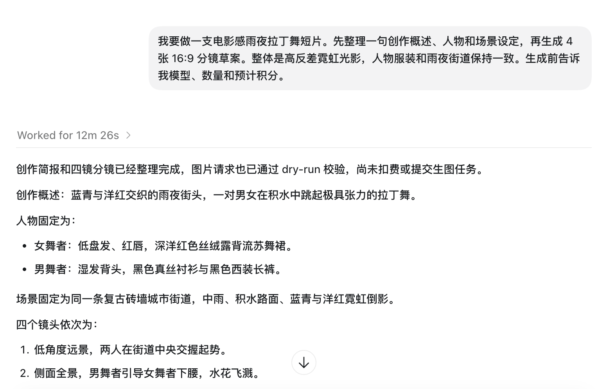
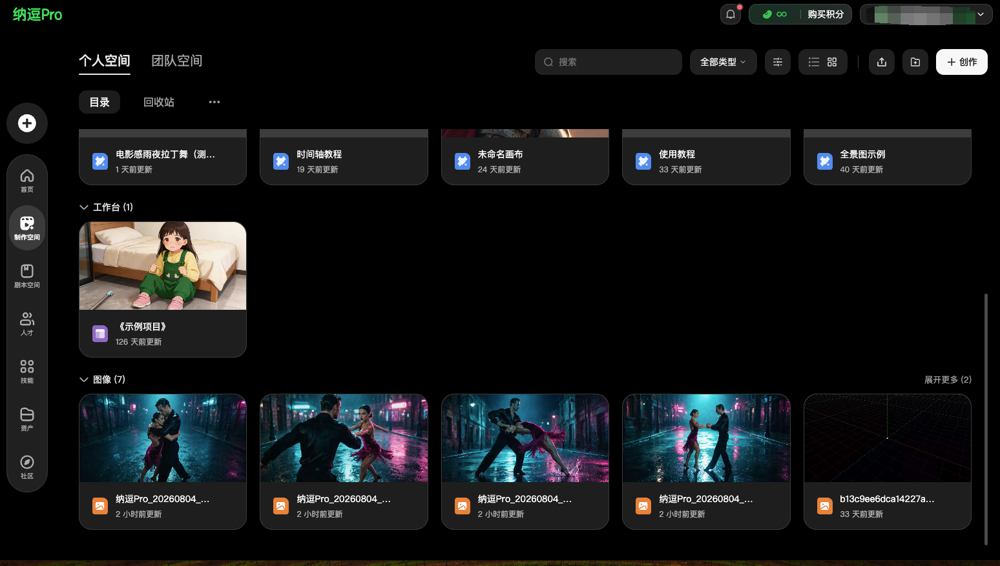

# CLI用户使用指南

> 来源：https://nadoupro.iqiyi.com/docs/cli-user-guide
> 抓取时间：2026-09-23 08:44（离线快照，原文见链接）


# 纳逗Pro CLI 用户使用指南 [​](#纳逗pro-cli-用户使用指南)

## 纳逗Pro CLI 是什么？ [​](#纳逗pro-cli-是什么)

让 AI 进入创作流程的中转站

从一句创意、几张参考图到分镜和视频节点，你只需用自然语言说明目标。AI 助手通过纳逗Pro CLI 调用已开放的创作能力，并在关键步骤向你确认。纳逗Pro提供自由画布、工作台和智能体等创作入口；CLI 的实际范围以当前版本为准。

把一次影视创作想象成片场协作：你负责提出创作意图和做关键判断，AI 助手负责拆解任务、调用工具和跟进结果，纳逗Pro负责模型、素材、空间与自由画布。纳逗Pro CLI 就是三者之间的工作通道。

它的价值不在于让用户学习命令，而在于让 AI 助手能够真正执行：选择当前可用模型、读取参考素材、提交图片或视频生成、等待结果，并把结果交付到个人空间、团队空间或指定自由画布。

**谁适合使用？**

- \*\*影视与内容创作者：\*\*希望把角色设定、分镜、镜头生成和素材整理交给 AI 助手执行。
- \*\*创作团队：\*\*需要把结果放入团队空间或自由画布，继续审阅、协作和迭代。
- \*\*使用 Workbuddy、Trae 等 AI 工具的用户：\*\*希望直接在对话中调用纳逗Pro，而不是反复切换页面和复制素材。

## 1. 📦快速安装 [​](#_1-📦快速安装)

### 方式一：AI 助手一键安装 [​](#方式一-ai-助手一键安装)

把下面这段话发给 AI 助手：

text

```
请帮我安装纳逗Pro CLI：npm install -g @iqiyinadoupro/nadou-cli。
安装完成后可运行 nadou version --json 验证（需要 Node.js 16 或更高版本）
```

安装器会完成三件事：

1. 安装适配当前操作系统和 CPU 架构的 Nadou CLI。
2. 验证 CLI 可以正常启动，并输出版本、commit 和构建时间。
3. 把同版本官方 Nadou Skill 同步到当前机器支持的全局 Agent。

安装成功标准

`nadou version --json` 能正常返回版本信息，且 `nadou skill read --json` 中的 Skill 版本与 CLI 版本一致。

### 方式二：手动安装 [​](#方式二-手动安装)

#### 手动安装教程 [​](#手动安装教程)

如果你希望自己在终端中操作，执行：

text

```
npm exec --yes --registry=https://registry.npmjs.org/ --package=@iqiyinadoupro/nadou-cli@latest -- nadou-install
nadou version --json
nadou skill install --json
nadou skill read --json
```

确认机器从未安装过 Nadou CLI 旧版本时，也可以直接安装 npm 包：

bash

```
npm install -g @iqiyi/nadoupro-cli
nadou version --json
nadou skill install --json
nadou skill read --json
```

当前安装器支持 Windows x64、Linux x64/arm64、macOS x64/arm64。Windows arm64 暂无预编译包。

#### 首次授权登录 [​](#首次授权登录)

Agent 在执行需要账号的操作前，应先检查登录状态，避免重复打开浏览器：

bash

```
nadou auth status --no-interactive --json
```

如果尚未登录，再执行：

bash

```
nadou auth login --timeout 10m --json
```

1. CLI 尝试打开系统默认浏览器；如果当前环境不能自动打开，会在输出中提供同一个授权地址。
2. 在浏览器中完成扫码和账号选择。
3. 授权成功后，CLI 自动验证登录状态；Agent 可以继续原来的任务，不需要你再执行一条登录命令。

默认使用正式环境。只有明确需要测试环境时，才配置并选择 `test` profile。

## 2. 📹为什么它适合影视创作 [​](#_2-📹为什么它适合影视创作)

纳逗Pro CLI 当前重点覆盖文本、图片、视频、空间与自由画布。它既可以完成一次独立生成，也可以围绕同一项目组织多素材、多阶段的创作链路。

| **能力** | **适合完成的工作** |
| --- | --- |
| **文本** | 创意发散、剧本提纲、分镜描述、提示词和文案；文本结果直接返回。 |
| **图片** | 文生图、参考图生图、局部重绘、全景图和主体三视图。 |
| **视频** | 文生视频、多参考视频、首尾帧生成、视频语义编辑与动作控制。 |
| **自由画布** | 创建或读取画布，组织文本、图片、视频节点与连线，并在指定节点上生成。 |
| **空间与交付** | 把生成结果保存到个人空间或指定团队空间，继续协作和管理。 |
| **本地视频处理** | 检查视频信息、烧录字幕，以及对兼容片段进行无转码拼接。 |

创作优势

1. **从单个素材，扩展到完整创作链路**

   普通生成工具更擅长完成一次请求。影视创作则需要在创意、角色、场景、分镜和镜头之间反复传递信息。纳逗Pro CLI 可以让 AI 助手沿着同一创作目标继续工作，并把不同阶段的结果放回明确的位置。
2. **参考素材的角色更清楚**

   人物、服装、场景、风格、首帧、尾帧和动作参考承担不同职责。只要在自然语言中说明每份素材的用途，AI 助手就能选择对应的生成方式，减少把普通参考图误当首帧等问题。
3. **创作过程可以分阶段确认**

   图片和视频生成会产生积分消耗。AI 助手可以在提交前展示模型、规格、预计积分和保存位置，让创作者先判断方向，再决定是否生成。对于分镜、关键视觉等阶段性结果，也可以先审阅再继续。
4. **自由画布保留上下游关系**

   当任务涉及多张分镜、多个镜头或多轮修改时，自由画布可以用节点和连线表达依赖关系。AI 助手在明确的画布和节点中工作，结果回到对应节点，便于继续调整和协作。

## 3. 🫧开始使用 [​](#_3-🫧开始使用)

### 直接用自然语言告诉 Agent [​](#直接用自然语言告诉-agent)

安装和登录完成后，不必记住 CLI 参数，可以直接说：

- “帮我生成一张雨夜霓虹街头的电影感海报。”
- “用这张参考图生成一个 5 秒视频，先告诉我模型、参数和预计消耗。”
- “把本地这张图片上传，再放到我指定的画布里。”
- “读取这张画布的当前结构，在右侧增加一个文本节点并连接到图片节点。”
- “刚才的视频还没完成，继续等待原来的 task ID，不要重新提交。”

Agent 应先确认有歧义且不能猜测的信息，例如账号、空间、画布、目标节点、首尾帧角色或高消耗批量范围；确认后再调用 纳逗Pro CLI。

## 4. ✏️典型创作场景 [​](#_4-✏️典型创作场景)

### 场景一：从一句创意到镜头草案 [​](#场景一-从一句创意到镜头草案)

创作初期往往只有一句概念。可以先让 AI 助手整理人物、场景和情绪，再生成角色设定图、氛围图或分镜草案。确认视觉方向后，再进入视频阶段。

**可以这样说**

我要做一支电影感雨夜拉丁舞短片。先整理一句创作概述、人物和场景设定，再生成 4 张 16:9 分镜草案。整体是高反差霓虹光影，人物服装和雨夜街道保持一致。生成前告诉我模型、数量和预计积分。

|  |  |
| --- | --- |

### 场景二：用参考图保持角色与美术一致 [​](#场景二-用参考图保持角色与美术一致)

当创作需要稳定人物形象和视觉风格时，可以同时上传多张参考图，并明确每张图片的用途。AI 助手会根据人物、服装和场景等不同参考职责选择可用模型，生成结果不会自动进入自由画布。

**可以这样说**

请使用我随消息上传的 3 张参考图，独立生成 3 张连续的电影分镜：图 1 只参考女主角的五官和发型，图 2 只参考红色流苏舞裙的款式与材质，图 3 只参考雨夜街道的霓虹光线和色彩。三张分镜均为 16:9，保持同一人物、服装和场景，不新增角色。生成前请告诉我使用的模型、参考图分工、生成数量和预计积分；结果保存到我的个人空间，不创建自由画布。

### 场景三：把分镜图变成视频镜头 [​](#场景三-把分镜图变成视频镜头)

已经有明确分镜图时，可以将其指定为视频的首帧，并补充人物动作、镜头运动、时长和画面规格。AI 助手会根据首帧职责选择相应的视频生成方式，不会把分镜图误作普通风格参考。

**可以这样说**

请使用我随消息上传的分镜图作为首帧，独立生成一段 5 秒、16:9、720p 的视频。画面中的两名舞者完成一次拉丁舞旋转，镜头从全景缓慢推近至中景；保持首帧中的人物长相、服装、雨夜街道和霓虹色调，不新增人物。生成前请告诉我使用的模型、视频参数和预计积分；结果保存到我的个人空间，不创建自由画布。

### 场景四：在自由画布中组织一支短片 [​](#场景四-在自由画布中组织一支短片)

当创作包含简报、人物设定、场景、分镜和多个视频镜头时，可以使用自由画布集中组织素材及其上下游关系。AI 助手会先确认保存位置和画布结构，再执行节点创建与生成。

**可以这样说**

我要在自由画布中策划一支“海边公路追逐”短片。请先读取我的个人空间目录，让我确认画布的保存位置；确认后新建同名自由画布，并规划创作简报、男女主角设定、海边公路场景、4 个分镜图片节点和对应的视频节点，同时连接各节点的上下游关系。先只展示画布结构和节点生成计划，不要立即生成；我确认后再逐个提交，每次提交前告诉我模型、参数和预计积分。

### 场景五：把结果交付到正确的位置 [​](#场景五-把结果交付到正确的位置)

团队项目可以在创作开始时直接指定团队空间和目标目录。AI 助手会先核对真实空间与目录，再生成并交付结果，避免素材保存到错误位置。

**可以这样说**

请独立生成 3 张“秋季户外品牌广告”分镜图，画面为金色草原、户外模特和暖色电影光影，规格为 16:9。生成结果交付到“品牌视觉”团队空间的“2026 秋季活动”目录，不创建自由画布。如果存在多个同名空间或目录，请先列出候选项让我选择，不要自行切换。确认目标位置后，再告诉我使用的模型、生成数量和预计积分；得到确认后再提交生成。

## 5. 💗最佳实践 [​](#_5-💗最佳实践)

- **先说创作目标，不必先找命令**

  直接描述你要完成的画面、镜头或项目。AI 助手会根据当前版本发现可用能力。
- **让参考素材各司其职**

  上传多份素材时，分别说明人物、服装、场景、构图、风格、首帧、尾帧或动作参考的职责。不要只说“参考这些图”。
- **把输出规格和保存位置一起说清楚**

  图片数量与比例、视频时长与清晰度、是否需要声音，以及个人空间、团队空间或自由画布，都应在提交前确定。
- **生成前先看积分和动作计划**

  图片和视频生成前，建议让 AI 助手展示模型、关键参数、预计积分、当前余额、保存位置，以及是否需要上传本地素材或下载结果。估价不锁价，最终扣费以提交结果为准。
- **长任务继续等待，不要重复提交**

  视频生成或节点回填可能需要时间。等待超时或页面没有刷新不代表失败，应继续检查原任务；重新提交可能重复消耗积分并产生重复结果。
- **自由画布按“读取—修改—回读”工作**

  在已有画布中修改节点或连线时，AI 助手应先读取当前结构，按确认后的计划完成一次修改，再回读核对。这样可以减少覆盖他人工作或在错误节点上生成。

## 6. 🙋必要说明与常见问题 [​](#_6-🙋必要说明与常见问题)

### 当前 CLI 没有开放哪些能力 [​](#当前-cli-没有开放哪些能力)

当前不把独立音频生成、复杂专业剪辑、跨项目复制和未确认的平台时间线渲染导出写成可直接使用的 CLI 能力。网页端存在相应入口时，也应以 CLI 当前返回的能力为准。

### 登录后浏览器是空白或深色页面 [​](#登录后浏览器是空白或深色页面)

授权页只负责把结果回传给本地 CLI。回到原来的 AI 助手对话检查登录状态；若已登录，可关闭页面继续使用。

### 画布中已经有节点，但没有生成结果 [​](#画布中已经有节点-但没有生成结果)

这通常表示只创建了画布结构。让 AI 助手检查节点的提示词、模型和必要参数，展示预计积分并获得确认后，再提交节点生成。

### 提示无权限或找不到目标目录 [​](#提示无权限或找不到目标目录)

先确认当前账号，再核对目标是个人空间还是某个团队空间，并确认账号对目标目录具有写入权限。不要让 AI 助手按名称猜测目录或未经确认切换团队空间。
