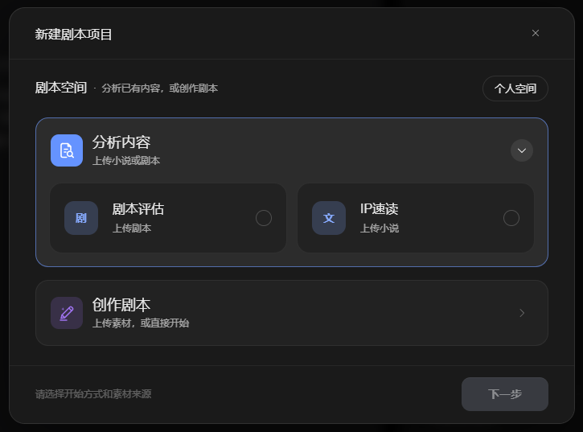
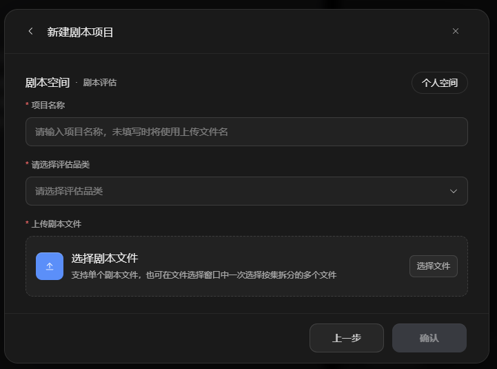
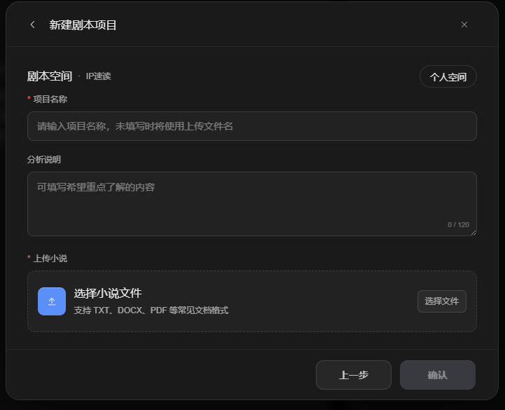
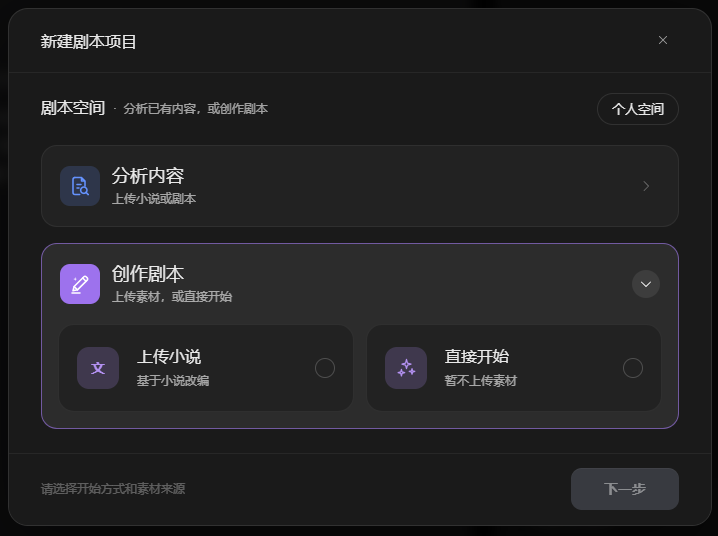
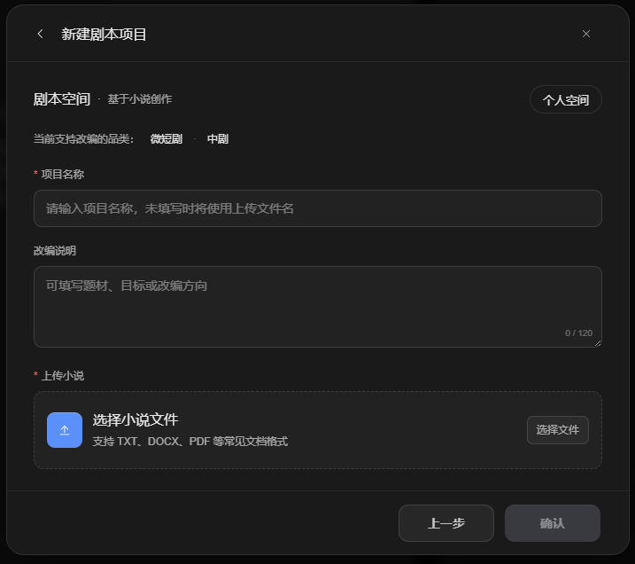
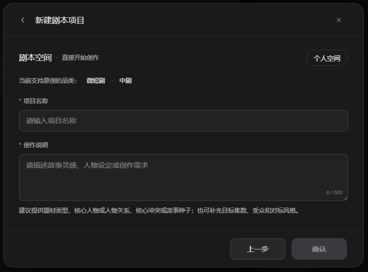
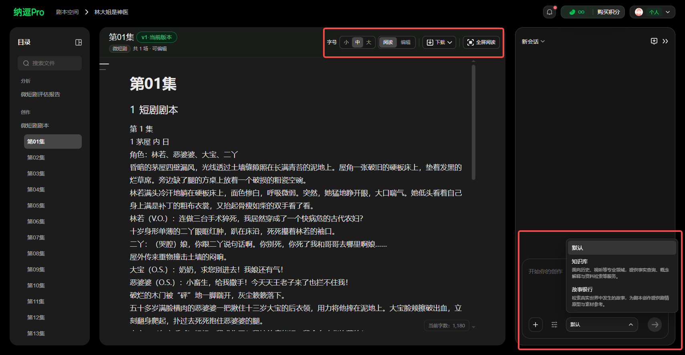

# 剧本空间使用指南

> 来源：https://nadoupro.iqiyi.com/docs/script-space-guide
> 抓取时间：2026-09-23 08:39（离线快照，原文见链接）

# 剧本空间怎么用？ [​](#剧本空间怎么用)

## 1 什么是剧本空间 [​](#_1-什么是剧本空间)

剧本空间是纳逗Pro 的剧本创作与管理模块，提供从灵感到完整剧本的全流程支持，并可与工作台无缝衔接。

在「剧本空间」中，你可以：

- 上传小说、故事梗概或剧本大纲，快速生成完整剧本
- 上传已有剧本，智能分析剧情结构、角色与节奏表现
- 上传剧本内容，帮你进行改编、续写或风格优化

## 2 怎么创建剧本 [​](#_2-怎么创建剧本)

点击【剧本空间】，支持 2 种创建方式：

1. **分析已有内容，可上传剧本进行剧本评估，或上传小说进行IP速读**

选择【剧本评估】，设置项目名称 → 选择评估品类 → 上传剧本文件，可评估电影、戏剧、微短剧、动漫

选择【IP速读】，设置项目名称 → 选择填写希望重点了解的内容 → 上传小说文件

2. **直接创作剧本：** 可上传小说，快速解析原作，改编剧本，或根据故事灵感、人物设定或创作需求创作剧本

选择【上传小说】，设置项目名称 → 选择填写题材、目标或改编方向 → 上传小说文件，当前支持改编的品类：微短剧*·*中剧

选择【直接开始】，设置项目名称 → 填写创作说明 ，可描述故事灵感、人物设定或创作需求，当前支持原创的品类：微短剧*·*中剧

## 3 怎么使用剧本编辑器 [​](#_3-怎么使用剧本编辑器)

提供标准格式的剧本编辑器及Agent辅助，支持：

- **剧本创作**：原创微短剧创作、原创中剧创作、小说IP改编短剧、小说IP改编中剧、一句话故事 / Logline 生成与优化、已有改编产物的二次修改建议
- **剧本评估**：电视剧剧本全量评估、电影剧本评估、微短剧剧本评估、动漫剧本评估、小说IP改编评估、小说IP速读
- **知识与素材**：影视创作知识库检索、故事银行素材检索、外部灵感索引检索
- **基础编辑**：分集剧本的阅读、增删改场次

## 4 怎么用 AI 编剧辅助创作 [​](#_4-怎么用-ai-编剧辅助创作)

纳逗Pro 内置编剧助手智能体，提供以下 AI 辅助能力：

- **一键转剧本**：上传小说 → AI 自动生成大纲、人设与分场，支持戏剧/电影/漫剧/短片等多形态改编
- **人物情感关系图**：可视化角色关系，辅助剧情架构
- **剧本评估**：AI 智能评估剧情走向、分析爆款潜力、提供优化建议

## 5 怎么导出剧本 [​](#_5-怎么导出剧本)

剧本创作完成后，可通过以下方式导出或衔接后续流程：

- **导出剧本文件**：在剧本编辑器中点击导出按钮，可将剧本导出为文本文件
- **衔接工作台**：在剧本空间完成剧本后，可直接跳转至影视创作工作台，将剧本导入主体和分镜环节
- **引用至画布**：在自由画布中通过文本节点引用剧本内容，进行进一步创作

## 6 剧本空间使用技巧 [​](#_6-剧本空间使用技巧)

- **先分析再创作**：如果已有剧本草稿，先用「分析已有剧本」模式进行 AI 评估，了解剧本的结构和节奏后再优化
- **善用 AI 编剧辅助**：遇到创作瓶颈时，让 AI 编剧助手针对特定段落重新生成，支持多次迭代优化
- **规范剧本格式**：上传剧本时确保有明确的集号和场号标识，有助于 AI 更准确地解析剧本结构
- **从小说改编**：上传小说文件可快速生成剧本大纲和分场，适合 IP 改编场景

## 7 常见问题 [​](#_7-常见问题)

**Q：上传小说后 AI 生成的剧本不满意怎么办？**  
 可以在编辑器中手动修改，也可以让 AI 编剧助手针对特定段落重新生成。支持多次迭代优化。

**Q：剧本空间支持哪些格式导入？**  
 支持md、txt、docx、pdf常见文本格式导入，单文件不超过10MB，具体支持格式请参考平台说明。

**Q：剧本评估支持哪些品类？**  
 支持电影、戏剧、微短剧、动漫等品类的剧本评估，AI 会分析剧情走向、评估爆款潜力并提供优化建议。

**Q：上传小说改编目前支持哪些品类？**  
 目前支持微短剧和中剧两个品类的小说改编，平台后续可能扩展更多品类。
