# 自由画布使用指南

> 来源：https://nadoupro.iqiyi.com/docs/canvas-guide
> 抓取时间：2026-09-23 08:39（离线快照，原文见链接）

# 自由画布怎么用？ [​](#自由画布怎么用)

## 1 什么是自由画布 [​](#_1-什么是自由画布)

自由画布是纳逗Pro 面向创意探索场景提供的开放式 AI 创作空间。用户可以通过添加不同功能节点，将文本、图片、视频、音频等多种素材进行组合，实现从灵感构思到内容生成的完整创作流程。

自由画布支持：

- 多模态素材自由组合
- AI 内容生成
- 节点之间自由连接
- 创作过程实时调整
- 素材资产统一管理

**适合场景：**

- 快速探索创意
- 生成角色、场景、分镜素材
- 制作短视频、漫剧、影视片段
- 搭建个性化 AI 创作流程

## 2 怎么创建画布 [​](#_2-怎么创建画布)

点击导航栏或制作空间右上角【+】，选择创作模式，点击【新建画布】，创建完成后即可进入自由创作区域。

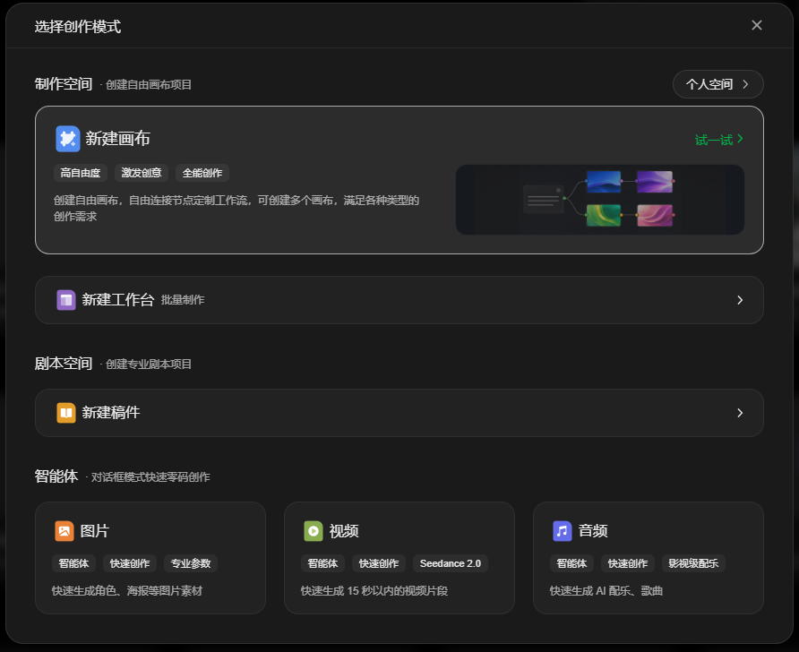

## 3 怎么添加创作内容 [​](#_3-怎么添加创作内容)

在自由画布中，用户可以通过以下三种方式添加创作内容：

**方法一：新增节点**

双击画布空白区域，选择需要使用的节点类型，添加至画布。

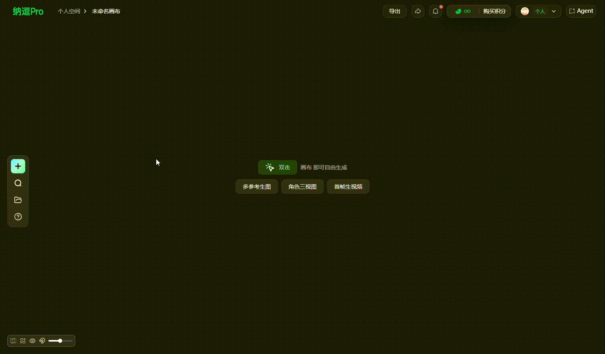

**方法二：上传素材**

支持图片、视频、音频、文本文件直接拖拽上传至画布。

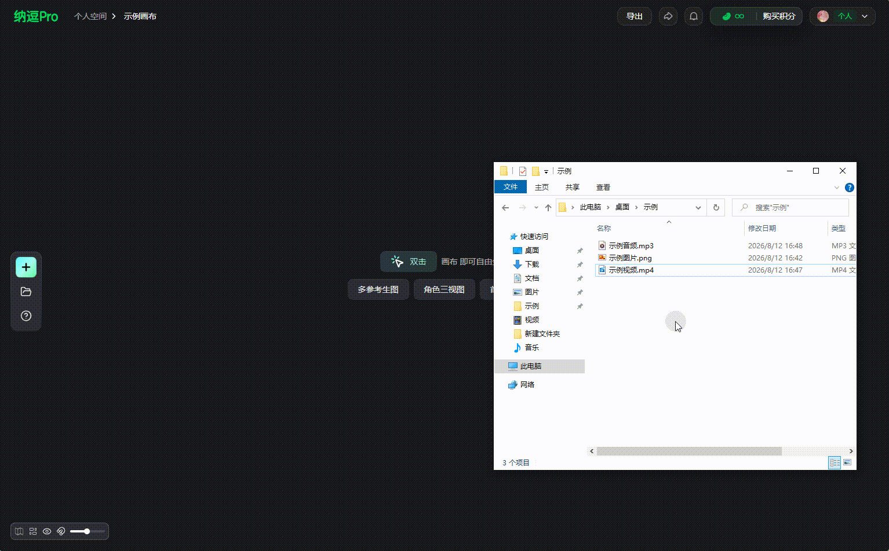

**方法三：调用已有资产**

可从【资产】中调用已有素材，包括个人空间中已保存的角色、场景、道具、音频等。

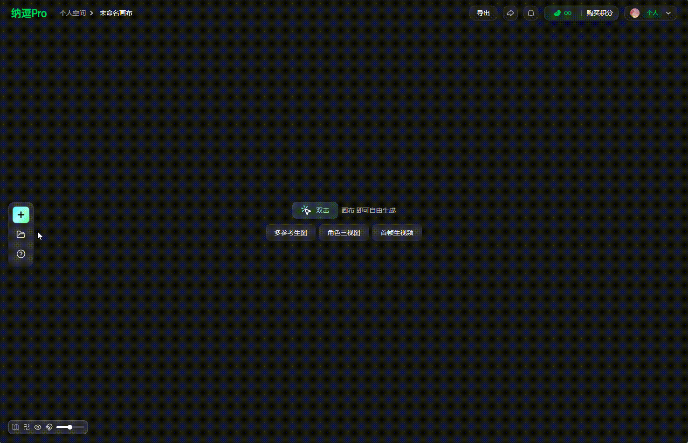

也可从【数字资产】中调用角色图、模型图、视频或3D模型。

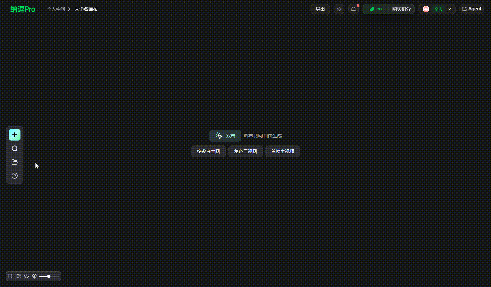

## 4 创作节点都有哪些 [​](#_4-创作节点都有哪些)

自由画布中的节点分为两类：**内容生成节点**和**功能辅助节点**。

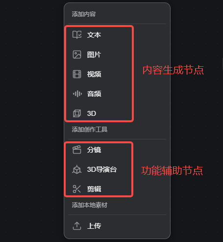

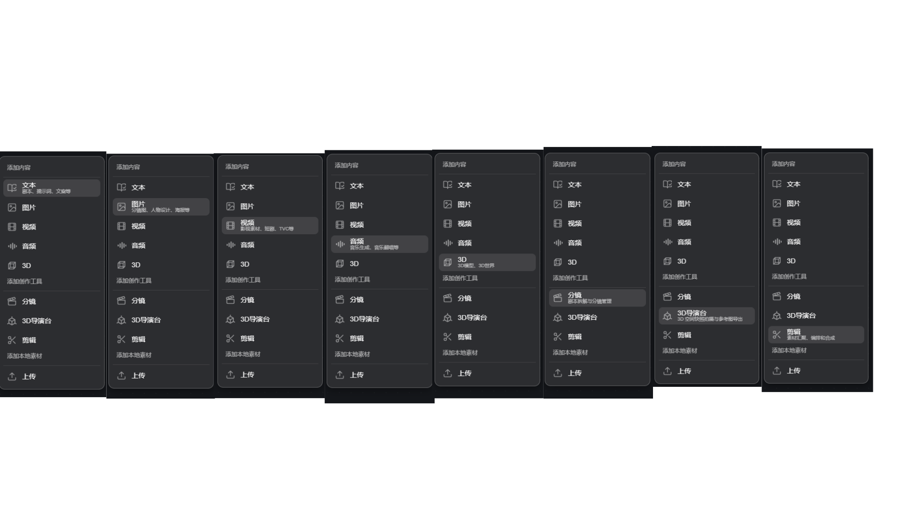

### 4.1内容生成节点 [​](#_4-1内容生成节点)

用于生成 AI 内容资产。

#### 4.1.1 文本节点 [​](#_4-1-1-文本节点)

文本节点用于生成创作过程中的文字内容。

- **支持**：剧本生成、提示词生成、文案创作、分镜脚本生成等
- **适用场景**：故事创作、视频策划、内容脚本设计等

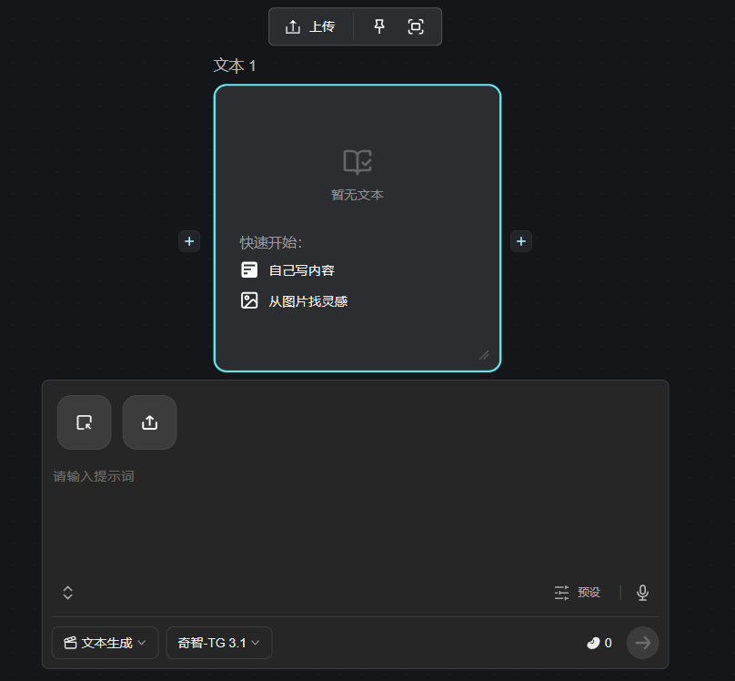

文本节点还支持剧本一键拆分镜，可一键从剧本拆分镜、从剧本提主体

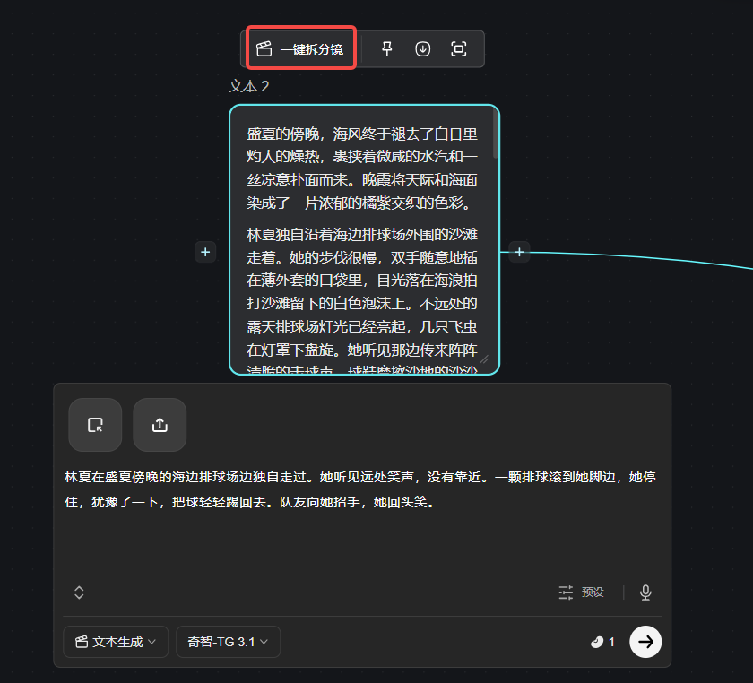

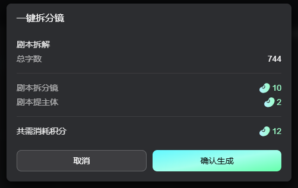

#### 4.1.2 图片节点 [​](#_4-1-2-图片节点)

图片节点用于生成和处理视觉素材，可用于分镜图、人物设计图、海报等。

**支持的生成方式：**

1. **文生图**：输入文字描述，生成对应画面。适合创意探索、快速生成视觉方案。
2. **融图模式**：上传参考图片，让 AI 根据参考内容进行创作。适合保持人物一致性、场景风格统一、融合多个视觉元素。
3. **720° 全景生成**：根据参考图生成完整空间环境。适合场景设计、影视空间搭建、多镜头统一场景。

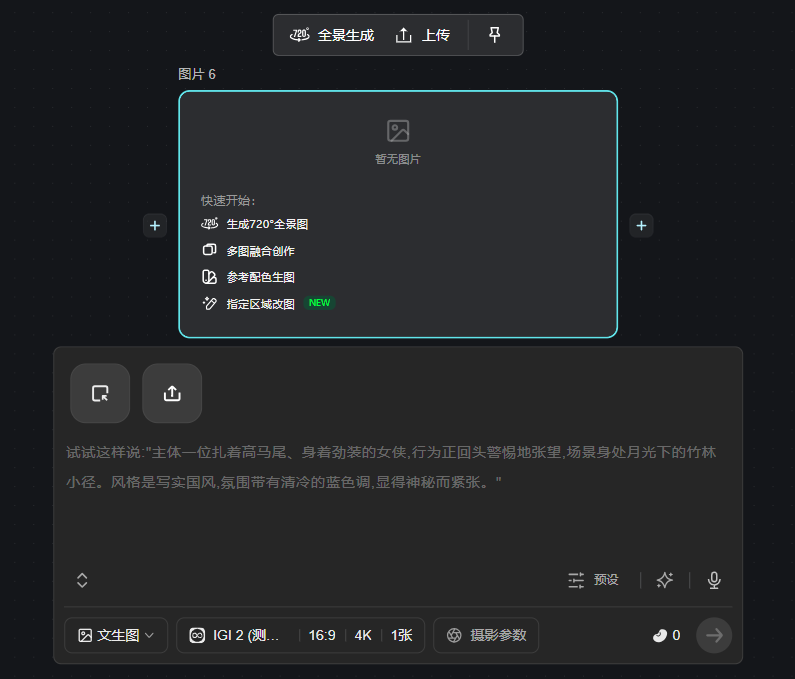

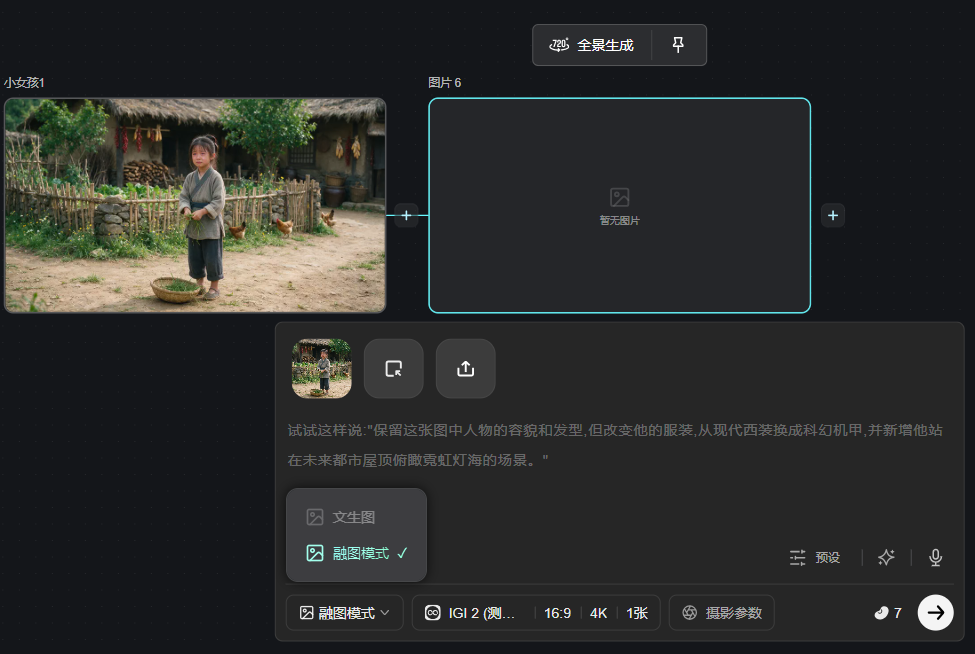

> 图片节点更多可功能请跳转[如何生成AI文本、图片、视频、音频？](https://nadoupro.iqiyi.com/docs/ai-media-generation-guide)

#### 4.1.3 视频节点 [​](#_4-1-3-视频节点)

视频节点用于生成动态视频内容，可将图片、文字等素材转化为视频。适用于影视素材生成、短视频制作、TVC 制作等。

**支持的生成方式：**

1. **文生视频**：输入文字描述，直接生成视频
2. **首尾帧生成视频**：设置视频开始和结束画面，生成自然过渡效果
3. **多参考视频**：上传多张相关图片作为参考，生成连续动态效果
4. **视频编辑**：上传视频并输入修改提示词，编辑视频内容
5. **动作控制**：上传参考视频或人物图，生成更精准的动作视频效果

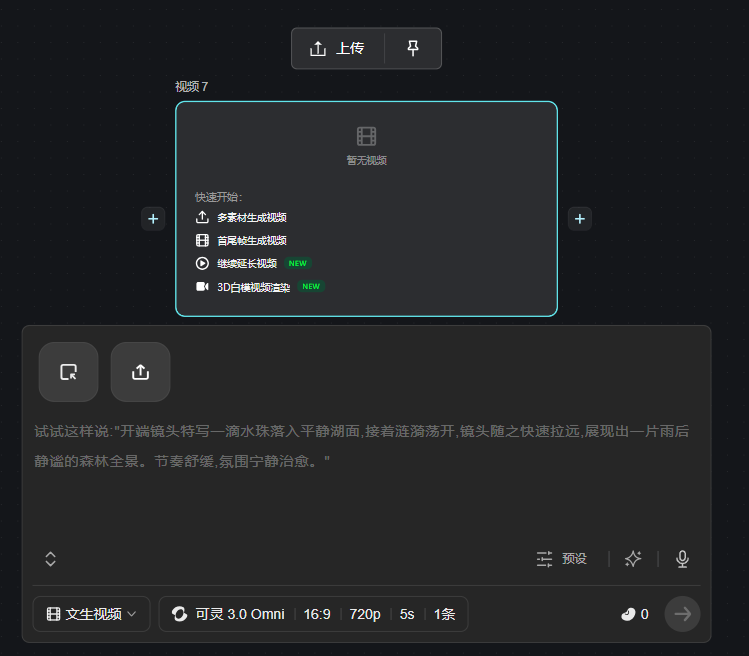

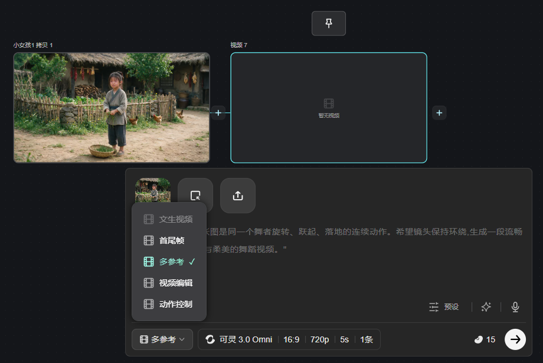

> 视频节点更多可功能请跳转[如何生成AI文本、图片、视频、音频？](https://nadoupro.iqiyi.com/docs/ai-media-generation-guide)

#### 4.1.4 音频节点 [​](#_4-1-4-音频节点)

音频节点用于生成和处理声音素材。

- **支持**：文生音乐、音乐翻唱、台词配音、音色转换

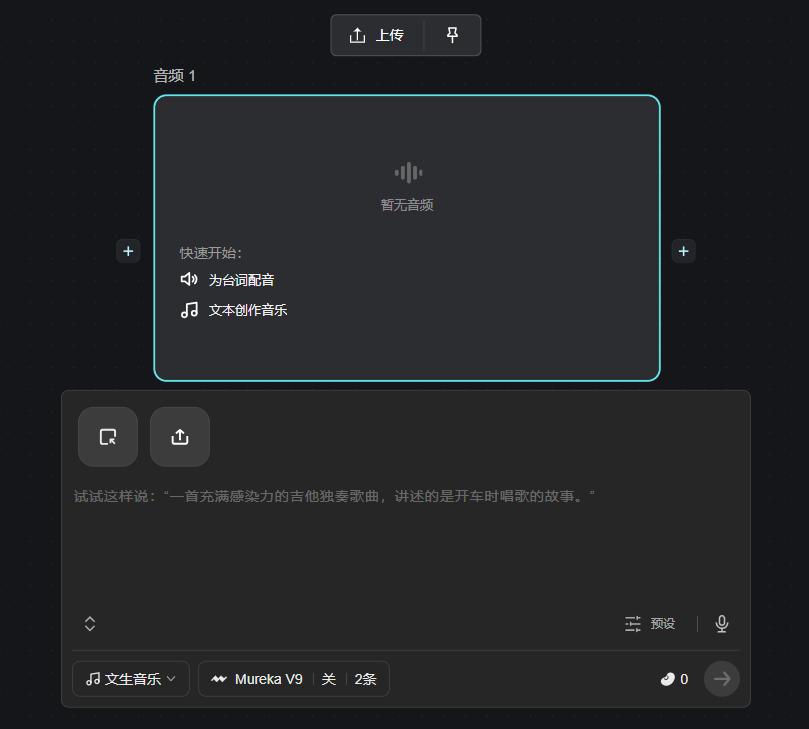

> 音频节点更多可功能请跳转[如何生成AI文本、图片、视频、音频？](https://nadoupro.iqiyi.com/docs/ai-media-generation-guide)

#### 4.1.5 3D节点 [​](#_4-1-5-3d节点)

3D节点用于生成3D模型和3D世界。

- **支持**：生成3D资产

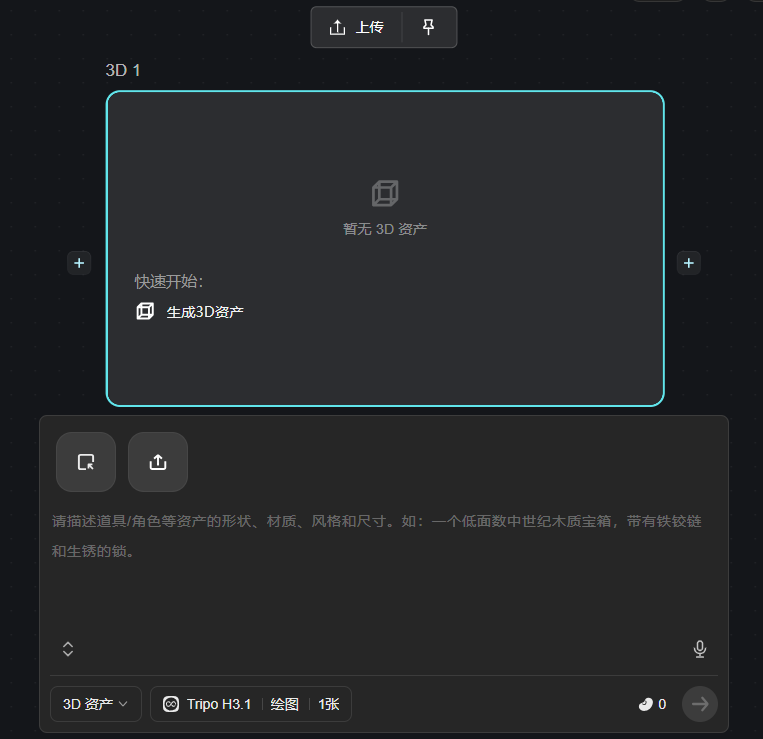

> 3D节点更多可功能请跳转[如何生成AI文本、图片、视频、音频？](https://nadoupro.iqiyi.com/docs/ai-media-generation-guide)

#### 4.1.6 其他 [​](#_4-1-6-其他)

在内容生成节点还可点击【预设】，使用镜头语言、视觉风格、灯光设计的预设。也可点击预设旁的【优化】，优化提示词。

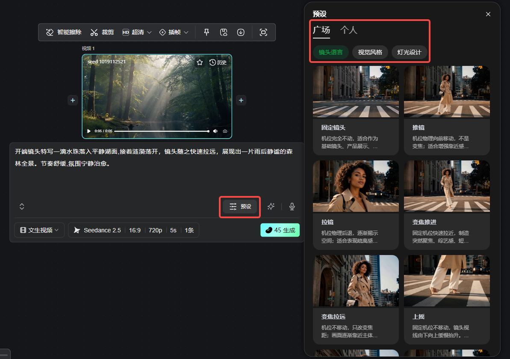

### 4.2功能辅助节点 [​](#_4-2功能辅助节点)

帮助用户完成更完整、高阶的制作流程。

#### 4.2.1 分镜节点 [​](#_4-2-1-分镜节点)

分镜节点可以将剧本文本自动拆解为可视化分镜，支持自动识别角色、场景、道具，自动生成分镜卡片、批量生成主体图片等。

**使用流程：**

1. 添加剧本文本节点
2. 点击【一键拆分镜】
3. AI 自动拆分镜、提主题，支持【批量执行】一键生成所有主体图及分镜表

1. AI自动拆解镜头内容至图像（主体如人场道）和分镜表，名称、提示词自动生成，各类主体资产清晰展示。

   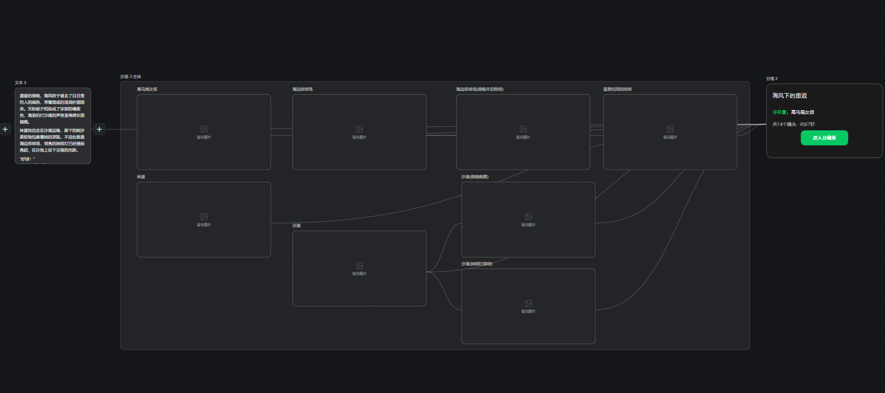

   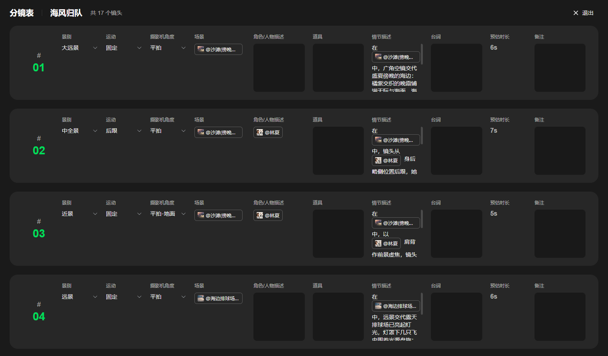
2. 支持【批量执行】，一键生成所有主体图

   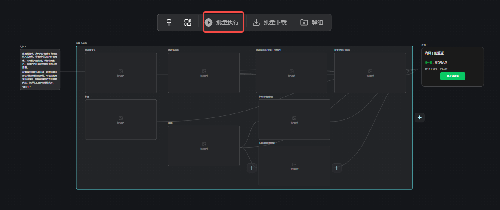
3. 分镜节点支持【一键分镜图】【一键分镜视频】

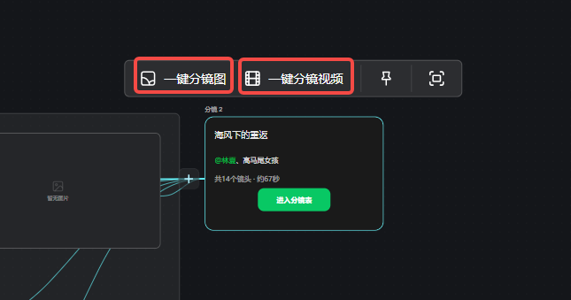

#### 4.2.2 3D导演台 [​](#_4-2-2-3d导演台)

3D 导演台通过三维空间预览方式，帮助用户控制人物位置、动作以及镜头关系。

- **核心功能**：人物姿势调整、镜头位置调整、多机位设计、时间轴动画制作、全景图导入
- **预设支持**：海量人物姿势预设、几何白模骨骼动作自由调节
- **适用场景**：影视镜头设计、复杂场景调度、多角色画面制作

1. 可视化人物调度，可自定义角色位置、道具比例，快速设定角色表演姿态，提前优化画面构图。复杂场景及站位也能轻松搞定。

   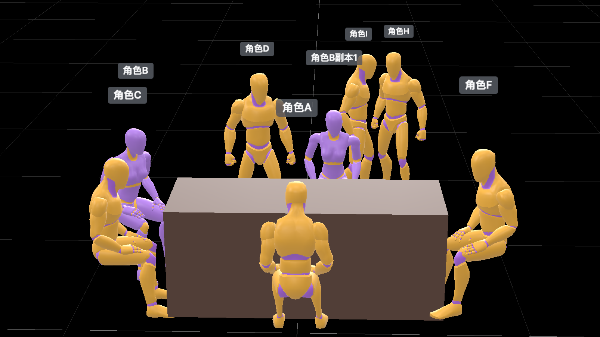

   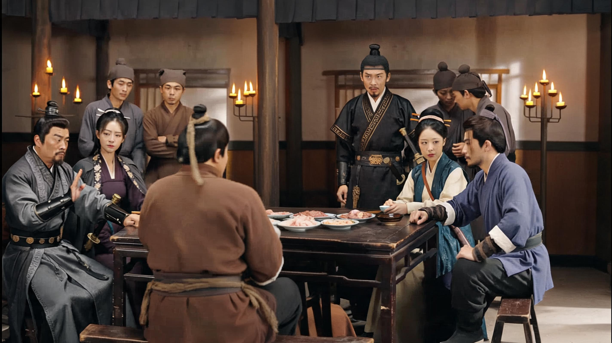
2. 支持导入720°全景图，站位更直观，调度设计更方便。

   [[VIDEO] https://nadou.inter.71edge.com/cdn/oss/bj/ifilm/a332904f\_8c3a52cc07301cc62a01f73e1d84f3f5.mp4](_files_自由画布使用指南/video_1.mp4)
3. 搭载专属多机位剪辑时间轴，支持输出最高90 秒完整视频。可自由设置机位与角色动画，每一帧运镜、人物动作都能精准锁定，模型画面更贴合你的构思。

   [[VIDEO] https://nadou.inter.71edge.com/cdn/oss/bj/ifilm/90bd1f51\_ab3bb88d5ed4aa7ec6c3dc6c7163a95a.mp4](_files_自由画布使用指南/video_2.mp4)

   白模动画效果

   [[VIDEO] https://nadou.inter.71edge.com/cdn/oss/bj/ifilm/f36f532a\_8365917fa1c4f34815b6ac3af2f21d2c.mp4](_files_自由画布使用指南/video_3.mp4)

   生成效果
4. 更支持编排多机位镜头序列，快速实现切镜参考，轻松处理多机位戏的专业制作。

   [[VIDEO] https://nadou.inter.71edge.com/cdn/oss/bj/ifilm/2890387c\_4c789cbbd02d362d69140436511ed41a.mp4](_files_自由画布使用指南/video_4.mp4)

   白模动画效果

   [[VIDEO] https://nadou.inter.71edge.com/cdn/oss/bj/ifilm/de2d0631\_2b5e549b58adaaee83f578a3b338c4da.mp4](_files_自由画布使用指南/video_5.mp4)

   生成效果

#### 4.2.3 剪辑节点 [​](#_4-2-3-剪辑节点)

剪辑节点提供在线素材编辑能力，可直接对生成的图片、视频、音频进行加工。

- **支持**：素材拼接、视频剪辑、在线预览
- **使用流程**：将需要处理的素材连接至剪辑节点 → 点击【去剪辑】→ 完成编辑并导出

1. 将需要剪辑的图片/视频/音频，接入剪辑节点，点击【去剪辑】

   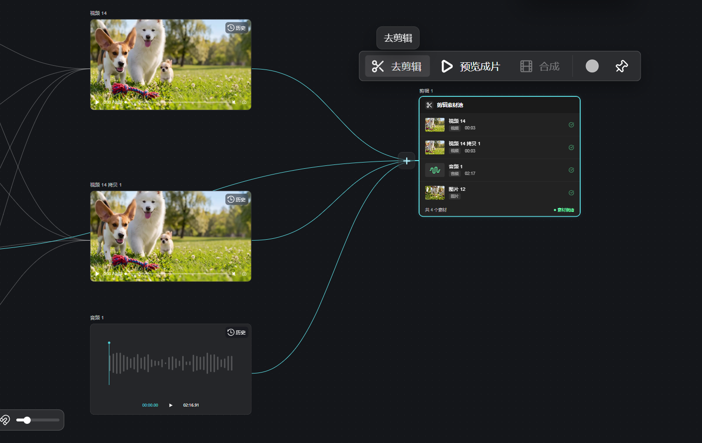
2. 不用下载素材，可直接实现在线素材剪辑。同时支持线上实时预览，成片效果一目了然。

   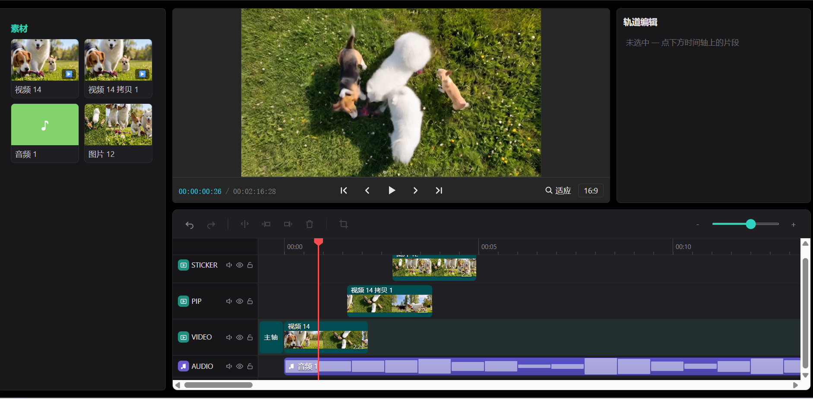

## 5 怎么使用Agent 辅助创作 [​](#_5-怎么使用agent-辅助创作)

在自由画布中，除了手动添加和连接节点，还可以通过画布右上角的【Agent】入口与 AI Agent 进行对话式创作。用自然语言描述创作需求，Agent 会自动在画布中生成和连接节点，适合希望快速产出或不熟悉节点操作流程的用户。

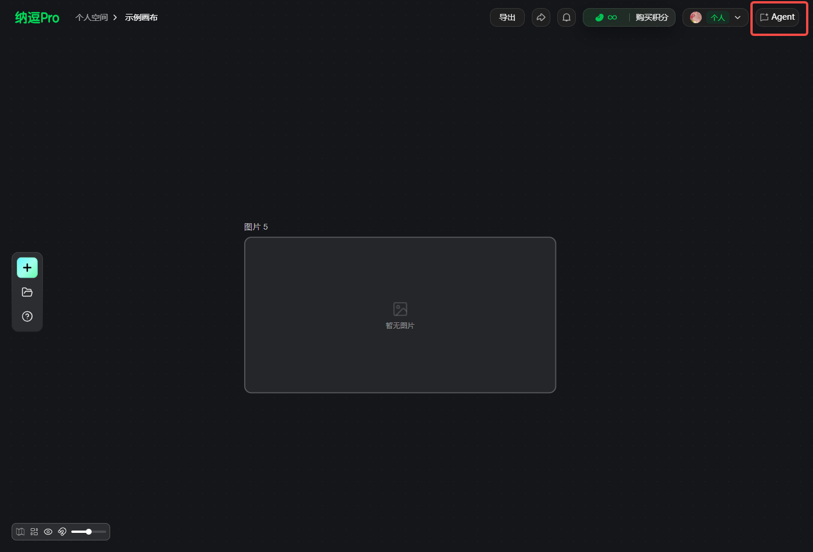

### 5.1 对话式创作 [​](#_5-1-对话式创作)

点击右上角【Agent】打开对话面板，输入创作需求即可开始。对话过程中支持以下操作：

- **引用画布节点**：在对话中引用当前画布已有的节点作为上下文，Agent 会基于已有内容继续创作
- **从空间导入素材**：在对话中直接引用工作空间中已上传的素材，无需切换到资产面板操作
- **本地上传素材**：在对话中直接上传本地文件作为参考素材

### 5.2 Agent 设置 [​](#_5-2-agent-设置)

在 Agent 对话面板中可以自主配置以下选项，控制 Agent 的创作行为：

- **问询频率**：设置 Agent 在创作过程中向用户确认方案的频率。频率越高，Agent 会在更多关键节点征求你的意见；调低则让 Agent 更自主地完成全流程
- **素材自动生成**：开启后，Agent 会根据对话内容自动判断需要哪些素材并生成，无需逐个手动操作
- **图片模型选择**：为 Agent 的图片生成任务选择合适的模型，可选 Seedream 5.0 Pro、奇智-IGI 2、奇智-INB 2 等
- **视频模型选择**：为 Agent 的视频生成任务选择合适的模型，可选 Seedance 2.5、Seedance 2.0、可灵 3.0 Omni 4K 等
- **Skill 选择**：为 Agent 选择使用合适的 Skill 技能包，如电影级运镜生成、风格重绘、智能调色等，具体可用 Skill 详见第五章

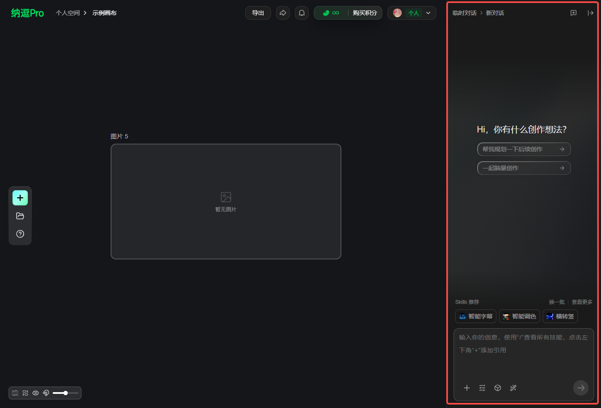

## 6 怎么搭建工作流 [​](#_6-怎么搭建工作流)

自由画布支持通过节点连接搭建完整工作流，多种节点支持任意搭配。

### 如何连接节点 [​](#如何连接节点)

每个节点包含输入（IN）和输出（OUT）端口：

1. 鼠标悬停节点边缘
2. 点击出现的连接按钮
3. 从输入端或输出端拖动连线

也可直接在对应节点使用【快速选择参考节点】或【快速上传并连线】，即可快速连接节点

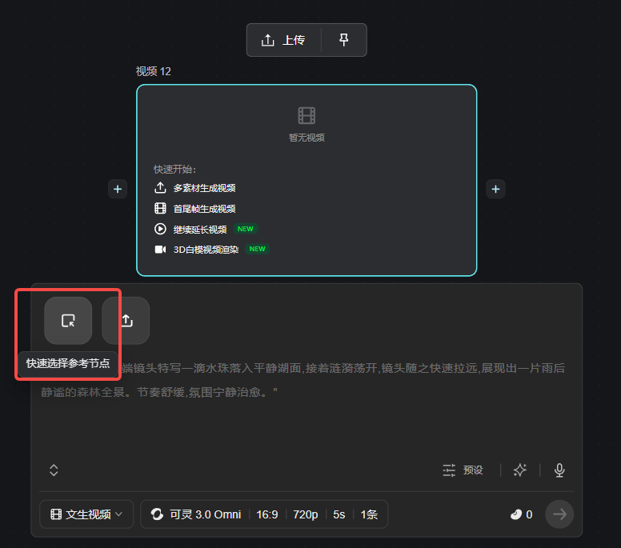

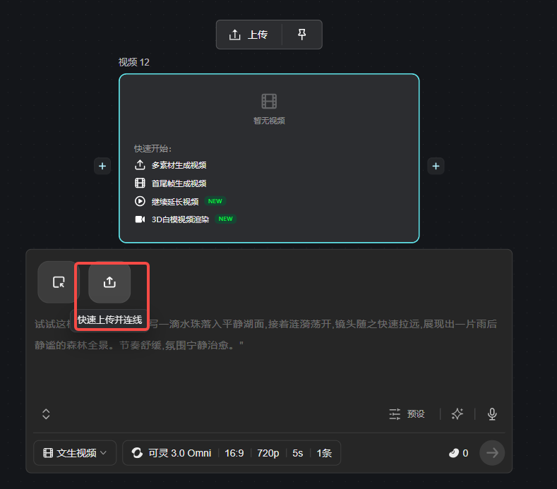

连线代表素材流转关系，例如：

**文本节点** → 生成剧本 → **图片节点** → 生成角色设计 → **图片+文本** → **视频节点** → 生成动态视频

### 节点输入类型对照表 [​](#节点输入类型对照表)

| 输入类型 \ 节点 | 图片节点 | 视频节点 | 音频节点 | 文本节点 |
| --- | --- | --- | --- | --- |
| **图片** | ✅ | ✅ | ❌ | ✅ |
| **视频** | ❌ | ✅ | ❌ | ❌ |
| **音频** | ❌ | ✅ | ✅ | ❌ |
| **文本** | ✅ | ✅ | ✅ | ✅ |
| **3D 导演台** | ✅ | ❌ | ❌ | ❌ |
| **剪辑** | ✅ | ✅ | ✅ | ❌ |

## 7 导出与分享 [​](#_7-导出与分享)

完成制作后，可导出到Davinci Resolve进行更多创作。

也可分享作品/画布到纳逗Pro社区，获得其他创作者的反馈和互动，也可将作品同步到爱奇艺，有机会获得广告分成。

## 8 常见创作流程示例 [​](#_8-常见创作流程示例)

#### 从一句话生成短片 [​](#从一句话生成短片)

**适合**：有创意，但没有完整素材。

**流程**：文本节点 → 生成剧本/提示词 → 图片节点 → 生成角色和场景 → 视频节点 → 生成动态视频

#### 制作角色设定 [​](#制作角色设定)

**适合**：需要保持人物一致性的创作。

**流程**：上传人物参考图 → 图片节点（融图模式）→ 生成角色设计图 → 用于后续视频制作

#### 制作完整影视片段 [​](#制作完整影视片段)

**适合**：短剧、漫剧、宣传片制作。

**流程**：故事梗概 → 剧本生成 → 角色设计 → 场景设计 → 分镜生成 → 视频制作

## 9 使用案例：从灵感到视频生成 [​](#_9-使用案例-从灵感到视频生成)

以制作一个短片为例，完整演示自由画布的工作流程：

**第一步：生成故事**

使用文本节点：输入创意 → 生成剧本 → 一键拆分镜

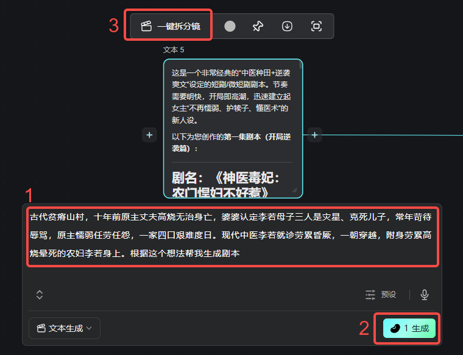

AI 自动拆解镜头内容至图像（主体如人物、场景、道具）和分镜表，名称和提示词自动生成，各类主体资产清晰展示。

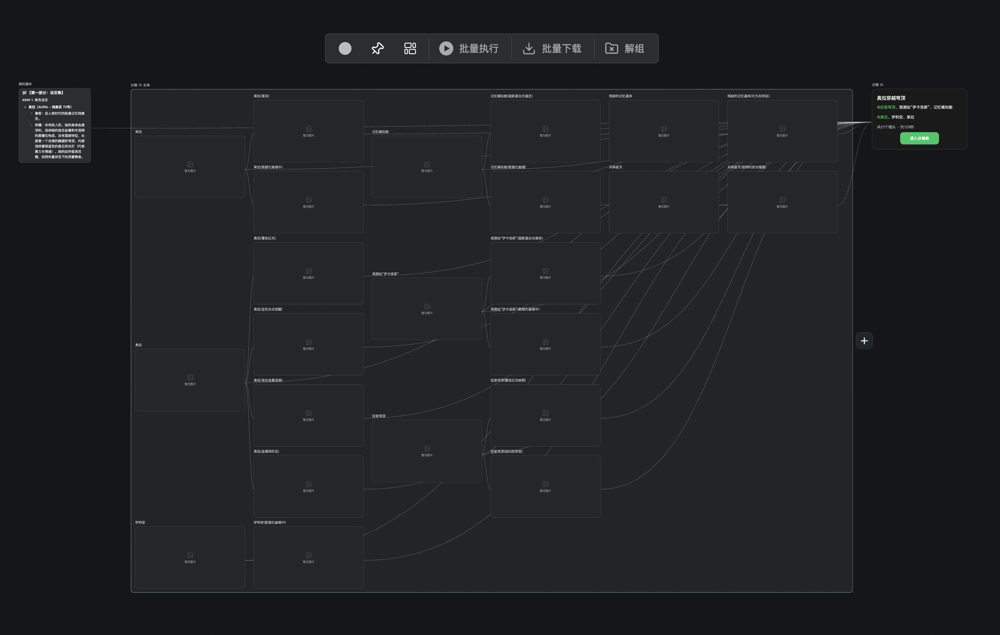

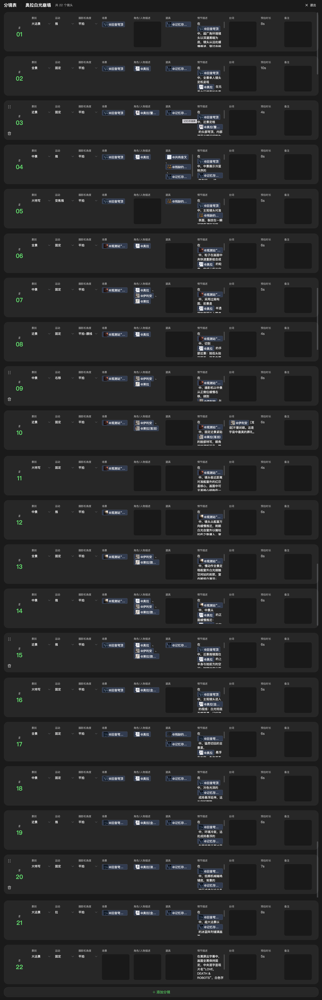

**第二步：设计角色、场景和道具**

选择一键生成的分镜列表：

1. 选择**具体角色**对应的图片节点→查看、修改推荐描述词→生成对应角色
2. 选择**角色相关状态**的图片节点→查看、修改推荐描述词→生成对应角色相关状态
3. 选择**具体场景**对应的图片节点→查看、修改推荐描述词→生成对应场景
4. 选择**具体道具**对应的图片节点→查看、修改推荐描述词→生成对应道具

同时支持【批量执行】，一键生成所有主体图

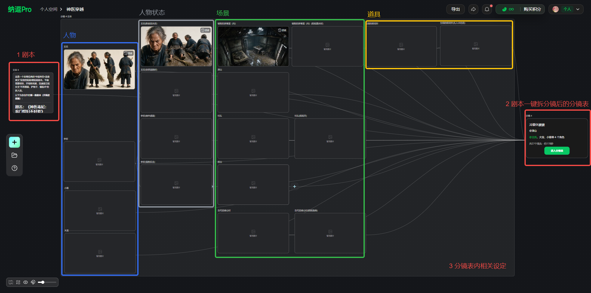

1. 分镜表节点支持【一键分镜图】【一键分镜视频】

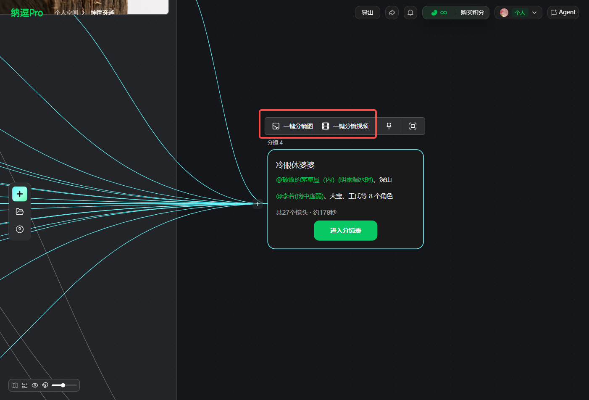

1. 生成后可点击【保存到空间】将所有主体存储到资产库。

> **提示**：点击对应节点会显示推荐提示词，可根据实际情况修改。

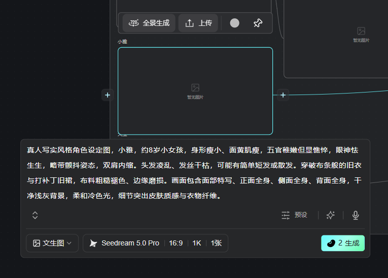

**第三步：生成视频**

将剧本、角色图、场景图连接至视频节点，选择生成模式和模型，设置画幅比例、分辨率、时长等参数后点击生成。

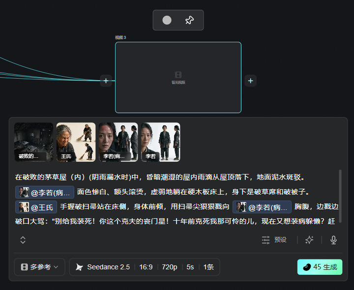

**第四步：后期处理**

连接剪辑节点，将生成的视频、音频与剪辑节点连接，点击【去剪辑】即可完成基础剪辑工作。

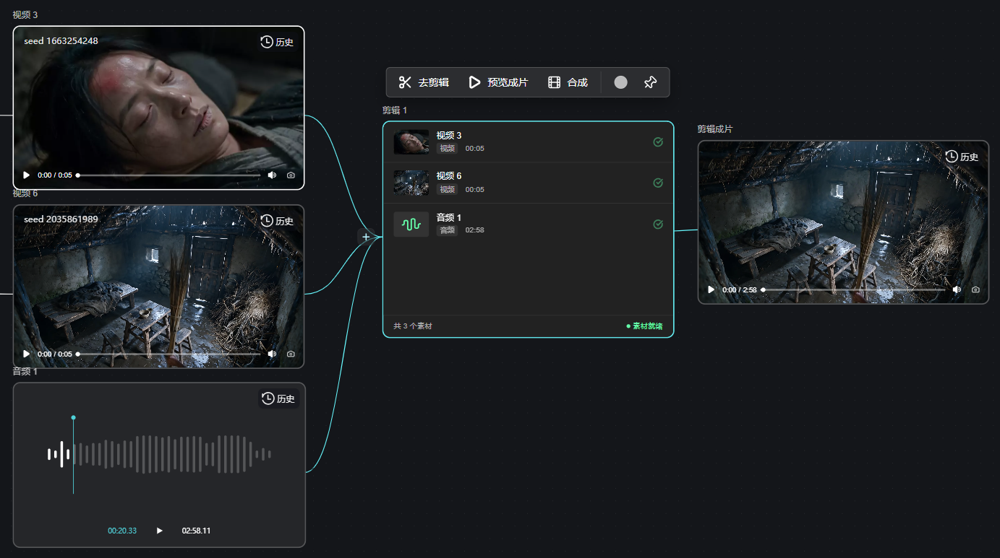

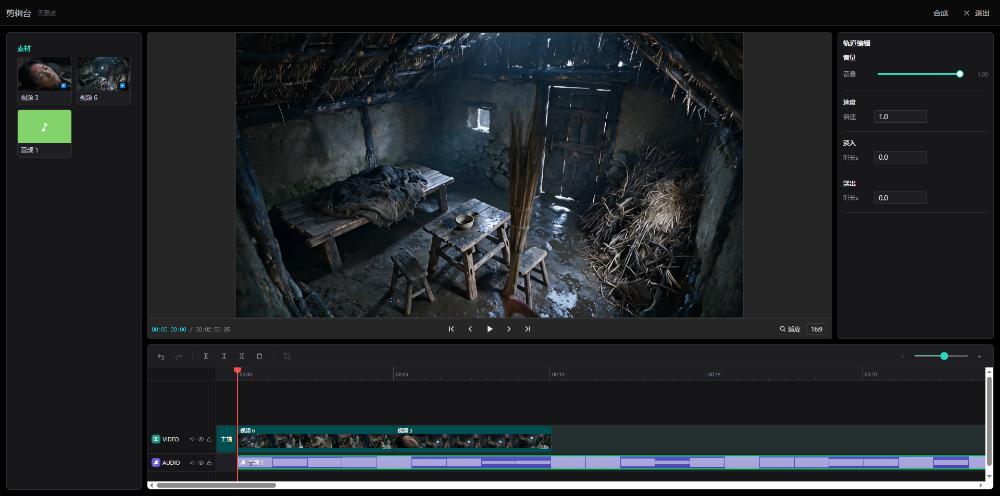

**第五步：导出作品**

完成创作后，可框选需要导出的资产，点击【批量下载】即可批量保存生成内容。

## 10 自由画布创作技巧 [​](#_10-自由画布创作技巧)

#### 先规划，再生成 [​](#先规划-再生成)

推荐流程：明确创作目标 → 创建文本节点梳理需求 → 生成角色和场景资产 → 再进入视频制作。避免直接生成视频导致修改成本增加。

#### 善用参考资产 [​](#善用参考资产)

如果希望保持人物一致、场景统一、风格稳定，建议提前上传参考图，并通过图片节点的融图模式进行创作。

#### 模块化管理资产 [​](#模块化管理资产)

建议将角色、场景、道具、视频片段分别保存管理，方便后续复用。详见→第六章「资产管理指南」。

## 11 常见问题 [​](#_11-常见问题)

**Q：自由画布和影视创作工作台有什么区别？**  
 自由画布适合自由探索、灵活搭建工作流；工作台适合有剧本、按结构化流程推进的创作。两者可以互补使用。

**Q：节点之间可以交叉连接吗？**  
 可以。一个节点的输出可以同时连接到多个节点的输入，实现素材的复用和分支工作流。

**Q：画布中的内容可以分享给其他人吗？**  
 可以。纳逗Pro 支持将画布中的内容分享给其他用户，方便团队协作。
