# 视频智能高清

> 来源：https://nadoupro.iqiyi.com/docs/smart-hd-guide
> 抓取时间：2026-09-23 08:44（离线快照，原文见链接）

# 视频智能高清 [​](#视频智能高清)

还在纠结用高清抽卡性价比太低，或者已经选到动作、构图和表演都满意的480P或者720P视频，但画面不够清晰、中远景小脸细节不稳定？欢迎来尝试纳逗Pro新推出的「智能高清」功能～

**「智能高清」** 是面向 **多参考生视频场景** 的高清重制能力，仅支持 Seedance 2.0/2.5 在多参考模式下生成的480P/720P视频。系统会结合当前低清视频、原任务提示词、人物参考图及相关素材重新生成高清版本，在尽量保留动作、构图、运镜和人物表演的同时，改善中远景小脸、动态人脸模糊及主体一致性问题。**当前暂不支持文生视频、视频编辑及首尾帧任务。**

## 智能高清相比超清有什么优势？ [​](#智能高清相比超清有什么优势)

**「超清」** 主要对原视频进行放大和清晰化处理。如果480P/720P视频中已经存在小脸模糊、五官变形或身份偏移，这些问题可能会随画面一起被放大和保留。

**「智能高清」** 会结合当前480P/720P视频、原任务提示词、人物参考图及相关素材重新生成高清版本。它不仅提升画面清晰度，还会重点改善：

- **中远景小脸**：重新生成低清画面中缺失的五官和皮肤细节
- **动态人脸稳定**：改善人物走动、转头或镜头运动时的人脸模糊与变形
- **动作与表演保留**：尽量延续原视频的动作、构图、运镜和人物表演
- **多主体一致性**：减少不同镜头之间的人物身份偏移，并尽量保持多人场景中的角色区分

| **优化点** | **参考人物素材** | **🫥480P原视频** | **🫨超清·1080P** | **😍智能高清·1080P** |
| --- | --- | --- | --- | --- |
| **动态人脸效果稳定** **&** **动作与表演保留** | 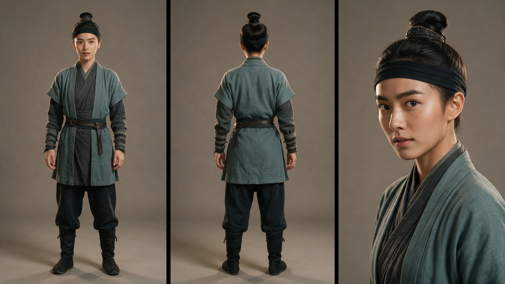 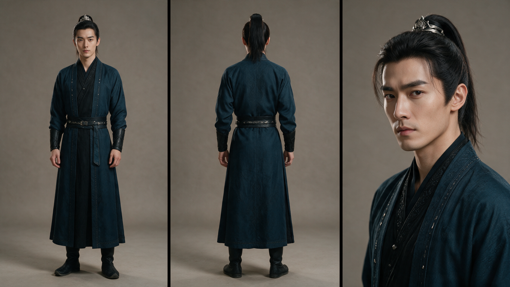 | [[VIDEO] https://nadou.inter.71edge.com/cdn/oss/bj/ifilm/cbb0f692\_b3e5f6f50f5db04153b05a296c67180e.mp4](_files_视频智能高清/video_1.mp4)  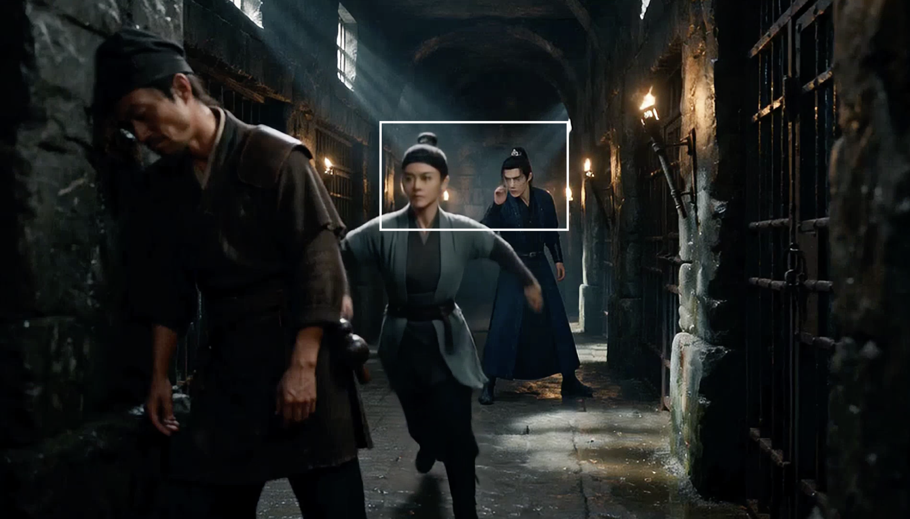 | [[VIDEO] https://nadou.inter.71edge.com/cdn/oss/bj/ifilm/0e6d6e84\_a89c8f71f63e79018203a48c70f9cdb2.mp4](_files_视频智能高清/video_2.mp4)  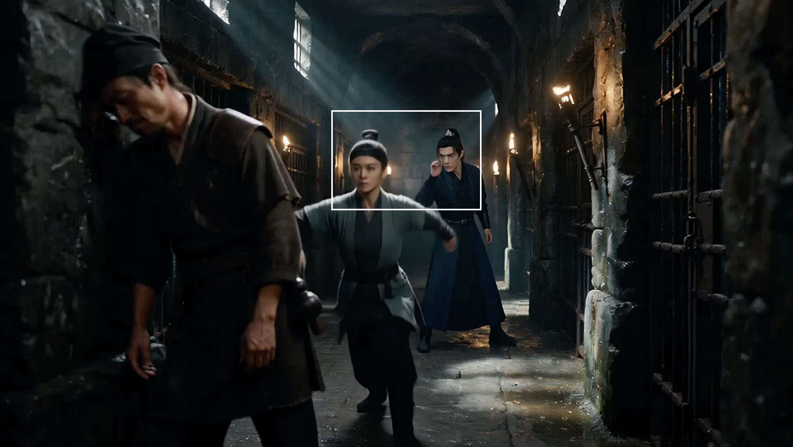 | [[VIDEO] https://nadou.inter.71edge.com/cdn/oss/bj/ifilm/3d1770b2\_7478ef9ceea9745c2cc2f9fe52705d95.mp4](_files_视频智能高清/video_3.mp4)  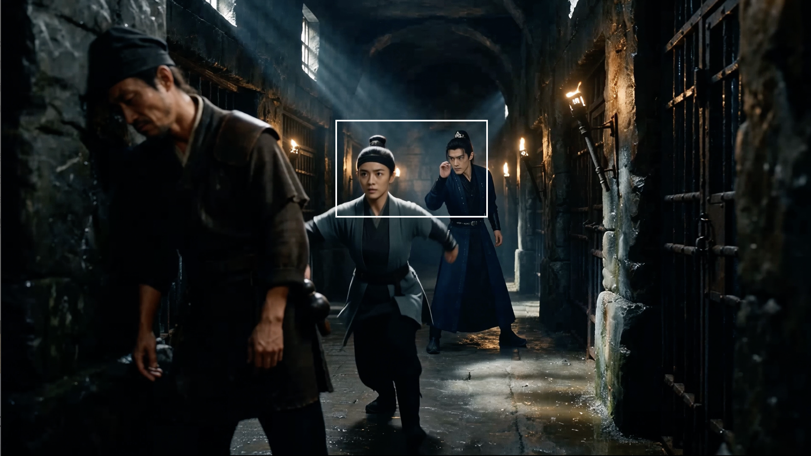 |
| **中远景小脸重绘** **&** **多主体一致性** | 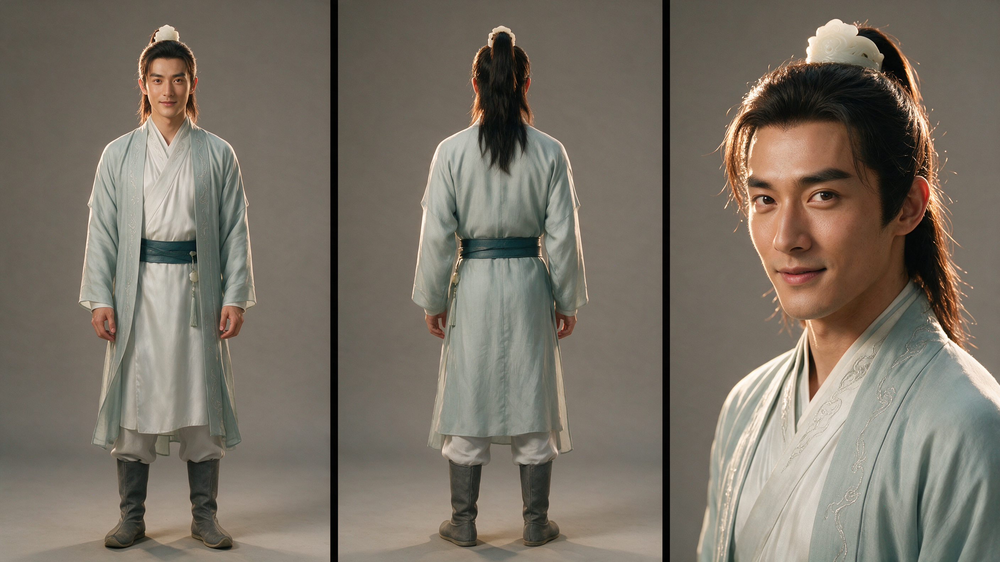 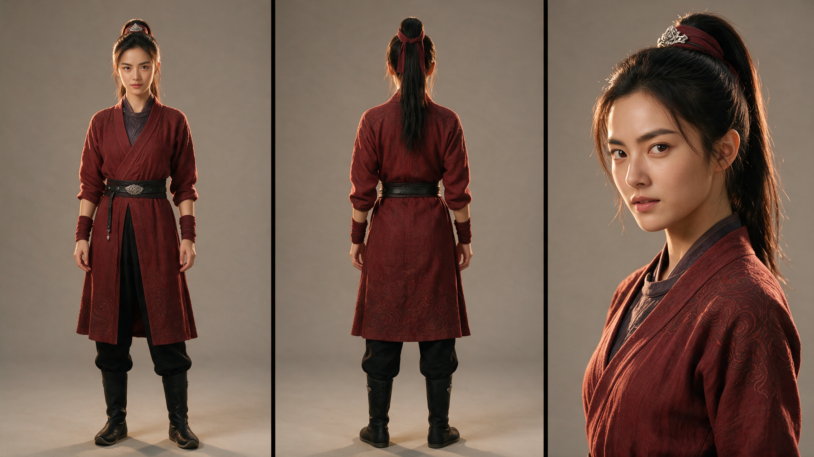 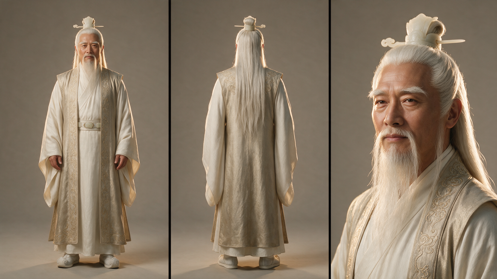 | [[VIDEO] https://nadou.inter.71edge.com/cdn/oss/bj/ifilm/6f474b95\_0f510e67310f642d4a6a4b8b9e54ed2c.mp4](_files_视频智能高清/video_4.mp4)  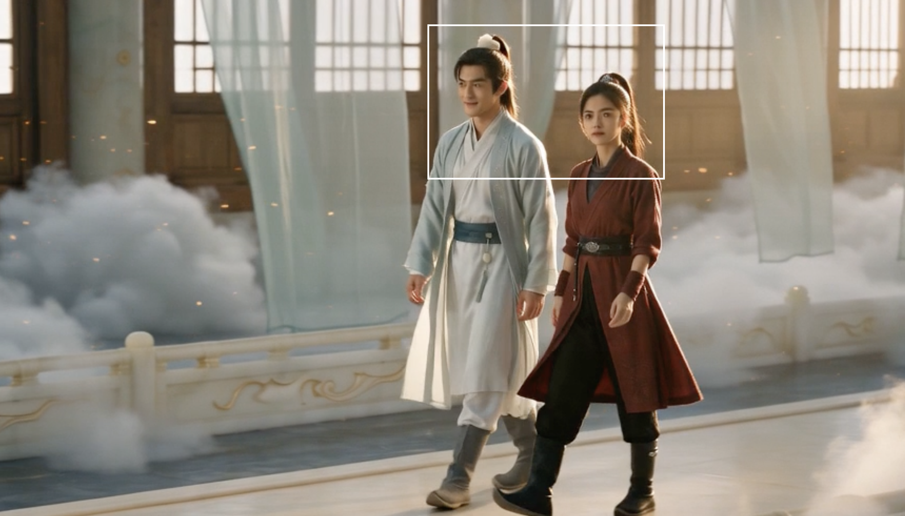 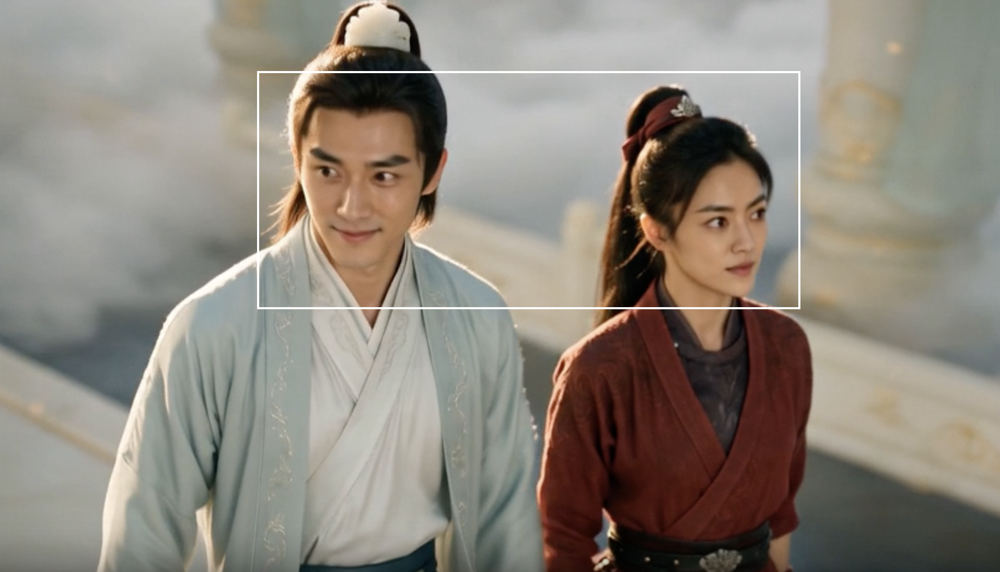 | [[VIDEO] https://nadou.inter.71edge.com/cdn/oss/bj/ifilm/9b02ea36\_aa1a05f57b545b826602ef444a562f37.mp4](_files_视频智能高清/video_5.mp4)  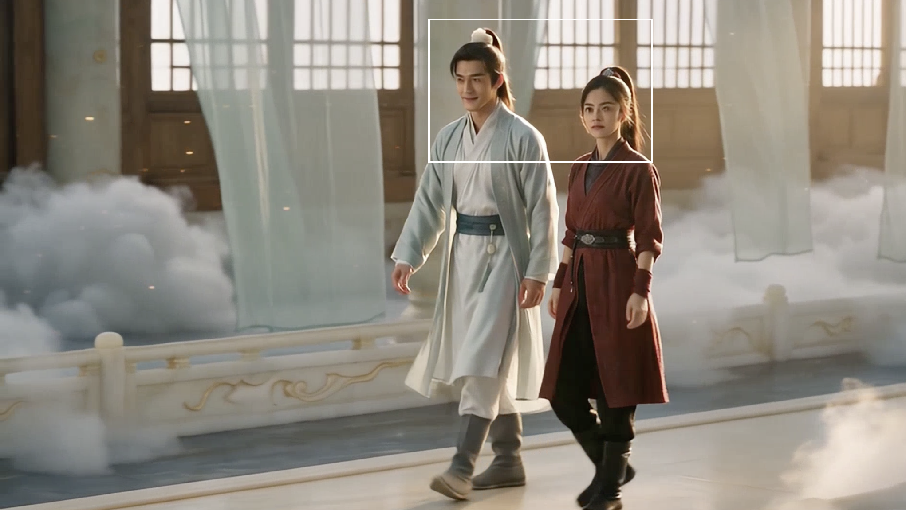 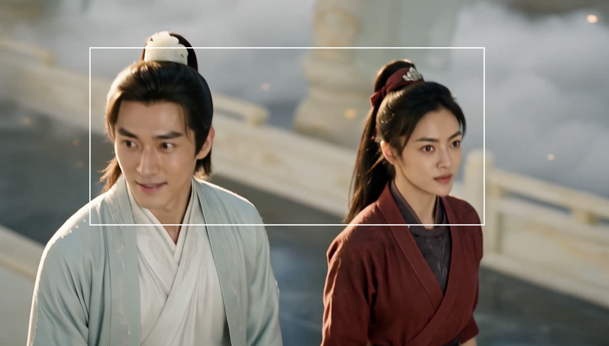 | [[VIDEO] https://nadou.inter.71edge.com/cdn/oss/bj/ifilm/c34b5d85\_779499deeb92e4729e09745df10f3939.mp4](_files_视频智能高清/video_6.mp4)   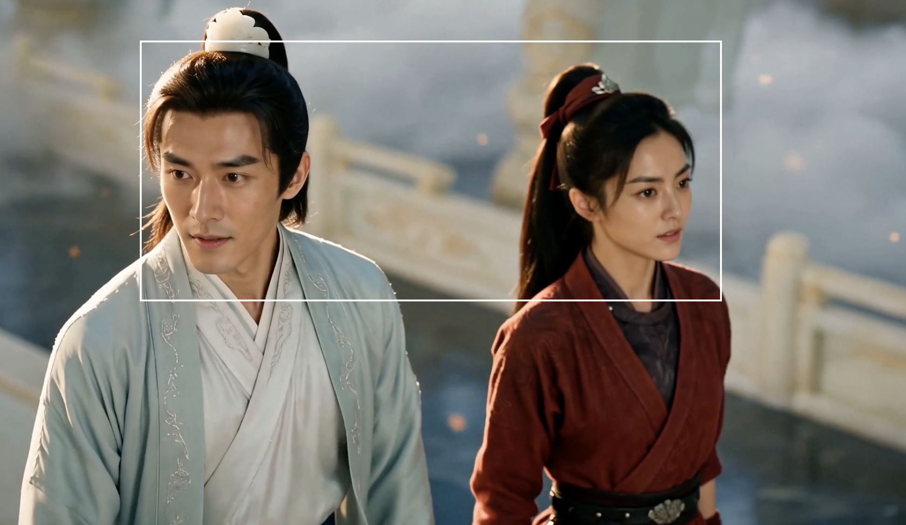 |

## 如何使用智能高清？ [​](#如何使用智能高清)

### 第一步：选择480P/720P生成视频 [​](#第一步-选择480p-720p生成视频)

选择「多参考」模式，在模型设置中选择 Seedance 2.0或Seedance 2.5，并生成480P/720P视频。

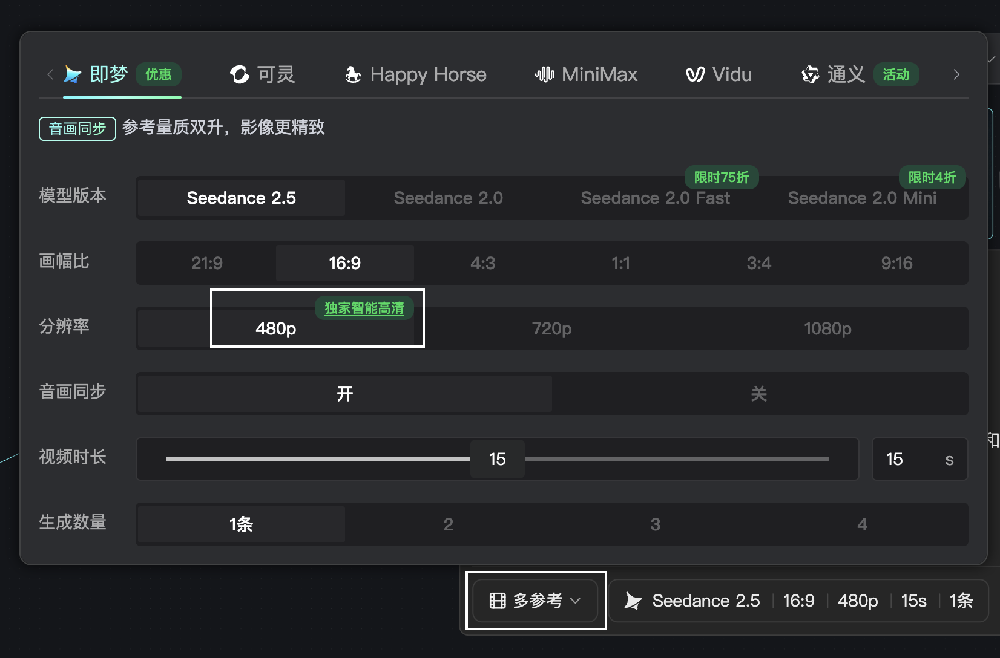

### 第二步：选中满意的480P/720P结果 [​](#第二步-选中满意的480p-720p结果)

生成完成后，在画布中选中满意的480P/720P视频。只有同时满足以下条件时，所选视频工具栏才会出现「智能高清」：

- 原任务使用多参考模式；
- 视频由 Seedance 2.0或Seedance 2.5生成；
- 原始输出分辨率为480P或720P。

### 第三步：选择输出清晰度并生成 [​](#第三步-选择输出清晰度并生成)

点击「智能高清」右侧的下拉箭头，选择需要的输出清晰度：1080P/4K。

选择清晰度后，系统会自动继承原任务的提示词和人物参考图片，并使用当前480P/720P视频作为参考生成高清版本。

提交前请确认本次生成所需积分。生成完成后，高清版本会作为一个新结果出现在画布中，原480P/720P视频不会被覆盖或删除。

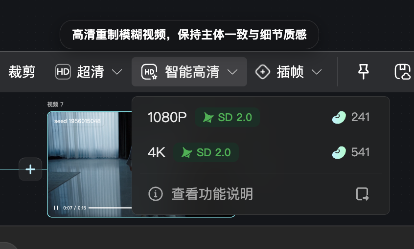

## FAQ [​](#faq)

### 什么场景适合使用智能高清，什么场景适合使用超清？ [​](#什么场景适合使用智能高清-什么场景适合使用超清)

| **使用场景** | **推荐功能** |
| --- | --- |
| 没有明确人物参考图的**文生视频**任务 | **超清** |
| 原视频内容和人物**已经稳定**且多为**中近景**，只需提升分辨率与整体清晰度 | **超清** |
| 多参考任务下**中远景**人物面部较小，存在五官模糊或变形 | **智能高清** |
| 多参考任务下人物快速运动、转头或镜头跟随时，人脸出现**动态模糊** | **智能高清** |
| 多参考任务下不同景别或镜头切换后，人物**样貌不够一致** | **智能高清** |
| 多参考任务下希望**保留满意的动作、构图和表演**，同时重新生成高清细节 | **智能高清** |

**超清**主要放大并增强原视频，适合人物和画面内容已经稳定、只需要提高清晰度的情况。

**智能高清**会结合当前480P视频、原任务提示词和人物参考图重新生成高清版本，更适合需要改善小脸细节、动态人脸模糊及主体一致性的场景。

### 如何让智能高清效果更稳定？ [​](#如何让智能高清效果更稳定)

使用智能高清时，原任务应包含**清晰、准确的人物参考图**。建议提供面部清晰、无遮挡、光线正常的人物参考图，并尽量覆盖正脸和侧脸，保持与视频人物接近的发型、妆容和服装状态。参考图越清晰、角度越完整，越有利于智能高清在远景、转头和快速运动中维持人物特征。**低清、严重遮挡或人物设定不一致的参考图，可能影响最终效果。**

人物参考图示范：

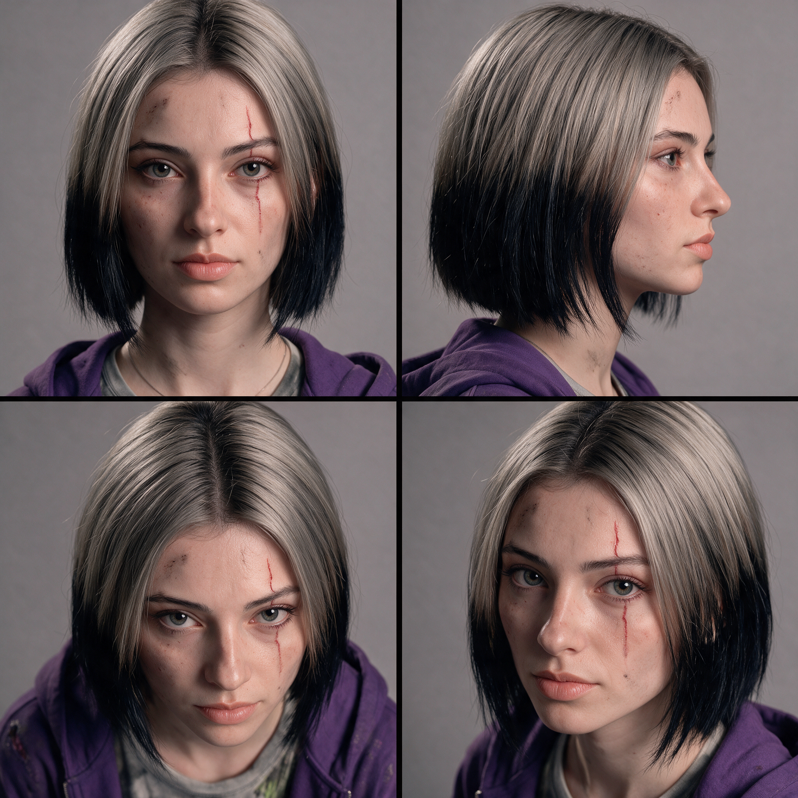

人物参考视频示范：

[[VIDEO] https://nadou.inter.71edge.com/cdn/oss/bj/ifilm/439ad0d9\_487ca5454c3a1d6286ab15ce46cf63df.mp4](_files_视频智能高清/video_7.mp4)

### 智能高清可以修复所有人脸和画面问题吗？ [​](#智能高清可以修复所有人脸和画面问题吗)

不能。智能高清主要用于在保留原视频动作、构图和表演的基础上，重新生成高清细节，但无法保证修复所有生成问题。**如果原本的480P/720P视频存在以下问题，建议重新生成视频**：

- 人物身份已经完全错误
- 肢体结构严重异常
- 动作、构图或运镜不符合预期
- 关键人物或物体缺失
- 视频内容明显偏离提示词

如果内容本身满意，只是清晰度不足、小脸模糊或动态人脸不稳定，则更适合使用智能高清。
